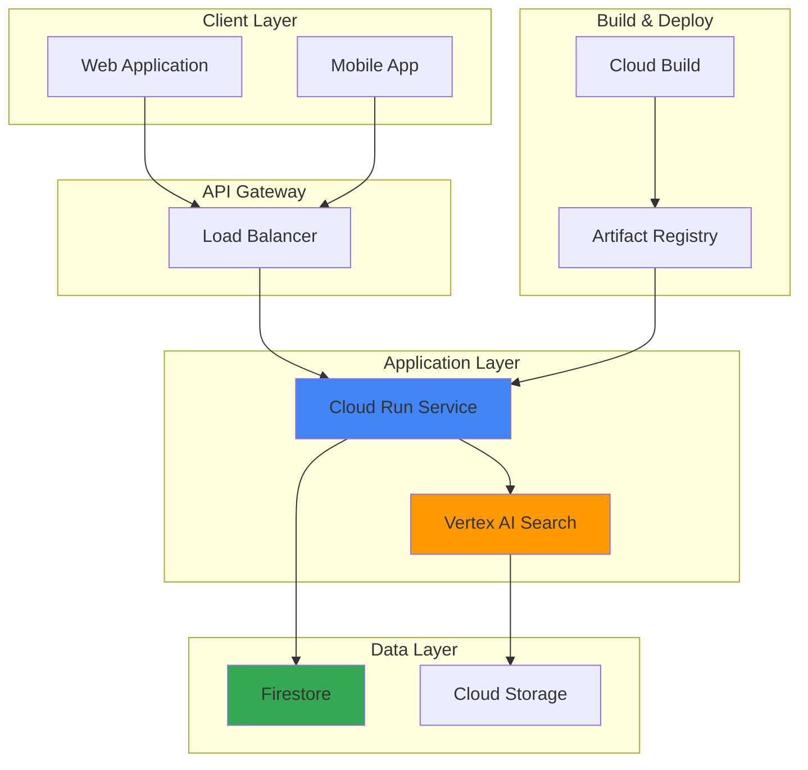

# Smart Product Catalog Management with Vertex AI Search and Cloud Run

## Problem

E-commerce businesses struggle with traditional keyword-based product search that fails to understand customer intent, leading to poor search experiences and reduced conversion rates. Customers often abandon searches when they can't find relevant products, while businesses lose revenue due to limited product discovery and lack of intelligent recommendations that could drive cross-selling opportunities.

## Solution

Build an intelligent product catalog system using Vertex AI Search for semantic understanding and recommendations, Cloud Run for scalable API services, and Firestore for real-time product data management. This solution provides AI-powered search capabilities that understand natural language queries, automated product categorization, and personalized recommendations that enhance customer experience and increase sales.

## Architecture Diagram



## Prerequisites

1. Google Cloud account with billing enabled and Owner or Editor permissions
2. Google Cloud CLI (gcloud) installed and configured
3. Basic knowledge of REST APIs and containerized applications
4. Estimated cost: $15-25 for initial setup and testing (varies by usage)
5. Docker installed locally for container builds

> **Note**: This recipe uses Google Cloud's AI and serverless services that scale automatically based on usage, making it cost-effective for both development and production environments.

## Preparation

```bash
# Set environment variables for GCP resources
export PROJECT_ID="smart-catalog-$(date +%s)"
export REGION="us-central1"
export ZONE="us-central1-a"

# Generate unique suffix for resource names
RANDOM_SUFFIX=$(openssl rand -hex 3)
export APP_NAME="product-catalog-${RANDOM_SUFFIX}"
export SEARCH_APP_ID="catalog-search-${RANDOM_SUFFIX}"
export DATASTORE_ID="products-${RANDOM_SUFFIX}"

# Set default project and region
gcloud config set project ${PROJECT_ID}
gcloud config set compute/region ${REGION}
gcloud config set compute/zone ${ZONE}

# Enable required APIs
gcloud services enable run.googleapis.com
gcloud services enable cloudbuild.googleapis.com
gcloud services enable firestore.googleapis.com
gcloud services enable discoveryengine.googleapis.com
gcloud services enable artifactregistry.googleapis.com

echo "✅ Project configured: ${PROJECT_ID}"
echo "✅ Required APIs enabled for AI-powered product catalog"
```

## Steps

1. **Create Firestore Database for Product Storage**:

   Firestore provides a NoSQL document database with real-time synchronization capabilities, perfect for storing product information that needs to be quickly accessible and updated. The native mode offers strong consistency and ACID transactions, ensuring data integrity for product catalog operations while supporting real-time updates for inventory changes and pricing modifications.

   ```bash
   # Create Firestore database in native mode
   gcloud firestore databases create \
       --region=${REGION} \
       --type=firestore-native
   
   echo "✅ Firestore database created for product storage"
   ```

   Your Firestore database is now ready to store product documents with automatic indexing and real-time synchronization. This foundation enables immediate product updates across all client applications while maintaining data consistency and supporting complex queries for product filtering and categorization.

2. **Set up Cloud Storage for Product Data and Search Engine**:

   Cloud Storage serves as the data source for Vertex AI Search, providing a scalable repository for product information that can be easily indexed and searched. The bucket configuration includes proper lifecycle management and regional storage for optimal performance and cost efficiency.

   ```bash
   # Create Cloud Storage bucket for product data
   export BUCKET_NAME="${PROJECT_ID}-product-data"
   gsutil mb -p ${PROJECT_ID} \
       -c STANDARD \
       -l ${REGION} \
       gs://${BUCKET_NAME}
   
   # Enable versioning for data protection
   gsutil versioning set on gs://${BUCKET_NAME}
   
   echo "✅ Cloud Storage bucket created: ${BUCKET_NAME}"
   ```

   The storage bucket is configured with versioning to protect against accidental data loss and supports the structured data formats required by Vertex AI Search for optimal indexing and retrieval performance.

3. **Create Sample Product Data**:

   Generate realistic product catalog data in JSONL format that Vertex AI Search can ingest and index. This sample data includes rich product information with categories, descriptions, and metadata that demonstrate semantic search capabilities and recommendation features.

   ```bash
   # Create sample product catalog data
   cat > products.jsonl << 'EOF'
{"id": "prod-001", "content": "Wireless Bluetooth Headphones - Premium noise-cancelling over-ear headphones with 30-hour battery life. Perfect for music lovers and professionals.", "category": "Electronics", "brand": "AudioTech", "price": 199.99, "rating": 4.5, "tags": ["wireless", "bluetooth", "noise-cancelling", "headphones"]}
{"id": "prod-002", "content": "Organic Cotton T-Shirt - Soft, comfortable, and sustainably made t-shirt available in multiple colors. Made from 100% organic cotton.", "category": "Clothing", "brand": "EcoWear", "price": 29.99, "rating": 4.3, "tags": ["organic", "cotton", "sustainable", "t-shirt"]}
{"id": "prod-003", "content": "Smart Fitness Tracker - Advanced health monitoring with heart rate, sleep tracking, and GPS. Water-resistant with 7-day battery life.", "category": "Fitness", "brand": "HealthTech", "price": 149.99, "rating": 4.7, "tags": ["fitness", "tracker", "health", "gps", "waterproof"]}
{"id": "prod-004", "content": "Professional Coffee Maker - Programmable drip coffee maker with thermal carafe and built-in grinder. Makes perfect coffee every time.", "category": "Kitchen", "brand": "BrewMaster", "price": 299.99, "rating": 4.4, "tags": ["coffee", "maker", "programmable", "grinder"]}
{"id": "prod-005", "content": "Wireless Gaming Mouse - High-precision gaming mouse with customizable RGB lighting and ergonomic design. Perfect for competitive gaming.", "category": "Electronics", "brand": "GameGear", "price": 79.99, "rating": 4.6, "tags": ["gaming", "mouse", "wireless", "rgb", "ergonomic"]}
EOF
   
   # Upload product data to Cloud Storage
   gsutil cp products.jsonl gs://${BUCKET_NAME}/
   
   echo "✅ Sample product data uploaded to Cloud Storage"
   ```

   The sample product data includes diverse categories and rich metadata that showcase Vertex AI Search's ability to understand product relationships, semantic similarities, and user intent across different product types and price ranges.

4. **Create Vertex AI Search Data Store**:

   Vertex AI Search provides enterprise-grade search capabilities powered by Google's large language models. Creating a data store establishes the foundation for semantic search that understands natural language queries and can provide relevant results even when exact keywords don't match product descriptions.

   ```bash
   # Create Vertex AI Search data store
   gcloud alpha discovery-engine data-stores create \
       --data-store-id=${DATASTORE_ID} \
       --display-name="Product Catalog Data Store" \
       --industry-vertical=GENERIC \
       --solution-types=SOLUTION_TYPE_SEARCH \
       --content-config=CONTENT_REQUIRED \
       --location=global
   
   echo "✅ Vertex AI Search data store created: ${DATASTORE_ID}"
   ```

   Your data store is now configured to index product information with advanced semantic understanding, enabling features like intent recognition, query expansion, and personalized search results that improve over time with user interactions.

5. **Import Product Data into Search Engine**:

   Import the product catalog data into Vertex AI Search to enable semantic search and recommendation capabilities. The import process automatically indexes the data and creates the necessary search infrastructure for fast, relevant query responses.

   ```bash
   # Import product data into Vertex AI Search
   gcloud alpha discovery-engine documents import \
       --data-store=${DATASTORE_ID} \
       --location=global \
       --gcs-uri="gs://${BUCKET_NAME}/products.jsonl" \
       --reconciliation-mode=INCREMENTAL
   
   echo "✅ Product data import initiated"
   echo "Note: Data indexing may take 5-10 minutes to complete"
   ```

   The import process creates searchable indices with semantic understanding, allowing the system to match user queries with relevant products even when the search terms don't exactly match the product descriptions, greatly improving search accuracy and user satisfaction.

6. **Create Vertex AI Search Application**:

   The search application provides the API endpoints and user interface for interacting with the indexed product data. This application combines search and recommendation capabilities in a single, managed service that automatically scales based on query volume.

   ```bash
   # Create Vertex AI Search application
   gcloud alpha discovery-engine engines create \
       --engine-id=${SEARCH_APP_ID} \
       --display-name="Product Catalog Search" \
       --data-store-ids=${DATASTORE_ID} \
       --industry-vertical=GENERIC \
       --solution-type=SOLUTION_TYPE_SEARCH \
       --location=global
   
   echo "✅ Vertex AI Search application created: ${SEARCH_APP_ID}"
   ```

   Your search application is now ready to handle complex queries with features like auto-complete, spell correction, faceted search, and personalized recommendations that enhance the customer shopping experience.

7. **Create Cloud Run Service Application**:

   Cloud Run provides a serverless platform for deploying containerized applications that automatically scale based on demand. Creating the application code establishes REST API endpoints that integrate Vertex AI Search with your product catalog, providing a clean interface for client applications.

   ```bash
   # Create application directory and source code
   mkdir -p app
   cd app
   
   # Create Python application with Vertex AI Search integration
   cat > main.py << 'EOF'
import os
from flask import Flask, request, jsonify
from google.cloud import discoveryengine
from google.cloud import firestore
import json

app = Flask(__name__)

# Initialize clients
search_client = discoveryengine.SearchServiceClient()
db = firestore.Client()

PROJECT_ID = os.environ.get('PROJECT_ID')
SEARCH_APP_ID = os.environ.get('SEARCH_APP_ID')
DATASTORE_ID = os.environ.get('DATASTORE_ID')

@app.route('/health')
def health_check():
    return jsonify({"status": "healthy", "service": "product-catalog"})

@app.route('/search')
def search_products():
    query = request.args.get('q', '')
    page_size = int(request.args.get('page_size', 10))
    
    if not query:
        return jsonify({"error": "Query parameter 'q' is required"}), 400
    
    try:
        # Configure search request
        serving_config = f"projects/{PROJECT_ID}/locations/global/collections/default_collection/engines/{SEARCH_APP_ID}/servingConfigs/default_config"
        
        search_request = discoveryengine.SearchRequest(
            serving_config=serving_config,
            query=query,
            page_size=page_size,
            content_search_spec=discoveryengine.SearchRequest.ContentSearchSpec(
                snippet_spec=discoveryengine.SearchRequest.ContentSearchSpec.SnippetSpec(
                    return_snippet=True
                ),
                summary_spec=discoveryengine.SearchRequest.ContentSearchSpec.SummarySpec(
                    summary_result_count=3
                )
            )
        )
        
        # Execute search
        response = search_client.search(search_request)
        
        # Process results
        results = []
        for result in response.results:
            doc_data = {}
            if hasattr(result.document, 'derived_struct_data'):
                doc_data = dict(result.document.derived_struct_data)
            
            results.append({
                "id": result.document.id,
                "content": doc_data.get('content', ''),
                "category": doc_data.get('category', ''),
                "brand": doc_data.get('brand', ''),
                "price": doc_data.get('price', 0),
                "rating": doc_data.get('rating', 0),
                "snippet": getattr(result.document, 'snippet', {}).get('snippet', '')
            })
        
        return jsonify({
            "query": query,
            "results": results,
            "total_results": len(results)
        })
        
    except Exception as e:
        return jsonify({"error": str(e)}), 500

@app.route('/recommend')
def get_recommendations():
    product_id = request.args.get('product_id', '')
    page_size = int(request.args.get('page_size', 5))
    
    if not product_id:
        return jsonify({"error": "Parameter 'product_id' is required"}), 400
    
    try:
        # Simple recommendation based on category similarity
        # In production, this would use Vertex AI Recommendations
        product_ref = db.collection('products').document(product_id)
        product_doc = product_ref.get()
        
        if not product_doc.exists:
            return jsonify({"error": "Product not found"}), 404
        
        product_data = product_doc.to_dict()
        category = product_data.get('category', '')
        
        # Find similar products in the same category
        similar_products = db.collection('products').where('category', '==', category).limit(page_size + 1).stream()
        
        recommendations = []
        for doc in similar_products:
            if doc.id != product_id:  # Exclude the current product
                recommendations.append({
                    "id": doc.id,
                    **doc.to_dict()
                })
        
        return jsonify({
            "product_id": product_id,
            "recommendations": recommendations[:page_size]
        })
        
    except Exception as e:
        return jsonify({"error": str(e)}), 500

if __name__ == '__main__':
    app.run(debug=True, host='0.0.0.0', port=int(os.environ.get('PORT', 8080)))
EOF
   
   # Create requirements file with latest library versions
   cat > requirements.txt << 'EOF'
Flask==3.0.3
google-cloud-discoveryengine==0.13.10
google-cloud-firestore==2.19.0
gunicorn==22.0.0
EOF
   
   echo "✅ Cloud Run application created with search and recommendation APIs"
   ```

   The application provides RESTful endpoints for product search and recommendations, integrating Vertex AI Search capabilities with custom business logic. The Flask-based service includes health checks, error handling, and structured response formats suitable for web and mobile client integration.

8. **Create Dockerfile and Deploy to Cloud Run**:

   Containerizing the application ensures consistent deployment across environments while Cloud Run's serverless architecture provides automatic scaling and cost optimization. The container includes all necessary dependencies and configuration for seamless integration with Google Cloud services.

   ```bash
   # Create Dockerfile for the application
   cat > Dockerfile << 'EOF'
FROM python:3.11-slim

WORKDIR /app

COPY requirements.txt .
RUN pip install --no-cache-dir -r requirements.txt

COPY . .

CMD exec gunicorn --bind :$PORT --workers 1 --threads 8 --timeout 0 main:app
EOF
   
   # Build and deploy to Cloud Run
   gcloud run deploy ${APP_NAME} \
       --source . \
       --platform managed \
       --region ${REGION} \
       --allow-unauthenticated \
       --set-env-vars PROJECT_ID=${PROJECT_ID},SEARCH_APP_ID=${SEARCH_APP_ID},DATASTORE_ID=${DATASTORE_ID} \
       --memory 1Gi \
       --cpu 1 \
       --timeout 300
   
   # Get the service URL
   SERVICE_URL=$(gcloud run services describe ${APP_NAME} \
       --region=${REGION} \
       --format="value(status.url)")
   echo "✅ Cloud Run service deployed at: ${SERVICE_URL}"
   ```

   Your Cloud Run service is now live with automatic HTTPS termination, scaling capabilities, and integration with Google Cloud's monitoring and logging infrastructure. The service can handle thousands of concurrent requests while maintaining low latency and cost efficiency.

9. **Store Sample Products in Firestore**:

   Add sample product data to Firestore to support the recommendation functionality. This step creates the operational database that complements the search index for real-time product information access.

   ```bash
   # Add sample products to Firestore using gcloud CLI
   cd ..
   cat > add_products.py << 'EOF'
import json
from google.cloud import firestore

# Initialize Firestore client
db = firestore.Client()

# Sample product data
products = [
    {"id": "prod-001", "content": "Wireless Bluetooth Headphones", "category": "Electronics", "brand": "AudioTech", "price": 199.99, "rating": 4.5},
    {"id": "prod-002", "content": "Organic Cotton T-Shirt", "category": "Clothing", "brand": "EcoWear", "price": 29.99, "rating": 4.3},
    {"id": "prod-003", "content": "Smart Fitness Tracker", "category": "Fitness", "brand": "HealthTech", "price": 149.99, "rating": 4.7},
    {"id": "prod-004", "content": "Professional Coffee Maker", "category": "Kitchen", "brand": "BrewMaster", "price": 299.99, "rating": 4.4},
    {"id": "prod-005", "content": "Wireless Gaming Mouse", "category": "Electronics", "brand": "GameGear", "price": 79.99, "rating": 4.6}
]

# Add products to Firestore
for product in products:
    doc_ref = db.collection('products').document(product['id'])
    doc_ref.set(product)
    print(f"Added product: {product['id']}")

print("✅ All products added to Firestore")
EOF
   
   # Run the script to add products
   python3 add_products.py
   
   echo "✅ Sample products added to Firestore database"
   ```

   The Firestore database now contains the product information needed for recommendation queries, enabling real-time access to product details and supporting advanced filtering and categorization features.

## Validation & Testing

1. **Verify Vertex AI Search data indexing status**:

   ```bash
   # Check search application status
   gcloud alpha discovery-engine engines describe ${SEARCH_APP_ID} \
       --location=global \
       --format="table(name,displayName,state)"
   ```

   Expected output: Engine should show as "ACTIVE" state indicating successful creation and data indexing.

2. **Test product search functionality**:

   ```bash
   # Test semantic search with natural language query
   curl "${SERVICE_URL}/search?q=wireless%20headphones&page_size=3" \
       -H "Content-Type: application/json"
   
   # Test category-based search
   curl "${SERVICE_URL}/search?q=fitness%20tracking&page_size=2" \
       -H "Content-Type: application/json"
   ```

   Expected output: JSON response with relevant product matches, including semantic understanding of query intent.

3. **Test recommendation system**:

   ```bash
   # Test product recommendations
   curl "${SERVICE_URL}/recommend?product_id=prod-001&page_size=3" \
       -H "Content-Type: application/json"
   ```

   Expected output: JSON response with recommended products based on similarity and category matching.

4. **Verify service health and performance**:

   ```bash
   # Check service health endpoint
   curl "${SERVICE_URL}/health"
   
   # Monitor Cloud Run service metrics
   gcloud run services describe ${APP_NAME} \
       --region=${REGION} \
       --format="table(status.conditions[].type,status.conditions[].status)"
   ```

## Cleanup

1. **Remove Cloud Run service and related resources**:

   ```bash
   # Delete Cloud Run service
   gcloud run services delete ${APP_NAME} \
       --region=${REGION} \
       --quiet
   
   echo "✅ Cloud Run service deleted"
   ```

2. **Remove Vertex AI Search resources**:

   ```bash
   # Delete search application
   gcloud alpha discovery-engine engines delete ${SEARCH_APP_ID} \
       --location=global \
       --quiet
   
   # Delete data store
   gcloud alpha discovery-engine data-stores delete ${DATASTORE_ID} \
       --location=global \
       --quiet
   
   echo "✅ Vertex AI Search resources deleted"
   ```

3. **Clean up storage and database resources**:

   ```bash
   # Remove Cloud Storage bucket and contents
   gsutil -m rm -r gs://${BUCKET_NAME}
   
   # Delete Firestore database (Note: requires manual confirmation)
   echo "Note: Firestore database deletion requires manual action in Console"
   echo "Go to: https://console.cloud.google.com/firestore/databases"
   
   echo "✅ Storage resources cleaned up"
   ```

4. **Remove project (if created specifically for this recipe)**:

   ```bash
   # Delete entire project and all resources
   gcloud projects delete ${PROJECT_ID} --quiet
   
   echo "✅ Project and all resources deleted"
   echo "Note: Project deletion may take several minutes to complete"
   ```

## Discussion

This recipe demonstrates how to build an intelligent product catalog management system that leverages Google Cloud's AI capabilities to provide superior search and recommendation experiences. Vertex AI Search brings together the power of large language models with Google's search expertise, enabling semantic understanding that goes beyond traditional keyword matching to understand user intent and context.

The integration of Cloud Run provides a serverless application platform that automatically scales based on demand, ensuring cost efficiency while maintaining high performance. The stateless nature of the application architecture allows for horizontal scaling during peak traffic periods, such as sales events or seasonal shopping spikes, without requiring manual intervention or capacity planning.

Firestore serves as the operational database, providing real-time synchronization capabilities essential for e-commerce applications where inventory levels, pricing, and product availability change frequently. The NoSQL document model aligns well with product catalog data structures, supporting flexible schemas that can accommodate diverse product types and evolving data requirements. The combination of strong consistency and real-time listeners ensures that all clients receive immediate updates when product information changes.

The architectural pattern implemented here follows Google Cloud's recommended practices for AI-powered applications, including proper separation of concerns between data storage, AI processing, and application logic. This design enables independent scaling of components and simplifies maintenance while providing clear integration points for additional features such as analytics, personalization, and inventory management systems.

> **Tip**: Monitor search query patterns and user interactions to continuously improve search relevance and recommendation accuracy. Vertex AI Search provides built-in analytics that can guide optimizations and feature enhancements.

For production deployments, consider implementing additional features such as user authentication with Identity and Access Management (IAM), request rate limiting with Cloud Armor, and comprehensive monitoring with Cloud Monitoring and Cloud Logging. The search system can be further enhanced with custom ranking models, faceted search filters, and integration with Google Analytics for deeper customer behavior insights.

**Documentation Sources:**
- [Vertex AI Search Documentation](https://cloud.google.com/generative-ai-app-builder/docs)
- [Cloud Run Documentation](https://cloud.google.com/run/docs)
- [Firestore Documentation](https://cloud.google.com/firestore/docs)
- [Google Cloud Architecture Center](https://cloud.google.com/architecture)
- [AI-Powered Search Best Practices](https://cloud.google.com/blog/products/ai-machine-learning/rags-powered-by-google-search-technology-part-1)

## Challenge

Extend this solution by implementing these enhancements:

1. **Add user personalization** by implementing Vertex AI Recommendations to provide personalized product suggestions based on user behavior, purchase history, and browsing patterns using collaborative filtering and content-based algorithms.

2. **Implement advanced search filters** by adding faceted search capabilities with price ranges, brand filters, ratings, and availability status, allowing customers to refine search results and improve product discovery.

3. **Create a real-time inventory integration** by connecting Firestore with Cloud Functions to automatically update product availability in search results and trigger notifications when items go out of stock or back in stock.

4. **Build analytics and insights dashboard** using BigQuery and Looker Studio to analyze search patterns, popular products, conversion rates, and customer behavior to inform business decisions and optimize catalog performance.

5. **Implement multi-language support** by leveraging Cloud Translation API to automatically translate product descriptions and enable search in multiple languages, expanding market reach and improving international customer experience.

## Infrastructure Code

*Infrastructure code will be generated after recipe approval.*