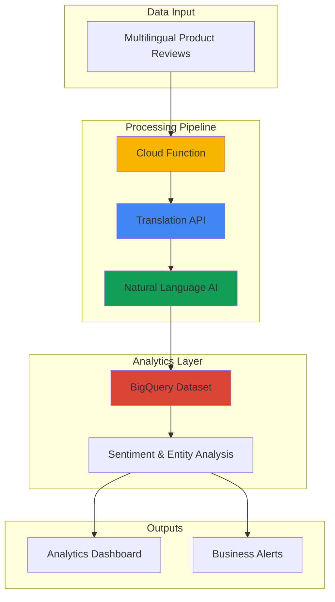

# Smart Product Review Analysis with Translation and Natural Language AI

## Problem

Global e-commerce businesses receive customer product reviews in dozens of languages, making it impossible to understand customer sentiment and extract actionable insights at scale. Manual translation and analysis is time-consuming, expensive, and doesn't scale with business growth. Without unified analysis capabilities, businesses lose valuable customer feedback that could improve products, marketing, and customer satisfaction across different markets and regions.

## Solution

Create an automated pipeline using Google Cloud Translation API to standardize reviews into English, then apply Natural Language AI for sentiment analysis and entity extraction. Cloud Functions orchestrates the processing workflow while BigQuery stores and enables analytics on the enriched review data. This serverless approach scales automatically with review volume and provides real-time insights across all global markets.

## Architecture Diagram



## Prerequisites

1. GCP account with billing enabled and appropriate permissions for Cloud Functions, Translation API, Natural Language API, and BigQuery
2. Google Cloud CLI installed and configured (or Cloud Shell)
3. Basic understanding of JSON data structures and SQL queries
4. Familiarity with serverless functions and API integration concepts
5. Estimated cost: $10-15 for testing (includes API calls, function execution, and BigQuery storage)

> **Note**: Google Cloud provides $300 in free credits for new accounts, which is sufficient for this recipe and additional experimentation.

## Preparation

```bash
# Set environment variables for GCP resources
export PROJECT_ID="review-analysis-$(date +%s)"
export REGION="us-central1"
export ZONE="us-central1-a"

# Generate unique suffix for resource names
RANDOM_SUFFIX=$(openssl rand -hex 3)

# Set default project and region
gcloud config set project ${PROJECT_ID}
gcloud config set compute/region ${REGION}
gcloud config set compute/zone ${ZONE}

# Enable required APIs
gcloud services enable cloudfunctions.googleapis.com
gcloud services enable translate.googleapis.com
gcloud services enable language.googleapis.com
gcloud services enable bigquery.googleapis.com
gcloud services enable cloudbuild.googleapis.com

echo "✅ Project configured: ${PROJECT_ID}"

# Create BigQuery dataset for storing review analysis
export DATASET_NAME="product_reviews_${RANDOM_SUFFIX}"
bq mk --dataset \
    --description="Dataset for multilingual product review analysis" \
    --location=${REGION} \
    ${PROJECT_ID}:${DATASET_NAME}

echo "✅ BigQuery dataset created: ${DATASET_NAME}"

# Create the review analysis table
bq mk --table \
    ${PROJECT_ID}:${DATASET_NAME}.review_analysis \
    review_id:STRING,original_text:STRING,original_language:STRING,translated_text:STRING,sentiment_score:FLOAT,sentiment_magnitude:FLOAT,sentiment_label:STRING,entities:STRING,processing_timestamp:TIMESTAMP

echo "✅ BigQuery table created for review analysis"
```

## Steps

1. **Create the Cloud Function for Review Processing**:

   Cloud Functions provides serverless execution that automatically scales based on incoming requests. The function will orchestrate the translation and natural language analysis workflow, ensuring reliable processing of reviews regardless of volume. This approach eliminates infrastructure management while providing cost-effective, event-driven processing.

   ```bash
   # Create directory for function code
   mkdir review-analysis-function
   cd review-analysis-function
   
   # Create requirements.txt for Python dependencies
   cat > requirements.txt << 'EOF'
   google-cloud-translate==3.15.5
   google-cloud-language==2.13.4
   google-cloud-bigquery==3.25.0
   functions-framework==3.8.1
   EOF
   
   echo "✅ Function dependencies configured"
   ```

   The requirements include the latest Google Cloud client libraries for Translation, Natural Language AI, and BigQuery, enabling seamless integration between services with proper authentication and error handling built into the Google Cloud ecosystem.

2. **Implement the Review Analysis Function**:

   The function integrates multiple Google Cloud AI services to create a comprehensive analysis pipeline. Translation API supports over 100 languages with automatic language detection, while Natural Language AI provides sophisticated sentiment analysis and entity extraction using Google's machine learning models.

   ```bash
   # Create the main function code
   cat > main.py << 'EOF'
   import functions_framework
   import json
   import logging
   from datetime import datetime
   from google.cloud import translate_v2 as translate
   from google.cloud import language_v1
   from google.cloud import bigquery
   
   # Initialize clients
   translate_client = translate.Client()
   language_client = language_v1.LanguageServiceClient()
   bigquery_client = bigquery.Client()
   
   logging.basicConfig(level=logging.INFO)
   
   @functions_framework.http
   def analyze_review(request):
       """Analyze product review with translation and sentiment analysis."""
       try:
           # Parse request JSON
           request_json = request.get_json(silent=True)
           if not request_json:
               return {'error': 'Invalid JSON payload'}, 400
           
           review_id = request_json.get('review_id')
           review_text = request_json.get('review_text')
           
           if not review_id or not review_text:
               return {'error': 'Missing review_id or review_text'}, 400
           
           # Detect source language
           detection = translate_client.detect_language(review_text)
           source_language = detection['language']
           confidence = detection['confidence']
           
           logging.info(f"Detected language: {source_language} (confidence: {confidence})")
           
           # Translate to English if not already English
           translated_text = review_text
           if source_language != 'en':
               translation = translate_client.translate(
                   review_text,
                   target_language='en',
                   source_language=source_language
               )
               translated_text = translation['translatedText']
           
           # Perform sentiment analysis on translated text
           document = language_v1.Document(
               content=translated_text,
               type_=language_v1.Document.Type.PLAIN_TEXT
           )
           
           # Analyze sentiment
           sentiment_response = language_client.analyze_sentiment(
               request={"document": document}
           )
           sentiment = sentiment_response.document_sentiment
           
           # Determine sentiment label
           if sentiment.score > 0.1:
               sentiment_label = 'positive'
           elif sentiment.score < -0.1:
               sentiment_label = 'negative'
           else:
               sentiment_label = 'neutral'
           
           # Extract entities
           entities_response = language_client.analyze_entities(
               request={"document": document}
           )
           
           entities = []
           for entity in entities_response.entities:
               entities.append({
                   'name': entity.name,
                   'type': entity.type_.name,
                   'salience': entity.salience
               })
           
           # Prepare data for BigQuery
           analysis_result = {
               'review_id': review_id,
               'original_text': review_text,
               'original_language': source_language,
               'translated_text': translated_text,
               'sentiment_score': sentiment.score,
               'sentiment_magnitude': sentiment.magnitude,
               'sentiment_label': sentiment_label,
               'entities': json.dumps(entities),
               'processing_timestamp': datetime.utcnow().isoformat()
           }
           
           # Insert into BigQuery
           dataset_id = request_json.get('dataset_id', 'product_reviews')
           table_id = 'review_analysis'
           
           table_ref = bigquery_client.dataset(dataset_id).table(table_id)
           table = bigquery_client.get_table(table_ref)
           
           errors = bigquery_client.insert_rows_json(table, [analysis_result])
           
           if errors:
               logging.error(f"BigQuery insert errors: {errors}")
               return {'error': 'Failed to insert data into BigQuery'}, 500
           
           logging.info(f"Successfully processed review {review_id}")
           
           return {
               'status': 'success',
               'review_id': review_id,
               'original_language': source_language,
               'sentiment_label': sentiment_label,
               'sentiment_score': sentiment.score,
               'entities_count': len(entities)
           }
           
       except Exception as e:
           logging.error(f"Error processing review: {str(e)}")
           return {'error': str(e)}, 500
   EOF
   
   echo "✅ Function code created with comprehensive error handling"
   ```

   This function implements a robust processing pipeline with automatic language detection, translation when needed, sentiment analysis, and entity extraction. The integration with BigQuery ensures all analysis results are stored in a structured format for further analytics and business intelligence.

3. **Deploy the Cloud Function**:

   Cloud Functions automatically handles scaling, monitoring, and infrastructure management. The deployment creates a secure HTTPS endpoint that can process review analysis requests with built-in authentication, logging, and error tracking through Google Cloud's operational suite.

   ```bash
   # Deploy the function with appropriate memory and timeout settings
   export FUNCTION_NAME="review-analysis-${RANDOM_SUFFIX}"
   
   gcloud functions deploy ${FUNCTION_NAME} \
       --runtime python312 \
       --trigger-http \
       --allow-unauthenticated \
       --source . \
       --entry-point analyze_review \
       --memory 512MB \
       --timeout 60s \
       --set-env-vars DATASET_ID=${DATASET_NAME} \
       --region=${REGION}
   
   # Get the function URL
   export FUNCTION_URL=$(gcloud functions describe ${FUNCTION_NAME} \
       --region=${REGION} \
       --format="value(httpsTrigger.url)")
   
   echo "✅ Cloud Function deployed successfully"
   echo "Function URL: ${FUNCTION_URL}"
   ```

   The function is now deployed with the latest Python 3.12 runtime and optimized memory allocation and timeout settings for AI API processing. The HTTPS trigger enables integration with various applications, while environment variables provide configuration flexibility for different deployment environments.

4. **Create Sample Review Data**:

   Testing with diverse multilingual reviews demonstrates the system's capability to handle real-world scenarios. The sample data includes reviews in different languages with varying sentiment levels, providing comprehensive validation of the translation and analysis pipeline.

   ```bash
   # Create sample review data in multiple languages
   cat > sample_reviews.json << 'EOF'
   [
     {
       "review_id": "rev_001",
       "review_text": "Este producto es excelente. La calidad es muy buena y el servicio al cliente fue fantástico.",
       "dataset_id": "'"${DATASET_NAME}"'"
     },
     {
       "review_id": "rev_002", 
       "review_text": "Das Produkt ist okay, aber der Versand war zu langsam. Könnte besser sein.",
       "dataset_id": "'"${DATASET_NAME}"'"
     },
     {
       "review_id": "rev_003",
       "review_text": "Cette montre est magnifique! Design élégant et fonctionnalités parfaites.",
       "dataset_id": "'"${DATASET_NAME}"'"
     },
     {
       "review_id": "rev_004",
       "review_text": "The product quality is terrible. Broke after one week. Very disappointing experience.",
       "dataset_id": "'"${DATASET_NAME}"'"
     },
     {
       "review_id": "rev_005",
       "review_text": "商品の品質は素晴らしいです。配送も迅速で、カスタマーサービスも親切でした。",
       "dataset_id": "'"${DATASET_NAME}"'"
     }
   ]
   EOF
   
   echo "✅ Sample multilingual review data created"
   ```

   The sample dataset includes Spanish, German, French, English, and Japanese reviews, demonstrating the system's ability to handle diverse languages and extract meaningful insights from global customer feedback.

5. **Process Sample Reviews**:

   Processing the sample reviews demonstrates the complete pipeline from multilingual input to structured analytics data. Each API call triggers the full workflow: language detection, translation, sentiment analysis, entity extraction, and BigQuery storage.

   ```bash
   # Process each sample review through the function
   echo "Processing sample reviews..."
   
   for review in $(cat sample_reviews.json | jq -c '.[]'); do
       echo "Processing review: $(echo $review | jq -r '.review_id')"
       
       curl -X POST \
           -H "Content-Type: application/json" \
           -d "$review" \
           "${FUNCTION_URL}"
       
       echo ""
       sleep 2  # Brief pause between requests
   done
   
   echo "✅ All sample reviews processed"
   ```

   The processing demonstrates real-time analysis capabilities with each review being translated, analyzed, and stored within seconds. The structured output enables immediate querying and analysis of customer sentiment across different languages and markets.

6. **Create Analytics Queries**:

   BigQuery's SQL interface enables sophisticated analysis of the processed review data. These queries demonstrate common business intelligence use cases, from sentiment distribution to entity analysis, providing actionable insights for product and marketing teams.

   ```bash
   # Create useful analytics queries
   cat > analytics_queries.sql << 'EOF'
   -- Overall sentiment distribution
   SELECT 
     sentiment_label,
     COUNT(*) as review_count,
     ROUND(AVG(sentiment_score), 3) as avg_sentiment_score,
     ROUND(AVG(sentiment_magnitude), 3) as avg_magnitude
   FROM `'"${PROJECT_ID}"'.'"${DATASET_NAME}"'.review_analysis`
   GROUP BY sentiment_label
   ORDER BY review_count DESC;
   
   -- Language distribution and sentiment by language
   SELECT 
     original_language,
     COUNT(*) as review_count,
     ROUND(AVG(sentiment_score), 3) as avg_sentiment,
     COUNTIF(sentiment_label = 'positive') as positive_reviews,
     COUNTIF(sentiment_label = 'negative') as negative_reviews,
     COUNTIF(sentiment_label = 'neutral') as neutral_reviews
   FROM `'"${PROJECT_ID}"'.'"${DATASET_NAME}"'.review_analysis`
   GROUP BY original_language
   ORDER BY review_count DESC;
   
   -- Most mentioned entities across all reviews
   SELECT 
     JSON_EXTRACT_SCALAR(entity, '$.name') as entity_name,
     JSON_EXTRACT_SCALAR(entity, '$.type') as entity_type,
     COUNT(*) as mentions,
     ROUND(AVG(CAST(JSON_EXTRACT_SCALAR(entity, '$.salience') AS FLOAT64)), 3) as avg_salience
   FROM `'"${PROJECT_ID}"'.'"${DATASET_NAME}"'.review_analysis`,
     UNNEST(JSON_EXTRACT_ARRAY(entities)) as entity
   GROUP BY entity_name, entity_type
   HAVING mentions > 1
   ORDER BY mentions DESC, avg_salience DESC;
   
   -- Recent review trends
   SELECT 
     DATE(processing_timestamp) as review_date,
     COUNT(*) as daily_reviews,
     ROUND(AVG(sentiment_score), 3) as daily_avg_sentiment,
     STRING_AGG(DISTINCT original_language) as languages_received
   FROM `'"${PROJECT_ID}"'.'"${DATASET_NAME}"'.review_analysis`
   GROUP BY review_date
   ORDER BY review_date DESC;
   EOF
   
   echo "✅ Analytics queries created for business insights"
   ```

   These queries provide comprehensive business intelligence capabilities, enabling teams to understand customer sentiment trends, identify frequently mentioned product features, and track global market feedback patterns in real-time.

## Validation & Testing

1. **Verify Cloud Function deployment and functionality**:

   ```bash
   # Check function status and configuration
   gcloud functions describe ${FUNCTION_NAME} \
       --region=${REGION} \
       --format="table(name,status,runtime,timeout)"
   
   # Test function with a simple request
   curl -X POST \
       -H "Content-Type: application/json" \
       -d '{"review_id":"test_001","review_text":"This is a test review","dataset_id":"'"${DATASET_NAME}"'"}' \
       "${FUNCTION_URL}"
   ```

   Expected output: JSON response with status "success" and analysis results including sentiment score and detected entities.

2. **Validate BigQuery data ingestion**:

   ```bash
   # Check total number of processed reviews
   bq query --use_legacy_sql=false \
       "SELECT COUNT(*) as total_reviews FROM \`${PROJECT_ID}.${DATASET_NAME}.review_analysis\`"
   
   # Verify data quality and completeness
   bq query --use_legacy_sql=false \
       "SELECT review_id, original_language, sentiment_label, 
        CHAR_LENGTH(translated_text) as translated_length 
        FROM \`${PROJECT_ID}.${DATASET_NAME}.review_analysis\` 
        LIMIT 5"
   ```

   Expected output: Count showing 6 reviews (5 samples + 1 test), with complete data for all fields and proper language detection.

3. **Test analytics queries**:

   ```bash
   # Run sentiment distribution analysis
   bq query --use_legacy_sql=false \
       "$(sed -n '1,8p' analytics_queries.sql | tr '\n' ' ')"
   
   # Test language distribution query
   bq query --use_legacy_sql=false \
       "$(sed -n '10,19p' analytics_queries.sql | tr '\n' ' ')"
   ```

   Expected output: Tables showing sentiment distribution across languages and comprehensive analytics demonstrating the system's multilingual analysis capabilities.

## Cleanup

1. **Remove Cloud Function and associated resources**:

   ```bash
   # Delete the Cloud Function
   gcloud functions delete ${FUNCTION_NAME} \
       --region=${REGION} \
       --quiet
   
   echo "✅ Cloud Function deleted"
   ```

2. **Remove BigQuery dataset and data**:

   ```bash
   # Delete BigQuery dataset and all tables
   bq rm -r -f ${PROJECT_ID}:${DATASET_NAME}
   
   echo "✅ BigQuery dataset deleted"
   ```

3. **Clean up local files and environment**:

   ```bash
   # Remove local function code
   cd ..
   rm -rf review-analysis-function
   
   # Clean up environment variables
   unset PROJECT_ID REGION ZONE RANDOM_SUFFIX DATASET_NAME
   unset FUNCTION_NAME FUNCTION_URL
   
   echo "✅ Local cleanup completed"
   echo "Note: API quotas will reset automatically. No ongoing costs remain."
   ```

## Discussion

This recipe demonstrates how Google Cloud's AI and analytics services can be combined to create sophisticated, scalable business intelligence solutions. The Cloud Translation API provides high-quality translation with support for over 100 languages and automatic language detection, enabling global businesses to understand customer feedback regardless of the source language. The Natural Language AI service offers advanced sentiment analysis and entity extraction using Google's machine learning models, providing deeper insights than simple keyword-based approaches.

The serverless architecture using Cloud Functions ensures the solution scales automatically with business growth while maintaining cost efficiency through pay-per-use pricing. Cloud Functions handle the orchestration between services, providing reliability and error handling without requiring infrastructure management. BigQuery serves as the analytics foundation, offering petabyte-scale storage and real-time query capabilities that enable immediate business insights from processed review data.

The integration pattern demonstrated here follows Google Cloud best practices for data pipeline architecture, with proper error handling, logging, and monitoring built into each component. The solution can be extended to handle various data sources including e-commerce platforms, social media feeds, and customer support systems. Security is maintained through Google Cloud's IAM system and automatic encryption of data in transit and at rest.

Key architectural decisions include using HTTP triggers for flexible integration, JSON format for structured data exchange, and BigQuery's columnar storage for efficient analytics queries. The pipeline processes reviews in real-time but can also handle batch processing for historical data analysis. Cost optimization is achieved through serverless execution and BigQuery's query-based pricing model. The use of Python 3.12 runtime ensures access to the latest language features and security updates.

> **Tip**: Monitor API usage and implement caching strategies for frequently translated content to optimize costs while maintaining performance. Consider using Cloud Storage for archiving raw review data and implementing data lifecycle policies for long-term storage management.

For production deployments, consider implementing additional security measures such as API authentication, request rate limiting, and data anonymization for sensitive customer information. The Natural Language API provides confidence scores for all analysis results, enabling quality thresholds for automated processing decisions. Integration with Cloud Monitoring and Cloud Logging provides comprehensive observability for the entire pipeline.

**Sources:**
- [Google Cloud Translation API Documentation](https://cloud.google.com/translate/docs)
- [Natural Language AI API Documentation](https://cloud.google.com/natural-language/docs)
- [Cloud Functions Best Practices](https://cloud.google.com/functions/docs/bestpractices)
- [BigQuery Analytics Documentation](https://cloud.google.com/bigquery/docs)
- [Google Cloud Architecture Framework](https://cloud.google.com/architecture/framework)
- [Cloud Functions Runtime Support](https://cloud.google.com/functions/docs/runtime-support)

## Challenge

Extend this solution by implementing these enhancements:

1. **Real-time Dashboard Integration**: Connect the BigQuery results to Looker Studio to create interactive dashboards showing sentiment trends, geographic analysis, and product performance metrics updated in real-time.

2. **Advanced Entity Analysis**: Implement custom entity extraction for product-specific attributes (features, competitors, price mentions) using AutoML Natural Language to create industry-specific insights beyond generic entity detection.

3. **Automated Alert System**: Add Cloud Pub/Sub integration to trigger notifications when sentiment scores drop below thresholds or when specific negative keywords are detected, enabling proactive customer service responses.

4. **Multi-modal Analysis**: Extend the pipeline to analyze product images mentioned in reviews using Cloud Vision API, correlating visual sentiment with text sentiment for comprehensive product feedback analysis.

5. **Historical Trend Analysis**: Implement time-series analysis using BigQuery ML to predict sentiment trends, seasonal patterns, and anomaly detection for proactive business intelligence and inventory planning.

## Infrastructure Code

### Available Infrastructure as Code:

- [Infrastructure Code Overview](code/README.md) - Detailed description of all infrastructure components
- [Infrastructure Manager](code/infrastructure-manager/) - GCP Infrastructure Manager templates
- [Bash CLI Scripts](code/scripts/) - Example bash scripts using gcloud CLI commands to deploy infrastructure
- [Terraform](code/terraform/) - Terraform configuration files