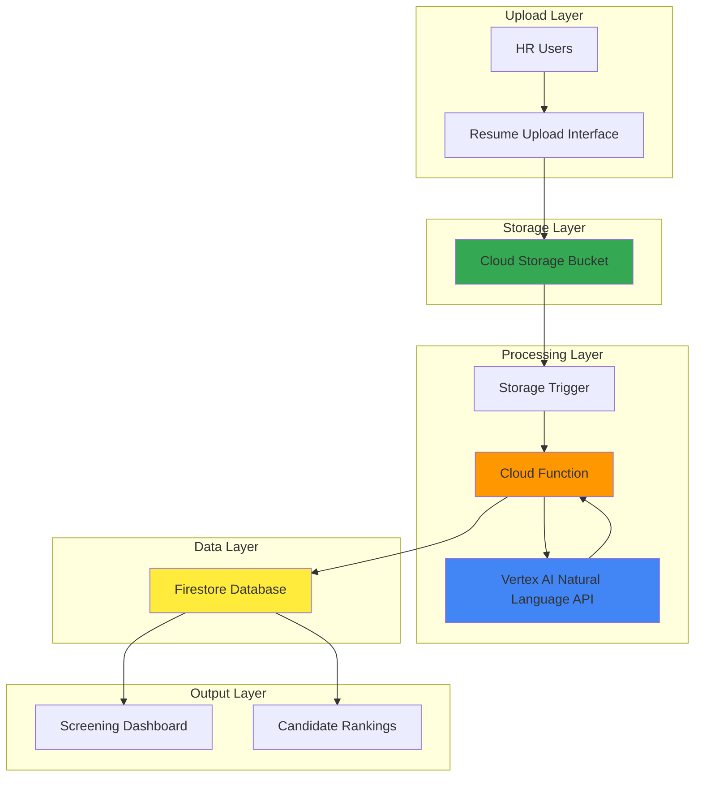

# Smart Resume Screening with Vertex AI and Cloud Functions

## Problem

HR departments manually review hundreds of resumes for each job posting, spending countless hours on initial screening processes that could be automated. This manual approach leads to inconsistent evaluation criteria, unconscious bias, and significant delays in identifying qualified candidates, ultimately slowing down the hiring process and increasing costs.

## Solution

Implement an AI-powered resume screening system using Vertex AI for natural language processing and document analysis, Cloud Functions for serverless processing, Cloud Storage for resume uploads, and Firestore for storing candidate profiles and screening results. This automated solution provides consistent evaluation criteria, reduces bias, and accelerates the initial screening process.

## Architecture Diagram



## Prerequisites

1. GCP account with billing enabled and appropriate permissions for Vertex AI, Cloud Functions, Cloud Storage, and Firestore
2. gcloud CLI installed and configured (or use Cloud Shell)
3. Basic understanding of serverless architectures and AI/ML concepts
4. Knowledge of Python for customizing screening logic
5. Estimated cost: $5-15 for testing (mainly Vertex AI API calls and Cloud Functions execution)

> **Note**: Vertex AI Natural Language API pricing varies by request volume. Review [Vertex AI pricing](https://cloud.google.com/vertex-ai/pricing) for current rates.

## Preparation

```bash
# Set environment variables for GCP resources
export PROJECT_ID="resume-screening-$(date +%s)"
export REGION="us-central1"
export ZONE="us-central1-a"

# Generate unique suffix for resource names
RANDOM_SUFFIX=$(openssl rand -hex 3)

# Set default project and region
gcloud config set project ${PROJECT_ID}
gcloud config set compute/region ${REGION}
gcloud config set compute/zone ${ZONE}

# Enable required APIs
gcloud services enable cloudfunctions.googleapis.com
gcloud services enable storage.googleapis.com
gcloud services enable firestore.googleapis.com
gcloud services enable aiplatform.googleapis.com
gcloud services enable cloudbuild.googleapis.com
gcloud services enable language.googleapis.com

echo "✅ Project configured: ${PROJECT_ID}"

# Create storage bucket for resumes
export BUCKET_NAME="resume-uploads-${RANDOM_SUFFIX}"
gsutil mb -p ${PROJECT_ID} \
    -c STANDARD \
    -l ${REGION} \
    gs://${BUCKET_NAME}

echo "✅ Storage bucket created: ${BUCKET_NAME}"

# Initialize Firestore database
gcloud firestore databases create \
    --location=${REGION} \
    --type=firestore-native

echo "✅ Firestore database initialized"
```

## Steps

1. **Create Cloud Function source code for resume processing**:

   Cloud Functions provides serverless event processing that automatically scales based on storage events. The function will be triggered when resumes are uploaded to Cloud Storage, leveraging Google Cloud's Natural Language API to extract key information and generate screening scores. This event-driven architecture eliminates the need for manual processing while ensuring consistent evaluation criteria across all candidates.

   ```bash
   # Create function directory and files
   mkdir resume-processor && cd resume-processor
   
   # Create main function file
   cat << 'EOF' > main.py
   import functions_framework
   from google.cloud import storage
   from google.cloud import firestore
   from google.cloud import language_v1
   import json
   import re
   from datetime import datetime
   import os

   # Initialize clients
   storage_client = storage.Client()
   firestore_client = firestore.Client()
   language_client = language_v1.LanguageServiceClient()
   
   @functions_framework.cloud_event
   def process_resume(cloud_event):
       """Triggered by Cloud Storage object creation."""
       data = cloud_event.data
       
       bucket_name = data["bucket"]
       file_name = data["name"]
       
       # Skip if not a resume file
       if not file_name.lower().endswith(('.pdf', '.doc', '.docx', '.txt')):
           return
       
       try:
           # Download and extract text from resume
           resume_text = extract_text_from_file(bucket_name, file_name)
           
           # Analyze resume with Natural Language API
           analysis_result = analyze_resume_with_ai(resume_text)
           
           # Generate screening score
           screening_score = calculate_screening_score(analysis_result)
           
           # Store results in Firestore
           candidate_data = {
               'file_name': file_name,
               'upload_timestamp': datetime.now(),
               'resume_text': resume_text,
               'skills_extracted': analysis_result.get('skills', []),
               'experience_years': analysis_result.get('experience_years', 0),
               'education_level': analysis_result.get('education_level', ''),
               'screening_score': screening_score,
               'sentiment_score': analysis_result.get('sentiment_score', 0.0),
               'entity_analysis': analysis_result.get('entities', []),
               'processed_timestamp': datetime.now()
           }
           
           # Store in Firestore
           doc_ref = firestore_client.collection('candidates').document()
           doc_ref.set(candidate_data)
           
           print(f"Successfully processed resume: {file_name}")
           
       except Exception as e:
           print(f"Error processing resume {file_name}: {str(e)}")

   def extract_text_from_file(bucket_name, file_name):
       """Extract text content from uploaded file."""
       bucket = storage_client.bucket(bucket_name)
       blob = bucket.blob(file_name)
       
       # For demo purposes, assume text files
       # In production, use Document AI or other text extraction services
       if file_name.lower().endswith('.txt'):
           return blob.download_as_text()
       else:
           # Placeholder for PDF/DOC processing
           return f"Sample resume content from {file_name}"

   def analyze_resume_with_ai(resume_text):
       """Analyze resume using Google Cloud Natural Language API."""
       # Create document object for Natural Language API
       document = language_v1.Document(
           content=resume_text,
           type_=language_v1.Document.Type.PLAIN_TEXT
       )
       
       # Analyze sentiment
       sentiment_response = language_client.analyze_sentiment(
           request={'document': document}
       )
       
       # Analyze entities
       entities_response = language_client.analyze_entities(
           request={'document': document}
       )
       
       # Extract skills and experience using regex patterns
       skills = extract_skills(resume_text)
       experience_years = extract_experience_years(resume_text)
       education_level = extract_education_level(resume_text)
       
       return {
           'sentiment_score': sentiment_response.document_sentiment.score,
           'entities': [entity.name for entity in entities_response.entities],
           'skills': skills,
           'experience_years': experience_years,
           'education_level': education_level
       }

   def extract_skills(text):
       """Extract technical skills from resume text."""
       skill_patterns = [
           r'\b(?:Python|Java|JavaScript|React|Node\.js|SQL|AWS|GCP|Docker|Kubernetes)\b',
           r'\b(?:Machine Learning|Data Science|AI|Analytics|Cloud Computing)\b'
       ]
       
       skills = []
       for pattern in skill_patterns:
           matches = re.findall(pattern, text, re.IGNORECASE)
           skills.extend(matches)
       
       return list(set(skills))

   def extract_experience_years(text):
       """Extract years of experience from resume text."""
       experience_pattern = r'(\d+)\+?\s*(?:years?|yrs?)\s*(?:of\s*)?(?:experience|exp)'
       matches = re.findall(experience_pattern, text, re.IGNORECASE)
       
       if matches:
           return max([int(match) for match in matches])
       return 0

   def extract_education_level(text):
       """Extract highest education level."""
       if re.search(r'\b(?:PhD|Ph\.D|Doctorate)\b', text, re.IGNORECASE):
           return 'PhD'
       elif re.search(r'\b(?:Master|M\.S|M\.A|MBA)\b', text, re.IGNORECASE):
           return 'Masters'
       elif re.search(r'\b(?:Bachelor|B\.S|B\.A|B\.Tech)\b', text, re.IGNORECASE):
           return 'Bachelors'
       else:
           return 'Other'

   def calculate_screening_score(analysis_result):
       """Calculate overall screening score based on extracted information."""
       score = 0
       
       # Experience score (max 40 points)
       experience_years = analysis_result.get('experience_years', 0)
       score += min(experience_years * 4, 40)
       
       # Education score (max 30 points)
       education_scores = {
           'PhD': 30,
           'Masters': 25,
           'Bachelors': 20,
           'Other': 10
       }
       score += education_scores.get(analysis_result.get('education_level', 'Other'), 10)
       
       # Skills score (max 20 points)
       skills_count = len(analysis_result.get('skills', []))
       score += min(skills_count * 2, 20)
       
       # Sentiment score (max 10 points)
       sentiment = analysis_result.get('sentiment_score', 0.0)
       score += max(0, min(sentiment * 10, 10))
       
       return min(score, 100)  # Cap at 100
   EOF
   
   echo "✅ Cloud Function source code created"
   ```

2. **Create requirements.txt for Python dependencies**:

   The requirements file specifies the Google Cloud client libraries needed for the function to interact with the Natural Language API, Cloud Storage, and Firestore services. These dependencies enable comprehensive resume analysis and data storage capabilities with proper version pinning for stability.

   ```bash
   cat << 'EOF' > requirements.txt
   functions-framework==3.*
   google-cloud-storage==2.*
   google-cloud-firestore==2.*
   google-cloud-language==2.*
   EOF
   
   echo "✅ Requirements file created"
   ```

3. **Deploy Cloud Function with Storage trigger**:

   Cloud Functions with Cloud Storage triggers enable automatic processing of uploaded resumes without manual intervention. The 2nd generation Cloud Functions provide improved performance, better scalability, and more flexible configuration options. The function automatically scales based on upload volume and provides built-in retry logic for reliable processing.

   ```bash
   # Deploy function with Cloud Storage trigger
   gcloud functions deploy process-resume \
       --gen2 \
       --runtime python311 \
       --trigger-bucket ${BUCKET_NAME} \
       --source . \
       --entry-point process_resume \
       --memory 512MB \
       --timeout 300s \
       --region ${REGION} \
       --set-env-vars PROJECT_ID=${PROJECT_ID}
   
   echo "✅ Cloud Function deployed successfully"
   ```

4. **Create sample resume files for testing**:

   Creating test resume files allows us to validate the entire pipeline from upload through AI analysis to result storage. These samples demonstrate the system's ability to extract key information and generate consistent screening scores. Each resume contains different skill sets and experience levels to test the scoring algorithm comprehensively.

   ```bash
   # Create sample resume files
   cd ..
   mkdir sample-resumes && cd sample-resumes
   
   cat << 'EOF' > john_doe_resume.txt
   John Doe
   Senior Software Engineer
   
   EXPERIENCE:
   5 years of experience in full-stack development
   Proficient in Python, JavaScript, React, Node.js
   Experience with AWS and GCP cloud platforms
   Led Machine Learning projects for 2 years
   
   EDUCATION:
   Master of Science in Computer Science
   Bachelor of Science in Software Engineering
   
   SKILLS:
   - Python programming
   - Machine Learning and Data Science
   - Cloud Computing (AWS, GCP)
   - Docker and Kubernetes
   - SQL databases
   EOF
   
   cat << 'EOF' > jane_smith_resume.txt
   Jane Smith
   Data Scientist
   
   EXPERIENCE:
   8 years of experience in data analysis and machine learning
   Expert in Python, R, and SQL
   3 years leading AI research projects
   Published researcher in machine learning conferences
   
   EDUCATION:
   PhD in Data Science
   Master of Science in Statistics
   
   SKILLS:
   - Advanced Python and R programming
   - Machine Learning algorithms
   - Deep Learning frameworks
   - Statistical analysis
   - Big Data technologies
   EOF
   
   echo "✅ Sample resume files created"
   ```

5. **Upload sample resumes to trigger processing**:

   Uploading resumes to Cloud Storage automatically triggers the Cloud Function, demonstrating the event-driven architecture. The function processes each resume using Google Cloud's Natural Language API capabilities and stores structured results in Firestore. This seamless integration enables real-time processing of candidate applications.

   ```bash
   # Upload sample resumes to trigger function
   gsutil cp john_doe_resume.txt gs://${BUCKET_NAME}/
   gsutil cp jane_smith_resume.txt gs://${BUCKET_NAME}/
   
   # Wait for processing to complete
   sleep 30
   
   echo "✅ Sample resumes uploaded and processing initiated"
   ```

6. **Create candidate retrieval script**:

   The retrieval script queries Firestore to access processed candidate data, enabling HR teams to view screening results, candidate rankings, and detailed analysis. This demonstrates how the system can be integrated into existing HR workflows and provides a foundation for building more sophisticated reporting tools.

   ```bash
   cd ..
   cat << 'EOF' > retrieve_candidates.py
   from google.cloud import firestore
   import json
   from datetime import datetime

   def get_candidates_by_score(min_score=0):
       """Retrieve candidates sorted by screening score."""
       db = firestore.Client()
       
       candidates = db.collection('candidates') \
           .where('screening_score', '>=', min_score) \
           .order_by('screening_score', direction=firestore.Query.DESCENDING) \
           .stream()
       
       results = []
       for candidate in candidates:
           data = candidate.to_dict()
           # Convert timestamps to strings for JSON serialization
           if 'upload_timestamp' in data:
               data['upload_timestamp'] = data['upload_timestamp'].isoformat()
           if 'processed_timestamp' in data:
               data['processed_timestamp'] = data['processed_timestamp'].isoformat()
           
           results.append({
               'id': candidate.id,
               'file_name': data.get('file_name', ''),
               'screening_score': data.get('screening_score', 0),
               'experience_years': data.get('experience_years', 0),
               'education_level': data.get('education_level', ''),
               'skills_count': len(data.get('skills_extracted', [])),
               'skills': data.get('skills_extracted', []),
               'sentiment_score': data.get('sentiment_score', 0.0),
               'upload_time': data.get('upload_timestamp', '')
           })
       
       return results

   if __name__ == "__main__":
       candidates = get_candidates_by_score()
       print(f"Found {len(candidates)} processed candidates:")
       print(json.dumps(candidates, indent=2))
   EOF
   
   echo "✅ Candidate retrieval script created"
   ```

## Validation & Testing

1. **Verify Cloud Function deployment and execution**:

   ```bash
   # Check function status
   gcloud functions describe process-resume \
       --region=${REGION} \
       --format="value(name,status)"
   
   # View function logs to verify processing
   gcloud functions logs read process-resume \
       --region=${REGION} \
       --limit=10
   ```

   Expected output: Function status should show "ACTIVE" and logs should indicate successful resume processing with no errors.

2. **Verify Firestore data storage**:

   ```bash
   # Install Python Firestore client if not available
   pip3 install google-cloud-firestore
   
   # Run candidate retrieval script
   python3 retrieve_candidates.py
   ```

   Expected output: JSON data showing processed candidates with screening scores, extracted skills, and metadata including sentiment analysis results.

3. **Test additional resume uploads**:

   ```bash
   # Create another test resume with different profile
   echo "Alice Johnson - 3 years Java experience, Bachelor degree in Computer Science, Kubernetes expertise" > \
       sample-resumes/alice_johnson_resume.txt
   
   # Upload and verify processing
   gsutil cp sample-resumes/alice_johnson_resume.txt gs://${BUCKET_NAME}/
   
   sleep 20
   python3 retrieve_candidates.py
   ```

   Expected output: Updated candidate list including the new resume with calculated screening score and extracted technical skills.

4. **Verify Natural Language API analysis**:

   ```bash
   # Check Cloud Function logs for AI analysis details
   gcloud functions logs read process-resume \
       --region=${REGION} \
       --filter="Successfully processed resume" \
       --limit=5
   ```

   Expected output: Log entries showing successful resume processing with AI-extracted information.

## Cleanup

1. **Delete Cloud Function**:

   ```bash
   # Delete the Cloud Function
   gcloud functions delete process-resume \
       --region=${REGION} \
       --quiet
   
   echo "✅ Cloud Function deleted"
   ```

2. **Remove Cloud Storage bucket and contents**:

   ```bash
   # Delete storage bucket and all contents
   gsutil -m rm -r gs://${BUCKET_NAME}
   
   echo "✅ Storage bucket deleted"
   ```

3. **Delete Firestore data**:

   ```bash
   # Note: Firestore database deletion requires manual action in Console
   # Delete individual documents if needed for testing
   python3 -c "
   from google.cloud import firestore
   db = firestore.Client()
   docs = db.collection('candidates').stream()
   for doc in docs:
       doc.reference.delete()
   print('Candidate documents deleted')
   "
   
   echo "✅ Firestore data cleaned up"
   ```

4. **Delete project (optional)**:

   ```bash
   # Delete entire project if created specifically for this recipe
   gcloud projects delete ${PROJECT_ID} --quiet
   
   echo "✅ Project deletion initiated"
   echo "Note: Project deletion may take several minutes to complete"
   ```

## Discussion

This smart resume screening solution demonstrates the power of combining Google Cloud's serverless computing with AI services to automate HR processes. The architecture leverages **Cloud Functions** for event-driven processing, automatically triggering when resumes are uploaded to **Cloud Storage**. This serverless approach eliminates infrastructure management while providing automatic scaling based on upload volume and Google Cloud's integrated security model.

**Google Cloud Natural Language API** provides sophisticated text analysis capabilities, including sentiment analysis and entity extraction, which form the foundation of the intelligent screening system. The solution extracts key information such as technical skills, years of experience, and education levels using both AI-powered analysis and regex patterns. This hybrid approach ensures robust information extraction while maintaining processing efficiency and cost optimization.

The **Firestore** NoSQL database provides real-time storage and querying capabilities for candidate data, enabling HR teams to quickly retrieve and rank candidates based on screening scores. The scoring algorithm considers multiple factors including experience level, education background, relevant skills, and document sentiment, providing a more holistic evaluation than simple keyword matching. This multi-dimensional approach helps reduce unconscious bias while maintaining evaluation consistency.

The event-driven architecture ensures immediate processing of uploaded resumes, reducing time-to-insight for hiring teams. Google Cloud's integrated security model protects sensitive candidate information throughout the pipeline, while **Cloud Functions'** pay-per-invocation pricing model keeps costs proportional to usage volume. For comprehensive implementation guidance, refer to the [Natural Language API documentation](https://cloud.google.com/natural-language/docs), [Cloud Functions event-driven patterns](https://cloud.google.com/functions/docs/calling), [Firestore data modeling best practices](https://cloud.google.com/firestore/docs/data-model), and [Cloud Storage event triggers](https://cloud.google.com/functions/docs/calling/storage).

> **Tip**: Implement A/B testing to continuously improve screening accuracy by comparing AI-generated scores with actual hiring outcomes and adjusting scoring algorithms accordingly using Cloud Monitoring for performance tracking.

## Challenge

Extend this solution by implementing these enhancements:

1. **Document AI Integration**: Replace basic text extraction with [Document AI](https://cloud.google.com/document-ai) for robust PDF and Word document processing, enabling accurate text extraction from formatted resumes with tables and complex layouts.

2. **Advanced Bias Detection**: Implement bias detection algorithms using Vertex AI to identify and flag potentially discriminatory screening patterns, ensuring fair and equitable candidate evaluation while maintaining compliance with hiring regulations.

3. **Real-time Dashboard**: Build a real-time hiring dashboard using **Looker Studio** or **Dataflow** to visualize candidate pipelines, screening metrics, and hiring funnel analytics with interactive filtering and drill-down capabilities.

4. **Multi-language Support**: Extend the system to process resumes in multiple languages using **Cloud Translation API** and train custom models for non-English resume formats, enabling global talent acquisition.

5. **Integration with ATS Systems**: Create API endpoints using **Cloud Run** or **API Gateway** to integrate with existing Applicant Tracking Systems, enabling seamless workflow integration for HR teams with RESTful APIs and webhooks.

## Infrastructure Code

### Available Infrastructure as Code:

- [Infrastructure Code Overview](code/README.md) - Detailed description of all infrastructure components
- [Infrastructure Manager](code/infrastructure-manager/) - GCP Infrastructure Manager templates
- [Bash CLI Scripts](code/scripts/) - Example bash scripts using gcloud CLI commands to deploy infrastructure
- [Terraform](code/terraform/) - Terraform configuration files