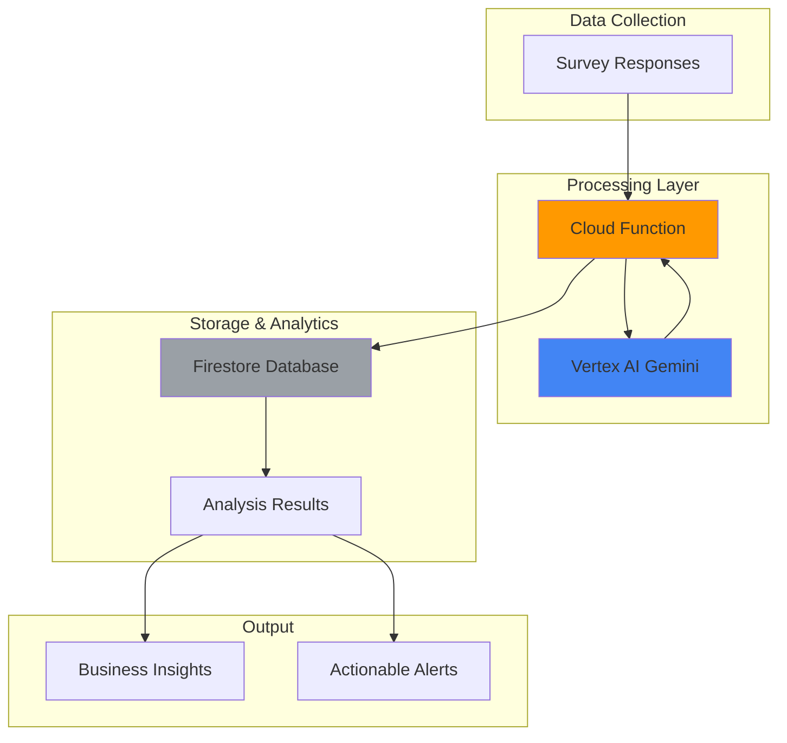

# Smart Survey Analysis with Gemini and Cloud Functions

## Problem

Organizations collect massive amounts of survey data but struggle to extract actionable insights quickly and consistently. Manual analysis is time-consuming and subjective, while traditional tools lack the nuanced understanding needed to identify sentiment, themes, and strategic recommendations from open-text responses. This creates delays in decision-making and missed opportunities to act on customer feedback, potentially costing businesses thousands in lost revenue from unaddressed customer concerns.

## Solution

Implement an automated survey analysis system that leverages Vertex AI's Gemini model to process survey responses in real-time, extract sentiment and key insights, and generate business recommendations. Cloud Functions provides serverless processing triggered by new survey submissions, while Firestore stores both raw responses and AI-generated analysis for scalable retrieval and reporting.

## Architecture Diagram



## Prerequisites

1. Google Cloud account with billing enabled and appropriate permissions for Vertex AI, Cloud Functions, and Firestore
2. Google Cloud CLI installed and configured (version 457.0.0 or later)
3. Basic understanding of serverless functions and NoSQL databases
4. Python 3.11+ for local development and testing
5. Estimated cost: $5-15 for tutorial completion (primarily Vertex AI API calls and Cloud Functions invocations)

> **Note**: Vertex AI Gemini usage is charged per token, while Cloud Functions charges for execution time and requests. Firestore has generous free tier limits for development.

## Preparation

```bash
# Set environment variables for GCP resources
export PROJECT_ID="survey-analysis-$(date +%s)"
export REGION="us-central1"
export FIRESTORE_DATABASE="survey-db"

# Generate unique suffix for resource names
RANDOM_SUFFIX=$(openssl rand -hex 3)
export FUNCTION_NAME="survey-analyzer-${RANDOM_SUFFIX}"
export COLLECTION_NAME="survey_responses"

# Create new project for this tutorial
gcloud projects create ${PROJECT_ID} \
    --name="Survey Analysis Demo"
gcloud config set project ${PROJECT_ID}
gcloud config set compute/region ${REGION}

# Enable required APIs
gcloud services enable cloudfunctions.googleapis.com
gcloud services enable aiplatform.googleapis.com
gcloud services enable firestore.googleapis.com
gcloud services enable cloudbuild.googleapis.com

echo "✅ Project configured: ${PROJECT_ID}"
echo "✅ Region set to: ${REGION}"
```

## Steps

1. **Initialize Firestore Database**:

   Firestore provides a serverless, NoSQL document database that scales automatically and integrates seamlessly with AI workflows. Setting up Firestore in Native mode enables advanced querying capabilities and vector search features that can enhance survey analysis with semantic similarity matching for grouping related responses.

   ```bash
   # Create Firestore database in Native mode
   gcloud firestore databases create \
       --region=${REGION} \
       --database=${FIRESTORE_DATABASE}
   
   # Set default database for subsequent operations
   gcloud config set firestore/database ${FIRESTORE_DATABASE}
   
   echo "✅ Firestore database created: ${FIRESTORE_DATABASE}"
   ```

   The Firestore database is now ready to store survey responses and analysis results with automatic scaling and strong consistency guarantees across all operations.

2. **Create Cloud Function Source Code**:

   Cloud Functions provides event-driven, serverless compute that automatically scales based on demand. The function will integrate with Vertex AI's Gemini model to perform sophisticated natural language processing on survey responses, extracting sentiment, themes, and generating actionable business recommendations.

   ```bash
   # Create function directory and source files
   mkdir -p survey-function
   cd survey-function
   
   # Create main function file
   cat > main.py << 'EOF'
import json
import logging
import os
from typing import Dict, Any
import vertexai
from vertexai.generative_models import GenerativeModel
from google.cloud import firestore
import functions_framework
from flask import Request

# Initialize clients with project ID from environment
project_id = os.environ.get('GCP_PROJECT', os.environ.get('GOOGLE_CLOUD_PROJECT'))
vertexai.init(project=project_id)
model = GenerativeModel("gemini-1.5-flash")
db = firestore.Client()

@functions_framework.http
def analyze_survey(request: Request) -> str:
    """Analyze survey responses using Gemini AI."""
    try:
        # Enable CORS for web requests
        if request.method == 'OPTIONS':
            headers = {
                'Access-Control-Allow-Origin': '*',
                'Access-Control-Allow-Methods': 'POST',
                'Access-Control-Allow-Headers': 'Content-Type',
                'Access-Control-Max-Age': '3600'
            }
            return ('', 204, headers)
        
        request_json = request.get_json()
        if not request_json or 'responses' not in request_json:
            return json.dumps({'error': 'Missing survey responses'}), 400
        
        survey_data = request_json['responses']
        survey_id = request_json.get('survey_id', 'default')
        
        # Create structured analysis prompt
        prompt = f"""
        Analyze the following survey responses and provide a comprehensive analysis in JSON format.
        
        Required JSON structure:
        {{
          "sentiment_score": <number 1-10>,
          "overall_sentiment": "<positive/neutral/negative>",
          "key_themes": ["theme1", "theme2", "theme3"],
          "insights": ["insight1", "insight2", "insight3"],
          "recommendations": [
            {{"action": "action1", "priority": "high/medium/low", "impact": "impact description"}},
            {{"action": "action2", "priority": "high/medium/low", "impact": "impact description"}},
            {{"action": "action3", "priority": "high/medium/low", "impact": "impact description"}}
          ],
          "urgency_level": "<high/medium/low>",
          "confidence_score": <number 0.0-1.0>
        }}
        
        Survey Responses:
        {json.dumps(survey_data, indent=2)}
        
        Provide only the JSON response, no additional text.
        """
        
        # Generate analysis with Gemini
        response = model.generate_content(prompt)
        analysis_text = response.text.strip()
        
        # Clean and parse AI response
        if analysis_text.startswith('```json'):
            analysis_text = analysis_text[7:]
        if analysis_text.endswith('```'):
            analysis_text = analysis_text[:-3]
        
        try:
            analysis_data = json.loads(analysis_text)
        except json.JSONDecodeError as e:
            logging.warning(f"JSON parse error: {e}, using fallback structure")
            analysis_data = {
                'raw_analysis': analysis_text,
                'sentiment_score': 5,
                'overall_sentiment': 'neutral',
                'error': 'Failed to parse structured response'
            }
        
        # Store in Firestore with enhanced metadata
        doc_ref = db.collection('survey_analyses').document()
        doc_data = {
            'survey_id': survey_id,
            'original_responses': survey_data,
            'analysis': analysis_data,
            'timestamp': firestore.SERVER_TIMESTAMP,
            'model_version': 'gemini-1.5-flash',
            'processing_status': 'completed'
        }
        doc_ref.set(doc_data)
        
        headers = {'Access-Control-Allow-Origin': '*'}
        return json.dumps({
            'status': 'success',
            'document_id': doc_ref.id,
            'analysis': analysis_data
        }), 200, headers
        
    except Exception as e:
        logging.error(f"Analysis error: {str(e)}")
        headers = {'Access-Control-Allow-Origin': '*'}
        return json.dumps({'error': str(e)}), 500, headers
EOF
   
   echo "✅ Cloud Function source code created"
   ```

   The function now implements comprehensive survey analysis using Gemini's advanced language understanding capabilities, with robust error handling, CORS support, and enhanced Firestore integration for persistent storage.

3. **Create Function Dependencies**:

   The requirements file specifies the exact versions of Google Cloud libraries needed for Vertex AI integration, Firestore operations, and Cloud Functions runtime compatibility. These dependencies ensure consistent behavior and optimal performance for AI-powered survey analysis.

   ```bash
   # Create requirements.txt with latest compatible versions
   cat > requirements.txt << 'EOF'
functions-framework==3.8.1
google-cloud-aiplatform==1.67.1
google-cloud-firestore==2.18.0
vertexai==1.67.1
flask==3.0.3
EOF
   
   echo "✅ Function dependencies defined"
   ```

   Dependencies are now configured to support the latest Vertex AI features and ensure compatibility with Cloud Functions Python 3.12 runtime environment.

4. **Deploy Cloud Function**:

   Deploying the Cloud Function creates a serverless endpoint that automatically scales based on survey analysis requests. The function integrates with Vertex AI for AI processing and Firestore for data persistence, providing a complete survey analysis pipeline without infrastructure management.

   ```bash
   # Deploy function with appropriate memory and timeout
   gcloud functions deploy ${FUNCTION_NAME} \
       --runtime python312 \
       --trigger-http \
       --allow-unauthenticated \
       --memory 1GB \
       --timeout 300s \
       --source . \
       --entry-point analyze_survey \
       --region ${REGION} \
       --set-env-vars GCP_PROJECT=${PROJECT_ID}
   
   # Get function URL
   FUNCTION_URL=$(gcloud functions describe ${FUNCTION_NAME} \
       --region=${REGION} \
       --format="value(httpsTrigger.url)")
   
   echo "✅ Cloud Function deployed successfully"
   echo "Function URL: ${FUNCTION_URL}"
   ```

   The survey analysis function is now live and ready to process survey data with Gemini AI, automatically scaling to handle varying workloads while maintaining low latency and supporting the latest Python runtime.

5. **Create Sample Survey Data**:

   Realistic survey data helps demonstrate the AI's ability to extract meaningful insights from diverse response types. This sample includes various sentiment levels, detailed feedback, and different response styles that showcase Gemini's natural language understanding capabilities.

   ```bash
   # Return to project root
   cd ..
   
   # Create sample survey data
   cat > sample_survey.json << 'EOF'
{
  "survey_id": "customer_satisfaction_2024",
  "responses": [
    {
      "question": "How satisfied are you with our customer service?",
      "answer": "Extremely satisfied! The support team was quick to respond and resolved my issue within minutes. The representative was knowledgeable and friendly."
    },
    {
      "question": "What improvements would you suggest?",
      "answer": "The mobile app could be more intuitive. Sometimes I struggle to find basic features, and the loading times are quite slow on older devices."
    },
    {
      "question": "Would you recommend our service to others?",
      "answer": "Absolutely! Despite minor app issues, the overall experience has been fantastic. The product quality is excellent and customer support is top-notch."
    },
    {
      "question": "Additional comments",
      "answer": "I've been a customer for 3 years and have seen consistent improvements. Keep up the great work, but please focus on mobile experience optimization."
    }
  ]
}
EOF
   
   echo "✅ Sample survey data created"
   ```

   The sample data represents realistic customer feedback that will help demonstrate the AI's analytical capabilities across different response types and sentiment levels.

6. **Test Survey Analysis Function**:

   Testing the deployed function validates the complete AI pipeline from data ingestion through Gemini analysis to Firestore storage. This verification ensures the system can process real survey data and generate actionable business insights automatically.

   ```bash
   # Send survey data to function for analysis
   curl -X POST ${FUNCTION_URL} \
       -H "Content-Type: application/json" \
       -d @sample_survey.json \
       -o analysis_result.json
   
   # Display analysis results
   echo "Analysis Results:"
   cat analysis_result.json | python3 -m json.tool
   
   echo "✅ Survey analysis completed successfully"
   ```

   The function has processed the survey data and generated comprehensive insights, demonstrating the power of combining Gemini AI with serverless architecture for automated analysis.

7. **Query Analysis Results from Firestore**:

   Retrieving stored analysis results from Firestore demonstrates the persistent storage capabilities and enables building dashboards or reporting systems. The query functionality supports real-time access to AI-generated insights for business decision-making.

   ```bash
   # Install Firestore client library
   pip3 install google-cloud-firestore
   
   # Create query script
   python3 -c "
from google.cloud import firestore
import json
import os

# Set project ID for client
os.environ['GOOGLE_CLOUD_PROJECT'] = '${PROJECT_ID}'
db = firestore.Client()
docs = db.collection('survey_analyses').limit(5).stream()

print('Recent Survey Analyses:')
for doc in docs:
    data = doc.to_dict()
    print(f'Document ID: {doc.id}')
    print(f'Survey ID: {data.get(\"survey_id\", \"N/A\")}')
    print(f'Analysis: {json.dumps(data.get(\"analysis\", {}), indent=2)}')
    print('-' * 50)
"
   
   echo "✅ Analysis results retrieved from Firestore"
   ```

   The stored analysis data is now accessible for building dashboards, generating reports, or triggering automated business processes based on survey insights.

8. **Create Batch Analysis Script**:

   A batch processing script enables analyzing multiple surveys efficiently, demonstrating how the system scales to handle enterprise-level survey volumes. This approach optimizes API usage while maintaining comprehensive analysis quality across large datasets.

   ```bash
   # Create batch processing script
   cat > batch_analysis.py << 'EOF'
import json
import requests
import time
import sys

def analyze_batch_surveys(function_url, surveys_file):
    """Process multiple surveys through the analysis function."""
    
    try:
        with open(surveys_file, 'r') as f:
            surveys = json.load(f)
    except (FileNotFoundError, json.JSONDecodeError) as e:
        print(f"Error reading surveys file: {e}")
        return []
    
    results = []
    for i, survey in enumerate(surveys):
        print(f"Processing survey {i+1}/{len(surveys)}")
        
        try:
            response = requests.post(
                function_url,
                json=survey,
                headers={'Content-Type': 'application/json'},
                timeout=60
            )
            
            if response.status_code == 200:
                results.append(response.json())
                print(f"✅ Survey {i+1} analyzed successfully")
            else:
                print(f"❌ Error analyzing survey {i+1}: {response.text}")
                
        except requests.RequestException as e:
            print(f"❌ Request error for survey {i+1}: {e}")
        
        # Rate limiting to avoid API quota issues
        time.sleep(2)
    
    return results

if __name__ == "__main__":
    if len(sys.argv) != 3:
        print("Usage: python batch_analysis.py <function_url> <surveys_file>")
        sys.exit(1)
    
    function_url = sys.argv[1]
    surveys_file = sys.argv[2]
    
    results = analyze_batch_surveys(function_url, surveys_file)
    
    with open('batch_results.json', 'w') as f:
        json.dump(results, f, indent=2)
    
    print(f"Batch analysis complete. {len(results)} results saved to batch_results.json")
EOF
   
   echo "✅ Batch analysis script created"
   ```

   The batch processing capability enables efficient analysis of multiple surveys while respecting API rate limits and providing comprehensive results tracking with enhanced error handling.

## Validation & Testing

1. **Verify Cloud Function Deployment**:

   ```bash
   # Check function status and configuration
   gcloud functions describe ${FUNCTION_NAME} \
       --region=${REGION} \
       --format="table(name,status,runtime,timeout)"
   ```

   Expected output: Function status should show "ACTIVE" with Python 3.12 runtime and 300s timeout.

2. **Test Firestore Connectivity**:

   ```bash
   # Verify Firestore database and collection
   gcloud firestore indexes list \
       --database=${FIRESTORE_DATABASE}
   
   # Count documents in analysis collection
   python3 -c "
import os
from google.cloud import firestore
os.environ['GOOGLE_CLOUD_PROJECT'] = '${PROJECT_ID}'
db = firestore.Client()
count = len(list(db.collection('survey_analyses').stream()))
print(f'Total analysis documents: {count}')
"
   ```

   Expected output: Database should be accessible with at least one document from testing.

3. **Validate AI Analysis Quality**:

   ```bash
   # Test analysis with different sentiment levels
   cat > negative_survey.json << 'EOF'
{
  "survey_id": "negative_feedback_test",
  "responses": [
    {
      "question": "How was your experience?",
      "answer": "Terrible service. The staff was rude and unhelpful. I waited 2 hours for basic assistance and still didn't get my issue resolved."
    }
  ]
}
EOF
   
   # Analyze negative feedback
   curl -X POST ${FUNCTION_URL} \
       -H "Content-Type: application/json" \
       -d @negative_survey.json
   ```

   Expected output: Analysis should correctly identify negative sentiment and provide appropriate business recommendations.

## Cleanup

1. **Delete Cloud Function**:

   ```bash
   # Remove the deployed function
   gcloud functions delete ${FUNCTION_NAME} \
       --region=${REGION} \
       --quiet
   
   echo "✅ Cloud Function deleted"
   ```

2. **Clear Firestore Data**:

   ```bash
   # Delete all documents in the analysis collection
   python3 -c "
import os
from google.cloud import firestore
os.environ['GOOGLE_CLOUD_PROJECT'] = '${PROJECT_ID}'
db = firestore.Client()
docs = db.collection('survey_analyses').stream()
for doc in docs:
    doc.reference.delete()
    print(f'Deleted document: {doc.id}')
"
   
   echo "✅ Firestore data cleared"
   ```

3. **Delete Project Resources**:

   ```bash
   # Remove local files
   rm -rf survey-function/
   rm -f sample_survey.json negative_survey.json
   rm -f analysis_result.json batch_analysis.py

   # Delete the entire project
   gcloud projects delete ${PROJECT_ID} --quiet
   
   echo "✅ All resources cleaned up"
   echo "Note: Project deletion may take several minutes to complete"
   ```

## Discussion

This survey analysis solution demonstrates the power of combining Google Cloud's AI and serverless technologies to create intelligent, scalable business applications. The architecture leverages Vertex AI's Gemini model for sophisticated natural language understanding, automatically extracting sentiment, themes, and generating actionable business recommendations from unstructured survey data. Cloud Functions provides event-driven processing that scales automatically based on demand, eliminating infrastructure management while maintaining cost efficiency through pay-per-use pricing.

The integration of Firestore as the storage layer enables real-time data persistence with strong consistency guarantees and seamless scaling. Firestore's document-based structure naturally accommodates both structured survey metadata and unstructured AI analysis results, while its vector search capabilities can support advanced features like semantic grouping of similar responses. The serverless architecture ensures that organizations only pay for actual usage, making this solution cost-effective for both small businesses processing hundreds of surveys and enterprises handling thousands daily.

The solution follows Google Cloud's Well-Architected Framework principles by implementing automatic scaling, built-in security through IAM integration, and operational excellence through Cloud Functions' managed runtime. The use of Gemini's advanced language model ensures high-quality analysis that can understand context, nuance, and sentiment better than traditional keyword-based approaches. This enables businesses to gain deeper insights from customer feedback and respond more effectively to market trends and customer needs. The updated Python 3.12 runtime provides enhanced performance and security features compared to older runtime versions.

For production deployments, consider implementing additional features such as Cloud Monitoring for performance tracking, Cloud Security Command Center for security oversight, and Cloud Workflows for complex multi-step analysis pipelines. The architecture can be extended with Cloud Pub/Sub for real-time event processing and BigQuery for large-scale analytics and reporting capabilities.

> **Tip**: Use Cloud Monitoring to track Gemini API usage and optimize prompts for cost efficiency while maintaining analysis quality. Consider implementing request caching for similar survey patterns.

**Documentation References:**
- [Vertex AI Gemini API Reference](https://cloud.google.com/vertex-ai/docs/generative-ai/model-reference/gemini)
- [Cloud Functions Runtime Support](https://cloud.google.com/functions/docs/runtime-support)
- [Firestore for AI Applications](https://cloud.google.com/firestore/docs/overview)
- [Google Cloud AI Best Practices](https://cloud.google.com/ai/docs/concepts/best-practices)
- [Serverless Architecture Patterns](https://cloud.google.com/architecture/serverless-overview)

## Challenge

Extend this solution by implementing these enhancements:

1. **Real-time Dashboard Integration**: Build a web dashboard using Cloud Run and Streamlit that displays live survey analysis results with interactive charts showing sentiment trends, common themes, and business impact metrics.

2. **Multi-language Support**: Enhance the analysis function to detect survey language automatically and provide analysis in multiple languages using Google Cloud Translation API integration with Gemini.

3. **Advanced Analytics Pipeline**: Implement BigQuery integration to store historical analysis data and create automated reports using Looker Studio that track sentiment trends over time and identify seasonal patterns.

4. **Intelligent Alerting System**: Add Cloud Monitoring alerts that trigger when survey sentiment drops below thresholds, automatically notifying business teams through Slack or email integrations using Cloud Functions.

5. **Voice Survey Analysis**: Integrate Speech-to-Text API to analyze voice survey responses, combining audio transcription with Gemini analysis for comprehensive feedback processing across multiple input modalities.

## Infrastructure Code

*Infrastructure code will be generated after recipe approval.*