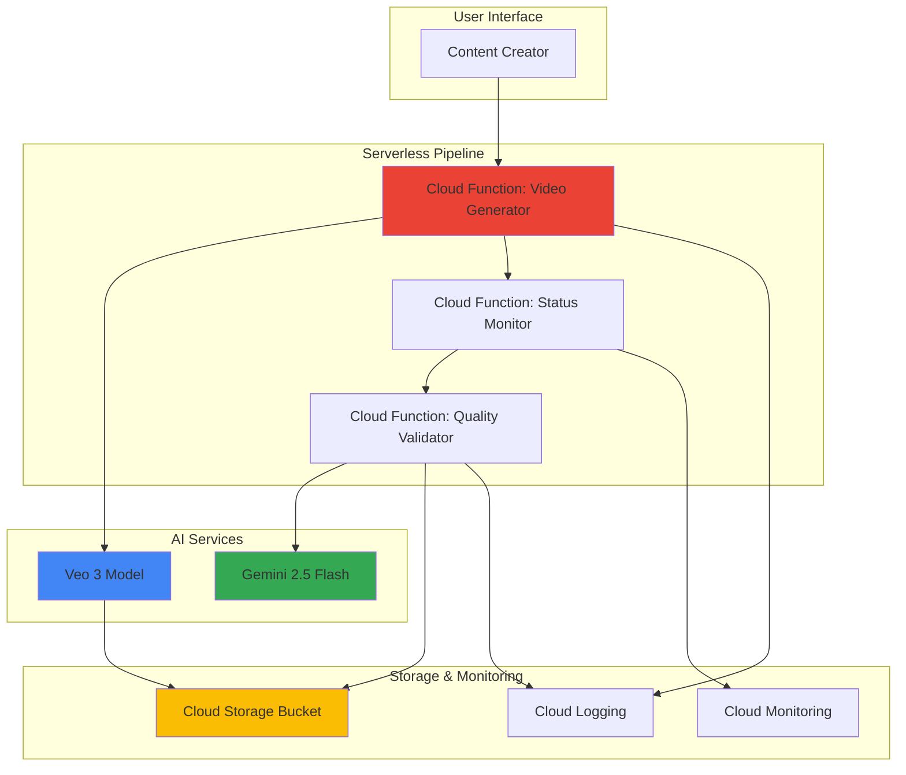

# Social Media Video Creation with Veo 3 and Vertex AI

## Problem

Social media content creators and marketing teams struggle with time-consuming video production workflows that require specialized skills and expensive software. Creating engaging short-form videos for platforms like TikTok, Instagram Reels, and YouTube Shorts currently involves multiple tools, significant manual effort, and inconsistent quality control, leading to delayed content publication and reduced engagement rates.

## Solution

Build an automated serverless video generation pipeline using Google's Veo 3 model for text-to-video creation and Vertex AI's Gemini models for content quality validation. The solution leverages Cloud Functions for orchestration, Cloud Storage for video management, and provides a scalable, cost-effective approach to generating high-quality social media videos from simple text prompts.

## Architecture Diagram



## Prerequisites

1. Google Cloud account with Vertex AI API enabled and appropriate permissions
2. Google Cloud CLI installed and configured (or Cloud Shell access)
3. Basic understanding of serverless architectures and video processing concepts
4. Familiarity with REST APIs and asynchronous operations
5. Estimated cost: $15-25 for testing (includes Veo 3 API calls, Cloud Functions execution, and Cloud Storage)

> **Note**: Veo 3 is currently in preview and requires waitlist approval. Request access through the [official Google Cloud waitlist form](https://docs.google.com/forms/d/e/1FAIpQLSciY6O_qGg2J0A8VUcK4egJ3_Tysh-wGTl-l218XtC0e7lM_w/viewform) before proceeding.

## Preparation

```bash
# Set environment variables for GCP resources
export PROJECT_ID="video-creation-$(date +%s)"
export REGION="us-central1"
export ZONE="us-central1-a"

# Generate unique suffix for resource names
RANDOM_SUFFIX=$(openssl rand -hex 3)
export BUCKET_NAME="social-videos-${RANDOM_SUFFIX}"
export FUNCTION_NAME="video-generator-${RANDOM_SUFFIX}"

# Set default project and region
gcloud config set project ${PROJECT_ID}
gcloud config set compute/region ${REGION}
gcloud config set functions/region ${REGION}

# Enable required APIs
gcloud services enable cloudfunctions.googleapis.com
gcloud services enable storage.googleapis.com
gcloud services enable aiplatform.googleapis.com
gcloud services enable cloudbuild.googleapis.com
gcloud services enable logging.googleapis.com
gcloud services enable monitoring.googleapis.com

echo "✅ Project configured: ${PROJECT_ID}"
echo "✅ Resources will use suffix: ${RANDOM_SUFFIX}"
```

## Steps

1. **Create Cloud Storage Bucket for Video Output**:

   Cloud Storage provides the foundational layer for our video generation pipeline, offering global accessibility and seamless integration with Vertex AI services. The bucket configuration includes versioning for content history and lifecycle management for cost optimization.

   ```bash
   # Create storage bucket with appropriate location and settings
   gsutil mb -p ${PROJECT_ID} \
       -c STANDARD \
       -l ${REGION} \
       gs://${BUCKET_NAME}
   
   # Enable versioning for video management
   gsutil versioning set on gs://${BUCKET_NAME}
   
   # Create organized folder structure for videos
   echo "" | gsutil cp - gs://${BUCKET_NAME}/raw-videos/.keep
   echo "" | gsutil cp - gs://${BUCKET_NAME}/processed-videos/.keep
   echo "" | gsutil cp - gs://${BUCKET_NAME}/metadata/.keep
   
   echo "✅ Cloud Storage bucket created: gs://${BUCKET_NAME}"
   ```

   The bucket structure enables organized content management with separate folders for raw generated videos, processed outputs, and metadata files, supporting efficient content lifecycle management.

2. **Create Video Generation Cloud Function**:

   Cloud Functions provides serverless compute that automatically scales based on request volume, making it ideal for handling variable video generation workloads. The function integrates with Veo 3's long-running operations to manage the asynchronous video generation process.

   ```bash
   # Create function directory and dependencies
   mkdir -p video-functions/generator
   cd video-functions/generator
   
   # Create requirements.txt for Python dependencies
   cat > requirements.txt << 'EOF'
   google-genai==0.12.0
   google-cloud-storage==2.18.0
   google-cloud-logging==3.11.0
   flask==3.0.3
   requests==2.32.3
   EOF
   
   echo "✅ Function dependencies configured"
   ```

3. **Implement Video Generation Logic**:

   The core video generation function leverages Veo 3's advanced text-to-video capabilities, handling prompt optimization, safety parameters, and operation monitoring. This implementation uses the modern google-genai SDK for better integration and error handling.

   ```bash
   # Create main function file
   cat > main.py << 'EOF'
import json
import logging
import os
import time
from datetime import datetime
from google import genai
from google.genai import types
from google.cloud import storage
from google.cloud import logging as cloud_logging

# Initialize logging
cloud_logging.Client().setup_logging()
logging.basicConfig(level=logging.INFO)

def generate_video(request):
    """Cloud Function to generate videos using Veo 3"""
    try:
        # Parse request data
        request_json = request.get_json(silent=True)
        if not request_json or 'prompt' not in request_json:
            return {'error': 'Missing prompt in request'}, 400
        
        prompt = request_json['prompt']
        duration = request_json.get('duration', 8)  # Default 8 seconds
        aspect_ratio = request_json.get('aspect_ratio', '9:16')  # Vertical for social media
        
        # Initialize Vertex AI client
        project_id = os.environ.get('GCP_PROJECT')
        location = "us-central1"
        
        client = genai.Client(vertexai=True, 
                             project=project_id, 
                             location=location)
        
        # Optimize prompt for social media content
        optimized_prompt = f"Create a {duration}-second engaging social media video: {prompt}. High quality, vibrant colors, smooth motion, professional lighting."
        
        # Configure video generation request
        operation = client.models.generate_videos(
            model="veo-3.0-generate-preview",
            prompt=optimized_prompt,
            config=types.GenerateVideosConfig(
                aspect_ratio=aspect_ratio,
                output_gcs_uri=f"gs://{os.environ.get('BUCKET_NAME')}/raw-videos/",
                number_of_videos=1,
                duration_seconds=duration,
                person_generation="allow_adult",
                resolution="720p"
            ),
        )
        
        # Store operation metadata
        metadata = {
            'operation_name': operation.name,
            'prompt': prompt,
            'timestamp': datetime.now().isoformat(),
            'status': 'processing',
            'duration': duration,
            'aspect_ratio': aspect_ratio
        }
        
        # Save metadata to Cloud Storage
        storage_client = storage.Client()
        bucket = storage_client.bucket(os.environ.get('BUCKET_NAME'))
        operation_id = operation.name.split('/')[-1]
        blob = bucket.blob(f"metadata/{operation_id}.json")
        blob.upload_from_string(json.dumps(metadata))
        
        logging.info(f"Video generation started: {operation.name}")
        
        return {
            'status': 'success',
            'operation_name': operation.name,
            'estimated_completion': '60-120 seconds'
        }
            
    except Exception as e:
        logging.error(f"Function error: {str(e)}")
        return {'error': str(e)}, 500
EOF
   
   echo "✅ Video generation function implemented"
   ```

4. **Deploy Video Generator Function**:

   Deploying the Cloud Function creates a scalable endpoint that can handle multiple concurrent video generation requests. The function automatically manages authentication, scaling, and integration with Google Cloud services.

   ```bash
   # Deploy function with appropriate settings
   gcloud functions deploy ${FUNCTION_NAME} \
       --runtime python311 \
       --trigger-http \
       --allow-unauthenticated \
       --source . \
       --entry-point generate_video \
       --memory 512MB \
       --timeout 540s \
       --set-env-vars BUCKET_NAME=${BUCKET_NAME}
   
   # Get function URL
   FUNCTION_URL=$(gcloud functions describe ${FUNCTION_NAME} \
       --format="value(httpsTrigger.url)")
   
   echo "✅ Video generator function deployed: ${FUNCTION_URL}"
   cd ../..
   ```

5. **Create Quality Validation Function**:

   Content quality validation ensures generated videos meet brand standards and platform requirements. Using Gemini's multimodal capabilities, this function analyzes video content for quality, appropriateness, and engagement potential.

   ```bash
   # Create quality validation function
   mkdir -p video-functions/validator
   cd video-functions/validator
   
   # Create requirements for validator
   cat > requirements.txt << 'EOF'
   google-genai==0.12.0
   google-cloud-storage==2.18.0
   flask==3.0.3
   opencv-python-headless==4.10.0.84
   Pillow==10.4.0
   EOF
   
   echo "✅ Validator dependencies configured"
   ```

6. **Implement Content Quality Analysis**:

   The quality validation function extracts video frames and analyzes them using Gemini's vision capabilities, providing automated content scoring and recommendations for optimization.

   ```bash
   # Create quality validation logic
   cat > main.py << 'EOF'
import json
import logging
import os
import cv2
import base64
from datetime import datetime
from google import genai
from google.genai import types
from google.cloud import storage
import tempfile

def validate_content(request):
    """Validate video content quality using Gemini"""
    try:
        request_json = request.get_json(silent=True)
        if not request_json or 'video_uri' not in request_json:
            return {'error': 'Missing video_uri in request'}, 400
        
        video_uri = request_json['video_uri']
        
        # Initialize Vertex AI client
        project_id = os.environ.get('GCP_PROJECT')
        client = genai.Client(vertexai=True, 
                             project=project_id, 
                             location="us-central1")
        
        # Download video for analysis
        storage_client = storage.Client()
        bucket_name = video_uri.replace('gs://', '').split('/')[0]
        blob_path = '/'.join(video_uri.replace('gs://', '').split('/')[1:])
        
        bucket = storage_client.bucket(bucket_name)
        blob = bucket.blob(blob_path)
        
        # Create temporary file for video processing
        with tempfile.NamedTemporaryFile(suffix='.mp4', delete=False) as temp_video:
            blob.download_to_filename(temp_video.name)
            
            # Extract frames for analysis
            cap = cv2.VideoCapture(temp_video.name)
            frames = []
            frame_count = 0
            
            while frame_count < 3:  # Analyze first 3 frames
                ret, frame = cap.read()
                if not ret:
                    break
                
                # Convert frame to base64
                _, buffer = cv2.imencode('.jpg', frame)
                frame_b64 = base64.b64encode(buffer).decode()
                frames.append(frame_b64)
                frame_count += 1
            
            cap.release()
            os.unlink(temp_video.name)
        
        # Analyze content with Gemini
        analysis_prompt = """
        Analyze this video frame for social media content quality. Evaluate:
        1. Visual appeal and engagement potential (1-10)
        2. Technical quality (resolution, clarity, composition) (1-10)
        3. Brand safety and appropriateness (1-10)
        4. Social media optimization (vertical format, attention-grabbing) (1-10)
        5. Overall recommendation (approve/review/reject)
        
        Provide JSON response with scores and brief explanations.
        """
        
        # Analyze first frame
        if frames:
            image_part = types.Part.from_data(
                data=base64.b64decode(frames[0]),
                mime_type="image/jpeg"
            )
            
            response = client.models.generate_content(
                model="gemini-2.0-flash-exp",
                contents=[analysis_prompt, image_part]
            )
            
            # Parse response and create quality report
            quality_report = {
                'video_uri': video_uri,
                'analysis_timestamp': datetime.now().isoformat(),
                'gemini_analysis': response.text,
                'frame_count': len(frames),
                'status': 'analyzed'
            }
            
            # Store quality report
            report_blob = bucket.blob(f"metadata/quality_{blob_path.split('/')[-1]}.json")
            report_blob.upload_from_string(json.dumps(quality_report))
            
            return {
                'status': 'success',
                'quality_report': quality_report,
                'recommendation': 'Content analyzed successfully'
            }
        else:
            return {'error': 'No frames could be extracted from video'}, 400
            
    except Exception as e:
        logging.error(f"Validation error: {str(e)}")
        return {'error': str(e)}, 500
EOF
   
   # Deploy validation function
   gcloud functions deploy "validator-${RANDOM_SUFFIX}" \
       --runtime python311 \
       --trigger-http \
       --allow-unauthenticated \
       --source . \
       --entry-point validate_content \
       --memory 1GB \
       --timeout 300s \
       --set-env-vars BUCKET_NAME=${BUCKET_NAME}
   
   echo "✅ Quality validation function deployed"
   cd ../..
   ```

7. **Create Operation Status Monitor**:

   The status monitor provides real-time tracking of video generation operations, automatically triggering quality validation when videos are ready and updating metadata with completion status.

   ```bash
   # Create status monitoring function
   mkdir -p video-functions/monitor
   cd video-functions/monitor
   
   cat > requirements.txt << 'EOF'
   google-genai==0.12.0
   google-cloud-storage==2.18.0
   flask==3.0.3
   EOF
   
   # Create monitor logic
   cat > main.py << 'EOF'
import json
import logging
import os
from datetime import datetime
from google import genai
from google.cloud import storage

def monitor_operations(request):
    """Monitor video generation operations"""
    try:
        # Get operation name from request
        request_json = request.get_json(silent=True)
        operation_name = request_json.get('operation_name') if request_json else None
        
        if not operation_name:
            return {'error': 'Missing operation_name'}, 400
        
        # Initialize Vertex AI client
        project_id = os.environ.get('GCP_PROJECT')
        client = genai.Client(vertexai=True, 
                             project=project_id, 
                             location="us-central1")
        
        # Check operation status
        operation = client.operations.get(operation_name)
        
        if operation.done:
            # Operation completed, extract video URI
            if operation.result and hasattr(operation.result, 'generated_videos'):
                videos = operation.result.generated_videos
                
                if videos:
                    video_uri = videos[0].video.uri
                    
                    # Update metadata
                    storage_client = storage.Client()
                    bucket = storage_client.bucket(os.environ.get('BUCKET_NAME'))
                    
                    operation_id = operation_name.split('/')[-1]
                    metadata_blob = bucket.blob(f"metadata/{operation_id}.json")
                    
                    if metadata_blob.exists():
                        metadata = json.loads(metadata_blob.download_as_text())
                        metadata.update({
                            'status': 'completed',
                            'video_uri': video_uri,
                            'completion_time': datetime.now().isoformat()
                        })
                        metadata_blob.upload_from_string(json.dumps(metadata))
                    
                    return {
                        'status': 'completed',
                        'video_uri': video_uri,
                        'operation_name': operation_name
                    }
                else:
                    return {'status': 'completed', 'error': 'No videos generated'}
            else:
                return {'status': 'completed', 'error': 'Operation failed'}
        else:
            return {'status': 'processing', 'operation_name': operation_name}
            
    except Exception as e:
        logging.error(f"Monitor error: {str(e)}")
        return {'error': str(e)}, 500
EOF
   
   # Deploy monitor function
   gcloud functions deploy "monitor-${RANDOM_SUFFIX}" \
       --runtime python311 \
       --trigger-http \
       --allow-unauthenticated \
       --source . \
       --entry-point monitor_operations \
       --memory 256MB \
       --timeout 60s \
       --set-env-vars BUCKET_NAME=${BUCKET_NAME}
   
   echo "✅ Operation monitor function deployed"
   cd ../..
   ```

## Validation & Testing

1. **Test Video Generation Pipeline**:

   ```bash
   # Test video generation with sample prompt
   curl -X POST ${FUNCTION_URL} \
       -H "Content-Type: application/json" \
       -d '{
           "prompt": "A colorful sunset over a mountain landscape with gentle clouds moving across the sky",
           "duration": 8,
           "aspect_ratio": "9:16"
       }'
   ```

   Expected output: JSON response with operation_name and success status.

2. **Monitor Operation Status**:

   ```bash
   # Get monitor function URL
   MONITOR_URL=$(gcloud functions describe "monitor-${RANDOM_SUFFIX}" \
       --format="value(httpsTrigger.url)")
   
   # Check operation status (replace with actual operation name)
   curl -X POST ${MONITOR_URL} \
       -H "Content-Type: application/json" \
       -d '{"operation_name": "projects/PROJECT/locations/us-central1/operations/OPERATION_ID"}'
   ```

3. **Verify Video Storage**:

   ```bash
   # List generated videos
   gsutil ls -l gs://${BUCKET_NAME}/raw-videos/
   
   # Check metadata files
   gsutil ls gs://${BUCKET_NAME}/metadata/
   ```

4. **Test Quality Validation**:

   ```bash
   # Get validator function URL
   VALIDATOR_URL=$(gcloud functions describe "validator-${RANDOM_SUFFIX}" \
       --format="value(httpsTrigger.url)")
   
   # Test validation (replace with actual video URI)
   curl -X POST ${VALIDATOR_URL} \
       -H "Content-Type: application/json" \
       -d '{"video_uri": "gs://BUCKET_NAME/raw-videos/sample_0.mp4"}'
   ```

## Cleanup

1. **Remove Cloud Functions**:

   ```bash
   # Delete all functions
   gcloud functions delete ${FUNCTION_NAME} --quiet
   gcloud functions delete "validator-${RANDOM_SUFFIX}" --quiet
   gcloud functions delete "monitor-${RANDOM_SUFFIX}" --quiet
   
   echo "✅ Cloud Functions deleted"
   ```

2. **Remove Storage Resources**:

   ```bash
   # Delete bucket and all contents
   gsutil -m rm -r gs://${BUCKET_NAME}
   
   echo "✅ Storage bucket deleted"
   ```

3. **Clean Local Files**:

   ```bash
   # Remove function directories
   rm -rf video-functions/
   
   # Clear environment variables
   unset PROJECT_ID REGION BUCKET_NAME FUNCTION_NAME RANDOM_SUFFIX
   
   echo "✅ Local cleanup completed"
   ```

## Discussion

This serverless video creation pipeline demonstrates the power of combining Google Cloud's AI services with modern serverless architecture patterns. The solution leverages Veo 3's advanced video generation capabilities alongside Vertex AI's comprehensive model ecosystem to create a production-ready content creation system. The updated implementation uses the modern Google Gen AI SDK, which provides better integration with Vertex AI services and more robust error handling compared to direct REST API calls.

The architecture follows serverless best practices by using Cloud Functions for compute orchestration, eliminating the need for infrastructure management while providing automatic scaling based on demand. The pipeline's asynchronous design handles Veo 3's long-running operations efficiently, with proper error handling and status monitoring throughout the process. The new SDK simplifies operation management and provides better type safety for video generation requests.

Quality validation using Gemini's multimodal capabilities ensures generated content meets professional standards. The system analyzes video frames for technical quality, visual appeal, and brand safety, providing automated content scoring that can integrate with approval workflows. This approach significantly reduces manual review time while maintaining content quality standards.

The solution's cost-effectiveness stems from its serverless design - you only pay for actual video generation requests and processing time. Cloud Storage provides durable, globally accessible video storage with lifecycle management options for long-term cost optimization. Integration with Cloud Monitoring and Logging enables comprehensive observability for production deployments.

> **Tip**: For production use, implement authentication and rate limiting to control access to your video generation endpoints. Consider using Cloud Tasks for reliable operation monitoring and retry logic.

**Documentation Sources:**
- [Veo 3 Model Documentation](https://cloud.google.com/vertex-ai/generative-ai/docs/models/veo/3-0-generate-preview)
- [Video Generation API Guide](https://cloud.google.com/vertex-ai/generative-ai/docs/video/generate-videos-from-text)
- [Cloud Functions Python Runtime](https://cloud.google.com/functions/docs/concepts/python-runtime)
- [Google Gen AI SDK Documentation](https://ai.google.dev/gemini-api/docs/models/generative-models)
- [Google Cloud Architecture Framework](https://cloud.google.com/architecture/framework)

## Challenge

Extend this solution by implementing these enhancements:

1. **Multi-Platform Optimization**: Add automatic video format conversion for different social media platforms (Instagram Stories, TikTok, YouTube Shorts) with platform-specific aspect ratios and duration limits.

2. **Batch Processing Pipeline**: Implement a Cloud Scheduler-triggered batch job that processes multiple video requests simultaneously, optimizing for cost and throughput using the Gen AI SDK's batch operations.

3. **Advanced Content Analysis**: Integrate additional Vertex AI models for sentiment analysis, object detection, and audio quality assessment to provide comprehensive content scoring.

4. **Automated Publishing**: Create integrations with social media APIs to automatically publish approved videos to platforms, including optimal posting time recommendations based on audience analytics.

5. **Interactive Web Interface**: Build a web application using Cloud Run and Firestore that provides a user-friendly interface for video creation, real-time status updates, and content management dashboard.

## Infrastructure Code

### Available Infrastructure as Code:

- [Infrastructure Code Overview](code/README.md) - Detailed description of all infrastructure components
- [Infrastructure Manager](code/infrastructure-manager/) - GCP Infrastructure Manager templates
- [Bash CLI Scripts](code/scripts/) - Example bash scripts using gcloud CLI commands to deploy infrastructure
- [Terraform](code/terraform/) - Terraform configuration files