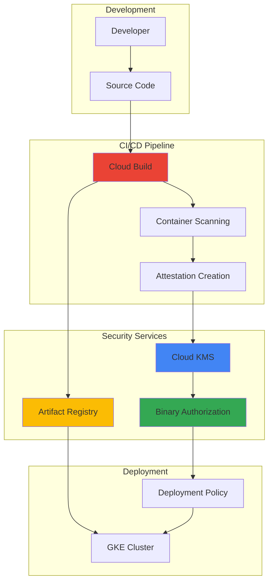

# Software Supply Chain Security with Binary Authorization and Cloud Build

## Problem

Modern software development relies heavily on container images and third-party dependencies, creating security vulnerabilities in the software supply chain where malicious or compromised code can infiltrate production environments. Organizations struggle to verify the integrity and authenticity of container images before deployment, lacking comprehensive mechanisms to enforce security policies that prevent unauthorized or vulnerable containers from running in production environments.

## Solution

Google Cloud Binary Authorization provides cryptographic attestation-based deployment policies that work seamlessly with Cloud Build to create a secure software supply chain. This solution uses Cloud KMS for cryptographic key management, Artifact Registry for secure container storage, and automated attestation generation to ensure only verified, policy-compliant container images are deployed to production environments.

## Architecture Diagram



## Prerequisites

1. Google Cloud project with billing enabled and appropriate IAM permissions
2. gcloud CLI installed and configured (or Google Cloud Shell)
3. Basic knowledge of container security and CI/CD pipelines
4. Understanding of cryptographic concepts and digital signatures
5. Estimated cost: $10-15 for Cloud Build, storage, and KMS operations during recipe execution

> **Note**: Binary Authorization is available for Google Kubernetes Engine (GKE), Cloud Run, and Google Distributed Cloud. This recipe focuses on GKE deployment scenarios with comprehensive security controls.

## Preparation

```bash
# Set environment variables for consistent resource naming
export PROJECT_ID=$(gcloud config get-value project)
export REGION="us-central1"
export ZONE="us-central1-a"
export CLUSTER_NAME="secure-cluster"
export REPO_NAME="secure-images"

# Generate unique suffix for resource names
RANDOM_SUFFIX=$(openssl rand -hex 3)
export KEYRING_NAME="binauthz-keyring-${RANDOM_SUFFIX}"
export KEY_NAME="attestor-key-${RANDOM_SUFFIX}"
export ATTESTOR_NAME="build-attestor-${RANDOM_SUFFIX}"

# Set default project, region, and zone
gcloud config set project ${PROJECT_ID}
gcloud config set compute/region ${REGION}
gcloud config set compute/zone ${ZONE}

# Enable required Google Cloud APIs
gcloud services enable \
    container.googleapis.com \
    cloudbuild.googleapis.com \
    binaryauthorization.googleapis.com \
    cloudkms.googleapis.com \
    artifactregistry.googleapis.com \
    containeranalysis.googleapis.com

echo "✅ Project configured: ${PROJECT_ID}"
echo "✅ Required APIs enabled for Binary Authorization pipeline"
```

## Steps

1. **Create Artifact Registry Repository for Secure Container Storage**:

   Artifact Registry provides vulnerability scanning, metadata management, and integration with Binary Authorization for comprehensive container security. This repository serves as the secure foundation for storing and analyzing container images throughout the software supply chain.

   ```bash
   # Create Artifact Registry repository for Docker images
   gcloud artifacts repositories create ${REPO_NAME} \
       --repository-format=docker \
       --location=${REGION} \
       --description="Secure container repository with vulnerability scanning"
   
   # Configure Docker authentication for Artifact Registry
   gcloud auth configure-docker ${REGION}-docker.pkg.dev
   
   # Verify repository creation and configuration
   gcloud artifacts repositories describe ${REPO_NAME} \
       --location=${REGION} \
       --format="value(name)"
   
   echo "✅ Artifact Registry repository created with security scanning enabled"
   ```

   The Artifact Registry repository now provides automatic vulnerability scanning and metadata storage, establishing the foundation for secure container image management with integrated security analysis and policy enforcement.

2. **Create Cloud KMS Key Ring and Cryptographic Keys for Attestations**:

   Cloud KMS provides hardware security module (HSM) backed cryptographic key management with automatic rotation capabilities. These keys will digitally sign attestations that prove container images have passed security and compliance checks, forming the cryptographic foundation of the supply chain security model.

   ```bash
   # Create KMS key ring for attestation keys
   gcloud kms keyrings create ${KEYRING_NAME} \
       --location=${REGION}
   
   # Create asymmetric signing key for attestations
   gcloud kms keys create ${KEY_NAME} \
       --location=${REGION} \
       --keyring=${KEYRING_NAME} \
       --purpose=asymmetric-signing \
       --default-algorithm=rsa-sign-pss-2048-sha256
   
   # Get the key resource name for attestor creation
   export KEY_RESOURCE_NAME="projects/${PROJECT_ID}/locations/${REGION}/keyRings/${KEYRING_NAME}/cryptoKeys/${KEY_NAME}/cryptoKeyVersions/1"
   
   echo "✅ KMS cryptographic keys created for secure attestation signing"
   echo "Key Resource Name: ${KEY_RESOURCE_NAME}"
   ```

   The cryptographic infrastructure is now established with enterprise-grade security controls, providing the signing capabilities needed to create tamper-proof attestations that verify container image integrity and compliance throughout the deployment pipeline.

3. **Create Binary Authorization Attestor for Policy Enforcement**:

   Binary Authorization attestors define the cryptographic proof requirements for container deployment approval. This attestor will verify that container images have been properly built, scanned, and approved through the automated CI/CD pipeline before allowing deployment to production environments.

   ```bash
   # Create Binary Authorization attestor
   gcloud container binauthz attestors create ${ATTESTOR_NAME} \
       --attestation-authority-note-project=${PROJECT_ID} \
       --description="Attestor for CI/CD pipeline security verification"
   
   # Add the KMS public key to the attestor
   gcloud container binauthz attestors public-keys add \
       --attestor=${ATTESTOR_NAME} \
       --keyversion-project=${PROJECT_ID} \
       --keyversion-location=${REGION} \
       --keyversion-keyring=${KEYRING_NAME} \
       --keyversion-key=${KEY_NAME} \
       --keyversion=1
   
   # Verify attestor configuration
   gcloud container binauthz attestors describe ${ATTESTOR_NAME}
   
   echo "✅ Binary Authorization attestor configured with KMS key integration"
   ```

   The attestor is now configured to validate cryptographic signatures on container images, establishing the policy enforcement mechanism that ensures only verified and compliant images can be deployed to production environments.

4. **Create GKE Cluster with Binary Authorization Enabled**:

   Google Kubernetes Engine with Binary Authorization provides runtime policy enforcement that blocks unauthorized container deployments. This cluster configuration ensures that every container deployment request is verified against attestation policies before containers are allowed to run.

   ```bash
   # Create GKE cluster with Binary Authorization enabled
   gcloud container clusters create ${CLUSTER_NAME} \
       --zone=${ZONE} \
       --enable-binauthz \
       --enable-autoscaling \
       --min-nodes=1 \
       --max-nodes=3 \
       --machine-type=e2-medium \
       --enable-autorepair \
       --enable-autoupgrade
   
   # Get cluster credentials for kubectl
   gcloud container clusters get-credentials ${CLUSTER_NAME} \
       --zone=${ZONE}
   
   # Verify Binary Authorization is enabled
   gcloud container clusters describe ${CLUSTER_NAME} \
       --zone=${ZONE} \
       --format="value(binaryAuthorization.enabled)"
   
   echo "✅ GKE cluster created with Binary Authorization runtime enforcement"
   ```

   The GKE cluster now enforces Binary Authorization policies at runtime, providing the deployment environment where attestation verification occurs automatically for every container deployment request, ensuring comprehensive security enforcement.

5. **Configure Binary Authorization Policy for Strict Security**:

   The Binary Authorization policy defines security requirements that container images must meet before deployment. This configuration enforces strict attestation requirements while allowing Google-maintained base images and requiring manual approval for emergency deployments.

   ```bash
   # Create Binary Authorization policy configuration
   cat > binauthz-policy.yaml <<EOF
   admissionWhitelistPatterns:
   - namePattern: gcr.io/google-containers/*
   - namePattern: gcr.io/google_containers/*
   - namePattern: k8s.gcr.io/*
   - namePattern: gcr.io/gke-release/*
   - namePattern: registry.k8s.io/*
   defaultAdmissionRule:
     requireAttestationsBy:
     - projects/${PROJECT_ID}/attestors/${ATTESTOR_NAME}
     evaluationMode: REQUIRE_ATTESTATION
     enforcementMode: ENFORCED_BLOCK_AND_AUDIT_LOG
   clusterAdmissionRules:
     ${ZONE}.${CLUSTER_NAME}:
       requireAttestationsBy:
       - projects/${PROJECT_ID}/attestors/${ATTESTOR_NAME}
       evaluationMode: REQUIRE_ATTESTATION
       enforcementMode: ENFORCED_BLOCK_AND_AUDIT_LOG
   EOF
   
   # Apply the Binary Authorization policy
   gcloud container binauthz policy import binauthz-policy.yaml
   
   # Verify policy configuration
   gcloud container binauthz policy export
   
   echo "✅ Binary Authorization policy configured for strict attestation requirements"
   ```

   The security policy now enforces cryptographic attestation verification for all container deployments, blocking any images that haven't been properly signed and approved through the secure CI/CD pipeline while maintaining operational flexibility for system components.

6. **Create Cloud Build Configuration for Secure Pipeline**:

   Cloud Build provides the automated CI/CD pipeline that builds container images, performs security scanning, and generates cryptographic attestations. This configuration creates a comprehensive security pipeline that validates code quality, scans for vulnerabilities, and produces verifiable attestations.

   ```bash
   # Create sample application with Dockerfile
   mkdir -p secure-app
   cat > secure-app/Dockerfile <<EOF
   FROM gcr.io/google.com/cloudsdktool/google-cloud-cli:alpine
   COPY app.py /app/
   WORKDIR /app
   EXPOSE 8080
   CMD ["python3", "app.py"]
   EOF
   
   # Create simple Python application
   cat > secure-app/app.py <<EOF
   from http.server import HTTPServer, SimpleHTTPRequestHandler
   import os
   
   class Handler(SimpleHTTPRequestHandler):
       def do_GET(self):
           self.send_response(200)
           self.send_header('Content-type', 'text/html')
           self.end_headers()
           self.wfile.write(b'<h1>Secure Application</h1><p>Deployed with Binary Authorization!</p>')
   
   if __name__ == '__main__':
       server = HTTPServer(('0.0.0.0', 8080), Handler)
       print('Server running on port 8080...')
       server.serve_forever()
   EOF
   
   # Create Cloud Build configuration with attestation
   cat > secure-app/cloudbuild.yaml <<EOF
   steps:
   # Build the container image
   - name: 'gcr.io/cloud-builders/docker'
     args: ['build', '-t', '${REGION}-docker.pkg.dev/${PROJECT_ID}/${REPO_NAME}/secure-app:\$SHORT_SHA', '.']
   
   # Push the image to Artifact Registry
   - name: 'gcr.io/cloud-builders/docker'
     args: ['push', '${REGION}-docker.pkg.dev/${PROJECT_ID}/${REPO_NAME}/secure-app:\$SHORT_SHA']
   
   # Wait for vulnerability scan results
   - name: 'gcr.io/google.com/cloudsdktool/google-cloud-cli:latest'
     entrypoint: 'bash'
     args:
     - '-c'
     - |
       echo "Waiting for vulnerability scan to complete..."
       sleep 60
       # Check scan results
       gcloud artifacts docker images scan ${REGION}-docker.pkg.dev/${PROJECT_ID}/${REPO_NAME}/secure-app:\$SHORT_SHA \
         --location=${REGION} --format="value(scan.name)" || echo "Scan in progress"
   
   # Create attestation for the built image
   - name: 'gcr.io/google.com/cloudsdktool/google-cloud-cli:latest'
     entrypoint: 'bash'
     args:
     - '-c'
     - |
       echo "Creating attestation for image..."
       gcloud container binauthz attestations sign-and-create \
         --artifact-url="${REGION}-docker.pkg.dev/${PROJECT_ID}/${REPO_NAME}/secure-app:\$SHORT_SHA" \
         --attestor="${ATTESTOR_NAME}" \
         --attestor-project="${PROJECT_ID}" \
         --keyversion-project="${PROJECT_ID}" \
         --keyversion-location="${REGION}" \
         --keyversion-keyring="${KEYRING_NAME}" \
         --keyversion-key="${KEY_NAME}" \
         --keyversion="1"
   
   images:
   - '${REGION}-docker.pkg.dev/${PROJECT_ID}/${REPO_NAME}/secure-app:\$SHORT_SHA'
   
   options:
     logging: CLOUD_LOGGING_ONLY
   EOF
   
   echo "✅ Cloud Build pipeline configured with vulnerability scanning and attestation"
   ```

   The CI/CD pipeline now includes comprehensive security controls with automated vulnerability scanning, cryptographic attestation generation, and integration with the Binary Authorization policy enforcement system, ensuring secure and verifiable deployments.

7. **Execute Secure Build Pipeline and Generate Attestations**:

   Cloud Build will now execute the secure pipeline, building the container image, performing security analysis, and generating cryptographic attestations that prove the image meets security requirements. This process demonstrates the end-to-end security validation workflow.

   ```bash
   # Navigate to application directory
   cd secure-app
   
   # Grant Cloud Build service account necessary permissions
   export CLOUD_BUILD_SA=$(gcloud projects describe ${PROJECT_ID} \
       --format="value(projectNumber)")@cloudbuild.gserviceaccount.com
   
   # Grant KMS signing permissions to Cloud Build
   gcloud kms keys add-iam-policy-binding ${KEY_NAME} \
       --location=${REGION} \
       --keyring=${KEYRING_NAME} \
       --member="serviceAccount:${CLOUD_BUILD_SA}" \
       --role="roles/cloudkms.signerVerifier"
   
   # Grant Binary Authorization attestor permissions
   gcloud container binauthz attestors add-iam-policy-binding ${ATTESTOR_NAME} \
       --member="serviceAccount:${CLOUD_BUILD_SA}" \
       --role="roles/binaryauthorization.attestorsEditor"
   
   # Trigger the secure build pipeline
   gcloud builds submit . --config=cloudbuild.yaml
   
   # Get the built image SHA for verification
   export IMAGE_SHA=$(gcloud builds list --limit=1 \
       --format="value(substitutions.SHORT_SHA)")
   export FULL_IMAGE_URL="${REGION}-docker.pkg.dev/${PROJECT_ID}/${REPO_NAME}/secure-app:${IMAGE_SHA}"
   
   echo "✅ Secure build pipeline completed with attestation generation"
   echo "Image built: ${FULL_IMAGE_URL}"
   ```

   The secure build pipeline has successfully created a container image with cryptographic attestations, demonstrating how the automated system validates security requirements and generates verifiable proof of compliance for deployment authorization.

8. **Deploy Attested Application to GKE with Policy Verification**:

   The final step demonstrates Binary Authorization policy enforcement in action, showing how only properly attested images can be deployed while unauthorized images are automatically blocked by the runtime security controls.

   ```bash
   # Create Kubernetes deployment manifest for attested image
   cat > deployment.yaml <<EOF
   apiVersion: apps/v1
   kind: Deployment
   metadata:
     name: secure-app
     labels:
       app: secure-app
   spec:
     replicas: 2
     selector:
       matchLabels:
         app: secure-app
     template:
       metadata:
         labels:
           app: secure-app
       spec:
         containers:
         - name: secure-app
           image: ${FULL_IMAGE_URL}
           ports:
           - containerPort: 8080
   ---
   apiVersion: v1
   kind: Service
   metadata:
     name: secure-app-service
   spec:
     type: LoadBalancer
     ports:
     - port: 80
       targetPort: 8080
     selector:
       app: secure-app
   EOF
   
   # Deploy the attested application (should succeed)
   kubectl apply -f deployment.yaml
   
   # Verify deployment success
   kubectl get deployments
   kubectl get pods -l app=secure-app
   
   # Get service external IP
   kubectl get service secure-app-service
   
   echo "✅ Attested application deployed successfully through Binary Authorization"
   
   # Return to parent directory
   cd ..
   ```

   The attested application has been successfully deployed, demonstrating that Binary Authorization allows verified images while maintaining strong security controls that would block any unauthorized or unattested container deployments.

## Validation & Testing

1. **Verify Binary Authorization Policy Enforcement**:

   ```bash
   # Check Binary Authorization policy status
   gcloud container binauthz policy export
   
   # Verify attestor configuration
   gcloud container binauthz attestors list
   gcloud container binauthz attestors describe ${ATTESTOR_NAME}
   ```

   Expected output: Policy should show `ENFORCED_BLOCK_AND_AUDIT_LOG` and attestor should list the KMS key.

2. **Test Policy Enforcement with Unauthorized Image**:

   ```bash
   # Attempt to deploy an unauthorized image (should fail)
   kubectl create deployment test-unauthorized \
       --image=nginx:latest
   
   # Check deployment status (should show admission blocked)
   kubectl get events --sort-by=.metadata.creationTimestamp
   ```

   Expected result: Deployment should be blocked with Binary Authorization violation message.

3. **Verify Attestation Existence**:

   ```bash
   # List attestations for the deployed image
   gcloud container binauthz attestations list \
       --attestor=${ATTESTOR_NAME} \
       --artifact-url=${FULL_IMAGE_URL}
   
   # Check vulnerability scan results
   gcloud artifacts docker images scan ${FULL_IMAGE_URL} \
       --location=${REGION}
   ```

   Expected output: Should show valid attestation and vulnerability scan results.

4. **Validate Application Functionality**:

   ```bash
   # Get external IP and test application
   EXTERNAL_IP=$(kubectl get service secure-app-service \
       -o jsonpath='{.status.loadBalancer.ingress[0].ip}')
   
   echo "Application URL: http://${EXTERNAL_IP}"
   curl -f "http://${EXTERNAL_IP}" || echo "Application starting..."
   ```

   Expected result: Application should respond with secure deployment confirmation message.

## Cleanup

1. **Remove Kubernetes Resources**:

   ```bash
   # Delete the deployed application
   kubectl delete -f secure-app/deployment.yaml
   
   # Delete unauthorized deployment if it exists
   kubectl delete deployment test-unauthorized --ignore-not-found=true
   
   echo "✅ Kubernetes resources removed"
   ```

2. **Delete GKE Cluster**:

   ```bash
   # Delete the GKE cluster
   gcloud container clusters delete ${CLUSTER_NAME} \
       --zone=${ZONE} \
       --quiet
   
   echo "✅ GKE cluster deleted"
   ```

3. **Remove Binary Authorization Configuration**:

   ```bash
   # Reset Binary Authorization policy to default
   gcloud container binauthz policy import /dev/stdin <<EOF
   defaultAdmissionRule:
     evaluationMode: ALWAYS_ALLOW
     enforcementMode: ENFORCED_BLOCK_AND_AUDIT_LOG
   EOF
   
   # Delete the attestor
   gcloud container binauthz attestors delete ${ATTESTOR_NAME} --quiet
   
   echo "✅ Binary Authorization configuration reset"
   ```

4. **Delete Cloud KMS Resources**:

   ```bash
   # Disable the KMS key (cannot delete immediately)
   gcloud kms keys versions destroy 1 \
       --key=${KEY_NAME} \
       --keyring=${KEYRING_NAME} \
       --location=${REGION} \
       --quiet
   
   echo "✅ KMS key disabled (will be deleted after retention period)"
   ```

5. **Remove Artifact Registry and Clean Up**:

   ```bash
   # Delete Artifact Registry repository
   gcloud artifacts repositories delete ${REPO_NAME} \
       --location=${REGION} \
       --quiet
   
   # Remove local files
   rm -rf secure-app
   rm -f binauthz-policy.yaml
   
   echo "✅ All resources cleaned up successfully"
   echo "Note: KMS keys have a mandatory retention period before permanent deletion"
   ```

## Discussion

This recipe demonstrates implementing comprehensive software supply chain security using Google Cloud's Binary Authorization service integrated with Cloud Build, Cloud KMS, and Artifact Registry. The solution addresses critical security challenges in modern container-based applications by establishing cryptographic proof of image integrity and compliance throughout the CI/CD pipeline.

The Binary Authorization service provides runtime policy enforcement that prevents unauthorized container deployments, working seamlessly with Google Kubernetes Engine to validate every deployment request against predefined security policies. This approach follows the principle of "never trust, always verify" by requiring cryptographic attestations for all container images before allowing them to run in production environments. The integration with Cloud KMS ensures that signing keys are managed with enterprise-grade security controls, including hardware security modules and automatic key rotation capabilities.

The automated CI/CD pipeline built with Cloud Build demonstrates how security controls can be seamlessly integrated into developer workflows without creating friction or impediments to productivity. The pipeline performs automated vulnerability scanning through Artifact Registry's integrated security analysis, generates cryptographic attestations using Cloud KMS, and stores images in a secure registry with comprehensive metadata tracking. This automation ensures that security validation becomes an integral part of the development process rather than a separate manual step.

The solution also provides comprehensive audit trails and monitoring capabilities through Cloud Logging and Cloud Monitoring, enabling security teams to track all deployment attempts, policy violations, and attestation activities. This visibility is crucial for compliance reporting and incident response, allowing organizations to demonstrate adherence to security policies and quickly identify potential security threats or policy violations.

> **Tip**: Consider implementing multiple attestors for different stages of your pipeline (build, security scan, approval) to create a more granular security control system that provides defense in depth.

For more detailed information on Binary Authorization concepts and advanced configurations, refer to the [Binary Authorization documentation](https://cloud.google.com/binary-authorization/docs) and [Google Cloud Security best practices](https://cloud.google.com/security/best-practices). The [Cloud Build security guide](https://cloud.google.com/build/docs/securing-builds) provides additional insights into securing CI/CD pipelines, while the [Artifact Registry security documentation](https://cloud.google.com/artifact-registry/docs/analysis) covers vulnerability scanning and image management best practices. Organizations implementing this solution should also review the [Google Cloud Architecture Framework security principles](https://cloud.google.com/architecture/framework/security) for comprehensive security guidance.

## Challenge

Extend this software supply chain security implementation with these advanced enhancements:

1. **Multi-Stage Attestation Pipeline**: Implement separate attestors for build verification, security scanning, and manual approval stages, creating a comprehensive approval workflow that requires multiple cryptographic proofs before deployment authorization.

2. **Policy as Code with Gatekeeper**: Integrate Open Policy Agent Gatekeeper with Binary Authorization to create custom policy rules that validate container configurations, resource limits, and security contexts beyond image attestation requirements.

3. **Cross-Cloud Attestation Verification**: Extend the solution to support container deployments across multiple cloud providers or hybrid environments while maintaining centralized policy management and attestation validation through federated identity systems.

4. **Automated Incident Response**: Build automated response mechanisms that detect Binary Authorization policy violations, automatically quarantine affected resources, and trigger incident response workflows including notifications, logging, and remediation procedures.

5. **Supply Chain Transparency with SLSA**: Implement Software Supply Chain Levels for Software Artifacts (SLSA) compliance by generating comprehensive provenance metadata, build reproducibility verification, and supply chain transparency reports that provide end-to-end visibility into software origins and transformations.

## Infrastructure Code

*Infrastructure code will be generated after recipe approval.*