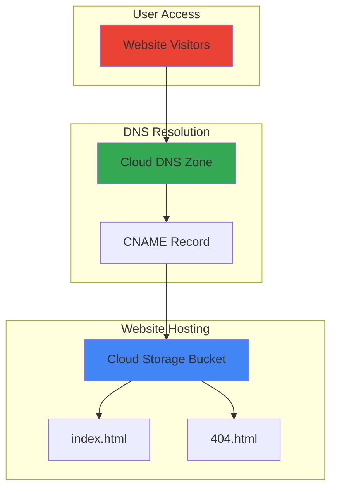

# Static Website Hosting with Cloud Storage and DNS

## Problem

Small businesses and developers need a cost-effective way to host static websites without managing servers or complex infrastructure. Traditional web hosting requires ongoing server maintenance, security updates, and scaling considerations that can be overwhelming for simple marketing sites or portfolios. Without proper domain configuration and DNS management, professional websites cannot establish credible online presence or provide reliable access to customers.

## Solution

Google Cloud Storage provides serverless static website hosting with global edge caching and automatic scaling, eliminating server management overhead. By combining Cloud Storage buckets configured for web serving with Cloud DNS for domain management, you create a professional hosting solution that scales automatically and costs only for storage and bandwidth used, making it ideal for low-traffic websites and development projects.

## Architecture Diagram



## Prerequisites

1. Google Cloud project with billing enabled and Cloud Storage and Cloud DNS APIs activated
2. Google Cloud CLI (gcloud) installed and authenticated
3. A registered domain name (can be registered through any domain registrar)
4. Basic understanding of HTML files and web hosting concepts
5. Estimated cost: $0.02-$0.05 per month for storage plus DNS query charges ($0.20 per million queries)

> **Note**: This recipe creates resources in the us-central1 region. Cloud Storage provides global accessibility regardless of bucket location.

## Preparation

```bash
# Set environment variables for GCP resources
export PROJECT_ID="static-website-$(date +%s)"
export DOMAIN_NAME="example.com"  # Replace with your actual domain
export BUCKET_NAME="${DOMAIN_NAME}"
export REGION="us-central1"

# Generate unique suffix for DNS zone
RANDOM_SUFFIX=$(openssl rand -hex 3)
export DNS_ZONE_NAME="website-zone-${RANDOM_SUFFIX}"

# Set default project and region
gcloud config set project ${PROJECT_ID}
gcloud config set compute/region ${REGION}

# Enable required APIs
gcloud services enable storage.googleapis.com
gcloud services enable dns.googleapis.com

echo "✅ Project configured: ${PROJECT_ID}"
echo "✅ Domain configured: ${DOMAIN_NAME}"
```

## Steps

1. **Create Cloud Storage bucket for website hosting**:

   Cloud Storage buckets configured for static website hosting provide cost-effective, scalable web serving without server management. The bucket name must match your domain name exactly to enable CNAME record mapping, which allows your custom domain to point directly to Google's storage infrastructure.

   ```bash
   # Create bucket with domain name for CNAME compatibility
   gsutil mb -p ${PROJECT_ID} \
       -c STANDARD \
       -l ${REGION} \
       gs://${BUCKET_NAME}
   
   # Configure bucket for static website hosting
   gsutil web set -m index.html -e 404.html gs://${BUCKET_NAME}
   
   echo "✅ Storage bucket created and configured for web hosting"
   ```

   The bucket is now configured with index.html as the main page and 404.html for error handling, providing proper web server behavior for static content delivery according to Google Cloud Storage's [static website hosting documentation](https://cloud.google.com/storage/docs/hosting-static-website).

2. **Create sample website content**:

   Creating basic HTML files demonstrates the website structure and provides content for testing. These files showcase responsive design principles and proper HTML5 structure that search engines and browsers can effectively process.

   ```bash
   # Create index.html with responsive design
   cat > index.html << 'EOF'
<!DOCTYPE html>
<html lang="en">
<head>
    <meta charset="UTF-8">
    <meta name="viewport" content="width=device-width, initial-scale=1.0">
    <title>Welcome to Cloud Website</title>
    <style>
        body { font-family: Arial, sans-serif; margin: 40px; line-height: 1.6; }
        .container { max-width: 800px; margin: 0 auto; }
        h1 { color: #4285F4; }
        .cloud-info { background: #f0f8ff; padding: 20px; border-radius: 5px; }
    </style>
</head>
<body>
    <div class="container">
        <h1>Welcome to Your Cloud Website!</h1>
        <div class="cloud-info">
            <p>This static website is hosted on Google Cloud Storage with:</p>
            <ul>
                <li>Automatic global content delivery</li>
                <li>99.999999999% (11 9's) data durability</li>
                <li>Pay-per-use pricing model</li>
                <li>Custom domain support</li>
            </ul>
        </div>
        <p>Build Date: $(date)</p>
    </div>
</body>
</html>
EOF
   
   # Create 404 error page
   cat > 404.html << 'EOF'
<!DOCTYPE html>
<html lang="en">
<head>
    <meta charset="UTF-8">
    <meta name="viewport" content="width=device-width, initial-scale=1.0">
    <title>Page Not Found</title>
    <style>
        body { font-family: Arial, sans-serif; text-align: center; margin-top: 100px; }
        h1 { color: #EA4335; }
    </style>
</head>
<body>
    <h1>404 - Page Not Found</h1>
    <p>The page you're looking for doesn't exist.</p>
    <a href="/">Return to Homepage</a>
</body>
</html>
EOF
   
   echo "✅ Website content created successfully"
   ```

   The HTML files now include responsive design elements and proper metadata for optimal display across devices and search engine optimization.

3. **Upload website content to bucket**:

   Uploading files to Cloud Storage makes them available for web serving through Google's global content delivery network. Setting appropriate cache control headers ensures optimal performance by allowing browsers to cache static content effectively.

   ```bash
   # Upload website files with cache control headers
   gsutil -h "Cache-Control:public, max-age=3600" \
       cp index.html gs://${BUCKET_NAME}/
   
   gsutil -h "Cache-Control:public, max-age=3600" \
       cp 404.html gs://${BUCKET_NAME}/
   
   # Verify files were uploaded successfully
   gsutil ls gs://${BUCKET_NAME}/
   
   echo "✅ Website files uploaded with cache optimization"
   ```

   The files are now stored in Cloud Storage with appropriate caching headers, enabling faster load times and reduced bandwidth costs for repeat visitors.

4. **Configure public access for website content**:

   Making the bucket publicly readable allows web browsers to access your website content directly. This configuration applies Google Cloud's security model while enabling public web serving functionality required for static websites.

   ```bash
   # Make bucket contents publicly readable
   gsutil iam ch allUsers:objectViewer gs://${BUCKET_NAME}
   
   # Verify public access configuration
   gsutil iam get gs://${BUCKET_NAME}
   
   echo "✅ Bucket configured for public web access"
   ```

   The bucket now allows public read access while maintaining Google Cloud's security protections against unauthorized modifications or deletions.

5. **Create Cloud DNS zone for domain management**:

   Cloud DNS provides authoritative DNS hosting with global anycast network infrastructure, ensuring fast domain resolution worldwide. Creating a managed zone establishes the foundation for pointing your custom domain to the Cloud Storage bucket.

   ```bash
   # Create Cloud DNS managed zone
   gcloud dns managed-zones create ${DNS_ZONE_NAME} \
       --description="DNS zone for static website" \
       --dns-name="${DOMAIN_NAME}." \
       --visibility=public
   
   # Get name servers for domain configuration
   gcloud dns managed-zones describe ${DNS_ZONE_NAME} \
       --format="value(nameServers[].join(' '))"
   
   echo "✅ DNS zone created successfully"
   echo "📝 Configure these name servers with your domain registrar:"
   gcloud dns managed-zones describe ${DNS_ZONE_NAME} \
       --format="value(nameServers[].join('\n'))"
   ```

   The DNS zone is now created with Google Cloud name servers that must be configured with your domain registrar to enable DNS resolution through Google Cloud.

6. **Create CNAME record pointing to Cloud Storage**:

   CNAME records create an alias that directs your domain traffic to Google Cloud Storage's web serving infrastructure. This configuration enables your custom domain to serve content directly from the storage bucket without additional redirect overhead.

   ```bash
   # Create CNAME record pointing to Cloud Storage
   gcloud dns record-sets create ${DOMAIN_NAME}. \
       --zone=${DNS_ZONE_NAME} \
       --type=CNAME \
       --ttl=300 \
       --rrdatas="c.storage.googleapis.com."
   
   # Verify DNS record creation
   gcloud dns record-sets list --zone=${DNS_ZONE_NAME}
   
   echo "✅ CNAME record created pointing to Cloud Storage"
   ```

   The CNAME record now directs traffic from your domain to Google Cloud Storage, enabling seamless website access through your custom domain name.

## Validation & Testing

1. **Verify bucket website configuration**:

   ```bash
   # Check bucket website settings
   gsutil web get gs://${BUCKET_NAME}
   ```

   Expected output: Main page suffix: index.html, 404 page: 404.html

2. **Test direct bucket access**:

   ```bash
   # Test website access via storage URL
   curl -I "https://storage.googleapis.com/${BUCKET_NAME}/index.html"
   ```

   Expected output: HTTP 200 status with content-type: text/html

3. **Verify DNS configuration**:

   ```bash
   # Check DNS zone and records
   gcloud dns record-sets list --zone=${DNS_ZONE_NAME} \
       --format="table(name,type,ttl,rrdatas[].join(' '))"
   ```

   Expected output: CNAME record pointing to c.storage.googleapis.com

4. **Test domain resolution (after name server configuration)**:

   ```bash
   # Test DNS resolution for your domain
   nslookup ${DOMAIN_NAME}
   ```

   Expected output: CNAME record resolving to c.storage.googleapis.com

## Cleanup

1. **Remove DNS records and zone**:

   ```bash
   # Delete CNAME record
   gcloud dns record-sets delete ${DOMAIN_NAME}. \
       --zone=${DNS_ZONE_NAME} \
       --type=CNAME \
       --quiet
   
   # Delete DNS zone
   gcloud dns managed-zones delete ${DNS_ZONE_NAME} --quiet
   
   echo "✅ DNS resources cleaned up"
   ```

2. **Remove website content and bucket**:

   ```bash
   # Remove all objects from bucket
   gsutil -m rm -r gs://${BUCKET_NAME}/*
   
   # Remove bucket
   gsutil rb gs://${BUCKET_NAME}
   
   echo "✅ Storage resources cleaned up"
   ```

3. **Clean up local files**:

   ```bash
   # Remove local HTML files
   rm -f index.html 404.html
   
   # Clear environment variables
   unset PROJECT_ID DOMAIN_NAME BUCKET_NAME REGION DNS_ZONE_NAME
   
   echo "✅ Local cleanup completed"
   ```

## Discussion

This recipe demonstrates Google Cloud's approach to serverless static website hosting, leveraging Cloud Storage's web serving capabilities combined with Cloud DNS for professional domain management. The solution eliminates server maintenance overhead while providing enterprise-grade reliability and global content delivery through Google's infrastructure, following Google Cloud's [web serving best practices](https://cloud.google.com/architecture/web-serving-overview).

Cloud Storage's web hosting feature automatically handles HTTP requests, serves index files, and processes error pages without requiring load balancers or compute instances. The bucket name matching your domain name enables direct CNAME record mapping, creating a seamless integration between DNS and storage services. This approach significantly reduces complexity compared to traditional web hosting solutions while providing the durability and availability characteristics that Google Cloud is known for.

The cost model for this architecture scales with usage, making it ideal for small to medium websites. You pay only for storage consumed (typically pennies per month for small sites) plus minimal DNS query charges. Google Cloud's free tier includes substantial storage and bandwidth allowances, often covering personal websites entirely. For production websites requiring HTTPS, consider upgrading to use Cloud Load Balancer with SSL certificates for enhanced security and performance as documented in the [Cloud Storage static website hosting guide](https://cloud.google.com/storage/docs/hosting-static-website).

Security considerations include proper IAM configuration limiting public access to read-only permissions, enabling audit logging for access monitoring, and implementing Cloud Storage bucket-level security policies. While this basic configuration provides public read access necessary for web serving, additional security layers can be added through Cloud Armor, Identity-Aware Proxy, or Firebase Hosting integration depending on your specific requirements.

> **Tip**: Use Google Cloud Monitoring to track website performance metrics and set up alerts for unusual traffic patterns or errors to maintain optimal site performance.

## Challenge

Extend this solution by implementing these enhancements:

1. **Add HTTPS support** by implementing Cloud Load Balancer with Google-managed SSL certificates for secure connections and improved SEO rankings.

2. **Implement content versioning** using Cloud Storage object versioning and lifecycle policies to maintain website history and enable easy rollbacks during updates.

3. **Add global CDN acceleration** by configuring Cloud CDN with the load balancer to cache content closer to users worldwide, improving page load times.

4. **Create automated deployment** using Cloud Build triggers that automatically update website content when changes are pushed to a Git repository.

5. **Implement monitoring and alerting** using Cloud Monitoring to track website availability, response times, and error rates with automated notifications for issues.

*For detailed implementation guidance, see the [Google Cloud Architecture Center](https://cloud.google.com/architecture/web-serving-overview) and [Cloud Storage static website documentation](https://cloud.google.com/storage/docs/hosting-static-website).*

## Infrastructure Code

*Infrastructure code will be generated after recipe approval.*