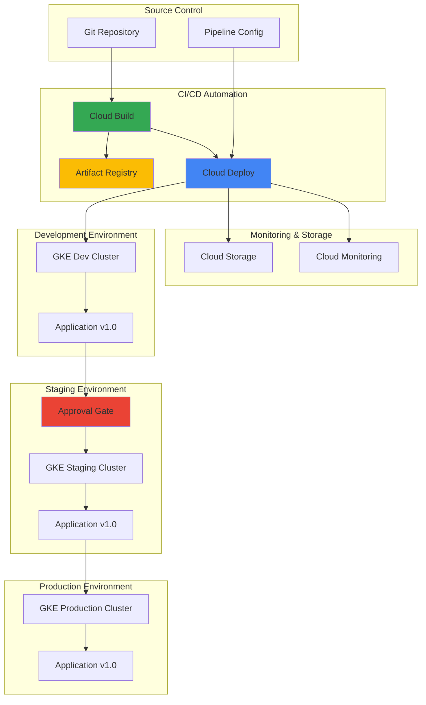

# Streamlining Multi-Environment Application Deployment with Cloud Deploy and Cloud Build

## Problem

Organizations deploying applications across multiple environments often struggle with inconsistent deployment processes, manual promotion workflows, and lack of visibility into release progression. Traditional deployment pipelines require extensive custom scripting, manual intervention for environment promotions, and complex rollback procedures, leading to deployment delays, increased risk of human error, and difficulty maintaining compliance across development, staging, and production environments.

## Solution

Implement automated GitOps-style deployment pipelines using Cloud Deploy's managed delivery pipelines and Cloud Build's automated triggers to orchestrate application promotions through multiple GKE environments. This solution provides declarative pipeline configuration, automated build and deployment processes, and built-in approval workflows that ensure consistent, reliable, and auditable application releases across development, staging, and production clusters.

## Architecture Diagram



## Prerequisites

1. Google Cloud project with billing enabled and necessary APIs enabled
2. Google Cloud CLI (gcloud) installed and configured
3. kubectl command-line tool installed
4. Docker installed for local testing
5. Basic knowledge of Kubernetes, containerization, and CI/CD concepts
6. Estimated cost: $20-50 per day for GKE clusters and associated resources

> **Note**: This recipe creates multiple GKE clusters and associated resources. Monitor costs through the Google Cloud Console and clean up resources when testing is complete.

## Preparation

```bash
# Set environment variables for GCP resources
export PROJECT_ID="deploy-demo-$(date +%s)"
export REGION="us-central1"
export ZONE="us-central1-a"

# Generate unique suffix for resource names
RANDOM_SUFFIX=$(openssl rand -hex 3)

# Set project-specific variables
export CLUSTER_DEV="dev-cluster-${RANDOM_SUFFIX}"
export CLUSTER_STAGE="staging-cluster-${RANDOM_SUFFIX}"
export CLUSTER_PROD="prod-cluster-${RANDOM_SUFFIX}"
export REPO_NAME="app-repo-${RANDOM_SUFFIX}"
export PIPELINE_NAME="app-pipeline-${RANDOM_SUFFIX}"
export BUCKET_NAME="deploy-artifacts-${PROJECT_ID}-${RANDOM_SUFFIX}"

# Set default project and region
gcloud config set project ${PROJECT_ID}
gcloud config set compute/region ${REGION}
gcloud config set compute/zone ${ZONE}

# Enable required APIs
gcloud services enable compute.googleapis.com
gcloud services enable container.googleapis.com
gcloud services enable clouddeploy.googleapis.com
gcloud services enable cloudbuild.googleapis.com
gcloud services enable artifactregistry.googleapis.com
gcloud services enable cloudresourcemanager.googleapis.com

echo "✅ Project configured: ${PROJECT_ID}"
echo "✅ APIs enabled for Cloud Deploy and Cloud Build"
```

## Steps

1. **Create Artifact Registry Repository**:

   Google Cloud Artifact Registry provides secure, private container image storage with vulnerability scanning and access controls. Creating a dedicated repository establishes a centralized location for storing application container images that will be deployed across all environments, ensuring consistent image versions and security scanning throughout the deployment pipeline.

   ```bash
   # Create Artifact Registry repository for container images
   gcloud artifacts repositories create ${REPO_NAME} \
       --repository-format=docker \
       --location=${REGION} \
       --description="Repository for multi-environment deployment demo"
   
   # Configure Docker authentication
   gcloud auth configure-docker ${REGION}-docker.pkg.dev
   
   echo "✅ Artifact Registry repository created: ${REPO_NAME}"
   ```

   The Artifact Registry repository now provides secure container image storage with automatic vulnerability scanning and access controls, forming the foundation for consistent image distribution across all deployment environments.

2. **Create GKE Clusters for Multiple Environments**:

   Google Kubernetes Engine provides managed Kubernetes clusters optimized for containerized applications. Creating separate clusters for development, staging, and production environments ensures proper isolation, security boundaries, and environment-specific configurations while maintaining consistent Kubernetes API compatibility across the deployment pipeline.

   ```bash
   # Create development GKE cluster
   gcloud container clusters create ${CLUSTER_DEV} \
       --zone=${ZONE} \
       --num-nodes=2 \
       --machine-type=e2-standard-2 \
       --enable-autorepair \
       --enable-autoupgrade \
       --labels=environment=development
   
   # Wait for cluster to be ready
   gcloud container clusters get-credentials ${CLUSTER_DEV} --zone=${ZONE}
   
   # Create staging GKE cluster
   gcloud container clusters create ${CLUSTER_STAGE} \
       --zone=${ZONE} \
       --num-nodes=2 \
       --machine-type=e2-standard-2 \
       --enable-autorepair \
       --enable-autoupgrade \
       --labels=environment=staging
   
   # Wait for cluster to be ready
   gcloud container clusters get-credentials ${CLUSTER_STAGE} --zone=${ZONE}
   
   # Create production GKE cluster
   gcloud container clusters create ${CLUSTER_PROD} \
       --zone=${ZONE} \
       --num-nodes=3 \
       --machine-type=e2-standard-4 \
       --enable-autorepair \
       --enable-autoupgrade \
       --labels=environment=production
   
   # Wait for cluster to be ready
   gcloud container clusters get-credentials ${CLUSTER_PROD} --zone=${ZONE}
   
   echo "✅ Created GKE clusters: ${CLUSTER_DEV}, ${CLUSTER_STAGE}, ${CLUSTER_PROD}"
   ```

   Three GKE clusters now provide isolated environments for development, staging, and production deployments, each with appropriate resource allocations and automatic management features enabled for reliability and security.

3. **Create Cloud Storage Bucket for Deployment Artifacts**:

   Cloud Storage provides durable, scalable object storage for deployment artifacts, configuration files, and pipeline state information. Creating a dedicated bucket establishes centralized storage for Cloud Deploy pipeline configurations and build artifacts, enabling version control and audit trails for all deployment activities.

   ```bash
   # Create Cloud Storage bucket for deployment artifacts
   gsutil mb -p ${PROJECT_ID} \
       -c STANDARD \
       -l ${REGION} \
       gs://${BUCKET_NAME}
   
   # Enable versioning for artifact tracking
   gsutil versioning set on gs://${BUCKET_NAME}
   
   # Set appropriate IAM permissions for Cloud Deploy
   PROJECT_NUMBER=$(gcloud projects describe ${PROJECT_ID} \
       --format="value(projectNumber)")
   gsutil iam ch serviceAccount:${PROJECT_NUMBER}-compute@developer.gserviceaccount.com:objectAdmin \
       gs://${BUCKET_NAME}
   
   echo "✅ Cloud Storage bucket created: ${BUCKET_NAME}"
   ```

   The Cloud Storage bucket now provides versioned storage for deployment artifacts with proper IAM permissions, enabling Cloud Deploy to manage pipeline state and artifact tracking across all environments.

4. **Create Application Source Code and Configuration**:

   A sample application with proper Kubernetes manifests and Skaffold configuration demonstrates real-world deployment scenarios. Creating structured application code with environment-specific configurations establishes the foundation for GitOps-style deployments where infrastructure and application changes are managed through declarative configuration files.

   ```bash
   # Create application directory structure
   mkdir -p app-source/{k8s,skaffold}
   cd app-source
   
   # Create simple web application
   cat > app.py << 'EOF'
from flask import Flask, jsonify
import os

app = Flask(__name__)

@app.route('/')
def hello():
    env = os.environ.get('ENVIRONMENT', 'unknown')
    version = os.environ.get('VERSION', '1.0.0')
    return f'Hello from {env} environment! Version: {version}'

@app.route('/health')
def health():
    return jsonify({
        'status': 'healthy',
        'environment': os.environ.get('ENVIRONMENT', 'unknown'),
        'version': os.environ.get('VERSION', '1.0.0')
    })

if __name__ == '__main__':
    app.run(host='0.0.0.0', port=8080)
EOF
   
   # Create Dockerfile
   cat > Dockerfile << 'EOF'
FROM python:3.11-slim
WORKDIR /app
COPY requirements.txt .
RUN pip install --no-cache-dir -r requirements.txt
COPY app.py .
EXPOSE 8080
CMD ["python", "app.py"]
EOF
   
   # Create requirements.txt
   cat > requirements.txt << 'EOF'
Flask==3.0.0
gunicorn==21.2.0
EOF
   
   echo "✅ Application source code created"
   ```

   The sample application provides a realistic web service with health checks and environment awareness, demonstrating how applications can be configured for different deployment environments while maintaining consistent functionality.

5. **Create Kubernetes Manifests for Each Environment**:

   Environment-specific Kubernetes manifests enable proper configuration management across development, staging, and production deployments. Creating separate manifest files with appropriate resource allocations, environment variables, and service configurations ensures that each environment receives optimal settings while maintaining application consistency.

   ```bash
   # Create Kubernetes manifests for development
   mkdir -p k8s/dev k8s/staging k8s/prod
   
   # Development environment manifest
   cat > k8s/dev/deployment.yaml << EOF
apiVersion: apps/v1
kind: Deployment
metadata:
  name: sample-app
  labels:
    app: sample-app
    environment: dev
spec:
  replicas: 1
  selector:
    matchLabels:
      app: sample-app
  template:
    metadata:
      labels:
        app: sample-app
        environment: dev
    spec:
      containers:
      - name: app
        image: sample-app
        ports:
        - containerPort: 8080
        env:
        - name: ENVIRONMENT
          value: "development"
        - name: VERSION
          value: "1.0.0"
        resources:
          requests:
            memory: "128Mi"
            cpu: "100m"
          limits:
            memory: "256Mi"
            cpu: "200m"
        livenessProbe:
          httpGet:
            path: /health
            port: 8080
          initialDelaySeconds: 30
          periodSeconds: 10
        readinessProbe:
          httpGet:
            path: /health
            port: 8080
          initialDelaySeconds: 5
          periodSeconds: 5
---
apiVersion: v1
kind: Service
metadata:
  name: sample-app-service
  labels:
    app: sample-app
spec:
  ports:
  - port: 80
    targetPort: 8080
  selector:
    app: sample-app
  type: LoadBalancer
EOF
   
   # Staging environment manifest (higher resources)
   cat > k8s/staging/deployment.yaml << EOF
apiVersion: apps/v1
kind: Deployment
metadata:
  name: sample-app
  labels:
    app: sample-app
    environment: staging
spec:
  replicas: 2
  selector:
    matchLabels:
      app: sample-app
  template:
    metadata:
      labels:
        app: sample-app
        environment: staging
    spec:
      containers:
      - name: app
        image: sample-app
        ports:
        - containerPort: 8080
        env:
        - name: ENVIRONMENT
          value: "staging"
        - name: VERSION
          value: "1.0.0"
        resources:
          requests:
            memory: "256Mi"
            cpu: "200m"
          limits:
            memory: "512Mi"
            cpu: "400m"
        livenessProbe:
          httpGet:
            path: /health
            port: 8080
          initialDelaySeconds: 30
          periodSeconds: 10
        readinessProbe:
          httpGet:
            path: /health
            port: 8080
          initialDelaySeconds: 5
          periodSeconds: 5
---
apiVersion: v1
kind: Service
metadata:
  name: sample-app-service
  labels:
    app: sample-app
spec:
  ports:
  - port: 80
    targetPort: 8080
  selector:
    app: sample-app
  type: LoadBalancer
EOF
   
   # Production environment manifest (highest resources)
   cat > k8s/prod/deployment.yaml << EOF
apiVersion: apps/v1
kind: Deployment
metadata:
  name: sample-app
  labels:
    app: sample-app
    environment: production
spec:
  replicas: 3
  selector:
    matchLabels:
      app: sample-app
  template:
    metadata:
      labels:
        app: sample-app
        environment: production
    spec:
      containers:
      - name: app
        image: sample-app
        ports:
        - containerPort: 8080
        env:
        - name: ENVIRONMENT
          value: "production"
        - name: VERSION
          value: "1.0.0"
        resources:
          requests:
            memory: "512Mi"
            cpu: "400m"
          limits:
            memory: "1Gi"
            cpu: "800m"
        livenessProbe:
          httpGet:
            path: /health
            port: 8080
          initialDelaySeconds: 30
          periodSeconds: 10
        readinessProbe:
          httpGet:
            path: /health
            port: 8080
          initialDelaySeconds: 5
          periodSeconds: 5
---
apiVersion: v1
kind: Service
metadata:
  name: sample-app-service
  labels:
    app: sample-app
spec:
  ports:
  - port: 80
    targetPort: 8080
  selector:
    app: sample-app
  type: LoadBalancer
EOF
   
   echo "✅ Kubernetes manifests created for all environments"
   ```

   Environment-specific Kubernetes manifests now provide appropriate resource allocations and configurations for each deployment stage, ensuring optimal performance and cost efficiency while maintaining application consistency across the pipeline.

6. **Create Skaffold Configuration**:

   Skaffold provides declarative configuration for building, pushing, and deploying applications to Kubernetes clusters. Creating a comprehensive Skaffold configuration enables Cloud Deploy to manage the complete application lifecycle, from container image building to Kubernetes deployment, with environment-specific customizations and deployment strategies.

   ```bash
   # Create Skaffold configuration for Cloud Deploy
   cat > skaffold.yaml << EOF
apiVersion: skaffold/v4beta7
kind: Config
metadata:
  name: sample-app
build:
  artifacts:
  - image: sample-app
    docker:
      dockerfile: Dockerfile
  googleCloudBuild:
    projectId: ${PROJECT_ID}
profiles:
- name: dev
  deploy:
    kubectl:
      manifests:
      - k8s/dev/*.yaml
- name: staging
  deploy:
    kubectl:
      manifests:
      - k8s/staging/*.yaml
- name: prod
  deploy:
    kubectl:
      manifests:
      - k8s/prod/*.yaml
EOF
   
   echo "✅ Skaffold configuration created"
   ```

   The Skaffold configuration now defines how applications are built and deployed across different environments, providing Cloud Deploy with the necessary instructions for automated container image building and Kubernetes deployment management.

7. **Create Cloud Deploy Pipeline Configuration**:

   Cloud Deploy delivery pipelines define the promotion sequence and deployment targets for automated application delivery. Creating a comprehensive pipeline configuration establishes the governance framework for multi-environment deployments, including approval requirements, target definitions, and promotion strategies that ensure controlled and auditable releases.

   ```bash
   # Create Cloud Deploy pipeline configuration
   cat > clouddeploy.yaml << EOF
apiVersion: deploy.cloud.google.com/v1
kind: DeliveryPipeline
metadata:
  name: ${PIPELINE_NAME}
description: Multi-environment deployment pipeline for sample application
serialPipeline:
  stages:
  - targetId: dev-target
    profiles: [dev]
  - targetId: staging-target
    profiles: [staging]
  - targetId: prod-target
    profiles: [prod]
---
apiVersion: deploy.cloud.google.com/v1
kind: Target
metadata:
  name: dev-target
description: Development environment
gke:
  cluster: projects/${PROJECT_ID}/locations/${ZONE}/clusters/${CLUSTER_DEV}
---
apiVersion: deploy.cloud.google.com/v1
kind: Target
metadata:
  name: staging-target
description: Staging environment
gke:
  cluster: projects/${PROJECT_ID}/locations/${ZONE}/clusters/${CLUSTER_STAGE}
requireApproval: false
---
apiVersion: deploy.cloud.google.com/v1
kind: Target
metadata:
  name: prod-target
description: Production environment
gke:
  cluster: projects/${PROJECT_ID}/locations/${ZONE}/clusters/${CLUSTER_PROD}
requireApproval: true
EOF
   
   echo "✅ Cloud Deploy pipeline configuration created"
   ```

   The Cloud Deploy pipeline configuration now defines a complete promotion sequence from development through production, with appropriate approval gates and environment-specific deployment profiles for controlled release management.

8. **Create Cloud Build Configuration**:

   Cloud Build provides serverless CI/CD capabilities with native integration to Google Cloud services. Creating a comprehensive build configuration establishes automated container image building, testing, and Cloud Deploy integration that triggers deployment pipelines automatically when source code changes are detected.

   ```bash
   # Create Cloud Build configuration
   cat > cloudbuild.yaml << EOF
steps:
# Build and push container image
- name: 'gcr.io/cloud-builders/docker'
  args:
  - 'build'
  - '-t'
  - '${REGION}-docker.pkg.dev/${PROJECT_ID}/${REPO_NAME}/sample-app:\${SHORT_SHA}'
  - '-t'
  - '${REGION}-docker.pkg.dev/${PROJECT_ID}/${REPO_NAME}/sample-app:latest'
  - '.'

# Push images to Artifact Registry
- name: 'gcr.io/cloud-builders/docker'
  args:
  - 'push'
  - '--all-tags'
  - '${REGION}-docker.pkg.dev/${PROJECT_ID}/${REPO_NAME}/sample-app'

# Create Cloud Deploy release
- name: 'gcr.io/google.com/cloudsdktool/cloud-sdk'
  entrypoint: 'gcloud'
  args:
  - 'deploy'
  - 'releases'
  - 'create'
  - 'release-\${SHORT_SHA}'
  - '--delivery-pipeline=${PIPELINE_NAME}'
  - '--region=${REGION}'
  - '--images=sample-app=${REGION}-docker.pkg.dev/${PROJECT_ID}/${REPO_NAME}/sample-app:\${SHORT_SHA}'

# Store build artifacts in Cloud Storage
artifacts:
  objects:
    location: 'gs://${BUCKET_NAME}/builds/\${SHORT_SHA}'
    paths:
    - 'skaffold.yaml'
    - 'clouddeploy.yaml'

substitutions:
  _REGION: '${REGION}'
  _REPO_NAME: '${REPO_NAME}'
  _PIPELINE_NAME: '${PIPELINE_NAME}'
  _BUCKET_NAME: '${BUCKET_NAME}'

options:
  logging: CLOUD_LOGGING_ONLY
EOF
   
   echo "✅ Cloud Build configuration created"
   ```

   The Cloud Build configuration now provides automated container image building, artifact storage, and Cloud Deploy integration, creating a complete CI/CD pipeline that responds to source code changes with automated deployments.

9. **Register Cloud Deploy Pipeline**:

   Registering the delivery pipeline with Cloud Deploy establishes the managed deployment infrastructure and creates the necessary resources for automated application promotion. This step initializes the pipeline configuration and makes it available for release creation and environment promotion operations.

   ```bash
   # Register the delivery pipeline and targets with Cloud Deploy
   gcloud deploy apply \
       --file=clouddeploy.yaml \
       --region=${REGION} \
       --project=${PROJECT_ID}
   
   # Wait for pipeline registration to complete
   sleep 30
   
   # Verify pipeline registration
   gcloud deploy delivery-pipelines list \
       --region=${REGION} \
       --format="table(name,condition.state,createTime)"
   
   echo "✅ Cloud Deploy pipeline registered: ${PIPELINE_NAME}"
   ```

   The Cloud Deploy delivery pipeline is now registered and ready to manage application deployments across the defined environments, providing automated promotion capabilities and deployment tracking.

10. **Create Initial Release and Deploy to Development**:

    Creating the first release initiates the deployment pipeline and demonstrates the automated promotion workflow. This step builds the container image, creates a Cloud Deploy release, and automatically deploys the application to the development environment, establishing the baseline for subsequent promotions.

    ```bash
    # Build and push initial container image
    docker build -t ${REGION}-docker.pkg.dev/${PROJECT_ID}/${REPO_NAME}/sample-app:v1.0.0 .
    docker push ${REGION}-docker.pkg.dev/${PROJECT_ID}/${REPO_NAME}/sample-app:v1.0.0
    
    # Create Cloud Deploy release
    gcloud deploy releases create release-v1-0-0 \
        --delivery-pipeline=${PIPELINE_NAME} \
        --region=${REGION} \
        --images=sample-app=${REGION}-docker.pkg.dev/${PROJECT_ID}/${REPO_NAME}/sample-app:v1.0.0
    
    # Wait for deployment to complete
    sleep 60
    
    # Monitor deployment to development environment
    gcloud deploy rollouts list \
        --delivery-pipeline=${PIPELINE_NAME} \
        --region=${REGION} \
        --format="table(name,state,deployTime)"
    
    echo "✅ Initial release created and deployed to development"
    ```

    The application is now deployed to the development environment through Cloud Deploy's automated pipeline, demonstrating the complete integration between container building, artifact storage, and Kubernetes deployment.

## Validation & Testing

1. **Verify GKE Clusters and Application Deployment**:

   ```bash
   # Check GKE cluster status
   gcloud container clusters list \
       --format="table(name,status,currentNodeCount,location)"
   
   # Get kubectl contexts for all clusters
   gcloud container clusters get-credentials ${CLUSTER_DEV} --zone=${ZONE}
   gcloud container clusters get-credentials ${CLUSTER_STAGE} --zone=${ZONE}
   gcloud container clusters get-credentials ${CLUSTER_PROD} --zone=${ZONE}
   
   # Verify application deployment in development
   kubectl config use-context gke_${PROJECT_ID}_${ZONE}_${CLUSTER_DEV}
   kubectl get deployments,services,pods
   ```

   Expected output: Deployment shows READY status, service has external IP, and pods are running.

2. **Test Application Accessibility**:

   ```bash
   # Get development environment service URL
   DEV_IP=$(kubectl get service sample-app-service -o jsonpath='{.status.loadBalancer.ingress[0].ip}')
   
   # Wait for external IP to be assigned
   echo "Waiting for external IP to be assigned..."
   while [ -z "$DEV_IP" ] || [ "$DEV_IP" == "null" ]; do
     sleep 10
     DEV_IP=$(kubectl get service sample-app-service -o jsonpath='{.status.loadBalancer.ingress[0].ip}')
   done
   
   # Test application endpoint
   echo "Testing application at: http://${DEV_IP}/"
   curl -s http://${DEV_IP}/ || echo "Service still starting..."
   
   # Test health check endpoint
   curl -s http://${DEV_IP}/health | jq '.' || echo "Service still starting..."
   ```

   Expected output: Application responds with environment information and health status.

3. **Verify Cloud Deploy Pipeline Status**:

   ```bash
   # Check delivery pipeline status
   gcloud deploy delivery-pipelines describe ${PIPELINE_NAME} \
       --region=${REGION} \
       --format="yaml(serialPipeline,condition)"
   
   # List releases and rollouts
   gcloud deploy releases list \
       --delivery-pipeline=${PIPELINE_NAME} \
       --region=${REGION} \
       --format="table(name,createTime,renderState)"
   ```

   Expected output: Pipeline shows healthy state with successful release and rollout.

4. **Test Environment Promotion**:

   ```bash
   # Promote application to staging environment
   gcloud deploy releases promote \
       --release=release-v1-0-0 \
       --delivery-pipeline=${PIPELINE_NAME} \
       --region=${REGION}
   
   # Wait for promotion to complete
   sleep 90
   
   # Monitor staging deployment
   kubectl config use-context gke_${PROJECT_ID}_${ZONE}_${CLUSTER_STAGE}
   kubectl get deployments,services -w --timeout=60s
   ```

   Expected output: Application successfully deploys to staging with appropriate resource allocations.

## Cleanup

1. **Delete Cloud Deploy Resources**:

   ```bash
   # Delete Cloud Deploy pipeline and targets
   gcloud deploy delivery-pipelines delete ${PIPELINE_NAME} \
       --region=${REGION} \
       --quiet
   
   echo "✅ Cloud Deploy pipeline deleted"
   ```

2. **Remove GKE Clusters**:

   ```bash
   # Delete all GKE clusters
   gcloud container clusters delete ${CLUSTER_DEV} \
       --zone=${ZONE} \
       --quiet &
   
   gcloud container clusters delete ${CLUSTER_STAGE} \
       --zone=${ZONE} \
       --quiet &
   
   gcloud container clusters delete ${CLUSTER_PROD} \
       --zone=${ZONE} \
       --quiet &
   
   # Wait for all cluster deletions to complete
   wait
   
   echo "✅ GKE clusters deleted"
   ```

3. **Remove Artifact Registry and Storage**:

   ```bash
   # Delete Artifact Registry repository
   gcloud artifacts repositories delete ${REPO_NAME} \
       --location=${REGION} \
       --quiet
   
   # Remove Cloud Storage bucket and contents
   gsutil -m rm -r gs://${BUCKET_NAME}
   
   echo "✅ Artifact Registry and Cloud Storage cleaned up"
   ```

4. **Clean Up Local Environment**:

   ```bash
   # Remove local application source
   cd ..
   rm -rf app-source
   
   # Clear environment variables
   unset PROJECT_ID REGION ZONE CLUSTER_DEV CLUSTER_STAGE CLUSTER_PROD
   unset REPO_NAME PIPELINE_NAME BUCKET_NAME RANDOM_SUFFIX PROJECT_NUMBER
   
   echo "✅ Local environment cleaned up"
   ```

## Discussion

This implementation demonstrates Google Cloud's modern approach to multi-environment application deployment through the integration of Cloud Deploy and Cloud Build services. Cloud Deploy provides a managed delivery pipeline service that automates the promotion of applications through a defined sequence of environments, eliminating the need for custom scripts and reducing the complexity of multi-environment deployments. The service integrates seamlessly with Google Kubernetes Engine clusters, providing native support for Kubernetes deployments while maintaining environment isolation and security boundaries.

The GitOps-style approach implemented here enables declarative infrastructure and application management through version-controlled configuration files. By storing Skaffold configurations, Kubernetes manifests, and Cloud Deploy pipeline definitions in source control, teams can implement infrastructure as code practices that provide audit trails, rollback capabilities, and collaborative development workflows. This approach aligns with modern DevOps practices and provides the foundation for compliance and governance requirements in enterprise environments, as outlined in the [Google Cloud Architecture Framework](https://cloud.google.com/architecture/framework).

Cloud Build's integration with Cloud Deploy creates a seamless CI/CD pipeline that responds automatically to source code changes while providing flexibility for different deployment strategies. The build service handles container image creation, vulnerability scanning through Artifact Registry, and automatic release creation in Cloud Deploy. This integration eliminates the need for custom CI/CD infrastructure while providing enterprise-grade security and compliance features. The pipeline supports various deployment patterns including blue-green deployments, canary releases, and automated rollbacks, making it suitable for production environments with strict availability requirements.

The architecture also demonstrates Google Cloud's approach to cost optimization and resource management across multiple environments. Development environments use minimal resources for rapid iteration, staging environments provide realistic testing conditions, and production environments receive optimal resource allocations for performance and reliability. This graduated approach to resource allocation, combined with Google Cloud's automatic scaling and management features, provides cost-effective operations while maintaining the performance characteristics required for each deployment stage. For additional cost optimization strategies, refer to the [Google Cloud cost optimization best practices](https://cloud.google.com/architecture/framework/cost-optimization).

> **Tip**: Use Cloud Deploy's approval workflows and Pub/Sub integration to implement custom approval processes that align with your organization's governance requirements and change management procedures.

## Challenge

Extend this solution by implementing these enhancements:

1. **Implement Canary Deployments**: Configure Cloud Deploy to use canary deployment strategies with traffic splitting and automatic rollback based on metrics from Cloud Monitoring and health checks.

2. **Add Security Scanning Integration**: Integrate Binary Authorization and Container Analysis API to automatically scan container images for vulnerabilities and policy violations before deployment to production environments.

3. **Create Multi-Region Deployment**: Extend the pipeline to deploy applications across multiple Google Cloud regions with global load balancing and disaster recovery capabilities using Cloud Load Balancing and Cloud DNS.

4. **Implement Progressive Promotion**: Configure automated promotion based on success criteria including application metrics, error rates, and performance thresholds using Cloud Monitoring and custom metrics integration.

5. **Add Notification Integration**: Implement Slack or email notifications for deployment events using Cloud Pub/Sub, Cloud Functions, and third-party integration services to keep teams informed of release progress and approval requirements.

## Infrastructure Code

### Available Infrastructure as Code:

- [Infrastructure Code Overview](code/README.md) - Detailed description of all infrastructure components
- [Infrastructure Manager](code/infrastructure-manager/) - GCP Infrastructure Manager templates
- [Bash CLI Scripts](code/scripts/) - Example bash scripts using gcloud CLI commands to deploy infrastructure
- [Terraform](code/terraform/) - Terraform configuration files