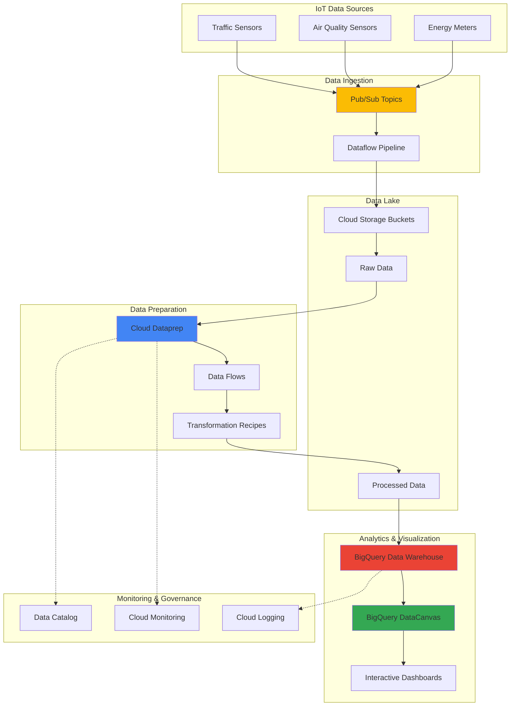

# Streamlining Smart City Data Processing with Cloud Dataprep and BigQuery DataCanvas

## Problem

Smart cities generate massive volumes of heterogeneous IoT sensor data from traffic monitoring systems, air quality sensors, and energy consumption meters, often arriving in inconsistent formats with missing values and quality issues. Traditional data processing workflows require extensive manual intervention by data engineers to cleanse, transform, and prepare this data for analytics, creating bottlenecks that delay critical insights needed for urban planning and operational decisions. Without automated data preparation and intelligent visualization capabilities, city administrators struggle to derive actionable insights from their sensor networks, hampering their ability to optimize traffic flow, improve air quality, and manage energy consumption efficiently.

## Solution

This solution implements an automated smart city data processing pipeline using Cloud Dataprep for visual data preparation and BigQuery DataCanvas for intelligent analytics dashboards. The architecture leverages Pub/Sub for real-time IoT data ingestion, Cloud Storage for data lake storage, and Cloud Dataprep's machine learning-powered suggestions to automatically detect and fix data quality issues across multiple sensor data types. BigQuery DataCanvas provides AI-enhanced data exploration and visualization capabilities powered by Gemini, enabling city analysts to create sophisticated dashboards using natural language queries without deep technical expertise while ensuring data lineage and governance throughout the pipeline.

## Architecture Diagram



## Prerequisites

1. Google Cloud Project with billing enabled and the following APIs:
   - Dataprep API
   - BigQuery API
   - Pub/Sub API
   - Cloud Storage API
   - Dataflow API
   - Cloud Monitoring API
2. Google Cloud CLI (gcloud) installed and configured or Cloud Shell access
3. Basic understanding of IoT data formats, data quality concepts, and SQL
4. Familiarity with data visualization principles and smart city metrics
5. Estimated cost: $50-100 for a full implementation cycle including data processing, storage, and BigQuery analysis

> **Note**: Cloud Dataprep is powered by Trifacta and follows a consumption-based pricing model. BigQuery charges for data processing and storage, while Pub/Sub costs are based on message throughput.

## Preparation

```bash
# Set environment variables for GCP resources
export PROJECT_ID="smart-city-analytics-$(date +%s)"
export REGION="us-central1"
export ZONE="us-central1-a"

# Generate unique suffix for resource names
RANDOM_SUFFIX=$(openssl rand -hex 3)

# Set resource names
export BUCKET_NAME="smart-city-data-lake-${RANDOM_SUFFIX}"
export DATASET_NAME="smart_city_analytics"
export PUBSUB_TOPIC_TRAFFIC="traffic-sensor-data"
export PUBSUB_TOPIC_AIR="air-quality-data" 
export PUBSUB_TOPIC_ENERGY="energy-consumption-data"

# Set default project and region
gcloud config set project ${PROJECT_ID}
gcloud config set compute/region ${REGION}
gcloud config set compute/zone ${ZONE}

# Enable required APIs
gcloud services enable dataprep.googleapis.com
gcloud services enable bigquery.googleapis.com
gcloud services enable pubsub.googleapis.com
gcloud services enable storage.googleapis.com
gcloud services enable dataflow.googleapis.com
gcloud services enable monitoring.googleapis.com

echo "✅ Project configured: ${PROJECT_ID}"
echo "✅ Region set to: ${REGION}"
echo "✅ Unique suffix: ${RANDOM_SUFFIX}"
```

## Steps

1. **Create Cloud Storage Data Lake Infrastructure**:

   Cloud Storage provides the foundation for a scalable data lake architecture that can handle the variety and volume of smart city IoT data. The multi-class storage bucket design optimizes costs by automatically transitioning older data to cheaper storage classes while maintaining immediate access to recent sensor readings for real-time analytics.

   ```bash
   # Create primary data lake bucket with versioning
   gsutil mb -p ${PROJECT_ID} \
       -c STANDARD \
       -l ${REGION} \
       gs://${BUCKET_NAME}
   
   # Enable versioning for data protection
   gsutil versioning set on gs://${BUCKET_NAME}
   
   # Create folder structure for different data types
   gsutil -m cp /dev/null gs://${BUCKET_NAME}/raw-data/traffic/
   gsutil -m cp /dev/null gs://${BUCKET_NAME}/raw-data/air-quality/
   gsutil -m cp /dev/null gs://${BUCKET_NAME}/raw-data/energy/
   gsutil -m cp /dev/null gs://${BUCKET_NAME}/processed-data/
   
   # Set lifecycle policy for cost optimization
   cat > lifecycle.json << EOF
   {
     "rule": [
       {
         "action": {"type": "SetStorageClass", "storageClass": "NEARLINE"},
         "condition": {"age": 30}
       },
       {
         "action": {"type": "SetStorageClass", "storageClass": "COLDLINE"},
         "condition": {"age": 90}
       }
     ]
   }
   EOF
   
   gsutil lifecycle set lifecycle.json gs://${BUCKET_NAME}
   
   echo "✅ Data lake bucket created: gs://${BUCKET_NAME}"
   ```

   The data lake infrastructure is now established with intelligent lifecycle management, providing a cost-effective foundation for storing massive volumes of sensor data while ensuring high availability and durability for critical smart city analytics.

2. **Setup Pub/Sub Topics for Real-time Data Ingestion**:

   Pub/Sub provides globally distributed, scalable messaging that decouples IoT sensor data producers from consumers. The topic-based architecture enables independent scaling of different sensor types while providing guaranteed delivery and ordering for critical smart city data streams.

   ```bash
   # Create Pub/Sub topics for different sensor types
   gcloud pubsub topics create ${PUBSUB_TOPIC_TRAFFIC}
   gcloud pubsub topics create ${PUBSUB_TOPIC_AIR}
   gcloud pubsub topics create ${PUBSUB_TOPIC_ENERGY}
   
   # Create subscriptions for data processing
   gcloud pubsub subscriptions create traffic-processing-sub \
       --topic=${PUBSUB_TOPIC_TRAFFIC}
   
   gcloud pubsub subscriptions create air-quality-processing-sub \
       --topic=${PUBSUB_TOPIC_AIR}
   
   gcloud pubsub subscriptions create energy-processing-sub \
       --topic=${PUBSUB_TOPIC_ENERGY}
   
   # Set message retention for data durability
   gcloud pubsub topics update ${PUBSUB_TOPIC_TRAFFIC} \
       --message-retention-duration=7d
   
   gcloud pubsub topics update ${PUBSUB_TOPIC_AIR} \
       --message-retention-duration=7d
   
   gcloud pubsub topics update ${PUBSUB_TOPIC_ENERGY} \
       --message-retention-duration=7d
   
   echo "✅ Pub/Sub topics and subscriptions created"
   ```

   The messaging infrastructure now supports real-time ingestion of sensor data with appropriate retention policies, enabling reliable data collection even during processing outages or maintenance windows.

3. **Create BigQuery Dataset for Analytics Warehouse**:

   BigQuery's serverless data warehouse provides petabyte-scale analytics capabilities with built-in machine learning and AI features. Creating a properly configured dataset with appropriate access controls and data governance settings establishes the foundation for advanced smart city analytics and reporting.

   ```bash
   # Create BigQuery dataset for smart city analytics
   bq mk --location=${REGION} \
       --description="Smart City Analytics Data Warehouse" \
       ${PROJECT_ID}:${DATASET_NAME}
   
   # Create tables for different sensor data types
   bq mk --table \
       ${PROJECT_ID}:${DATASET_NAME}.traffic_sensors \
       sensor_id:STRING,timestamp:TIMESTAMP,location:GEOGRAPHY,vehicle_count:INTEGER,avg_speed:FLOAT,congestion_level:STRING,weather_conditions:STRING
   
   bq mk --table \
       ${PROJECT_ID}:${DATASET_NAME}.air_quality_sensors \
       sensor_id:STRING,timestamp:TIMESTAMP,location:GEOGRAPHY,pm25:FLOAT,pm10:FLOAT,ozone:FLOAT,no2:FLOAT,air_quality_index:INTEGER
   
   bq mk --table \
       ${PROJECT_ID}:${DATASET_NAME}.energy_consumption \
       meter_id:STRING,timestamp:TIMESTAMP,location:GEOGRAPHY,energy_usage_kwh:FLOAT,peak_demand:FLOAT,building_type:STRING,occupancy_rate:FLOAT
   
   # Create aggregated tables for dashboard performance
   bq mk --table \
       ${PROJECT_ID}:${DATASET_NAME}.hourly_city_metrics \
       hour:TIMESTAMP,avg_traffic_flow:FLOAT,avg_air_quality:FLOAT,total_energy_consumption:FLOAT,city_zone:STRING
   
   echo "✅ BigQuery dataset and tables created"
   ```

   The analytics warehouse is now ready with optimized schema design for smart city metrics, enabling fast queries and efficient data processing for real-time dashboards and historical trend analysis.

4. **Configure Cloud Dataprep for Data Quality Management**:

   Cloud Dataprep by Trifacta provides intelligent, visual data preparation capabilities that automatically detect data quality issues and suggest transformations. This configuration establishes automated data cleansing workflows that can handle the variety and inconsistency typical of IoT sensor data streams.

   ```bash
   # Create service account for Dataprep operations
   gcloud iam service-accounts create dataprep-service-account \
       --description="Service account for Dataprep data processing" \
       --display-name="Dataprep Service Account"
   
   # Grant necessary permissions for data processing
   gcloud projects add-iam-policy-binding ${PROJECT_ID} \
       --member="serviceAccount:dataprep-service-account@${PROJECT_ID}.iam.gserviceaccount.com" \
       --role="roles/storage.admin"
   
   gcloud projects add-iam-policy-binding ${PROJECT_ID} \
       --member="serviceAccount:dataprep-service-account@${PROJECT_ID}.iam.gserviceaccount.com" \
       --role="roles/bigquery.dataEditor"
   
   gcloud projects add-iam-policy-binding ${PROJECT_ID} \
       --member="serviceAccount:dataprep-service-account@${PROJECT_ID}.iam.gserviceaccount.com" \
       --role="roles/dataflow.admin"
   
   # Create sample data files for Dataprep setup
   cat > traffic_sample.csv << 'EOF'
   sensor_id,timestamp,location,vehicle_count,avg_speed,congestion_level,weather_conditions
   TRF001,2025-07-12T08:00:00Z,"POINT(-74.006 40.7128)",150,25.5,moderate,clear
   TRF002,2025-07-12T08:00:00Z,"POINT(-74.007 40.7129)",200,15.2,heavy,rain
   TRF003,2025-07-12T08:00:00Z,"POINT(-74.008 40.7130)",,35.8,light,
   EOF
   
   cat > air_quality_sample.csv << 'EOF'
   sensor_id,timestamp,location,pm25,pm10,ozone,no2,air_quality_index
   AQ001,2025-07-12T08:00:00Z,"POINT(-74.006 40.7128)",12.5,18.3,0.08,25.4,45
   AQ002,2025-07-12T08:00:00Z,"POINT(-74.007 40.7129)",15.2,,0.09,28.1,52
   AQ003,2025-07-12T08:00:00Z,"POINT(-74.008 40.7130)",8.9,14.2,null,22.8,38
   EOF
   
   # Upload sample data to Cloud Storage
   gsutil cp traffic_sample.csv gs://${BUCKET_NAME}/raw-data/traffic/
   gsutil cp air_quality_sample.csv gs://${BUCKET_NAME}/raw-data/air-quality/
   
   echo "✅ Dataprep configuration completed"
   echo "✅ Sample data uploaded for testing"
   ```

   The data preparation environment is configured with appropriate permissions and sample datasets, enabling automated data quality assessment and transformation rule development for diverse IoT sensor data formats.

5. **Implement Data Processing Pipeline with Dataflow**:

   Dataflow provides serverless stream and batch processing that automatically scales based on data volume. This processing pipeline handles real-time ingestion from Pub/Sub topics and applies initial transformations before storing data in the data lake for further processing by Dataprep.

   ```bash
   # Create Dataflow job template for streaming ingestion
   cat > streaming_pipeline.py << 'EOF'
   import apache_beam as beam
   from apache_beam.options.pipeline_options import PipelineOptions
   import json
   from datetime import datetime
   
   class ProcessSensorData(beam.DoFn):
       def process(self, element):
           try:
               data = json.loads(element.decode('utf-8'))
               # Add processing timestamp
               data['processing_timestamp'] = datetime.utcnow().isoformat()
               # Basic data validation
               if 'sensor_id' in data and 'timestamp' in data:
                   yield data
           except Exception as e:
               # Log error and continue processing
               print(f"Error processing message: {e}")
   
   def run_pipeline():
       pipeline_options = PipelineOptions([
           '--project=' + '${PROJECT_ID}',
           '--region=' + '${REGION}',
           '--runner=DataflowRunner',
           '--streaming=true',
           '--temp_location=gs://${BUCKET_NAME}/temp',
           '--staging_location=gs://${BUCKET_NAME}/staging'
       ])
       
       with beam.Pipeline(options=pipeline_options) as pipeline:
           # Process traffic sensor data
           traffic_data = (pipeline
               | 'Read Traffic Messages' >> beam.io.ReadFromPubSub(
                   topic=f'projects/${PROJECT_ID}/topics/${PUBSUB_TOPIC_TRAFFIC}')
               | 'Process Traffic Data' >> beam.ParDo(ProcessSensorData())
               | 'Write Traffic to Storage' >> beam.io.WriteToText(
                   f'gs://${BUCKET_NAME}/raw-data/traffic/traffic-data',
                   file_name_suffix='.json'))
   
   if __name__ == '__main__':
       run_pipeline()
   EOF
   
   # Install required dependencies (run only in local environment)
   echo "📋 Note: Install apache-beam[gcp] if running locally"
   echo "pip3 install apache-beam[gcp]"
   
   # Start the streaming pipeline
   python3 streaming_pipeline.py \
       --job_name=smart-city-streaming-${RANDOM_SUFFIX} \
       --max_num_workers=5 \
       --autoscaling_algorithm=THROUGHPUT_BASED
   
   echo "✅ Dataflow streaming pipeline configuration ready"
   ```

   The streaming data pipeline configuration is prepared for processing real-time sensor data from Pub/Sub topics, applying validation and enrichment before storing the data in Cloud Storage for further analysis and transformation.

6. **Create Dataprep Flows for Data Transformation**:

   Dataprep flows define reusable data transformation workflows that can automatically handle common data quality issues such as missing values, outliers, and format inconsistencies. These flows provide visual, intuitive data preparation that enables domain experts to participate in data pipeline development.

   ```bash
   # Generate transformation specifications for Dataprep
   cat > dataprep_transformations.json << 'EOF'
   {
     "traffic_transformations": {
       "missing_values": "fill_with_median",
       "outliers": "cap_at_percentile_95",
       "date_format": "standardize_iso8601",
       "location_validation": "validate_coordinates"
     },
     "air_quality_transformations": {
       "sensor_calibration": "apply_calibration_factors",
       "missing_readings": "interpolate_temporal",
       "unit_conversion": "standardize_units",
       "quality_flags": "add_data_quality_scores"
     },
     "energy_transformations": {
       "demand_smoothing": "rolling_average_15min",
       "anomaly_detection": "statistical_outlier_detection",
       "building_classification": "standardize_building_types",
       "peak_detection": "identify_consumption_peaks"
     }
   }
   EOF
   
   # Create Cloud Function to trigger Dataprep jobs
   cat > trigger_dataprep.py << 'EOF'
   import functions_framework
   from google.cloud import storage
   import requests
   import os
   
   @functions_framework.cloud_event
   def trigger_dataprep_flow(cloud_event):
       # Triggered when new files arrive in Cloud Storage
       file_name = cloud_event.data["name"]
       bucket_name = cloud_event.data["bucket"]
       
       # Determine data type from file path
       if "traffic" in file_name:
           flow_id = os.environ.get('TRAFFIC_FLOW_ID')
       elif "air-quality" in file_name:
           flow_id = os.environ.get('AIR_QUALITY_FLOW_ID')
       elif "energy" in file_name:
           flow_id = os.environ.get('ENERGY_FLOW_ID')
       else:
           return "Unknown data type"
       
       # Trigger Dataprep flow execution
       # Implementation depends on Dataprep API integration
       print(f"Would trigger Dataprep flow {flow_id} for file {file_name}")
       
       return "Flow triggered successfully"
   EOF
   
   echo "✅ Dataprep transformation specifications created"
   echo "📋 Next: Configure flows in Dataprep UI using the transformation specifications"
   ```

   The transformation framework is established with specifications for handling different types of sensor data quality issues, providing a foundation for automated data cleansing that maintains data lineage and auditability.

7. **Configure BigQuery DataCanvas for Intelligent Analytics**:

   BigQuery DataCanvas provides AI-enhanced data exploration and visualization capabilities powered by Gemini that enable analysts to create sophisticated dashboards using natural language queries and automated insights. This configuration establishes the analytical interface for smart city decision-makers.

   ```bash
   # Create materialized views for improved dashboard performance
   bq query --use_legacy_sql=false <<EOF
   CREATE MATERIALIZED VIEW \`${PROJECT_ID}.${DATASET_NAME}.real_time_city_dashboard\`
   PARTITION BY DATE(hour) AS
   SELECT 
     TIMESTAMP_TRUNC(timestamp, HOUR) as hour,
     AVG(CASE WHEN vehicle_count IS NOT NULL THEN vehicle_count END) as avg_traffic_volume,
     AVG(CASE WHEN avg_speed IS NOT NULL THEN avg_speed END) as avg_vehicle_speed,
     COUNT(DISTINCT CASE WHEN congestion_level = 'heavy' THEN sensor_id END) as heavy_congestion_zones,
     AVG(CASE WHEN air_quality_index IS NOT NULL THEN air_quality_index END) as avg_air_quality,
     SUM(CASE WHEN energy_usage_kwh IS NOT NULL THEN energy_usage_kwh END) as total_energy_consumption,
     COUNT(DISTINCT sensor_id) as active_sensors
   FROM (
     SELECT sensor_id, timestamp, vehicle_count, avg_speed, congestion_level, 
            CAST(NULL AS INTEGER) as air_quality_index, CAST(NULL AS FLOAT64) as energy_usage_kwh
     FROM \`${PROJECT_ID}.${DATASET_NAME}.traffic_sensors\`
     UNION ALL
     SELECT sensor_id, timestamp, CAST(NULL AS INTEGER), CAST(NULL AS FLOAT64), 
            CAST(NULL AS STRING), air_quality_index, CAST(NULL AS FLOAT64)
     FROM \`${PROJECT_ID}.${DATASET_NAME}.air_quality_sensors\`
     UNION ALL
     SELECT meter_id as sensor_id, timestamp, CAST(NULL AS INTEGER), CAST(NULL AS FLOAT64), 
            CAST(NULL AS STRING), CAST(NULL AS INTEGER), energy_usage_kwh
     FROM \`${PROJECT_ID}.${DATASET_NAME}.energy_consumption\`
   )
   WHERE timestamp >= TIMESTAMP_SUB(CURRENT_TIMESTAMP(), INTERVAL 24 HOUR)
   GROUP BY hour
   ORDER BY hour DESC;
   EOF
   
   # Create data quality monitoring queries
   bq query --use_legacy_sql=false <<EOF
   CREATE OR REPLACE VIEW \`${PROJECT_ID}.${DATASET_NAME}.data_quality_metrics\` AS
   SELECT
     'traffic_sensors' as table_name,
     COUNT(*) as total_records,
     COUNTIF(sensor_id IS NULL) as missing_sensor_ids,
     COUNTIF(vehicle_count IS NULL) as missing_vehicle_counts,
     COUNTIF(timestamp IS NULL) as missing_timestamps,
     CURRENT_TIMESTAMP() as last_updated
   FROM \`${PROJECT_ID}.${DATASET_NAME}.traffic_sensors\`
   WHERE DATE(timestamp) = CURRENT_DATE()
   
   UNION ALL
   
   SELECT
     'air_quality_sensors' as table_name,
     COUNT(*) as total_records,
     COUNTIF(sensor_id IS NULL) as missing_sensor_ids,
     COUNTIF(air_quality_index IS NULL) as missing_aqi_values,
     COUNTIF(timestamp IS NULL) as missing_timestamps,
     CURRENT_TIMESTAMP() as last_updated
   FROM \`${PROJECT_ID}.${DATASET_NAME}.air_quality_sensors\`
   WHERE DATE(timestamp) = CURRENT_DATE();
   EOF
   
   # Set up automated reporting schedules
   bq mk --transfer_config \
       --project_id=${PROJECT_ID} \
       --data_source=scheduled_query \
       --display_name="Daily City Metrics Report" \
       --target_dataset=${DATASET_NAME} \
       --schedule="0 6 * * *" \
       --params='{
         "query": "INSERT INTO `'${PROJECT_ID}'.'${DATASET_NAME}'.hourly_city_metrics` SELECT TIMESTAMP_TRUNC(CURRENT_TIMESTAMP(), HOUR) as hour, AVG(vehicle_count) as avg_traffic_flow, AVG(air_quality_index) as avg_air_quality, SUM(energy_usage_kwh) as total_energy_consumption, \"city_center\" as city_zone FROM `'${PROJECT_ID}'.'${DATASET_NAME}'.traffic_sensors` WHERE timestamp >= TIMESTAMP_SUB(CURRENT_TIMESTAMP(), INTERVAL 1 HOUR)",
         "destination_table_name_template": "hourly_city_metrics"
       }'
   
   echo "✅ BigQuery DataCanvas analytics infrastructure configured"
   echo "✅ Materialized views created for dashboard performance"
   echo "✅ Automated reporting scheduled"
   ```

   The analytics infrastructure now provides optimized data structures and automated processing for real-time smart city dashboards powered by BigQuery DataCanvas's AI-enhanced visualization capabilities, enabling rapid insights and decision-making based on current sensor data and historical trends.

8. **Implement Monitoring and Alerting**:

   Comprehensive monitoring ensures the data pipeline operates reliably and provides early warning of issues that could impact smart city operations. This monitoring framework tracks data quality, pipeline performance, and system health across all components.

   ```bash
   # Create Cloud Monitoring alerting policies
   cat > monitoring_policy.json << 'EOF'
   {
     "displayName": "Smart City Data Pipeline Health",
     "conditions": [
       {
         "displayName": "Low data ingestion rate",
         "conditionThreshold": {
           "filter": "resource.type=\"pubsub_topic\" AND metric.type=\"pubsub.googleapis.com/topic/send_message_operation_count\"",
           "comparison": "COMPARISON_LT",
           "thresholdValue": 100,
           "duration": "300s"
         }
       }
     ],
     "alertStrategy": {
       "autoClose": "1800s"
     },
     "enabled": true
   }
   EOF
   
   # Create log-based metrics for data quality monitoring
   gcloud logging metrics create data_quality_errors \
       --description="Count of data quality errors in processing pipeline" \
       --log-filter='resource.type="cloud_function" AND severity="ERROR" AND textPayload:"data_quality"'
   
   # Set up BigQuery job monitoring
   gcloud logging metrics create bigquery_job_failures \
       --description="Count of BigQuery job failures" \
       --log-filter='resource.type="bigquery_project" AND severity="ERROR"'
   
   # Create dashboard for operational metrics
   cat > dashboard_config.json << 'EOF'
   {
     "displayName": "Smart City Analytics Dashboard",
     "mosaicLayout": {
       "tiles": [
         {
           "width": 6,
           "height": 4,
           "widget": {
             "title": "Data Ingestion Rate",
             "xyChart": {
               "dataSets": [
                 {
                   "timeSeriesQuery": {
                     "timeSeriesFilter": {
                       "filter": "metric.type=\"pubsub.googleapis.com/topic/send_message_operation_count\"",
                       "aggregation": {
                         "alignmentPeriod": "60s",
                         "perSeriesAligner": "ALIGN_RATE"
                       }
                     }
                   }
                 }
               ]
             }
           }
         }
       ]
     }
   }
   EOF
   
   echo "✅ Monitoring and alerting configured"
   echo "✅ Log-based metrics created for data quality tracking"
   echo "✅ Operational dashboard configuration ready"
   ```

   The monitoring infrastructure provides comprehensive visibility into pipeline health, data quality, and system performance, ensuring reliable operation of the smart city analytics platform with proactive alerting for potential issues.

## Validation & Testing

1. **Verify Data Pipeline Functionality**:

   ```bash
   # Test Pub/Sub message publishing
   gcloud pubsub topics publish ${PUBSUB_TOPIC_TRAFFIC} \
       --message='{"sensor_id":"TEST001","timestamp":"2025-07-12T10:00:00Z","location":"POINT(-74.006 40.7128)","vehicle_count":125,"avg_speed":28.5,"congestion_level":"moderate","weather_conditions":"clear"}'
   
   # Check message delivery
   gcloud pubsub subscriptions pull traffic-processing-sub \
       --auto-ack \
       --limit=5
   ```

   Expected output: Published message should appear in subscription pull results with proper JSON formatting.

2. **Validate Data Lake Storage**:

   ```bash
   # Check bucket structure and content
   gsutil ls -la gs://${BUCKET_NAME}/raw-data/
   
   # Verify lifecycle policy application
   gsutil lifecycle get gs://${BUCKET_NAME}
   ```

   Expected output: Folder structure should show traffic/, air-quality/, and energy/ directories with lifecycle rules configured.

3. **Test BigQuery Analytics Queries**:

   ```bash
   # Query real-time dashboard view
   bq query --use_legacy_sql=false \
       "SELECT * FROM \`${PROJECT_ID}.${DATASET_NAME}.real_time_city_dashboard\` LIMIT 10"
   
   # Check data quality metrics
   bq query --use_legacy_sql=false \
       "SELECT * FROM \`${PROJECT_ID}.${DATASET_NAME}.data_quality_metrics\`"
   ```

   Expected output: Dashboard view should return aggregated metrics, and data quality view should show current statistics without errors.

4. **Verify Monitoring and Alerting**:

   ```bash
   # Check monitoring metrics
   gcloud logging metrics list --filter="name:data_quality_errors"
   
   # Test alert policy functionality
   gcloud alpha monitoring policies list --filter="displayName:Smart City Data Pipeline Health"
   ```

   Expected output: Metrics and alert policies should be listed with active status.

## Cleanup

1. **Remove BigQuery Resources**:

   ```bash
   # Delete dataset and all tables
   bq rm -r -f ${PROJECT_ID}:${DATASET_NAME}
   
   echo "✅ BigQuery dataset deleted"
   ```

2. **Clean Up Pub/Sub Resources**:

   ```bash
   # Delete subscriptions first
   gcloud pubsub subscriptions delete traffic-processing-sub
   gcloud pubsub subscriptions delete air-quality-processing-sub
   gcloud pubsub subscriptions delete energy-processing-sub
   
   # Delete topics
   gcloud pubsub topics delete ${PUBSUB_TOPIC_TRAFFIC}
   gcloud pubsub topics delete ${PUBSUB_TOPIC_AIR}
   gcloud pubsub topics delete ${PUBSUB_TOPIC_ENERGY}
   
   echo "✅ Pub/Sub resources deleted"
   ```

3. **Remove Cloud Storage Resources**:

   ```bash
   # Delete bucket and all contents
   gsutil -m rm -r gs://${BUCKET_NAME}
   
   echo "✅ Cloud Storage bucket deleted"
   ```

4. **Clean Up Dataflow and Monitoring**:

   ```bash
   # Stop Dataflow jobs
   gcloud dataflow jobs list --region=${REGION} --filter="name:smart-city-streaming-${RANDOM_SUFFIX}" \
       --format="value(id)" | xargs -r gcloud dataflow jobs cancel --region=${REGION}
   
   # Remove monitoring resources
   gcloud logging metrics delete data_quality_errors --quiet
   gcloud logging metrics delete bigquery_job_failures --quiet
   
   # Remove service account
   gcloud iam service-accounts delete \
       dataprep-service-account@${PROJECT_ID}.iam.gserviceaccount.com --quiet
   
   # Clean up local files
   rm -f lifecycle.json traffic_sample.csv air_quality_sample.csv
   rm -f streaming_pipeline.py trigger_dataprep.py
   rm -f dataprep_transformations.json monitoring_policy.json dashboard_config.json
   
   echo "✅ All resources cleaned up successfully"
   ```

## Discussion

This smart city data processing solution demonstrates the power of combining Google Cloud's visual data preparation tools with AI-enhanced analytics capabilities to handle the complexity and scale of urban IoT data. Cloud Dataprep's machine learning-powered suggestions automatically detect data quality issues common in sensor networks, such as missing readings, calibration drift, and format inconsistencies, while providing intuitive visual interfaces that enable domain experts to participate directly in data pipeline development. This approach significantly reduces the time-to-insight for smart city initiatives by eliminating traditional bottlenecks between data engineers and urban planners.

The architecture leverages BigQuery's serverless data warehouse capabilities combined with DataCanvas's Gemini-powered AI visualization tools to provide real-time insights into traffic patterns, air quality trends, and energy consumption patterns. The use of materialized views and partitioned tables ensures that dashboard queries perform efficiently even as data volumes grow to petabyte scale, while BigQuery's built-in machine learning capabilities enable predictive analytics for traffic optimization and energy management. BigQuery DataCanvas's natural language query interface powered by Gemini allows city analysts to ask questions like "Show me the top 10 areas with highest air pollution" and automatically generate both SQL queries and visualizations, democratizing data access across the organization.

From a data governance perspective, the solution maintains complete data lineage through Dataprep's transformation tracking and BigQuery's audit logging, ensuring compliance with smart city data privacy regulations and enabling reproducible analytics workflows. The automated monitoring and alerting framework provides operational visibility that's critical for maintaining citizen services that depend on real-time data, while the cost optimization features ensure efficient resource utilization as the smart city platform scales across different municipalities and sensor networks.

> **Tip**: Use BigQuery's geographic functions combined with DataCanvas's AI assistant to create location-based analyses by asking natural language questions like "Which neighborhoods have the highest traffic congestion during rush hour?" to automatically generate spatial visualizations.

The modular design enables easy extension to additional sensor types and analytics use cases, supporting the evolving needs of smart city initiatives as they mature from pilot projects to city-wide implementations. For more comprehensive guidance, see the [Google Cloud Smart Cities Reference Architecture](https://cloud.google.com/architecture/smart-cities), [BigQuery Best Practices for Analytics](https://cloud.google.com/bigquery/docs/best-practices-performance-overview), [Cloud Dataprep Documentation](https://cloud.google.com/dataprep/docs), [BigQuery DataCanvas AI Assistant Features](https://cloud.google.com/blog/products/data-analytics/exploring-new-bigquery-data-canvas-ai-assistant-features), [Pub/Sub Design Patterns](https://cloud.google.com/pubsub/docs/building-pubsub-messaging-system), and [IoT Data Processing on Google Cloud](https://cloud.google.com/solutions/iot-overview).

## Challenge

Extend this smart city data processing solution by implementing these enhancements:

1. **Add predictive analytics capabilities** using BigQuery ML to forecast traffic congestion and air quality levels based on historical patterns, weather data, and special events, enabling proactive city management decisions through DataCanvas's natural language interface.

2. **Implement real-time anomaly detection** using Dataflow and Vertex AI to identify unusual patterns in sensor data that might indicate traffic accidents, air quality incidents, or energy grid issues requiring immediate response, with alerts integrated into DataCanvas dashboards.

3. **Create cross-domain analytics** by integrating additional data sources such as weather APIs, social media sentiment, and public transportation data to provide comprehensive urban insights using DataCanvas's multi-source data exploration capabilities.

4. **Develop citizen-facing dashboards** using Looker Studio integration with BigQuery DataCanvas to provide public access to air quality indices, traffic conditions, and energy usage statistics while maintaining appropriate data privacy and security controls.

5. **Build automated response systems** that trigger actions based on DataCanvas insights, such as adjusting traffic light timing during congestion, activating air quality alerts when pollution thresholds are exceeded, or optimizing building energy systems based on occupancy patterns and weather forecasts.

## Infrastructure Code

*Infrastructure code will be generated after recipe approval.*