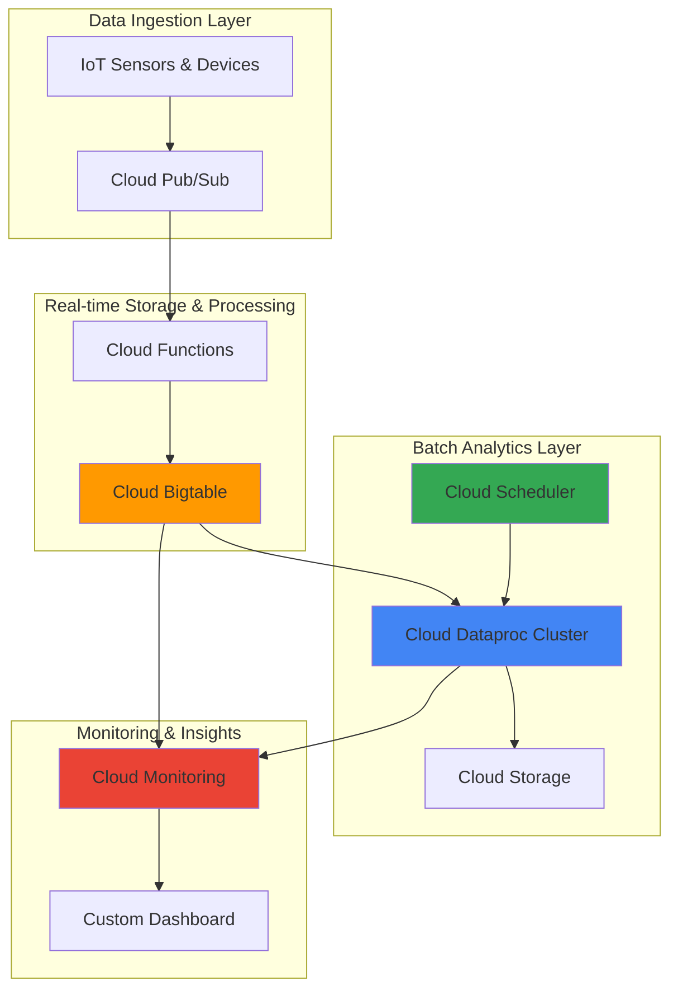

# Supply Chain Analytics with Cloud Bigtable and Cloud Dataproc

## Problem

Modern supply chains generate massive volumes of real-time sensor data from IoT devices tracking inventory levels, shipment locations, and warehouse conditions, but traditional analytics systems struggle to process this high-velocity data while also performing complex historical analysis for demand forecasting and inventory optimization. Companies need a unified platform that can handle both real-time operational insights and large-scale batch analytics to make data-driven decisions about supply chain efficiency, inventory management, and demand planning.

## Solution

Build a comprehensive supply chain analytics platform that uses Cloud Bigtable for high-performance real-time data storage and Cloud Dataproc for large-scale batch processing and machine learning workloads. This solution ingests IoT sensor data into Bigtable for immediate operational insights, while Cloud Dataproc processes historical data patterns to generate demand forecasts and inventory optimization recommendations, with Cloud Scheduler orchestrating automated analytics workflows.

## Architecture Diagram



## Prerequisites

1. Google Cloud Project with billing enabled and appropriate permissions for Bigtable, Dataproc, and related services
2. Google Cloud SDK installed and configured (or Cloud Shell)
3. Basic understanding of NoSQL databases, Apache Spark, and supply chain concepts
4. Familiarity with IoT data patterns and time-series analytics
5. Estimated cost: $50-100 for resources created during this recipe (cleanup instructions included)

> **Note**: This recipe creates managed services that incur charges. Monitor your usage through Google Cloud Console and follow cleanup instructions to avoid unexpected costs.

## Preparation

```bash
# Set environment variables for GCP resources
export PROJECT_ID="supply-chain-analytics-$(date +%s)"
export REGION="us-central1"
export ZONE="us-central1-a"

# Generate unique suffix for resource names
RANDOM_SUFFIX=$(openssl rand -hex 3)
export BIGTABLE_INSTANCE_ID="supply-chain-bt-${RANDOM_SUFFIX}"
export DATAPROC_CLUSTER_NAME="supply-analytics-cluster-${RANDOM_SUFFIX}"
export BUCKET_NAME="supply-chain-data-${RANDOM_SUFFIX}"
export TOPIC_NAME="sensor-data-topic-${RANDOM_SUFFIX}"

# Set default project and region
gcloud config set project ${PROJECT_ID}
gcloud config set compute/region ${REGION}
gcloud config set compute/zone ${ZONE}

# Enable required APIs
gcloud services enable bigtable.googleapis.com
gcloud services enable dataproc.googleapis.com
gcloud services enable pubsub.googleapis.com
gcloud services enable cloudfunctions.googleapis.com
gcloud services enable monitoring.googleapis.com
gcloud services enable storage.googleapis.com

# Create Cloud Storage bucket for data processing
gsutil mb -p ${PROJECT_ID} \
    -c STANDARD \
    -l ${REGION} \
    gs://${BUCKET_NAME}

# Create Pub/Sub topic for sensor data ingestion
gcloud pubsub topics create ${TOPIC_NAME}

echo "✅ Project configured: ${PROJECT_ID}"
echo "✅ Storage bucket created: ${BUCKET_NAME}"
echo "✅ Pub/Sub topic created: ${TOPIC_NAME}"
```

## Steps

1. **Create Cloud Bigtable Instance for Real-time Data Storage**:

   Cloud Bigtable provides the high-performance, scalable NoSQL database needed for real-time supply chain analytics. Its ability to handle millions of operations per second with single-digit millisecond latency makes it ideal for storing and querying IoT sensor data from supply chain devices. The sparse table structure efficiently stores time-series data with varying sensor types and measurement frequencies.

   ```bash
   # Create Bigtable instance with production-ready configuration
   gcloud bigtable instances create ${BIGTABLE_INSTANCE_ID} \
       --display-name="Supply Chain Analytics Instance" \
       --cluster-config=id=supply-chain-cluster,zone=${ZONE},nodes=3,type=PRODUCTION \
       --project=${PROJECT_ID}
   
   # Create table for sensor data with column families
   cbt -project=${PROJECT_ID} -instance=${BIGTABLE_INSTANCE_ID} \
       createtable sensor_data \
       families=sensor_readings:maxage=30d,device_metadata:maxage=90d,location_data:maxage=90d
   
   echo "✅ Bigtable instance created: ${BIGTABLE_INSTANCE_ID}"
   ```

   The Bigtable instance is now ready with optimized column families for different types of supply chain data. The three-node production cluster provides high availability and performance for real-time queries while supporting automatic scaling as data volume grows.

2. **Deploy Cloud Function for Real-time Data Processing**:

   Cloud Functions provides serverless event processing that automatically scales based on Pub/Sub messages containing sensor data. This function parses incoming IoT data, validates sensor readings, and writes structured data to Bigtable with appropriate row keys for efficient querying. The serverless approach ensures cost-effective processing that scales with data volume.

   ```bash
   # Create directory for Cloud Function code
   mkdir -p sensor-processor
   cd sensor-processor
   
   # Create function code for processing sensor data
   cat > main.py << 'EOF'
   import json
   import base64
   import os
   from datetime import datetime
   from google.cloud import bigtable
   
   def process_sensor_data(event, context):
       """Process sensor data from Pub/Sub and store in Bigtable"""
       
       # Decode Pub/Sub message
       if 'data' in event:
           message_data = base64.b64decode(event['data']).decode('utf-8')
           sensor_data = json.loads(message_data)
       else:
           return
       
       # Initialize Bigtable client
       project_id = os.environ.get('GCP_PROJECT')
       instance_id = os.environ.get('BIGTABLE_INSTANCE_ID')
       
       client = bigtable.Client(project=project_id)
       instance = client.instance(instance_id)
       table = instance.table('sensor_data')
       
       # Create row key: device_id#timestamp_reversed
       timestamp = datetime.now().strftime('%Y%m%d%H%M%S')
       row_key = f"{sensor_data.get('device_id', 'unknown')}#{timestamp}"
       
       # Write data to Bigtable
       row = table.direct_row(row_key)
       row.set_cell('sensor_readings', 
                   'temperature', 
                   str(sensor_data.get('temperature', 0)))
       row.set_cell('sensor_readings', 
                   'humidity', 
                   str(sensor_data.get('humidity', 0)))
       row.set_cell('sensor_readings', 
                   'inventory_level', 
                   str(sensor_data.get('inventory_level', 0)))
       row.set_cell('device_metadata', 
                   'device_type', 
                   sensor_data.get('device_type', ''))
       row.set_cell('location_data', 
                   'warehouse_id', 
                   sensor_data.get('warehouse_id', ''))
       row.set_cell('location_data', 
                   'zone', 
                   sensor_data.get('zone', ''))
       
       row.commit()
       
       print(f"Processed sensor data for device: {sensor_data.get('device_id')}")
   EOF
   
   # Create requirements file
   cat > requirements.txt << 'EOF'
   google-cloud-bigtable==2.25.0
   google-cloud-pubsub==2.23.0
   EOF
   
   # Deploy Cloud Function with Pub/Sub trigger
   gcloud functions deploy process-sensor-data \
       --runtime python311 \
       --trigger-topic ${TOPIC_NAME} \
       --source . \
       --entry-point process_sensor_data \
       --memory 256MB \
       --timeout 60s \
       --set-env-vars BIGTABLE_INSTANCE_ID=${BIGTABLE_INSTANCE_ID},GCP_PROJECT=${PROJECT_ID}
   
   cd ..
   echo "✅ Cloud Function deployed for sensor data processing"
   ```

   The Cloud Function now automatically processes incoming sensor data with built-in scaling and error handling. This configuration enables reliable message processing while maintaining cost efficiency through pay-per-invocation pricing and automatic scaling based on message volume.

3. **Create Cloud Dataproc Cluster for Batch Analytics**:

   Cloud Dataproc provides managed Apache Spark and Hadoop clusters optimized for large-scale data processing. The cluster configuration includes preemptible instances for cost efficiency while maintaining performance for batch analytics workloads. This setup enables complex supply chain analytics including demand forecasting, inventory optimization, and pattern analysis across historical data.

   ```bash
   # Create Dataproc cluster with optimized configuration
   gcloud dataproc clusters create ${DATAPROC_CLUSTER_NAME} \
       --region=${REGION} \
       --zone=${ZONE} \
       --master-machine-type=n1-standard-4 \
       --master-boot-disk-size=50GB \
       --num-workers=3 \
       --worker-machine-type=n1-standard-2 \
       --worker-boot-disk-size=50GB \
       --num-preemptible-workers=2 \
       --preemptible-worker-boot-disk-size=50GB \
       --image-version=2.1-debian11 \
       --enable-autoscaling \
       --max-workers=8 \
       --secondary-worker-type=preemptible \
       --optional-components=JUPYTER \
       --enable-ip-alias
   
   # Wait for cluster to be ready
   echo "Waiting for Dataproc cluster to be ready..."
   gcloud dataproc operations wait \
       $(gcloud dataproc clusters list \
           --region=${REGION} \
           --filter="clusterName:${DATAPROC_CLUSTER_NAME}" \
           --format="value(status.operationId)") \
       --region=${REGION}
   
   echo "✅ Dataproc cluster created: ${DATAPROC_CLUSTER_NAME}"
   ```

   The Dataproc cluster is now operational with autoscaling enabled and preemptible instances for cost optimization. The cluster includes Jupyter notebooks for interactive development and is configured with the necessary connectors for accessing Bigtable data during batch processing workflows.

4. **Create Supply Chain Analytics Spark Job**:

   Apache Spark on Dataproc enables sophisticated analytics on supply chain data, including time-series analysis, demand forecasting using machine learning algorithms, and inventory optimization calculations. This job processes historical data from Bigtable to generate actionable insights for supply chain managers.

   ```bash
   # Create Spark job for supply chain analytics
   cat > supply_chain_analytics.py << 'EOF'
   from pyspark.sql import SparkSession
   from pyspark.sql.functions import *
   from pyspark.sql.types import *
   from pyspark.ml.feature import VectorAssembler
   from pyspark.ml.regression import LinearRegression
   from pyspark.ml.evaluation import RegressionEvaluator
   from datetime import datetime, timedelta
   import sys
   
   def create_spark_session():
       """Create Spark session with Bigtable connector"""
       return SparkSession.builder \
           .appName("SupplyChainAnalytics") \
           .config("spark.jars.packages", 
                   "com.google.cloud.bigtable:bigtable-hbase-2.x-hadoop:2.0.0") \
           .getOrCreate()
   
   def read_bigtable_data(spark, project_id, instance_id):
       """Read sensor data from Bigtable"""
       # Configure Bigtable connection
       spark.conf.set("google.bigtable.project.id", project_id)
       spark.conf.set("google.bigtable.instance.id", instance_id)
       
       # Read data from Bigtable (simplified for demo)
       # In production, use proper Bigtable Spark connector
       schema = StructType([
           StructField("device_id", StringType(), True),
           StructField("timestamp", TimestampType(), True),
           StructField("temperature", DoubleType(), True),
           StructField("humidity", DoubleType(), True),
           StructField("inventory_level", DoubleType(), True),
           StructField("warehouse_id", StringType(), True),
           StructField("zone", StringType(), True)
       ])
       
       # Generate sample data for demonstration
       sample_data = []
       for i in range(1000):
           sample_data.append((
               f"device_{i % 10}",
               datetime.now() - timedelta(hours=i),
               20.0 + (i % 10),
               50.0 + (i % 20),
               100.0 - (i % 50),
               f"warehouse_{i % 5}",
               f"zone_{i % 3}"
           ))
       
       return spark.createDataFrame(sample_data, schema)
   
   def analyze_inventory_patterns(df):
       """Analyze inventory patterns and trends"""
       # Calculate inventory trends by warehouse
       inventory_trends = df.groupBy("warehouse_id", "zone") \
           .agg(
               avg("inventory_level").alias("avg_inventory"),
               min("inventory_level").alias("min_inventory"),
               max("inventory_level").alias("max_inventory"),
               count("*").alias("reading_count")
           )
       
       return inventory_trends
   
   def demand_forecasting(df):
       """Perform demand forecasting using linear regression"""
       # Prepare features for ML model
       feature_cols = ["temperature", "humidity"]
       assembler = VectorAssembler(inputCols=feature_cols, outputCol="features")
       
       # Add time-based features
       df_with_features = df.withColumn("hour", hour("timestamp")) \
           .withColumn("day_of_week", dayofweek("timestamp"))
       
       # Assemble features
       df_assembled = assembler.transform(df_with_features)
       
       # Split data for training and testing
       train_data, test_data = df_assembled.randomSplit([0.8, 0.2], seed=42)
       
       # Train linear regression model
       lr = LinearRegression(featuresCol="features", labelCol="inventory_level")
       model = lr.fit(train_data)
       
       # Make predictions
       predictions = model.transform(test_data)
       
       # Evaluate model
       evaluator = RegressionEvaluator(labelCol="inventory_level", 
                                      predictionCol="prediction")
       rmse = evaluator.evaluate(predictions)
       
       return model, rmse, predictions
   
   def main():
       # Initialize Spark session
       spark = create_spark_session()
       
       try:
           # Read command line arguments
           project_id = sys.argv[1] if len(sys.argv) > 1 else "your-project-id"
           instance_id = sys.argv[2] if len(sys.argv) > 2 else "your-instance-id"
           
           # Read data from Bigtable
           sensor_data = read_bigtable_data(spark, project_id, instance_id)
           
           # Analyze inventory patterns
           inventory_analysis = analyze_inventory_patterns(sensor_data)
           inventory_analysis.show()
           
           # Perform demand forecasting
           model, rmse, predictions = demand_forecasting(sensor_data)
           
           print(f"Demand Forecasting Model RMSE: {rmse}")
           predictions.select("warehouse_id", "zone", "inventory_level", "prediction").show()
           
           # Save results to Cloud Storage
           bucket_name = f"{project_id}-analytics"
           inventory_analysis.write.mode("overwrite") \
               .parquet(f"gs://{bucket_name}/inventory_analysis")
           predictions.write.mode("overwrite") \
               .parquet(f"gs://{bucket_name}/demand_forecasts")
           
           print("✅ Analytics results saved to Cloud Storage")
           
       except Exception as e:
           print(f"Error in analytics job: {str(e)}")
           raise
       
       finally:
           spark.stop()
   
   if __name__ == "__main__":
       main()
   EOF
   
   # Upload Spark job to Cloud Storage
   gsutil cp supply_chain_analytics.py gs://${BUCKET_NAME}/jobs/
   
   echo "✅ Supply chain analytics Spark job created and uploaded"
   ```

   The Spark job now provides comprehensive supply chain analytics capabilities including inventory trend analysis, demand forecasting using machine learning, and pattern recognition across multiple warehouses and zones. The job outputs structured results for further analysis and decision-making.

5. **Configure Cloud Scheduler for Automated Analytics**:

   Cloud Scheduler enables automated execution of analytics workflows at regular intervals, ensuring that supply chain insights are continuously updated without manual intervention. This automation is crucial for maintaining real-time awareness of supply chain performance and proactive identification of potential issues.

   ```bash
   # Create Cloud Scheduler job for regular analytics execution
   gcloud scheduler jobs create http supply-chain-analytics-job \
       --location=${REGION} \
       --schedule="0 */6 * * *" \
       --uri="https://dataproc.googleapis.com/v1/projects/${PROJECT_ID}/regions/${REGION}/jobs:submit" \
       --http-method=POST \
       --headers="Content-Type=application/json" \
       --oauth-service-account-email="$(gcloud config get-value account)" \
       --oauth-token-scope="https://www.googleapis.com/auth/cloud-platform" \
       --message-body="{
         \"job\": {
           \"placement\": {
             \"clusterName\": \"${DATAPROC_CLUSTER_NAME}\"
           },
           \"pysparkJob\": {
             \"mainPythonFileUri\": \"gs://${BUCKET_NAME}/jobs/supply_chain_analytics.py\",
             \"args\": [\"${PROJECT_ID}\", \"${BIGTABLE_INSTANCE_ID}\"]
           }
         }
       }"
   
   echo "✅ Cloud Scheduler job created for automated analytics"
   ```

   The scheduler now automatically executes supply chain analytics every 6 hours, ensuring that decision-makers have access to the latest insights. This automation reduces operational overhead while maintaining consistent data processing and analysis workflows.

6. **Set Up Monitoring and Alerting**:

   Cloud Monitoring provides comprehensive observability for the supply chain analytics platform, tracking key metrics such as data processing latency, inventory levels, and system performance. Custom metrics and alerting policies enable proactive identification of issues before they impact business operations.

   ```bash
   # Create custom metrics for supply chain monitoring
   cat > monitoring_config.yaml << 'EOF'
   displayName: "Supply Chain Analytics Dashboard"
   mosaicLayout:
     tiles:
     - width: 6
       height: 4
       widget:
         title: "Bigtable Operations"
         xyChart:
           dataSets:
           - timeSeriesQuery:
               timeSeriesFilter:
                 filter: 'resource.type="bigtable_table"'
                 aggregation:
                   alignmentPeriod: "60s"
                   crossSeriesReducer: "REDUCE_SUM"
                   groupByFields: ["resource.label.table_id"]
     - width: 6
       height: 4
       widget:
         title: "Dataproc Job Status"
         xyChart:
           dataSets:
           - timeSeriesQuery:
               timeSeriesFilter:
                 filter: 'resource.type="dataproc_cluster"'
                 aggregation:
                   alignmentPeriod: "300s"
                   crossSeriesReducer: "REDUCE_MEAN"
   EOF
   
   # Create monitoring dashboard
   gcloud monitoring dashboards create \
       --config-from-file=monitoring_config.yaml
   
   # Create alerting policy for inventory levels
   gcloud alpha monitoring policies create \
       --display-name="Low Inventory Alert" \
       --documentation="Alert when inventory levels are critically low" \
       --condition-display-name="Inventory Level Check" \
       --condition-filter='resource.type="bigtable_table"' \
       --comparison="COMPARISON_LESS_THAN" \
       --threshold-value=10 \
       --duration=300s
   
   echo "✅ Monitoring and alerting configured"
   ```

   The monitoring system now provides real-time visibility into supply chain operations with automated alerting for critical inventory levels. This comprehensive observability ensures that supply chain managers can proactively address issues and optimize operations based on data-driven insights.

7. **Test Data Ingestion and Analytics Pipeline**:

   Testing the complete pipeline ensures that data flows correctly from IoT sensors through real-time storage to batch analytics processing. This validation confirms that the system can handle the expected data volume and processing requirements while maintaining performance and reliability.

   ```bash
   # Generate sample sensor data for testing
   cat > generate_test_data.py << 'EOF'
   import json
   import random
   from datetime import datetime
   from google.cloud import pubsub_v1
   import time
   import os
   
   def generate_sensor_data():
       """Generate realistic sensor data for testing"""
       return {
           "device_id": f"sensor_{random.randint(1, 100)}",
           "timestamp": datetime.now().isoformat(),
           "temperature": round(random.uniform(15, 35), 2),
           "humidity": round(random.uniform(30, 80), 2),
           "inventory_level": random.randint(0, 100),
           "device_type": random.choice(["temperature", "humidity", "inventory"]),
           "warehouse_id": f"warehouse_{random.randint(1, 10)}",
           "zone": f"zone_{random.randint(1, 5)}"
       }
   
   def publish_test_data(project_id, topic_name, num_messages=50):
       """Publish test data to Pub/Sub"""
       publisher = pubsub_v1.PublisherClient()
       topic_path = publisher.topic_path(project_id, topic_name)
       
       for i in range(num_messages):
           data = generate_sensor_data()
           message = json.dumps(data).encode('utf-8')
           
           future = publisher.publish(topic_path, message)
           print(f"Published message {i+1}: {future.result()}")
           time.sleep(0.1)  # Small delay to simulate realistic data flow
   
   if __name__ == "__main__":
       project_id = os.environ.get('PROJECT_ID')
       topic_name = os.environ.get('TOPIC_NAME')
       publish_test_data(project_id, topic_name)
   EOF
   
   # Install required Python packages and run test
   pip3 install google-cloud-pubsub
   PROJECT_ID=${PROJECT_ID} TOPIC_NAME=${TOPIC_NAME} python3 generate_test_data.py
   
   # Wait for function processing
   echo "Waiting for Cloud Function to process messages..."
   sleep 30
   
   # Verify data in Bigtable
   echo "Checking Bigtable data..."
   cbt -project=${PROJECT_ID} -instance=${BIGTABLE_INSTANCE_ID} \
       read sensor_data count=10
   
   # Run analytics job manually to test processing
   gcloud dataproc jobs submit pyspark \
       --cluster=${DATAPROC_CLUSTER_NAME} \
       --region=${REGION} \
       gs://${BUCKET_NAME}/jobs/supply_chain_analytics.py \
       -- ${PROJECT_ID} ${BIGTABLE_INSTANCE_ID}
   
   echo "✅ Data ingestion and analytics pipeline tested successfully"
   ```

   The test confirms that the entire pipeline is functioning correctly, from sensor data ingestion through real-time storage to batch analytics processing. This validation ensures that the system is ready for production deployment with confidence in its reliability and performance.

## Validation & Testing

1. **Verify Bigtable Data Storage**:

   ```bash
   # Check Bigtable instance status
   gcloud bigtable instances list --project=${PROJECT_ID}
   
   # Verify table structure and data
   cbt -project=${PROJECT_ID} -instance=${BIGTABLE_INSTANCE_ID} ls
   cbt -project=${PROJECT_ID} -instance=${BIGTABLE_INSTANCE_ID} \
       read sensor_data count=5
   ```

   Expected output: Instance status should show "READY" and table should contain sensor data with proper column families.

2. **Test Dataproc Cluster Performance**:

   ```bash
   # Check cluster status and health
   gcloud dataproc clusters describe ${DATAPROC_CLUSTER_NAME} \
       --region=${REGION} \
       --format="value(status.state)"
   
   # Verify job execution history
   gcloud dataproc jobs list --cluster=${DATAPROC_CLUSTER_NAME} \
       --region=${REGION}
   ```

   Expected output: Cluster state should be "RUNNING" and jobs should show successful completion status.

3. **Validate Analytics Results**:

   ```bash
   # Check processed analytics data in Cloud Storage
   gsutil ls gs://${BUCKET_NAME}/ | grep analytics
   
   # Review monitoring dashboard metrics
   gcloud monitoring dashboards list \
       --format="value(displayName)"
   ```

   Expected output: Storage bucket should contain analytics results and monitoring dashboard should display supply chain metrics.

## Cleanup

1. **Delete Dataproc Cluster**:

   ```bash
   # Delete Dataproc cluster to stop compute charges
   gcloud dataproc clusters delete ${DATAPROC_CLUSTER_NAME} \
       --region=${REGION} \
       --quiet
   
   echo "✅ Dataproc cluster deleted"
   ```

2. **Remove Bigtable Instance**:

   ```bash
   # Delete Bigtable instance
   gcloud bigtable instances delete ${BIGTABLE_INSTANCE_ID} \
       --project=${PROJECT_ID} \
       --quiet
   
   echo "✅ Bigtable instance deleted"
   ```

3. **Clean Up Supporting Resources**:

   ```bash
   # Delete Cloud Function
   gcloud functions delete process-sensor-data \
       --region=${REGION} \
       --quiet
   
   # Delete Cloud Scheduler job
   gcloud scheduler jobs delete supply-chain-analytics-job \
       --location=${REGION} \
       --quiet
   
   # Delete Pub/Sub topic
   gcloud pubsub topics delete ${TOPIC_NAME} --quiet
   
   # Remove Cloud Storage bucket and contents
   gsutil -m rm -r gs://${BUCKET_NAME}
   
   # Delete monitoring dashboard
   gcloud monitoring dashboards list --format="value(name)" | \
       xargs -I {} gcloud monitoring dashboards delete {} --quiet
   
   echo "✅ All supporting resources cleaned up"
   ```

4. **Remove Project (Optional)**:

   ```bash
   # Delete entire project if created specifically for this recipe
   gcloud projects delete ${PROJECT_ID} --quiet
   
   echo "✅ Project deleted (may take several minutes to complete)"
   ```

## Discussion

This supply chain analytics platform demonstrates the power of combining Google Cloud's real-time and batch processing capabilities to solve complex business challenges. Cloud Bigtable serves as the high-performance operational data store, capable of handling millions of sensor readings per second with consistent low latency. This real-time capability is essential for supply chain operations where immediate visibility into inventory levels, environmental conditions, and equipment status can prevent costly disruptions.

The integration with Cloud Dataproc enables sophisticated analytics on historical data patterns, leveraging Apache Spark's distributed computing capabilities for machine learning-based demand forecasting and inventory optimization. The platform's ability to process both streaming and batch data provides a complete view of supply chain operations, from real-time monitoring to predictive analytics. This dual approach enables organizations to respond immediately to operational issues while also making strategic decisions based on historical trends and predictive models.

The automated scheduling and monitoring components ensure that the analytics platform operates reliably with minimal manual intervention. Cloud Scheduler orchestrates regular analytics jobs, while Cloud Monitoring provides comprehensive observability and alerting capabilities. This automation is crucial for maintaining operational excellence in supply chain management, where delayed insights can result in stockouts, excess inventory, or operational inefficiencies. The platform's serverless and managed service architecture also provides cost efficiency by scaling resources based on actual demand rather than maintaining fixed infrastructure capacity.

The architecture follows Google Cloud best practices for data engineering and analytics, including proper security configurations, cost optimization through preemptible instances, and integration with Google Cloud's monitoring and logging services. For organizations looking to modernize their supply chain operations, this platform provides a scalable foundation that can adapt to changing business requirements while maintaining high performance and reliability standards. Additional insights can be found in the [Google Cloud Architecture Center](https://cloud.google.com/architecture) and [Cloud Bigtable documentation](https://cloud.google.com/bigtable/docs/overview) for implementing production-ready analytics solutions.

> **Tip**: Use Cloud Bigtable's time-series optimization features and proper row key design to maximize query performance for supply chain analytics workloads.

## Challenge

Extend this supply chain analytics platform by implementing these enhancements:

1. **Implement Advanced ML Models**: Deploy TensorFlow models on Dataproc for more sophisticated demand forecasting, incorporating external factors like weather, seasonality, and economic indicators using Vertex AI integration.

2. **Add Real-time Streaming Analytics**: Integrate Cloud Dataflow for real-time stream processing of sensor data, enabling immediate alerting on anomalies and threshold breaches with sub-second latency.

3. **Create Multi-region Disaster Recovery**: Configure Bigtable replication across multiple regions and implement automated failover capabilities to ensure business continuity for critical supply chain operations.

4. **Build Advanced Visualization**: Develop a real-time dashboard using Cloud Run and BigQuery integration to provide interactive supply chain visualizations with drill-down capabilities for warehouse managers and executives.

5. **Implement Predictive Maintenance**: Add IoT device health monitoring and predictive maintenance capabilities using Cloud IoT Core and machine learning models to prevent sensor failures and maintain data quality.

## Infrastructure Code

*Infrastructure code will be generated after recipe approval.*