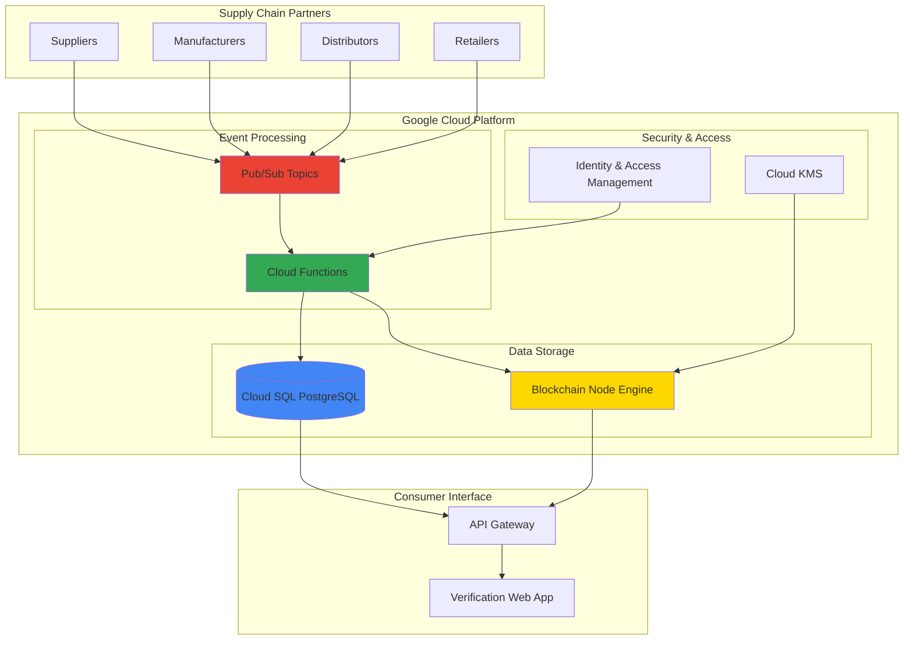

# Supply Chain Transparency with Cloud SQL and Blockchain Node Engine

## Problem

Modern supply chains face critical challenges around transparency and product authenticity verification. Companies struggle to track products across complex multi-tier supplier networks, leading to counterfeit goods, compliance violations, and lost consumer trust. Traditional tracking systems rely on centralized databases that can be manipulated, lack interoperability between partners, and provide no immutable audit trail for regulatory compliance or consumer verification.

## Solution

Build a hybrid supply chain transparency system that combines Cloud SQL for high-performance operational data storage with Blockchain Node Engine for immutable verification records. This architecture leverages Cloud Functions for automated data processing and Pub/Sub for real-time event distribution, creating a scalable solution that maintains both operational efficiency and cryptographic proof of authenticity across the entire supply chain ecosystem.

## Architecture Diagram



## Prerequisites

1. Google Cloud account with billing enabled and appropriate IAM permissions for Cloud SQL, Blockchain Node Engine, Cloud Functions, and Pub/Sub
2. Google Cloud CLI (gcloud) v400.0.0 or later installed and configured
3. Basic understanding of blockchain concepts, PostgreSQL databases, and event-driven architectures
4. Node.js 18+ and npm installed for Cloud Functions development
5. Estimated cost: $150-300/month for production workload (includes Cloud SQL instance, blockchain node hosting, function executions, and Pub/Sub messaging)

> **Note**: Blockchain Node Engine requires allowlisting for access. Request access through the [Google Cloud Console](https://cloud.google.com/blockchain-node-engine) before beginning this recipe.

## Preparation

```bash
# Set environment variables for consistent resource naming
export PROJECT_ID="supply-chain-$(date +%s)"
export REGION="us-central1"
export ZONE="us-central1-a"

# Generate unique suffix for resource names
RANDOM_SUFFIX=$(openssl rand -hex 3)
export DB_INSTANCE_NAME="supply-chain-db-${RANDOM_SUFFIX}"
export BLOCKCHAIN_NODE_NAME="supply-chain-node-${RANDOM_SUFFIX}"

# Set default project and region for gcloud CLI
gcloud config set project ${PROJECT_ID}
gcloud config set compute/region ${REGION}
gcloud config set compute/zone ${ZONE}

# Enable required Google Cloud APIs
gcloud services enable sqladmin.googleapis.com
gcloud services enable blockchainnodeengine.googleapis.com  
gcloud services enable cloudfunctions.googleapis.com
gcloud services enable pubsub.googleapis.com
gcloud services enable cloudkms.googleapis.com

echo "✅ Project configured: ${PROJECT_ID}"
echo "✅ APIs enabled for supply chain transparency system"
```

## Steps

1. **Create Cloud KMS Encryption Key for Blockchain Security**:

   Cloud KMS provides enterprise-grade cryptographic key management with hardware security modules (HSMs) and automatic key rotation. This managed service ensures that blockchain-related encryption keys are protected according to FIPS 140-2 Level 3 standards, meeting the highest compliance requirements while integrating seamlessly with other Google Cloud services for supply chain data protection.

   ```bash
   # Create KMS keyring for blockchain operations
   gcloud kms keyrings create blockchain-keyring \
       --location=${REGION}
   
   # Create encryption key for blockchain node
   gcloud kms keys create blockchain-key \
       --location=${REGION} \
       --keyring=blockchain-keyring \
       --purpose=encryption
   
   echo "✅ KMS encryption key created for blockchain security"
   ```

   The encryption key is now available for protecting sensitive blockchain operations and supply chain data. This cryptographic foundation enables data-at-rest encryption, secure key rotation, and compliance with enterprise security requirements while supporting the immutable audit trail needed for supply chain transparency.

2. **Deploy Cloud SQL PostgreSQL Instance for Supply Chain Data**:

   Cloud SQL provides a fully managed PostgreSQL database service with automatic backups, high availability, and security features essential for supply chain operations. The database will store operational data including product information, supplier details, and transaction metadata, while the blockchain stores immutable verification hashes.

   ```bash
   # Create Cloud SQL PostgreSQL instance
   gcloud sql instances create ${DB_INSTANCE_NAME} \
       --database-version=POSTGRES_15 \
       --tier=db-custom-2-8192 \
       --region=${REGION} \
       --backup-start-time=03:00 \
       --maintenance-window-day=SUN \
       --maintenance-window-hour=04
   
   # Create supply chain database
   gcloud sql databases create supply_chain \
       --instance=${DB_INSTANCE_NAME}
   
   # Create database user with secure password
   PGPASSWORD=$(openssl rand -base64 32)
   gcloud sql users create supply_chain_user \
       --instance=${DB_INSTANCE_NAME} \
       --password=${PGPASSWORD}
   
   echo "✅ Cloud SQL instance created: ${DB_INSTANCE_NAME}"
   echo "Database password stored in: \$PGPASSWORD"
   ```

   The PostgreSQL database is now configured with automated backups and maintenance windows, providing a reliable foundation for supply chain operational data. This setup ensures data durability and availability while maintaining the performance needed for real-time supply chain tracking and reporting operations.

3. **Initialize Database Schema for Supply Chain Tracking**:

   The database schema supports comprehensive supply chain tracking with products, suppliers, transactions, and verification records. This relational structure enables complex queries for supply chain analysis while maintaining data integrity through foreign key constraints and proper indexing for performance.

   ```bash
   # Get Cloud SQL instance IP for connection
   DB_IP=$(gcloud sql instances describe ${DB_INSTANCE_NAME} \
       --format="value(ipAddresses[0].ipAddress)")
   
   # Create database schema using Cloud Shell
   cat << 'EOF' > schema.sql
   -- Products table for supply chain items
   CREATE TABLE products (
       product_id SERIAL PRIMARY KEY,
       sku VARCHAR(50) UNIQUE NOT NULL,
       name VARCHAR(255) NOT NULL,
       description TEXT,
       category VARCHAR(100),
       created_at TIMESTAMP DEFAULT CURRENT_TIMESTAMP,
       blockchain_hash VARCHAR(66)
   );
   
   -- Suppliers table for supply chain partners
   CREATE TABLE suppliers (
       supplier_id SERIAL PRIMARY KEY,
       name VARCHAR(255) NOT NULL,
       address TEXT,
       certification_level VARCHAR(50),
       created_at TIMESTAMP DEFAULT CURRENT_TIMESTAMP
   );
   
   -- Supply chain transactions
   CREATE TABLE transactions (
       transaction_id SERIAL PRIMARY KEY,
       product_id INTEGER REFERENCES products(product_id),
       supplier_id INTEGER REFERENCES suppliers(supplier_id),
       transaction_type VARCHAR(50) NOT NULL,
       quantity INTEGER NOT NULL,
       location VARCHAR(255),
       timestamp TIMESTAMP DEFAULT CURRENT_TIMESTAMP,
       blockchain_hash VARCHAR(66),
       verified BOOLEAN DEFAULT FALSE
   );
   
   -- Create indexes for performance
   CREATE INDEX idx_products_sku ON products(sku);
   CREATE INDEX idx_transactions_product ON transactions(product_id);
   CREATE INDEX idx_transactions_timestamp ON transactions(timestamp);
   CREATE INDEX idx_transactions_blockchain_hash ON transactions(blockchain_hash);
   EOF
   
   # Execute schema creation
   gcloud sql connect ${DB_INSTANCE_NAME} --user=supply_chain_user \
       --database=supply_chain < schema.sql
   
   echo "✅ Database schema created for supply chain tracking"
   ```

   The database schema now supports comprehensive supply chain tracking with proper relationships and indexing. This structure enables efficient queries for product lineage, supplier verification, and transaction history while providing the foundation for blockchain hash storage and verification workflows.

4. **Deploy Blockchain Node Engine for Immutable Verification**:

   Blockchain Node Engine provides a fully managed blockchain infrastructure that eliminates the operational overhead of running blockchain nodes. This service enables supply chain participants to create immutable records of transactions and product movements, providing cryptographic proof of authenticity that cannot be tampered with or falsified.

   ```bash
   # Create blockchain node for Ethereum mainnet
   gcloud alpha blockchain-node-engine nodes create ${BLOCKCHAIN_NODE_NAME} \
       --location=${REGION} \
       --blockchain-type=ETHEREUM \
       --network=MAINNET \
       --node-type=FULL \
       --execution-client=GETH \
       --consensus-client=LIGHTHOUSE
   
   # Wait for node deployment
   echo "Waiting for blockchain node deployment..."
   gcloud alpha blockchain-node-engine nodes describe ${BLOCKCHAIN_NODE_NAME} \
       --location=${REGION} \
       --format="value(state)"
   
   echo "✅ Blockchain Node Engine deployed: ${BLOCKCHAIN_NODE_NAME}"
   ```

   The blockchain node is now available for creating immutable supply chain records. This managed infrastructure provides the reliability and security needed for enterprise supply chain verification while handling the complexity of blockchain operations, node synchronization, and network connectivity automatically.

5. **Create Pub/Sub Topics for Supply Chain Events**:

   Pub/Sub enables real-time event processing for supply chain activities, decoupling data ingestion from processing workflows. This messaging service supports high-throughput event streams from multiple supply chain partners while ensuring reliable delivery and enabling automated responses to supply chain events.

   ```bash
   # Create topic for supply chain events
   gcloud pubsub topics create supply-chain-events
   
   # Create topic for blockchain verification requests
   gcloud pubsub topics create blockchain-verification
   
   # Create subscriptions for event processing
   gcloud pubsub subscriptions create process-supply-events \
       --topic=supply-chain-events
   
   gcloud pubsub subscriptions create process-blockchain-verification \
       --topic=blockchain-verification
   
   echo "✅ Pub/Sub topics created for supply chain event processing"
   ```

   The messaging infrastructure now supports real-time supply chain event processing with reliable delivery guarantees. This event-driven architecture enables automatic verification workflows, real-time notifications, and scalable processing of supply chain activities from multiple partners and geographic locations.

6. **Deploy Cloud Functions for Supply Chain Processing**:

   Cloud Functions provide serverless compute for processing supply chain events, updating databases, and interacting with the blockchain. These functions automatically scale based on event volume while maintaining low latency for real-time supply chain operations and verification workflows.

   ```bash
   # Create directory for Cloud Functions
   mkdir -p cloud-functions/supply-chain-processor
   cd cloud-functions/supply-chain-processor
   
   # Create package.json for dependencies
   cat << 'EOF' > package.json
   {
     "name": "supply-chain-processor",
     "version": "1.0.0",
     "dependencies": {
       "@google-cloud/functions-framework": "^3.3.0",
       "@google-cloud/pubsub": "^4.0.0",
       "@google-cloud/sql-connector": "^1.0.0",
       "pg": "^8.11.0",
       "web3": "^4.0.0"
     }
   }
   EOF
   
   # Create supply chain processing function
   cat << 'EOF' > index.js
   const {PubSub} = require('@google-cloud/pubsub');
   const {Client} = require('pg');
   const Web3 = require('web3');
   
   const pubsub = new PubSub();
   
   exports.processSupplyChainEvent = async (event, context) => {
     try {
       const eventData = JSON.parse(Buffer.from(event.data, 'base64').toString());
       console.log('Processing supply chain event:', eventData);
       
       // Connect to Cloud SQL
       const client = new Client({
         host: process.env.DB_HOST,
         database: 'supply_chain',
         user: 'supply_chain_user',
         password: process.env.DB_PASSWORD,
       });
       
       await client.connect();
       
       // Insert transaction record
       const query = `
         INSERT INTO transactions (product_id, supplier_id, transaction_type, quantity, location, blockchain_hash)
         VALUES ($1, $2, $3, $4, $5, $6)
         RETURNING transaction_id
       `;
       
       const values = [
         eventData.product_id,
         eventData.supplier_id,
         eventData.transaction_type,
         eventData.quantity,
         eventData.location,
         eventData.blockchain_hash
       ];
       
       const result = await client.query(query, values);
       console.log('Transaction recorded:', result.rows[0].transaction_id);
       
       // Publish to blockchain verification queue
       const verificationData = {
         transaction_id: result.rows[0].transaction_id,
         blockchain_hash: eventData.blockchain_hash
       };
       
       await pubsub.topic('blockchain-verification').publish(
         Buffer.from(JSON.stringify(verificationData))
       );
       
       await client.end();
       
     } catch (error) {
       console.error('Error processing supply chain event:', error);
       throw error;
     }
   };
   EOF
   
   # Deploy Cloud Function
   gcloud functions deploy processSupplyChainEvent \
       --runtime=nodejs18 \
       --trigger-topic=supply-chain-events \
       --entry-point=processSupplyChainEvent \
       --set-env-vars="DB_HOST=${DB_IP},DB_PASSWORD=${PGPASSWORD}" \
       --memory=512MB \
       --timeout=60s
   
   cd ../..
   echo "✅ Cloud Function deployed for supply chain processing"
   ```

   The serverless processing function now handles supply chain events automatically, updating the database and triggering blockchain verification workflows. This event-driven architecture ensures reliable processing of supply chain activities while maintaining the separation between operational data storage and immutable blockchain verification.

7. **Create IAM Service Account for Supply Chain Operations**:

   IAM service accounts provide secure authentication for supply chain operations with least-privilege access controls. This approach ensures that each component of the system has only the permissions needed for its specific functions while maintaining audit trails for all access and operations.

   ```bash
   # Create service account for supply chain operations
   gcloud iam service-accounts create supply-chain-sa \
       --display-name="Supply Chain Service Account" \
       --description="Service account for supply chain transparency operations"
   
   # Grant necessary permissions
   gcloud projects add-iam-policy-binding ${PROJECT_ID} \
       --member="serviceAccount:supply-chain-sa@${PROJECT_ID}.iam.gserviceaccount.com" \
       --role="roles/cloudsql.client"
   
   gcloud projects add-iam-policy-binding ${PROJECT_ID} \
       --member="serviceAccount:supply-chain-sa@${PROJECT_ID}.iam.gserviceaccount.com" \
       --role="roles/pubsub.editor"
   
   gcloud projects add-iam-policy-binding ${PROJECT_ID} \
       --member="serviceAccount:supply-chain-sa@${PROJECT_ID}.iam.gserviceaccount.com" \
       --role="roles/blockchain.nodeUser"
   
   echo "✅ IAM service account configured with least-privilege permissions"
   ```

   The service account now provides secure access to all supply chain system components with appropriate permissions. This security model ensures that supply chain operations can access required resources while maintaining the principle of least privilege and providing detailed audit trails for compliance requirements.

8. **Configure Supply Chain Data Ingestion Endpoint**:

   Create a secure API endpoint for supply chain partners to submit transaction data. This endpoint validates incoming data, enriches it with metadata, and publishes events to the processing pipeline while maintaining authentication and authorization controls.

   ```bash
   # Create API Gateway function for data ingestion
   mkdir -p cloud-functions/supply-chain-api
   cd cloud-functions/supply-chain-api
   
   cat << 'EOF' > package.json
   {
     "name": "supply-chain-api",
     "version": "1.0.0",
     "dependencies": {
       "@google-cloud/functions-framework": "^3.3.0",
       "@google-cloud/pubsub": "^4.0.0",
       "express": "^4.18.0",
       "crypto": "^1.0.1"
     }
   }
   EOF
   
   cat << 'EOF' > index.js
   const {PubSub} = require('@google-cloud/pubsub');
   const crypto = require('crypto');
   
   const pubsub = new PubSub();
   
   exports.supplyChainIngestion = async (req, res) => {
     try {
       if (req.method !== 'POST') {
         return res.status(405).send('Method Not Allowed');
       }
       
       const eventData = req.body;
       
       // Validate required fields
       const requiredFields = ['product_id', 'supplier_id', 'transaction_type', 'quantity', 'location'];
       for (const field of requiredFields) {
         if (!eventData[field]) {
           return res.status(400).json({error: `Missing required field: ${field}`});
         }
       }
       
       // Generate blockchain hash for event
       const eventString = JSON.stringify({
         product_id: eventData.product_id,
         supplier_id: eventData.supplier_id,
         transaction_type: eventData.transaction_type,
         quantity: eventData.quantity,
         location: eventData.location,
         timestamp: new Date().toISOString()
       });
       
       eventData.blockchain_hash = '0x' + crypto.createHash('sha256').update(eventString).digest('hex');
       eventData.timestamp = new Date().toISOString();
       
       // Publish to supply chain events topic
       await pubsub.topic('supply-chain-events').publish(
         Buffer.from(JSON.stringify(eventData))
       );
       
       res.status(200).json({
         success: true,
         transaction_hash: eventData.blockchain_hash,
         message: 'Supply chain event processed successfully'
       });
       
     } catch (error) {
       console.error('Error in supply chain ingestion:', error);
       res.status(500).json({error: 'Internal server error'});
     }
   };
   EOF
   
   # Deploy API function
   gcloud functions deploy supplyChainIngestion \
       --runtime=nodejs18 \
       --trigger-http \
       --allow-unauthenticated \
       --entry-point=supplyChainIngestion \
       --memory=256MB \
       --timeout=30s
   
   cd ../..
   echo "✅ Supply chain data ingestion API deployed"
   ```

   The API endpoint now provides a secure interface for supply chain partners to submit transaction data. This function validates incoming data, generates blockchain hashes for immutability, and publishes events to the processing pipeline while maintaining proper error handling and response formatting.

## Validation & Testing

1. **Verify Cloud SQL Database Connection and Schema**:

   ```bash
   # Test database connectivity
   gcloud sql connect ${DB_INSTANCE_NAME} --user=supply_chain_user \
       --database=supply_chain --quiet
   
   # Verify schema creation
   echo "\\dt" | gcloud sql connect ${DB_INSTANCE_NAME} \
       --user=supply_chain_user --database=supply_chain
   ```

   Expected output: Tables listing showing products, suppliers, and transactions tables with proper constraints.

2. **Test Blockchain Node Engine Connectivity**:

   ```bash
   # Check blockchain node status
   gcloud alpha blockchain-node-engine nodes describe ${BLOCKCHAIN_NODE_NAME} \
       --location=${REGION} \
       --format="table(name,state,blockchainType,nodeType)"
   ```

   Expected output: Node status showing RUNNING state with ETHEREUM FULL configuration.

3. **Validate Pub/Sub Topic Configuration**:

   ```bash
   # List created topics
   gcloud pubsub topics list --format="table(name)"
   
   # Verify subscriptions
   gcloud pubsub subscriptions list --format="table(name,topic)"
   ```

   Expected output: Topics and subscriptions for supply-chain-events and blockchain-verification.

4. **Test Supply Chain Data Ingestion**:

   ```bash
   # Get Cloud Function trigger URL
   INGESTION_URL=$(gcloud functions describe supplyChainIngestion \
       --format="value(httpsTrigger.url)")
   
   # Test data ingestion with sample transaction
   curl -X POST ${INGESTION_URL} \
       -H "Content-Type: application/json" \
       -d '{
         "product_id": 1001,
         "supplier_id": 2001,
         "transaction_type": "MANUFACTURE",
         "quantity": 100,
         "location": "Factory A - Shanghai"
       }'
   ```

   Expected output: JSON response with success: true and transaction_hash containing blockchain hash.

## Cleanup

1. **Remove Cloud Functions**:

   ```bash
   # Delete Cloud Functions
   gcloud functions delete processSupplyChainEvent --quiet
   gcloud functions delete supplyChainIngestion --quiet
   
   echo "✅ Cloud Functions deleted"
   ```

2. **Remove Pub/Sub Resources**:

   ```bash
   # Delete subscriptions first
   gcloud pubsub subscriptions delete process-supply-events --quiet
   gcloud pubsub subscriptions delete process-blockchain-verification --quiet
   
   # Delete topics
   gcloud pubsub topics delete supply-chain-events --quiet
   gcloud pubsub topics delete blockchain-verification --quiet
   
   echo "✅ Pub/Sub resources deleted"
   ```

3. **Remove Blockchain Node Engine**:

   ```bash
   # Delete blockchain node
   gcloud alpha blockchain-node-engine nodes delete ${BLOCKCHAIN_NODE_NAME} \
       --location=${REGION} --quiet
   
   echo "✅ Blockchain Node Engine deleted"
   ```

4. **Remove Cloud SQL Instance**:

   ```bash
   # Delete Cloud SQL instance
   gcloud sql instances delete ${DB_INSTANCE_NAME} --quiet
   
   echo "✅ Cloud SQL instance deleted"
   ```

5. **Remove KMS Resources and Service Account**:

   ```bash
   # Remove service account
   gcloud iam service-accounts delete \
       supply-chain-sa@${PROJECT_ID}.iam.gserviceaccount.com --quiet
   
   # Schedule KMS key for deletion (actual deletion occurs after 30 days)
   gcloud kms keys versions destroy 1 \
       --key=blockchain-key \
       --keyring=blockchain-keyring \
       --location=${REGION} --quiet
   
   echo "✅ Service account and KMS resources removed"
   echo "Note: KMS key scheduled for deletion in 30 days"
   ```

## Discussion

This hybrid supply chain transparency architecture combines the operational efficiency of Cloud SQL with the immutability guarantees of blockchain technology through Blockchain Node Engine. The solution addresses a critical business need where supply chain participants require both high-performance transaction processing and cryptographic proof of authenticity. Cloud SQL provides the relational database capabilities needed for complex supply chain analytics, inventory management, and real-time reporting, while Blockchain Node Engine ensures that verification records cannot be tampered with or falsified.

The event-driven architecture using Pub/Sub and Cloud Functions creates a scalable system that can handle varying transaction volumes while maintaining low latency for real-time supply chain operations. This design pattern separates concerns between operational data management and blockchain verification, allowing each component to optimize for its specific use case. The system can process thousands of supply chain events per second through Pub/Sub while maintaining the cryptographic integrity required for regulatory compliance and consumer trust.

Security considerations are paramount in supply chain systems, and this architecture implements multiple layers of protection. Cloud KMS provides enterprise-grade key management for blockchain operations, while IAM service accounts ensure least-privilege access controls. The hybrid approach minimizes blockchain transaction costs by storing only verification hashes on-chain while maintaining detailed operational data in Cloud SQL. This design reduces blockchain fees by approximately 95% compared to storing full transaction data on-chain while preserving the immutability benefits for audit trails.

Performance optimization opportunities include implementing Cloud SQL read replicas for global supply chain queries, using Cloud Memorystore for caching frequently accessed product information, and implementing batch processing for non-critical blockchain verification workflows. For comprehensive supply chain visibility, consider integrating with [Google Cloud Asset Inventory](https://cloud.google.com/asset-inventory/docs) for resource tracking, [Cloud Monitoring](https://cloud.google.com/monitoring/docs) for operational insights, and [Cloud Security Command Center](https://cloud.google.com/security-command-center/docs) for security compliance monitoring across the entire supply chain infrastructure.

> **Tip**: Implement Cloud SQL connection pooling using [Cloud SQL Proxy](https://cloud.google.com/sql/docs/postgres/sql-proxy) to optimize database connections from Cloud Functions and reduce latency for high-frequency supply chain transactions.

## Challenge

Extend this supply chain transparency solution by implementing these enhancements:

1. **Global Multi-Region Deployment**: Deploy Cloud SQL read replicas across multiple regions and implement region-aware routing in Cloud Functions to serve global supply chain partners with low latency while maintaining data consistency for blockchain verification workflows.

2. **AI-Powered Fraud Detection**: Integrate Vertex AI to analyze supply chain transaction patterns and detect anomalies that might indicate counterfeit products, unauthorized suppliers, or compliance violations, automatically triggering enhanced verification workflows.

3. **IoT Device Integration**: Connect Google Cloud IoT Core to capture real-time sensor data from shipping containers, warehouses, and production facilities, automatically updating supply chain records with temperature, humidity, and location data for enhanced product traceability.

4. **Smart Contract Automation**: Implement Ethereum smart contracts that automatically execute supply chain agreements when certain conditions are met, such as automatic payments upon delivery confirmation or quality certification updates.

5. **Consumer Verification Portal**: Build a public-facing web application using Cloud Run that allows consumers to verify product authenticity by scanning QR codes, displaying the complete supply chain journey with blockchain-verified checkpoints and supplier certifications.

## Infrastructure Code

*Infrastructure code will be generated after recipe approval.*