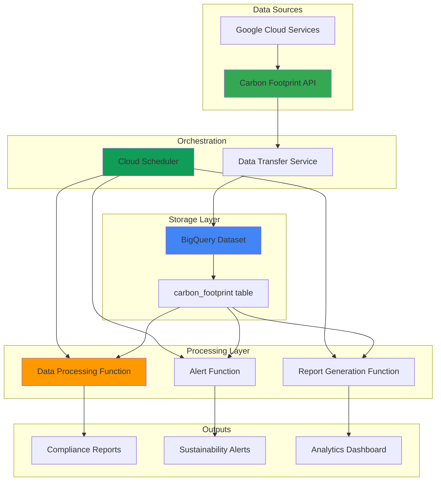

# Sustainability Compliance Automation with Carbon Footprint and Functions

## Problem

Organizations face increasing regulatory pressure to track and report their carbon emissions for ESG compliance, but manual carbon footprint reporting is time-consuming, error-prone, and difficult to scale across multiple cloud projects. Companies need automated systems to collect, analyze, and generate compliance reports for carbon emissions data while maintaining audit trails and ensuring data accuracy for regulatory submissions.

## Solution

This solution creates an automated sustainability compliance system using Google Cloud's Carbon Footprint API to export emissions data to BigQuery, Cloud Functions to process and analyze the data, and Cloud Scheduler to generate periodic compliance reports. The architecture provides automated carbon tracking, trend analysis, and regulatory reporting while maintaining full audit trails and data lineage for compliance purposes.

## Architecture Diagram



## Prerequisites

1. Google Cloud project with billing enabled and Carbon Footprint access
2. gcloud CLI installed and configured (or Cloud Shell)
3. Basic understanding of BigQuery, Cloud Functions, and sustainability reporting
4. IAM permissions: Billing Account Viewer, BigQuery Admin, Cloud Functions Admin
5. Estimated cost: $5-15 per month for typical usage (BigQuery storage, function executions)

> **Note**: Carbon Footprint data is available for covered Google Cloud services with a 1-month delay and exports automatically on the 15th of each month.

## Preparation

```bash
# Set environment variables for GCP resources
export PROJECT_ID="sustainability-$(date +%s)"
export REGION="us-central1"
export ZONE="us-central1-a"

# Generate unique suffix for resource names
RANDOM_SUFFIX=$(openssl rand -hex 3)
export DATASET_NAME="carbon_footprint_${RANDOM_SUFFIX}"
export FUNCTION_NAME="process-carbon-data-${RANDOM_SUFFIX}"
export REPORT_FUNCTION="generate-esg-report-${RANDOM_SUFFIX}"
export ALERT_FUNCTION="carbon-alerts-${RANDOM_SUFFIX}"
export BILLING_ACCOUNT_ID=$(gcloud billing accounts list \
    --format="value(name)" | head -1)

# Set default project and region
gcloud config set project ${PROJECT_ID}
gcloud config set compute/region ${REGION}
gcloud config set compute/zone ${ZONE}

# Enable required APIs
gcloud services enable cloudfunctions.googleapis.com
gcloud services enable bigquery.googleapis.com
gcloud services enable cloudscheduler.googleapis.com
gcloud services enable bigquerydatatransfer.googleapis.com

echo "✅ Project configured: ${PROJECT_ID}"
echo "✅ Billing account: ${BILLING_ACCOUNT_ID}"
```

## Steps

1. **Create BigQuery Dataset for Carbon Footprint Data**:

   BigQuery provides serverless data warehouse capabilities that scale automatically to accommodate growing carbon emissions data. Creating a dedicated dataset with appropriate location settings establishes the foundation for sustainability analytics while ensuring data residency compliance and optimal query performance.

   ```bash
   # Create BigQuery dataset for carbon footprint data
   bq mk --location=${REGION} \
       --description="Carbon footprint and sustainability data" \
       ${PROJECT_ID}:${DATASET_NAME}
   
   # Create custom analytics table for processed metrics
   bq mk --table \
       ${PROJECT_ID}:${DATASET_NAME}.sustainability_metrics \
       project_id:STRING,month:DATE,total_emissions:FLOAT,scope_1:FLOAT,scope_2_location:FLOAT,scope_2_market:FLOAT,scope_3:FLOAT,service:STRING,region:STRING
   
   echo "✅ BigQuery dataset and analytics table created"
   ```

   The dataset now provides a scalable foundation for carbon footprint analytics with dedicated tables for both raw Carbon Footprint API data and processed sustainability metrics. This structure supports both compliance reporting and advanced analytics while maintaining data lineage for audit purposes.

2. **Configure Carbon Footprint Export to BigQuery**:

   Google Cloud's Carbon Footprint service automatically calculates emissions based on actual resource usage and exports data following GHG Protocol standards. Configuring the BigQuery export enables automated data collection for covered Google Cloud services with both location-based and market-based emission calculations.

   ```bash
   # Create the data transfer configuration using the correct data source ID
   bq mk --transfer_config \
       --project_id=${PROJECT_ID} \
       --data_source=61cede5a-0000-2440-ad42-883d24f8f7b8 \
       --display_name="Carbon Footprint Export ${RANDOM_SUFFIX}" \
       --target_dataset=${DATASET_NAME} \
       --params='{"billing_accounts":"'${BILLING_ACCOUNT_ID}'"}'
   
   echo "✅ Carbon Footprint export configured"
   ```

   The Carbon Footprint export now automatically transfers monthly emissions data to BigQuery, providing comprehensive scope 1, 2, and 3 emissions data with detailed service and regional breakdowns. This automated collection ensures consistent data availability for compliance reporting and sustainability analytics.

3. **Create Data Processing Cloud Function**:

   Cloud Functions provides serverless event processing that automatically scales based on data processing needs. The data processing function transforms raw carbon footprint data into standardized sustainability metrics, calculates trends, and maintains audit trails for regulatory compliance requirements.

   ```bash
   # Create the function source directory
   mkdir -p carbon-processing-function
   cd carbon-processing-function
   
   # Create the main function file
   cat > main.py << 'EOF'
   import json
   import os
   from datetime import datetime, timedelta
   from google.cloud import bigquery
   from google.cloud import functions_v1
   import logging

   def process_carbon_data(request):
       """Process carbon footprint data and calculate sustainability metrics."""
       try:
           client = bigquery.Client()
           
           # Query latest carbon footprint data
           query = f"""
           SELECT 
               project.id as project_id,
               usage_month,
               SUM(carbon_footprint_total_kgCO2e.amount) as total_emissions,
               SUM(carbon_footprint_kgCO2e.scope1) as scope_1,
               SUM(carbon_footprint_kgCO2e.scope2.location_based) as scope_2_location,
               SUM(carbon_footprint_kgCO2e.scope2.market_based) as scope_2_market,
               SUM(carbon_footprint_kgCO2e.scope3) as scope_3,
               service.description as service,
               location.region as region
           FROM `{client.project}.{os.environ['DATASET_NAME']}.carbon_footprint`
           WHERE usage_month >= DATE_SUB(CURRENT_DATE(), INTERVAL 3 MONTH)
           GROUP BY project_id, usage_month, service, region
           ORDER BY usage_month DESC
           """
           
           # Execute query and insert into analytics table
           job_config = bigquery.QueryJobConfig()
           job_config.destination = f"{client.project}.{os.environ['DATASET_NAME']}.sustainability_metrics"
           job_config.write_disposition = bigquery.WriteDisposition.WRITE_APPEND
           
           query_job = client.query(query, job_config=job_config)
           results = query_job.result()
           
           # Calculate sustainability KPIs
           kpi_query = f"""
           SELECT 
               COUNT(DISTINCT project_id) as active_projects,
               AVG(total_emissions) as avg_monthly_emissions,
               SUM(total_emissions) as total_org_emissions,
               MAX(usage_month) as latest_month
           FROM `{client.project}.{os.environ['DATASET_NAME']}.sustainability_metrics`
           WHERE usage_month >= DATE_SUB(CURRENT_DATE(), INTERVAL 12 MONTH)
           """
           
           kpi_results = list(client.query(kpi_query).result())
           
           logging.info(f"Processed carbon data: {len(list(results))} records")
           logging.info(f"KPIs: {kpi_results[0] if kpi_results else 'No data'}")
           
           return {
               'status': 'success',
               'records_processed': query_job.num_dml_affected_rows,
               'processing_time': datetime.now().isoformat()
           }
           
       except Exception as e:
           logging.error(f"Error processing carbon data: {str(e)}")
           return {'status': 'error', 'message': str(e)}, 500
   EOF
   
   # Create requirements file with updated versions
   cat > requirements.txt << 'EOF'
   google-cloud-bigquery==3.25.0
   google-cloud-functions==1.16.5
   EOF
   
   # Deploy the function with Python 3.12 runtime
   gcloud functions deploy ${FUNCTION_NAME} \
       --runtime python312 \
       --trigger-http \
       --allow-unauthenticated \
       --source . \
       --entry-point process_carbon_data \
       --memory 512MB \
       --timeout 300s \
       --set-env-vars DATASET_NAME=${DATASET_NAME}
   
   cd ..
   
   echo "✅ Data processing function deployed"
   ```

   The Cloud Function now provides automated carbon data processing with built-in error handling and logging. This serverless approach ensures reliable data transformation while maintaining cost efficiency through pay-per-invocation pricing and automatic scaling based on processing volume.

4. **Create ESG Report Generation Function**:

   Automated report generation ensures consistent, timely compliance reporting for ESG frameworks and regulatory requirements. The report generation function creates standardized sustainability reports with trend analysis, benchmark comparisons, and audit-ready documentation for regulatory submissions.

   ```bash
   # Create report generation function
   mkdir -p esg-report-function
   cd esg-report-function
   
   cat > main.py << 'EOF'
   import json
   import os
   from datetime import datetime, timedelta
   from google.cloud import bigquery
   from google.cloud import storage
   import csv
   import io
   import logging

   def generate_esg_report(request):
       """Generate ESG compliance report from carbon footprint data."""
       try:
           client = bigquery.Client()
           storage_client = storage.Client()
           
           # Generate comprehensive ESG report query
           report_query = f"""
           WITH monthly_trends AS (
               SELECT 
                   usage_month,
                   SUM(total_emissions) as monthly_total,
                   AVG(total_emissions) OVER (ORDER BY usage_month ROWS BETWEEN 2 PRECEDING AND CURRENT ROW) as three_month_avg
               FROM `{client.project}.{os.environ['DATASET_NAME']}.sustainability_metrics`
               WHERE usage_month >= DATE_SUB(CURRENT_DATE(), INTERVAL 12 MONTH)
               GROUP BY usage_month
           ),
           service_breakdown AS (
               SELECT 
                   service,
                   SUM(total_emissions) as service_emissions,
                   ROUND(SUM(total_emissions) / SUM(SUM(total_emissions)) OVER () * 100, 2) as percentage
               FROM `{client.project}.{os.environ['DATASET_NAME']}.sustainability_metrics`
               WHERE usage_month >= DATE_SUB(CURRENT_DATE(), INTERVAL 3 MONTH)
               GROUP BY service
           )
           SELECT 
               'Monthly Trends' as report_section,
               TO_JSON_STRING(ARRAY_AGG(STRUCT(usage_month, monthly_total, three_month_avg))) as data
           FROM monthly_trends
           UNION ALL
           SELECT 
               'Service Breakdown' as report_section,
               TO_JSON_STRING(ARRAY_AGG(STRUCT(service, service_emissions, percentage))) as data
           FROM service_breakdown
           """
           
           results = list(client.query(report_query).result())
           
           # Create ESG report
           report_data = {
               'report_date': datetime.now().isoformat(),
               'organization': client.project,
               'reporting_period': '12 months',
               'methodology': 'GHG Protocol compliant via Google Cloud Carbon Footprint',
               'sections': {}
           }
           
           for row in results:
               report_data['sections'][row.report_section] = json.loads(row.data)
           
           # Save report to Cloud Storage
           bucket_name = f"esg-reports-{os.environ['RANDOM_SUFFIX']}"
           
           try:
               bucket = storage_client.create_bucket(bucket_name)
           except Exception:
               bucket = storage_client.bucket(bucket_name)
           
           blob_name = f"esg-report-{datetime.now().strftime('%Y-%m-%d')}.json"
           blob = bucket.blob(blob_name)
           blob.upload_from_string(json.dumps(report_data, indent=2))
           
           logging.info(f"ESG report generated: gs://{bucket_name}/{blob_name}")
           
           return {
               'status': 'success',
               'report_location': f"gs://{bucket_name}/{blob_name}",
               'generation_time': datetime.now().isoformat()
           }
           
       except Exception as e:
           logging.error(f"Error generating ESG report: {str(e)}")
           return {'status': 'error', 'message': str(e)}, 500
   EOF
   
   # Create requirements file with updated versions
   cat > requirements.txt << 'EOF'
   google-cloud-bigquery==3.25.0
   google-cloud-storage==2.17.0
   EOF
   
   # Deploy the report generation function with Python 3.12 runtime
   gcloud functions deploy ${REPORT_FUNCTION} \
       --runtime python312 \
       --trigger-http \
       --allow-unauthenticated \
       --source . \
       --entry-point generate_esg_report \
       --memory 512MB \
       --timeout 300s \
       --set-env-vars DATASET_NAME=${DATASET_NAME},RANDOM_SUFFIX=${RANDOM_SUFFIX}
   
   cd ..
   
   echo "✅ ESG report generation function deployed"
   ```

   The report generation function now creates comprehensive ESG compliance reports with trend analysis and service breakdowns. Reports are automatically stored in Cloud Storage with standardized formatting for regulatory submissions and audit requirements.

5. **Create Carbon Alert Function**:

   Proactive monitoring ensures immediate awareness of sustainability threshold breaches and emission anomalies. The alert function monitors carbon emissions against predefined targets and generates notifications when emissions exceed sustainability goals or show unexpected increases.

   ```bash
   # Create carbon alert function
   mkdir -p carbon-alert-function
   cd carbon-alert-function
   
   cat > main.py << 'EOF'
   import json
   import os
   from datetime import datetime, timedelta
   from google.cloud import bigquery
   import logging

   def carbon_alerts(request):
       """Monitor carbon emissions and generate sustainability alerts."""
       try:
           client = bigquery.Client()
           
           # Define sustainability thresholds
           MONTHLY_THRESHOLD = 1000  # kg CO2e
           GROWTH_THRESHOLD = 0.15   # 15% month-over-month growth
           
           # Check for threshold violations
           alert_query = f"""
           WITH current_month AS (
               SELECT 
                   SUM(total_emissions) as current_emissions,
                   MAX(usage_month) as current_month
               FROM `{client.project}.{os.environ['DATASET_NAME']}.sustainability_metrics`
               WHERE usage_month = (
                   SELECT MAX(usage_month) 
                   FROM `{client.project}.{os.environ['DATASET_NAME']}.sustainability_metrics`
               )
           ),
           previous_month AS (
               SELECT 
                   SUM(total_emissions) as previous_emissions
               FROM `{client.project}.{os.environ['DATASET_NAME']}.sustainability_metrics`
               WHERE usage_month = DATE_SUB((
                   SELECT MAX(usage_month) 
                   FROM `{client.project}.{os.environ['DATASET_NAME']}.sustainability_metrics`
               ), INTERVAL 1 MONTH)
           )
           SELECT 
               c.current_emissions,
               p.previous_emissions,
               c.current_month,
               CASE 
                   WHEN c.current_emissions > {MONTHLY_THRESHOLD} THEN 'THRESHOLD_EXCEEDED'
                   WHEN p.previous_emissions > 0 AND 
                        (c.current_emissions - p.previous_emissions) / p.previous_emissions > {GROWTH_THRESHOLD} 
                        THEN 'HIGH_GROWTH'
                   ELSE 'NORMAL'
               END as alert_type,
               ROUND(
                   CASE WHEN p.previous_emissions > 0 
                        THEN (c.current_emissions - p.previous_emissions) / p.previous_emissions * 100 
                        ELSE 0 END, 2
               ) as growth_percentage
           FROM current_month c
           CROSS JOIN previous_month p
           """
           
           results = list(client.query(alert_query).result())
           
           alerts = []
           for row in results:
               if row.alert_type != 'NORMAL':
                   alert = {
                       'alert_type': row.alert_type,
                       'current_emissions': float(row.current_emissions),
                       'previous_emissions': float(row.previous_emissions or 0),
                       'growth_percentage': float(row.growth_percentage),
                       'month': row.current_month.isoformat(),
                       'timestamp': datetime.now().isoformat()
                   }
                   alerts.append(alert)
           
           # Log alerts for monitoring
           if alerts:
               for alert in alerts:
                   logging.warning(f"Sustainability Alert: {alert}")
           else:
               logging.info("No sustainability alerts triggered")
           
           return {
               'status': 'success',
               'alerts_count': len(alerts),
               'alerts': alerts,
               'check_time': datetime.now().isoformat()
           }
           
       except Exception as e:
           logging.error(f"Error checking carbon alerts: {str(e)}")
           return {'status': 'error', 'message': str(e)}, 500
   EOF
   
   # Create requirements file
   cat > requirements.txt << 'EOF'
   google-cloud-bigquery==3.25.0
   EOF
   
   # Deploy the alert function with Python 3.12 runtime
   gcloud functions deploy ${ALERT_FUNCTION} \
       --runtime python312 \
       --trigger-http \
       --allow-unauthenticated \
       --source . \
       --entry-point carbon_alerts \
       --memory 256MB \
       --timeout 120s \
       --set-env-vars DATASET_NAME=${DATASET_NAME}
   
   cd ..
   
   echo "✅ Carbon alert function deployed"
   ```

   The alert function now provides automated sustainability monitoring with configurable thresholds and growth rate detection. This proactive approach enables immediate response to emission anomalies and supports continuous improvement of sustainability performance.

6. **Configure Cloud Scheduler for Automated Processing**:

   Cloud Scheduler provides reliable, serverless cron job functionality for automating sustainability workflows. Creating scheduled triggers ensures consistent data processing, report generation, and monitoring without manual intervention, supporting regulatory compliance requirements for timely reporting.

   ```bash
   # Create scheduled job for data processing
   gcloud scheduler jobs create http process-carbon-data \
       --schedule="0 9 16 * *" \
       --uri="https://${REGION}-${PROJECT_ID}.cloudfunctions.net/${FUNCTION_NAME}" \
       --http-method=POST \
       --headers="Content-Type=application/json" \
       --message-body='{"trigger":"scheduled"}' \
       --description="Process carbon footprint data monthly"
   
   # Create scheduled job for ESG report generation
   gcloud scheduler jobs create http generate-esg-reports \
       --schedule="0 10 16 * *" \
       --uri="https://${REGION}-${PROJECT_ID}.cloudfunctions.net/${REPORT_FUNCTION}" \
       --http-method=POST \
       --headers="Content-Type=application/json" \
       --message-body='{"trigger":"scheduled"}' \
       --description="Generate monthly ESG compliance reports"
   
   # Create scheduled job for carbon alerts
   gcloud scheduler jobs create http carbon-alerts-check \
       --schedule="0 8 * * 1" \
       --uri="https://${REGION}-${PROJECT_ID}.cloudfunctions.net/${ALERT_FUNCTION}" \
       --http-method=POST \
       --headers="Content-Type=application/json" \
       --message-body='{"trigger":"scheduled"}' \
       --description="Weekly carbon emissions monitoring"
   
   echo "✅ Cloud Scheduler jobs configured"
   ```

   The automated scheduling now ensures consistent sustainability data processing, report generation, and monitoring. This serverless orchestration approach provides reliable execution while minimizing operational overhead and supporting compliance requirements for regular reporting.

## Validation & Testing

1. Verify BigQuery dataset and table creation:

   ```bash
   # Check dataset existence
   bq ls --format="table(datasetId,location)" ${PROJECT_ID}
   
   # Verify tables in dataset
   bq ls ${PROJECT_ID}:${DATASET_NAME}
   ```

   Expected output: Dataset should show `carbon_footprint_[suffix]` with REGION location and contain `sustainability_metrics` table.

2. Test Cloud Functions deployment:

   ```bash
   # Test data processing function
   curl -X POST "https://${REGION}-${PROJECT_ID}.cloudfunctions.net/${FUNCTION_NAME}" \
        -H "Content-Type: application/json" \
        -d '{"test": true}'
   
   # Test report generation function
   curl -X POST "https://${REGION}-${PROJECT_ID}.cloudfunctions.net/${REPORT_FUNCTION}" \
        -H "Content-Type: application/json" \
        -d '{"test": true}'
   ```

   Expected output: Functions should return JSON responses with status "success" or appropriate error messages.

3. Verify Cloud Scheduler jobs:

   ```bash
   # List scheduled jobs
   gcloud scheduler jobs list --format="table(name,schedule,state)"
   
   # Test manual execution
   gcloud scheduler jobs run carbon-alerts-check
   ```

   Expected output: Three jobs should be listed in ENABLED state with appropriate schedules.

## Cleanup

1. Remove Cloud Scheduler jobs:

   ```bash
   # Delete scheduled jobs
   gcloud scheduler jobs delete process-carbon-data --quiet
   gcloud scheduler jobs delete generate-esg-reports --quiet
   gcloud scheduler jobs delete carbon-alerts-check --quiet
   
   echo "✅ Cloud Scheduler jobs deleted"
   ```

2. Remove Cloud Functions:

   ```bash
   # Delete all functions
   gcloud functions delete ${FUNCTION_NAME} --region=${REGION} --quiet
   gcloud functions delete ${REPORT_FUNCTION} --region=${REGION} --quiet
   gcloud functions delete ${ALERT_FUNCTION} --region=${REGION} --quiet
   
   echo "✅ Cloud Functions deleted"
   ```

3. Remove BigQuery dataset and data transfer:

   ```bash
   # Delete data transfer configuration
   TRANSFER_CONFIG_ID=$(bq ls --transfer_config \
       --format="value(name)" | grep "Carbon Footprint Export")
   if [ ! -z "$TRANSFER_CONFIG_ID" ]; then
       bq rm --transfer_config ${TRANSFER_CONFIG_ID}
   fi
   
   # Delete BigQuery dataset and all tables
   bq rm -r -f ${PROJECT_ID}:${DATASET_NAME}
   
   echo "✅ BigQuery resources deleted"
   ```

4. Remove Cloud Storage bucket:

   ```bash
   # Remove ESG reports bucket
   gsutil -m rm -r gs://esg-reports-${RANDOM_SUFFIX} \
       2>/dev/null || echo "Bucket already deleted"
   
   echo "✅ Cloud Storage resources deleted"
   ```

5. Clean up local files and environment:

   ```bash
   # Remove function directories
   rm -rf carbon-processing-function esg-report-function carbon-alert-function
   rm -f carbon_export_config.json
   
   echo "✅ Local files cleaned up"
   echo "Note: Carbon Footprint data transfer config may take a few minutes to fully delete"
   ```

## Discussion

Google Cloud's Carbon Footprint service provides comprehensive emissions tracking following the GHG Protocol standards, which establishes the global framework for measuring and managing greenhouse gas emissions. The service automatically calculates scope 1, 2, and 3 emissions based on actual resource consumption, providing both location-based and market-based emissions data essential for accurate ESG reporting. This approach ensures regulatory compliance while reducing the complexity of carbon accounting across distributed cloud infrastructure.

The automated processing architecture leverages Cloud Functions' event-driven serverless model to transform raw carbon data into actionable sustainability insights. BigQuery's columnar storage and SQL analytics capabilities enable efficient processing of time-series emissions data, supporting trend analysis and complex sustainability calculations at scale. The combination of scheduled processing, alert monitoring, and automated reporting creates a comprehensive sustainability governance framework that supports both operational efficiency and regulatory compliance requirements.

The solution's modular design enables organizations to customize sustainability metrics, reporting formats, and alert thresholds based on specific ESG frameworks and regulatory requirements. Cloud Scheduler ensures consistent data processing and report generation, while the serverless architecture provides cost efficiency through pay-per-use pricing and automatic scaling. This approach supports organizations in meeting increasing regulatory demands for carbon disclosure while building operational capabilities for continuous sustainability improvement.

For additional implementation guidance, refer to the [Google Cloud Carbon Footprint documentation](https://cloud.google.com/carbon-footprint/docs), [BigQuery best practices for sustainability analytics](https://cloud.google.com/bigquery/docs/best-practices-performance), [Cloud Functions deployment patterns](https://cloud.google.com/functions/docs/concepts/overview), [GHG Protocol Corporate Standard](https://ghgprotocol.org/corporate-standard), and [ESG reporting frameworks](https://www.sustainability.com/thinking/esg-reporting-frameworks-guide/).

> **Tip**: Use Cloud Monitoring to track function execution metrics and BigQuery query performance to optimize sustainability data processing costs and ensure reliable compliance reporting workflows.

## Challenge

Extend this sustainability compliance solution by implementing these enhancements:

1. **Multi-Cloud Carbon Tracking**: Integrate AWS and Azure carbon footprint data using Cloud Data Fusion to create unified sustainability dashboards across cloud providers.

2. **Predictive Carbon Analytics**: Implement Vertex AI forecasting models to predict future emissions based on planned infrastructure changes and seasonal usage patterns.

3. **Real-time Sustainability Dashboards**: Create Looker Studio dashboards with real-time carbon metrics, benchmark comparisons, and progress toward net-zero goals.

4. **Carbon Offset Integration**: Build automated carbon credit purchasing workflows using Cloud Workflows to trigger offset purchases when emissions exceed sustainability targets.

5. **Advanced ESG Reporting**: Develop custom reporting templates for specific frameworks (TCFD, SASB, GRI) with automated data validation and audit trail generation for enterprise compliance requirements.

## Infrastructure Code

*Infrastructure code will be generated after recipe approval.*