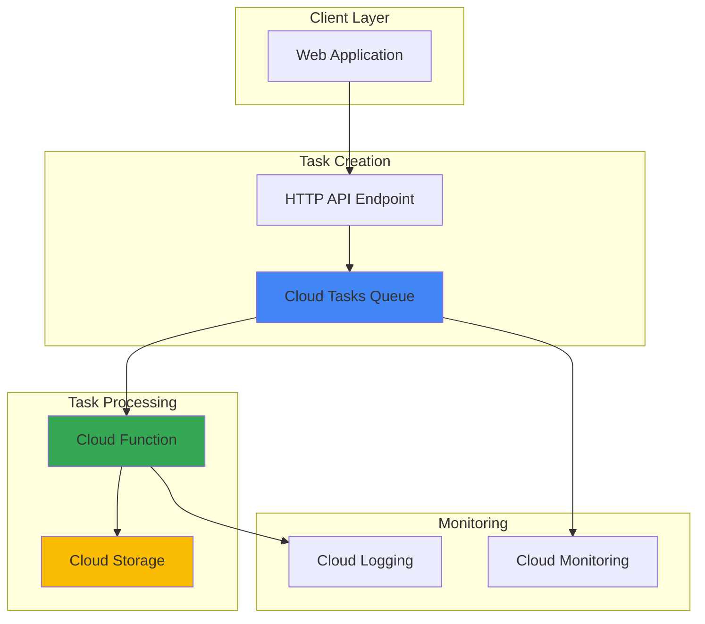

# Task Queue System with Cloud Tasks and Functions

## Problem

Modern web applications need to process time-consuming tasks like image resizing, email sending, or data processing without blocking user requests. When these tasks are handled synchronously, users experience slow response times, and the application becomes unreliable under high load. Traditional approaches require managing complex infrastructure and handling retry logic manually, leading to increased operational overhead and potential data loss during failures.

## Solution

Build an asynchronous task processing system using Google Cloud Tasks to queue background jobs and Cloud Functions to process them reliably. Cloud Tasks provides a fully managed queue service with built-in retry mechanisms, rate limiting, and dead letter queues, while Cloud Functions offers serverless execution that scales automatically based on task volume. This approach decouples task creation from execution, ensuring fast user responses and reliable background processing.

## Architecture Diagram



## Prerequisites

1. Google Cloud Platform account with billing enabled
2. Cloud SDK (gcloud) installed and configured
3. Basic understanding of Python and HTTP endpoints
4. Text editor for creating function code
5. Estimated cost: $0.01-$0.50 for this tutorial (within free tier limits)

> **Note**: Cloud Tasks and Cloud Functions both offer generous free tiers, making this solution cost-effective for development and small-scale production workloads.

## Preparation

```bash
# Set environment variables for GCP resources
export PROJECT_ID="task-queue-demo-$(date +%s)"
export REGION="us-central1"
export QUEUE_NAME="background-tasks"
export FUNCTION_NAME="task-processor"

# Generate unique suffix for resource names
RANDOM_SUFFIX=$(openssl rand -hex 3)

# Create new project for this demo
gcloud projects create ${PROJECT_ID} \
    --name="Task Queue Demo"

# Set as default project
gcloud config set project ${PROJECT_ID}
gcloud config set compute/region ${REGION}

# Link billing account (replace with your billing account ID)
# gcloud billing projects link ${PROJECT_ID} \
#     --billing-account=YOUR_BILLING_ACCOUNT

# Enable required APIs
gcloud services enable cloudfunctions.googleapis.com \
    cloudtasks.googleapis.com \
    cloudbuild.googleapis.com \
    storage.googleapis.com \
    logging.googleapis.com

echo "✅ Project configured: ${PROJECT_ID}"
echo "✅ Region set to: ${REGION}"
```

## Steps

1. **Create Task Queue**:

   Cloud Tasks provides a fully managed service for executing distributed tasks asynchronously. Creating a queue establishes the foundation for reliable task processing with built-in retry logic, rate limiting, and monitoring capabilities. The queue acts as a buffer between task creation and execution, enabling your application to handle traffic spikes gracefully.

   ```bash
   # Create Cloud Tasks queue with retry configuration
   gcloud tasks queues create ${QUEUE_NAME} \
       --location=${REGION} \
       --max-attempts=3 \
       --max-retry-duration=300s \
       --max-doublings=5
   
   # Verify queue creation
   gcloud tasks queues describe ${QUEUE_NAME} \
       --location=${REGION}
   
   echo "✅ Cloud Tasks queue '${QUEUE_NAME}' created successfully"
   ```

   The queue is now configured with intelligent retry policies that automatically handle transient failures. The exponential backoff strategy with a maximum of 5 doublings ensures failed tasks are retried efficiently without overwhelming your processing function.

2. **Create Cloud Function Directory Structure**:

   Organizing your function code with a proper directory structure ensures maintainability and follows Google Cloud best practices. The function will process tasks from the queue and demonstrate common patterns like logging, error handling, and file operations.

   ```bash
   # Create function directory and files
   mkdir -p cloud-function
   cd cloud-function
   
   # Create requirements.txt for dependencies
   cat > requirements.txt << 'EOF'
functions-framework==3.*
google-cloud-storage==2.*
google-cloud-logging==3.*
EOF
   
   echo "✅ Function directory structure created"
   ```

   This structure separates your function code from other project files and includes the necessary dependencies for Cloud Storage integration and structured logging, enabling professional-grade background task processing.

3. **Implement Task Processing Function**:

   The Cloud Function serves as the worker that processes tasks from the queue. This implementation demonstrates error handling, logging, and file processing patterns commonly used in production task processing systems. The function responds to HTTP requests from Cloud Tasks with task payloads.

   ```bash
   # Create main function file
   cat > main.py << 'EOF'
import functions_framework
import json
import logging
from google.cloud import storage
from datetime import datetime
import os

# Configure logging
logging.basicConfig(level=logging.INFO)
logger = logging.getLogger(__name__)

@functions_framework.http
def task_processor(request):
    """
    Process background tasks from Cloud Tasks queue
    """
    try:
        # Parse task payload
        task_data = request.get_json(silent=True)
        if not task_data:
            logger.error("No task data received")
            return {"status": "error", "message": "No task data"}, 400
        
        # Extract task details
        task_type = task_data.get('task_type', 'unknown')
        task_id = task_data.get('task_id', 'no-id')
        
        logger.info(f"Processing task {task_id} of type {task_type}")
        
        # Simulate task processing based on type
        if task_type == 'process_file':
            result = process_file_task(task_data)
        elif task_type == 'send_email':
            result = send_email_task(task_data)
        else:
            result = {
                "status": "success", 
                "message": f"Unknown task type: {task_type}"
            }
        
        logger.info(f"Task {task_id} completed successfully")
        return result, 200
        
    except Exception as e:
        logger.error(f"Task processing failed: {str(e)}", exc_info=True)
        return {"status": "error", "message": str(e)}, 500

def process_file_task(task_data):
    """Process file-related background task"""
    filename = task_data.get('filename', 'test-file.txt')
    content = task_data.get('content', 'Default task content')
    
    # Initialize Cloud Storage client
    client = storage.Client()
    bucket_name = os.environ.get('STORAGE_BUCKET', 'default-bucket')
    
    try:
        bucket = client.bucket(bucket_name)
        blob = bucket.blob(f"processed/{filename}")
        
        # Create processed content with timestamp
        processed_content = f"""Task processed at: {datetime.now().isoformat()}
Original content: {content}
Processing status: Complete
"""
        
        blob.upload_from_string(processed_content)
        
        return {
            "status": "success",
            "message": f"File {filename} processed and saved",
            "processed_at": datetime.now().isoformat()
        }
    except Exception as e:
        raise Exception(f"File processing failed: {str(e)}")

def send_email_task(task_data):
    """Simulate email sending task"""
    recipient = task_data.get('recipient', 'user@example.com')
    subject = task_data.get('subject', 'Background Task Complete')
    
    # In production, integrate with SendGrid, Mailgun, or Gmail API
    logger.info(f"Simulating email to {recipient} with subject: {subject}")
    
    return {
        "status": "success",
        "message": f"Email sent to {recipient}",
        "sent_at": datetime.now().isoformat()
    }
EOF
   
   echo "✅ Task processing function implemented"
   ```

   This function demonstrates professional error handling, structured logging, and modular task processing. The design supports multiple task types and can be easily extended for additional background processing needs like image resizing, data transformations, or third-party API integrations.

4. **Create Storage Bucket for Processed Files**:

   Cloud Storage provides the persistent storage layer for processed files and task results. Creating a bucket with appropriate configuration ensures your task processing system can store outputs reliably and cost-effectively, with automatic encryption and global accessibility.

   ```bash
   cd ..
   
   # Create storage bucket for processed files
   export BUCKET_NAME="${PROJECT_ID}-task-results"
   
   gsutil mb -p ${PROJECT_ID} \
       -c STANDARD \
       -l ${REGION} \
       gs://${BUCKET_NAME}
   
   # Set bucket permissions for Cloud Function
   gsutil iam ch \
       serviceAccount:${PROJECT_ID}@appspot.gserviceaccount.com:objectAdmin \
       gs://${BUCKET_NAME}
   
   echo "✅ Storage bucket created: ${BUCKET_NAME}"
   ```

   The storage bucket is now configured with appropriate IAM permissions, allowing your Cloud Function to read and write processed files. This setup enables persistent storage of task results and supports audit trails for background processing operations.

5. **Deploy Cloud Function with HTTP Trigger**:

   Deploying the Cloud Function creates the serverless worker that processes tasks from the queue. The HTTP trigger configuration allows Cloud Tasks to invoke the function with task payloads, while the environment variables provide necessary configuration for storage and logging integration.

   ```bash
   # Deploy Cloud Function with environment variables
   gcloud functions deploy ${FUNCTION_NAME} \
       --gen2 \
       --runtime python311 \
       --source ./cloud-function \
       --entry-point task_processor \
       --trigger-http \
       --allow-unauthenticated \
       --memory 256MB \
       --timeout 60s \
       --set-env-vars STORAGE_BUCKET=${BUCKET_NAME} \
       --region=${REGION}
   
   # Get function URL for task queue configuration
   FUNCTION_URL=$(gcloud functions describe ${FUNCTION_NAME} \
       --gen2 \
       --region=${REGION} \
       --format="value(serviceConfig.uri)")
   
   echo "✅ Cloud Function deployed successfully"
   echo "Function URL: ${FUNCTION_URL}"
   ```

   Your task processing function is now deployed and ready to handle background tasks. The serverless architecture automatically scales based on task volume, ensuring efficient resource utilization and cost optimization while maintaining high availability.

6. **Create Task Creation Script**:

   A task creation script demonstrates how to programmatically add tasks to the queue from your application. This client-side code shows the proper way to structure task payloads and handle queue operations, providing a foundation for integrating task queuing into your existing applications.

   ```bash
   # Create task creation script
   cat > create_task.py << 'EOF'
#!/usr/bin/env python3
import json
import sys
from google.cloud import tasks_v2
from datetime import datetime, timedelta

def create_task(project_id, location, queue_name, function_url, task_data):
    """Create a task in Cloud Tasks queue"""
    
    # Initialize the Tasks client
    client = tasks_v2.CloudTasksClient()
    
    # Construct the fully qualified queue name
    parent = client.queue_path(project_id, location, queue_name)
    
    # Construct task payload
    task_payload = {
        'task_id': f"task-{datetime.now().strftime('%Y%m%d-%H%M%S')}",
        'created_at': datetime.now().isoformat(),
        **task_data
    }
    
    # Create the task request
    task = {
        'http_request': {
            'http_method': tasks_v2.HttpMethod.POST,
            'url': function_url,
            'headers': {'Content-Type': 'application/json'},
            'body': json.dumps(task_payload).encode('utf-8')
        }
    }
    
    # Optionally schedule task for future execution
    if 'schedule_time' in task_data:
        schedule_time = datetime.now() + \
            timedelta(seconds=task_data['schedule_time'])
        task['schedule_time'] = {
            'seconds': int(schedule_time.timestamp())
        }
    
    # Submit the task
    response = client.create_task(request={'parent': parent, 'task': task})
    
    print(f"✅ Task created: {response.name}")
    print(f"Task ID: {task_payload['task_id']}")
    return response

if __name__ == "__main__":
    import os
    
    project_id = os.environ.get('PROJECT_ID')
    location = os.environ.get('REGION')
    queue_name = os.environ.get('QUEUE_NAME') 
    function_url = os.environ.get('FUNCTION_URL')
    
    # Example file processing task
    file_task = {
        'task_type': 'process_file',
        'filename': 'sample-document.txt',
        'content': 'This is sample content for background processing'
    }
    
    # Example email task scheduled for 30 seconds from now
    email_task = {
        'task_type': 'send_email',
        'recipient': 'admin@example.com',
        'subject': 'Background Task Demo Complete',
        'schedule_time': 30
    }
    
    print("Creating background tasks...")
    create_task(project_id, location, queue_name, function_url, file_task)
    create_task(project_id, location, queue_name, function_url, email_task)
EOF
   
   # Make script executable
   chmod +x create_task.py
   
   echo "✅ Task creation script ready"
   ```

   This script provides a production-ready foundation for adding tasks to your queue from web applications, batch jobs, or other services. The modular design supports different task types and scheduling options, making it adaptable to various business requirements.

7. **Execute Background Tasks**:

   Running the task creation script demonstrates the complete task queue workflow from creation to processing. This step shows how your application components interact and validates that the entire system works correctly, including queue operations, function invocation, and result storage.

   ```bash
   # Set function URL environment variable
   export FUNCTION_URL=$(gcloud functions describe ${FUNCTION_NAME} \
       --gen2 \
       --region=${REGION} \
       --format="value(serviceConfig.uri)")
   
   # Install Python dependencies locally
   pip3 install google-cloud-tasks
   
   # Create and execute background tasks
   python3 create_task.py
   
   echo "✅ Background tasks submitted to queue"
   echo "Tasks will be processed automatically by Cloud Function"
   ```

   Your tasks are now queued and being processed automatically. The Cloud Tasks service handles task distribution, retry logic, and failure management, while your Cloud Function processes each task reliably. This demonstrates the power of serverless task processing at scale.

## Validation & Testing

1. **Verify Queue Status and Task Processing**:

   ```bash
   # Check queue statistics
   gcloud tasks queues describe ${QUEUE_NAME} \
       --location=${REGION} \
       --format="table(name,state,rateLimits.maxDispatchesPerSecond)"
   
   # List recent tasks (may be empty if already processed)
   gcloud tasks list \
       --queue=${QUEUE_NAME} \
       --location=${REGION}
   ```

   Expected output: Queue should show active state with configured rate limits.

2. **Check Function Execution Logs**:

   ```bash
   # View recent function invocations and logs
   gcloud functions logs read ${FUNCTION_NAME} \
       --gen2 \
       --region=${REGION} \
       --limit=10 \
       --format="table(timestamp,severity,textPayload)"
   ```

   Expected output: Logs showing successful task processing with timestamps and task IDs.

3. **Verify Processed Files in Storage**:

   ```bash
   # List processed files in Cloud Storage
   gsutil ls -la gs://${BUCKET_NAME}/processed/
   
   # View content of processed file
   gsutil cat gs://${BUCKET_NAME}/processed/sample-document.txt
   ```

   Expected output: Processed files with timestamps and processing status information.

4. **Test Error Handling**:

   ```bash
   # Create task with invalid data to test error handling
   python3 -c "
import os, json
from google.cloud import tasks_v2

client = tasks_v2.CloudTasksClient()
parent = client.queue_path('${PROJECT_ID}', '${REGION}', '${QUEUE_NAME}')

# Invalid task to test error handling
task = {
    'http_request': {
        'http_method': tasks_v2.HttpMethod.POST,
        'url': '${FUNCTION_URL}',
        'headers': {'Content-Type': 'application/json'},
        'body': json.dumps({'invalid': 'task_data'}).encode('utf-8')
    }
}

response = client.create_task(request={'parent': parent, 'task': task})
print(f'Error test task created: {response.name}')
"
   ```

   This test verifies that your function properly handles invalid inputs and logs errors appropriately.

## Cleanup

1. **Delete Cloud Function**:

   ```bash
   # Remove the Cloud Function
   gcloud functions delete ${FUNCTION_NAME} \
       --gen2 \
       --region=${REGION} \
       --quiet
   
   echo "✅ Cloud Function deleted"
   ```

2. **Delete Cloud Tasks Queue**:

   ```bash
   # Delete the task queue
   gcloud tasks queues delete ${QUEUE_NAME} \
       --location=${REGION} \
       --quiet
   
   echo "✅ Cloud Tasks queue deleted"
   ```

3. **Remove Storage Bucket**:

   ```bash
   # Delete bucket and all contents
   gsutil -m rm -r gs://${BUCKET_NAME}
   
   echo "✅ Storage bucket deleted"
   ```

4. **Delete Project**:

   ```bash
   # Delete the entire project
   gcloud projects delete ${PROJECT_ID} --quiet
   
   # Clear local environment variables
   unset PROJECT_ID REGION QUEUE_NAME FUNCTION_NAME BUCKET_NAME FUNCTION_URL
   
   echo "✅ Project and all resources deleted"
   echo "Note: Project deletion may take several minutes to complete"
   ```

## Discussion

This recipe demonstrates the power of combining Google Cloud Tasks with Cloud Functions to create a robust, scalable task processing system. Cloud Tasks provides enterprise-grade queue management with features like rate limiting, retry logic, and dead letter queues, while Cloud Functions offers serverless execution that scales automatically based on demand according to the [Google Cloud Architecture Framework](https://cloud.google.com/architecture/framework). This architecture pattern is particularly valuable for decoupling time-consuming operations from user-facing requests, ensuring responsive applications even under high load.

The implementation showcases several key architectural patterns following [Google Cloud best practices](https://cloud.google.com/functions/docs/best-practices). The HTTP-triggered Cloud Function acts as a reliable worker that can process various task types, demonstrating the flexibility needed for real-world applications. The integration with Cloud Storage provides persistent result storage, while structured logging enables monitoring and debugging. The retry mechanism built into Cloud Tasks ensures that transient failures don't result in lost tasks, providing the reliability required for production systems as outlined in the [Cloud Tasks documentation](https://cloud.google.com/tasks/docs).

One of the significant advantages of this approach is cost efficiency. Both Cloud Tasks and Cloud Functions operate on a pay-per-use model, meaning you only pay for actual task processing rather than maintaining idle infrastructure. The automatic scaling capabilities ensure your system can handle traffic spikes without manual intervention, while the generous free tiers make this solution cost-effective for development and small-scale production workloads. For high-volume scenarios, the pricing remains competitive compared to managing your own queue infrastructure, as detailed in the [Cloud Functions pricing documentation](https://cloud.google.com/functions/pricing).

This pattern extends well beyond simple background processing. Common use cases include image and video processing pipelines, email marketing campaigns, data import/export operations, report generation, and integration with third-party APIs. The modular design allows easy extension for additional task types, and the serverless nature eliminates operational overhead typically associated with queue-based systems. The solution also integrates seamlessly with other Google Cloud services like Pub/Sub for more complex event-driven architectures as described in the [Google Cloud Integration Patterns](https://cloud.google.com/architecture/serverless-integration-patterns).

> **Tip**: Monitor your queue metrics using Cloud Monitoring to optimize performance and identify bottlenecks. Set up alerts for failed tasks and unusual processing delays to maintain system reliability.

## Challenge

Extend this solution by implementing these enhancements:

1. **Add Dead Letter Queue Handling**: Configure a separate queue for failed tasks and implement a Cloud Function to analyze and potentially reprocess failed tasks with enhanced error reporting.

2. **Implement Task Prioritization**: Create multiple queues with different rate limits for high, medium, and low priority tasks, and modify the task creation script to support priority assignment.

3. **Add Batch Processing**: Modify the Cloud Function to process multiple tasks in a single invocation for improved efficiency, and implement Cloud Storage event triggers for file-based batch operations.

4. **Create Monitoring Dashboard**: Build a Cloud Monitoring dashboard that tracks queue depth, processing latency, success rates, and error patterns with automated alerting for operational issues.

5. **Integrate with Pub/Sub**: Add Pub/Sub integration for real-time task status notifications and implement a webhook system that notifies external services when tasks complete or fail.

## Infrastructure Code

*Infrastructure code will be generated after recipe approval.*