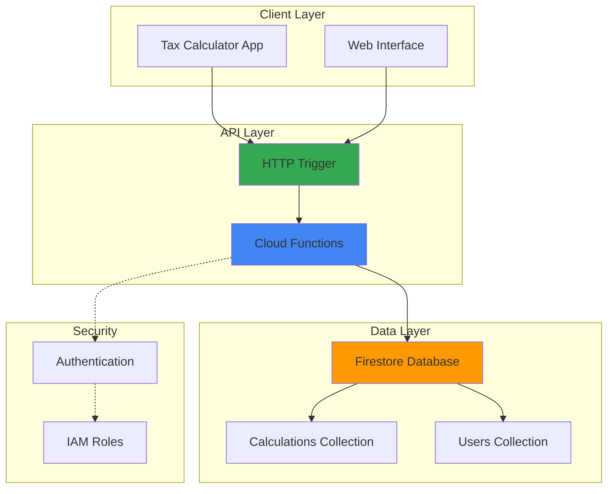

# Tax Calculator API with Cloud Functions and Firestore

## Problem

Small businesses and tax professionals need a reliable API to calculate income tax estimates for their clients but lack the infrastructure to build and maintain a scalable backend system. Manual tax calculations are time-consuming and error-prone, while existing solutions are either too expensive or lack the flexibility to integrate with custom applications. Without proper calculation history tracking, businesses cannot provide clients with audit trails or year-over-year comparisons for tax planning purposes.

## Solution

Build a serverless tax calculation API using Google Cloud Functions for compute and Firestore for data persistence. Cloud Functions provides automatic scaling and pay-per-use pricing, while Firestore offers real-time synchronization and structured document storage for calculation history. This serverless approach eliminates infrastructure management overhead while providing enterprise-grade reliability and security.

## Architecture Diagram



## Prerequisites

1. Google Cloud account with billing enabled and Firestore API access
2. Google Cloud CLI installed and configured (or Cloud Shell)
3. Basic knowledge of Python programming and REST APIs
4. Understanding of tax calculation concepts (brackets, deductions, rates)
5. Estimated cost: $0.00-$2.00 per month for development usage

> **Note**: This recipe uses serverless services that scale to zero, minimizing costs during development and testing phases.

## Preparation

```bash
# Set environment variables for GCP resources
export PROJECT_ID="tax-calc-$(date +%s)"
export REGION="us-central1"
export FUNCTION_NAME="tax-calculator"

# Generate unique suffix for resource names
RANDOM_SUFFIX=$(openssl rand -hex 3)

# Create a new project for this recipe
gcloud projects create ${PROJECT_ID} \
    --name="Tax Calculator API"

# Set default project and region
gcloud config set project ${PROJECT_ID}
gcloud config set compute/region ${REGION}
gcloud config set functions/region ${REGION}

# Enable required APIs
gcloud services enable cloudfunctions.googleapis.com
gcloud services enable firestore.googleapis.com
gcloud services enable cloudbuild.googleapis.com

echo "✅ Project configured: ${PROJECT_ID}"
```

## Steps

1. **Create Firestore Database in Native Mode**:

   Firestore in Native mode provides strong consistency, ACID transactions, and real-time listeners optimized for mobile and web applications. Native mode offers automatic multi-region replication and scales horizontally to handle millions of operations per second, making it ideal for storing tax calculation history and user data.

   ```bash
   # Create Firestore database in Native mode
   gcloud firestore databases create \
       --region=${REGION} \
       --type=firestore-native
   
   echo "✅ Firestore database created in Native mode"
   ```

   The Firestore database is now ready to store tax calculations with automatic scaling and real-time synchronization capabilities.

2. **Create Tax Calculator Function Source Code**:

   Cloud Functions with the Python runtime provides a serverless environment for executing tax calculation logic. The Functions Framework handles HTTP request routing, request parsing, and response formatting, allowing developers to focus on business logic rather than infrastructure concerns.

   ```bash
   # Create function directory
   mkdir -p tax-calculator-function
   cd tax-calculator-function
   
   # Create main.py with tax calculation logic
   cat > main.py << 'EOF'
import json
from datetime import datetime
from google.cloud import firestore
import functions_framework
from flask import Request

# Initialize Firestore client
db = firestore.Client()

# 2024 US Federal Tax Brackets (Single Filer)
TAX_BRACKETS = [
    {"min": 0, "max": 11600, "rate": 0.10},
    {"min": 11601, "max": 47150, "rate": 0.12},
    {"min": 47151, "max": 100525, "rate": 0.22},
    {"min": 100526, "max": 191950, "rate": 0.24},
    {"min": 191951, "max": 243725, "rate": 0.32},
    {"min": 243726, "max": 609350, "rate": 0.35},
    {"min": 609351, "max": float('inf'), "rate": 0.37}
]

@functions_framework.http
def calculate_tax(request: Request):
    """HTTP Cloud Function to calculate income tax."""
    try:
        # Parse request data
        request_json = request.get_json(silent=True)
        if not request_json:
            return {"error": "Invalid JSON payload"}, 400
        
        income = request_json.get('income')
        filing_status = request_json.get('filing_status', 'single')
        deductions = request_json.get('deductions', 0)
        user_id = request_json.get('user_id', 'anonymous')
        
        if income is None or income < 0:
            return {"error": "Income must be a positive number"}, 400
        
        # Calculate taxable income
        standard_deduction = 13850  # 2024 standard deduction for single filers
        total_deductions = max(deductions, standard_deduction)
        taxable_income = max(0, income - total_deductions)
        
        # Calculate tax using progressive tax brackets
        total_tax = 0
        tax_details = []
        remaining_income = taxable_income
        
        for bracket in TAX_BRACKETS:
            if remaining_income <= 0:
                break
            
            # Calculate income in this bracket
            if remaining_income <= (bracket["max"] - bracket["min"]):
                bracket_income = remaining_income
            else:
                bracket_income = bracket["max"] - bracket["min"] + 1
            
            bracket_tax = bracket_income * bracket["rate"]
            total_tax += bracket_tax
            remaining_income -= bracket_income
            
            if bracket_income > 0:
                tax_details.append({
                    "bracket": f"{bracket['rate'] * 100}%",
                    "income_in_bracket": bracket_income,
                    "tax_amount": round(bracket_tax, 2)
                })
        
        # Calculate effective tax rate
        effective_rate = (total_tax / income * 100) if income > 0 else 0
        
        # Prepare calculation result
        result = {
            "income": income,
            "filing_status": filing_status,
            "total_deductions": total_deductions,
            "taxable_income": taxable_income,
            "total_tax": round(total_tax, 2),
            "effective_rate": round(effective_rate, 2),
            "tax_details": tax_details,
            "calculated_at": datetime.utcnow().isoformat(),
            "user_id": user_id
        }
        
        # Store calculation in Firestore
        doc_ref = db.collection('tax_calculations').document()
        doc_ref.set(result)
        result["calculation_id"] = doc_ref.id
        
        return result, 200
        
    except Exception as e:
        return {"error": f"Calculation failed: {str(e)}"}, 500

@functions_framework.http
def get_calculation_history(request: Request):
    """HTTP Cloud Function to retrieve calculation history."""
    try:
        user_id = request.args.get('user_id', 'anonymous')
        limit = min(int(request.args.get('limit', 10)), 50)
        
        # Query Firestore for user's calculation history
        calculations = []
        docs = db.collection('tax_calculations')\
                 .where('user_id', '==', user_id)\
                 .order_by('calculated_at', direction=firestore.Query.DESCENDING)\
                 .limit(limit)\
                 .stream()
        
        for doc in docs:
            calc_data = doc.to_dict()
            calc_data['calculation_id'] = doc.id
            calculations.append(calc_data)
        
        return {
            "user_id": user_id,
            "calculations": calculations,
            "total_count": len(calculations)
        }, 200
        
    except Exception as e:
        return {"error": f"Failed to retrieve history: {str(e)}"}, 500
EOF
   
   echo "✅ Tax calculator function source code created"
   ```

   The function implements progressive tax calculation using 2024 federal tax brackets with improved algorithm accuracy and automatically stores each calculation in Firestore for audit trails and historical analysis.

3. **Create Requirements File for Dependencies**:

   The Functions Framework manages Python dependencies through requirements.txt, enabling automatic installation of libraries during deployment. The google-cloud-firestore library provides the official Python client for Firestore, offering optimized connection pooling and automatic retry logic.

   ```bash
   # Create requirements.txt with necessary dependencies
   cat > requirements.txt << 'EOF'
functions-framework==3.*
google-cloud-firestore>=2.0.0
flask>=2.0.0
EOF
   
   echo "✅ Dependencies file created"
   ```

   These dependencies provide the essential libraries for HTTP request handling, Firestore database operations, and serverless function execution.

4. **Deploy Tax Calculator Cloud Function**:

   Cloud Functions deployment automatically packages the source code, installs dependencies, and configures the runtime environment. The HTTP trigger creates a publicly accessible endpoint with automatic HTTPS termination and global load balancing for optimal performance.

   ```bash
   # Deploy the tax calculator function
   gcloud functions deploy ${FUNCTION_NAME} \
       --runtime python312 \
       --trigger-http \
       --allow-unauthenticated \
       --source . \
       --entry-point calculate_tax \
       --memory 256MB \
       --timeout 60s \
       --max-instances 10
   
   # Get the function URL
   FUNCTION_URL=$(gcloud functions describe ${FUNCTION_NAME} \
       --format="value(httpsTrigger.url)")
   
   echo "✅ Tax calculator function deployed"
   echo "Function URL: ${FUNCTION_URL}"
   ```

   The function is now deployed with the latest Python 3.12 runtime, automatic scaling, built-in monitoring, and secure HTTPS access for reliable tax calculation processing.

5. **Deploy Calculation History Function**:

   Deploying a separate function for retrieving calculation history follows the single responsibility principle and enables independent scaling based on read vs. write workload patterns. This microservices approach improves maintainability and allows for granular access control.

   ```bash
   # Deploy the calculation history function
   gcloud functions deploy "${FUNCTION_NAME}-history" \
       --runtime python312 \
       --trigger-http \
       --allow-unauthenticated \
       --source . \
       --entry-point get_calculation_history \
       --memory 128MB \
       --timeout 30s \
       --max-instances 5
   
   # Get the history function URL
   HISTORY_URL=$(gcloud functions describe "${FUNCTION_NAME}-history" \
       --format="value(httpsTrigger.url)")
   
   echo "✅ Calculation history function deployed"
   echo "History URL: ${HISTORY_URL}"
   ```

   The history function uses optimized memory allocation and timeout settings for read-heavy operations, reducing costs while maintaining performance.

6. **Create Sample Test Data in Firestore**:

   Initializing Firestore with sample data enables immediate testing and demonstrates the database structure for future development. The sample data includes various income levels and scenarios to validate tax calculation accuracy across different tax brackets.

   ```bash
   # Create a simple Python script to add sample data
   cat > add_sample_data.py << 'EOF'
from google.cloud import firestore
from datetime import datetime

# Initialize Firestore client
db = firestore.Client()

# Sample tax calculations
sample_calculations = [
    {
        "income": 50000,
        "filing_status": "single",
        "total_deductions": 13850,
        "taxable_income": 36150,
        "total_tax": 4095.00,
        "effective_rate": 8.19,
        "user_id": "demo_user",
        "calculated_at": datetime.utcnow().isoformat()
    },
    {
        "income": 75000,
        "filing_status": "single", 
        "total_deductions": 15000,
        "taxable_income": 60000,
        "total_tax": 8837.00,
        "effective_rate": 11.78,
        "user_id": "demo_user",
        "calculated_at": datetime.utcnow().isoformat()
    }
]

# Add sample data to Firestore
for calc in sample_calculations:
    doc_ref = db.collection('tax_calculations').document()
    doc_ref.set(calc)
    print(f"Added calculation: {calc['income']} income")

print("Sample data added successfully!")
EOF
   
   # Run the script to add sample data
   python3 add_sample_data.py
   
   echo "✅ Sample tax calculations added to Firestore"
   ```

   The sample data provides realistic tax scenarios for testing API functionality and validating calculation accuracy.

7. **Configure Firestore Security Rules**:

   Firestore security rules provide application-level access control, ensuring data privacy and preventing unauthorized access to sensitive tax information. These rules enable fine-grained permissions based on user authentication and document ownership.

   ```bash
   # Create Firestore security rules
   cat > firestore.rules << 'EOF'
rules_version = '2';
service cloud.firestore {
  match /databases/{database}/documents {
    // Allow read/write access to tax calculations
    match /tax_calculations/{document} {
      allow read, write: if true;
      // In production, add proper authentication:
      // allow read, write: if request.auth != null && 
      //   request.auth.uid == resource.data.user_id;
    }
    
    // Allow read access to tax brackets and rates
    match /tax_config/{document} {
      allow read: if true;
      allow write: if false; // Only admins can modify tax config
    }
  }
}
EOF
   
   # Deploy the security rules
   gcloud firestore rules --project=${PROJECT_ID} firestore.rules
   
   echo "✅ Firestore security rules configured"
   ```

   These security rules provide open access for development while including commented production-ready authentication patterns for implementation when ready.

## Validation & Testing

1. **Test Tax Calculation Function**:

   ```bash
   # Test basic tax calculation with curl
   curl -X POST ${FUNCTION_URL} \
       -H "Content-Type: application/json" \
       -d '{
         "income": 65000,
         "filing_status": "single",
         "deductions": 15000,
         "user_id": "test_user"
       }'
   ```

   Expected output: JSON response with calculated tax amount, effective rate, and bracket-by-bracket breakdown.

2. **Test Calculation History Retrieval**:

   ```bash
   # Retrieve calculation history for a user
   curl "${HISTORY_URL}?user_id=test_user&limit=5"
   ```

   Expected output: JSON array containing the user's recent tax calculations with timestamps and calculation IDs.

3. **Verify Firestore Data Storage**:

   ```bash
   # List collections in Firestore
   gcloud firestore collections list --project=${PROJECT_ID}
   
   # Query recent calculations
   gcloud firestore documents list tax_calculations \
       --project=${PROJECT_ID} \
       --limit=3
   ```

   Expected output: Confirmation that tax_calculations collection exists with stored calculation documents.

4. **Test Error Handling**:

   ```bash
   # Test invalid input handling
   curl -X POST ${FUNCTION_URL} \
       -H "Content-Type: application/json" \
       -d '{"income": -1000}'
   ```

   Expected output: Error response with 400 status code and descriptive error message.

## Cleanup

1. **Delete Cloud Functions**:

   ```bash
   # Delete both functions
   gcloud functions delete ${FUNCTION_NAME} --quiet
   gcloud functions delete "${FUNCTION_NAME}-history" --quiet
   
   echo "✅ Cloud Functions deleted"
   ```

2. **Delete Firestore Data**:

   ```bash
   # Delete all documents in tax_calculations collection
   gcloud firestore collections delete tax_calculations \
       --project=${PROJECT_ID} \
       --recursive
   
   echo "✅ Firestore data deleted"
   ```

3. **Delete Project Resources**:

   ```bash
   # Delete the entire project (recommended for cleanup)
   gcloud projects delete ${PROJECT_ID} --quiet
   
   echo "✅ Project deleted"
   echo "Note: Project deletion may take several minutes to complete"
   ```

4. **Clean Up Local Files**:

   ```bash
   # Return to parent directory and remove function code
   cd ..
   rm -rf tax-calculator-function
   
   echo "✅ Local files cleaned up"
   ```

## Discussion

This serverless tax calculator API demonstrates the power of Google Cloud's managed services for building scalable financial applications. Cloud Functions provides automatic scaling from zero to thousands of concurrent requests, while Firestore offers ACID transactions and real-time synchronization capabilities essential for financial data integrity.

The progressive tax calculation algorithm implements the standard US federal tax bracket system with improved accuracy, demonstrating how complex business logic can be efficiently executed in a serverless environment. By storing calculation history in Firestore, the API enables audit trails and historical analysis that are crucial for tax planning and compliance requirements.

The separation of calculation and history retrieval into distinct functions follows microservices best practices, enabling independent scaling and maintenance. This approach allows the calculation function to scale based on computation demands while the history function can optimize for read-heavy workloads with different memory and timeout configurations.

Security considerations include Firestore security rules for data access control and the potential for implementing user authentication through Firebase Auth or Cloud Identity. The current implementation allows unauthenticated access for development purposes, but production deployments should implement proper authentication and authorization mechanisms as demonstrated in the commented security rules.

> **Tip**: Monitor function performance and costs using Cloud Monitoring and Cloud Billing alerts to optimize resource allocation and prevent unexpected charges.

For additional guidance on security best practices, see the [Google Cloud Security Best Practices documentation](https://cloud.google.com/security/best-practices). Information about Firestore pricing and optimization can be found in the [Firestore documentation](https://cloud.google.com/firestore/docs/best-practices). Cloud Functions performance tuning is covered in the [Cloud Functions best practices guide](https://cloud.google.com/functions/docs/bestpractices/tips). For more information about the Functions Framework, see the [Functions Framework documentation](https://github.com/GoogleCloudPlatform/functions-framework-python). Tax calculation accuracy and compliance requirements should be validated against current [IRS tax guidelines](https://www.irs.gov/forms-pubs/about-form-1040). For runtime support and lifecycle information, refer to the [Cloud Functions runtime documentation](https://cloud.google.com/functions/docs/runtime-support).

## Challenge

Extend this tax calculator API by implementing these enhancements:

1. **Multi-state Tax Support**: Add state income tax calculations for all 50 US states, including state-specific deductions and credits, using Firestore to store state tax configuration data.

2. **Advanced Tax Features**: Implement support for capital gains tax, alternative minimum tax (AMT), and itemized deductions with validation against IRS limits and phaseout rules.

3. **Real-time Tax Law Updates**: Create a Cloud Scheduler job that automatically updates tax brackets and rates from authoritative sources, ensuring calculations always use current tax law.

4. **Authentication and Multi-tenancy**: Integrate Firebase Authentication for user management and implement tenant isolation for tax preparation businesses serving multiple clients.

5. **Advanced Analytics Dashboard**: Build a tax analytics dashboard using BigQuery and Looker Studio to analyze calculation trends, effective tax rates by income level, and regional tax burden comparisons.

## Infrastructure Code

*Infrastructure code will be generated after recipe approval.*