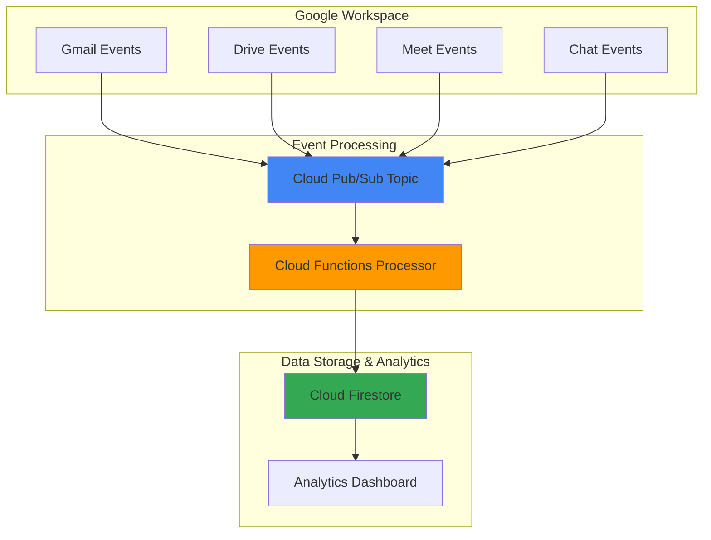

# Team Collaboration Insights with Workspace Events API and Cloud Functions

## Problem

Modern organizations struggle to understand team collaboration patterns and meeting effectiveness across Google Workspace applications. Without real-time insights into how teams interact through Gmail, Calendar, Drive, and Meet, managers lack data-driven visibility into productivity bottlenecks, collaboration gaps, and resource utilization patterns that impact business outcomes.

## Solution

Build an automated analytics system that captures real-time Google Workspace collaboration events using the Workspace Events API, processes them through Cloud Functions for intelligent analysis, and stores structured insights in Cloud Firestore to generate comprehensive team productivity reports and meeting effectiveness dashboards.

## Architecture Diagram



## Prerequisites

1. Google Cloud Platform account with billing enabled
2. Google Workspace domain with admin access for Events API configuration
3. gcloud CLI installed and configured (or Cloud Shell)
4. Domain-wide delegation configured for Workspace Events API access
5. Estimated cost: $10-25/month for processing 10,000 events daily

> **Note**: This recipe requires Google Workspace Business Standard or higher to access the Events API. Free personal Google accounts are not supported.

## Preparation

```bash
# Set environment variables for GCP resources
export PROJECT_ID="workspace-analytics-$(date +%s)"
export REGION="us-central1"
export ZONE="us-central1-a"

# Generate unique suffix for resource names
RANDOM_SUFFIX=$(openssl rand -hex 3)

# Set default project and region
gcloud config set project ${PROJECT_ID}
gcloud config set compute/region ${REGION}
gcloud config set compute/zone ${ZONE}

# Enable required APIs
gcloud services enable cloudfunctions.googleapis.com
gcloud services enable firestore.googleapis.com
gcloud services enable pubsub.googleapis.com
gcloud services enable workspaceevents.googleapis.com

echo "✅ Project configured: ${PROJECT_ID}"

# Create service account for Workspace Events API
gcloud iam service-accounts create workspace-events-sa \
    --display-name="Workspace Events Service Account"

# Grant necessary permissions
gcloud projects add-iam-policy-binding ${PROJECT_ID} \
    --member="serviceAccount:workspace-events-sa@${PROJECT_ID}.iam.gserviceaccount.com" \
    --role="roles/pubsub.publisher"

echo "✅ Service account configured for Workspace Events API"
```

## Steps

1. **Create Cloud Pub/Sub Topic for Workspace Events**:

   Cloud Pub/Sub serves as the reliable messaging backbone for Google Workspace events, providing asynchronous event delivery with guaranteed message ordering and automatic retry capabilities. This decoupled architecture ensures that workspace events are captured even during high-volume periods or temporary service disruptions.

   ```bash
   # Create Pub/Sub topic for workspace events
   gcloud pubsub topics create workspace-events-topic
   
   # Create subscription for Cloud Functions trigger
   gcloud pubsub subscriptions create workspace-events-subscription \
       --topic=workspace-events-topic \
       --ack-deadline=600
   
   echo "✅ Pub/Sub topic and subscription created"
   ```

   The topic configuration includes extended acknowledgment deadlines to accommodate complex event processing workflows while maintaining message delivery guarantees across distributed systems.

2. **Initialize Cloud Firestore Database**:

   Cloud Firestore provides real-time NoSQL storage optimized for collaborative applications, offering automatic scaling and real-time synchronization capabilities essential for team analytics dashboards. The document-based structure aligns perfectly with the flexible schema requirements of workspace event data.

   ```bash
   # Create Firestore database in native mode
   gcloud firestore databases create \
       --location=${REGION} \
       --type=firestore-native
   
   # Create initial collections structure
   gcloud firestore import gs://dummy-bucket/structure.json \
       --async || echo "Database ready for first writes"
   
   echo "✅ Cloud Firestore database initialized"
   ```

   Native mode Firestore provides strong consistency guarantees and real-time listeners, enabling immediate dashboard updates as collaboration events are processed and stored.

3. **Deploy Event Processing Cloud Function**:

   Cloud Functions provides serverless event processing that automatically scales based on incoming Workspace events, eliminating infrastructure management while ensuring cost-effective processing. The function transforms raw event data into structured analytics insights for team collaboration patterns.

   ```bash
   # Create Cloud Function source directory
   mkdir -p workspace-analytics-function
   cd workspace-analytics-function
   
   # Create main function file
   cat > main.py << 'EOF'
import json
import base64
from google.cloud import firestore
from datetime import datetime
import functions_framework

db = firestore.Client()

@functions_framework.cloud_event
def process_workspace_event(cloud_event):
    """Process Google Workspace events and store analytics data."""
    
    # Decode event data
    event_data = json.loads(base64.b64decode(cloud_event.data['message']['data']))
    event_type = cloud_event.data['message']['attributes'].get('ce-type', '')
    event_time = cloud_event.data['message']['attributes'].get('ce-time', '')
    
    # Extract collaboration insights
    insights = extract_collaboration_insights(event_data, event_type)
    
    # Store in Firestore
    doc_ref = db.collection('collaboration_events').document()
    doc_ref.set({
        'event_type': event_type,
        'timestamp': datetime.fromisoformat(event_time.replace('Z', '+00:00')),
        'insights': insights,
        'raw_event': event_data
    })
    
    # Update team metrics
    update_team_metrics(insights)
    
    print(f"Processed {event_type} event at {event_time}")

def extract_collaboration_insights(event_data, event_type):
    """Extract meaningful collaboration insights from workspace events."""
    insights = {}
    
    if 'chat.message' in event_type:
        insights.update({
            'interaction_type': 'chat',
            'participants': event_data.get('sender', {}).get('name'),
            'space_id': event_data.get('space', {}).get('name')
        })
    elif 'drive.file' in event_type:
        insights.update({
            'interaction_type': 'file_collaboration',
            'file_type': event_data.get('mimeType'),
            'sharing_activity': event_type.split('.')[-1]
        })
    elif 'meet.conference' in event_type:
        insights.update({
            'interaction_type': 'meeting',
            'duration': event_data.get('conferenceRecord', {}).get('duration'),
            'participants_count': len(event_data.get('participants', []))
        })
    
    return insights

def update_team_metrics(insights):
    """Update aggregated team collaboration metrics."""
    metrics_ref = db.collection('team_metrics').document('daily_summary')
    
    # Use Firestore transactions for atomic updates
    from google.cloud.firestore import Increment
    
    metrics_ref.update({
        f"{insights.get('interaction_type', 'unknown')}_count": Increment(1),
        'last_updated': datetime.now()
    })
EOF
   
   # Create requirements file
   cat > requirements.txt << 'EOF'
google-cloud-firestore>=2.16.0
functions-framework>=3.5.0
EOF
   
   # Deploy Cloud Function
   gcloud functions deploy process-workspace-events \
       --runtime python311 \
       --trigger-topic workspace-events-topic \
       --source . \
       --entry-point process_workspace_event \
       --memory 256MB \
       --timeout 60s \
       --set-env-vars "GCP_PROJECT=${PROJECT_ID}"
   
   cd ..
   echo "✅ Cloud Function deployed successfully"
   ```

   The Cloud Function implementation includes intelligent event parsing, collaboration pattern recognition, and atomic metric updates using Firestore transactions to ensure data consistency across concurrent event processing.

4. **Create Workspace Events API Subscription**:

   The Workspace Events API subscription establishes real-time monitoring of Google Workspace resources, automatically delivering CloudEvents-formatted notifications to the Pub/Sub topic. This integration enables comprehensive tracking of team collaboration activities across all Workspace applications.

   ```bash
   # Create Workspace Events subscription for Chat events
   cat > chat-subscription.json << EOF
{
  "name": "projects/${PROJECT_ID}/subscriptions/chat-collaboration-events",
  "targetResource": "//chat.googleapis.com/spaces/-",
  "eventTypes": [
    "google.workspace.chat.message.v1.created",
    "google.workspace.chat.space.v1.updated",
    "google.workspace.chat.membership.v1.created"
  ],
  "notificationEndpoint": {
    "pubsubTopic": "projects/${PROJECT_ID}/topics/workspace-events-topic"
  },
  "payloadOptions": {
    "includeResource": true
  }
}
EOF
   
   # Create subscription using REST API
   curl -X POST \
     "https://workspaceevents.googleapis.com/v1/subscriptions" \
     -H "Authorization: Bearer $(gcloud auth print-access-token)" \
     -H "Content-Type: application/json" \
     -d @chat-subscription.json
   
   echo "✅ Workspace Events subscription created for Chat events"
   ```

   The subscription configuration includes resource data payloads for immediate analysis without additional API calls, optimizing both performance and cost efficiency for real-time collaboration insights.

5. **Configure Drive Events Monitoring**:

   Google Drive events provide crucial insights into file collaboration patterns, sharing behaviors, and document lifecycle management within teams. Monitoring these events reveals collaboration effectiveness and identifies potential security or compliance issues in real-time.

   ```bash
   # Create Drive events subscription
   cat > drive-subscription.json << EOF
{
  "name": "projects/${PROJECT_ID}/subscriptions/drive-collaboration-events",
  "targetResource": "//drive.googleapis.com/files/-",
  "eventTypes": [
    "google.workspace.drive.file.v1.created",
    "google.workspace.drive.file.v1.updated",
    "google.workspace.drive.file.v1.accessProposalCreated"
  ],
  "notificationEndpoint": {
    "pubsubTopic": "projects/${PROJECT_ID}/topics/workspace-events-topic"
  },
  "payloadOptions": {
    "includeResource": false
  }
}
EOF
   
   # Create Drive subscription
   curl -X POST \
     "https://workspaceevents.googleapis.com/v1/subscriptions" \
     -H "Authorization: Bearer $(gcloud auth print-access-token)" \
     -H "Content-Type: application/json" \
     -d @drive-subscription.json
   
   echo "✅ Drive collaboration events subscription configured"
   ```

   Drive event monitoring captures file creation, modification, and sharing activities, providing comprehensive visibility into document collaboration workflows and team productivity patterns.

6. **Set Up Meet Events Tracking**:

   Google Meet events offer valuable insights into meeting effectiveness, participation patterns, and virtual collaboration trends. This data enables organizations to optimize meeting culture and identify opportunities for improved team communication and productivity.

   ```bash
   # Create Meet events subscription
   cat > meet-subscription.json << EOF
{
  "name": "projects/${PROJECT_ID}/subscriptions/meet-collaboration-events",
  "targetResource": "//meet.googleapis.com/conferenceRecords/-",
  "eventTypes": [
    "google.workspace.meet.conference.v2.started",
    "google.workspace.meet.conference.v2.ended",
    "google.workspace.meet.participant.v2.joined",
    "google.workspace.meet.participant.v2.left"
  ],
  "notificationEndpoint": {
    "pubsubTopic": "projects/${PROJECT_ID}/topics/workspace-events-topic"
  },
  "payloadOptions": {
    "includeResource": true
  }
}
EOF
   
   # Create Meet subscription
   curl -X POST \
     "https://workspaceevents.googleapis.com/v1/subscriptions" \
     -H "Authorization: Bearer $(gcloud auth print-access-token)" \
     -H "Content-Type: application/json" \
     -d @meet-subscription.json
   
   echo "✅ Meet collaboration events subscription established"
   ```

   Meet event tracking provides real-time insights into meeting participation, duration patterns, and collaboration effectiveness metrics essential for modern distributed teams.

7. **Deploy Analytics Dashboard Function**:

   The analytics dashboard function provides HTTP endpoints for querying processed collaboration data, enabling real-time visualization of team productivity metrics, collaboration patterns, and meeting effectiveness trends through web applications or business intelligence tools.

   ```bash
   # Create dashboard function directory
   mkdir -p analytics-dashboard
   cd analytics-dashboard
   
   # Create dashboard API function
   cat > main.py << 'EOF'
import json
from google.cloud import firestore
from datetime import datetime, timedelta
import functions_framework
from flask import jsonify

db = firestore.Client()

@functions_framework.http
def get_collaboration_analytics(request):
    """HTTP endpoint for retrieving collaboration analytics."""
    
    # Parse query parameters
    days = int(request.args.get('days', 7))
    team_id = request.args.get('team_id', 'all')
    
    # Calculate date range
    end_date = datetime.now()
    start_date = end_date - timedelta(days=days)
    
    # Query collaboration events
    events_ref = db.collection('collaboration_events')
    query = events_ref.where('timestamp', '>=', start_date) \
                     .where('timestamp', '<=', end_date)
    
    events = []
    for doc in query.stream():
        event_data = doc.to_dict()
        events.append(event_data)
    
    # Calculate analytics
    analytics = calculate_team_analytics(events)
    
    return jsonify({
        'period': f'{days} days',
        'total_events': len(events),
        'analytics': analytics,
        'generated_at': datetime.now().isoformat()
    })

def calculate_team_analytics(events):
    """Calculate team collaboration analytics from events."""
    analytics = {
        'interaction_types': {},
        'daily_activity': {},
        'collaboration_score': 0
    }
    
    for event in events:
        # Count interaction types
        interaction_type = event.get('insights', {}).get('interaction_type', 'unknown')
        analytics['interaction_types'][interaction_type] = \
            analytics['interaction_types'].get(interaction_type, 0) + 1
        
        # Group by day
        event_date = event.get('timestamp').date().isoformat()
        analytics['daily_activity'][event_date] = \
            analytics['daily_activity'].get(event_date, 0) + 1
    
    # Calculate collaboration score (simplified metric)
    total_interactions = sum(analytics['interaction_types'].values())
    unique_types = len(analytics['interaction_types'])
    analytics['collaboration_score'] = min(100, total_interactions * unique_types / 10)
    
    return analytics
EOF
   
   # Create requirements file
   cat > requirements.txt << 'EOF'
google-cloud-firestore>=2.16.0
functions-framework>=3.5.0
flask>=2.3.0
EOF
   
   # Deploy analytics dashboard function
   gcloud functions deploy collaboration-analytics \
       --runtime python311 \
       --trigger-http \
       --allow-unauthenticated \
       --source . \
       --entry-point get_collaboration_analytics \
       --memory 512MB \
       --timeout 120s
   
   cd ..
   echo "✅ Analytics dashboard function deployed"
   ```

   The dashboard function aggregates collaboration data into actionable insights, providing HTTP API endpoints for integration with existing business intelligence platforms or custom analytics applications.

8. **Configure Firestore Security Rules**:

   Firestore security rules ensure that collaboration analytics data is properly protected while enabling appropriate access for dashboard applications and administrative users. These rules implement principle of least privilege for sensitive team collaboration information.

   ```bash
   # Create Firestore security rules
   cat > firestore.rules << 'EOF'
rules_version = '2';
service cloud.firestore {
  match /databases/{database}/documents {
    // Allow read access to collaboration events for authenticated users
    match /collaboration_events/{document} {
      allow read: if request.auth != null;
      allow write: if false; // Only Cloud Functions can write
    }
    
    // Allow read access to team metrics
    match /team_metrics/{document} {
      allow read: if request.auth != null;
      allow write: if false; // Only Cloud Functions can write
    }
    
    // Allow admin access for specific service accounts
    match /{path=**} {
      allow read, write: if request.auth.token.email.matches('.*@' + resource.data.project_id + '.iam.gserviceaccount.com');
    }
  }
}
EOF
   
   # Deploy security rules
   gcloud firestore deploy --rules firestore.rules
   
   echo "✅ Firestore security rules configured"
   ```

   Security rules protect sensitive collaboration data while enabling legitimate access patterns for analytics processing and dashboard visualization functionality.

## Validation & Testing

1. **Verify Workspace Events Subscriptions**:

   ```bash
   # List all active Workspace Events subscriptions
   curl -X GET \
     "https://workspaceevents.googleapis.com/v1/subscriptions" \
     -H "Authorization: Bearer $(gcloud auth print-access-token)"
   ```

   Expected output: JSON response showing three active subscriptions for Chat, Drive, and Meet events with proper configuration.

2. **Test Cloud Functions Event Processing**:

   ```bash
   # Check Cloud Functions logs for event processing
   gcloud functions logs read process-workspace-events \
       --limit 10 \
       --format="value(timestamp,message)"
   
   # Verify Firestore data population
   gcloud firestore export gs://${PROJECT_ID}-backup/test-export \
       --collection-ids=collaboration_events
   ```

   Expected output: Function logs showing successful event processing and Firestore collections containing collaboration event data.

3. **Test Analytics Dashboard API**:

   ```bash
   # Get dashboard function URL
   DASHBOARD_URL=$(gcloud functions describe collaboration-analytics \
       --format="value(httpsTrigger.url)")
   
   # Test analytics endpoint
   curl "${DASHBOARD_URL}?days=7&team_id=all" \
       -H "Content-Type: application/json"
   ```

   Expected output: JSON response with collaboration analytics including interaction types, daily activity, and collaboration score metrics.

4. **Validate Real-time Event Flow**:

   ```bash
   # Monitor Pub/Sub topic for incoming events
   gcloud pubsub subscriptions pull workspace-events-subscription \
       --auto-ack \
       --limit=5
   ```

   Expected output: Workspace events in CloudEvents format showing real-time collaboration activities from Google Workspace applications.

## Cleanup

1. **Remove Workspace Events Subscriptions**:

   ```bash
   # List and delete all subscriptions
   curl -X GET \
     "https://workspaceevents.googleapis.com/v1/subscriptions" \
     -H "Authorization: Bearer $(gcloud auth print-access-token)" | \
     jq -r '.subscriptions[].name' | \
     xargs -I {} curl -X DELETE \
       "https://workspaceevents.googleapis.com/v1/{}" \
       -H "Authorization: Bearer $(gcloud auth print-access-token)"
   
   echo "✅ Workspace Events subscriptions deleted"
   ```

2. **Delete Cloud Functions**:

   ```bash
   # Remove event processing function
   gcloud functions delete process-workspace-events --quiet
   
   # Remove analytics dashboard function
   gcloud functions delete collaboration-analytics --quiet
   
   echo "✅ Cloud Functions deleted"
   ```

3. **Clean up Pub/Sub Resources**:

   ```bash
   # Delete subscription and topic
   gcloud pubsub subscriptions delete workspace-events-subscription
   gcloud pubsub topics delete workspace-events-topic
   
   echo "✅ Pub/Sub resources cleaned up"
   ```

4. **Remove Firestore Database**:

   ```bash
   # Delete Firestore database (requires manual confirmation)
   gcloud firestore databases delete --database="(default)" --quiet
   
   echo "✅ Firestore database deleted"
   ```

5. **Delete Project Resources**:

   ```bash
   # Remove service account
   gcloud iam service-accounts delete \
       workspace-events-sa@${PROJECT_ID}.iam.gserviceaccount.com --quiet
   
   # Delete project (optional)
   gcloud projects delete ${PROJECT_ID} --quiet
   
   echo "✅ All resources cleaned up successfully"
   ```

## Discussion

This collaboration analytics solution demonstrates the power of event-driven architecture for capturing and analyzing team productivity patterns in real-time. The Workspace Events API provides comprehensive visibility into how teams interact across Google Workspace applications, while Cloud Functions offers serverless processing that scales automatically with event volume. This combination eliminates infrastructure management overhead while ensuring cost-effective operation based on actual usage patterns.

The architecture leverages Cloud Firestore's real-time capabilities to enable immediate dashboard updates as collaboration events occur, providing managers and team leads with current insights into productivity trends, meeting effectiveness, and collaboration bottlenecks. The document-based storage model accommodates the flexible schema requirements of diverse workspace events while maintaining query performance for analytics aggregations. Security rules ensure that sensitive collaboration data remains protected while enabling appropriate access for legitimate analytics use cases.

Cloud Pub/Sub serves as the reliable messaging backbone, handling event delivery guarantees and automatic retry logic essential for capturing all collaboration activities without data loss. The integration with Workspace Events API through domain-wide delegation enables organization-wide monitoring while respecting user privacy and compliance requirements. This approach scales from small teams to enterprise organizations without requiring architectural changes or performance optimization.

The solution provides immediate business value through actionable insights into team collaboration patterns, meeting effectiveness metrics, and productivity trends that inform data-driven management decisions. Organizations can identify collaboration gaps, optimize meeting culture, and improve resource allocation based on concrete usage data rather than subjective assessments.

> **Tip**: Use Cloud Monitoring to set up alerts on collaboration metrics, enabling proactive identification of productivity issues or unusual activity patterns that may indicate security concerns.

**Sources:**
- [Google Workspace Events API Documentation](https://developers.google.com/workspace/events)
- [Cloud Functions Event-driven Architecture](https://cloud.google.com/functions/docs/concepts/events-triggers)
- [Cloud Firestore Real-time Analytics](https://cloud.google.com/firestore/docs/solutions/analytics)
- [Google Cloud Pub/Sub Best Practices](https://cloud.google.com/pubsub/docs/publisher)
- [Workspace Events Security Guidelines](https://developers.google.com/workspace/events/guides/auth)

## Challenge

Extend this collaboration analytics solution by implementing these advanced capabilities:

1. **Implement AI-powered Collaboration Insights**: Integrate Vertex AI to analyze collaboration patterns and provide predictive insights about team productivity trends, meeting effectiveness, and optimal collaboration strategies.

2. **Add Cross-application Workflow Tracking**: Create correlation analysis between Google Workspace applications to identify complete collaboration workflows, such as tracking document creation in Drive through discussion in Chat to presentation in Meet.

3. **Build Real-time Collaboration Anomaly Detection**: Implement Cloud Functions with statistical analysis to detect unusual collaboration patterns that might indicate security issues, compliance violations, or productivity concerns requiring immediate attention.

4. **Create Intelligent Meeting Analytics**: Develop advanced Meet event processing that analyzes participation patterns, speaking time distribution, and meeting outcome effectiveness using natural language processing of transcripts and chat interactions.

5. **Implement Multi-tenant Analytics Architecture**: Extend the solution to support multiple Google Workspace domains with proper data isolation, tenant-specific analytics, and cross-organization collaboration insights for enterprise customers.

## Infrastructure Code

*Infrastructure code will be generated after recipe approval.*