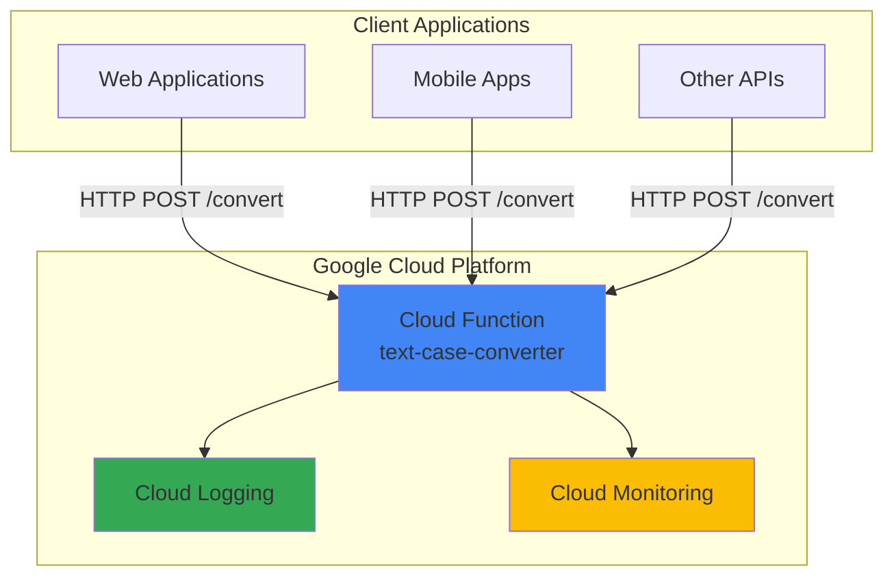

# Text Case Converter API with Cloud Functions

## Problem

Development teams frequently need text formatting utilities across multiple applications, particularly for data processing, content management, and user interface standardization. Creating and maintaining separate text conversion libraries for each project increases development overhead and creates inconsistencies. Traditional server-based solutions require infrastructure management and scaling considerations that don't align with the sporadic, lightweight nature of text processing tasks.

## Solution

Google Cloud Functions provides a serverless platform to deploy a text case conversion API that automatically scales based on demand and charges only for actual usage. The function will accept HTTP requests with text input and return formatted output in various cases (uppercase, lowercase, title case, camel case), eliminating the need for teams to implement their own text formatting logic while providing a consistent, reliable service across all applications.

## Architecture Diagram



## Prerequisites

1. Google Cloud Platform account with billing enabled
2. Cloud Functions API enabled in your project
3. gcloud CLI installed and authenticated (or Cloud Shell access)
4. Basic knowledge of Python and HTTP APIs
5. Estimated cost: $0.00 - $0.10 for this tutorial (functions free tier covers testing)

> **Note**: Cloud Functions provides 2 million invocations per month in the free tier, making this tutorial essentially cost-free for development and testing purposes.

## Preparation

```bash
# Set environment variables for GCP resources
export PROJECT_ID="text-converter-$(date +%s)"
export REGION="us-central1"
export FUNCTION_NAME="text-case-converter"

# Generate unique suffix for resource names
RANDOM_SUFFIX=$(openssl rand -hex 3)

# Create and set the project
gcloud projects create ${PROJECT_ID} \
    --name="Text Case Converter API"

gcloud config set project ${PROJECT_ID}
gcloud config set compute/region ${REGION}

# Enable required APIs
gcloud services enable cloudfunctions.googleapis.com
gcloud services enable cloudbuild.googleapis.com
gcloud services enable logging.googleapis.com

echo "✅ Project configured: ${PROJECT_ID}"
echo "✅ APIs enabled successfully"
```

## Steps

1. **Create the Function Source Code**:

   Cloud Functions for Python uses the Functions Framework to handle HTTP requests with Flask-like syntax. The framework automatically manages the server infrastructure, request routing, and response handling, allowing developers to focus on business logic. Creating a well-structured function with proper error handling ensures reliable text processing across different input scenarios.

   ```bash
   # Create project directory structure
   mkdir ${FUNCTION_NAME}
   cd ${FUNCTION_NAME}
   
   # Create the main function file
   cat > main.py << 'EOF'
import functions_framework
import json
import re

@functions_framework.http
def text_case_converter(request):
    """HTTP Cloud Function for text case conversion.
    
    Accepts POST requests with JSON payload containing:
    - text: string to convert
    - case_type: target case format
    
    Returns JSON response with converted text.
    """
    
    # Set CORS headers for cross-origin requests
    headers = {
        'Access-Control-Allow-Origin': '*',
        'Access-Control-Allow-Methods': 'POST, OPTIONS',
        'Access-Control-Allow-Headers': 'Content-Type',
        'Content-Type': 'application/json'
    }
    
    # Handle preflight OPTIONS requests
    if request.method == 'OPTIONS':
        return ('', 204, headers)
    
    # Only accept POST requests
    if request.method != 'POST':
        return (json.dumps({'error': 'Method not allowed'}), 405, headers)
    
    try:
        # Parse JSON request body
        request_json = request.get_json(silent=True)
        
        if not request_json:
            return (json.dumps({'error': 'Invalid JSON'}), 400, headers)
        
        text = request_json.get('text', '')
        case_type = request_json.get('case_type', '').lower()
        
        if not text:
            return (json.dumps({'error': 'Text field is required'}), 400, headers)
        
        if not case_type:
            return (json.dumps({'error': 'case_type field is required'}), 400, headers)
        
        # Perform case conversion
        converted_text = convert_case(text, case_type)
        
        if converted_text is None:
            return (json.dumps({'error': f'Unsupported case type: {case_type}'}), 400, headers)
        
        # Return successful response
        response = {
            'original': text,
            'case_type': case_type,
            'converted': converted_text
        }
        
        return (json.dumps(response), 200, headers)
        
    except Exception as e:
        # Log error and return generic error message
        print(f"Error processing request: {str(e)}")
        return (json.dumps({'error': 'Internal server error'}), 500, headers)

def convert_case(text, case_type):
    """Convert text to specified case format."""
    
    case_handlers = {
        'upper': lambda t: t.upper(),
        'uppercase': lambda t: t.upper(),
        'lower': lambda t: t.lower(),
        'lowercase': lambda t: t.lower(),
        'title': lambda t: t.title(),
        'titlecase': lambda t: t.title(),
        'capitalize': lambda t: t.capitalize(),
        'camel': lambda t: to_camel_case(t),
        'camelcase': lambda t: to_camel_case(t),
        'pascal': lambda t: to_pascal_case(t),
        'pascalcase': lambda t: to_pascal_case(t),
        'snake': lambda t: to_snake_case(t),
        'snakecase': lambda t: to_snake_case(t),
        'kebab': lambda t: to_kebab_case(t),
        'kebabcase': lambda t: to_kebab_case(t)
    }
    
    return case_handlers.get(case_type, lambda t: None)(text)

def to_camel_case(text):
    """Convert text to camelCase."""
    # Split on whitespace and non-alphanumeric characters
    words = re.split(r'[^a-zA-Z0-9]', text)
    # Filter empty strings and convert
    words = [word for word in words if word]
    if not words:
        return text
    
    result = words[0].lower()
    for word in words[1:]:
        result += word.capitalize()
    return result

def to_pascal_case(text):
    """Convert text to PascalCase."""
    words = re.split(r'[^a-zA-Z0-9]', text)
    words = [word for word in words if word]
    return ''.join(word.capitalize() for word in words)

def to_snake_case(text):
    """Convert text to snake_case."""
    # Handle camelCase and PascalCase
    s1 = re.sub('(.)([A-Z][a-z]+)', r'\1_\2', text)
    # Handle sequences of uppercase letters
    s2 = re.sub('([a-z0-9])([A-Z])', r'\1_\2', s1)
    # Replace whitespace and non-alphanumeric with underscores
    s3 = re.sub(r'[^a-zA-Z0-9]', '_', s2)
    # Remove duplicate underscores and convert to lowercase
    return re.sub(r'_+', '_', s3).strip('_').lower()

def to_kebab_case(text):
    """Convert text to kebab-case."""
    # Similar to snake_case but with hyphens
    s1 = re.sub('(.)([A-Z][a-z]+)', r'\1-\2', text)
    s2 = re.sub('([a-z0-9])([A-Z])', r'\1-\2', s1)
    s3 = re.sub(r'[^a-zA-Z0-9]', '-', s2)
    return re.sub(r'-+', '-', s3).strip('-').lower()
EOF
   
   echo "✅ Function source code created"
   ```

   The function implements comprehensive text case conversion with proper error handling and CORS support. Python's built-in string methods like `upper()`, `lower()`, and `title()` provide efficient case transformations, while custom functions handle more complex conversions like camelCase and snake_case using regular expressions for reliable text parsing.

2. **Create Requirements File**:

   Cloud Functions automatically installs dependencies listed in requirements.txt during deployment. The Functions Framework is the only external dependency needed, providing the HTTP request handling infrastructure that integrates seamlessly with Google Cloud's serverless platform.

   ```bash
   # Create requirements.txt for dependencies
   cat > requirements.txt << 'EOF'
functions-framework>=3.0.0
EOF
   
   echo "✅ Requirements file created"
   ```

3. **Deploy the Cloud Function**:

   The gcloud functions deploy command packages your source code, builds a container image, and deploys it to Google's serverless infrastructure. The deployment process includes automatic scaling configuration, HTTP trigger setup, and integration with Cloud Logging and Monitoring services. Using the current Python 3.11 runtime provides the latest security patches and performance improvements.

   ```bash
   # Deploy the function with HTTP trigger
   gcloud functions deploy ${FUNCTION_NAME} \
       --runtime python311 \
       --trigger-http \
       --allow-unauthenticated \
       --source . \
       --entry-point text_case_converter \
       --memory 128MB \
       --timeout 60s \
       --region ${REGION}
   
   # Get the function URL
   FUNCTION_URL=$(gcloud functions describe ${FUNCTION_NAME} \
       --region=${REGION} \
       --format="value(httpsTrigger.url)")
   
   echo "✅ Function deployed successfully"
   echo "Function URL: ${FUNCTION_URL}"
   ```

   Cloud Functions automatically provisions computing resources, configures load balancing, and enables HTTPS encryption. The `--allow-unauthenticated` flag makes the function publicly accessible, suitable for APIs that don't require authentication, while maintaining security through input validation and error handling. The 128MB memory allocation is cost-effective for text processing workloads.

4. **Test Basic Function Deployment**:

   Testing the deployed function verifies that the HTTP trigger is properly configured and the function can receive and process requests. Initial testing helps identify deployment issues before implementing comprehensive validation scenarios.

   ```bash
   # Test function with a simple curl request
   curl -X POST ${FUNCTION_URL} \
       -H "Content-Type: application/json" \
       -d '{
         "text": "hello world",
         "case_type": "upper"
       }'
   
   echo ""
   echo "✅ Basic function test completed"
   ```

## Validation & Testing

1. **Test All Case Conversion Types**:

   ```bash
   # Test uppercase conversion
   echo "Testing uppercase conversion:"
   curl -s -X POST ${FUNCTION_URL} \
       -H "Content-Type: application/json" \
       -d '{"text": "hello world", "case_type": "upper"}' | \
       python3 -m json.tool
   
   # Test camelCase conversion
   echo -e "\nTesting camelCase conversion:"
   curl -s -X POST ${FUNCTION_URL} \
       -H "Content-Type: application/json" \
       -d '{"text": "hello world example", "case_type": "camel"}' | \
       python3 -m json.tool
   
   # Test snake_case conversion
   echo -e "\nTesting snake_case conversion:"
   curl -s -X POST ${FUNCTION_URL} \
       -H "Content-Type: application/json" \
       -d '{"text": "Hello World Example", "case_type": "snake"}' | \
       python3 -m json.tool
   ```

   Expected output for uppercase: `{"original": "hello world", "case_type": "upper", "converted": "HELLO WORLD"}`

2. **Test Error Handling**:

   ```bash
   # Test missing text field
   echo "Testing error handling - missing text:"
   curl -s -X POST ${FUNCTION_URL} \
       -H "Content-Type: application/json" \
       -d '{"case_type": "upper"}' | \
       python3 -m json.tool
   
   # Test unsupported case type
   echo -e "\nTesting error handling - invalid case type:"
   curl -s -X POST ${FUNCTION_URL} \
       -H "Content-Type: application/json" \
       -d '{"text": "test", "case_type": "invalid"}' | \
       python3 -m json.tool
   ```

3. **Test Complex Text Scenarios**:

   ```bash
   # Test snake_case conversion with mixed input
   echo "Testing snake_case conversion with mixed input:"
   curl -s -X POST ${FUNCTION_URL} \
       -H "Content-Type: application/json" \
       -d '{"text": "Convert This CamelCase Text", "case_type": "snake"}' | \
       python3 -m json.tool
   
   # Test function performance and monitoring
   echo -e "\nFunction execution logs:"
   gcloud functions logs read ${FUNCTION_NAME} \
       --region=${REGION} \
       --limit=5
   ```

4. **Verify Function Monitoring**:

   ```bash
   # Check function metrics
   echo "Function execution metrics:"
   gcloud functions describe ${FUNCTION_NAME} \
       --region=${REGION} \
       --format="table(status, httpsTrigger.url)"
   ```

## Cleanup

1. **Delete the Cloud Function**:

   ```bash
   # Delete the deployed function
   gcloud functions delete ${FUNCTION_NAME} \
       --region=${REGION} \
       --quiet
   
   echo "✅ Cloud Function deleted"
   ```

2. **Remove Project Resources**:

   ```bash
   # Delete the entire project (optional)
   gcloud projects delete ${PROJECT_ID} --quiet
   
   # Remove local files
   cd ..
   rm -rf ${FUNCTION_NAME}
   
   echo "✅ All resources cleaned up"
   echo "Note: Project deletion may take several minutes to complete"
   ```

## Discussion

Google Cloud Functions provides an ideal serverless platform for lightweight APIs like text processing utilities, eliminating infrastructure management while providing automatic scaling and cost optimization. The platform's event-driven architecture ensures you only pay for actual function execution time, making it extremely cost-effective for sporadic workloads. The Functions Framework for Python simplifies HTTP request handling by providing Flask-like syntax while automatically managing server lifecycle, request parsing, and response formatting.

The text case conversion implementation leverages Python's robust string manipulation capabilities, including built-in methods like `str.upper()`, `str.lower()`, and `str.title()` for basic transformations. More complex conversions like camelCase and snake_case utilize regular expressions to handle various input formats reliably. The `re.split()` and `re.sub()` functions provide powerful pattern matching for text transformation, while proper error handling ensures the API remains stable under different input conditions.

Cloud Functions integrates seamlessly with Google Cloud's observability stack, automatically sending execution logs to Cloud Logging and metrics to Cloud Monitoring. This integration provides comprehensive visibility into function performance, error rates, and resource utilization without additional configuration. The platform's built-in security features include automatic HTTPS termination, DDoS protection, and integration with Identity and Access Management (IAM) for authentication when needed. The updated Python 3.11 runtime provides enhanced security, performance improvements, and access to the latest language features.

The serverless model particularly excels for text processing APIs because these workloads typically have unpredictable traffic patterns and short execution times. Traditional server-based solutions require constant resource allocation regardless of usage, while Cloud Functions scales to zero when not in use and can handle sudden traffic spikes automatically. This architecture pattern reduces operational overhead and aligns costs directly with actual usage, making it an ideal choice for utility functions that support multiple applications.

> **Tip**: Use Cloud Functions monitoring dashboards to track API usage patterns and optimize function configuration based on actual performance metrics and user demand.

**Documentation References:**
1. [Google Cloud Functions HTTP Functions Documentation](https://cloud.google.com/functions/docs/writing/http) - Official guide for creating HTTP-triggered functions
2. [Functions Framework for Python](https://github.com/GoogleCloudPlatform/functions-framework-python) - Open-source framework documentation
3. [Cloud Functions Best Practices](https://cloud.google.com/functions/docs/bestpractices) - Performance and security recommendations
4. [Python String Methods Documentation](https://docs.python.org/3/library/stdtypes.html#string-methods) - Comprehensive reference for text manipulation
5. [Google Cloud Architecture Center](https://cloud.google.com/architecture) - Serverless architecture patterns and guidance

## Challenge

Extend this text case conversion API with these enhancements:

1. **Add Authentication**: Implement API key validation using Cloud Functions environment variables and request headers to control access and prevent abuse.

2. **Batch Processing**: Modify the function to accept arrays of text strings for bulk conversion, optimizing performance for large-scale text processing scenarios.

3. **Custom Case Rules**: Add support for domain-specific text formatting rules, such as programming language conventions (Python snake_case, JavaScript camelCase) or business naming standards.

4. **Caching Layer**: Integrate Cloud Memorystore (Redis) to cache frequently requested conversions, reducing function execution time and costs for repeated operations.

5. **Advanced Text Processing**: Extend functionality to include text cleaning, normalization, and formatting options like removing special characters, handling Unicode text, or applying locale-specific capitalization rules.

## Infrastructure Code

### Available Infrastructure as Code:

- [Infrastructure Code Overview](code/README.md) - Detailed description of all infrastructure components
- [Infrastructure Manager](code/infrastructure-manager/) - GCP Infrastructure Manager templates
- [Bash CLI Scripts](code/scripts/) - Example bash scripts using gcloud CLI commands to deploy infrastructure
- [Terraform](code/terraform/) - Terraform configuration files