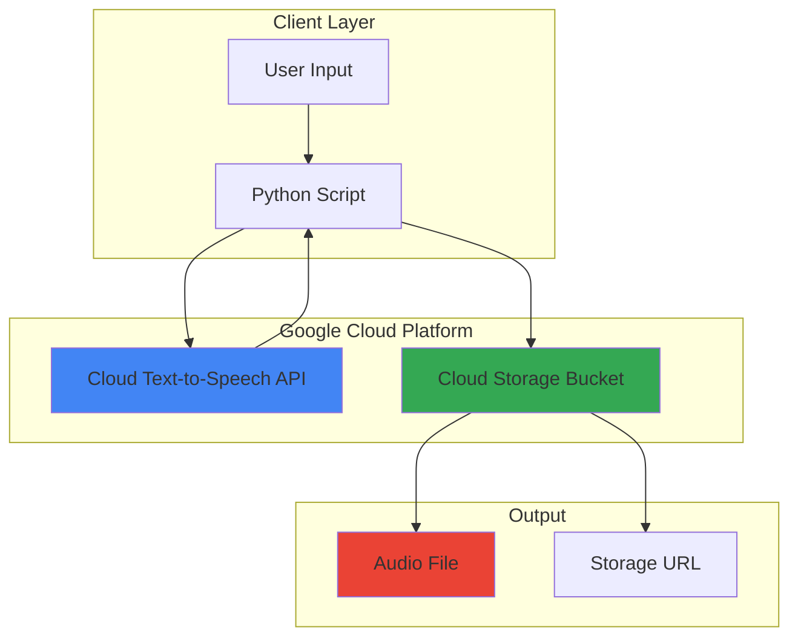

# Text-to-Speech Converter with Text-to-Speech and Storage

## Problem

Organizations frequently need to convert written content into natural-sounding audio for accessibility features, podcast creation, or interactive voice applications. Manual voice recording is time-consuming, expensive, and lacks consistency across different speakers and languages. Traditional text-to-speech solutions often produce robotic-sounding audio that fails to engage users effectively, limiting their applicability for professional use cases.

## Solution

Build a simple web service that leverages Google's Cloud Text-to-Speech API to convert text input into high-quality, natural-sounding audio files. The solution stores generated audio files in Cloud Storage for reliable access, sharing, and streaming. This approach provides scalable, cost-effective speech synthesis with Google's advanced neural voice models, enabling consistent audio quality across multiple languages and voice types.

## Architecture Diagram



## Prerequisites

1. Google Cloud account with billing enabled
2. Google Cloud CLI installed and configured
3. Python 3.8+ with pip package manager
4. Basic understanding of Google Cloud APIs and authentication
5. Estimated cost: $0.01-$0.05 for testing (Text-to-Speech charges per character, Storage charges minimal for small files)

> **Note**: This recipe uses Google Cloud's pay-as-you-go pricing model. Standard voices cost $4.00 per million characters, WaveNet voices cost $16.00 per million characters, and new Chirp 3: HD voices cost $30.00 per million characters.

## Preparation

```bash
# Set environment variables for GCP resources
export PROJECT_ID="tts-demo-$(date +%s)"
export REGION="us-central1"
export BUCKET_NAME="tts-audio-${PROJECT_ID}"

# Generate unique suffix for resource names
RANDOM_SUFFIX=$(openssl rand -hex 3)

# Create a new Google Cloud project
gcloud projects create ${PROJECT_ID} \
    --name="Text-to-Speech Demo"

# Set the project as default
gcloud config set project ${PROJECT_ID}
gcloud config set compute/region ${REGION}

# Link billing account (replace with your billing account ID)
# gcloud billing projects link ${PROJECT_ID} \
#     --billing-account=YOUR_BILLING_ACCOUNT_ID

# Enable required APIs
gcloud services enable texttospeech.googleapis.com
gcloud services enable storage.googleapis.com

echo "✅ Project configured: ${PROJECT_ID}"
echo "✅ Region set to: ${REGION}"
```

## Steps

1. **Create Cloud Storage Bucket for Audio Files**:

   Google Cloud Storage provides unified object storage with global edge caching and strong consistency guarantees. Creating a bucket with appropriate location and storage class settings establishes the foundation for reliable audio file storage that can scale from small personal projects to enterprise-level applications while maintaining high performance and cost efficiency.

   ```bash
   # Create storage bucket for audio files using gcloud storage
   gcloud storage buckets create gs://${BUCKET_NAME} \
       --location=${REGION} \
       --storage-class=STANDARD \
       --uniform-bucket-level-access
   
   # Set bucket permissions for public read access (optional)
   gcloud storage buckets add-iam-policy-binding \
       gs://${BUCKET_NAME} \
       --member="allUsers" \
       --role="roles/storage.objectViewer"
   
   echo "✅ Storage bucket created: gs://${BUCKET_NAME}"
   ```

   The storage bucket is now ready with appropriate permissions, providing both scalability and secure access. This foundational component supports the entire audio pipeline, from generation through distribution, while Google's global infrastructure ensures low-latency access worldwide.

2. **Set Up Authentication for API Access**:

   Application Default Credentials (ADC) provide a standardized way for applications to authenticate with Google Cloud services. This authentication method automatically discovers credentials from the environment, simplifying development workflows while maintaining security best practices for production deployments.

   ```bash
   # Configure Application Default Credentials
   gcloud auth application-default login
   
   # Verify authentication and project setup
   gcloud auth list
   gcloud config list
   
   echo "✅ Authentication configured successfully"
   ```

   ADC is now configured, enabling seamless authentication for your Text-to-Speech application. This setup supports both local development and cloud deployment scenarios while maintaining Google Cloud security standards.

3. **Install Python Client Library**:

   The Google Cloud Text-to-Speech client library provides idiomatic Python interfaces for speech synthesis operations. Installing this library enables direct integration with Google's advanced neural voice models, supporting multiple languages, voice types, and audio formats while handling authentication and error management automatically.

   ```bash
   # Install Google Cloud Text-to-Speech client library
   pip install google-cloud-texttospeech google-cloud-storage
   
   # Verify installation
   python -c "import google.cloud.texttospeech; print('✅ Text-to-Speech library installed')"
   python -c "import google.cloud.storage; print('✅ Storage library installed')"
   ```

   The client libraries are now installed and ready for use. These libraries provide production-ready functionality with built-in retry logic, error handling, and optimized performance for Google Cloud services.

4. **Create Text-to-Speech Conversion Script**:

   This Python script demonstrates the core functionality of converting text to speech using Google's advanced neural voice models. The script handles text input, voice configuration, audio synthesis, and Cloud Storage upload in a streamlined workflow that can be adapted for various use cases.

   ```bash
   # Create the main conversion script
   cat > text_to_speech_converter.py << 'EOF'
#!/usr/bin/env python3
"""
Text-to-Speech Converter with Cloud Storage Integration
Converts text input to natural-sounding audio using Google Cloud Text-to-Speech API
and stores the result in Cloud Storage.
"""

import os
from google.cloud import texttospeech
from google.cloud import storage
import argparse

def synthesize_text_to_speech(text_input, output_filename, voice_name="en-US-Wavenet-D"):
    """
    Synthesizes speech from text using Google Cloud Text-to-Speech API.
    
    Args:
        text_input (str): Text to convert to speech
        output_filename (str): Name for the output audio file
        voice_name (str): Voice model to use for synthesis
    
    Returns:
        bytes: Audio content as bytes
    """
    # Initialize the Text-to-Speech client
    client = texttospeech.TextToSpeechClient()
    
    # Configure the text input
    synthesis_input = texttospeech.SynthesisInput(text=text_input)
    
    # Configure voice parameters based on the voice name
    language_code = voice_name.split('-')[0] + '-' + voice_name.split('-')[1]
    voice = texttospeech.VoiceSelectionParams(
        language_code=language_code,
        name=voice_name,
        ssml_gender=texttospeech.SsmlVoiceGender.NEUTRAL
    )
    
    # Configure audio output format
    audio_config = texttospeech.AudioConfig(
        audio_encoding=texttospeech.AudioEncoding.MP3
    )
    
    # Perform the text-to-speech request
    response = client.synthesize_speech(
        input=synthesis_input,
        voice=voice,
        audio_config=audio_config
    )
    
    print(f"✅ Audio synthesized successfully using voice: {voice_name}")
    return response.audio_content

def upload_to_cloud_storage(audio_content, bucket_name, filename):
    """
    Uploads audio content to Google Cloud Storage.
    
    Args:
        audio_content (bytes): Audio data to upload
        bucket_name (str): Name of the Cloud Storage bucket
        filename (str): Name for the stored file
    
    Returns:
        str: Public URL of the uploaded file
    """
    # Initialize the Storage client
    storage_client = storage.Client()
    bucket = storage_client.bucket(bucket_name)
    blob = bucket.blob(filename)
    
    # Upload the audio content
    blob.upload_from_string(audio_content, content_type='audio/mpeg')
    
    # Make the blob publicly readable (optional)
    blob.make_public()
    
    public_url = blob.public_url
    print(f"✅ Audio uploaded to Cloud Storage: {public_url}")
    return public_url

def main():
    parser = argparse.ArgumentParser(description='Convert text to speech and store in Cloud Storage')
    parser.add_argument('--text', required=True, help='Text to convert to speech')
    parser.add_argument('--output', default='output.mp3', help='Output filename')
    parser.add_argument('--bucket', required=True, help='Cloud Storage bucket name')
    parser.add_argument('--voice', default='en-US-Wavenet-D', help='Voice to use for synthesis')
    
    args = parser.parse_args()
    
    try:
        # Synthesize text to speech
        audio_content = synthesize_text_to_speech(args.text, args.output, args.voice)
        
        # Upload to Cloud Storage
        public_url = upload_to_cloud_storage(audio_content, args.bucket, args.output)
        
        print(f"\n🎉 Text-to-Speech conversion completed successfully!")
        print(f"📁 File: {args.output}")
        print(f"🔗 URL: {public_url}")
        print(f"📊 Audio length: ~{len(args.text) * 0.1:.1f} seconds (estimated)")
        
    except Exception as e:
        print(f"❌ Error during conversion: {str(e)}")
        return 1
    
    return 0

if __name__ == "__main__":
    exit(main())
EOF

   chmod +x text_to_speech_converter.py
   echo "✅ Text-to-Speech converter script created"
   ```

   The conversion script is now ready with comprehensive functionality including error handling, configurable voices, and integrated Cloud Storage upload. This script serves as a foundation that can be extended for web applications, batch processing, or integration into larger systems.

5. **Test the Text-to-Speech Conversion**:

   Testing validates the integration between Text-to-Speech API and Cloud Storage while demonstrating the quality of Google's neural voice models. This verification step ensures all components work correctly and provides insight into the audio quality and processing time for different text inputs.

   ```bash
   # Test with a simple phrase
   python text_to_speech_converter.py \
       --text "Hello! Welcome to Google Cloud Text-to-Speech. This is a demonstration of converting text into natural-sounding speech using advanced AI models." \
       --output "demo-audio.mp3" \
       --bucket "${BUCKET_NAME}" \
       --voice "en-US-Wavenet-D"
   
   echo "✅ Basic text-to-speech conversion completed"
   ```

   The test demonstrates successful text-to-speech conversion with high-quality neural voice synthesis. The generated audio file is now stored in Cloud Storage with a public URL for easy access and sharing.

6. **Test Different Voice Options**:

   Google Cloud Text-to-Speech offers multiple voice types and languages, each optimized for different use cases. Testing various voices helps identify the best options for specific applications, whether for accessibility, entertainment, or professional presentations.

   ```bash
   # Test with different voice types (Studio voice)
   python text_to_speech_converter.py \
       --text "This is a test of the Studio voice quality, which provides the most natural-sounding speech synthesis available." \
       --output "studio-voice-demo.mp3" \
       --bucket "${BUCKET_NAME}" \
       --voice "en-US-Studio-M"
   
   # Test with a different language (optional)
   python text_to_speech_converter.py \
       --text "Bonjour! Ceci est une démonstration de la synthèse vocale en français." \
       --output "french-demo.mp3" \
       --bucket "${BUCKET_NAME}" \
       --voice "fr-FR-Wavenet-A"
   
   echo "✅ Multiple voice tests completed"
   ```

   These tests showcase the diversity and quality of Google's voice models across different languages and voice types. Each voice model is optimized for specific use cases, from casual conversation to professional narration.

## Validation & Testing

1. **Verify Cloud Storage Integration**:

   ```bash
   # List all generated audio files
   gcloud storage ls gs://${BUCKET_NAME}/
   
   # Check file details and sizes
   gcloud storage ls -l gs://${BUCKET_NAME}/*.mp3
   ```

   Expected output: List of MP3 files with timestamps and file sizes, typically 1-5 KB per second of audio.

2. **Test Audio Quality and Accessibility**:

   ```bash
   # Download and play audio locally (requires audio player)
   gcloud storage cp gs://${BUCKET_NAME}/demo-audio.mp3 ./
   
   # Get public URLs for sharing
   echo "Audio files available at:"
   gcloud storage ls -l gs://${BUCKET_NAME}/ | grep -o 'gs://[^[:space:]]*\.mp3' | \
       sed "s|gs://${BUCKET_NAME}/|https://storage.googleapis.com/${BUCKET_NAME}/|g"
   ```

3. **Validate API Usage and Costs**:

   ```bash
   # Check Text-to-Speech API usage
   gcloud logging read "resource.type=api" \
       --filter="protoPayload.serviceName=texttospeech.googleapis.com" \
       --limit=10 \
       --format="table(timestamp,protoPayload.methodName)"
   ```

## Cleanup

1. **Remove Cloud Storage Resources**:

   ```bash
   # Delete all audio files from the bucket
   gcloud storage rm -r gs://${BUCKET_NAME}/**
   
   # Remove the storage bucket
   gcloud storage buckets delete gs://${BUCKET_NAME}
   
   echo "✅ Storage resources cleaned up"
   ```

2. **Clean Up Local Files**:

   ```bash
   # Remove local audio files and scripts
   rm -f *.mp3 text_to_speech_converter.py
   
   echo "✅ Local files cleaned up"
   ```

3. **Delete Google Cloud Project** (Optional):

   ```bash
   # Delete the entire project to ensure no ongoing charges
   gcloud projects delete ${PROJECT_ID} --quiet
   
   echo "✅ Project deleted successfully"
   echo "Note: Project deletion may take several minutes to complete"
   ```

## Discussion

Google Cloud Text-to-Speech API represents a significant advancement in speech synthesis technology, leveraging deep learning models to produce remarkably natural-sounding audio from text input. The service supports over 40 languages and variants with more than 220 voices, including the latest Chirp 3: HD voices, WaveNet, Neural2, and Studio voices that provide human-like intonation and expression. This diversity makes it suitable for global applications requiring multilingual support and various voice characteristics. For additional technical details, refer to the [official Text-to-Speech documentation](https://cloud.google.com/text-to-speech/docs).

The integration with Cloud Storage creates a robust architecture for audio content management. Cloud Storage's global distribution network ensures low-latency access to generated audio files from anywhere in the world, while its durability guarantees (99.999999999%) provide enterprise-grade reliability for critical content. The combination of these services enables scalable solutions that can handle everything from individual user requests to large-scale batch processing operations. Learn more about Cloud Storage best practices in the [Google Cloud Storage documentation](https://cloud.google.com/storage/docs).

Cost optimization becomes crucial when implementing text-to-speech solutions at scale. Standard voices cost $4 per million characters, WaveNet voices cost $16 per million characters, while the newest Chirp 3: HD voices cost $30 per million characters. For high-volume applications, consider implementing caching strategies to avoid regenerating identical audio content, and use Cloud Storage lifecycle policies to automatically manage older audio files. Additionally, the SSML (Speech Synthesis Markup Language) support allows fine-tuned control over speech characteristics, enabling more efficient use of premium voices only where enhanced quality is essential.

Security and compliance considerations are paramount when handling user-generated content and audio files. Google Cloud Text-to-Speech API processes text server-side but doesn't store input text beyond the request duration, making it suitable for sensitive content. For applications requiring additional privacy, consider implementing client-side text preprocessing and using Cloud Storage signed URLs for temporary access control. The service also supports various audio formats (MP3, WAV, OGG) to accommodate different bandwidth and quality requirements.

> **Tip**: Use SSML markup to add pauses, emphasis, and pronunciation guidance for more natural-sounding speech synthesis, especially for technical terms or proper nouns.

## Challenge

Extend this solution by implementing these enhancements:

1. **Web Interface Development**: Create a Flask or Django web application with file upload capabilities, allowing users to upload text documents and receive downloadable audio files through a user-friendly interface.

2. **Batch Processing Pipeline**: Implement Cloud Functions or Cloud Run services to process multiple text files simultaneously, using Pub/Sub for job queuing and Cloud Firestore for progress tracking and result management.

3. **Advanced Voice Customization**: Integrate SSML markup support for controlling speech rate, pitch, and pronunciation, along with a voice preview feature that lets users compare different voice options before final generation.

4. **Multi-language Detection**: Add Cloud Translation API integration to automatically detect text language and select appropriate voice models, enabling seamless multi-language audio generation from mixed-language content.

5. **Enterprise Audio Library**: Build a comprehensive audio content management system with metadata storage, search capabilities, and automated transcription using Cloud Speech-to-Text API for audio content indexing and accessibility compliance.

## Infrastructure Code

*Infrastructure code will be generated after recipe approval.*