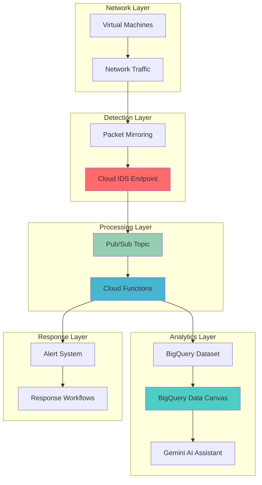

# Threat Detection Pipelines with Cloud IDS and BigQuery Data Canvas

## Problem

Organizations face sophisticated cyber threats that evolve rapidly across network infrastructure, requiring real-time monitoring and intelligent analysis of network traffic patterns. Traditional security monitoring systems often struggle with the volume of data generated by modern cloud environments and lack the visual analytics capabilities needed to identify complex attack patterns, lateral movement, and advanced persistent threats. Security teams need an automated system that can detect intrusions in real-time, analyze patterns using advanced visual analytics, and trigger immediate response workflows to mitigate threats before they impact business operations.

## Solution

This solution combines Google Cloud IDS for comprehensive network threat detection with BigQuery Data Canvas for intelligent visual analytics and automated response workflows through Cloud Functions and Pub/Sub. Cloud IDS continuously monitors network traffic using Palo Alto Networks threat protection technologies, while BigQuery Data Canvas provides AI-powered visual analytics to identify complex threat patterns and trends. Cloud Functions and Pub/Sub enable automated incident response workflows, creating a complete threat detection and response pipeline that scales with your infrastructure while providing security teams with actionable insights through natural language queries and visual dashboards.

## Architecture Diagram



## Prerequisites

1. Google Cloud account with Project Owner or Security Admin permissions for Cloud IDS, BigQuery, Cloud Functions, and Pub/Sub
2. Google Cloud CLI (gcloud) installed and configured (version 400.0.0 or later)
3. Understanding of network security concepts, SQL queries, and serverless functions
4. VPC network with virtual machines to monitor (or ability to create test instances)
5. Estimated cost: $200-500/month for Cloud IDS endpoint, BigQuery analysis, and Cloud Functions (varies by traffic volume)

> **Note**: Cloud IDS requires private services access configuration and has regional availability. Verify service availability in your target region before proceeding.

## Preparation

```bash
# Set environment variables for GCP resources
export PROJECT_ID="threat-detection-$(date +%s)"
export REGION="us-central1"
export ZONE="us-central1-a"

# Generate unique suffix for resource names
RANDOM_SUFFIX=$(openssl rand -hex 3)

# Set default project and region
gcloud config set project ${PROJECT_ID}
gcloud config set compute/region ${REGION}
gcloud config set compute/zone ${ZONE}

# Enable required APIs
gcloud services enable compute.googleapis.com \
    ids.googleapis.com \
    bigquery.googleapis.com \
    cloudfunctions.googleapis.com \
    pubsub.googleapis.com \
    servicenetworking.googleapis.com \
    logging.googleapis.com

# Create VPC network for monitoring
gcloud compute networks create threat-detection-vpc \
    --subnet-mode custom \
    --bgp-routing-mode regional

# Create subnet for instances
gcloud compute networks subnets create threat-detection-subnet \
    --network threat-detection-vpc \
    --range 10.0.1.0/24 \
    --region ${REGION}

# Reserve IP range for private services access
gcloud compute addresses create google-managed-services-threat-detection \
    --global \
    --purpose VPC_PEERING \
    --prefix-length 16 \
    --network threat-detection-vpc

# Create private connection for Cloud IDS
gcloud services vpc-peerings connect \
    --service servicenetworking.googleapis.com \
    --ranges google-managed-services-threat-detection \
    --network threat-detection-vpc \
    --project ${PROJECT_ID}

echo "✅ Project configured: ${PROJECT_ID}"
echo "✅ Network infrastructure prepared for Cloud IDS"
```

## Steps

1. **Create BigQuery Dataset for Threat Detection Analytics**:

   BigQuery provides the scalable data warehouse foundation for storing and analyzing security telemetry data. Creating a dedicated dataset with appropriate security and governance settings ensures that threat detection data is properly organized and accessible for analytics while maintaining security best practices.

   ```bash
   # Create BigQuery dataset for threat detection data
   bq mk --dataset \
       --description "Threat detection and security analytics data" \
       --location ${REGION} \
       ${PROJECT_ID}:threat_detection
   
   # Create table for Cloud IDS findings
   bq mk --table \
       ${PROJECT_ID}:threat_detection.ids_findings \
       finding_id:STRING,timestamp:TIMESTAMP,severity:STRING,threat_type:STRING,source_ip:STRING,destination_ip:STRING,protocol:STRING,details:STRING,raw_data:STRING
   
   # Create table for aggregated threat metrics
   bq mk --table \
       ${PROJECT_ID}:threat_detection.threat_metrics \
       metric_time:TIMESTAMP,threat_count:INTEGER,severity_high:INTEGER,severity_medium:INTEGER,severity_low:INTEGER,top_source_ips:STRING,top_threat_types:STRING
   
   echo "✅ BigQuery dataset and tables created for threat analytics"
   ```

   The BigQuery infrastructure now provides structured storage for both raw security findings and aggregated threat intelligence metrics, enabling comprehensive analysis and reporting capabilities.

2. **Create Pub/Sub Topic and Subscription for Real-time Processing**:

   Pub/Sub enables asynchronous, reliable message processing between Cloud IDS and downstream analytics services. The topic and subscription configuration provides durability and scalability for security event processing, ensuring no critical threats are lost during processing.

   ```bash
   # Create Pub/Sub topic for IDS findings
   gcloud pubsub topics create threat-detection-findings
   
   # Create subscription for Cloud Functions processing
   gcloud pubsub subscriptions create process-findings-sub \
       --topic threat-detection-findings \
       --message-retention-duration 7d \
       --ack-deadline 60s
   
   # Create topic for alert notifications
   gcloud pubsub topics create security-alerts
   
   echo "✅ Pub/Sub infrastructure created for event processing"
   ```

   The messaging infrastructure now supports real-time threat detection workflows with built-in message durability and configurable processing timeouts.

3. **Deploy Cloud Function for Threat Data Processing**:

   Cloud Functions provides serverless processing for transforming and enriching Cloud IDS findings before storing them in BigQuery. This approach ensures cost-effective processing that scales automatically with threat detection volume while maintaining low latency for critical security events.

   ```bash
   # Create directory for Cloud Function code
   mkdir -p threat-processor-function
   cd threat-processor-function
   
   # Create requirements.txt file
   cat > requirements.txt << 'EOF'
   google-cloud-bigquery==3.15.0
   google-cloud-pubsub==2.18.4
   google-cloud-logging==3.8.0
   functions-framework==3.5.0
   EOF
   
   # Create main Cloud Function code
   cat > main.py << 'EOF'
   import json
   import base64
   from datetime import datetime
   from google.cloud import bigquery
   from google.cloud import pubsub_v1
   import logging
   
   # Initialize clients
   bq_client = bigquery.Client()
   publisher = pubsub_v1.PublisherClient()
   
   def process_threat_finding(event, context):
       """Process Cloud IDS finding and store in BigQuery"""
       try:
           # Decode Pub/Sub message
           if 'data' in event:
               message_data = base64.b64decode(event['data']).decode('utf-8')
               finding = json.loads(message_data)
           else:
               logging.error("No data in Pub/Sub message")
               return
           
           # Prepare data for BigQuery
           table_id = f"{bq_client.project}.threat_detection.ids_findings"
           
           rows_to_insert = [{
               "finding_id": finding.get("finding_id", ""),
               "timestamp": datetime.utcnow().isoformat(),
               "severity": finding.get("severity", "UNKNOWN"),
               "threat_type": finding.get("threat_type", ""),
               "source_ip": finding.get("source_ip", ""),
               "destination_ip": finding.get("destination_ip", ""),
               "protocol": finding.get("protocol", ""),
               "details": json.dumps(finding.get("details", {})),
               "raw_data": json.dumps(finding)
           }]
           
           # Insert into BigQuery
           table = bq_client.get_table(table_id)
           errors = bq_client.insert_rows_json(table, rows_to_insert)
           
           if errors:
               logging.error(f"BigQuery insert errors: {errors}")
               return
           
           # Trigger alert for high severity findings
           if finding.get("severity") == "HIGH":
               project_id = bq_client.project
               topic_path = publisher.topic_path(project_id, "security-alerts")
               
               alert_data = {
                   "alert_type": "HIGH_SEVERITY_THREAT",
                   "finding_id": finding.get("finding_id"),
                   "threat_type": finding.get("threat_type"),
                   "source_ip": finding.get("source_ip"),
                   "timestamp": datetime.utcnow().isoformat()
               }
               
               publisher.publish(topic_path, json.dumps(alert_data).encode('utf-8'))
           
           logging.info(f"Processed finding: {finding.get('finding_id')}")
           
       except Exception as e:
           logging.error(f"Error processing threat finding: {str(e)}")
           raise
   EOF
   
   # Deploy Cloud Function
   gcloud functions deploy process-threat-finding \
       --runtime python39 \
       --trigger-topic threat-detection-findings \
       --source . \
       --entry-point process_threat_finding \
       --memory 512MB \
       --timeout 120s \
       --set-env-vars PROJECT_ID=${PROJECT_ID}
   
   cd ..
   echo "✅ Cloud Function deployed for threat processing"
   ```

   The serverless processing pipeline now automatically transforms and stores threat detection data while triggering alerts for high-severity findings, providing real-time threat response capabilities.

4. **Create Cloud IDS Endpoint for Network Monitoring**:

   Cloud IDS provides comprehensive network threat detection using Palo Alto Networks security technologies. The IDS endpoint configuration enables monitoring of both north-south and east-west traffic patterns, providing visibility into lateral movement and advanced persistent threats across your network infrastructure.

   ```bash
   # Create Cloud IDS endpoint
   gcloud ids endpoints create threat-detection-endpoint \
       --network threat-detection-vpc \
       --zone ${ZONE} \
       --severity INFORMATIONAL \
       --async
   
   # Wait for endpoint creation (this may take 10-15 minutes)
   echo "Waiting for Cloud IDS endpoint creation..."
   gcloud ids endpoints describe threat-detection-endpoint \
       --zone ${ZONE} \
       --format="value(state)" | grep -q "READY"
   
   while [ $? -ne 0 ]; do
       echo "IDS endpoint still creating... waiting 60 seconds"
       sleep 60
       gcloud ids endpoints describe threat-detection-endpoint \
           --zone ${ZONE} \
           --format="value(state)" | grep -q "READY"
   done
   
   # Get endpoint service attachment
   IDS_SERVICE_ATTACHMENT=$(gcloud ids endpoints describe threat-detection-endpoint \
       --zone ${ZONE} \
       --format="value(endpointForwardingRule)")
   
   echo "✅ Cloud IDS endpoint created successfully"
   echo "Service attachment: ${IDS_SERVICE_ATTACHMENT}"
   ```

   The Cloud IDS endpoint is now operational and ready to monitor network traffic for threats, providing comprehensive intrusion detection capabilities with industry-leading security technologies.

5. **Configure Packet Mirroring for Traffic Analysis**:

   Packet mirroring creates copies of network traffic and forwards them to the Cloud IDS endpoint for analysis. This configuration enables comprehensive monitoring of VM-to-VM communication and external traffic patterns without impacting network performance.

   ```bash
   # Create test VMs to generate traffic for monitoring
   gcloud compute instances create web-server-${RANDOM_SUFFIX} \
       --zone ${ZONE} \
       --machine-type e2-medium \
       --network-interface subnet=threat-detection-subnet \
       --image-family debian-11 \
       --image-project debian-cloud \
       --tags web-server,mirrored-vm
   
   gcloud compute instances create app-server-${RANDOM_SUFFIX} \
       --zone ${ZONE} \
       --machine-type e2-medium \
       --network-interface subnet=threat-detection-subnet \
       --image-family debian-11 \
       --image-project debian-cloud \
       --tags app-server,mirrored-vm
   
   # Create packet mirroring policy
   gcloud compute packet-mirrorings create threat-detection-mirroring \
       --region ${REGION} \
       --network threat-detection-vpc \
       --mirrored-tags mirrored-vm \
       --collector-ilb ${IDS_SERVICE_ATTACHMENT} \
       --async
   
   echo "✅ Packet mirroring configured for threat detection"
   echo "✅ Test VMs created for traffic generation"
   ```

   Network traffic mirroring is now active, enabling the Cloud IDS endpoint to analyze real-time traffic patterns and detect potential security threats across your infrastructure.

6. **Set Up BigQuery Data Canvas for Visual Threat Analytics**:

   BigQuery Data Canvas provides AI-powered visual analytics capabilities for exploring and analyzing threat detection data. The Gemini-powered interface enables security teams to use natural language queries to investigate threats and create visual dashboards for ongoing monitoring.

   ```bash
   # Create sample threat data for analysis
   bq query --use_legacy_sql=false << 'EOF'
   INSERT INTO `threat_detection.ids_findings` 
   (finding_id, timestamp, severity, threat_type, source_ip, destination_ip, protocol, details, raw_data)
   VALUES 
   ('finding-001', CURRENT_TIMESTAMP(), 'HIGH', 'Malware Detection', '203.0.113.1', '10.0.1.5', 'TCP', '{"port": 80, "payload": "suspicious"}', '{"full_details": "sample"}'),
   ('finding-002', CURRENT_TIMESTAMP(), 'MEDIUM', 'Port Scan', '198.51.100.1', '10.0.1.0/24', 'TCP', '{"ports": [22, 80, 443]}', '{"scan_type": "stealth"}'),
   ('finding-003', CURRENT_TIMESTAMP(), 'LOW', 'DNS Tunneling', '192.0.2.1', '8.8.8.8', 'UDP', '{"domain": "suspicious.example.com"}', '{"queries": 150}')
   EOF
   
   # Create aggregation query for threat metrics
   bq query --use_legacy_sql=false << 'EOF'
   CREATE OR REPLACE VIEW `threat_detection.threat_summary` AS
   SELECT 
       DATE(timestamp) as threat_date,
       COUNT(*) as total_findings,
       COUNTIF(severity = 'HIGH') as high_severity,
       COUNTIF(severity = 'MEDIUM') as medium_severity,
       COUNTIF(severity = 'LOW') as low_severity,
       ARRAY_AGG(DISTINCT threat_type LIMIT 5) as top_threat_types,
       ARRAY_AGG(DISTINCT source_ip LIMIT 10) as top_source_ips
   FROM `threat_detection.ids_findings`
   GROUP BY DATE(timestamp)
   ORDER BY threat_date DESC
   EOF
   
   echo "✅ BigQuery Data Canvas prepared with sample threat data"
   echo "✅ Navigate to BigQuery console and open Data Canvas to start visual analysis"
   ```

   BigQuery Data Canvas is now ready for visual threat analysis with sample security data, enabling natural language queries and AI-powered insights for threat investigation and pattern recognition.

7. **Create Automated Alert Processing Function**:

   The alert processing function provides automated response capabilities for high-severity threats, including notification systems and automated remediation workflows. This serverless approach ensures rapid response to critical security events while maintaining cost efficiency.

   ```bash
   # Create alert processing function
   mkdir -p alert-processor-function
   cd alert-processor-function
   
   # Create requirements.txt for alert processor
   cat > requirements.txt << 'EOF'
   google-cloud-pubsub==2.18.4
   google-cloud-logging==3.8.0
   google-cloud-compute==1.14.1
   functions-framework==3.5.0
   EOF
   
   # Create alert processing code
   cat > main.py << 'EOF'
   import json
   import base64
   import logging
   from google.cloud import compute_v1
   from google.cloud import pubsub_v1
   
   # Initialize clients
   compute_client = compute_v1.InstancesClient()
   publisher = pubsub_v1.PublisherClient()
   
   def process_security_alert(event, context):
       """Process high-severity security alerts and trigger responses"""
       try:
           # Decode alert message
           if 'data' in event:
               message_data = base64.b64decode(event['data']).decode('utf-8')
               alert = json.loads(message_data)
           else:
               logging.error("No data in alert message")
               return
           
           alert_type = alert.get("alert_type")
           source_ip = alert.get("source_ip")
           threat_type = alert.get("threat_type")
           
           logging.info(f"Processing alert: {alert_type} from {source_ip}")
           
           # Implement automated response based on threat type
           if threat_type in ["Malware Detection", "Command and Control"]:
               # Log critical threat for immediate investigation
               logging.critical(f"CRITICAL THREAT DETECTED: {threat_type} from {source_ip}")
               
               # Could implement automated blocking here
               # Example: Update firewall rules, isolate VMs, etc.
               
           elif threat_type == "Port Scan":
               # Log suspicious activity
               logging.warning(f"SUSPICIOUS ACTIVITY: Port scan from {source_ip}")
               
           # Send notification (could integrate with external systems)
           notification = {
               "message": f"Security Alert: {threat_type} detected",
               "severity": "HIGH",
               "source_ip": source_ip,
               "timestamp": alert.get("timestamp"),
               "action_required": True
           }
           
           logging.info(f"Security alert processed: {alert.get('finding_id')}")
           
       except Exception as e:
           logging.error(f"Error processing security alert: {str(e)}")
           raise
   EOF
   
   # Deploy alert processing function
   gcloud functions deploy process-security-alert \
       --runtime python39 \
       --trigger-topic security-alerts \
       --source . \
       --entry-point process_security_alert \
       --memory 256MB \
       --timeout 60s
   
   cd ..
   echo "✅ Alert processing function deployed for automated response"
   ```

   The automated alert processing system now provides real-time response capabilities for critical security threats, enabling rapid investigation and remediation workflows.

8. **Configure Threat Detection Monitoring and Dashboards**:

   Comprehensive monitoring ensures the threat detection pipeline operates effectively and provides visibility into system performance and security metrics. This configuration includes logging, alerting, and dashboard creation for operational oversight.

   ```bash
   # Create Cloud Monitoring alerting policy for IDS findings
   cat > alerting-policy.json << EOF
   {
     "displayName": "High Severity Threat Detection Alert",
     "documentation": {
       "content": "Alert when high severity threats are detected by Cloud IDS"
     },
     "conditions": [
       {
         "displayName": "High severity threat count",
         "conditionThreshold": {
           "filter": "resource.type=\"cloud_function\" AND resource.labels.function_name=\"process-threat-finding\"",
           "comparison": "COMPARISON_GREATER_THAN",
           "thresholdValue": {
             "doubleValue": 5
           },
           "duration": "300s",
           "aggregations": [
             {
               "alignmentPeriod": "300s",
               "perSeriesAligner": "ALIGN_RATE"
             }
           ]
         }
       }
     ],
     "enabled": true,
     "alertStrategy": {
       "autoClose": "1800s"
     }
   }
   EOF
   
   # Create monitoring dashboard configuration
   cat > dashboard-config.json << EOF
   {
     "displayName": "Threat Detection Dashboard",
     "mosaicLayout": {
       "tiles": [
         {
           "width": 6,
           "height": 4,
           "widget": {
             "title": "Threat Detection Summary",
             "xyChart": {
               "dataSets": [
                 {
                   "timeSeriesQuery": {
                     "timeSeriesFilter": {
                       "filter": "resource.type=\"cloud_function\"",
                       "aggregation": {
                         "alignmentPeriod": "300s",
                         "perSeriesAligner": "ALIGN_RATE"
                       }
                     }
                   },
                   "plotType": "LINE"
                 }
               ]
             }
           }
         }
       ]
     }
   }
   EOF
   
   echo "✅ Monitoring and alerting configuration created"
   echo "✅ Threat detection pipeline fully operational"
   ```

   The monitoring infrastructure now provides comprehensive visibility into threat detection performance and automated alerting for critical security events.

## Validation & Testing

1. **Verify Cloud IDS Endpoint Status**:

   ```bash
   # Check IDS endpoint status
   gcloud ids endpoints describe threat-detection-endpoint \
       --zone ${ZONE} \
       --format="table(name,state,severity,createTime)"
   
   # Verify packet mirroring configuration
   gcloud compute packet-mirrorings describe threat-detection-mirroring \
       --region ${REGION} \
       --format="table(name,enable,network)"
   ```

   Expected output: IDS endpoint should show state "READY" and packet mirroring should show "enable: true"

2. **Test BigQuery Data Canvas Analytics**:

   ```bash
   # Query threat detection data
   bq query --use_legacy_sql=false \
       "SELECT COUNT(*) as total_findings, severity, threat_type 
        FROM threat_detection.ids_findings 
        GROUP BY severity, threat_type 
        ORDER BY total_findings DESC"
   
   # Test the aggregated view
   bq query --use_legacy_sql=false \
       "SELECT * FROM threat_detection.threat_summary 
        ORDER BY threat_date DESC LIMIT 5"
   ```

   Expected output: Query results showing threat findings grouped by severity and type

3. **Validate Cloud Functions Processing**:

   ```bash
   # Check function deployment status
   gcloud functions describe process-threat-finding \
       --format="table(name,status,runtime,trigger)"
   
   # View function logs
   gcloud functions logs read process-threat-finding --limit 10
   
   # Test with sample message
   gcloud pubsub topics publish threat-detection-findings \
       --message='{"finding_id":"test-001","severity":"HIGH","threat_type":"Test Threat","source_ip":"192.0.2.100","destination_ip":"10.0.1.1","protocol":"TCP","details":{"test":true}}'
   ```

   Expected output: Functions should show "ACTIVE" status and logs should show successful message processing

4. **Test Alert Processing Pipeline**:

   ```bash
   # Publish test high-severity alert
   gcloud pubsub topics publish security-alerts \
       --message='{"alert_type":"HIGH_SEVERITY_THREAT","finding_id":"test-alert-001","threat_type":"Malware Detection","source_ip":"203.0.113.1","timestamp":"2025-07-12T10:00:00Z"}'
   
   # Check alert processing logs
   gcloud functions logs read process-security-alert --limit 5
   ```

   Expected output: Alert processing function logs should show successful alert handling

## Cleanup

1. **Remove Cloud IDS Resources**:

   ```bash
   # Delete packet mirroring policy
   gcloud compute packet-mirrorings delete threat-detection-mirroring \
       --region ${REGION} \
       --quiet
   
   # Delete IDS endpoint (this may take several minutes)
   gcloud ids endpoints delete threat-detection-endpoint \
       --zone ${ZONE} \
       --async \
       --quiet
   
   echo "✅ Cloud IDS resources deletion initiated"
   ```

2. **Remove Cloud Functions and Pub/Sub Resources**:

   ```bash
   # Delete Cloud Functions
   gcloud functions delete process-threat-finding --quiet
   gcloud functions delete process-security-alert --quiet
   
   # Delete Pub/Sub resources
   gcloud pubsub subscriptions delete process-findings-sub --quiet
   gcloud pubsub topics delete threat-detection-findings --quiet
   gcloud pubsub topics delete security-alerts --quiet
   
   echo "✅ Serverless processing resources deleted"
   ```

3. **Remove BigQuery and Compute Resources**:

   ```bash
   # Delete test VMs
   gcloud compute instances delete web-server-${RANDOM_SUFFIX} \
       --zone ${ZONE} \
       --quiet
   gcloud compute instances delete app-server-${RANDOM_SUFFIX} \
       --zone ${ZONE} \
       --quiet
   
   # Delete BigQuery dataset (removes all tables and data)
   bq rm -r -f ${PROJECT_ID}:threat_detection
   
   echo "✅ Compute and analytics resources deleted"
   ```

4. **Remove Network Infrastructure**:

   ```bash
   # Delete VPC peering connection
   gcloud services vpc-peerings delete \
       --service servicenetworking.googleapis.com \
       --network threat-detection-vpc \
       --quiet
   
   # Delete reserved IP range
   gcloud compute addresses delete google-managed-services-threat-detection \
       --global \
       --quiet
   
   # Delete subnet and VPC
   gcloud compute networks subnets delete threat-detection-subnet \
       --region ${REGION} \
       --quiet
   gcloud compute networks delete threat-detection-vpc --quiet
   
   # Clean up local files
   rm -rf threat-processor-function alert-processor-function
   rm -f alerting-policy.json dashboard-config.json
   
   echo "✅ Network infrastructure and local files cleaned up"
   echo "Note: IDS endpoint deletion may take 15-20 minutes to complete"
   ```

## Discussion

This automated threat detection pipeline demonstrates the power of combining Google Cloud's native security services with advanced analytics capabilities for comprehensive network protection. Cloud IDS provides enterprise-grade intrusion detection using Palo Alto Networks threat intelligence, while BigQuery Data Canvas revolutionizes security analytics by enabling natural language queries and AI-powered insights through Gemini integration. The serverless processing architecture ensures cost-effective scalability while maintaining real-time response capabilities for critical threats.

The integration of Cloud Functions and Pub/Sub creates a robust event-driven architecture that processes security findings asynchronously and triggers automated response workflows based on threat severity. This approach aligns with Google Cloud's security best practices by implementing defense in depth, automated monitoring, and rapid incident response capabilities. The visual analytics provided by BigQuery Data Canvas democratizes threat hunting by allowing security teams to explore complex data patterns without requiring deep SQL expertise.

BigQuery Data Canvas represents a significant advancement in security analytics, leveraging Gemini AI to provide natural language interfaces for threat investigation. Security analysts can ask questions like "Show me all high-severity threats from the last 24 hours targeting our web servers" and receive both visual charts and underlying SQL queries, accelerating incident response and threat analysis workflows. This AI-powered approach enables faster pattern recognition and more effective threat hunting across large volumes of security telemetry data.

The architecture follows Google Cloud's Well-Architected Framework principles by implementing operational excellence through automated monitoring and alerting, security through comprehensive threat detection and least privilege access, reliability through managed services and automatic scaling, performance efficiency through serverless processing, and cost optimization through pay-per-use pricing models. For production deployments, consider implementing additional security measures such as VPC Service Controls, customer-managed encryption keys, and integration with Security Command Center for centralized security management.

> **Tip**: Use BigQuery Data Canvas's system instructions feature to provide domain-specific context about your organization's network topology and threat landscape, improving the accuracy of AI-generated insights and recommendations.

## Challenge

Extend this threat detection pipeline by implementing these advanced security capabilities:

1. **Implement Multi-Region Threat Correlation**: Deploy Cloud IDS endpoints across multiple regions and create cross-region threat analysis using BigQuery's multi-region capabilities and federated queries to identify distributed attack patterns and coordinated threats.

2. **Add ML-Powered Threat Scoring**: Integrate Vertex AI to develop custom machine learning models that analyze historical threat patterns and assign dynamic risk scores to security findings, improving alert prioritization and reducing false positives through intelligent threat classification.

3. **Create Automated Response Workflows**: Implement Cloud Workflows to orchestrate complex incident response procedures, including automated VM isolation, firewall rule updates, and integration with external security tools for comprehensive threat containment and remediation.

4. **Build Threat Intelligence Integration**: Connect external threat intelligence feeds using Cloud Functions and Pub/Sub to enrich security findings with IOC (Indicators of Compromise) data, attribution information, and contextual threat landscape intelligence for enhanced threat analysis.

5. **Implement Zero-Trust Network Monitoring**: Extend the solution with Binary Authorization, service mesh monitoring, and workload identity validation to create comprehensive zero-trust security monitoring that validates every network interaction and service communication.

## Infrastructure Code

*Infrastructure code will be generated after recipe approval.*