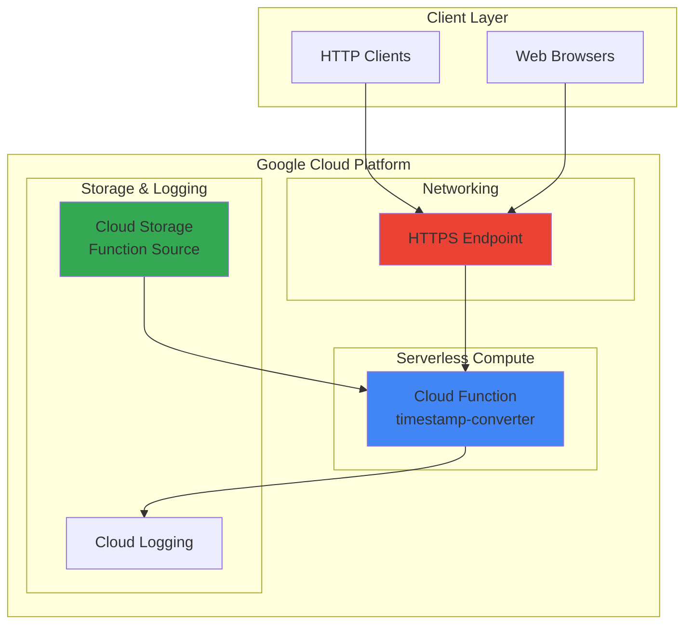

# Timestamp Converter API with Cloud Functions

## Problem

Developers and system administrators frequently need to convert between Unix timestamps and human-readable dates when debugging applications, analyzing logs, or building integrations between systems. Manual conversion is time-consuming and error-prone, especially when dealing with different timezones and date formats across global applications.

## Solution

Build a serverless HTTP API using Google Cloud Functions that converts timestamps in real-time, supporting multiple timezones and formats. This approach eliminates infrastructure management while providing fast, scalable timestamp conversion services that automatically handle traffic spikes and scale to zero when unused.

## Architecture Diagram



## Prerequisites

1. Google Cloud account with billing enabled and Cloud Functions API access
2. Google Cloud CLI (gcloud) installed and configured
3. Basic knowledge of Python programming and HTTP APIs
4. Understanding of Unix timestamps and timezone concepts
5. Estimated cost: $0.00-$0.40 per month for 2 million requests (covered by free tier)

> **Note**: Cloud Functions includes 2 million invocations per month in the free tier, making this recipe cost-effective for learning and small-scale production use.

## Preparation

```bash
# Set environment variables for GCP resources
export PROJECT_ID="timestamp-converter-$(date +%s)"
export REGION="us-central1"
export FUNCTION_NAME="timestamp-converter"

# Generate unique suffix for resource names
RANDOM_SUFFIX=$(openssl rand -hex 3)
export BUCKET_NAME="timestamp-converter-source-${RANDOM_SUFFIX}"

# Create new project for this recipe
gcloud projects create ${PROJECT_ID} \
    --name="Timestamp Converter API"

# Set default project and region
gcloud config set project ${PROJECT_ID}
gcloud config set compute/region ${REGION}

# Enable required APIs
gcloud services enable cloudfunctions.googleapis.com
gcloud services enable cloudbuild.googleapis.com
gcloud services enable run.googleapis.com
gcloud services enable logging.googleapis.com

echo "✅ Project configured: ${PROJECT_ID}"
echo "✅ APIs enabled for Cloud Functions deployment"
```

## Steps

1. **Create Function Source Directory and Code**:

   Cloud Functions in Python use the Functions Framework to handle HTTP requests with Flask-like syntax. The framework automatically manages request routing, error handling, and response formatting, allowing developers to focus on business logic rather than infrastructure concerns.

   ```bash
   # Create function directory
   mkdir -p timestamp-converter-function
   cd timestamp-converter-function
   
   # Create main function file
   cat > main.py << 'EOF'
import functions_framework
from datetime import datetime
import pytz
import json
from flask import jsonify

@functions_framework.http
def timestamp_converter(request):
    """HTTP Cloud Function for timestamp conversion.
    
    Supports conversion between Unix timestamps and human-readable dates
    with timezone support and multiple output formats.
    """
    
    # Set CORS headers for web browser compatibility
    headers = {
        'Access-Control-Allow-Origin': '*',
        'Access-Control-Allow-Methods': 'GET, POST, OPTIONS',
        'Access-Control-Allow-Headers': 'Content-Type'
    }
    
    # Handle preflight OPTIONS request
    if request.method == 'OPTIONS':
        return ('', 204, headers)
    
    try:
        # Parse request parameters
        if request.method == 'GET':
            timestamp = request.args.get('timestamp')
            timezone = request.args.get('timezone', 'UTC')
            format_type = request.args.get('format', 'iso')
        else:
            request_json = request.get_json(silent=True)
            timestamp = request_json.get('timestamp') if request_json else None
            timezone = request_json.get('timezone', 'UTC') if request_json else 'UTC'
            format_type = request_json.get('format', 'iso') if request_json else 'iso'
        
        if not timestamp:
            return jsonify({
                'error': 'Missing timestamp parameter',
                'usage': 'GET /?timestamp=1609459200&timezone=UTC&format=iso'
            }), 400, headers
        
        # Convert timestamp
        if timestamp == 'now':
            dt = datetime.now(pytz.UTC)
            unix_timestamp = int(dt.timestamp())
        else:
            try:
                unix_timestamp = int(timestamp)
                dt = datetime.fromtimestamp(unix_timestamp, pytz.UTC)
            except ValueError:
                return jsonify({
                    'error': 'Invalid timestamp format',
                    'expected': 'Unix timestamp (seconds since epoch) or "now"'
                }), 400, headers
        
        # Apply timezone conversion
        try:
            target_tz = pytz.timezone(timezone)
            dt_local = dt.astimezone(target_tz)
        except pytz.exceptions.UnknownTimeZoneError:
            return jsonify({
                'error': f'Invalid timezone: {timezone}',
                'suggestion': 'Use timezone names like UTC, US/Eastern, Europe/London'
            }), 400, headers
        
        # Format output
        formats = {
            'iso': dt_local.isoformat(),
            'rfc': dt_local.strftime('%a, %d %b %Y %H:%M:%S %z'),
            'human': dt_local.strftime('%Y-%m-%d %H:%M:%S %Z'),
            'date': dt_local.strftime('%Y-%m-%d'),
            'time': dt_local.strftime('%H:%M:%S %Z')
        }
        
        response = {
            'unix_timestamp': unix_timestamp,
            'timezone': timezone,
            'formatted': {
                'iso': formats['iso'],
                'rfc': formats['rfc'],
                'human': formats['human'],
                'date': formats['date'],
                'time': formats['time']
            },
            'requested_format': formats.get(format_type, formats['iso'])
        }
        
        return jsonify(response), 200, headers
        
    except Exception as e:
        return jsonify({
            'error': 'Internal server error',
            'message': str(e)
        }), 500, headers

EOF
   
   echo "✅ Main function code created with comprehensive error handling"
   ```

   The function implements robust timestamp conversion with timezone support, multiple output formats, and proper error handling. The Functions Framework handles HTTP routing while the business logic focuses on accurate datetime calculations and user-friendly response formatting.

2. **Create Requirements File**:

   Python Cloud Functions require explicit dependency declaration to ensure consistent runtime environments and reproducible deployments. The requirements.txt file specifies exact versions for predictable behavior across development, testing, and production environments.

   ```bash
   # Create requirements file with necessary dependencies
   cat > requirements.txt << 'EOF'
functions-framework==3.*
pytz==2024.*
EOF
   
   echo "✅ Requirements file created with pinned versions"
   ```

   These dependencies provide the Functions Framework for HTTP handling and pytz for accurate timezone conversions. The Functions Framework automatically includes Flask for request parsing, so it doesn't need to be explicitly declared. Version pinning ensures stability while allowing minor updates for security patches.

3. **Deploy Cloud Function with HTTP Trigger**:

   Cloud Run functions (2nd generation) provides improved performance, concurrent request handling, and better integration with Cloud Run. The `gcloud run deploy` command with the `--function` flag automatically builds a container image using buildpacks and configures HTTP routing, eliminating manual infrastructure setup.

   ```bash
   # Deploy function using gcloud run deploy (2nd generation)
   gcloud run deploy ${FUNCTION_NAME} \
       --source . \
       --function timestamp_converter \
       --base-image python312 \
       --region ${REGION} \
       --allow-unauthenticated \
       --memory 256Mi \
       --timeout 60s \
       --max-instances 10
   
   # Get the function URL
   FUNCTION_URL=$(gcloud run services describe ${FUNCTION_NAME} \
       --region=${REGION} \
       --format="value(status.url)")
   
   echo "✅ Cloud Function deployed successfully"
   echo "Function URL: ${FUNCTION_URL}"
   ```

   The function now runs on Google's managed Cloud Run platform with automatic scaling, built-in monitoring, and global load balancing. The 2nd generation architecture supports concurrent requests and faster cold starts compared to 1st generation Cloud Functions, with improved resource efficiency and cost optimization.

4. **Create Cloud Storage Bucket for Function Source Backup**:

   Cloud Storage provides durable, versioned storage for function source code, enabling rollback capabilities and source code auditing. This backup strategy supports disaster recovery and enables collaborative development workflows with version control integration.

   ```bash
   # Create storage bucket for source code backup
   gsutil mb -p ${PROJECT_ID} \
       -c STANDARD \
       -l ${REGION} \
       gs://${BUCKET_NAME}
   
   # Enable versioning for source code history
   gsutil versioning set on gs://${BUCKET_NAME}
   
   # Upload function source code
   tar -czf function-source.tar.gz *.py *.txt
   gsutil cp function-source.tar.gz gs://${BUCKET_NAME}/
   
   echo "✅ Source code backed up to Cloud Storage"
   echo "Bucket: gs://${BUCKET_NAME}"
   ```

   The versioned storage bucket now contains the complete function source code with history tracking, supporting development best practices and enabling reliable deployments from stored artifacts.

## Validation & Testing

1. **Test Basic Timestamp Conversion**:

   ```bash
   # Test current timestamp conversion
   curl "${FUNCTION_URL}/?timestamp=now&timezone=UTC&format=human"
   ```

   Expected output:
   ```json
   {
     "unix_timestamp": 1641024000,
     "timezone": "UTC", 
     "formatted": {
       "iso": "2022-01-01T12:00:00+00:00",
       "rfc": "Sat, 01 Jan 2022 12:00:00 +0000",
       "human": "2022-01-01 12:00:00 UTC",
       "date": "2022-01-01",
       "time": "12:00:00 UTC"
     },
     "requested_format": "2022-01-01 12:00:00 UTC"
   }
   ```

2. **Test Timezone Conversion**:

   ```bash
   # Test specific timestamp with timezone conversion
   curl "${FUNCTION_URL}/?timestamp=1609459200&timezone=US/Eastern&format=iso"
   ```

   Expected output showing New Year 2021 in Eastern Time:
   ```json
   {
     "unix_timestamp": 1609459200,
     "timezone": "US/Eastern",
     "requested_format": "2021-01-01T00:00:00-05:00"
   }
   ```

3. **Test Error Handling**:

   ```bash
   # Test invalid timestamp
   curl "${FUNCTION_URL}/?timestamp=invalid"
   
   # Test invalid timezone
   curl "${FUNCTION_URL}/?timestamp=1609459200&timezone=Invalid/Zone"
   ```

   Both requests should return appropriate error messages with 400 status codes.

4. **Verify Function Logging**:

   ```bash
   # Check function logs
   gcloud logging read "resource.type=cloud_run_revision AND resource.labels.service_name=${FUNCTION_NAME}" \
       --limit=10 \
       --format="table(timestamp,severity,textPayload)"
   ```

## Cleanup

1. **Delete Cloud Function**:

   ```bash
   # Delete the Cloud Run service (2nd gen function)
   gcloud run services delete ${FUNCTION_NAME} \
       --region=${REGION} \
       --quiet
   
   echo "✅ Cloud Function deleted"
   ```

2. **Remove Cloud Storage Bucket**:

   ```bash
   # Delete bucket contents and bucket
   gsutil -m rm -r gs://${BUCKET_NAME}
   
   echo "✅ Storage bucket deleted"
   ```

3. **Delete Project Resources**:

   ```bash
   # Delete the entire project (optional)
   # This removes all resources and stops billing
   gcloud projects delete ${PROJECT_ID} --quiet
   
   # Or disable APIs to stop potential charges
   gcloud services disable cloudfunctions.googleapis.com
   gcloud services disable cloudbuild.googleapis.com
   gcloud services disable run.googleapis.com
   
   echo "✅ Project resources cleaned up"
   echo "Note: Project deletion may take several minutes to complete"
   ```

## Discussion

This serverless timestamp conversion API demonstrates the power of Google Cloud Functions for building lightweight, scalable microservices. The implementation leverages Python's robust datetime handling capabilities with the pytz library for accurate timezone conversions, ensuring precise results across global time zones and daylight saving time transitions.

The choice of Cloud Functions 2nd generation provides significant advantages over traditional server-based APIs. The serverless architecture automatically scales from zero to handle traffic spikes, charges only for actual usage, and eliminates infrastructure maintenance overhead. The Functions Framework abstraction simplifies HTTP request handling while maintaining compatibility with Flask patterns familiar to Python developers.

Cloud Storage integration provides enterprise-grade source code management with versioning capabilities, supporting collaborative development and reliable rollback procedures. The combination creates a production-ready API that can handle millions of requests while maintaining cost efficiency through Google's pay-per-use pricing model.

The API design follows REST principles with comprehensive error handling, CORS support for web applications, and multiple response formats to accommodate different client requirements. This flexibility makes the service suitable for various use cases, from debugging tools to production application integrations.

> **Tip**: Monitor function performance using Cloud Monitoring to optimize memory allocation and identify scaling patterns. Consider implementing request caching for frequently accessed timestamps to reduce latency and costs.

> **Note**: This recipe uses Cloud Run functions (2nd generation) which automatically scales to zero when unused, making it extremely cost-effective for intermittent workloads.

**Documentation References:**
- [Cloud Run Functions Best Practices](https://cloud.google.com/run/docs/tips/functions-best-practices)
- [Python Functions Framework Documentation](https://github.com/GoogleCloudPlatform/functions-framework-python)
- [Deploy Cloud Run Functions](https://cloud.google.com/run/docs/deploy-functions)
- [Cloud Run Functions Runtime Support](https://cloud.google.com/functions/docs/runtime-support)
- [Google Cloud Architecture Framework](https://cloud.google.com/architecture/framework)
- [Cloud Run Functions Pricing](https://cloud.google.com/functions/pricing)

## Challenge

Extend this solution by implementing these enhancements:

1. **Add Rate Limiting**: Implement request rate limiting using Cloud Endpoints or API Gateway to prevent abuse while maintaining performance for legitimate users.

2. **Batch Processing**: Add support for converting multiple timestamps in a single request, optimizing for applications that need to process timestamp arrays efficiently.

3. **Caching Layer**: Integrate Cloud Memorystore (Redis) to cache frequently requested timestamp conversions, reducing function execution time and costs for popular queries.

4. **Authentication Integration**: Implement Firebase Authentication or Google Identity to secure the API while maintaining ease of use for authorized applications.

5. **Advanced Formatting**: Add support for custom date formats, localization with different languages, and business calendar calculations (working days, holidays) for enterprise applications.

## Infrastructure Code

*Infrastructure code will be generated after recipe approval.*