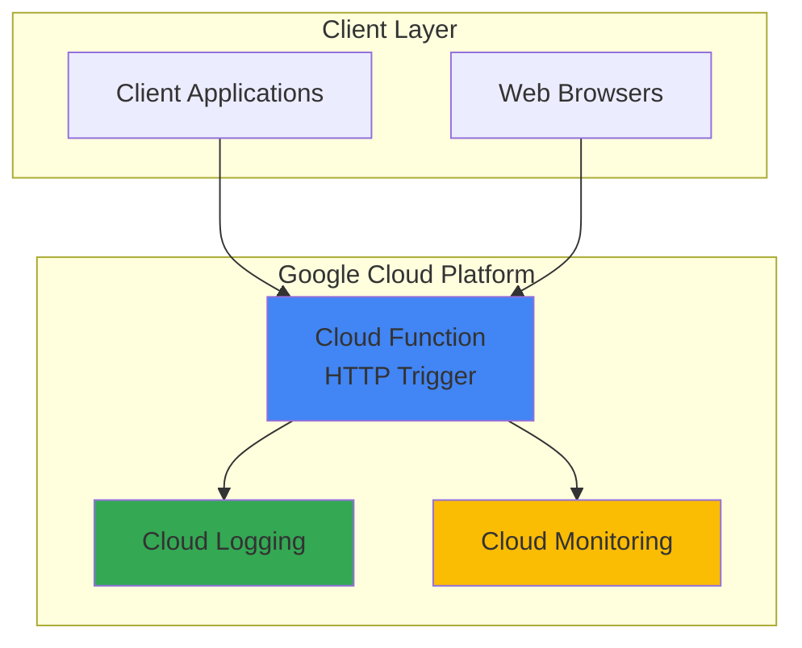

# Time Zone Converter API with Cloud Functions

## Problem

Global teams and businesses struggle with coordinating across multiple time zones, leading to scheduling conflicts and miscommunication. Manually converting times between different zones is error-prone and time-consuming, especially when handling daylight saving time transitions. Existing solutions often require complex installations or paid subscriptions, making them inaccessible for simple integration needs.

## Solution

Build a lightweight serverless API using Google Cloud Functions that automatically converts timestamps between any two time zones. The function leverages Python's built-in `zoneinfo` module for accurate timezone calculations, provides instant scaling without infrastructure management, and offers a simple HTTP endpoint for easy integration into applications and workflows.

## Architecture Diagram



## Prerequisites

1. Google Cloud Platform account with billing enabled
2. Cloud SDK (gcloud) installed and authenticated
3. Basic knowledge of Python and HTTP APIs
4. Cloud Functions API enabled in your project
5. Estimated cost: $0.00-$0.50 per month for light usage (first 2 million requests free)

> **Note**: Cloud Functions provides generous free tier limits, making this solution cost-effective for most use cases.

## Preparation

```bash
# Set environment variables for GCP resources
export PROJECT_ID="timezone-api-$(date +%s)"
export REGION="us-central1"
export FUNCTION_NAME="timezone-converter"

# Generate unique suffix for resource names
RANDOM_SUFFIX=$(openssl rand -hex 3)

# Create new project (optional, or use existing)
gcloud projects create ${PROJECT_ID} \
    --name="Timezone Converter API"

# Set default project and region
gcloud config set project ${PROJECT_ID}
gcloud config set compute/region ${REGION}

# Enable required APIs
gcloud services enable cloudfunctions.googleapis.com
gcloud services enable cloudbuild.googleapis.com

echo "✅ Project configured: ${PROJECT_ID}"
```

## Steps

1. **Create the Python Function Code**:

   Cloud Functions supports multiple programming languages, with Python being ideal for date/time operations due to its robust standard library. The `zoneinfo` module provides access to the IANA Time Zone Database, ensuring accurate timezone conversions including daylight saving time transitions and historical timezone changes.

   ```bash
   # Create project directory
   mkdir timezone-converter-function
   cd timezone-converter-function
   
   # Create main function file
   cat > main.py << 'EOF'
   import json
   from datetime import datetime
   from zoneinfo import ZoneInfo, available_timezones
   import functions_framework
   
   @functions_framework.http
   def convert_timezone(request):
       """Convert time between timezones via HTTP request."""
       
       # Handle CORS for web browsers
       if request.method == 'OPTIONS':
           headers = {
               'Access-Control-Allow-Origin': '*',
               'Access-Control-Allow-Methods': 'GET, POST',
               'Access-Control-Allow-Headers': 'Content-Type',
               'Access-Control-Max-Age': '3600'
           }
           return ('', 204, headers)
       
       headers = {'Access-Control-Allow-Origin': '*'}
       
       try:
           # Get request parameters
           if request.method == 'POST':
               request_json = request.get_json(silent=True)
               if not request_json:
                   return json.dumps({'error': 'Invalid JSON'}), 400, headers
               
               timestamp = request_json.get('timestamp')
               from_tz = request_json.get('from_timezone', 'UTC')
               to_tz = request_json.get('to_timezone', 'UTC')
           else:  # GET request
               timestamp = request.args.get('timestamp')
               from_tz = request.args.get('from_timezone', 'UTC')
               to_tz = request.args.get('to_timezone', 'UTC')
           
           # Validate timezone names
           available_zones = available_timezones()
           if from_tz not in available_zones:
               return json.dumps({'error': f'Invalid from_timezone: {from_tz}'}), 400, headers
           if to_tz not in available_zones:
               return json.dumps({'error': f'Invalid to_timezone: {to_tz}'}), 400, headers
           
           # Parse timestamp (support multiple formats)
           if timestamp:
               try:
                   # Try ISO format first
                   dt = datetime.fromisoformat(timestamp.replace('Z', '+00:00'))
                   if dt.tzinfo is None:
                       dt = dt.replace(tzinfo=ZoneInfo(from_tz))
               except ValueError:
                   try:
                       # Try Unix timestamp
                       dt = datetime.fromtimestamp(float(timestamp), tz=ZoneInfo(from_tz))
                   except (ValueError, OSError):
                       return json.dumps({'error': 'Invalid timestamp format'}), 400, headers
           else:
               # Use current time if no timestamp provided
               dt = datetime.now(tz=ZoneInfo(from_tz))
           
           # Convert timezone
           converted_dt = dt.astimezone(ZoneInfo(to_tz))
           
           # Prepare response
           response = {
               'original': {
                   'timestamp': dt.isoformat(),
                   'timezone': from_tz,
                   'timezone_name': dt.tzname()
               },
               'converted': {
                   'timestamp': converted_dt.isoformat(),
                   'timezone': to_tz,
                   'timezone_name': converted_dt.tzname()
               },
               'offset_hours': (converted_dt.utcoffset() - dt.utcoffset()).total_seconds() / 3600
           }
           
           return json.dumps(response, indent=2), 200, headers
           
       except Exception as e:
           return json.dumps({'error': str(e)}), 500, headers
   EOF
   
   echo "✅ Function code created successfully"
   ```

2. **Create Requirements File**:

   Cloud Functions automatically installs dependencies listed in `requirements.txt`. The `functions-framework` package enables local testing and HTTP request handling, while Python's built-in `zoneinfo` module provides timezone data without additional dependencies.

   ```bash
   # Create requirements file
   cat > requirements.txt << 'EOF'
   functions-framework==3.*
   EOF
   
   echo "✅ Requirements file created"
   ```

3. **Test Function Locally** (Optional):

   Local testing with the Functions Framework allows rapid development iteration without deployment delays. This step validates the function logic and helps identify issues before cloud deployment, saving time and providing immediate feedback on code changes.

   ```bash
   # Install dependencies locally for testing
   pip install -r requirements.txt
   
   # Start local development server
   functions-framework --target=convert_timezone --debug &
   SERVER_PID=$!
   
   # Wait for server to start
   sleep 3
   
   # Test the function locally
   curl -X POST "http://localhost:8080" \
     -H "Content-Type: application/json" \
     -d '{"timestamp": "2024-01-15T10:00:00", "from_timezone": "America/New_York", "to_timezone": "Europe/London"}'
   
   # Stop local server
   kill $SERVER_PID
   
   echo "✅ Local testing completed"
   ```

4. **Deploy Function to Cloud Functions**:

   Cloud Functions deployment automatically packages your code, installs dependencies, and creates an HTTPS endpoint. The `--allow-unauthenticated` flag enables public access, while `--memory` and `--timeout` settings optimize performance for timezone calculations. Using Python 3.12 runtime provides the latest language features and performance improvements.

   ```bash
   # Deploy function to Google Cloud
   gcloud functions deploy ${FUNCTION_NAME} \
     --gen2 \
     --runtime python312 \
     --trigger-http \
     --entry-point convert_timezone \
     --source . \
     --region ${REGION} \
     --memory 256MB \
     --timeout 60s \
     --allow-unauthenticated
   
   # Get function URL
   FUNCTION_URL=$(gcloud functions describe ${FUNCTION_NAME} \
     --gen2 \
     --region ${REGION} \
     --format="value(serviceConfig.uri)")
   
   echo "✅ Function deployed successfully"
   echo "Function URL: ${FUNCTION_URL}"
   ```

5. **Configure Function Permissions**:

   Proper IAM configuration ensures your function can be accessed by intended users while maintaining security. The `allUsers` principal enables public API access, suitable for timezone conversion services that don't handle sensitive data.

   ```bash
   # Verify function permissions (should already be set with --allow-unauthenticated)
   gcloud functions get-iam-policy ${FUNCTION_NAME} \
     --gen2 \
     --region ${REGION}
   
   # If needed, manually add public access
   gcloud functions add-iam-policy-binding ${FUNCTION_NAME} \
     --gen2 \
     --region ${REGION} \
     --member="allUsers" \
     --role="roles/cloudfunctions.invoker"
   
   echo "✅ Function permissions configured"
   ```

## Validation & Testing

1. **Test with GET Request**:

   ```bash
   # Test basic GET request with query parameters
   curl "${FUNCTION_URL}?timestamp=2024-06-15T14:30:00&from_timezone=America/Los_Angeles&to_timezone=Asia/Tokyo"
   ```

   Expected output:
   ```json
   {
     "original": {
       "timestamp": "2024-06-15T14:30:00-07:00",
       "timezone": "America/Los_Angeles",
       "timezone_name": "PDT"
     },
     "converted": {
       "timestamp": "2024-06-16T06:30:00+09:00",
       "timezone": "Asia/Tokyo",
       "timezone_name": "JST"
     },
     "offset_hours": 16.0
   }
   ```

2. **Test with POST Request**:

   ```bash
   # Test POST request with JSON payload
   curl -X POST "${FUNCTION_URL}" \
     -H "Content-Type: application/json" \
     -d '{
       "timestamp": "2024-12-25T12:00:00",
       "from_timezone": "UTC",
       "to_timezone": "Australia/Sydney"
     }'
   ```

3. **Test Current Time Conversion**:

   ```bash
   # Test without timestamp (uses current time)
   curl "${FUNCTION_URL}?from_timezone=UTC&to_timezone=America/New_York"
   ```

4. **Test Error Handling**:

   ```bash
   # Test invalid timezone
   curl "${FUNCTION_URL}?from_timezone=Invalid/Zone&to_timezone=UTC"
   ```

## Cleanup

1. **Delete Cloud Function**:

   ```bash
   # Delete the deployed function
   gcloud functions delete ${FUNCTION_NAME} \
     --gen2 \
     --region ${REGION} \
     --quiet
   
   echo "✅ Function deleted successfully"
   ```

2. **Clean Up Local Files**:

   ```bash
   # Remove local project directory
   cd ..
   rm -rf timezone-converter-function
   
   echo "✅ Local files cleaned up"
   ```

3. **Delete Project** (Optional):

   ```bash
   # Delete entire project if created specifically for this recipe
   gcloud projects delete ${PROJECT_ID} --quiet
   
   echo "✅ Project deletion initiated"
   echo "Note: Project deletion may take several minutes to complete"
   ```

## Discussion

Google Cloud Functions provides an ideal platform for building lightweight APIs like this timezone converter. The serverless architecture automatically scales from zero to millions of requests without infrastructure management, while the pay-per-invocation pricing model makes it cost-effective for applications with variable usage patterns. The 2nd generation Cloud Functions offer improved performance, better resource allocation, and enhanced observability compared to the original version.

The implementation leverages Python's modern `zoneinfo` module, introduced in Python 3.9 as part of [PEP 615](https://peps.python.org/pep-0615/). This module provides access to the IANA Time Zone Database, ensuring accurate timezone conversions that account for daylight saving time transitions and historical timezone changes. Unlike older approaches using `pytz`, `zoneinfo` follows the standard library's datetime model more closely and provides better integration with the `datetime.astimezone()` method.

The function architecture follows RESTful principles by supporting both GET and POST requests, making it accessible from web browsers via URL parameters or from applications via JSON payloads. CORS headers enable direct browser access, while comprehensive error handling ensures robust operation across different input formats and edge cases. The latest Functions Framework version 3.x provides enhanced security updates and improved performance characteristics.

Cloud Functions' integration with Google Cloud's observability stack provides automatic logging through [Cloud Logging](https://cloud.google.com/logging/docs) and monitoring through [Cloud Monitoring](https://cloud.google.com/monitoring/docs). This enables production-ready operation with built-in alerting, performance tracking, and debugging capabilities without additional configuration.

> **Tip**: Use Cloud Functions' built-in environment variables like `FUNCTION_NAME` and `FUNCTION_REGION` to make your code more portable across different deployments and regions.

## Challenge

Extend this solution by implementing these enhancements:

1. **Add batch conversion support** - Modify the function to accept arrays of timestamps for bulk processing, improving efficiency for applications converting multiple times simultaneously.

2. **Implement caching with Cloud Memorystore** - Add Redis caching for frequently requested timezone conversions to reduce computation time and function invocations.

3. **Create a web interface** - Build a simple HTML/JavaScript frontend hosted on Cloud Storage with CDN distribution via Cloud CDN, providing a user-friendly interface for the API.

4. **Add scheduling features** - Extend the API to suggest optimal meeting times across multiple timezones, incorporating business hours and holiday calendars for different regions.

5. **Implement rate limiting** - Use Cloud Endpoints or API Gateway to add authentication, rate limiting, and API key management for production usage.

## Infrastructure Code

*Infrastructure code will be generated after recipe approval.*