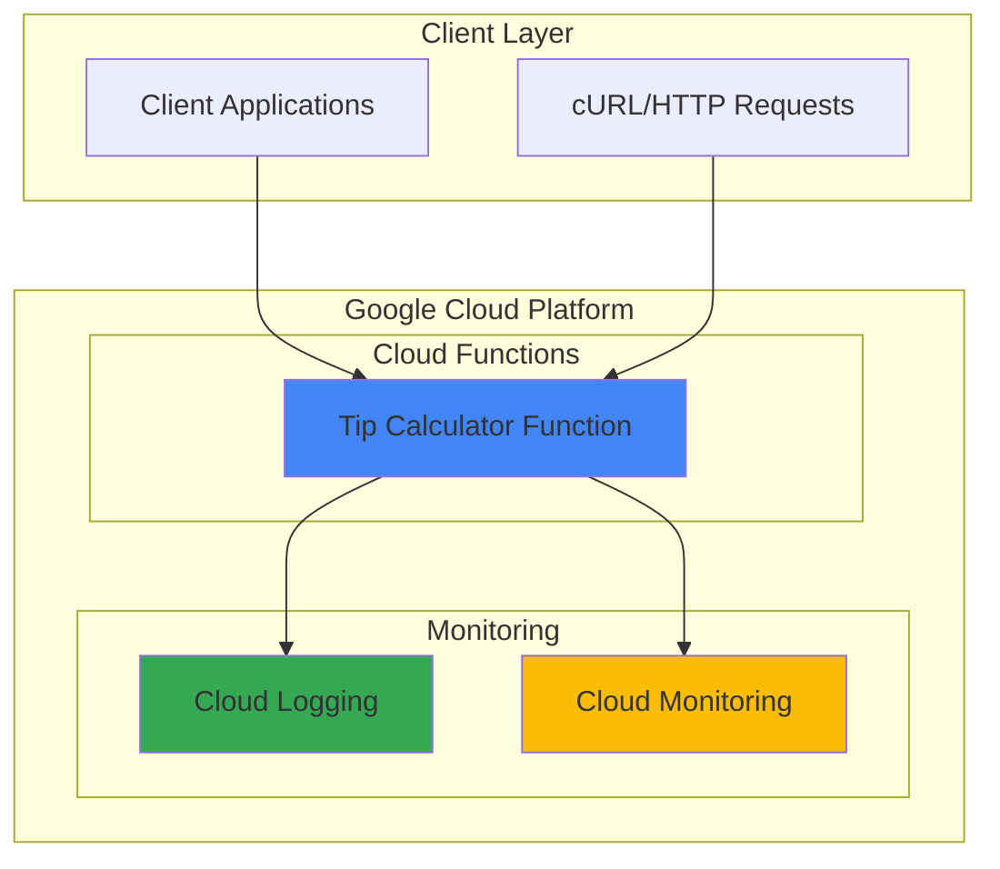

# Tip Calculator API with Cloud Functions

## Problem

Restaurant patrons and service industry workers need a quick way to calculate tips and split bills among multiple people. Manual calculations are error-prone and time-consuming, especially when splitting complex bills with different tip percentages and varying party sizes. Without an accessible API, applications cannot integrate tip calculation functionality efficiently.

## Solution

Build a serverless HTTP API using Google Cloud Functions that provides instant tip calculations and bill splitting capabilities. The Cloud Functions service automatically scales based on demand, handles all infrastructure management, and provides secure HTTP endpoints accessible from any application or web interface.

## Architecture Diagram



## Prerequisites

1. Google Cloud Platform account with billing enabled 
2. gcloud CLI installed and configured
3. Basic understanding of HTTP APIs and JSON
4. Python programming knowledge (beginner level)
5. Estimated cost: $0.00 - stays within Google Cloud's free tier (2 million invocations per month)

> **Note**: Cloud Functions provides 2 million free invocations per month, making this recipe cost-free for typical usage. View current pricing at [Google Cloud Functions pricing](https://cloud.google.com/functions/pricing).

## Preparation

```bash
# Set environment variables for GCP resources
export PROJECT_ID="tip-calc-$(date +%s)"
export REGION="us-central1"
export FUNCTION_NAME="tip-calculator"

# Generate unique suffix for resource names
RANDOM_SUFFIX=$(openssl rand -hex 3)

# Create new project (optional - can use existing project)
gcloud projects create ${PROJECT_ID} \
    --name="Tip Calculator API"

# Set default project and region
gcloud config set project ${PROJECT_ID}
gcloud config set compute/region ${REGION}

# Enable required APIs for Cloud Functions
gcloud services enable \
    artifactregistry.googleapis.com \
    cloudbuild.googleapis.com \
    cloudfunctions.googleapis.com \
    run.googleapis.com \
    logging.googleapis.com

echo "✅ Project configured: ${PROJECT_ID}"
echo "✅ Region set to: ${REGION}"
```

## Steps

1. **Create the Python Function Code**:

   Google Cloud Functions supports multiple programming languages, with Python being ideal for mathematical calculations due to its simplicity and extensive libraries. The Functions Framework automatically handles HTTP request parsing and response formatting, allowing developers to focus on business logic rather than infrastructure concerns.

   ```bash
   # Create project directory
   mkdir tip-calculator-function && cd tip-calculator-function
   
   # Create the main function file
   cat > main.py << 'EOF'
import json
from flask import Request
import functions_framework

@functions_framework.http
def calculate_tip(request: Request):
    """
    Calculate tip amounts and split bills among multiple people.
    
    Request JSON format:
    {
        "bill_amount": 100.00,
        "tip_percentage": 18,
        "number_of_people": 4
    }
    """
    
    # Set CORS headers for web applications
    headers = {
        'Access-Control-Allow-Origin': '*',
        'Access-Control-Allow-Methods': 'GET, POST, OPTIONS',
        'Access-Control-Allow-Headers': 'Content-Type'
    }
    
    # Handle preflight OPTIONS request
    if request.method == 'OPTIONS':
        return ('', 204, headers)
    
    try:
        # Parse request data
        if request.method == 'GET':
            bill_amount = float(request.args.get('bill_amount', 0))
            tip_percentage = float(request.args.get('tip_percentage', 15))
            number_of_people = int(request.args.get('number_of_people', 1))
        else:  # POST request
            request_json = request.get_json(silent=True)
            if not request_json:
                return (json.dumps({'error': 'No JSON data provided'}), 400, headers)
            
            bill_amount = float(request_json.get('bill_amount', 0))
            tip_percentage = float(request_json.get('tip_percentage', 15))
            number_of_people = int(request_json.get('number_of_people', 1))
        
        # Validate input parameters
        if bill_amount <= 0:
            return (json.dumps({'error': 'Bill amount must be greater than 0'}), 400, headers)
        
        if tip_percentage < 0 or tip_percentage > 100:
            return (json.dumps({'error': 'Tip percentage must be between 0 and 100'}), 400, headers)
        
        if number_of_people <= 0:
            return (json.dumps({'error': 'Number of people must be greater than 0'}), 400, headers)
        
        # Calculate tip and totals
        tip_amount = bill_amount * (tip_percentage / 100)
        total_amount = bill_amount + tip_amount
        per_person_bill = bill_amount / number_of_people
        per_person_tip = tip_amount / number_of_people
        per_person_total = total_amount / number_of_people
        
        # Prepare response
        response_data = {
            'input': {
                'bill_amount': round(bill_amount, 2),
                'tip_percentage': tip_percentage,
                'number_of_people': number_of_people
            },
            'calculations': {
                'tip_amount': round(tip_amount, 2),
                'total_amount': round(total_amount, 2),
                'per_person': {
                    'bill_share': round(per_person_bill, 2),
                    'tip_share': round(per_person_tip, 2),
                    'total_share': round(per_person_total, 2)
                }
            },
            'formatted_summary': f"Bill: ${bill_amount:.2f} | Tip ({tip_percentage}%): ${tip_amount:.2f} | Total: ${total_amount:.2f} | Per person: ${per_person_total:.2f}"
        }
        
        return (json.dumps(response_data, indent=2), 200, headers)
        
    except ValueError as e:
        return (json.dumps({'error': f'Invalid input: {str(e)}'}), 400, headers)
    except Exception as e:
        return (json.dumps({'error': f'Internal error: {str(e)}'}), 500, headers)
EOF
   
   echo "✅ Function code created in main.py"
   ```

   This function implements comprehensive tip calculation logic with input validation, error handling, and CORS support for web applications. The Functions Framework decorator automatically handles HTTP request parsing and provides a Flask Request object for easy data access.

2. **Create Requirements File**:

   The requirements.txt file specifies Python dependencies needed for the function. Cloud Functions automatically installs these dependencies during deployment, ensuring the runtime environment has all necessary packages.

   ```bash
   # Create requirements file with current dependencies
   cat > requirements.txt << 'EOF'
functions-framework==3.*
flask>=2.0.0
EOF
   
   echo "✅ Requirements file created"
   ```

3. **Test Function Locally**:

   Local testing with the Functions Framework allows developers to verify functionality before deployment. This development workflow reduces deployment cycles and enables rapid iteration during development.

   ```bash
   # Install dependencies locally for testing
   pip install -r requirements.txt
   
   # Start local development server
   functions-framework --target=calculate_tip \
       --debug &
   LOCAL_PID=$!
   
   # Wait for server to start
   sleep 3
   
   echo "✅ Local function server started on port 8080"
   ```

4. **Deploy to Cloud Functions**:

   Google Cloud Functions deployment automatically builds the function from source code, creating a managed container environment that scales based on incoming requests. The deployment process includes building dependencies, creating the runtime environment, and exposing the HTTP endpoint.

   ```bash
   # Deploy function with HTTP trigger using current Python runtime
   gcloud functions deploy ${FUNCTION_NAME} \
       --runtime python312 \
       --trigger-http \
       --allow-unauthenticated \
       --source . \
       --entry-point calculate_tip \
       --region ${REGION} \
       --memory 256MB \
       --timeout 60s
   
   # Get function URL
   FUNCTION_URL=$(gcloud functions describe ${FUNCTION_NAME} \
       --region ${REGION} \
       --format="value(httpsTrigger.url)")
   
   echo "✅ Function deployed successfully"
   echo "Function URL: ${FUNCTION_URL}"
   ```

   The function is now deployed with automatic scaling, built-in security, and global availability through Google's edge network. The `--allow-unauthenticated` flag enables public access for this demonstration API.

5. **Configure Function Settings**:

   Cloud Functions provides various configuration options to optimize performance, cost, and reliability. These settings can be adjusted based on expected traffic patterns and performance requirements.

   ```bash
   # Set function description and labels for organization
   gcloud functions deploy ${FUNCTION_NAME} \
       --update-labels environment=demo,type=calculator \
       --description "Serverless tip calculator API for restaurant bills" \
       --region ${REGION}
   
   # Stop local development server
   kill $LOCAL_PID 2>/dev/null || true
   
   echo "✅ Function configuration updated"
   ```

## Validation & Testing

1. **Test Basic Tip Calculation**:

   ```bash
   # Test with GET request parameters
   curl "${FUNCTION_URL}?bill_amount=100&tip_percentage=18&number_of_people=4" \
       -H "Content-Type: application/json"
   ```

   Expected output:
   ```json
   {
     "input": {
       "bill_amount": 100.0,
       "tip_percentage": 18.0,
       "number_of_people": 4
     },
     "calculations": {
       "tip_amount": 18.0,
       "total_amount": 118.0,
       "per_person": {
         "bill_share": 25.0,
         "tip_share": 4.5,
         "total_share": 29.5
       }
     },
     "formatted_summary": "Bill: $100.00 | Tip (18%): $18.00 | Total: $118.00 | Per person: $29.50"
   }
   ```

2. **Test with POST Request**:

   ```bash
   # Create test data file
   cat > test_data.json << 'EOF'
   {
     "bill_amount": 87.45,
     "tip_percentage": 20,
     "number_of_people": 3
   }
   EOF
   
   # Test with POST request
   curl -X POST "${FUNCTION_URL}" \
       -H "Content-Type: application/json" \
       -d @test_data.json
   ```

3. **Test Error Handling**:

   ```bash
   # Test invalid input
   curl "${FUNCTION_URL}?bill_amount=-50&tip_percentage=15" \
       -H "Content-Type: application/json"
   
   # Should return error message about negative bill amount
   ```

4. **Verify Function Metrics**:

   ```bash
   # Check function status and metrics
   gcloud functions describe ${FUNCTION_NAME} \
       --region ${REGION} \
       --format="table(status,timeout,availableMemoryMb)"
   
   echo "✅ Function is active and responding to requests"
   ```

## Cleanup

1. **Delete Cloud Function**:

   ```bash
   # Delete the deployed function
   gcloud functions delete ${FUNCTION_NAME} \
       --region ${REGION} \
       --quiet
   
   echo "✅ Cloud Function deleted"
   ```

2. **Clean up Local Files**:

   ```bash
   # Remove local project files
   cd .. && rm -rf tip-calculator-function
   rm -f test_data.json
   
   echo "✅ Local files cleaned up"
   ```

3. **Delete Project (Optional)**:

   ```bash
   # Delete entire project if created specifically for this recipe
   gcloud projects delete ${PROJECT_ID} --quiet
   
   echo "✅ Project deleted (if created for this recipe)"
   echo "Note: Project deletion may take several minutes to complete"
   ```

## Discussion

Google Cloud Functions provides an ideal serverless platform for building lightweight APIs like this tip calculator. The service automatically handles infrastructure provisioning, scaling, and maintenance, allowing developers to focus entirely on business logic. The Functions Framework ensures portability across different environments, from local development to production deployment, following Google Cloud's best practices for serverless development.

The tip calculator implementation demonstrates several Cloud Functions best practices, including comprehensive input validation, structured error handling, and CORS support for web integration. The function responds to both GET and POST requests, making it flexible for different client implementations. Mathematical calculations are performed with proper rounding to avoid floating-point precision issues common in financial applications.

Cloud Functions' pay-per-invocation pricing model makes it extremely cost-effective for APIs with variable or unpredictable traffic patterns. The service provides automatic scaling from zero to handle traffic spikes without pre-provisioning infrastructure. Built-in monitoring through [Cloud Logging](https://cloud.google.com/logging) and [Cloud Monitoring](https://cloud.google.com/monitoring) provides insights into function performance and usage patterns without additional configuration.

The serverless architecture eliminates many operational concerns like patch management, capacity planning, and high availability configuration. Google's global infrastructure ensures low-latency responses from edge locations worldwide, while built-in security features protect against common web vulnerabilities without manual security configuration. This approach aligns with the [Google Cloud Architecture Framework](https://cloud.google.com/architecture/framework) principles for building resilient, scalable applications.

> **Tip**: Use Cloud Functions for APIs that experience variable traffic patterns or need rapid development cycles. The serverless model excels when you want to focus on code rather than infrastructure management.

## Challenge

Extend this solution by implementing these enhancements:

1. **Add tax calculation support** - Include sales tax rates by state/region and calculate total amounts including tax and tip
2. **Implement bill item breakdown** - Accept itemized bills with individual prices and allow different tip percentages per item category
3. **Create a web interface** - Build a simple HTML frontend that calls the API and displays results in a user-friendly format
4. **Add user authentication** - Integrate with [Firebase Auth](https://firebase.google.com/docs/auth) to track user preferences and calculation history
5. **Implement advanced splitting options** - Support unequal bill splitting where different people pay different amounts based on what they ordered

## Infrastructure Code

*Infrastructure code will be generated after recipe approval.*