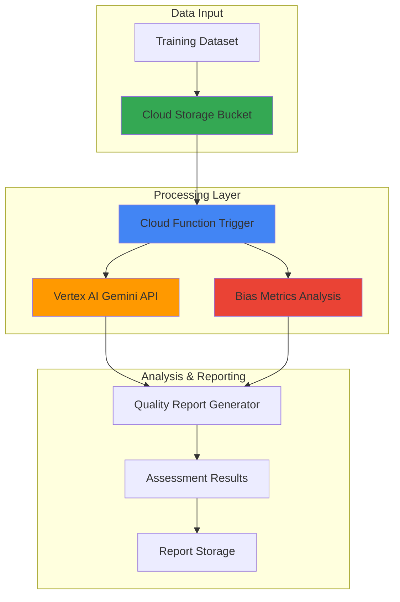

# Training Data Quality Assessment with Vertex AI and Functions

## Problem

Machine learning teams struggle with ensuring training data quality before model development, often discovering bias, inconsistencies, and data quality issues only after expensive training cycles. Manual data validation is time-consuming and prone to human oversight, while traditional statistical approaches miss subtle biases and content quality issues that can significantly impact model performance and fairness.

## Solution

Build an automated data quality assessment system using Vertex AI's Gemini models and bias detection capabilities integrated with Cloud Functions for serverless processing. This solution analyzes training datasets for quality issues, bias patterns, and content validation, generating comprehensive reports with actionable recommendations for data improvement.

## Architecture Diagram



## Prerequisites

1. Google Cloud account with billing enabled and appropriate permissions for Vertex AI and Cloud Functions
2. gcloud CLI installed and configured (or Cloud Shell access)
3. Basic understanding of machine learning data validation concepts
4. Python programming experience for Cloud Function development
5. Estimated cost: $15-25 for testing (includes Vertex AI API calls, Cloud Function execution, and storage)

> **Note**: Vertex AI Gemini API calls are the primary cost driver. Monitor usage during testing to control expenses.

## Preparation

```bash
# Set environment variables for GCP resources
export PROJECT_ID="data-quality-$(date +%s)"
export REGION="us-central1"
export ZONE="us-central1-a"

# Generate unique suffix for resource names
RANDOM_SUFFIX=$(openssl rand -hex 3)

# Set default project and region
gcloud config set project ${PROJECT_ID}
gcloud config set compute/region ${REGION}
gcloud config set compute/zone ${ZONE}

# Enable required APIs
gcloud services enable cloudfunctions.googleapis.com
gcloud services enable aiplatform.googleapis.com
gcloud services enable storage.googleapis.com
gcloud services enable cloudbuild.googleapis.com

# Create Cloud Storage bucket for data and reports
export BUCKET_NAME="training-data-quality-${RANDOM_SUFFIX}"
gsutil mb -p ${PROJECT_ID} -c STANDARD -l ${REGION} gs://${BUCKET_NAME}

# Enable versioning for data protection
gsutil versioning set on gs://${BUCKET_NAME}

echo "✅ Project configured: ${PROJECT_ID}"
echo "✅ Storage bucket created: gs://${BUCKET_NAME}"
```

## Steps

1. **Create Sample Training Dataset for Analysis**:

   Before implementing our quality assessment system, we'll create a representative training dataset that demonstrates common data quality issues found in real-world scenarios. This synthetic dataset will include intentional biases and quality problems that our Vertex AI-powered analysis can detect and report.

   ```bash
   # Create sample training data with bias and quality issues
   cat > sample_training_data.json << 'EOF'
   [
     {"text": "The software engineer completed the project efficiently", "label": "positive", "demographic": "male"},
     {"text": "She managed to finish the coding task adequately", "label": "neutral", "demographic": "female"},
     {"text": "The developer showed exceptional problem-solving skills", "label": "positive", "demographic": "male"},
     {"text": "The female programmer handled the assignment reasonably well", "label": "neutral", "demographic": "female"},
     {"text": "Outstanding technical leadership demonstrated throughout", "label": "positive", "demographic": "male"},
     {"text": "The code review was completed satisfactorily", "label": "neutral", "demographic": "female"},
     {"text": "Innovative solution developed with great expertise", "label": "positive", "demographic": "male"},
     {"text": "The documentation was prepared appropriately", "label": "neutral", "demographic": "female"},
     {"text": "Excellent debugging skills resolved complex issues", "label": "positive", "demographic": "male"},
     {"text": "Task completed according to basic requirements", "label": "neutral", "demographic": "female"}
   ]
   EOF
   
   # Upload sample data to Cloud Storage
   gsutil cp sample_training_data.json gs://${BUCKET_NAME}/datasets/
   
   echo "✅ Sample training dataset created with demographic bias patterns"
   ```

   This sample dataset intentionally exhibits gender bias where male-associated entries receive more positive labels and stronger descriptive language, while female-associated entries receive neutral labels with weaker language - exactly the type of bias our system will detect.

2. **Create Cloud Function for Data Quality Analysis**:

   Cloud Functions provides the serverless execution environment for our data quality assessment logic. This function will orchestrate calls to Vertex AI's Gemini models for content analysis and implement bias detection algorithms to evaluate training data comprehensively.

   ```bash
   # Create function directory and requirements
   mkdir -p data-quality-function
   cd data-quality-function
   
   cat > requirements.txt << 'EOF'
   google-cloud-aiplatform==1.102.0
   google-cloud-storage==2.18.0
   google-cloud-functions-framework==3.8.0
   pandas==2.2.3
   numpy==1.26.4
   scikit-learn==1.5.2
   google-genai==0.3.0
   EOF
   
   echo "✅ Function dependencies defined"
   ```

3. **Set up IAM Permissions for Cloud Function**:

   Cloud Functions requires proper Identity and Access Management (IAM) permissions to access Vertex AI and Cloud Storage services. This step configures the necessary service account permissions following Google Cloud's principle of least privilege.

   ```bash
   # Create a dedicated service account for the Cloud Function
   gcloud iam service-accounts create data-quality-function-sa \
       --display-name="Data Quality Analysis Function Service Account" \
       --description="Service account for data quality analysis function"
   
   # Grant necessary permissions for Vertex AI access
   gcloud projects add-iam-policy-binding ${PROJECT_ID} \
       --member="serviceAccount:data-quality-function-sa@${PROJECT_ID}.iam.gserviceaccount.com" \
       --role="roles/aiplatform.user"
   
   # Grant Cloud Storage permissions
   gcloud projects add-iam-policy-binding ${PROJECT_ID} \
       --member="serviceAccount:data-quality-function-sa@${PROJECT_ID}.iam.gserviceaccount.com" \
       --role="roles/storage.objectAdmin"
   
   echo "✅ IAM permissions configured for Cloud Function"
   ```

4. **Implement Bias Detection and Quality Assessment Logic**:

   The core analysis function combines Vertex AI's natural language understanding with statistical bias detection methods. This implementation follows Google Cloud's recommended patterns for ML fairness evaluation and incorporates Gemini's advanced reasoning capabilities for content quality assessment.

   ```bash
   cat > main.py << 'EOF'
   import json
   import pandas as pd
   import numpy as np
   from google.cloud import aiplatform
   from google.cloud import storage
   import google.genai as genai
   from sklearn.metrics import accuracy_score
   import re
   from collections import Counter, defaultdict
   import os
   
   def analyze_data_quality(request):
       """Cloud Function to analyze training data quality and bias."""
       
       # Initialize request data
       try:
           request_json = request.get_json()
           if not request_json:
               return {'error': 'No JSON payload provided'}, 400
       except Exception as e:
           return {'error': f'Invalid JSON payload: {str(e)}'}, 400
       
       # Extract parameters with defaults
       project_id = request_json.get('project_id')
       region = request_json.get('region', 'us-central1')
       bucket_name = request_json.get('bucket_name')
       dataset_path = request_json.get('dataset_path', 'datasets/sample_training_data.json')
       
       if not project_id or not bucket_name:
           return {'error': 'project_id and bucket_name are required'}, 400
       
       # Initialize Vertex AI with proper error handling
       try:
           aiplatform.init(project=project_id, location=region)
           genai.configure(project=project_id, location=region)
       except Exception as e:
           return {'error': f'Failed to initialize Vertex AI: {str(e)}'}, 500
       
       # Load dataset from Cloud Storage
       try:
           storage_client = storage.Client()
           bucket = storage_client.bucket(bucket_name)
           blob = bucket.blob(dataset_path)
           data_content = blob.download_as_text()
           dataset = json.loads(data_content)
       except Exception as e:
           return {'error': f'Failed to load dataset: {str(e)}'}, 500
       
       # Convert to DataFrame for analysis
       df = pd.DataFrame(dataset)
       
       # Initialize results
       quality_report = {
           'dataset_info': {
               'total_samples': len(df),
               'unique_labels': df['label'].unique().tolist(),
               'demographics': df['demographic'].unique().tolist() if 'demographic' in df.columns else []
           },
           'bias_analysis': {},
           'content_quality': {},
           'recommendations': []
       }
       
       # Bias Analysis using Vertex AI recommended metrics
       if 'demographic' in df.columns:
           bias_metrics = analyze_demographic_bias(df)
           quality_report['bias_analysis'] = bias_metrics
       
       # Content Quality Analysis using Gemini
       content_analysis = analyze_content_with_gemini(df, project_id, region)
       quality_report['content_quality'] = content_analysis
       
       # Generate recommendations
       recommendations = generate_recommendations(quality_report)
       quality_report['recommendations'] = recommendations
       
       # Save report to Cloud Storage
       try:
           report_blob = bucket.blob(f'reports/quality_report_{pd.Timestamp.now().strftime("%Y%m%d_%H%M%S")}.json')
           report_blob.upload_from_string(json.dumps(quality_report, indent=2))
       except Exception as e:
           return {'error': f'Failed to save report: {str(e)}'}, 500
       
       return {
           'status': 'success',
           'report_location': f'gs://{bucket_name}/reports/{report_blob.name}',
           'summary': {
               'total_samples': quality_report['dataset_info']['total_samples'],
               'bias_detected': len(quality_report['bias_analysis']) > 0,
               'content_issues': len(quality_report['content_quality'].get('issues', [])),
               'recommendations_count': len(quality_report['recommendations'])
           }
       }
   
   def analyze_demographic_bias(df):
       """Implement Vertex AI recommended bias detection metrics."""
       bias_results = {}
       
       # Difference in Population Size
       demo_counts = df['demographic'].value_counts()
       if len(demo_counts) >= 2:
           demo_1, demo_2 = demo_counts.index[:2]
           n1, n2 = demo_counts.iloc[0], demo_counts.iloc[1]
           pop_diff = (n1 - n2) / (n1 + n2)
           bias_results['population_difference'] = {
               'value': pop_diff,
               'interpretation': 'bias_favoring_' + demo_1 if pop_diff > 0.1 else 'balanced'
           }
       
       # Difference in Positive Proportions in True Labels (DPPTL)
       if 'label' in df.columns:
           positive_labels = ['positive']
           for demo in df['demographic'].unique():
               demo_data = df[df['demographic'] == demo]
               positive_prop = len(demo_data[demo_data['label'].isin(positive_labels)]) / len(demo_data)
               bias_results[f'{demo}_positive_proportion'] = positive_prop
           
           if len(df['demographic'].unique()) >= 2:
               props = [bias_results[f'{demo}_positive_proportion'] for demo in df['demographic'].unique()[:2]]
               dpptl = props[0] - props[1]
               bias_results['label_bias_dpptl'] = {
                   'value': dpptl,
                   'interpretation': 'significant_bias' if abs(dpptl) > 0.1 else 'minimal_bias'
               }
       
       return bias_results
   
   def analyze_content_with_gemini(df, project_id, region):
       """Use Gemini for advanced content quality analysis."""
       try:
           # Use the Google Gen AI SDK (new recommended approach)
           model = genai.GenerativeModel("gemini-1.5-flash")
           
           # Sample text for analysis (analyze first 5 entries)
           sample_texts = df['text'].head(5).tolist()
           
           prompt = f"""
           Analyze the following training data samples for content quality issues:
           
           Texts: {sample_texts}
           
           Evaluate for:
           1. Language consistency and clarity
           2. Potential bias in language use
           3. Data quality issues (typos, formatting)
           4. Sentiment consistency with labels
           5. Vocabulary diversity
           
           Provide specific examples and actionable recommendations.
           """
           
           response = model.generate_content(prompt)
           
           # Parse Gemini response for structured analysis
           content_analysis = {
               'gemini_assessment': response.text,
               'language_quality_score': extract_quality_score(response.text),
               'issues': extract_issues(response.text),
               'vocabulary_stats': analyze_vocabulary(df['text'])
           }
           
           return content_analysis
           
       except Exception as e:
           return {
               'error': f'Gemini analysis failed: {str(e)}',
               'vocabulary_stats': analyze_vocabulary(df['text'])
           }
   
   def extract_quality_score(text):
       """Extract quality indicators from Gemini response."""
       score_indicators = ['excellent', 'good', 'fair', 'poor']
       text_lower = text.lower()
       
       for i, indicator in enumerate(score_indicators):
           if indicator in text_lower:
               return (len(score_indicators) - i) / len(score_indicators)
       
       return 0.5  # Default neutral score
   
   def extract_issues(text):
       """Extract specific issues mentioned in Gemini analysis."""
       issue_keywords = ['bias', 'inconsistency', 'typo', 'unclear', 'repetitive', 'imbalanced']
       issues = []
       
       for keyword in issue_keywords:
           if keyword in text.lower():
               issues.append(keyword)
       
       return issues
   
   def analyze_vocabulary(texts):
       """Statistical analysis of vocabulary diversity."""
       all_words = []
       for text in texts:
           words = re.findall(r'\b\w+\b', text.lower())
           all_words.extend(words)
       
       vocab_stats = {
           'total_words': len(all_words),
           'unique_words': len(set(all_words)),
           'vocabulary_diversity': len(set(all_words)) / len(all_words) if all_words else 0,
           'most_common_words': Counter(all_words).most_common(5)
       }
       
       return vocab_stats
   
   def generate_recommendations(report):
       """Generate actionable recommendations based on analysis results."""
       recommendations = []
       
       # Bias-related recommendations
       bias_analysis = report.get('bias_analysis', {})
       if 'population_difference' in bias_analysis:
           pop_diff = bias_analysis['population_difference']
           if abs(pop_diff['value']) > 0.1:
               recommendations.append({
                   'type': 'bias_mitigation',
                   'priority': 'high',
                   'description': 'Balance demographic representation in dataset',
                   'action': f'Add more samples for underrepresented group (current imbalance: {pop_diff["value"]:.2f})'
               })
       
       # Content quality recommendations
       content_quality = report.get('content_quality', {})
       if 'issues' in content_quality and content_quality['issues']:
           for issue in content_quality['issues']:
               recommendations.append({
                   'type': 'content_quality',
                   'priority': 'medium',
                   'description': f'Address {issue} in training data',
                   'action': f'Review and clean data entries with {issue} issues'
               })
       
       # Vocabulary diversity recommendations
       vocab_stats = content_quality.get('vocabulary_stats', {})
       if vocab_stats.get('vocabulary_diversity', 0) < 0.3:
           recommendations.append({
               'type': 'diversity',
               'priority': 'medium',
               'description': 'Increase vocabulary diversity',
               'action': 'Add more varied examples to improve model generalization'
           })
       
       return recommendations
   EOF
   
   echo "✅ Data quality analysis function implemented"
   ```

   This comprehensive function implements Google Cloud's recommended bias detection metrics including Difference in Population Size and Difference in Positive Proportions in True Labels (DPPTL), while leveraging Gemini's advanced natural language understanding for content quality assessment using the latest Google Gen AI SDK.

5. **Deploy Cloud Function with Vertex AI Integration**:

   Cloud Functions provides serverless event processing that automatically scales based on demand. Deploying with appropriate memory and timeout settings ensures reliable processing of various dataset sizes while maintaining cost efficiency through pay-per-invocation pricing.

   ```bash
   # Deploy Cloud Function with Vertex AI permissions using latest Python runtime
   gcloud functions deploy data-quality-analyzer \
       --runtime python312 \
       --trigger-http \
       --allow-unauthenticated \
       --source . \
       --entry-point analyze_data_quality \
       --memory 1024MB \
       --timeout 540s \
       --service-account data-quality-function-sa@${PROJECT_ID}.iam.gserviceaccount.com \
       --set-env-vars PROJECT_ID=${PROJECT_ID},REGION=${REGION}
   
   # Get function URL for testing
   FUNCTION_URL=$(gcloud functions describe data-quality-analyzer \
       --format="value(httpsTrigger.url)")
   
   echo "✅ Cloud Function deployed successfully"
   echo "Function URL: ${FUNCTION_URL}"
   ```

   The Cloud Function now provides a scalable endpoint for data quality analysis with built-in integration to Vertex AI services and automatic handling of authentication and resource management using a dedicated service account.

6. **Create Analysis Request and Trigger Assessment**:

   Triggering the analysis demonstrates the end-to-end workflow from data ingestion through quality assessment. The HTTP trigger pattern enables integration with various data pipelines and scheduling systems for automated quality monitoring.

   ```bash
   # Create analysis request payload
   cat > analysis_request.json << EOF
   {
     "project_id": "${PROJECT_ID}",
     "region": "${REGION}",
     "bucket_name": "${BUCKET_NAME}",
     "dataset_path": "datasets/sample_training_data.json"
   }
   EOF
   
   # Trigger data quality analysis
   curl -X POST \
       -H "Content-Type: application/json" \
       -d @analysis_request.json \
       ${FUNCTION_URL}
   
   echo "✅ Data quality analysis triggered"
   ```

7. **Monitor Analysis Progress and Results**:

   Cloud Functions provides built-in logging and monitoring through Cloud Logging. Monitoring the analysis progress ensures successful completion and provides insights into processing performance for optimization.

   ```bash
   # Check function logs for analysis progress
   gcloud functions logs read data-quality-analyzer \
       --limit 20 \
       --format="value(timestamp,severity,textPayload)"
   
   # List generated reports
   gsutil ls gs://${BUCKET_NAME}/reports/
   
   echo "✅ Analysis monitoring configured"
   ```

## Validation & Testing

1. **Verify Quality Report Generation**:

   ```bash
   # List generated quality reports
   gsutil ls -l gs://${BUCKET_NAME}/reports/
   ```

   Expected output: One or more JSON files with timestamps showing successful report generation.

2. **Analyze Report Content for Bias Detection**:

   ```bash
   # Download and examine the latest quality report
   LATEST_REPORT=$(gsutil ls gs://${BUCKET_NAME}/reports/ | tail -1)
   gsutil cp ${LATEST_REPORT} ./latest_quality_report.json
   
   # Display bias analysis results
   cat latest_quality_report.json | jq '.bias_analysis'
   ```

   Expected output: Bias metrics showing demographic imbalances and label distribution differences.

3. **Test Content Quality Assessment**:

   ```bash
   # Check Gemini content analysis results
   cat latest_quality_report.json | jq '.content_quality'
   ```

   Expected output: Gemini's assessment of language quality, identified issues, and vocabulary statistics.

4. **Validate Recommendations Engine**:

   ```bash
   # Review generated recommendations
   cat latest_quality_report.json | jq '.recommendations'
   ```

   Expected output: Prioritized recommendations for bias mitigation and content quality improvements.

## Cleanup

1. **Remove Cloud Function and Service Account**:

   ```bash
   # Delete Cloud Function
   gcloud functions delete data-quality-analyzer --quiet
   
   # Remove IAM policy bindings
   gcloud projects remove-iam-policy-binding ${PROJECT_ID} \
       --member="serviceAccount:data-quality-function-sa@${PROJECT_ID}.iam.gserviceaccount.com" \
       --role="roles/aiplatform.user"
   
   gcloud projects remove-iam-policy-binding ${PROJECT_ID} \
       --member="serviceAccount:data-quality-function-sa@${PROJECT_ID}.iam.gserviceaccount.com" \
       --role="roles/storage.objectAdmin"
   
   # Delete service account
   gcloud iam service-accounts delete \
       data-quality-function-sa@${PROJECT_ID}.iam.gserviceaccount.com \
       --quiet
   
   echo "✅ Cloud Function and service account deleted"
   ```

2. **Clean up Cloud Storage resources**:

   ```bash
   # Remove storage bucket and contents
   gsutil -m rm -r gs://${BUCKET_NAME}
   
   echo "✅ Storage bucket and contents removed"
   ```

3. **Remove local files**:

   ```bash
   # Clean up local development files
   cd ..
   rm -rf data-quality-function/
   rm -f sample_training_data.json analysis_request.json latest_quality_report.json
   
   echo "✅ Local files cleaned up"
   ```

## Discussion

This recipe demonstrates the integration of Vertex AI's advanced ML capabilities with serverless computing to create an automated data quality assessment system. The solution combines Google Cloud's recommended bias detection metrics with Gemini's natural language understanding to provide comprehensive analysis beyond traditional statistical approaches.

The implementation follows [Vertex AI's fairness evaluation framework](https://cloud.google.com/vertex-ai/docs/evaluation/intro-evaluation-fairness), incorporating key metrics like Difference in Population Size and Difference in Positive Proportions in True Labels (DPPTL). These metrics help identify dataset imbalances that could lead to biased model behavior, particularly important for applications involving human-centric decisions.

Vertex AI's [data bias metrics](https://cloud.google.com/vertex-ai/docs/evaluation/data-bias-metrics) provide pre-training detection capabilities that catch issues before expensive model training cycles. The integration with Gemini models using the new [Google Gen AI SDK](https://googleapis.github.io/python-genai/) adds contextual understanding of content quality issues that purely statistical methods might miss, such as subtle language biases or inconsistent terminology usage.

The serverless architecture using [Cloud Functions](https://cloud.google.com/functions/docs) ensures cost-effective scaling and eliminates infrastructure management overhead. This approach is particularly valuable for organizations processing varied dataset sizes, as the system automatically adapts resource allocation based on workload demands while maintaining consistent performance.

> **Tip**: Monitor Vertex AI API usage during initial testing to understand cost patterns. Consider implementing batch processing for large datasets to optimize API call efficiency and reduce costs.

The automated reporting system provides actionable insights that development teams can immediately implement. The prioritized recommendation engine helps teams focus on the most impactful improvements first, following established ML operations best practices for data quality management.

## Challenge

Extend this solution by implementing these enhancements:

1. **Advanced Bias Detection**: Integrate additional [model bias metrics](https://cloud.google.com/vertex-ai/docs/evaluation/model-bias-metrics) for post-training evaluation, including accuracy difference and recall metrics across demographic groups.

2. **Real-time Monitoring**: Implement Pub/Sub triggers for automatic analysis when new training data is uploaded, with Cloud Monitoring alerts for detected quality issues.

3. **Multi-modal Analysis**: Extend the system to analyze image and audio training data using Vertex AI's Vision and Speech APIs for comprehensive multimedia dataset assessment.

4. **Data Lineage Tracking**: Integrate with Cloud Data Catalog to maintain quality assessment history and data lineage for compliance and audit requirements.

5. **Custom Fairness Metrics**: Implement domain-specific bias detection rules using Vertex AI's custom evaluation frameworks for specialized use cases like healthcare or financial applications.

## Infrastructure Code

### Available Infrastructure as Code:

- [Infrastructure Code Overview](code/README.md) - Detailed description of all infrastructure components
- [Infrastructure Manager](code/infrastructure-manager/) - GCP Infrastructure Manager templates
- [Bash CLI Scripts](code/scripts/) - Example bash scripts using gcloud CLI commands to deploy infrastructure
- [Terraform](code/terraform/) - Terraform configuration files