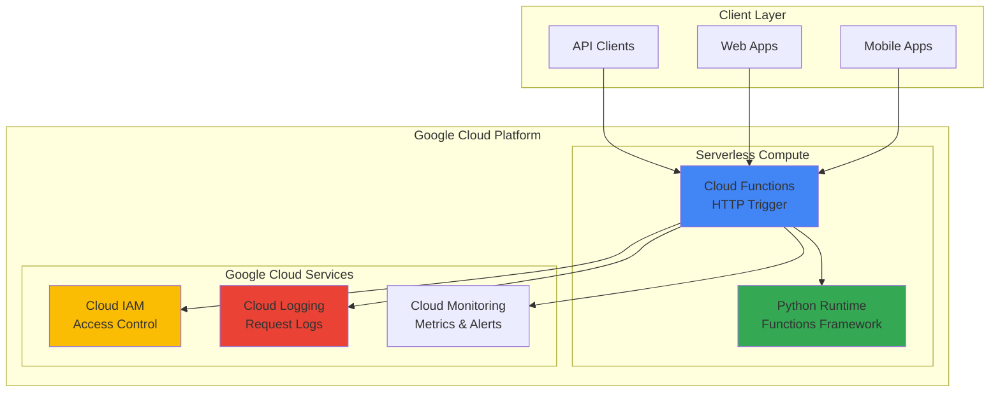

# Unit Converter API with Cloud Functions

## Problem

Small development teams need to create REST APIs quickly without managing servers or infrastructure complexity. Traditional server-based approaches require provisioning compute resources, configuring load balancers, and managing scaling concerns, adding operational overhead for simple API services. Many organizations struggle with the cost and complexity of maintaining always-on servers for lightweight API functionality that may have sporadic usage patterns.

## Solution

Deploy a serverless REST API using Google Cloud Functions with HTTP triggers to handle unit conversion requests. Cloud Functions automatically scales based on demand, eliminating infrastructure management while providing built-in security, monitoring, and cost optimization. This approach delivers a production-ready API with zero server maintenance and pay-per-request pricing.

## Architecture Diagram



## Prerequisites

1. Google Cloud Project with billing enabled and Cloud Functions API access
2. Google Cloud CLI installed and authenticated (or Cloud Shell access)
3. Basic understanding of REST APIs and HTTP methods
4. Familiarity with Python programming (basic level)
5. Estimated cost: $0.00 - $0.40 per million requests (free tier includes 2 million requests/month)

> **Note**: Cloud Functions pricing includes a generous free tier with 2 million invocations, 400,000 GB-seconds, and 200,000 GHz-seconds of compute time per month.

## Preparation

```bash
# Set environment variables for GCP resources
export PROJECT_ID="unit-converter-$(date +%s)"
export REGION="us-central1"
export FUNCTION_NAME="unit-converter-api"

# Generate unique suffix for resource names
RANDOM_SUFFIX=$(openssl rand -hex 3)

# Set default project and region
gcloud config set project ${PROJECT_ID}
gcloud config set compute/region ${REGION}
gcloud config set functions/region ${REGION}

# Enable required APIs
gcloud services enable cloudfunctions.googleapis.com
gcloud services enable cloudbuild.googleapis.com
gcloud services enable logging.googleapis.com

# Create project directory and function source
mkdir -p cloud-function-source
cd cloud-function-source

echo "✅ Project configured: ${PROJECT_ID}"
echo "✅ Function region set to: ${REGION}"
```

## Steps

1. **Create the Unit Converter Function Code**:

   Cloud Functions with HTTP triggers provide a serverless foundation for REST APIs, automatically handling request routing, scaling, and infrastructure management. The Python Functions Framework simplifies HTTP request handling by providing Flask-like request objects and built-in JSON parsing capabilities.

   ```bash
   # Create the main function file
   cat > main.py << 'EOF'
   import functions_framework
   import json
   
   # Unit conversion formulas
   CONVERSIONS = {
       'temperature': {
           'celsius_to_fahrenheit': lambda c: (c * 9/5) + 32,
           'fahrenheit_to_celsius': lambda f: (f - 32) * 5/9,
           'celsius_to_kelvin': lambda c: c + 273.15,
           'kelvin_to_celsius': lambda k: k - 273.15,
           'fahrenheit_to_kelvin': lambda f: (f - 32) * 5/9 + 273.15,
           'kelvin_to_fahrenheit': lambda k: (k - 273.15) * 9/5 + 32
       },
       'distance': {
           'meters_to_feet': lambda m: m * 3.28084,
           'feet_to_meters': lambda f: f / 3.28084,
           'kilometers_to_miles': lambda km: km * 0.621371,
           'miles_to_kilometers': lambda mi: mi / 0.621371,
           'inches_to_centimeters': lambda i: i * 2.54,
           'centimeters_to_inches': lambda cm: cm / 2.54
       },
       'weight': {
           'kilograms_to_pounds': lambda kg: kg * 2.20462,
           'pounds_to_kilograms': lambda lb: lb / 2.20462,
           'grams_to_ounces': lambda g: g * 0.035274,
           'ounces_to_grams': lambda oz: oz / 0.035274,
           'tons_to_pounds': lambda t: t * 2000,
           'pounds_to_tons': lambda lb: lb / 2000
       }
   }
   
   @functions_framework.http
   def convert_units(request):
       """HTTP Cloud Function for unit conversion.
       Args:
           request (flask.Request): The request object.
       Returns:
           The response text, or any set of values that can be turned into a
           Response object using `make_response`.
       """
       
       # Set CORS headers for web browser compatibility
       headers = {
           'Access-Control-Allow-Origin': '*',
           'Access-Control-Allow-Methods': 'GET, POST, OPTIONS',
           'Access-Control-Allow-Headers': 'Content-Type'
       }
       
       # Handle preflight requests
       if request.method == 'OPTIONS':
           return ('', 204, headers)
       
       try:
           # Parse request data
           if request.method == 'GET':
               # Handle GET requests with query parameters
               category = request.args.get('category', '').lower()
               conversion_type = request.args.get('type', '').lower()
               value = float(request.args.get('value', 0))
           elif request.method == 'POST':
               # Handle POST requests with JSON body
               request_json = request.get_json(silent=True)
               if not request_json:
                   return (json.dumps({'error': 'Invalid JSON in request body'}), 400, headers)
               
               category = request_json.get('category', '').lower()
               conversion_type = request_json.get('type', '').lower()
               value = float(request_json.get('value', 0))
           else:
               return (json.dumps({'error': 'Method not allowed'}), 405, headers)
           
           # Validate input parameters
           if not category or not conversion_type:
               return (json.dumps({
                   'error': 'Missing required parameters: category and type',
                   'available_categories': list(CONVERSIONS.keys()),
                   'example': {
                       'category': 'temperature',
                       'type': 'celsius_to_fahrenheit',
                       'value': 25
                   }
               }), 400, headers)
           
           # Check if category exists
           if category not in CONVERSIONS:
               return (json.dumps({
                   'error': f'Unknown category: {category}',
                   'available_categories': list(CONVERSIONS.keys())
               }), 400, headers)
           
           # Check if conversion type exists
           if conversion_type not in CONVERSIONS[category]:
               return (json.dumps({
                   'error': f'Unknown conversion type: {conversion_type}',
                   'available_types': list(CONVERSIONS[category].keys())
               }), 400, headers)
           
           # Perform conversion
           conversion_func = CONVERSIONS[category][conversion_type]
           result = conversion_func(value)
           
           # Return successful response
           response_data = {
               'input': {
                   'category': category,
                   'type': conversion_type,
                   'value': value
               },
               'result': round(result, 6),
               'success': True
           }
           
           return (json.dumps(response_data), 200, headers)
           
       except ValueError as e:
           return (json.dumps({'error': f'Invalid value: {str(e)}'}), 400, headers)
       except Exception as e:
           return (json.dumps({'error': f'Internal server error: {str(e)}'}), 500, headers)
   EOF
   
   echo "✅ Unit converter function code created"
   ```

   The function implements comprehensive error handling, CORS support for web browsers, and supports both GET and POST HTTP methods. This flexibility enables integration with various client applications while maintaining robust error responses and clear API documentation through error messages.

2. **Create Requirements File**:

   The requirements.txt file specifies the Functions Framework dependency, which provides the HTTP handling infrastructure and request/response management. Cloud Functions automatically installs these dependencies during deployment, ensuring consistent runtime environments.

   ```bash
   # Create requirements file for Python dependencies
   cat > requirements.txt << 'EOF'
   functions-framework==3.*
   EOF
   
   echo "✅ Requirements file created with Functions Framework dependency"
   ```

   The Functions Framework version 3.x provides the latest HTTP handling features and security updates, ensuring optimal performance and compatibility with Google Cloud's serverless infrastructure.

3. **Deploy the Cloud Function**:

   Deploying Cloud Functions with HTTP triggers creates a publicly accessible HTTPS endpoint with automatic SSL certificate management and global load balancing. The deployment process builds a container image, provisions serverless infrastructure, and configures monitoring and logging automatically.

   ```bash
   # Deploy the function with HTTP trigger
   gcloud functions deploy ${FUNCTION_NAME} \
       --runtime python312 \
       --trigger-http \
       --entry-point convert_units \
       --source . \
       --allow-unauthenticated \
       --memory 256MB \
       --timeout 60s \
       --region ${REGION}
   
   # Get the function URL
   FUNCTION_URL=$(gcloud functions describe ${FUNCTION_NAME} \
       --region=${REGION} \
       --format="value(httpsTrigger.url)")
   
   echo "✅ Cloud Function deployed successfully"
   echo "Function URL: ${FUNCTION_URL}"
   ```

   The `--allow-unauthenticated` flag enables public access for this demonstration API. In production environments, you would typically implement authentication using Cloud IAM, API keys, or Firebase Authentication depending on your security requirements.

4. **Test Temperature Conversion**:

   Testing the deployed function validates both the deployment success and the conversion logic accuracy. These tests demonstrate the API's flexibility in handling different HTTP methods and parameter formats.

   ```bash
   # Test GET request for temperature conversion
   curl -X GET "${FUNCTION_URL}?category=temperature&type=celsius_to_fahrenheit&value=25" \
       -H "Content-Type: application/json"
   
   echo -e "\n✅ Temperature conversion GET request tested"
   
   # Test POST request for temperature conversion
   curl -X POST ${FUNCTION_URL} \
       -H "Content-Type: application/json" \
       -d '{
         "category": "temperature",
         "type": "fahrenheit_to_celsius",
         "value": 77
       }'
   
   echo -e "\n✅ Temperature conversion POST request tested"
   ```

   Both requests should return JSON responses with the converted values, demonstrating the API's ability to handle different client preferences and integration patterns.

5. **Test Distance and Weight Conversions**:

   Comprehensive testing across different conversion categories validates the API's full functionality and ensures consistent behavior across all supported unit types.

   ```bash
   # Test distance conversion
   curl -X POST ${FUNCTION_URL} \
       -H "Content-Type: application/json" \
       -d '{
         "category": "distance",
         "type": "meters_to_feet",
         "value": 100
       }'
   
   echo -e "\n✅ Distance conversion tested"
   
   # Test weight conversion
   curl -X POST ${FUNCTION_URL} \
       -H "Content-Type: application/json" \
       -d '{
         "category": "weight",
         "type": "kilograms_to_pounds",
         "value": 70
       }'
   
   echo -e "\n✅ Weight conversion tested"
   ```

   These tests verify the mathematical accuracy of conversion formulas and demonstrate the API's capability to handle various measurement categories that are commonly needed in applications.

6. **Test Error Handling**:

   Robust error handling ensures the API provides helpful feedback when clients send invalid requests, improving the developer experience and enabling easier troubleshooting during integration.

   ```bash
   # Test invalid category
   curl -X POST ${FUNCTION_URL} \
       -H "Content-Type: application/json" \
       -d '{
         "category": "invalid_category",
         "type": "some_conversion",
         "value": 100
       }'
   
   echo -e "\n✅ Invalid category error handling tested"
   
   # Test missing parameters
   curl -X POST ${FUNCTION_URL} \
       -H "Content-Type: application/json" \
       -d '{
         "value": 100
       }'
   
   echo -e "\n✅ Missing parameter error handling tested"
   ```

   The error responses include helpful information about available categories and conversion types, making the API self-documenting and easier to integrate with client applications.

## Validation & Testing

1. **Verify function deployment status**:

   ```bash
   # Check function status and configuration
   gcloud functions describe ${FUNCTION_NAME} \
       --region=${REGION} \
       --format="table(name,status,httpsTrigger.url,runtime)"
   ```

   Expected output: Function should show "ACTIVE" status with the HTTPS trigger URL displayed.

2. **Test all conversion categories**:

   ```bash
   # Test comprehensive conversion scenarios
   echo "Testing all conversion categories..."
   
   # Temperature conversions
   curl -s -X GET "${FUNCTION_URL}?category=temperature&type=celsius_to_fahrenheit&value=0" | jq .
   curl -s -X GET "${FUNCTION_URL}?category=temperature&type=kelvin_to_celsius&value=273.15" | jq .
   
   # Distance conversions
   curl -s -X GET "${FUNCTION_URL}?category=distance&type=kilometers_to_miles&value=1.609" | jq .
   
   # Weight conversions
   curl -s -X GET "${FUNCTION_URL}?category=weight&type=pounds_to_kilograms&value=2.20462" | jq .
   ```

   Expected output: All requests should return JSON with accurate conversion results and success status.

3. **Verify function logs and monitoring**:

   ```bash
   # View recent function execution logs
   gcloud functions logs read ${FUNCTION_NAME} \
       --region=${REGION} \
       --limit=10
   
   echo "✅ Function logs retrieved successfully"
   ```

   Expected output: Logs should show successful function executions with HTTP request details and any error messages from testing.

## Cleanup

1. **Delete the Cloud Function**:

   ```bash
   # Delete the deployed function
   gcloud functions delete ${FUNCTION_NAME} \
       --region=${REGION} \
       --quiet
   
   echo "✅ Cloud Function deleted successfully"
   ```

2. **Remove local source files**:

   ```bash
   # Navigate back to parent directory and remove source code
   cd ..
   rm -rf cloud-function-source
   
   echo "✅ Local source files cleaned up"
   ```

3. **Verify resource cleanup**:

   ```bash
   # Confirm function deletion
   gcloud functions list --region=${REGION} --filter="name:${FUNCTION_NAME}"
   
   echo "✅ Resource cleanup verified"
   echo "Note: Function deletion is immediate and stops all billing"
   ```

## Discussion

This recipe demonstrates the power of serverless computing with Google Cloud Functions for building production-ready REST APIs without infrastructure management overhead. Cloud Functions automatically handles scaling, load balancing, and security certificates, allowing developers to focus entirely on business logic rather than operational concerns. The pay-per-request pricing model makes this approach extremely cost-effective for APIs with variable or unpredictable traffic patterns.

The implementation showcases several Cloud Functions best practices, including comprehensive error handling, CORS support for web browser compatibility, and support for multiple HTTP methods. The function structure follows Google's recommended patterns for HTTP functions, using the Functions Framework for Python to provide Flask-like request handling while maintaining compatibility with Google Cloud's serverless infrastructure. The error responses include helpful information about available operations, making the API self-documenting and developer-friendly.

Security considerations for production deployments would include implementing authentication through Cloud IAM roles, using API keys for rate limiting, or integrating with Firebase Authentication for user-based access control. Cloud Functions integrates seamlessly with other Google Cloud services like Cloud Monitoring for observability, Cloud Logging for centralized log management, and Cloud Build for automated deployment pipelines. For high-traffic applications, consider implementing caching strategies using Cloud Memorystore or adding request validation using Cloud Endpoints for enhanced API management capabilities.

For more information on Google Cloud Functions best practices, see the [official Cloud Functions documentation](https://cloud.google.com/functions/docs/bestpractices) and [Google Cloud Architecture Center](https://cloud.google.com/architecture/) for architectural guidance.

> **Tip**: Use Cloud Monitoring to set up alerts for function errors and latency metrics to ensure optimal API performance and reliability in production environments.

## Challenge

Extend this unit converter API by implementing these enhancements:

1. **Add More Conversion Categories**: Implement volume conversions (liters to gallons, milliliters to fluid ounces) and area conversions (square meters to square feet, acres to hectares) by extending the CONVERSIONS dictionary with additional mathematical formulas.

2. **Implement Rate Limiting**: Add request rate limiting using Cloud Memorystore (Redis) to track client requests and prevent API abuse, returning HTTP 429 status codes when limits are exceeded.

3. **Add Batch Conversion Support**: Modify the API to accept arrays of conversion requests in a single HTTP call, processing multiple unit conversions simultaneously and returning bulk results for improved efficiency.

4. **Create API Documentation**: Deploy interactive API documentation using Cloud Endpoints or implement OpenAPI/Swagger specification generation to provide comprehensive API documentation with example requests and responses.

5. **Implement Conversion History**: Add Cloud Firestore integration to store conversion history with timestamps, enabling clients to retrieve their previous conversion requests and supporting analytics on popular conversion types.

## Infrastructure Code

*Infrastructure code will be generated after recipe approval.*