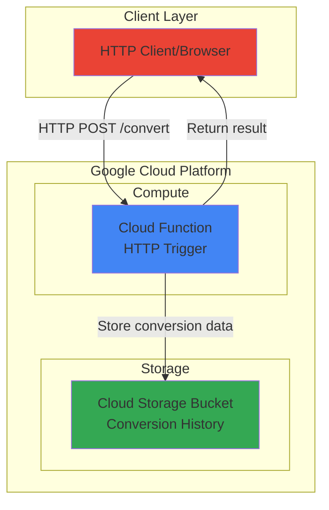

# Unit Converter API with Cloud Functions and Storage

## Problem

Small businesses and applications often need reliable unit conversion capabilities for measurements like temperature, weight, and length, but don't want to maintain conversion logic or track usage history. Building custom conversion servers requires infrastructure management, scaling concerns, and data persistence solutions that add complexity and operational overhead beyond the core business requirements.

## Solution

Deploy a serverless HTTP API using Cloud Functions that handles unit conversions between metric and imperial systems, automatically storing conversion history in Cloud Storage for analytics and auditing. This serverless approach eliminates infrastructure management while providing automatic scaling, built-in monitoring, and cost-efficient pay-per-use pricing that scales with actual usage patterns.

## Architecture Diagram



## Prerequisites

1. Google Cloud account with billing enabled and appropriate permissions for Cloud Functions and Cloud Storage
2. Google Cloud CLI installed and configured (or use Cloud Shell)
3. Basic understanding of HTTP APIs and JSON data formats
4. Python programming knowledge for understanding the function code
5. Estimated cost: $0.01-0.05 for testing (Cloud Functions: $0.0000004/invocation, Cloud Storage: $0.020/GB/month)

> **Note**: Cloud Functions includes 2 million free invocations per month, making this recipe essentially free for development and testing purposes.

## Preparation

Google Cloud Functions provides serverless compute that automatically scales based on incoming requests, while Cloud Storage offers globally distributed object storage with strong consistency. This combination enables building stateless APIs that maintain historical data without managing infrastructure.

```bash
# Set environment variables for GCP resources
export PROJECT_ID=$(gcloud config get-value project)
export REGION="us-central1"
export FUNCTION_NAME="unit-converter"
export BUCKET_NAME="${PROJECT_ID}-conversion-history"

# Generate unique suffix for resource names to avoid conflicts
RANDOM_SUFFIX=$(openssl rand -hex 3)
export BUCKET_NAME="${PROJECT_ID}-conversion-history-${RANDOM_SUFFIX}"

# Set default project and region for consistent resource deployment
gcloud config set project ${PROJECT_ID}
gcloud config set compute/region ${REGION}

echo "✅ Project configured: ${PROJECT_ID}"
echo "✅ Region set to: ${REGION}"
echo "✅ Resources will use suffix: ${RANDOM_SUFFIX}"
```

The environment setup ensures all resources are created in a consistent region and project context, while the random suffix prevents naming conflicts if multiple users deploy this recipe simultaneously.

```bash
# Enable required Google Cloud APIs for serverless computing and storage
gcloud services enable cloudfunctions.googleapis.com \
    storage.googleapis.com \
    cloudbuild.googleapis.com

echo "✅ Required APIs enabled successfully"
```

Enabling these APIs activates the underlying services needed for Cloud Functions deployment, Cloud Storage operations, and the Cloud Build service that compiles and packages the function code automatically.

## Steps

1. **Create Cloud Storage Bucket for Conversion History**:

   Cloud Storage provides globally distributed object storage with strong consistency guarantees and automatic scaling. Creating a bucket with appropriate regional settings establishes the foundation for storing conversion history data that can be accessed from anywhere in the world with low latency.

   ```bash
   # Create Cloud Storage bucket with standard storage class
   gcloud storage buckets create gs://${BUCKET_NAME} \
       --location=${REGION} \
       --uniform-bucket-level-access
   
   echo "✅ Storage bucket created: gs://${BUCKET_NAME}"
   ```

   The uniform bucket-level access ensures consistent IAM permissions across all objects, while the standard storage class provides optimal performance for frequently accessed conversion history data.

2. **Create Function Source Directory and Code**:

   Cloud Functions supports multiple programming languages with automatic dependency management and runtime provisioning. Creating the function structure with proper entry points enables Google's buildpack system to automatically detect and deploy the serverless application.

   ```bash
   # Create function directory and navigate to it
   mkdir unit-converter-function
   cd unit-converter-function
   
   echo "✅ Function directory created"
   ```

3. **Write the Unit Conversion Function**:

   The conversion logic implements common business requirements for metric/imperial transformations while maintaining stateless design principles. The function processes HTTP requests, performs calculations, and stores audit trails without requiring server management or scaling configuration.

   ```bash
   # Create the main function file with conversion logic
   cat > main.py << 'EOF'
import json
import datetime
from google.cloud import storage
import os

# Initialize Cloud Storage client with automatic authentication
storage_client = storage.Client()
BUCKET_NAME = os.environ.get('BUCKET_NAME')

def convert_units(request):
    """
    HTTP Cloud Function for unit conversion with history storage.
    Supports temperature, weight, and length conversions.
    """
    
    # Set CORS headers for web browser compatibility
    headers = {
        'Access-Control-Allow-Origin': '*',
        'Access-Control-Allow-Methods': 'POST, OPTIONS',
        'Access-Control-Allow-Headers': 'Content-Type'
    }
    
    # Handle preflight CORS requests
    if request.method == 'OPTIONS':
        return ('', 204, headers)
    
    try:
        # Parse JSON request data
        request_json = request.get_json(silent=True)
        
        if not request_json:
            return ({'error': 'Invalid JSON in request body'}, 400, headers)
        
        # Extract conversion parameters
        value = float(request_json.get('value', 0))
        from_unit = request_json.get('from_unit', '').lower()
        to_unit = request_json.get('to_unit', '').lower()
        
        # Perform unit conversion using business logic
        result = perform_conversion(value, from_unit, to_unit)
        
        if result is None:
            return ({'error': 'Unsupported unit conversion'}, 400, headers)
        
        # Create conversion record for audit trail
        conversion_record = {
            'timestamp': datetime.datetime.utcnow().isoformat(),
            'input_value': value,
            'from_unit': from_unit,
            'to_unit': to_unit,
            'result': result,
            'conversion_type': get_conversion_type(from_unit, to_unit)
        }
        
        # Store conversion history in Cloud Storage
        store_conversion_history(conversion_record)
        
        # Return successful conversion result
        response = {
            'original_value': value,
            'original_unit': from_unit,
            'converted_value': round(result, 4),
            'converted_unit': to_unit,
            'timestamp': conversion_record['timestamp']
        }
        
        return (response, 200, headers)
        
    except Exception as e:
        return ({'error': f'Conversion failed: {str(e)}'}, 500, headers)

def perform_conversion(value, from_unit, to_unit):
    """Convert between different unit types with precise calculations."""
    
    # Temperature conversions
    if from_unit == 'celsius' and to_unit == 'fahrenheit':
        return (value * 9/5) + 32
    elif from_unit == 'fahrenheit' and to_unit == 'celsius':
        return (value - 32) * 5/9
    elif from_unit == 'celsius' and to_unit == 'kelvin':
        return value + 273.15
    elif from_unit == 'kelvin' and to_unit == 'celsius':
        return value - 273.15
    
    # Length conversions
    elif from_unit == 'meters' and to_unit == 'feet':
        return value * 3.28084
    elif from_unit == 'feet' and to_unit == 'meters':
        return value * 0.3048
    elif from_unit == 'kilometers' and to_unit == 'miles':
        return value * 0.621371
    elif from_unit == 'miles' and to_unit == 'kilometers':
        return value * 1.60934
    
    # Weight conversions
    elif from_unit == 'kilograms' and to_unit == 'pounds':
        return value * 2.20462
    elif from_unit == 'pounds' and to_unit == 'kilograms':
        return value * 0.453592
    elif from_unit == 'grams' and to_unit == 'ounces':
        return value * 0.035274
    elif from_unit == 'ounces' and to_unit == 'grams':
        return value * 28.3495
    
    # Same unit conversions
    elif from_unit == to_unit:
        return value
    
    return None

def get_conversion_type(from_unit, to_unit):
    """Categorize conversion type for analytics purposes."""
    temp_units = ['celsius', 'fahrenheit', 'kelvin']
    length_units = ['meters', 'feet', 'kilometers', 'miles']
    weight_units = ['kilograms', 'pounds', 'grams', 'ounces']
    
    if from_unit in temp_units and to_unit in temp_units:
        return 'temperature'
    elif from_unit in length_units and to_unit in length_units:
        return 'length'
    elif from_unit in weight_units and to_unit in weight_units:
        return 'weight'
    
    return 'unknown'

def store_conversion_history(record):
    """Store conversion record in Cloud Storage for audit trail."""
    try:
        bucket = storage_client.bucket(BUCKET_NAME)
        
        # Create filename with timestamp for easy sorting
        filename = f"conversions/{record['timestamp']}-{record['conversion_type']}.json"
        blob = bucket.blob(filename)
        
        # Upload JSON record to Cloud Storage
        blob.upload_from_string(
            json.dumps(record, indent=2),
            content_type='application/json'
        )
        
    except Exception as e:
        print(f"Failed to store conversion history: {e}")
        # Continue processing even if storage fails
EOF
   
   echo "✅ Function code created with conversion logic"
   ```

   The function implements a comprehensive unit conversion API with automatic history tracking, supporting temperature, length, and weight conversions commonly needed by business applications.

4. **Create Requirements File for Dependencies**:

   Cloud Functions automatically manages Python dependencies using the requirements.txt file during deployment. The Google Cloud Storage client library version 2.18.0 provides the latest features and security updates, enabling secure, authenticated access to storage services without manual credential management.

   ```bash
   # Create requirements file for Python dependencies
   cat > requirements.txt << 'EOF'
google-cloud-storage==2.18.0
EOF
   
   echo "✅ Requirements file created"
   ```

5. **Deploy Cloud Function with HTTP Trigger**:

   Cloud Functions deployment automatically handles containerization, scaling configuration, and runtime provisioning. The HTTP trigger creates a publicly accessible endpoint while the environment variable configuration enables secure communication with Cloud Storage services.

   ```bash
   # Deploy Cloud Function with HTTP trigger and environment variables
   gcloud functions deploy ${FUNCTION_NAME} \
       --runtime python312 \
       --trigger-http \
       --allow-unauthenticated \
       --source . \
       --entry-point convert_units \
       --memory 256MB \
       --timeout 60s \
       --set-env-vars BUCKET_NAME=${BUCKET_NAME} \
       --region ${REGION}
   
   echo "✅ Cloud Function deployed successfully"
   ```

   The deployment configuration uses Python 3.12 runtime (the latest stable version) with 256MB memory allocation and 60-second timeout, optimizing for cost and performance while ensuring modern language features and security updates are available for unit conversion operations.

6. **Get Function URL for Testing**:

   Cloud Functions automatically provisions HTTPS endpoints with global load balancing and SSL termination. Retrieving the trigger URL enables testing and integration with frontend applications or API clients.

   ```bash
   # Get the deployed function's HTTP trigger URL
   FUNCTION_URL=$(gcloud functions describe ${FUNCTION_NAME} \
       --region=${REGION} \
       --format="value(httpsTrigger.url)")
   
   echo "✅ Function URL: ${FUNCTION_URL}"
   echo "Function ready for testing at: ${FUNCTION_URL}"
   ```

## Validation & Testing

1. **Test Temperature Conversion**:

   ```bash
   # Test Celsius to Fahrenheit conversion
   curl -X POST ${FUNCTION_URL} \
       -H "Content-Type: application/json" \
       -d '{"value": 25, "from_unit": "celsius", "to_unit": "fahrenheit"}'
   ```

   Expected output: `{"converted_unit": "fahrenheit", "converted_value": 77.0, "original_unit": "celsius", "original_value": 25, "timestamp": "2025-07-23T..."}`

2. **Test Length Conversion**:

   ```bash
   # Test meters to feet conversion
   curl -X POST ${FUNCTION_URL} \
       -H "Content-Type: application/json" \
       -d '{"value": 10, "from_unit": "meters", "to_unit": "feet"}'
   ```

   Expected output: `{"converted_unit": "feet", "converted_value": 32.8084, "original_unit": "meters", "original_value": 10, "timestamp": "2025-07-23T..."}`

3. **Test Weight Conversion**:

   ```bash
   # Test kilograms to pounds conversion
   curl -X POST ${FUNCTION_URL} \
       -H "Content-Type: application/json" \
       -d '{"value": 5, "from_unit": "kilograms", "to_unit": "pounds"}'
   ```

   Expected output: `{"converted_unit": "pounds", "converted_value": 11.0231, "original_unit": "kilograms", "original_value": 5, "timestamp": "2025-07-23T..."}`

4. **Verify Conversion History Storage**:

   ```bash
   # List stored conversion history files
   gcloud storage ls gs://${BUCKET_NAME}/conversions/
   
   # View a recent conversion record
   LATEST_FILE=$(gcloud storage ls gs://${BUCKET_NAME}/conversions/ | tail -1)
   gcloud storage cat ${LATEST_FILE}
   ```

   Expected output: JSON records showing conversion details, timestamps, and categorization for audit trail analysis.

## Cleanup

1. **Delete Cloud Function**:

   ```bash
   # Remove the deployed Cloud Function
   gcloud functions delete ${FUNCTION_NAME} \
       --region=${REGION} \
       --quiet
   
   echo "✅ Cloud Function deleted"
   ```

2. **Delete Cloud Storage Bucket and Contents**:

   ```bash
   # Remove all objects and the bucket itself
   gcloud storage rm -r gs://${BUCKET_NAME}
   
   echo "✅ Storage bucket and contents deleted"
   ```

3. **Clean Up Local Files**:

   ```bash
   # Remove local function directory and files
   cd ..
   rm -rf unit-converter-function
   
   # Clear environment variables
   unset FUNCTION_URL PROJECT_ID REGION FUNCTION_NAME BUCKET_NAME RANDOM_SUFFIX
   
   echo "✅ Local cleanup completed"
   ```

## Discussion

This serverless unit conversion API demonstrates the power of Google Cloud's managed services for building scalable business applications without infrastructure overhead. Cloud Functions automatically handles request routing, scaling, and availability, while Cloud Storage provides durable, globally accessible data persistence. The combination enables building production-ready APIs that scale from zero to millions of requests per month with consistent performance and cost efficiency.

The architecture follows serverless best practices by maintaining stateless function design while persisting audit data for compliance and analytics purposes. The automatic scaling capabilities mean the API can handle sudden traffic spikes during business peak periods without manual intervention, while the pay-per-use pricing model ensures cost optimization during low-usage periods. The global deployment model ensures low-latency responses for users worldwide through Google's edge network infrastructure.

Cloud Functions integrates seamlessly with Google Cloud's observability stack, providing automatic logging, monitoring, and error tracking through Cloud Logging and Cloud Monitoring. This enables proactive issue detection and performance optimization without additional configuration. The platform also supports blue-green deployments and traffic splitting for safe production updates, making it suitable for business-critical applications requiring high availability and reliability.

> **Tip**: Use Cloud Monitoring to set up alerts for function errors or high latency, and leverage Cloud Storage lifecycle policies to automatically archive old conversion history data for cost optimization.

The serverless approach significantly reduces operational complexity compared to traditional server-based deployments. Google manages the underlying infrastructure, security patches, and runtime updates, allowing developers to focus on business logic rather than system administration. The built-in authentication and authorization capabilities integrate with Google Cloud IAM for enterprise security requirements, while the automatic SSL termination and DDoS protection provide robust security defaults.

For production deployments, consider implementing request validation, rate limiting through Cloud Endpoints, and integrating with Cloud CDN for globally distributed caching of conversion results. The audit trail stored in Cloud Storage can be processed using BigQuery for analytics insights about usage patterns, popular conversion types, and geographic distribution of requests, enabling data-driven business decisions and capacity planning.

**Documentation References:**
- [Cloud Functions Overview](https://cloud.google.com/functions/docs/concepts/overview) - Comprehensive guide to serverless computing capabilities
- [Cloud Storage Best Practices](https://cloud.google.com/storage/docs/best-practices) - Storage optimization and security recommendations  
- [Google Cloud Architecture Framework](https://cloud.google.com/architecture/framework) - Well-architected design principles
- [Cloud Functions Security](https://cloud.google.com/functions/docs/securing) - Authentication and authorization patterns
- [Serverless Application Patterns](https://cloud.google.com/architecture/serverless-app-development-patterns) - Design patterns for serverless applications
- [Cloud Functions Runtime Support](https://cloud.google.com/functions/docs/runtime-support) - Supported runtime versions and lifecycle information

## Challenge

Extend this solution by implementing these enhancements:

1. **Add Authentication and API Keys**: Implement Cloud Endpoints to secure the API with authentication tokens and rate limiting to prevent abuse while maintaining developer-friendly access patterns.

2. **Create Analytics Dashboard**: Build a real-time dashboard using Cloud Monitoring and Data Studio to visualize conversion trends, popular unit types, and geographic usage patterns from the stored history data.

3. **Implement Batch Processing**: Add a Cloud Scheduler trigger to periodically aggregate conversion history data using Cloud Functions and store summaries in BigQuery for advanced analytics and reporting capabilities.

4. **Add Custom Unit Support**: Extend the conversion logic to support custom unit definitions stored in Firestore, enabling businesses to add industry-specific measurements like currency rates or specialized scientific units.

5. **Deploy Multi-Region Setup**: Configure the solution across multiple Google Cloud regions with Cloud Load Balancer for improved global performance and disaster recovery capabilities.

## Infrastructure Code

### Available Infrastructure as Code:

- [Infrastructure Code Overview](code/README.md) - Detailed description of all infrastructure components
- [Infrastructure Manager](code/infrastructure-manager/) - GCP Infrastructure Manager templates
- [Bash CLI Scripts](code/scripts/) - Example bash scripts using gcloud CLI commands to deploy infrastructure
- [Terraform](code/terraform/) - Terraform configuration files