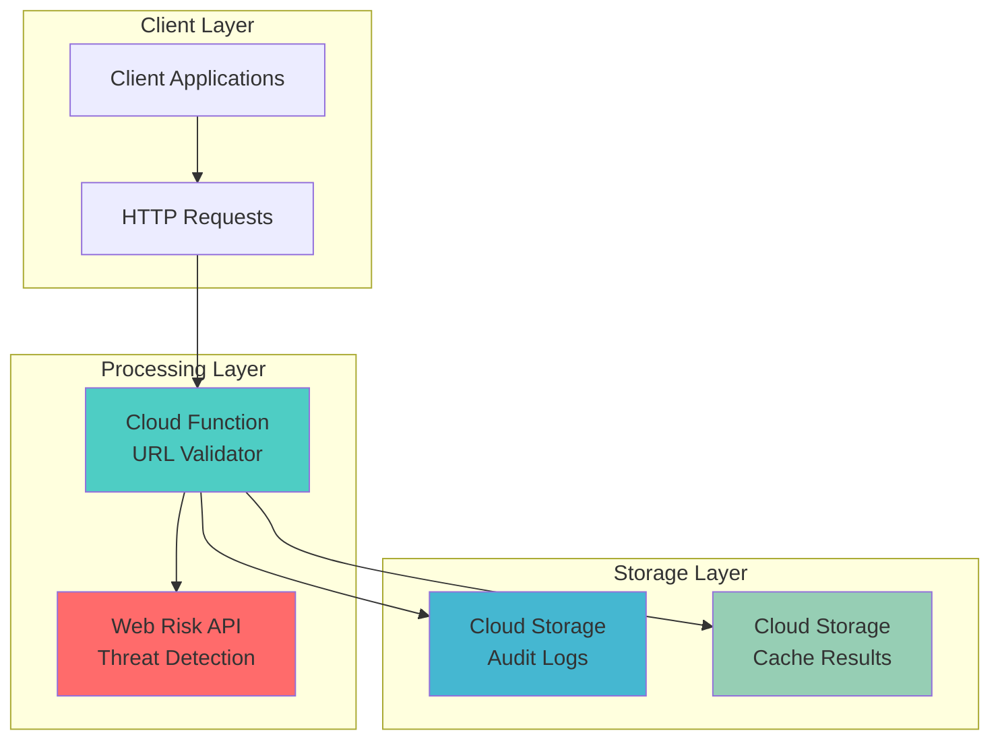

# URL Safety Validation using Web Risk and Functions

## Problem

Organizations face increasing cybersecurity threats from malicious URLs shared via email, messaging platforms, and user-generated content. Manual URL validation is impractical for high-volume applications, while traditional security solutions often lack real-time threat intelligence. Companies need automated URL safety validation that can detect phishing sites, malware, and social engineering content before users access potentially dangerous links, integrating seamlessly with existing applications and workflows.

## Solution

Build an automated URL safety validation system using Google's Web Risk API integrated with Cloud Functions for serverless processing. The solution provides real-time threat detection by checking URLs against Google's constantly updated databases of unsafe web resources, storing validation results in Cloud Storage for audit trails and compliance reporting. This serverless architecture scales automatically based on validation requests while maintaining cost efficiency and providing enterprise-grade security protection.

## Architecture Diagram



## Prerequisites

1. Google Cloud account with billing enabled and appropriate permissions for Web Risk API, Cloud Functions, and Cloud Storage
2. gcloud CLI installed and configured (or use Cloud Shell)
3. Basic understanding of serverless architecture and REST APIs
4. Knowledge of Python programming for Cloud Functions development
5. Estimated cost: $0.50-$2.00 per 1,000 URL validations (Web Risk API charges apply)

> **Note**: Web Risk API pricing varies by threat type and request volume. Review current [Web Risk pricing](https://cloud.google.com/web-risk/pricing) for accurate cost estimates.

## Preparation

```bash
# Set environment variables for GCP resources
export PROJECT_ID="url-safety-$(date +%s)"
export REGION="us-central1"
export ZONE="us-central1-a"

# Generate unique suffix for resource names
RANDOM_SUFFIX=$(openssl rand -hex 3)
export FUNCTION_NAME="url-validator-${RANDOM_SUFFIX}"
export BUCKET_NAME="url-validation-logs-${PROJECT_ID}"
export CACHE_BUCKET="url-validation-cache-${PROJECT_ID}"

# Set default project and region
gcloud config set project ${PROJECT_ID}
gcloud config set compute/region ${REGION}
gcloud config set compute/zone ${ZONE}

# Enable required APIs
gcloud services enable cloudfunctions.googleapis.com
gcloud services enable webrisk.googleapis.com
gcloud services enable storage.googleapis.com
gcloud services enable cloudbuild.googleapis.com

echo "✅ Project configured: ${PROJECT_ID}"
echo "✅ Function name: ${FUNCTION_NAME}"
echo "✅ Storage buckets: ${BUCKET_NAME}, ${CACHE_BUCKET}"
```

## Steps

1. **Create Cloud Storage Buckets for Audit Logs and Caching**:

   Cloud Storage provides durable, scalable object storage for storing URL validation audit logs and caching results. Separate buckets organize audit data from cached validation results, enabling different lifecycle policies and access controls. This storage strategy supports compliance requirements while optimizing performance through result caching.

   ```bash
   # Create bucket for audit logs with versioning
   gsutil mb -p ${PROJECT_ID} \
       -c STANDARD \
       -l ${REGION} \
       gs://${BUCKET_NAME}
   
   gsutil versioning set on gs://${BUCKET_NAME}
   
   # Create bucket for caching validation results
   gsutil mb -p ${PROJECT_ID} \
       -c STANDARD \
       -l ${REGION} \
       gs://${CACHE_BUCKET}
   
   # Set lifecycle policy for cache bucket (30-day retention)
   echo '{
     "lifecycle": {
       "rule": [
         {
           "action": {"type": "Delete"},
           "condition": {"age": 30}
         }
       ]
     }
   }' > lifecycle.json
   
   gsutil lifecycle set lifecycle.json gs://${CACHE_BUCKET}
   
   echo "✅ Storage buckets created with appropriate lifecycle policies"
   ```

   The storage infrastructure now supports both audit logging and performance optimization through caching, with automatic cleanup of cached results after 30 days to control storage costs.

2. **Create the URL Validation Function Code**:

   The Cloud Function integrates Google's Web Risk API to perform comprehensive URL safety checks against multiple threat databases. This serverless function handles URL canonicalization, threat type validation, result caching, and audit logging while providing a simple HTTP interface for client applications.

   ```bash
   # Create function directory and requirements
   mkdir -p url-validator
   cd url-validator
   
   # Create requirements.txt for Python dependencies
   cat > requirements.txt << 'EOF'
google-cloud-webrisk==1.15.0
google-cloud-storage==2.16.0
functions-framework==3.6.0
requests==2.31.0
urllib3==2.2.1
EOF
   
   echo "✅ Function dependencies specified"
   ```

   The requirements file includes the latest Google Cloud libraries for Web Risk API integration, Cloud Storage operations, and HTTP request handling with secure dependency versions.

3. **Implement the Main URL Validation Logic**:

   ```bash
   # Create main.py with comprehensive URL validation logic
   cat > main.py << 'EOF'
import functions_framework
from google.cloud import webrisk_v1
from google.cloud import storage
import json
import hashlib
import urllib.parse
from datetime import datetime, timezone
import logging
import os

# Initialize clients
webrisk_client = webrisk_v1.WebRiskServiceClient()
storage_client = storage.Client()

def get_url_hash(url):
    """Generate SHA256 hash for URL caching"""
    return hashlib.sha256(url.encode('utf-8')).hexdigest()

def check_cache(url_hash, cache_bucket):
    """Check if URL validation result exists in cache"""
    try:
        bucket = storage_client.bucket(cache_bucket)
        blob = bucket.blob(f"cache/{url_hash}.json")
        if blob.exists():
            cache_data = json.loads(blob.download_as_text())
            # Check if cache is still valid (24 hours)
            cache_time = datetime.fromisoformat(
                cache_data['timestamp'].replace('Z', '+00:00')
            )
            now = datetime.now(timezone.utc)
            if (now - cache_time).total_seconds() < 86400:  # 24 hours
                return cache_data['result']
    except Exception as e:
        logging.warning(f"Cache check failed: {e}")
    return None

def store_cache(url_hash, result, cache_bucket):
    """Store validation result in cache"""
    try:
        bucket = storage_client.bucket(cache_bucket)
        blob = bucket.blob(f"cache/{url_hash}.json")
        cache_data = {
            'result': result,
            'timestamp': datetime.now(timezone.utc).isoformat()
        }
        blob.upload_from_string(json.dumps(cache_data))
    except Exception as e:
        logging.error(f"Cache storage failed: {e}")

def log_validation(url, result, audit_bucket):
    """Log validation result for audit purposes"""
    try:
        bucket = storage_client.bucket(audit_bucket)
        timestamp = datetime.now(timezone.utc).isoformat()
        filename = f"audit/{datetime.now().strftime('%Y/%m/%d')}/{timestamp}-{get_url_hash(url)[:8]}.json"
        blob = bucket.blob(filename)
        
        audit_data = {
            'timestamp': timestamp,
            'url': url,
            'result': result,
            'source_ip': 'cloud-function',
            'user_agent': 'url-validator-function'
        }
        blob.upload_from_string(json.dumps(audit_data, indent=2))
    except Exception as e:
        logging.error(f"Audit logging failed: {e}")

@functions_framework.http
def validate_url(request):
    """Main Cloud Function entry point for URL validation"""
    
    # Handle CORS for web clients
    if request.method == 'OPTIONS':
        headers = {
            'Access-Control-Allow-Origin': '*',
            'Access-Control-Allow-Methods': 'POST',
            'Access-Control-Allow-Headers': 'Content-Type',
            'Access-Control-Max-Age': '3600'
        }
        return ('', 204, headers)
    
    headers = {'Access-Control-Allow-Origin': '*'}
    
    if request.method != 'POST':
        return ({'error': 'Only POST method supported'}, 405, headers)
    
    try:
        # Parse request data
        request_json = request.get_json()
        if not request_json or 'url' not in request_json:
            return ({'error': 'URL parameter required'}, 400, headers)
        
        url = request_json['url']
        cache_enabled = request_json.get('cache', True)
        
        # Validate URL format
        try:
            parsed = urllib.parse.urlparse(url)
            if not parsed.scheme or not parsed.netloc:
                return ({'error': 'Invalid URL format'}, 400, headers)
        except Exception:
            return ({'error': 'Invalid URL format'}, 400, headers)
        
        url_hash = get_url_hash(url)
        project_id = os.environ.get('GOOGLE_CLOUD_PROJECT')
        cache_bucket = f"url-validation-cache-{project_id}"
        audit_bucket = f"url-validation-logs-{project_id}"
        
        # Check cache first if enabled
        if cache_enabled:
            cached_result = check_cache(url_hash, cache_bucket)
            if cached_result:
                log_validation(url, {**cached_result, 'cached': True}, audit_bucket)
                return (cached_result, 200, headers)
        
        # Define threat types to check
        threat_types = [
            webrisk_v1.ThreatType.MALWARE,
            webrisk_v1.ThreatType.SOCIAL_ENGINEERING,
            webrisk_v1.ThreatType.UNWANTED_SOFTWARE
        ]
        
        # Check URL against Web Risk API
        request_obj = webrisk_v1.SearchUrisRequest(
            uri=url,
            threat_types=threat_types
        )
        
        response = webrisk_client.search_uris(request=request_obj)
        
        # Process results
        result = {
            'url': url,
            'safe': True,
            'threats': [],
            'checked_at': datetime.now(timezone.utc).isoformat(),
            'cached': False
        }
        
        if response.threat:
            result['safe'] = False
            for threat_type in response.threat.threat_types:
                result['threats'].append({
                    'type': threat_type.name,
                    'expires_at': response.threat.expire_time.isoformat() if response.threat.expire_time else None
                })
        
        # Store in cache and log
        if cache_enabled:
            store_cache(url_hash, result, cache_bucket)
        log_validation(url, result, audit_bucket)
        
        return (result, 200, headers)
        
    except Exception as e:
        logging.error(f"Validation error: {e}")
        error_result = {
            'error': 'Internal validation error',
            'timestamp': datetime.now(timezone.utc).isoformat()
        }
        return (error_result, 500, headers)
EOF
   
   echo "✅ Cloud Function code created with comprehensive validation logic"
   ```

   This implementation provides enterprise-grade URL validation with intelligent caching, comprehensive threat detection, audit logging, and proper error handling for production environments.

4. **Deploy the Cloud Function with Web Risk API Access**:

   Cloud Functions deployment configures the serverless environment with appropriate IAM permissions for Web Risk API access and Cloud Storage operations. The deployment includes memory optimization, timeout configuration, and environment variables for production-ready URL validation services.

   ```bash
   # Deploy Cloud Function with required permissions
   gcloud functions deploy ${FUNCTION_NAME} \
       --runtime python311 \
       --trigger-http \
       --allow-unauthenticated \
       --source . \
       --entry-point validate_url \
       --memory 256MB \
       --timeout 60s \
       --max-instances 100 \
       --set-env-vars GOOGLE_CLOUD_PROJECT=${PROJECT_ID}
   
   # Get function URL
   FUNCTION_URL=$(gcloud functions describe ${FUNCTION_NAME} \
       --format="value(httpsTrigger.url)")
   
   echo "✅ Cloud Function deployed successfully"
   echo "Function URL: ${FUNCTION_URL}"
   ```

   The Cloud Function is now deployed with auto-scaling capabilities, optimized memory allocation, and proper security configurations for handling URL validation requests at enterprise scale.

5. **Configure IAM Permissions for Web Risk API Access**:

   Identity and Access Management (IAM) provides fine-grained access control for Google Cloud resources. The Cloud Function's service account requires specific permissions to access the Web Risk API for threat detection and Cloud Storage for audit logging and caching operations, following the principle of least privilege.

   ```bash
   # Get the Cloud Function service account
   FUNCTION_SA=$(gcloud functions describe ${FUNCTION_NAME} \
       --format="value(serviceAccountEmail)")
   
   # Grant Web Risk API access to the function
   gcloud projects add-iam-policy-binding ${PROJECT_ID} \
       --member="serviceAccount:${FUNCTION_SA}" \
       --role="roles/webrisk.user"
   
   # Grant Storage access for audit logs and caching
   gcloud projects add-iam-policy-binding ${PROJECT_ID} \
       --member="serviceAccount:${FUNCTION_SA}" \
       --role="roles/storage.objectAdmin"
   
   echo "✅ IAM permissions configured for Web Risk API and Storage access"
   ```

   The service account now has least-privilege access to Web Risk API for threat detection and Cloud Storage for audit logging and caching operations, ensuring security while maintaining functionality.

6. **Create Test Script for URL Validation**:

   Comprehensive testing validates the function's deployment and ensures proper integration with the Web Risk API. The test script demonstrates real-world usage patterns and includes Google's official test URLs for malware and phishing detection verification.

   ```bash
   # Create test script to validate function deployment
   cat > test_validation.py << 'EOF'
#!/usr/bin/env python3
import requests
import json
import sys

def test_url_validation(function_url, test_urls):
    """Test URL validation function with various URLs"""
    
    headers = {'Content-Type': 'application/json'}
    
    for url in test_urls:
        print(f"\nTesting URL: {url}")
        
        payload = {
            'url': url,
            'cache': True
        }
        
        try:
            response = requests.post(function_url, 
                                   json=payload, 
                                   headers=headers, 
                                   timeout=30)
            
            if response.status_code == 200:
                result = response.json()
                status = "🔴 UNSAFE" if not result['safe'] else "🟢 SAFE"
                print(f"Status: {status}")
                
                if not result['safe']:
                    print("Threats detected:")
                    for threat in result['threats']:
                        print(f"  - {threat['type']}")
                
                print(f"Cached: {result.get('cached', False)}")
            else:
                print(f"Error: {response.status_code} - {response.text}")
                
        except Exception as e:
            print(f"Request failed: {e}")

if __name__ == "__main__":
    if len(sys.argv) != 2:
        print("Usage: python3 test_validation.py <FUNCTION_URL>")
        sys.exit(1)
    
    function_url = sys.argv[1]
    
    # Test URLs including known malware test sites
    test_urls = [
        "https://www.google.com",
        "https://testsafebrowsing.appspot.com/s/malware.html",
        "https://testsafebrowsing.appspot.com/s/phishing.html",
        "https://example.com",
        "https://github.com"
    ]
    
    test_url_validation(function_url, test_urls)
EOF
   
   chmod +x test_validation.py
   
   echo "✅ Test script created for comprehensive validation testing"
   ```

   The test script validates function deployment using both safe URLs and Google's official test URLs for malware and phishing detection verification, providing confidence in the implementation.

## Validation & Testing

1. **Verify Cloud Function Deployment and API Access**:

   ```bash
   # Check function status and configuration
   gcloud functions describe ${FUNCTION_NAME} \
       --format="table(name,status,httpsTrigger.url,runtime,availableMemoryMb)"
   
   # Test function accessibility
   curl -X POST ${FUNCTION_URL} \
       -H "Content-Type: application/json" \
       -d '{"url": "https://www.google.com"}' \
       | jq '.'
   ```

   Expected output: JSON response showing the URL is safe with no threats detected.

2. **Test Malware Detection with Official Test URLs**:

   ```bash
   # Test with Google's official malware test URL
   python3 test_validation.py ${FUNCTION_URL}
   ```

   Expected output: The malware test URL should be flagged as unsafe with MALWARE threat type detected.

3. **Verify Audit Logging and Caching**:

   ```bash
   # Check audit logs in Cloud Storage
   gsutil ls -r gs://${BUCKET_NAME}/audit/
   
   # Check cache storage
   gsutil ls -r gs://${CACHE_BUCKET}/cache/
   
   # View recent audit log
   LATEST_LOG=$(gsutil ls gs://${BUCKET_NAME}/audit/**/*.json | tail -1)
   gsutil cat ${LATEST_LOG} | jq '.'
   ```

   Expected output: Audit logs showing validation requests with timestamps, URLs, and results; cache files with URL validation results.

4. **Performance and Scaling Test**:

   ```bash
   # Test concurrent requests (requires Apache Bench)
   echo '{"url": "https://example.com"}' > test_payload.json
   
   # Run 50 requests with 10 concurrent connections
   ab -n 50 -c 10 -p test_payload.json \
       -T application/json ${FUNCTION_URL}
   ```

   Expected output: Successful concurrent request handling with sub-second response times and proper auto-scaling behavior.

## Cleanup

1. **Remove Cloud Function and Associated Resources**:

   ```bash
   # Delete the Cloud Function
   gcloud functions delete ${FUNCTION_NAME} \
       --region=${REGION} \
       --quiet
   
   echo "✅ Deleted Cloud Function: ${FUNCTION_NAME}"
   ```

2. **Remove Cloud Storage Buckets and Contents**:

   ```bash
   # Remove all objects and buckets
   gsutil -m rm -r gs://${BUCKET_NAME}
   gsutil -m rm -r gs://${CACHE_BUCKET}
   
   echo "✅ Deleted storage buckets and contents"
   ```

3. **Clean Up Local Files and Environment Variables**:

   ```bash
   # Remove local function files
   cd ..
   rm -rf url-validator
   rm -f lifecycle.json
   
   # Clear environment variables
   unset PROJECT_ID REGION ZONE FUNCTION_NAME BUCKET_NAME CACHE_BUCKET FUNCTION_URL
   
   echo "✅ Local files and environment variables cleaned up"
   ```

4. **Disable APIs (Optional)**:

   ```bash
   # Disable Web Risk API if not needed elsewhere
   gcloud services disable webrisk.googleapis.com --quiet
   gcloud services disable cloudfunctions.googleapis.com --quiet
   
   echo "✅ APIs disabled to prevent future charges"
   ```

## Discussion

Google's Web Risk API provides enterprise-grade URL safety validation by leveraging the same threat intelligence that protects billions of users across Google's services. The API continuously updates its threat databases with new malware, phishing sites, and social engineering content, ensuring real-time protection against emerging threats. Integration with Cloud Functions creates a scalable, serverless architecture that handles validation requests efficiently while maintaining cost optimization through Google's pay-per-invocation pricing model.

The solution implements intelligent caching to reduce API calls and improve response times while maintaining accuracy through configurable cache expiration. Audit logging provides comprehensive compliance tracking and security forensics capabilities, storing detailed validation history in Cloud Storage with organized date-based partitioning. This design pattern supports enterprise security requirements while enabling integration with existing applications through simple HTTP API calls.

The serverless architecture automatically scales from zero to thousands of concurrent requests without infrastructure management overhead. Cloud Functions' built-in monitoring and logging integration with Google Cloud Operations provides visibility into function performance, error rates, and usage patterns. This combination of threat intelligence, serverless processing, and operational insight creates a production-ready URL safety validation system suitable for enterprise deployments.

Performance optimization through result caching and Google's global infrastructure ensures sub-second response times for most validation requests. The solution's modular design enables easy extension for additional threat types, custom validation logic, or integration with other Google Cloud security services like Security Command Center for centralized threat management. For more information, see the [Google Cloud Architecture Framework](https://cloud.google.com/architecture/framework) and [Web Risk API documentation](https://cloud.google.com/web-risk/docs).

> **Tip**: Enable Cloud Monitoring alerts on function errors and Web Risk API quota usage to proactively manage system health and prevent service disruptions during high-volume periods.

## Challenge

Extend this URL safety validation solution by implementing these enhancements:

1. **Real-time Threat Intelligence Dashboard**: Build a Cloud Run web application using React and Google Charts that visualizes threat detection patterns, displays validation statistics, and provides real-time monitoring of malicious URL trends from your audit logs.

2. **Slack Integration with Custom Bot**: Create a Slack bot using Cloud Functions that employees can mention to validate URLs in real-time, with automatic threat warnings and the ability to report false positives back to your security team.

3. **Batch URL Processing with Pub/Sub**: Implement bulk URL validation by integrating Pub/Sub for asynchronous processing of large URL lists, with Cloud Storage triggers for automatic processing of uploaded URL files and BigQuery integration for analytics.

4. **Advanced Threat Correlation Engine**: Enhance the validation with Cloud Firestore to track URL reputation scores over time, implement machine learning models using Vertex AI to predict emerging threats, and create custom threat feeds based on organizational security patterns.

5. **Enterprise Security Integration Hub**: Build a comprehensive security platform that integrates Web Risk validation with Cloud DLP for content scanning, Security Command Center for centralized threat management, and Cloud Armor for automatic threat response and network protection.

## Infrastructure Code

*Infrastructure code will be generated after recipe approval.*