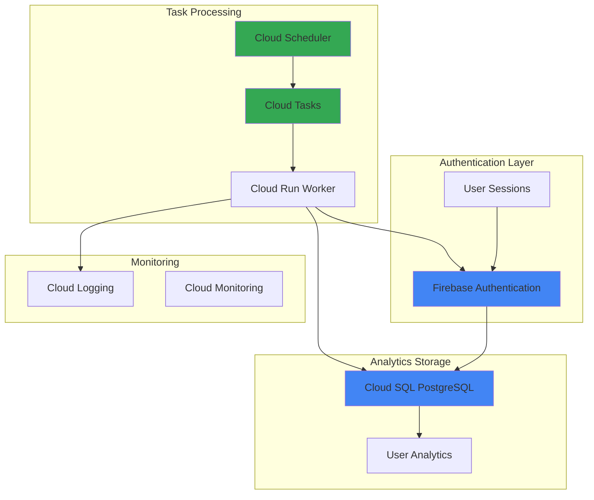

# User Lifecycle Management with Firebase Authentication and Cloud Tasks

## Problem

SaaS applications struggle with user retention and engagement tracking, often lacking automated systems to identify inactive users, send targeted re-engagement campaigns, and manage account lifecycles. Without proactive user lifecycle management, businesses lose valuable customers to churn while missing opportunities to optimize user experiences based on engagement patterns and behavioral analytics.

## Solution

Build an automated user lifecycle management system using Firebase Authentication for user identity, Cloud SQL for engagement analytics storage, Cloud Tasks for asynchronous background processing, and Cloud Scheduler for periodic automation. This serverless architecture provides scalable user tracking, automated retention workflows, and comprehensive analytics for data-driven user engagement strategies.

## Architecture Diagram



## Prerequisites

1. Google Cloud project with billing enabled and appropriate IAM permissions
2. gcloud CLI installed and authenticated (or use Cloud Shell)
3. Basic understanding of Firebase Authentication and serverless architectures
4. Familiarity with SQL databases and background task processing
5. Estimated cost: $10-20/month for moderate usage (Cloud SQL db-f1-micro, Cloud Tasks, Firebase Auth)

> **Note**: This recipe uses Firebase Authentication's free tier (50,000 monthly active users) and Cloud SQL's smallest instance size to minimize costs while demonstrating enterprise-ready patterns.

## Preparation

```bash
# Set environment variables for project and resources
export PROJECT_ID="user-lifecycle-$(date +%s)"
export REGION="us-central1"
export ZONE="us-central1-a"

# Generate unique suffix for resource names
RANDOM_SUFFIX=$(openssl rand -hex 3)
export DB_INSTANCE_NAME="user-analytics-${RANDOM_SUFFIX}"
export TASK_QUEUE_NAME="user-lifecycle-queue"
export WORKER_SERVICE_NAME="lifecycle-worker"

# Set default project and region
gcloud config set project ${PROJECT_ID}
gcloud config set compute/region ${REGION}
gcloud config set compute/zone ${ZONE}

# Enable required Google Cloud APIs
gcloud services enable firebase.googleapis.com
gcloud services enable sqladmin.googleapis.com
gcloud services enable cloudtasks.googleapis.com
gcloud services enable cloudscheduler.googleapis.com
gcloud services enable run.googleapis.com
gcloud services enable cloudbuild.googleapis.com

echo "✅ Project configured: ${PROJECT_ID}"
echo "✅ Required APIs enabled successfully"
```

## Steps

1. **Initialize Firebase Project and Authentication**:

   Firebase Authentication provides secure, scalable user identity management with built-in support for multiple authentication providers. Initializing Firebase in your Google Cloud project creates the foundation for user lifecycle tracking by providing user tokens, metadata, and authentication events that drive engagement analytics.

   ```bash
   # Install Firebase CLI if not already installed
   npm install -g firebase-tools
   
   # Authenticate with Firebase
   firebase login --reauth
   
   # Initialize Firebase project
   firebase projects:addfirebase ${PROJECT_ID}
   
   # Configure Firebase Authentication (enable in Firebase Console)
   gcloud alpha firestore databases create \
       --location=${REGION} \
       --type=firestore-native
   
   echo "✅ Firebase project initialized with Authentication enabled"
   ```

   The Firebase project is now configured with Authentication services, providing secure user identity management and the foundation for tracking user engagement patterns across your application ecosystem.

2. **Create Cloud SQL Database for User Analytics**:

   Cloud SQL provides fully managed PostgreSQL databases with automatic backups, high availability, and seamless integration with Google Cloud services. This database stores user engagement metrics, session data, and lifecycle events that enable sophisticated retention analysis and automated workflow triggers.

   ```bash
   # Create Cloud SQL PostgreSQL instance
   gcloud sql instances create ${DB_INSTANCE_NAME} \
       --database-version=POSTGRES_15 \
       --tier=db-f1-micro \
       --region=${REGION} \
       --storage-type=SSD \
       --storage-size=10GB \
       --backup-start-time=03:00
   
   # Set root password
   DB_PASSWORD=$(openssl rand -base64 32)
   gcloud sql users set-password postgres \
       --instance=${DB_INSTANCE_NAME} \
       --password=${DB_PASSWORD}
   
   # Create application database
   gcloud sql databases create user_analytics \
       --instance=${DB_INSTANCE_NAME}
   
   echo "✅ Cloud SQL instance created: ${DB_INSTANCE_NAME}"
   echo "Database password: ${DB_PASSWORD}"
   ```

   The PostgreSQL database is ready to store comprehensive user analytics including login patterns, feature usage, and engagement scores that power automated retention campaigns and lifecycle management decisions.

3. **Create User Analytics Schema**:

   Designing an effective analytics schema enables comprehensive user behavior tracking and supports complex queries for engagement analysis. This schema captures user sessions, activity patterns, and lifecycle stages that drive automated retention workflows and business intelligence insights.

   ```bash
   # Get Cloud SQL connection string
   CONNECTION_NAME=$(gcloud sql instances describe ${DB_INSTANCE_NAME} \
       --format="value(connectionName)")
   
   # Create schema using Cloud Shell SQL proxy
   gcloud sql connect ${DB_INSTANCE_NAME} --user=postgres <<EOF
   -- User engagement tracking table
   CREATE TABLE user_engagement (
       id SERIAL PRIMARY KEY,
       firebase_uid VARCHAR(128) NOT NULL UNIQUE,
       email VARCHAR(255),
       last_login TIMESTAMP WITH TIME ZONE,
       session_count INTEGER DEFAULT 0,
       total_session_duration INTEGER DEFAULT 0,
       last_activity TIMESTAMP WITH TIME ZONE,
       engagement_score DECIMAL(5,2) DEFAULT 0.00,
       lifecycle_stage VARCHAR(50) DEFAULT 'new',
       created_at TIMESTAMP WITH TIME ZONE DEFAULT NOW(),
       updated_at TIMESTAMP WITH TIME ZONE DEFAULT NOW()
   );
   
   -- User activity events table
   CREATE TABLE user_activities (
       id SERIAL PRIMARY KEY,
       firebase_uid VARCHAR(128) NOT NULL,
       activity_type VARCHAR(100) NOT NULL,
       activity_data JSONB,
       timestamp TIMESTAMP WITH TIME ZONE DEFAULT NOW()
   );
   
   -- Lifecycle automation log table
   CREATE TABLE lifecycle_actions (
       id SERIAL PRIMARY KEY,
       firebase_uid VARCHAR(128) NOT NULL,
       action_type VARCHAR(100) NOT NULL,
       action_status VARCHAR(50) DEFAULT 'pending',
       scheduled_at TIMESTAMP WITH TIME ZONE,
       executed_at TIMESTAMP WITH TIME ZONE,
       result_data JSONB,
       created_at TIMESTAMP WITH TIME ZONE DEFAULT NOW()
   );
   
   -- Create indexes for performance
   CREATE INDEX idx_user_engagement_uid ON user_engagement(firebase_uid);
   CREATE INDEX idx_user_engagement_last_login ON user_engagement(last_login);
   CREATE INDEX idx_user_engagement_lifecycle ON user_engagement(lifecycle_stage);
   CREATE INDEX idx_user_activities_uid_timestamp ON user_activities(firebase_uid, timestamp);
   CREATE INDEX idx_lifecycle_actions_uid_status ON lifecycle_actions(firebase_uid, action_status);
   
   \q
   EOF
   
   echo "✅ User analytics schema created successfully"
   ```

   The analytics schema provides comprehensive tracking capabilities for user behavior, enabling sophisticated lifecycle automation based on engagement patterns and supporting detailed business intelligence reporting.

4. **Create Cloud Tasks Queue for Background Processing**:

   Cloud Tasks provides reliable, scalable task queuing that handles background processing asynchronously, ensuring user-facing operations remain responsive while complex lifecycle automation runs efficiently. The task queue decouples user interactions from heavy analytics processing and enables retry logic for robust workflow execution.

   ```bash
   # Create App Engine application (required for Cloud Tasks)
   gcloud app create --region=${REGION}
   
   # Create Cloud Tasks queue
   gcloud tasks queues create ${TASK_QUEUE_NAME} \
       --location=${REGION} \
       --max-concurrent-dispatches=10 \
       --max-dispatches-per-second=5 \
       --max-retry-duration=3600s
   
   # Configure queue retry settings
   gcloud tasks queues update ${TASK_QUEUE_NAME} \
       --location=${REGION} \
       --min-backoff=5s \
       --max-backoff=300s \
       --max-attempts=5
   
   echo "✅ Cloud Tasks queue created: ${TASK_QUEUE_NAME}"
   echo "✅ Queue configured with retry policies for reliable processing"
   ```

   The Cloud Tasks queue is configured with appropriate retry policies and rate limiting, ensuring reliable background processing of user lifecycle events while preventing system overload during peak usage periods.

5. **Deploy Cloud Run Worker Service**:

   Cloud Run provides serverless container execution that automatically scales based on demand, making it ideal for processing user lifecycle tasks. This worker service processes queued tasks, updates user analytics, and triggers automated actions based on engagement patterns and business rules.

   ```bash
   # Create worker application directory
   mkdir -p lifecycle-worker
   cd lifecycle-worker
   
   # Create package.json for Node.js worker
   cat > package.json << 'EOF'
   {
     "name": "user-lifecycle-worker",
     "version": "1.0.0",
     "main": "index.js",
     "dependencies": {
       "express": "^4.18.2",
       "firebase-admin": "^12.0.0",
       "pg": "^8.11.0",
       "@google-cloud/tasks": "^3.0.0",
       "@google-cloud/logging": "^10.5.0"
     }
   }
   EOF
   
   # Create main worker application
   cat > index.js << 'EOF'
   const express = require('express');
   const { CloudTasksClient } = require('@google-cloud/tasks');
   const { Logging } = require('@google-cloud/logging');
   const admin = require('firebase-admin');
   const { Pool } = require('pg');
   
   // Initialize Firebase Admin SDK
   admin.initializeApp();
   
   // Initialize services
   const app = express();
   const tasksClient = new CloudTasksClient();
   const logging = new Logging();
   const log = logging.log('user-lifecycle');
   
   // Database connection
   const pool = new Pool({
     host: `/cloudsql/${process.env.CONNECTION_NAME}`,
     user: 'postgres',
     password: process.env.DB_PASSWORD,
     database: 'user_analytics',
   });
   
   app.use(express.json());
   
   // Process user engagement task
   app.post('/tasks/process-engagement', async (req, res) => {
     try {
       const { firebase_uid, activity_type, activity_data } = req.body;
       
       // Record user activity
       await pool.query(
         'INSERT INTO user_activities (firebase_uid, activity_type, activity_data) VALUES ($1, $2, $3)',
         [firebase_uid, activity_type, activity_data]
       );
       
       // Update user engagement metrics
       await updateEngagementScore(firebase_uid);
       
       // Check for lifecycle transitions
       await checkLifecycleTransition(firebase_uid);
       
       await log.info('Processed engagement task', { firebase_uid, activity_type });
       res.status(200).json({ status: 'success' });
     } catch (error) {
       await log.error('Failed to process engagement task', { error: error.message });
       res.status(500).json({ error: error.message });
     }
   });
   
   // Process retention campaign task
   app.post('/tasks/retention-campaign', async (req, res) => {
     try {
       const { firebase_uid, campaign_type } = req.body;
       
       // Get user information
       const userRecord = await admin.auth().getUser(firebase_uid);
       
       // Log campaign action
       await pool.query(
         'INSERT INTO lifecycle_actions (firebase_uid, action_type, action_status, executed_at) VALUES ($1, $2, $3, NOW())',
         [firebase_uid, campaign_type, 'completed']
       );
       
       await log.info('Processed retention campaign', { firebase_uid, campaign_type });
       res.status(200).json({ status: 'success' });
     } catch (error) {
       await log.error('Failed to process retention campaign', { error: error.message });
       res.status(500).json({ error: error.message });
     }
   });
   
   // Update engagement score based on recent activity
   async function updateEngagementScore(firebase_uid) {
     const result = await pool.query(
       `SELECT COUNT(*) as activity_count,
               EXTRACT(EPOCH FROM (NOW() - MIN(timestamp)))/86400 as days_active
        FROM user_activities 
        WHERE firebase_uid = $1 AND timestamp > NOW() - INTERVAL '30 days'`,
       [firebase_uid]
     );
     
     const { activity_count, days_active } = result.rows[0];
     const engagement_score = Math.min(100, (activity_count * 2) + (days_active * 3));
     
     await pool.query(
       `INSERT INTO user_engagement (firebase_uid, engagement_score, last_activity, updated_at)
        VALUES ($1, $2, NOW(), NOW())
        ON CONFLICT (firebase_uid) 
        DO UPDATE SET engagement_score = $2, last_activity = NOW(), updated_at = NOW()`,
       [firebase_uid, engagement_score]
     );
   }
   
   // Check for lifecycle stage transitions
   async function checkLifecycleTransition(firebase_uid) {
     const result = await pool.query(
       'SELECT engagement_score, lifecycle_stage FROM user_engagement WHERE firebase_uid = $1',
       [firebase_uid]
     );
     
     if (result.rows.length === 0) return;
     
     const { engagement_score, lifecycle_stage } = result.rows[0];
     let new_stage = lifecycle_stage;
     
     if (engagement_score > 80 && lifecycle_stage !== 'champion') {
       new_stage = 'champion';
     } else if (engagement_score > 50 && lifecycle_stage === 'new') {
       new_stage = 'active';
     } else if (engagement_score < 20 && lifecycle_stage !== 'at_risk') {
       new_stage = 'at_risk';
     }
     
     if (new_stage !== lifecycle_stage) {
       await pool.query(
         'UPDATE user_engagement SET lifecycle_stage = $1 WHERE firebase_uid = $2',
         [new_stage, firebase_uid]
       );
       
       // Schedule appropriate retention campaign
       if (new_stage === 'at_risk') {
         await scheduleRetentionCampaign(firebase_uid, 'at_risk_email');
       }
     }
   }
   
   // Schedule retention campaign task
   async function scheduleRetentionCampaign(firebase_uid, campaign_type) {
     const parent = `projects/${process.env.PROJECT_ID}/locations/${process.env.REGION}/queues/${process.env.TASK_QUEUE_NAME}`;
     
     const task = {
       httpRequest: {
         httpMethod: 'POST',
         url: `https://${process.env.WORKER_SERVICE_NAME}-${process.env.PROJECT_ID}.a.run.app/tasks/retention-campaign`,
         body: Buffer.from(JSON.stringify({ firebase_uid, campaign_type })).toString('base64'),
         headers: { 'Content-Type': 'application/json' },
       },
       scheduleTime: {
         seconds: Math.floor(Date.now() / 1000) + 3600, // 1 hour delay
       },
     };
     
     await tasksClient.createTask({ parent, task });
   }
   
   // Health check endpoint
   app.get('/health', (req, res) => {
     res.status(200).json({ status: 'healthy' });
   });
   
   const PORT = process.env.PORT || 8080;
   app.listen(PORT, () => {
     console.log(`User lifecycle worker listening on port ${PORT}`);
   });
   EOF
   
   # Create Dockerfile
   cat > Dockerfile << 'EOF'
   FROM node:18-alpine
   WORKDIR /app
   COPY package*.json ./
   RUN npm ci --only=production
   COPY . .
   EXPOSE 8080
   CMD ["node", "index.js"]
   EOF
   
   # Deploy to Cloud Run
   gcloud run deploy ${WORKER_SERVICE_NAME} \
       --source . \
       --platform managed \
       --region ${REGION} \
       --allow-unauthenticated \
       --set-env-vars="PROJECT_ID=${PROJECT_ID},REGION=${REGION},TASK_QUEUE_NAME=${TASK_QUEUE_NAME},CONNECTION_NAME=${CONNECTION_NAME},DB_PASSWORD=${DB_PASSWORD}" \
       --cpu=1 \
       --memory=512Mi \
       --timeout=300s
   
   cd ..
   
   echo "✅ Cloud Run worker service deployed successfully"
   ```

   The worker service is deployed and configured to process user lifecycle tasks asynchronously, enabling scalable background processing that maintains system responsiveness while handling complex engagement analytics and automated retention workflows.

6. **Configure Cloud Scheduler for Automated Processing**:

   Cloud Scheduler provides fully managed cron job scheduling that triggers automated user lifecycle processes at regular intervals. This automation ensures consistent engagement analysis, proactive retention campaigns, and timely lifecycle transitions without manual intervention, supporting scalable user management operations.

   ```bash
   # Create scheduled job for daily engagement analysis
   gcloud scheduler jobs create http daily-engagement-analysis \
       --location=${REGION} \
       --schedule="0 2 * * *" \
       --time-zone="UTC" \
       --uri="https://${WORKER_SERVICE_NAME}-${PROJECT_ID}.a.run.app/tasks/process-engagement" \
       --http-method=POST \
       --headers="Content-Type=application/json" \
       --message-body='{"task_type":"daily_analysis"}' \
       --attempt-deadline=300s
   
   # Create scheduled job for weekly retention campaigns
   gcloud scheduler jobs create http weekly-retention-check \
       --location=${REGION} \
       --schedule="0 10 * * 1" \
       --time-zone="UTC" \
       --uri="https://${WORKER_SERVICE_NAME}-${PROJECT_ID}.a.run.app/tasks/retention-campaign" \
       --http-method=POST \
       --headers="Content-Type=application/json" \
       --message-body='{"task_type":"weekly_retention"}' \
       --attempt-deadline=300s
   
   # Create job for monthly lifecycle review
   gcloud scheduler jobs create http monthly-lifecycle-review \
       --location=${REGION} \
       --schedule="0 8 1 * *" \
       --time-zone="UTC" \
       --uri="https://${WORKER_SERVICE_NAME}-${PROJECT_ID}.a.run.app/tasks/retention-campaign" \
       --http-method=POST \
       --headers="Content-Type=application/json" \
       --message-body='{"task_type":"lifecycle_review"}' \
       --attempt-deadline=300s
   
   echo "✅ Automated scheduling configured successfully"
   echo "✅ Jobs created: daily engagement analysis, weekly retention, monthly review"
   ```

   The scheduler configuration establishes automated workflows that run engagement analysis daily, check retention status weekly, and perform comprehensive lifecycle reviews monthly, ensuring proactive user management and optimal retention strategies.

7. **Set Up Authentication Triggers for Real-time Processing**:

   Firebase Authentication triggers enable real-time user lifecycle tracking by automatically processing authentication events such as sign-ups, sign-ins, and user deletions. These triggers ensure immediate engagement data capture and enable rapid response to user behavior changes for optimal retention strategies.

   ```bash
   # Create Firebase Functions directory
   mkdir -p firebase-functions
   cd firebase-functions
   
   # Initialize Firebase Functions
   firebase init functions --project=${PROJECT_ID}
   
   # Navigate to functions directory
   cd functions
   
   # Update package.json dependencies
   cat > package.json << 'EOF'
   {
     "name": "user-lifecycle-functions",
     "version": "1.0.0",
     "main": "index.js",
     "dependencies": {
       "firebase-functions": "^4.0.0",
       "firebase-admin": "^12.0.0",
       "@google-cloud/tasks": "^3.0.0"
     }
   }
   EOF
   
   # Create authentication trigger functions
   cat > index.js << 'EOF'
   const functions = require('firebase-functions');
   const admin = require('firebase-admin');
   const { CloudTasksClient } = require('@google-cloud/tasks');
   
   admin.initializeApp();
   const tasksClient = new CloudTasksClient();
   
   // Process new user registration
   exports.onUserCreate = functions.auth.user().onCreate(async (user) => {
     await scheduleEngagementTask(user.uid, 'user_registration', {
       email: user.email,
       provider: user.providerData[0]?.providerId || 'email',
       created_at: user.metadata.creationTime
     });
   });
   
   // Process user sign-in events
   exports.onUserSignIn = functions.auth.user().onSignIn(async (user) => {
     await scheduleEngagementTask(user.uid, 'user_signin', {
       last_sign_in: user.metadata.lastSignInTime,
       provider: user.providerData[0]?.providerId || 'email'
     });
   });
   
   // Process user deletion
   exports.onUserDelete = functions.auth.user().onDelete(async (user) => {
     await scheduleEngagementTask(user.uid, 'user_deletion', {
       deleted_at: new Date().toISOString()
     });
   });
   
   async function scheduleEngagementTask(firebase_uid, activity_type, activity_data) {
     const parent = `projects/${process.env.GCLOUD_PROJECT}/locations/us-central1/queues/user-lifecycle-queue`;
     
     const task = {
       httpRequest: {
         httpMethod: 'POST',
         url: `https://lifecycle-worker-${process.env.GCLOUD_PROJECT}.a.run.app/tasks/process-engagement`,
         body: Buffer.from(JSON.stringify({
           firebase_uid,
           activity_type,
           activity_data
         })).toString('base64'),
         headers: { 'Content-Type': 'application/json' },
       },
     };
     
     await tasksClient.createTask({ parent, task });
   }
   EOF
   
   # Deploy Firebase Functions
   firebase deploy --only functions --project=${PROJECT_ID}
   
   cd ../..
   
   echo "✅ Firebase Authentication triggers deployed successfully"
   ```

   The authentication triggers are now active, automatically capturing user events and queuing engagement processing tasks that maintain real-time analytics and enable immediate lifecycle management responses.

8. **Create User Analytics Dashboard Query Functions**:

   Comprehensive analytics queries enable data-driven insights into user behavior patterns, engagement trends, and lifecycle progression. These queries support business intelligence reporting and provide the foundation for optimizing retention strategies and improving user experience based on concrete usage data.

   ```bash
   # Create analytics query script
   cat > user-analytics-queries.sql << 'EOF'
   -- User engagement overview
   SELECT 
       lifecycle_stage,
       COUNT(*) as user_count,
       AVG(engagement_score) as avg_engagement,
       AVG(session_count) as avg_sessions
   FROM user_engagement 
   GROUP BY lifecycle_stage
   ORDER BY avg_engagement DESC;
   
   -- Daily active users trend
   SELECT 
       DATE(timestamp) as activity_date,
       COUNT(DISTINCT firebase_uid) as daily_active_users
   FROM user_activities 
   WHERE timestamp > NOW() - INTERVAL '30 days'
   GROUP BY DATE(timestamp)
   ORDER BY activity_date;
   
   -- Retention cohort analysis
   SELECT 
       lifecycle_stage,
       COUNT(*) FILTER (WHERE last_login > NOW() - INTERVAL '7 days') as active_7d,
       COUNT(*) FILTER (WHERE last_login > NOW() - INTERVAL '30 days') as active_30d,
       COUNT(*) as total_users
   FROM user_engagement
   GROUP BY lifecycle_stage;
   
   -- Campaign effectiveness
   SELECT 
       action_type,
       action_status,
       COUNT(*) as campaign_count,
       AVG(EXTRACT(EPOCH FROM (executed_at - scheduled_at))/60) as avg_delay_minutes
   FROM lifecycle_actions
   WHERE created_at > NOW() - INTERVAL '30 days'
   GROUP BY action_type, action_status
   ORDER BY campaign_count DESC;
   EOF
   
   # Create analytics helper script
   cat > run-analytics.sh << 'EOF'
   #!/bin/bash
   
   echo "Running user lifecycle analytics..."
   echo "=================================="
   
   # Connect to Cloud SQL and run analytics queries
   gcloud sql connect ${DB_INSTANCE_NAME} --user=postgres << 'SQL'
   \timing on
   \echo 'User Engagement Overview:'
   SELECT 
       lifecycle_stage,
       COUNT(*) as user_count,
       ROUND(AVG(engagement_score), 2) as avg_engagement,
       ROUND(AVG(session_count), 1) as avg_sessions
   FROM user_engagement 
   GROUP BY lifecycle_stage
   ORDER BY avg_engagement DESC;
   
   \echo 'Recent Activity Summary:'
   SELECT 
       activity_type,
       COUNT(*) as event_count,
       COUNT(DISTINCT firebase_uid) as unique_users
   FROM user_activities 
   WHERE timestamp > NOW() - INTERVAL '7 days'
   GROUP BY activity_type
   ORDER BY event_count DESC;
   \q
   SQL
   
   echo "Analytics completed successfully!"
   EOF
   
   chmod +x run-analytics.sh
   
   echo "✅ Analytics queries and dashboard tools created"
   echo "✅ Use './run-analytics.sh' to view user lifecycle insights"
   ```

   The analytics framework provides comprehensive reporting capabilities for understanding user behavior, measuring engagement effectiveness, and optimizing retention strategies based on data-driven insights from the automated lifecycle management system.

## Validation & Testing

1. **Verify Firebase Authentication Setup**:

   ```bash
   # Check Firebase project configuration
   firebase projects:list
   
   # Verify project is connected to Firebase
   gcloud projects describe ${PROJECT_ID} \
       --format="value(projectId)"
   ```

   Expected output: Project listed with Firebase Authentication enabled

2. **Test Cloud SQL Database Connection**:

   ```bash
   # Verify database instance is running
   gcloud sql instances describe ${DB_INSTANCE_NAME} \
       --format="value(state)"
   
   # Test database connection
   gcloud sql connect ${DB_INSTANCE_NAME} --user=postgres \
       --quiet << 'EOF'
   SELECT COUNT(*) FROM user_engagement;
   SELECT COUNT(*) FROM user_activities;
   \q
   EOF
   ```

   Expected output: "RUNNABLE" status and successful table queries

3. **Validate Cloud Tasks Queue Configuration**:

   ```bash
   # Check queue status and configuration
   gcloud tasks queues describe ${TASK_QUEUE_NAME} \
       --location=${REGION} \
       --format="table(name,state,retryConfig.maxAttempts)"
   
   # Test task creation
   gcloud tasks create-http-task test-task \
       --queue=${TASK_QUEUE_NAME} \
       --location=${REGION} \
       --url="https://${WORKER_SERVICE_NAME}-${PROJECT_ID}.a.run.app/health" \
       --method=GET
   ```

   Expected output: Queue in "RUNNING" state with configured retry settings

4. **Test Cloud Run Worker Service**:

   ```bash
   # Check service deployment status
   gcloud run services describe ${WORKER_SERVICE_NAME} \
       --region=${REGION} \
       --format="value(status.url,status.conditions[0].status)"
   
   # Test health endpoint
   WORKER_URL=$(gcloud run services describe ${WORKER_SERVICE_NAME} \
       --region=${REGION} --format="value(status.url)")
   
   curl -X GET "${WORKER_URL}/health"
   ```

   Expected output: Service URL with "True" status and healthy response

5. **Verify Scheduled Jobs**:

   ```bash
   # List all scheduled jobs
   gcloud scheduler jobs list --location=${REGION} \
       --format="table(name,schedule,state)"
   
   # Test job execution manually
   gcloud scheduler jobs run daily-engagement-analysis \
       --location=${REGION}
   ```

   Expected output: Jobs listed in "ENABLED" state with successful test execution

## Cleanup

1. **Remove Firebase Functions and Authentication**:

   ```bash
   # Delete Firebase Functions
   cd firebase-functions/functions
   firebase functions:delete onUserCreate --project=${PROJECT_ID} --force
   firebase functions:delete onUserSignIn --project=${PROJECT_ID} --force
   firebase functions:delete onUserDelete --project=${PROJECT_ID} --force
   cd ../..
   
   echo "✅ Firebase Functions deleted"
   ```

2. **Delete Cloud Scheduler Jobs**:

   ```bash
   # Remove all scheduled jobs
   gcloud scheduler jobs delete daily-engagement-analysis \
       --location=${REGION} --quiet
   gcloud scheduler jobs delete weekly-retention-check \
       --location=${REGION} --quiet
   gcloud scheduler jobs delete monthly-lifecycle-review \
       --location=${REGION} --quiet
   
   echo "✅ Scheduled jobs deleted"
   ```

3. **Remove Cloud Run Service and Tasks Queue**:

   ```bash
   # Delete Cloud Run service
   gcloud run services delete ${WORKER_SERVICE_NAME} \
       --region=${REGION} --quiet
   
   # Delete Cloud Tasks queue
   gcloud tasks queues delete ${TASK_QUEUE_NAME} \
       --location=${REGION} --quiet
   
   echo "✅ Cloud Run service and Tasks queue deleted"
   ```

4. **Delete Cloud SQL Database**:

   ```bash
   # Delete Cloud SQL instance
   gcloud sql instances delete ${DB_INSTANCE_NAME} --quiet
   
   echo "✅ Cloud SQL instance deleted"
   ```

5. **Clean Up Project Resources**:

   ```bash
   # Remove local directories
   rm -rf lifecycle-worker firebase-functions
   rm -f user-analytics-queries.sql run-analytics.sh
   
   # Optional: Delete entire project
   # gcloud projects delete ${PROJECT_ID} --quiet
   
   echo "✅ Local resources cleaned up"
   echo "Note: Project deletion is optional and will remove all resources permanently"
   ```

## Discussion

This user lifecycle management system demonstrates a sophisticated serverless architecture that combines Firebase Authentication's robust identity management with Google Cloud's scalable background processing capabilities. The solution addresses the critical business challenge of user retention by providing automated engagement tracking, intelligent lifecycle stage classification, and proactive retention campaigns based on user behavior patterns.

The architecture leverages Cloud Tasks for reliable asynchronous processing, ensuring that user-facing operations remain responsive while complex analytics and automation workflows execute in the background. Cloud SQL provides the analytical foundation with a well-designed schema that supports both real-time engagement tracking and comprehensive business intelligence reporting. The integration of Cloud Scheduler enables fully automated workflows that operate continuously without manual intervention.

Firebase Authentication triggers create a real-time data pipeline that captures user events immediately, enabling rapid response to engagement changes and lifecycle transitions. This immediate processing capability is crucial for implementing effective retention strategies, as research shows that timely intervention significantly improves user retention rates. The system's modular design supports easy extension with additional triggers, analytics queries, and automation workflows.

The solution implements industry best practices for user lifecycle management, including engagement scoring algorithms, lifecycle stage classification, and automated retention campaign scheduling. The analytics framework provides comprehensive insights into user behavior patterns, campaign effectiveness, and retention trends, enabling data-driven optimization of user engagement strategies. The serverless architecture ensures cost-effective scaling, with resources automatically adjusting to usage patterns.

> **Tip**: Monitor Cloud Tasks queue metrics and Cloud Run service performance to optimize processing efficiency and identify bottlenecks in user lifecycle workflows. Use Cloud Monitoring dashboards to track engagement trends and campaign effectiveness over time.

For production deployments, consider implementing additional security measures such as VPC Service Controls for Cloud SQL access, custom authentication for Cloud Run endpoints, and encryption of sensitive user data. The system can be enhanced with machine learning models for predictive churn analysis and personalized retention campaign optimization using Vertex AI services.

Key references for implementation details include the [Firebase Authentication documentation](https://firebase.google.com/docs/auth), [Cloud Tasks best practices guide](https://cloud.google.com/tasks/docs/dual-overview), [Cloud SQL performance optimization](https://cloud.google.com/sql/docs/postgres/optimize-performance), [Cloud Scheduler configuration guide](https://cloud.google.com/scheduler/docs), and [Cloud Run container deployment patterns](https://cloud.google.com/run/docs/deploying).

## Challenge

Extend this user lifecycle management system by implementing these advanced capabilities:

1. **Implement ML-powered churn prediction** using Vertex AI to analyze user behavior patterns and predict likelihood of user churn with BigQuery ML integration for advanced analytics.

2. **Add personalized retention campaigns** with dynamic content generation based on user preferences, activity history, and engagement patterns using Cloud Natural Language API for content optimization.

3. **Create real-time engagement dashboards** using Looker Studio with live data connections to Cloud SQL for executive reporting and operational monitoring.

4. **Integrate multi-channel communication** by adding SMS notifications via Cloud Messaging, push notifications through Firebase Cloud Messaging, and email campaigns through third-party services.

5. **Implement A/B testing framework** for retention campaigns using Firebase Remote Config and custom analytics to measure campaign effectiveness and optimize user engagement strategies.

## Infrastructure Code

*Infrastructure code will be generated after recipe approval.*