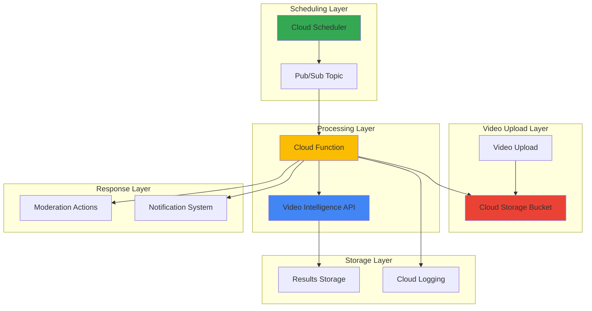

# Video Content Moderation Workflows with Video Intelligence API and Cloud Scheduler

## Problem

Media companies and content platforms face the challenge of scaling video content moderation across thousands of uploaded videos daily. Manual review processes are time-consuming, costly, and inconsistent, while inappropriate content can damage brand reputation and violate platform policies. Organizations need automated, scheduled batch processing systems that can detect explicit content, violence, and other policy violations in video uploads while maintaining audit trails for compliance and human review workflows.

## Solution

This solution implements an automated video content moderation workflow using Google Cloud's Video Intelligence API for machine learning-based content analysis, combined with Cloud Scheduler for batch processing automation. The system processes uploaded videos on a scheduled basis, analyzes content for policy violations, and triggers appropriate responses including flagging, quarantining, or approving content based on confidence scores and business rules.

## Architecture Diagram



## Prerequisites

1. Google Cloud account with appropriate permissions for Video Intelligence API, Cloud Scheduler, Cloud Functions, and Cloud Storage
2. Google Cloud CLI v2 installed and configured (or Google Cloud Shell)
3. Basic understanding of video content moderation workflows and API concepts
4. Python 3.9+ knowledge for Cloud Functions development
5. Estimated cost: $10-50/month for moderate usage (depends on video volume and processing frequency)

> **Note**: The Video Intelligence API has specific pricing based on video duration analyzed. Review the [pricing documentation](https://cloud.google.com/video-intelligence/pricing) to understand costs for your expected video volume.

## Preparation

```bash
# Set environment variables for GCP resources
export PROJECT_ID="video-moderation-$(date +%s)"
export REGION="us-central1"
export ZONE="us-central1-a"

# Generate unique suffix for resource names
RANDOM_SUFFIX=$(openssl rand -hex 3)
export BUCKET_NAME="video-moderation-${RANDOM_SUFFIX}"
export FUNCTION_NAME="video-moderator-${RANDOM_SUFFIX}"
export SCHEDULER_JOB="moderation-job-${RANDOM_SUFFIX}"
export PUBSUB_TOPIC="video-moderation-${RANDOM_SUFFIX}"

# Set default project and region
gcloud config set project ${PROJECT_ID}
gcloud config set compute/region ${REGION}
gcloud config set compute/zone ${ZONE}

# Enable required APIs
gcloud services enable videointelligence.googleapis.com
gcloud services enable cloudfunctions.googleapis.com
gcloud services enable cloudscheduler.googleapis.com
gcloud services enable pubsub.googleapis.com
gcloud services enable storage.googleapis.com
gcloud services enable logging.googleapis.com

echo "✅ Project configured: ${PROJECT_ID}"
echo "✅ Resources will use suffix: ${RANDOM_SUFFIX}"
```

## Steps

1. **Create Cloud Storage Bucket for Video Processing**:

   Cloud Storage serves as the central repository for video files requiring moderation analysis. Creating a bucket with appropriate location and storage class settings establishes the foundation for a scalable video processing pipeline. The bucket configuration includes lifecycle policies for cost optimization and access controls for security, ensuring that video content is properly managed throughout the moderation workflow.

   ```bash
   # Create primary storage bucket for video files
   gsutil mb -p ${PROJECT_ID} \
       -c STANDARD \
       -l ${REGION} \
       gs://${BUCKET_NAME}
   
   # Enable versioning for data protection
   gsutil versioning set on gs://${BUCKET_NAME}
   
   # Create folder structure for organized video processing
   echo "Processing videos..." | gsutil cp - gs://${BUCKET_NAME}/processing/.keep
   echo "Approved videos..." | gsutil cp - gs://${BUCKET_NAME}/approved/.keep
   echo "Flagged videos..." | gsutil cp - gs://${BUCKET_NAME}/flagged/.keep
   
   echo "✅ Cloud Storage bucket created: gs://${BUCKET_NAME}"
   ```

   The storage bucket now provides organized folder structure for video workflow management, with versioning enabled for data protection and recovery. This foundational component supports the entire moderation pipeline while Google's global infrastructure ensures low-latency access and high availability for video processing operations.

2. **Create Pub/Sub Topic for Event-Driven Processing**:

   Google Cloud Pub/Sub provides the messaging foundation for decoupling the scheduling system from video processing functions. Creating a topic with appropriate message retention and delivery settings enables reliable, scalable communication between Cloud Scheduler and the moderation workflow components.

   ```bash
   # Create Pub/Sub topic for moderation events
   gcloud pubsub topics create ${PUBSUB_TOPIC}
   
   # Configure message retention for reliability
   gcloud pubsub topics update ${PUBSUB_TOPIC} \
       --message-retention-duration=24h
   
   # Create subscription for function processing
   gcloud pubsub subscriptions create ${PUBSUB_TOPIC}-sub \
       --topic=${PUBSUB_TOPIC} \
       --ack-deadline=600 \
       --message-retention-duration=24h
   
   echo "✅ Pub/Sub topic created: ${PUBSUB_TOPIC}"
   ```

   The Pub/Sub infrastructure now enables asynchronous, reliable message delivery between scheduling and processing components, with extended acknowledgment deadlines to accommodate video processing duration and message retention for fault tolerance.

3. **Create Cloud Function for Video Intelligence Processing**:

   Cloud Functions provides the serverless compute environment for video content analysis using the Video Intelligence API. The function handles video processing requests, analyzes content for explicit material, and implements business logic for moderation decisions based on confidence scores and content policies.

   ```bash
   # Create local function directory
   mkdir -p cloud-function
   cd cloud-function
   
   # Create function source code
   cat > main.py << 'EOF'
import json
import os
import logging
from google.cloud import videointelligence
from google.cloud import storage
from google.cloud import logging as cloud_logging
import functions_framework

# Configure logging
cloud_logging.Client().setup_logging()
logger = logging.getLogger(__name__)

@functions_framework.cloud_event
def video_moderation_handler(cloud_event):
    """
    Process video moderation requests triggered by Cloud Scheduler.
    Analyzes videos for explicit content using Video Intelligence API.
    """
    try:
        # Initialize clients
        video_client = videointelligence.VideoIntelligenceServiceClient()
        storage_client = storage.Client()
        
        # Parse message data
        message_data = json.loads(cloud_event.data.get('message', {}).get('data', '{}'))
        bucket_name = message_data.get('bucket', os.environ['BUCKET_NAME'])
        
        logger.info(f"Processing moderation for bucket: {bucket_name}")
        
        # List videos in processing folder
        bucket = storage_client.bucket(bucket_name)
        blobs = list(bucket.list_blobs(prefix='processing/'))
        
        for blob in blobs:
            if blob.name.endswith(('.mp4', '.avi', '.mov', '.mkv')):
                process_video(video_client, storage_client, bucket_name, blob.name)
        
        logger.info("Video moderation batch processing completed")
        
    except Exception as e:
        logger.error(f"Error in video moderation: {str(e)}")
        raise

def process_video(video_client, storage_client, bucket_name, video_path):
    """
    Analyze individual video for explicit content and take moderation action.
    """
    try:
        # Configure video analysis request
        gcs_uri = f"gs://{bucket_name}/{video_path}"
        features = [videointelligence.Feature.EXPLICIT_CONTENT_DETECTION]
        
        logger.info(f"Analyzing video: {gcs_uri}")
        
        # Submit video for analysis
        operation = video_client.annotate_video(
            request={
                "input_uri": gcs_uri,
                "features": features,
            }
        )
        
        # Wait for analysis completion
        result = operation.result(timeout=300)
        
        # Process explicit content detection results
        moderation_result = analyze_explicit_content(result)
        
        # Take moderation action based on analysis
        take_moderation_action(storage_client, bucket_name, video_path, moderation_result)
        
        logger.info(f"Video analysis completed: {video_path}")
        
    except Exception as e:
        logger.error(f"Error processing video {video_path}: {str(e)}")

def analyze_explicit_content(result):
    """
    Analyze explicit content detection results and determine moderation action.
    """
    explicit_annotation = result.annotation_results[0].explicit_annotation
    
    # Calculate overall confidence score
    total_frames = len(explicit_annotation.frames)
    if total_frames == 0:
        return {"action": "approve", "confidence": 0.0, "reason": "No frames analyzed"}
    
    high_confidence_count = 0
    total_confidence = 0
    
    for frame in explicit_annotation.frames:
        confidence = frame.pornography_likelihood.value
        total_confidence += confidence
        
        # Count high-confidence explicit content frames
        if confidence >= 3:  # POSSIBLE or higher
            high_confidence_count += 1
    
    average_confidence = total_confidence / total_frames
    explicit_ratio = high_confidence_count / total_frames
    
    # Determine moderation action
    if explicit_ratio > 0.1 or average_confidence > 3:
        return {
            "action": "flag",
            "confidence": average_confidence,
            "explicit_ratio": explicit_ratio,
            "reason": f"High explicit content ratio: {explicit_ratio:.2%}"
        }
    else:
        return {
            "action": "approve",
            "confidence": average_confidence,
            "explicit_ratio": explicit_ratio,
            "reason": "Content within acceptable thresholds"
        }

def take_moderation_action(storage_client, bucket_name, video_path, moderation_result):
    """
    Move video to appropriate folder based on moderation result.
    """
    bucket = storage_client.bucket(bucket_name)
    source_blob = bucket.blob(video_path)
    
    # Determine target folder based on moderation action
    if moderation_result["action"] == "flag":
        target_path = video_path.replace("processing/", "flagged/")
    else:
        target_path = video_path.replace("processing/", "approved/")
    
    # Copy video to target folder
    target_blob = bucket.copy_blob(source_blob, bucket, target_path)
    
    # Delete original video from processing folder
    source_blob.delete()
    
    # Log moderation decision
    logger.info(f"Video moderation completed - Action: {moderation_result['action']}, "
                f"Confidence: {moderation_result['confidence']:.2f}, "
                f"Target: {target_path}")
EOF
   
   # Create requirements file
   cat > requirements.txt << 'EOF'
google-cloud-videointelligence==2.13.3
google-cloud-storage==2.10.0
google-cloud-logging==3.8.0
functions-framework==3.4.0
EOF
   
   echo "✅ Cloud Function source code created"
   ```

   The Cloud Function implements comprehensive video content analysis with the Video Intelligence API, including explicit content detection, confidence scoring, and automated moderation actions. This serverless approach scales automatically with video processing demand while maintaining cost efficiency.

4. **Deploy Cloud Function with Appropriate Configuration**:

   Deploying the Cloud Function requires specific configuration for video processing workloads, including extended timeout settings, sufficient memory allocation, and environment variables for resource access. The deployment establishes the compute environment for video analysis operations.

   ```bash
   # Deploy function with video processing configuration
   gcloud functions deploy ${FUNCTION_NAME} \
       --gen2 \
       --region=${REGION} \
       --runtime=python311 \
       --source=. \
       --entry-point=video_moderation_handler \
       --trigger-topic=${PUBSUB_TOPIC} \
       --timeout=540 \
       --memory=1024Mi \
       --max-instances=10 \
       --set-env-vars=BUCKET_NAME=${BUCKET_NAME}
   
   # Verify function deployment
   gcloud functions describe ${FUNCTION_NAME} \
       --region=${REGION} \
       --format="value(status)"
   
   cd ..
   echo "✅ Cloud Function deployed: ${FUNCTION_NAME}"
   ```

   The Cloud Function is now deployed with optimized configuration for video processing, including extended timeout for Video Intelligence API calls and appropriate memory allocation for video analysis workloads, ensuring reliable processing of varying video sizes and durations.

5. **Create Service Account for Cloud Scheduler**:

   Google Cloud service accounts provide secure, programmatic access to Google Cloud services. Creating a dedicated service account for Cloud Scheduler follows the principle of least privilege, ensuring the scheduler has only the necessary permissions to trigger video moderation workflows.

   ```bash
   # Create service account for scheduler
   gcloud iam service-accounts create video-moderation-scheduler \
       --display-name="Video Moderation Scheduler" \
       --description="Service account for automated video moderation scheduling"
   
   # Grant necessary permissions for Pub/Sub publishing
   gcloud projects add-iam-policy-binding ${PROJECT_ID} \
       --member="serviceAccount:video-moderation-scheduler@${PROJECT_ID}.iam.gserviceaccount.com" \
       --role="roles/pubsub.publisher"
   
   # Grant permissions for Cloud Scheduler operations
   gcloud projects add-iam-policy-binding ${PROJECT_ID} \
       --member="serviceAccount:video-moderation-scheduler@${PROJECT_ID}.iam.gserviceaccount.com" \
       --role="roles/cloudscheduler.jobRunner"
   
   echo "✅ Service account created: video-moderation-scheduler"
   ```

   The service account now provides secure authentication for Cloud Scheduler operations with minimal required permissions, enabling automated video moderation workflows while maintaining security best practices and audit compliance.

6. **Configure Cloud Scheduler Job for Batch Processing**:

   Cloud Scheduler provides managed cron job functionality for triggering video moderation workflows at regular intervals. Configuring the scheduler job with appropriate frequency and payload ensures consistent batch processing of uploaded videos according to business requirements.

   ```bash
   # Create scheduled job for video moderation
   gcloud scheduler jobs create pubsub ${SCHEDULER_JOB} \
       --schedule="0 */4 * * *" \
       --topic=${PUBSUB_TOPIC} \
       --message-body='{"bucket":"'${BUCKET_NAME}'","trigger":"scheduled"}' \
       --time-zone="America/New_York" \
       --location=${REGION}
   
   # Verify scheduler job creation
   gcloud scheduler jobs describe ${SCHEDULER_JOB} \
       --location=${REGION} \
       --format="value(state)"
   
   echo "✅ Cloud Scheduler job created: ${SCHEDULER_JOB}"
   echo "✅ Schedule: Every 4 hours for batch video processing"
   ```

   The Cloud Scheduler job now provides automated triggering of video moderation workflows every 4 hours, ensuring timely processing of uploaded video content while balancing processing costs and business requirements for content review timelines.

7. **Create IAM Roles for Video Intelligence API Access**:

   The Cloud Function requires appropriate IAM permissions to access the Video Intelligence API and Cloud Storage resources. Configuring these permissions ensures the function can analyze video content and manage processed files according to moderation decisions.

   ```bash
   # Grant Video Intelligence API access to function
   gcloud projects add-iam-policy-binding ${PROJECT_ID} \
       --member="serviceAccount:${PROJECT_ID}@appspot.gserviceaccount.com" \
       --role="roles/videointelligence.editor"
   
   # Grant Storage access for video file management
   gcloud projects add-iam-policy-binding ${PROJECT_ID} \
       --member="serviceAccount:${PROJECT_ID}@appspot.gserviceaccount.com" \
       --role="roles/storage.objectAdmin"
   
   # Grant logging permissions for audit trail
   gcloud projects add-iam-policy-binding ${PROJECT_ID} \
       --member="serviceAccount:${PROJECT_ID}@appspot.gserviceaccount.com" \
       --role="roles/logging.logWriter"
   
   echo "✅ IAM permissions configured for video processing"
   ```

   The IAM configuration now provides the Cloud Function with necessary permissions for Video Intelligence API operations, Cloud Storage management, and logging capabilities, enabling complete video moderation workflow functionality while maintaining security principles.

8. **Upload Sample Video for Testing**:

   Testing the video moderation workflow requires sample video content to validate the analysis and processing pipeline. Uploading test videos to the processing folder triggers the moderation workflow and demonstrates the complete system functionality.

   ```bash
   # Create sample video placeholder for testing
   echo "This is a sample video file for testing video moderation workflow" > sample-video.txt
   
   # Upload sample to processing folder
   gsutil cp sample-video.txt gs://${BUCKET_NAME}/processing/sample-video.mp4
   
   # Verify upload
   gsutil ls gs://${BUCKET_NAME}/processing/
   
   echo "✅ Sample video uploaded for testing"
   echo "✅ Video moderation workflow ready for validation"
   ```

   The sample video provides a test case for validating the complete video moderation pipeline, from Cloud Scheduler triggering through Video Intelligence API analysis to final moderation action and file organization.

## Validation & Testing

1. **Verify Cloud Scheduler Job Status**:

   ```bash
   # Check scheduler job configuration
   gcloud scheduler jobs describe ${SCHEDULER_JOB} \
       --location=${REGION} \
       --format="table(name,schedule,state,timeZone)"
   ```

   Expected output: Job should show as "ENABLED" with correct schedule configuration.

2. **Test Manual Job Execution**:

   ```bash
   # Manually trigger the scheduler job
   gcloud scheduler jobs run ${SCHEDULER_JOB} \
       --location=${REGION}
   
   # Check job execution status
   gcloud scheduler jobs describe ${SCHEDULER_JOB} \
       --location=${REGION} \
       --format="value(status.details)"
   ```

3. **Verify Cloud Function Execution**:

   ```bash
   # Check function logs for processing results
   gcloud functions logs read ${FUNCTION_NAME} \
       --region=${REGION} \
       --limit=50
   
   # Verify function metrics
   gcloud functions describe ${FUNCTION_NAME} \
       --region=${REGION} \
       --format="value(status)"
   ```

4. **Validate Video Processing Results**:

   ```bash
   # Check approved videos folder
   gsutil ls gs://${BUCKET_NAME}/approved/
   
   # Check flagged videos folder
   gsutil ls gs://${BUCKET_NAME}/flagged/
   
   # Verify processing folder is empty
   gsutil ls gs://${BUCKET_NAME}/processing/
   ```

5. **Test Pub/Sub Message Flow**:

   ```bash
   # Verify Pub/Sub topic configuration
   gcloud pubsub topics describe ${PUBSUB_TOPIC}
   
   # Check subscription status
   gcloud pubsub subscriptions describe ${PUBSUB_TOPIC}-sub
   ```

## Cleanup

1. **Delete Cloud Scheduler Job**:

   ```bash
   # Delete scheduler job
   gcloud scheduler jobs delete ${SCHEDULER_JOB} \
       --location=${REGION} \
       --quiet
   
   echo "✅ Deleted Cloud Scheduler job"
   ```

2. **Remove Cloud Function**:

   ```bash
   # Delete Cloud Function
   gcloud functions delete ${FUNCTION_NAME} \
       --region=${REGION} \
       --quiet
   
   echo "✅ Deleted Cloud Function"
   ```

3. **Clean Up Pub/Sub Resources**:

   ```bash
   # Delete Pub/Sub subscription
   gcloud pubsub subscriptions delete ${PUBSUB_TOPIC}-sub --quiet
   
   # Delete Pub/Sub topic
   gcloud pubsub topics delete ${PUBSUB_TOPIC} --quiet
   
   echo "✅ Deleted Pub/Sub resources"
   ```

4. **Remove Storage Bucket**:

   ```bash
   # Delete all objects in bucket
   gsutil -m rm -r gs://${BUCKET_NAME}
   
   echo "✅ Deleted Cloud Storage bucket"
   ```

5. **Remove Service Account**:

   ```bash
   # Delete service account
   gcloud iam service-accounts delete \
       video-moderation-scheduler@${PROJECT_ID}.iam.gserviceaccount.com \
       --quiet
   
   echo "✅ Deleted service account"
   ```

6. **Clean Up Environment Variables**:

   ```bash
   # Clear environment variables
   unset PROJECT_ID REGION ZONE BUCKET_NAME FUNCTION_NAME
   unset SCHEDULER_JOB PUBSUB_TOPIC RANDOM_SUFFIX
   
   echo "✅ Environment variables cleared"
   ```

## Discussion

This video content moderation solution demonstrates the power of combining Google Cloud's Video Intelligence API with automated scheduling and serverless computing to create a scalable, cost-effective content moderation system. The architecture leverages Google's machine learning capabilities for content analysis while providing flexibility in moderation policies and actions.

The Video Intelligence API's explicit content detection feature uses advanced machine learning models trained on diverse video content to identify inappropriate material with high accuracy. The system analyzes video frames for pornography likelihood and provides confidence scores that enable businesses to implement custom moderation thresholds. This approach significantly reduces the manual effort required for content review while maintaining quality standards and compliance requirements.

The serverless architecture using Cloud Functions provides automatic scaling based on video processing demand, ensuring cost efficiency during low-traffic periods while handling traffic spikes during peak upload times. Cloud Scheduler enables predictable batch processing that balances moderation timeliness with processing costs, while Pub/Sub ensures reliable message delivery even during system failures or maintenance windows.

The solution's modular design allows for easy extension with additional Video Intelligence API features such as object detection, text recognition, or speech transcription for more comprehensive content analysis. Organizations can customize moderation policies by adjusting confidence thresholds, implementing human review workflows for borderline content, or integrating with existing content management systems for seamless operations.

> **Tip**: Consider implementing a human review queue for videos with moderate confidence scores to balance automation with human judgment. This hybrid approach often provides the best results for content moderation workflows.

Key references for implementation details include the [Video Intelligence API documentation](https://cloud.google.com/video-intelligence/docs), [Cloud Scheduler configuration guide](https://cloud.google.com/scheduler/docs), [Cloud Functions best practices](https://cloud.google.com/functions/docs/bestpractices), and the [Google Cloud Architecture Framework](https://cloud.google.com/architecture/framework) for scalable system design. The [Video Intelligence API pricing documentation](https://cloud.google.com/video-intelligence/pricing) provides detailed cost analysis for planning production deployments.

## Challenge

Extend this solution by implementing these enhancements:

1. **Multi-Feature Analysis**: Integrate additional Video Intelligence API features like object detection, text recognition, and speech transcription to create comprehensive content analysis profiles for each video.

2. **Human Review Workflow**: Implement a web interface using App Engine that allows human moderators to review flagged content, with integration to Firestore for tracking review decisions and moderator performance metrics.

3. **Real-time Processing**: Modify the system to process videos immediately upon upload using Cloud Storage triggers instead of scheduled batch processing, with fallback to batch processing for error handling.

4. **Advanced Moderation Policies**: Create a policy engine using Cloud Firestore that allows dynamic configuration of moderation rules, confidence thresholds, and actions based on content categories, user types, or geographic regions.

5. **Integration with External Systems**: Build connectors to popular content management systems, social media platforms, or video hosting services using Cloud Run services that can import videos for analysis and export moderation results.

## Infrastructure Code

### Available Infrastructure as Code:

- [Infrastructure Code Overview](code/README.md) - Detailed description of all infrastructure components
- [Infrastructure Manager](code/infrastructure-manager/) - GCP Infrastructure Manager templates
- [Bash CLI Scripts](code/scripts/) - Example bash scripts using gcloud CLI commands to deploy infrastructure
- [Terraform](code/terraform/) - Terraform configuration files