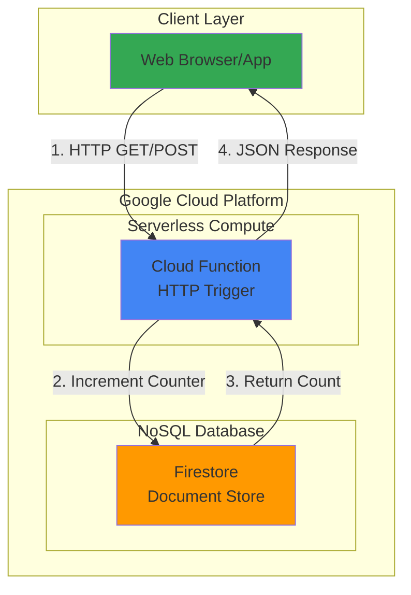

# Simple Visitor Counter with Cloud Functions and Firestore

## Problem

Many websites and applications need to track page visits or user interactions to understand usage patterns and engagement metrics. Traditional server-based solutions require maintaining dedicated infrastructure, managing databases, and handling traffic spikes manually. Small projects often lack the resources for complex analytics platforms, yet still need simple, reliable visitor counting functionality that scales automatically without operational overhead.

## Solution

Create a serverless visitor counter using Google Cloud Functions to handle HTTP requests and Firestore to store visit counts. This approach provides automatic scaling, zero infrastructure management, and pay-per-use pricing. Cloud Functions processes incoming requests and atomically increments counters in Firestore using the built-in increment operation, ensuring accurate counts even under concurrent load.

## Architecture Diagram



## Prerequisites

1. Google Cloud Platform account with billing enabled
2. Google Cloud CLI installed and configured (or use Cloud Shell)
3. Basic understanding of JavaScript/Node.js and HTTP APIs
4. Project with Cloud Functions and Firestore APIs enabled
5. Estimated cost: $0.00-$0.50/month for typical usage (both services have generous free tiers)

> **Note**: Cloud Functions provides 2 million invocations per month free, and Firestore includes 20,000 document writes per day at no cost.

## Preparation

```bash
# Set environment variables for GCP resources
export PROJECT_ID="visitor-counter-$(date +%s)"
export REGION="us-central1"
export FUNCTION_NAME="visit-counter"

# Generate unique suffix for resource names
RANDOM_SUFFIX=$(openssl rand -hex 3)

# Create and set the project
gcloud projects create ${PROJECT_ID} \
    --name="Visitor Counter Demo"
gcloud config set project ${PROJECT_ID}
gcloud config set functions/region ${REGION}

# Enable required APIs
gcloud services enable cloudfunctions.googleapis.com
gcloud services enable firestore.googleapis.com
gcloud services enable cloudbuild.googleapis.com

# Initialize Firestore in Native mode
gcloud firestore databases create --region=${REGION}

echo "✅ Project configured: ${PROJECT_ID}"
echo "✅ Firestore database initialized in region: ${REGION}"
```

## Steps

1. **Create the Cloud Function source code**:

   Cloud Functions provides serverless execution for handling HTTP requests without managing servers. The function will use the Firestore Node.js client library to interact with the database, leveraging atomic increment operations to ensure accurate counting even under concurrent access.

   ```bash
   # Create function directory and navigate to it
   mkdir visit-counter-function
   cd visit-counter-function
   
   echo "✅ Created function directory"
   ```

2. **Initialize the Node.js project with dependencies**:

   The package.json file defines the runtime environment and dependencies. We'll use the Google Cloud Functions Framework for local testing and the Firestore client library for database operations. Node.js 20 is the latest supported runtime for Cloud Functions.

   ```bash
   # Create package.json with required dependencies
   cat > package.json << 'EOF'
   {
     "name": "visit-counter",
     "version": "1.0.0",
     "description": "Simple visitor counter using Cloud Functions and Firestore",
     "main": "index.js",
     "engines": {
       "node": "20"
     },
     "dependencies": {
       "@google-cloud/firestore": "^7.1.0",
       "@google-cloud/functions-framework": "^3.3.0"
     }
   }
   EOF
   
   echo "✅ Created package.json with Node.js 20 runtime"
   ```

3. **Implement the visitor counter function**:

   The main function handles HTTP requests and implements the core counter logic. It uses Firestore's FieldValue.increment() method to atomically update the counter, preventing race conditions when multiple requests arrive simultaneously. CORS headers enable browser-based requests from any origin.

   ```bash
   # Create the main function file
   cat > index.js << 'EOF'
   const { Firestore, FieldValue } = require('@google-cloud/firestore');
   const functions = require('@google-cloud/functions-framework');
   
   // Initialize Firestore client
   const firestore = new Firestore();
   
   // Register HTTP function
   functions.http('visitCounter', async (req, res) => {
     // Enable CORS for browser requests
     res.set('Access-Control-Allow-Origin', '*');
     res.set('Access-Control-Allow-Methods', 'GET, POST');
     res.set('Access-Control-Allow-Headers', 'Content-Type');
     
     if (req.method === 'OPTIONS') {
       res.status(204).send('');
       return;
     }
     
     try {
       // Get page parameter or use default
       const page = req.query.page || req.body?.page || 'default';
       
       // Validate page parameter to prevent injection
       if (!/^[a-zA-Z0-9_-]+$/.test(page)) {
         return res.status(400).json({
           error: 'Invalid page parameter',
           message: 'Page parameter must contain only letters, numbers, hyphens, and underscores'
         });
       }
       
       // Reference to the counter document
       const counterDoc = firestore.collection('counters').doc(page);
       
       // Atomically increment the counter
       await counterDoc.set({
         count: FieldValue.increment(1),
         lastVisit: FieldValue.serverTimestamp()
       }, { merge: true });
       
       // Get the updated count
       const doc = await counterDoc.get();
       const currentCount = doc.exists ? doc.data().count : 1;
       
       // Return the current count
       res.json({
         page: page,
         visits: currentCount,
         timestamp: new Date().toISOString()
       });
       
     } catch (error) {
       console.error('Error updating counter:', error);
       res.status(500).json({
         error: 'Failed to update counter',
         message: error.message
       });
     }
   });
   EOF
   
   echo "✅ Created Cloud Function with Firestore integration"
   ```

4. **Deploy the Cloud Function**:

   Deployment packages the function code and creates the serverless endpoint. The Cloud Functions service automatically provisions compute resources and sets up HTTP triggers based on the function configuration. The function is deployed with unauthenticated access for easy testing.

   ```bash
   # Deploy the function with HTTP trigger
   gcloud functions deploy ${FUNCTION_NAME} \
       --gen2 \
       --runtime nodejs20 \
       --trigger-http \
       --allow-unauthenticated \
       --source . \
       --entry-point visitCounter \
       --memory 256MB \
       --timeout 60s \
       --region ${REGION}
   
   # Get the function URL
   FUNCTION_URL=$(gcloud functions describe ${FUNCTION_NAME} \
       --region=${REGION} \
       --format="value(serviceConfig.uri)")
   
   echo "✅ Function deployed successfully"
   echo "Function URL: ${FUNCTION_URL}"
   ```

5. **Test the visitor counter with default page**:

   Testing verifies that the function correctly increments counters and returns appropriate responses. Each request should increase the count by one, demonstrating the atomic increment functionality.

   ```bash
   # Test the counter multiple times
   echo "Testing visitor counter..."
   
   for i in {1..3}; do
     echo "Visit $i:"
     curl -s "${FUNCTION_URL}" | jq '.'
     sleep 1
   done
   
   echo "✅ Default page counter tested successfully"
   ```

6. **Test with different page names**:

   The counter supports tracking multiple pages by using different document IDs in Firestore. This demonstrates how a single function can manage counters for multiple pages or sections of a website.

   ```bash
   # Test with specific page names
   echo "Testing different page counters..."
   
   # Test home page
   curl -s "${FUNCTION_URL}?page=home" | jq '.'
   
   # Test about page
   curl -s "${FUNCTION_URL}?page=about" | jq '.'
   
   # Test home page again to see increment
   curl -s "${FUNCTION_URL}?page=home" | jq '.'
   
   echo "✅ Multiple page counters tested successfully"
   ```

## Validation & Testing

1. **Verify Firestore documents were created**:

   ```bash
   # List documents in the counters collection
   gcloud firestore documents list \
       --collection-path=counters \
       --format="table(name,createTime,updateTime)"
   
   # Query specific counter document
   gcloud firestore documents describe \
       "projects/${PROJECT_ID}/databases/(default)/documents/counters/default"
   ```

   Expected output: Document metadata showing counter documents with creation and update timestamps.

2. **Test error handling with invalid requests**:

   ```bash
   # Test POST request with JSON payload
   curl -X POST "${FUNCTION_URL}" \
        -H "Content-Type: application/json" \
        -d '{"page": "api-test"}' | jq '.'
   
   # Test CORS preflight request
   curl -X OPTIONS "${FUNCTION_URL}" \
        -H "Access-Control-Request-Method: GET" \
        -v
   
   # Test invalid page parameter
   curl -s "${FUNCTION_URL}?page=invalid@page" | jq '.'
   ```

3. **Verify concurrent request handling**:

   ```bash
   # Simulate concurrent requests
   echo "Testing concurrent requests..."
   
   for i in {1..5}; do
     curl -s "${FUNCTION_URL}?page=concurrent-test" &
   done
   wait
   
   # Check final count (should be 5 plus any previous visits)
   curl -s "${FUNCTION_URL}?page=concurrent-test" | jq '.'
   ```

## Cleanup

1. **Delete the Cloud Function**:

   ```bash
   # Delete the deployed function
   gcloud functions delete ${FUNCTION_NAME} \
       --region=${REGION} \
       --quiet
   
   echo "✅ Cloud Function deleted"
   ```

2. **Clear Firestore data**:

   ```bash
   # Delete the Firestore database
   gcloud firestore databases delete \
       --database="(default)" \
       --quiet
   
   echo "✅ Firestore database deleted"
   ```

3. **Remove local files and project**:

   ```bash
   # Navigate back and remove function directory
   cd ..
   rm -rf visit-counter-function
   
   # Delete the entire project (optional)
   gcloud projects delete ${PROJECT_ID} --quiet
   
   echo "✅ Local files and project cleaned up"
   echo "Note: Project deletion may take several minutes to complete"
   ```

## Discussion

This serverless visitor counter demonstrates the power of Google Cloud's managed services for building scalable applications without infrastructure overhead. The combination of Cloud Functions and Firestore provides automatic scaling, built-in security, and cost-effective pricing that scales with actual usage.

**Key Architecture Benefits**: Cloud Functions eliminates server management and automatically scales from zero to handle traffic spikes, while Firestore provides strong consistency guarantees and atomic operations essential for accurate counting. The `FieldValue.increment()` operation ensures thread-safe counter updates even under high concurrency, eliminating the need for complex locking mechanisms typically required in traditional architectures.

**Scalability and Performance**: This solution can handle thousands of concurrent requests without modification, as both services automatically provision resources based on demand. Firestore's global distribution ensures low-latency access worldwide, while Cloud Functions' regional deployment minimizes response times. The atomic increment operations prevent race conditions that could lead to inaccurate counts in high-traffic scenarios.

**Security and Best Practices**: The function includes input validation to prevent injection attacks and proper error handling for production readiness. For production deployments, consider implementing authentication using Cloud Identity and Access Management (IAM) or Firebase Authentication rather than allowing unauthenticated access. The CORS configuration enables browser requests while maintaining security boundaries.

> **Tip**: Enable Cloud Functions logging with `gcloud functions logs tail ${FUNCTION_NAME} --region=${REGION}` to monitor performance and debug issues in real-time.

**References:**
- [Cloud Functions Documentation](https://cloud.google.com/functions/docs)
- [Firestore Node.js Client Library](https://googleapis.github.io/nodejs-firestore/)
- [Firestore Distributed Counters](https://cloud.google.com/firestore/docs/solutions/counters)
- [Google Cloud Architecture Framework](https://cloud.google.com/architecture/framework)
- [Cloud Functions Best Practices](https://cloud.google.com/functions/docs/bestpractices)

## Challenge

Extend this solution by implementing these enhancements:

1. **Analytics Dashboard**: Create a simple HTML dashboard that displays visit counts for all pages in real-time using Firestore's snapshot listeners for live updates.

2. **Rate Limiting**: Implement per-IP rate limiting using Firestore to prevent abuse, storing request timestamps and implementing sliding window logic.

3. **Geographic Tracking**: Use the `X-Forwarded-For` header and a geolocation service to track visitor countries, storing location data alongside counts.

4. **Distributed Counters**: For high-traffic scenarios, implement Firestore's distributed counter pattern with sharding to support thousands of concurrent increments per second.

5. **Event Analytics**: Extend beyond simple page views to track custom events (button clicks, form submissions) with additional metadata using Firestore subcollections for detailed analytics.

## Infrastructure Code

*Infrastructure code will be generated after recipe approval.*