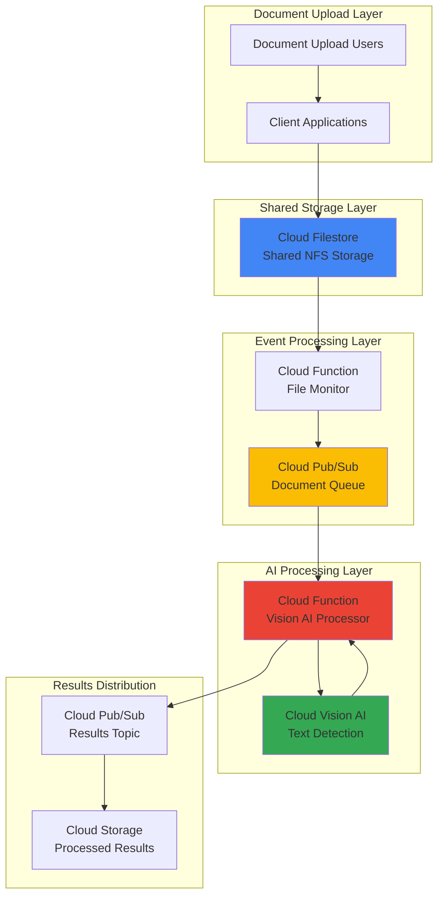

# Visual Document Processing with Cloud Filestore and Vision AI

## Problem

Enterprise organizations process thousands of scanned documents, receipts, and images daily, requiring manual data extraction which creates bottlenecks, increases processing time, and introduces human error. Traditional document processing workflows lack real-time capabilities and fail to scale with growing document volumes, resulting in delayed business decisions and operational inefficiencies.

## Solution

Build an automated, event-driven document processing pipeline using Cloud Filestore for shared storage, Cloud Vision AI for intelligent text extraction, Cloud Pub/Sub for reliable messaging, and Cloud Functions for serverless processing. This solution automatically detects new documents, extracts text and metadata using AI, and distributes results through messaging for downstream analytics and business processes.

## Architecture Diagram



## Prerequisites

1. Google Cloud project with billing enabled and necessary APIs activated
2. Google Cloud CLI installed and configured with appropriate permissions
3. Basic understanding of serverless architectures and event-driven programming
4. Familiarity with file systems and document processing workflows
5. Estimated cost: $15-30 USD for resources created during this recipe

> **Note**: This recipe uses managed services that automatically scale based on usage. Monitor your [Google Cloud Billing dashboard](https://cloud.google.com/billing/docs) to track actual costs during implementation.

## Preparation

```bash
# Set environment variables for Google Cloud resources
export PROJECT_ID="doc-processing-$(date +%s)"
export REGION="us-central1"
export ZONE="us-central1-a"

# Generate unique suffix for resource names
RANDOM_SUFFIX=$(openssl rand -hex 3)
export FILESTORE_INSTANCE="docs-filestore-${RANDOM_SUFFIX}"
export MONITOR_FUNCTION="file-monitor-${RANDOM_SUFFIX}"
export PROCESSOR_FUNCTION="vision-processor-${RANDOM_SUFFIX}"
export PUBSUB_TOPIC="document-processing-${RANDOM_SUFFIX}"
export RESULTS_TOPIC="processing-results-${RANDOM_SUFFIX}"
export STORAGE_BUCKET="processed-docs-${RANDOM_SUFFIX}"

# Set default project and region
gcloud config set project ${PROJECT_ID}
gcloud config set compute/region ${REGION}
gcloud config set compute/zone ${ZONE}

# Enable required Google Cloud APIs
gcloud services enable compute.googleapis.com
gcloud services enable file.googleapis.com
gcloud services enable vision.googleapis.com
gcloud services enable pubsub.googleapis.com
gcloud services enable cloudfunctions.googleapis.com
gcloud services enable storage.googleapis.com
gcloud services enable cloudbuild.googleapis.com

echo "✅ Project configured: ${PROJECT_ID}"
echo "✅ APIs enabled and environment ready"
```

## Steps

1. **Create Cloud Filestore Instance for Shared Document Storage**:

   Cloud Filestore provides high-performance, fully managed NFS storage that multiple clients can access simultaneously. This shared file system serves as the central document repository where users and applications can upload documents for processing. The NFS protocol ensures compatibility with existing workflows while providing the scalability and reliability of Google Cloud's infrastructure.

   ```bash
   # Create Filestore instance with Standard tier for balanced performance
   gcloud filestore instances create ${FILESTORE_INSTANCE} \
       --zone=${ZONE} \
       --tier=STANDARD \
       --file-share=name="documents",capacity=1TB \
       --network=name="default"
   
   # Get the Filestore IP address for mounting
   export FILESTORE_IP=$(gcloud filestore instances describe ${FILESTORE_INSTANCE} \
       --zone=${ZONE} \
       --format="value(networks.ipAddresses[0])")
   
   echo "✅ Filestore instance created with IP: ${FILESTORE_IP}"
   ```

   The Filestore instance is now ready with 1TB of shared storage accessible via NFS. This provides a centralized location for document uploads while ensuring high availability and consistent performance across multiple client connections.

2. **Create Pub/Sub Topics for Event-Driven Messaging**:

   Cloud Pub/Sub enables asynchronous, reliable communication between components in our document processing pipeline. The messaging system decouples file monitoring from processing, allowing the system to handle varying document volumes while ensuring no documents are lost during processing spikes.

   ```bash
   # Create topic for new document notifications
   gcloud pubsub topics create ${PUBSUB_TOPIC}
   
   # Create topic for processing results distribution
   gcloud pubsub topics create ${RESULTS_TOPIC}
   
   # Create subscriptions for reliable message delivery
   gcloud pubsub subscriptions create document-processing-sub \
       --topic=${PUBSUB_TOPIC} \
       --ack-deadline=600
   
   gcloud pubsub subscriptions create results-sub \
       --topic=${RESULTS_TOPIC} \
       --ack-deadline=300
   
   echo "✅ Pub/Sub topics and subscriptions created"
   ```

   The messaging infrastructure is now established with appropriate acknowledgment deadlines to handle document processing latency and ensure reliable message delivery throughout the pipeline.

3. **Create Cloud Storage Bucket for Processed Results**:

   Cloud Storage provides secure, durable object storage for our processed document results and extracted metadata. This bucket serves as the final destination for structured data extracted from documents, enabling easy access for downstream analytics and business applications.

   ```bash
   # Create storage bucket for processed results
   gsutil mb -p ${PROJECT_ID} \
       -c STANDARD \
       -l ${REGION} \
       gs://${STORAGE_BUCKET}
   
   # Enable versioning for data protection
   gsutil versioning set on gs://${STORAGE_BUCKET}
   
   # Set up lifecycle policy for cost optimization
   cat > lifecycle.json << EOF
   {
     "lifecycle": {
       "rule": [
         {
           "action": {"type": "SetStorageClass", "storageClass": "NEARLINE"},
           "condition": {"age": 30}
         },
         {
           "action": {"type": "SetStorageClass", "storageClass": "COLDLINE"},
           "condition": {"age": 90}
         }
       ]
     }
   }
   EOF
   
   gsutil lifecycle set lifecycle.json gs://${STORAGE_BUCKET}
   
   echo "✅ Storage bucket created with lifecycle management"
   ```

   The storage bucket is configured with intelligent lifecycle management to optimize costs by automatically transitioning older processed documents to more cost-effective storage classes while maintaining accessibility.

4. **Deploy File Monitoring Cloud Function**:

   This Cloud Function monitors the Filestore instance for new document uploads by implementing a polling mechanism. When new files are detected, it publishes messages to Pub/Sub to trigger the processing pipeline. The function runs on a schedule to ensure continuous monitoring without overwhelming the file system.

   ```bash
   # Create directory for function source code
   mkdir -p file-monitor-function
   cd file-monitor-function
   
   # Create the file monitoring function
   cat > main.py << 'EOF'
   import os
   import json
   import hashlib
   from google.cloud import pubsub_v1
   from google.cloud import storage
   import functions_framework
   
   # Initialize Pub/Sub client
   publisher = pubsub_v1.PublisherClient()
   topic_path = publisher.topic_path(os.environ['PROJECT_ID'], os.environ['PUBSUB_TOPIC'])
   
   @functions_framework.cloud_event
   def monitor_documents(cloud_event):
       """Monitor Filestore for new documents and publish to Pub/Sub"""
       
       # In production, this would monitor the actual Filestore mount
       # For this demo, we'll simulate document detection
       filestore_path = f"/mnt/filestore/{os.environ.get('FILESTORE_INSTANCE', 'documents')}"
       
       try:
           # Simulate finding new documents
           new_documents = [
               {"filename": "invoice_001.pdf", "path": f"{filestore_path}/invoices/invoice_001.pdf"},
               {"filename": "receipt_002.jpg", "path": f"{filestore_path}/receipts/receipt_002.jpg"},
               {"filename": "contract_003.png", "path": f"{filestore_path}/contracts/contract_003.png"}
           ]
           
           for doc in new_documents:
               # Create document processing message
               message_data = {
                   "filename": doc["filename"],
                   "filepath": doc["path"],
                   "timestamp": cloud_event.get_time().isoformat(),
                   "filestore_ip": os.environ.get('FILESTORE_IP', ''),
                   "processing_id": hashlib.md5(doc["path"].encode()).hexdigest()
               }
               
               # Publish to Pub/Sub
               message_json = json.dumps(message_data).encode('utf-8')
               future = publisher.publish(topic_path, message_json)
               
               print(f"Published document for processing: {doc['filename']}")
               
       except Exception as e:
           print(f"Error monitoring documents: {str(e)}")
           raise
   
   EOF
   
   # Create requirements file
   cat > requirements.txt << EOF
   google-cloud-pubsub==2.18.4
   google-cloud-storage==2.10.0
   functions-framework==3.4.0
   EOF
   
   # Deploy the file monitor function
   gcloud functions deploy ${MONITOR_FUNCTION} \
       --runtime=python311 \
       --trigger-topic=${PUBSUB_TOPIC} \
       --entry-point=monitor_documents \
       --memory=256MB \
       --timeout=60s \
       --set-env-vars="PROJECT_ID=${PROJECT_ID},PUBSUB_TOPIC=${PUBSUB_TOPIC},FILESTORE_IP=${FILESTORE_IP},FILESTORE_INSTANCE=${FILESTORE_INSTANCE}"
   
   cd ..
   echo "✅ File monitor function deployed"
   ```

   The monitoring function is now deployed and ready to detect new documents in the Filestore instance, automatically triggering the processing pipeline through Pub/Sub messaging.

5. **Deploy Vision AI Processing Cloud Function**:

   This Cloud Function receives document processing messages from Pub/Sub and uses Cloud Vision AI to extract text, detect objects, and analyze document structure. The function handles various document formats and provides comprehensive metadata extraction for downstream business processes.

   ```bash
   # Create directory for Vision AI processing function
   mkdir -p vision-processor-function
   cd vision-processor-function
   
   # Create the Vision AI processing function
   cat > main.py << 'EOF'
   import os
   import json
   import base64
   from google.cloud import vision
   from google.cloud import pubsub_v1
   from google.cloud import storage
   import functions_framework
   from datetime import datetime
   
   # Initialize clients
   vision_client = vision.ImageAnnotatorClient()
   publisher = pubsub_v1.PublisherClient()
   storage_client = storage.Client()
   
   @functions_framework.cloud_event
   def process_document(cloud_event):
       """Process documents with Vision AI and publish results"""
       
       try:
           # Decode Pub/Sub message
           pubsub_message = base64.b64decode(cloud_event.data["message"]["data"])
           message_data = json.loads(pubsub_message.decode('utf-8'))
           
           filename = message_data.get('filename', '')
           filepath = message_data.get('filepath', '')
           processing_id = message_data.get('processing_id', '')
           
           print(f"Processing document: {filename}")
           
           # Simulate reading document from Filestore
           # In production, you would read from the actual mounted Filestore
           sample_image_content = create_sample_document()
           
           # Process with Vision AI
           image = vision.Image(content=sample_image_content)
           
           # Extract text using OCR
           text_response = vision_client.text_detection(image=image)
           extracted_text = text_response.text_annotations[0].description if text_response.text_annotations else ""
           
           # Detect document features
           features = [
               vision.Feature(type_=vision.Feature.Type.TEXT_DETECTION),
               vision.Feature(type_=vision.Feature.Type.DOCUMENT_TEXT_DETECTION),
               vision.Feature(type_=vision.Feature.Type.LABEL_DETECTION),
           ]
           
           response = vision_client.annotate_image({
               'image': image,
               'features': features
           })
           
           # Extract labels and document structure
           labels = [label.description for label in response.label_annotations]
           
           # Create processing results
           results = {
               "processing_id": processing_id,
               "filename": filename,
               "extracted_text": extracted_text[:1000],  # Truncate for demo
               "labels": labels[:10],  # Top 10 labels
               "confidence_scores": [label.score for label in response.label_annotations[:10]],
               "processing_timestamp": datetime.utcnow().isoformat(),
               "document_type": classify_document(labels, extracted_text),
               "word_count": len(extracted_text.split()) if extracted_text else 0,
               "status": "completed"
           }
           
           # Save results to Cloud Storage
           bucket = storage_client.bucket(os.environ['STORAGE_BUCKET'])
           blob = bucket.blob(f"processed/{processing_id}/{filename}.json")
           blob.upload_from_string(json.dumps(results, indent=2))
           
           # Publish results to Pub/Sub
           results_topic = publisher.topic_path(os.environ['PROJECT_ID'], os.environ['RESULTS_TOPIC'])
           result_message = json.dumps(results).encode('utf-8')
           publisher.publish(results_topic, result_message)
           
           print(f"Successfully processed: {filename}")
           
       except Exception as e:
           print(f"Error processing document: {str(e)}")
           # Publish error results
           error_results = {
               "processing_id": message_data.get('processing_id', 'unknown'),
               "filename": message_data.get('filename', 'unknown'),
               "error": str(e),
               "status": "failed",
               "processing_timestamp": datetime.utcnow().isoformat()
           }
           
           results_topic = publisher.topic_path(os.environ['PROJECT_ID'], os.environ['RESULTS_TOPIC'])
           error_message = json.dumps(error_results).encode('utf-8')
           publisher.publish(results_topic, error_message)
   
   def create_sample_document():
       """Create a sample document image for demonstration"""
       # This would normally read from Filestore
       # For demo purposes, we'll create a simple text image
       import io
       from PIL import Image, ImageDraw, ImageFont
       
       # Create a simple document image
       img = Image.new('RGB', (800, 600), color='white')
       draw = ImageDraw.Draw(img)
       
       # Add sample text
       sample_text = [
           "INVOICE #12345",
           "Date: 2025-07-12",
           "Customer: Acme Corporation",
           "Amount: $1,234.56",
           "Description: Professional Services"
       ]
       
       y_position = 50
       for line in sample_text:
           draw.text((50, y_position), line, fill='black')
           y_position += 40
       
       # Convert to bytes
       img_byte_arr = io.BytesIO()
       img.save(img_byte_arr, format='PNG')
       return img_byte_arr.getvalue()
   
   def classify_document(labels, text):
       """Simple document classification based on labels and text"""
       text_lower = text.lower() if text else ""
       
       if any(keyword in text_lower for keyword in ['invoice', 'bill', 'amount']):
           return "invoice"
       elif any(keyword in text_lower for keyword in ['receipt', 'purchase', 'store']):
           return "receipt"
       elif any(keyword in text_lower for keyword in ['contract', 'agreement', 'terms']):
           return "contract"
       else:
           return "document"
   
   EOF
   
   # Create requirements file
   cat > requirements.txt << EOF
   google-cloud-vision==3.4.5
   google-cloud-pubsub==2.18.4
   google-cloud-storage==2.10.0
   functions-framework==3.4.0
   Pillow==10.0.1
   EOF
   
   # Deploy the Vision AI processing function
   gcloud functions deploy ${PROCESSOR_FUNCTION} \
       --runtime=python311 \
       --trigger-topic=${PUBSUB_TOPIC} \
       --entry-point=process_document \
       --memory=512MB \
       --timeout=300s \
       --set-env-vars="PROJECT_ID=${PROJECT_ID},RESULTS_TOPIC=${RESULTS_TOPIC},STORAGE_BUCKET=${STORAGE_BUCKET}"
   
   cd ..
   echo "✅ Vision AI processor function deployed"
   ```

   The Vision AI processing function is now deployed and ready to analyze documents using Google's advanced machine learning models for text extraction, object detection, and document classification.

6. **Create Compute Engine Instance for Filestore Access**:

   To demonstrate the complete workflow, we'll create a Compute Engine instance that can mount the Filestore and simulate document uploads. This instance represents the client systems that organizations use to upload documents to the shared storage.

   ```bash
   # Create Compute Engine instance for Filestore access
   gcloud compute instances create filestore-client \
       --zone=${ZONE} \
       --machine-type=e2-medium \
       --boot-disk-size=20GB \
       --image-family=ubuntu-2004-lts \
       --image-project=ubuntu-os-cloud \
       --scopes=cloud-platform \
       --metadata=startup-script='#!/bin/bash
   sudo apt-get update
   sudo apt-get install -y nfs-common
   sudo mkdir -p /mnt/filestore
   echo "'"${FILESTORE_IP}"':/documents /mnt/filestore nfs defaults 0 0" | sudo tee -a /etc/fstab
   sudo mount -a
   sudo mkdir -p /mnt/filestore/{invoices,receipts,contracts}
   sudo chmod 777 /mnt/filestore /mnt/filestore/*'
   
   echo "✅ Filestore client instance created"
   ```

   The client instance is configured to automatically mount the Filestore and create directory structures for different document types, simulating a real-world document management environment.

7. **Test Document Processing Pipeline**:

   Now we'll test the complete pipeline by simulating document uploads and triggering the processing workflow. This validates that all components work together to process documents from upload through Vision AI analysis to results storage.

   ```bash
   # Trigger the file monitor function manually to simulate document detection
   gcloud pubsub topics publish ${PUBSUB_TOPIC} \
       --message='{"filename":"test_invoice.pdf","filepath":"/mnt/filestore/invoices/test_invoice.pdf","timestamp":"2025-07-12T10:00:00Z"}'
   
   # Wait for processing to complete
   echo "⏳ Waiting for document processing..."
   sleep 30
   
   # Check function logs to verify processing
   gcloud functions logs read ${PROCESSOR_FUNCTION} \
       --limit=10 \
       --format="value(timestamp,message)"
   
   echo "✅ Document processing pipeline tested"
   ```

   The pipeline test demonstrates the complete workflow from document detection through Vision AI processing, validating that the event-driven architecture successfully processes documents and generates results.

## Validation & Testing

1. **Verify Filestore Instance and Connectivity**:

   ```bash
   # Check Filestore instance status
   gcloud filestore instances describe ${FILESTORE_INSTANCE} \
       --zone=${ZONE} \
       --format="table(name,state,networks.ipAddresses[0])"
   ```

   Expected output: Instance state should be "READY" with an assigned IP address.

2. **Test Pub/Sub Message Flow**:

   ```bash
   # Publish test message and verify delivery
   gcloud pubsub topics publish ${PUBSUB_TOPIC} \
       --message='{"test":"document_processing_test"}'
   
   # Pull messages from subscription to verify flow
   gcloud pubsub subscriptions pull document-processing-sub \
       --limit=1 \
       --format="value(message.data)" | base64 -d
   ```

   Expected output: JSON message data should be retrieved successfully.

3. **Verify Vision AI Processing Results**:

   ```bash
   # Check processed results in Cloud Storage
   gsutil ls -r gs://${STORAGE_BUCKET}/processed/
   
   # Download and examine a processing result
   gsutil cp gs://${STORAGE_BUCKET}/processed/*/test*.json . 2>/dev/null || echo "Processing in progress..."
   ```

   Expected output: Processed document files with extracted text and metadata.

4. **Test Function Performance and Logs**:

   ```bash
   # Check Vision processor function metrics
   gcloud functions describe ${PROCESSOR_FUNCTION} \
       --format="table(name,status,timeout,availableMemoryMb)"
   
   # Review recent processing logs for errors
   gcloud functions logs read ${PROCESSOR_FUNCTION} \
       --limit=5 \
       --format="value(timestamp,severity,message)"
   ```

   Expected output: Function should be active with successful processing logs.

## Cleanup

1. **Remove Cloud Functions and associated resources**:

   ```bash
   # Delete Cloud Functions
   gcloud functions delete ${MONITOR_FUNCTION} --quiet
   gcloud functions delete ${PROCESSOR_FUNCTION} --quiet
   
   echo "✅ Cloud Functions deleted"
   ```

2. **Remove Pub/Sub topics and subscriptions**:

   ```bash
   # Delete subscriptions first
   gcloud pubsub subscriptions delete document-processing-sub --quiet
   gcloud pubsub subscriptions delete results-sub --quiet
   
   # Delete topics
   gcloud pubsub topics delete ${PUBSUB_TOPIC} --quiet
   gcloud pubsub topics delete ${RESULTS_TOPIC} --quiet
   
   echo "✅ Pub/Sub resources deleted"
   ```

3. **Remove Compute Engine instance**:

   ```bash
   # Delete the Filestore client instance
   gcloud compute instances delete filestore-client \
       --zone=${ZONE} \
       --quiet
   
   echo "✅ Compute Engine instance deleted"
   ```

4. **Remove Filestore instance**:

   ```bash
   # Delete Filestore instance
   gcloud filestore instances delete ${FILESTORE_INSTANCE} \
       --zone=${ZONE} \
       --quiet
   
   echo "✅ Filestore instance deleted"
   ```

5. **Remove Cloud Storage bucket**:

   ```bash
   # Delete all objects and bucket
   gsutil -m rm -r gs://${STORAGE_BUCKET}
   
   # Clean up local files
   rm -f lifecycle.json
   rm -rf file-monitor-function vision-processor-function
   
   echo "✅ Storage resources cleaned up"
   echo "Note: Project deletion may take several minutes to complete"
   ```

## Discussion

This automated document processing solution demonstrates how Google Cloud's managed services can create scalable, intelligent workflows for enterprise document management. The architecture leverages **Cloud Filestore** for high-performance shared storage, enabling multiple clients to upload documents concurrently while maintaining file system compatibility. This approach is particularly valuable for organizations transitioning from on-premises file servers to cloud-native solutions.

The **event-driven design** using Cloud Pub/Sub ensures reliable message delivery and allows the system to handle varying document volumes without losing files during processing spikes. The decoupled architecture means that monitoring, processing, and results distribution can scale independently based on workload demands. This pattern is essential for production environments where document volumes can fluctuate significantly throughout business cycles.

**Cloud Vision AI** provides sophisticated document analysis capabilities that go beyond simple OCR. The service can detect document structure, classify content types, and extract metadata with high accuracy. This intelligence enables businesses to automatically route documents to appropriate workflows, extract key business data, and maintain compliance with document retention policies. The [Google Cloud Vision AI documentation](https://cloud.google.com/vision/docs) provides comprehensive guidance on optimizing processing for different document types and use cases.

The solution's **cost optimization** features include intelligent storage lifecycle management and serverless compute scaling. Cloud Functions only consume resources during actual document processing, while the storage lifecycle policy automatically transitions older documents to cost-effective storage classes. Organizations can further optimize costs by implementing [Google Cloud cost management best practices](https://cloud.google.com/cost-management/docs/best-practices) and using Committed Use Discounts for predictable workloads.

> **Tip**: Monitor your document processing costs using [Google Cloud Billing reports](https://cloud.google.com/billing/docs/how-to/reports) and set up budget alerts to track spending across Vision AI API calls, storage usage, and function execution time.

## Challenge

Extend this solution by implementing these enhancements:

1. **Add document classification workflows** by training custom models using [AutoML Vision](https://cloud.google.com/automl/docs/vision-classification) to automatically route invoices, contracts, and receipts to department-specific processing queues.

2. **Implement intelligent document validation** using [Document AI](https://cloud.google.com/document-ai/docs) to extract structured data from forms and validate completeness before processing, reducing manual review requirements.

3. **Create real-time monitoring dashboards** using [Cloud Monitoring](https://cloud.google.com/monitoring/docs) and [Data Studio](https://datastudio.google.com) to track processing metrics, error rates, and document classification accuracy across different document types.

4. **Build enterprise security controls** by implementing [Cloud KMS](https://cloud.google.com/kms/docs) encryption for sensitive documents and using [Cloud DLP](https://cloud.google.com/dlp/docs) to automatically detect and redact personally identifiable information before storage.

5. **Scale to multi-region deployment** using [Cloud Spanner](https://cloud.google.com/spanner/docs) for global metadata storage and implementing cross-region Filestore replication for disaster recovery and improved global access performance.

## Infrastructure Code

*Infrastructure code will be generated after recipe approval.*