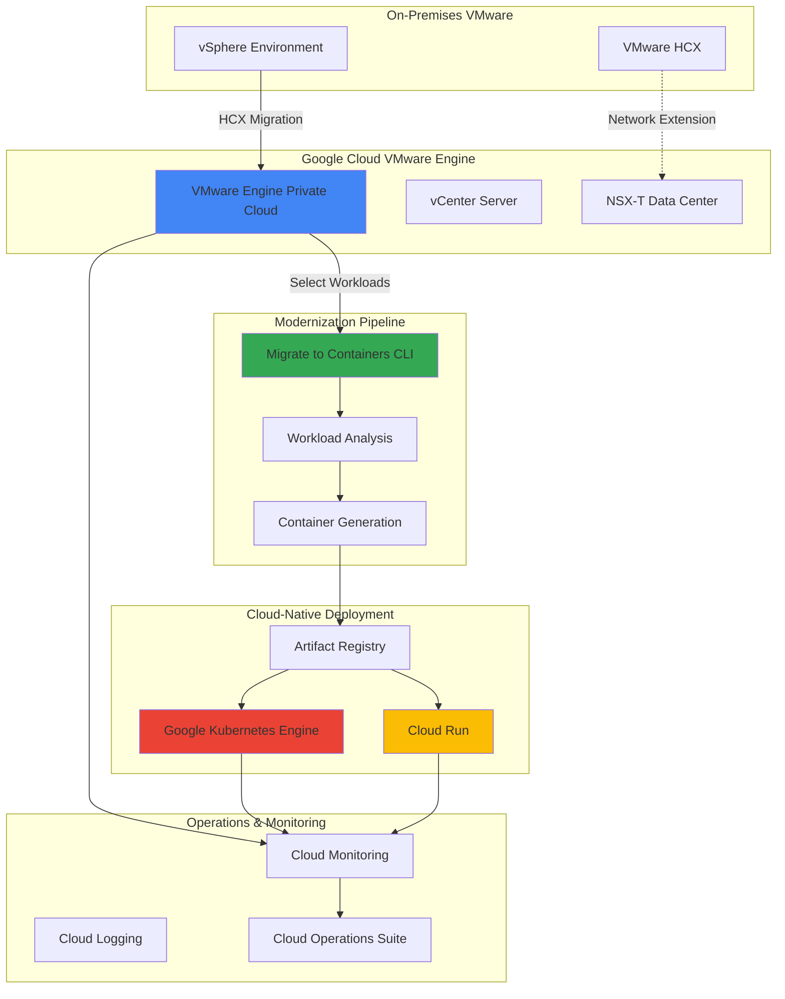

# Orchestrating VMware Workload Migration and Modernization with Google Cloud VMware Engine and Migrate to Containers

## Problem

Enterprise organizations running critical applications on VMware infrastructure face mounting pressure to modernize their workloads while maintaining operational continuity. Traditional lift-and-shift migrations to public cloud often result in costly, inefficient deployments that fail to leverage cloud-native benefits, while complete application rewrites require extensive time and resources that disrupt business operations.

## Solution

Google Cloud VMware Engine provides a seamless path for migrating VMware workloads to Google Cloud without rearchitecting applications, while Migrate to Containers enables gradual modernization by automatically containerizing select workloads for deployment to Google Kubernetes Engine or Cloud Run. This orchestrated approach combines immediate cloud migration benefits with strategic modernization, allowing organizations to optimize costs, improve scalability, and maintain operational excellence throughout the transformation journey.

## Architecture Diagram



## Prerequisites

1. Google Cloud project with billing enabled and appropriate IAM permissions
2. VMware vSphere environment (version 6.5 or higher) with network connectivity to Google Cloud
3. Google Cloud CLI (gcloud) installed and authenticated
4. Migrate to Containers CLI installed on a local workstation or jumpbox
5. Network connectivity between on-premises VMware environment and Google Cloud (VPN or Interconnect)
6. Estimated cost: $2,000-5,000/month for VMware Engine nodes, plus additional costs for GKE clusters and Cloud Run instances

> **Warning**: VMware Engine requires dedicated bare-metal nodes with minimum 3-node clusters, which incur significant costs even when idle. Plan your migration waves carefully to optimize resource utilization and costs.

## Preparation

```bash
# Set environment variables for Google Cloud resources
export PROJECT_ID="vmware-migration-$(date +%s)"
export REGION="us-central1"
export ZONE="us-central1-a"
export VMWARE_ENGINE_REGION="us-central1"

# Generate unique suffixes for resource names
RANDOM_SUFFIX=$(openssl rand -hex 3)
export PRIVATE_CLOUD_NAME="vmware-cloud-${RANDOM_SUFFIX}"
export GKE_CLUSTER_NAME="modernized-apps-${RANDOM_SUFFIX}"
export NETWORK_NAME="vmware-network-${RANDOM_SUFFIX}"

# Set default project and region for gcloud
gcloud config set project ${PROJECT_ID}
gcloud config set compute/region ${REGION}
gcloud config set compute/zone ${ZONE}

# Enable required Google Cloud APIs
gcloud services enable vmwareengine.googleapis.com
gcloud services enable container.googleapis.com
gcloud services enable artifactregistry.googleapis.com
gcloud services enable monitoring.googleapis.com
gcloud services enable logging.googleapis.com
gcloud services enable compute.googleapis.com

# Create VPC network for VMware Engine connectivity
gcloud compute networks create ${NETWORK_NAME} \
    --subnet-mode=custom \
    --bgp-routing-mode=regional

# Create subnet for VMware Engine management
gcloud compute networks subnets create vmware-mgmt-subnet \
    --network=${NETWORK_NAME} \
    --range=10.10.0.0/24 \
    --region=${REGION}

echo "✅ Environment configured for project: ${PROJECT_ID}"
echo "✅ Networks and subnets created for VMware Engine"
```

## Steps

1. **Create Google Cloud VMware Engine Private Cloud**:

   Google Cloud VMware Engine provides a fully managed VMware infrastructure that runs natively on Google Cloud, enabling seamless migration of existing VMware workloads without modification. This service maintains compatibility with your existing VMware tools, policies, and procedures while providing the scalability, security, and global reach of Google Cloud's infrastructure.

   ```bash
   # Create VMware Engine private cloud
   gcloud vmware private-clouds create ${PRIVATE_CLOUD_NAME} \
       --location=${VMWARE_ENGINE_REGION} \
       --cluster=initial-cluster \
       --node-type-config=type=standard-72,count=3 \
       --network=${NETWORK_NAME} \
       --management-range=10.10.0.0/24 \
       --vmware-engine-network=${PRIVATE_CLOUD_NAME}-network \
       --description="VMware migration private cloud"
   
   # Wait for private cloud creation (this can take 30-45 minutes)
   gcloud vmware private-clouds describe ${PRIVATE_CLOUD_NAME} \
       --location=${VMWARE_ENGINE_REGION} \
       --format="value(state)"
   
   echo "✅ VMware Engine private cloud creation initiated"
   echo "Note: Private cloud provisioning takes 30-45 minutes"
   ```

   The VMware Engine private cloud provides dedicated ESXi hosts running vSphere, vCenter Server, and NSX-T Data Center, creating an isolated VMware environment within Google Cloud. This foundation enables you to migrate existing workloads using familiar VMware tools while benefiting from Google Cloud's global network and security infrastructure.

2. **Configure Network Connectivity and HCX Setup**:

   VMware HCX (Hybrid Cloud Extension) enables seamless workload migration between on-premises VMware environments and Google Cloud VMware Engine. HCX provides advanced migration capabilities including live migration, bulk migration, and network extension, ensuring minimal downtime during the migration process.

   ```bash
   # Create firewall rules for VMware traffic
   gcloud compute firewall-rules create allow-vmware-hcx \
       --network=${NETWORK_NAME} \
       --allow=tcp:443,tcp:8043,tcp:9443,udp:500,udp:4500 \
       --source-ranges=10.0.0.0/8,192.168.0.0/16 \
       --description="Allow VMware HCX traffic"
   
   # Create VPN gateway for on-premises connectivity
   gcloud compute vpn-gateways create vmware-vpn-gateway \
       --network=${NETWORK_NAME} \
       --region=${REGION}
   
   # Get private cloud details for HCX configuration
   PRIVATE_CLOUD_IP=$(gcloud vmware private-clouds describe ${PRIVATE_CLOUD_NAME} \
       --location=${VMWARE_ENGINE_REGION} \
       --format="value(vcenter.internalIp)")
   
   echo "✅ Network connectivity configured"
   echo "Private Cloud vCenter IP: ${PRIVATE_CLOUD_IP}"
   echo "Configure HCX in your on-premises environment using this IP"
   ```

   Network connectivity establishes secure communication channels between your on-premises VMware environment and Google Cloud VMware Engine. This setup enables HCX to perform migrations while maintaining network security and ensuring encrypted data transfer throughout the migration process.

3. **Install and Configure Migrate to Containers CLI**:

   Migrate to Containers (M2C) analyzes existing virtual machine workloads and automatically generates containerized versions that can run on Google Kubernetes Engine or Cloud Run. This tool bridges the gap between traditional VM-based applications and modern container orchestration platforms.

   ```bash
   # Download and install Migrate to Containers CLI
   curl -O https://storage.googleapis.com/m2c-cli-release/m2c
   chmod +x m2c
   sudo mv m2c /usr/local/bin/
   
   # Verify installation
   m2c version
   
   # Create Artifact Registry repository for container images
   gcloud artifacts repositories create modernized-apps \
       --repository-format=docker \
       --location=${REGION} \
       --description="Repository for modernized application containers"
   
   # Configure Docker authentication for Artifact Registry
   gcloud auth configure-docker ${REGION}-docker.pkg.dev
   
   # Create GKE cluster for modernized workloads
   gcloud container clusters create ${GKE_CLUSTER_NAME} \
       --region=${REGION} \
       --num-nodes=2 \
       --enable-autoscaling \
       --min-nodes=1 \
       --max-nodes=10 \
       --enable-autorepair \
       --enable-autoupgrade \
       --network=${NETWORK_NAME} \
       --subnetwork=vmware-mgmt-subnet
   
   echo "✅ Migrate to Containers CLI installed and configured"
   echo "✅ GKE cluster created for modernized applications"
   ```

   The M2C CLI provides local analysis and containerization capabilities, allowing you to evaluate workloads for modernization potential and generate deployment-ready container artifacts. This approach gives you control over the modernization process while leveraging Google Cloud's managed container services.

4. **Analyze Workloads for Migration Assessment**:

   Workload analysis is crucial for determining the optimal migration strategy for each application. Some workloads benefit from lift-and-shift to VMware Engine, while others are suitable for containerization and modernization through Migrate to Containers.

   ```bash
   # Create workspace for migration analysis
   mkdir -p ~/vmware-migration-workspace
   cd ~/vmware-migration-workspace
   
   # Initialize M2C workspace
   m2c init
   
   # Create assessment configuration
   cat > assessment-config.yaml << EOF
   apiVersion: v1
   kind: Config
   metadata:
     name: vmware-assessment
   spec:
     source:
       type: vmware
       connection:
         host: "${PRIVATE_CLOUD_IP}"
         username: "cloudowner@gve.local"
     target:
       registry: "${REGION}-docker.pkg.dev/${PROJECT_ID}/modernized-apps"
       cluster: "${GKE_CLUSTER_NAME}"
   EOF
   
   # Generate migration plan template
   m2c generate migration-plan \
       --source-type=vm \
       --os-type=linux \
       --output=migration-plan.yaml
   
   echo "✅ Workload analysis workspace configured"
   echo "✅ Migration assessment framework ready"
   ```

   The assessment phase identifies application dependencies, resource requirements, and modernization candidates. This analysis drives decision-making for the hybrid migration approach, ensuring each workload follows the most appropriate path to Google Cloud.

5. **Execute VMware Workload Migration to VMware Engine**:

   VMware HCX enables seamless migration of virtual machines from on-premises infrastructure to Google Cloud VMware Engine. This process maintains application state and minimizes downtime while transferring workloads to the cloud environment.

   ```bash
   # Create migration inventory for tracking
   cat > migration-inventory.yaml << EOF
   migrations:
     - name: "web-tier-migration"
       type: "bulk"
       source: "on-premises-datacenter"
       target: "${PRIVATE_CLOUD_NAME}"
       workloads:
         - vm1-web-server
         - vm2-web-server
         - vm3-load-balancer
     - name: "database-tier-migration"
       type: "vmotion"
       source: "on-premises-datacenter"
       target: "${PRIVATE_CLOUD_NAME}"
       workloads:
         - vm4-primary-db
         - vm5-secondary-db
   EOF
   
   # Monitor migration status (simulated for recipe purposes)
   echo "Migration commands would be executed through HCX Manager:"
   echo "1. Log into HCX Manager at ${PRIVATE_CLOUD_IP}:9443"
   echo "2. Create service mesh between sites"
   echo "3. Configure network profiles and compute profiles"
   echo "4. Execute bulk migrations for web tier"
   echo "5. Execute vMotion migrations for database tier"
   
   # Create monitoring alert for migration status
   gcloud alpha monitoring policies create \
       --policy-from-file=<(cat << EOF
   {
     "displayName": "VMware Migration Status",
     "conditions": [
       {
         "displayName": "VM Migration Failure",
         "conditionThreshold": {
           "filter": "resource.type=\"vmware_vcenter\"",
           "comparison": "COMPARISON_GREATER_THAN",
           "thresholdValue": 0
         }
       }
     ],
     "alertStrategy": {
       "autoClose": "1800s"
     }
   }
   EOF
   )
   
   echo "✅ VMware migration plan created and monitoring configured"
   ```

   HCX migration provides multiple options including bulk migration for minimal-downtime scenarios and vMotion for zero-downtime transfers. The choice depends on application criticality and maintenance window availability, ensuring business continuity throughout the migration process.

6. **Identify and Containerize Selected Workloads**:

   After successful migration to VMware Engine, certain workloads can be further modernized through containerization. This selective approach enables gradual modernization while maintaining stability for critical applications that benefit from remaining in VM format.

   ```bash
   # Analyze specific VMs for containerization potential
   cat > containerization-candidates.yaml << EOF
   workloads:
     - vm_name: "web-app-vm"
       application: "java-spring-boot"
       containerization_score: 85
       complexity: "low"
       dependencies: ["mysql", "redis"]
     - vm_name: "api-service-vm"
       application: "nodejs-express"
       containerization_score: 92
       complexity: "low"
       dependencies: ["postgresql"]
     - vm_name: "batch-processor-vm"
       application: "python-django"
       containerization_score: 78
       complexity: "medium"
       dependencies: ["rabbitmq", "elasticsearch"]
   EOF
   
   # Configure M2C for selected workload
   cat > web-app-migration-plan.yaml << EOF
   apiVersion: migrate.cloud.google.com/v1beta1
   kind: MigrationPlan
   metadata:
     name: web-app-modernization
   spec:
     source:
       vm:
         vmName: "web-app-vm"
         osType: "linux"
     target:
       gke:
         cluster: "${GKE_CLUSTER_NAME}"
         namespace: "modernized-apps"
     containerization:
       strategy: "lift-and-shift-to-containers"
       runtime: "spring-boot"
       baseImage: "openjdk:11-jre-slim"
   EOF
   
   # Execute containerization for selected workload
   m2c migrate create web-app-modernization \
       --migration-plan=web-app-migration-plan.yaml \
       --source-provider=vmware \
       --target-provider=gke
   
   echo "✅ Workload containerization initiated for selected applications"
   echo "✅ Migration plan configured for Java Spring Boot application"
   ```

   Containerization transforms VM-based applications into cloud-native containers that can leverage Kubernetes orchestration capabilities. This process maintains application functionality while enabling features like auto-scaling, rolling updates, and improved resource utilization.

7. **Deploy Modernized Applications to Google Kubernetes Engine**:

   Google Kubernetes Engine provides enterprise-grade container orchestration with integrated security, monitoring, and scaling capabilities. Deploying modernized applications to GKE enables cloud-native operational patterns while maintaining compatibility with existing DevOps workflows.

   ```bash
   # Get GKE cluster credentials
   gcloud container clusters get-credentials ${GKE_CLUSTER_NAME} \
       --region=${REGION}
   
   # Create namespace for modernized applications
   kubectl create namespace modernized-apps
   
   # Deploy modernized web application (generated by M2C)
   cat > modernized-web-app-deployment.yaml << EOF
   apiVersion: apps/v1
   kind: Deployment
   metadata:
     name: modernized-web-app
     namespace: modernized-apps
   spec:
     replicas: 3
     selector:
       matchLabels:
         app: modernized-web-app
     template:
       metadata:
         labels:
           app: modernized-web-app
       spec:
         containers:
         - name: web-app
           image: ${REGION}-docker.pkg.dev/${PROJECT_ID}/modernized-apps/web-app:latest
           ports:
           - containerPort: 8080
           env:
           - name: DATABASE_URL
             value: "jdbc:mysql://mysql-service:3306/appdb"
           resources:
             requests:
               memory: "512Mi"
               cpu: "250m"
             limits:
               memory: "1Gi"
               cpu: "500m"
   ---
   apiVersion: v1
   kind: Service
   metadata:
     name: modernized-web-app-service
     namespace: modernized-apps
   spec:
     type: LoadBalancer
     ports:
     - port: 80
       targetPort: 8080
     selector:
       app: modernized-web-app
   EOF
   
   kubectl apply -f modernized-web-app-deployment.yaml
   
   # Configure horizontal pod autoscaling
   kubectl autoscale deployment modernized-web-app \
       --namespace=modernized-apps \
       --cpu-percent=70 \
       --min=2 \
       --max=10
   
   echo "✅ Modernized application deployed to GKE"
   echo "✅ Auto-scaling configured for dynamic workload management"
   ```

   GKE deployment enables the modernized application to benefit from Kubernetes features like automatic healing, rolling updates, and horizontal scaling. This cloud-native deployment model improves application resilience and operational efficiency compared to traditional VM deployments.

8. **Configure Comprehensive Monitoring and Operations**:

   Google Cloud Operations Suite provides unified monitoring, logging, and alerting across both VMware Engine and containerized workloads. This comprehensive observability ensures operational excellence throughout the hybrid migration journey.

   ```bash
   # Create monitoring dashboard for hybrid infrastructure
   cat > hybrid-monitoring-dashboard.json << EOF
   {
     "displayName": "VMware Migration and Modernization Dashboard",
     "mosaicLayout": {
       "tiles": [
         {
           "width": 6,
           "height": 4,
           "widget": {
             "title": "VMware Engine Resource Utilization",
             "xyChart": {
               "dataSets": [
                 {
                   "timeSeriesQuery": {
                     "timeSeriesFilter": {
                       "filter": "resource.type=\"vmware_vcenter\"",
                       "aggregation": {
                         "alignmentPeriod": "60s",
                         "perSeriesAligner": "ALIGN_MEAN"
                       }
                     }
                   }
                 }
               ]
             }
           }
         },
         {
           "width": 6,
           "height": 4,
           "widget": {
             "title": "GKE Container Performance",
             "xyChart": {
               "dataSets": [
                 {
                   "timeSeriesQuery": {
                     "timeSeriesFilter": {
                       "filter": "resource.type=\"k8s_container\"",
                       "aggregation": {
                         "alignmentPeriod": "60s",
                         "perSeriesAligner": "ALIGN_MEAN"
                       }
                     }
                   }
                 }
               ]
             }
           }
         }
       ]
     }
   }
   EOF
   
   gcloud monitoring dashboards create \
       --config-from-file=hybrid-monitoring-dashboard.json
   
   # Create alerting policies for critical metrics
   gcloud alpha monitoring policies create \
       --policy-from-file=<(cat << EOF
   {
     "displayName": "Hybrid Infrastructure Alerts",
     "conditions": [
       {
         "displayName": "High VMware CPU Usage",
         "conditionThreshold": {
           "filter": "resource.type=\"vmware_vcenter\" AND metric.type=\"compute.googleapis.com/instance/cpu/utilization\"",
           "comparison": "COMPARISON_GREATER_THAN",
           "thresholdValue": 0.8,
           "duration": "300s"
         }
       },
       {
         "displayName": "GKE Pod Failures",
         "conditionThreshold": {
           "filter": "resource.type=\"k8s_container\" AND metric.type=\"kubernetes.io/container/restart_count\"",
           "comparison": "COMPARISON_GREATER_THAN",
           "thresholdValue": 5,
           "duration": "300s"
         }
       }
     ],
     "notificationChannels": [],
     "alertStrategy": {
       "autoClose": "1800s"
     }
   }
   EOF
   )
   
   echo "✅ Comprehensive monitoring dashboard created"
   echo "✅ Alerting policies configured for hybrid infrastructure"
   ```

   Unified monitoring provides visibility across the entire migration and modernization journey, enabling proactive management of both traditional VMware workloads and cloud-native containerized applications. This observability foundation supports continuous optimization and operational excellence.

## Validation & Testing

1. **Verify VMware Engine Private Cloud Status**:

   ```bash
   # Check private cloud operational status
   gcloud vmware private-clouds describe ${PRIVATE_CLOUD_NAME} \
       --location=${VMWARE_ENGINE_REGION} \
       --format="table(name,state,createTime,managementCluster.nodeTypeConfigs)"
   
   # Verify vCenter accessibility
   VCENTER_IP=$(gcloud vmware private-clouds describe ${PRIVATE_CLOUD_NAME} \
       --location=${VMWARE_ENGINE_REGION} \
       --format="value(vcenter.internalIp)")
   
   echo "vCenter Server accessible at: https://${VCENTER_IP}"
   ```

   Expected output: Private cloud state should show "ACTIVE" and vCenter IP should be accessible.

2. **Test GKE Cluster and Modernized Application Deployment**:

   ```bash
   # Verify GKE cluster status
   gcloud container clusters describe ${GKE_CLUSTER_NAME} \
       --region=${REGION} \
       --format="value(status,currentNodeCount)"
   
   # Check modernized application status
   kubectl get deployments,services,pods -n modernized-apps
   
   # Test application connectivity
   APP_EXTERNAL_IP=$(kubectl get service modernized-web-app-service \
       -n modernized-apps \
       -o jsonpath='{.status.loadBalancer.ingress[0].ip}')
   
   curl -I http://${APP_EXTERNAL_IP}
   ```

   Expected output: GKE cluster should be "RUNNING", pods should be "Ready", and application should respond with HTTP 200.

3. **Validate Monitoring and Alerting Configuration**:

   ```bash
   # List created monitoring resources
   gcloud monitoring dashboards list \
       --format="table(displayName,mosaicLayout.tiles.length)"
   
   # Verify alerting policies
   gcloud alpha monitoring policies list \
       --format="table(displayName,enabled,conditions.length)"
   
   # Check logs for migration activities
   gcloud logging read "resource.type=\"vmware_vcenter\" OR resource.type=\"k8s_container\"" \
       --limit=10 \
       --format="table(timestamp,resource.type,textPayload)"
   ```

   Expected output: Dashboards and policies should be listed, and logs should show recent activity from both VMware and GKE resources.

## Cleanup

1. **Remove GKE cluster and containerized applications**:

   ```bash
   # Delete GKE cluster
   gcloud container clusters delete ${GKE_CLUSTER_NAME} \
       --region=${REGION} \
       --quiet
   
   # Remove Artifact Registry repository
   gcloud artifacts repositories delete modernized-apps \
       --location=${REGION} \
       --quiet
   
   echo "✅ GKE cluster and container registry cleaned up"
   ```

2. **Remove VMware Engine private cloud**:

   ```bash
   # Delete VMware Engine private cloud
   gcloud vmware private-clouds delete ${PRIVATE_CLOUD_NAME} \
       --location=${VMWARE_ENGINE_REGION} \
       --quiet
   
   echo "✅ VMware Engine private cloud deletion initiated"
   echo "Note: Private cloud deletion takes 30-45 minutes"
   ```

3. **Clean up networking and monitoring resources**:

   ```bash
   # Remove monitoring policies and dashboards
   gcloud alpha monitoring policies list \
       --format="value(name)" | \
       xargs -I {} gcloud alpha monitoring policies delete {} --quiet
   
   # Delete VPC network and subnets
   gcloud compute networks subnets delete vmware-mgmt-subnet \
       --region=${REGION} \
       --quiet
   
   gcloud compute networks delete ${NETWORK_NAME} --quiet
   
   # Remove local workspace
   rm -rf ~/vmware-migration-workspace
   
   echo "✅ All resources cleaned up successfully"
   ```

## Discussion

This comprehensive recipe demonstrates how Google Cloud VMware Engine and Migrate to Containers work together to provide a strategic migration path that balances immediate cloud benefits with long-term modernization goals. The orchestrated approach addresses the common enterprise challenge of migrating complex VMware environments while maintaining operational continuity and enabling selective modernization.

Google Cloud VMware Engine serves as the foundation for this migration strategy by providing a native VMware environment within Google Cloud. This service eliminates the need for application refactoring during initial migration, reducing risk and accelerating time-to-cloud. The dedicated ESXi hosts ensure consistent performance and compatibility with existing VMware tools, policies, and procedures. According to the [Google Cloud VMware Engine documentation](https://cloud.google.com/vmware-engine/docs/concepts/architecture), this approach maintains 100% compatibility with existing VMware workloads while providing access to Google Cloud's global infrastructure and security capabilities.

The selective containerization through Migrate to Containers represents the modernization component of this strategy. Not all workloads benefit equally from containerization – stateless applications, microservices, and applications with clear boundaries are ideal candidates. The [Migrate to Containers service](https://cloud.google.com/migrate/containers/docs/getting-started) analyzes workload characteristics and automatically generates container artifacts, deployment manifests, and Kubernetes configurations. This automation reduces the complexity and time required for modernization while ensuring best practices in container security and resource management.

The monitoring and operations integration across both VMware Engine and Google Kubernetes Engine environments provides unified visibility essential for managing hybrid infrastructure. Google Cloud Operations Suite extends monitoring capabilities to VMware workloads through the [VMware Engine monitoring integration](https://cloud.google.com/vmware-engine/docs/monitoring), while native Kubernetes monitoring provides deep insights into containerized applications. This comprehensive observability enables organizations to optimize performance, manage costs, and ensure reliability across their entire application portfolio.

> **Tip**: Plan your migration in waves, starting with less critical applications to validate the process and build operational expertise before migrating mission-critical workloads. Use the assessment phase to identify quick wins for containerization while maintaining stable VM deployments for complex, stateful applications.

## Challenge

Extend this solution by implementing these advanced capabilities:

1. **Multi-Region Disaster Recovery**: Configure cross-region replication between VMware Engine private clouds using VMware vSphere Replication and implement automated failover procedures with Google Cloud DNS for traffic routing during disaster scenarios.

2. **Advanced Security Integration**: Implement Google Cloud Security Command Center for unified security monitoring, configure Binary Authorization for container image verification, and establish network security policies using Google Cloud Armor for both VMware Engine and GKE workloads.

3. **Cost Optimization Automation**: Develop Cloud Functions to automatically analyze workload utilization patterns and recommend rightsizing for VMware Engine nodes, implement Vertical Pod Autoscaling for GKE workloads, and create cost allocation reporting across both environments.

4. **CI/CD Pipeline Integration**: Establish Cloud Build pipelines that automatically trigger containerization assessment for new VM deployments, implement automated testing for migrated applications, and create deployment pipelines that support both VM and container deployment targets.

5. **Advanced Networking Architecture**: Configure Google Cloud Interconnect for dedicated connectivity, implement network segmentation using Google Cloud VPC and NSX-T integration, and establish service mesh connectivity between VMware Engine and GKE environments using Anthos Service Mesh.

## Infrastructure Code

*Infrastructure code will be generated after recipe approval.*