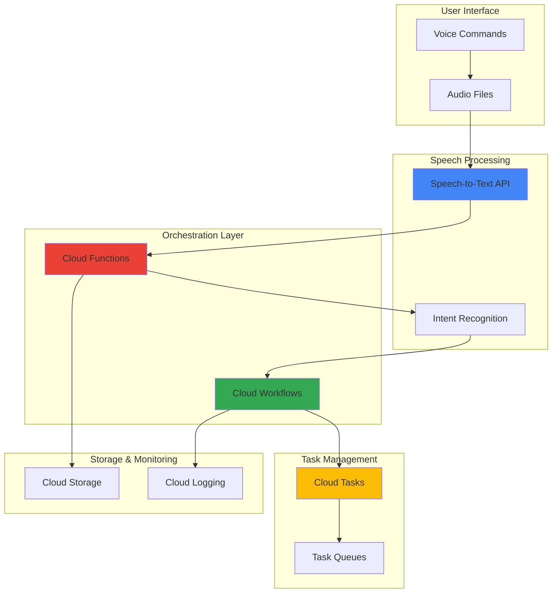

# Voice-Controlled Task Automation with Speech-to-Text and Workflows

## Problem

Modern businesses require efficient task management and process automation, but traditional interfaces create friction for users on the go or in hands-free environments. Manual task creation through web interfaces or mobile apps interrupts workflow productivity, especially for field workers, healthcare professionals, or warehouse managers who need to create tasks while handling equipment. Organizations struggle to provide intuitive, accessible ways for employees to trigger business processes and create tasks without stopping their primary work activities.

## Solution

Build a voice-controlled automation system that converts spoken commands into structured workflows using Google Cloud's Speech-to-Text API for voice recognition, Cloud Workflows for orchestrating business processes, Cloud Functions for serverless processing, and Cloud Tasks for asynchronous task management. This serverless architecture enables natural voice interactions to trigger automated business processes, create scheduled tasks, and execute complex workflows without requiring manual interface interaction.

## Architecture Diagram



## Prerequisites

1. Google Cloud account with billing enabled and appropriate permissions for Speech-to-Text, Cloud Workflows, Cloud Functions, and Cloud Tasks
2. Google Cloud CLI (`gcloud`) installed and configured (or use Cloud Shell)
3. Basic understanding of serverless architectures and workflow orchestration concepts
4. Familiarity with Python programming for Cloud Functions development
5. Estimated cost: $5-15 for testing (Speech-to-Text: $0.006/15 seconds, Cloud Functions: $0.0000004/invocation, minimal Workflows and Tasks costs)

> **Note**: Enable billing monitoring to track usage and set up budget alerts to avoid unexpected charges during development and testing.

## Preparation

```bash
# Set environment variables for GCP resources
export PROJECT_ID="voice-automation-$(date +%s)"
export REGION="us-central1"
export ZONE="us-central1-a"

# Generate unique suffix for resource names
RANDOM_SUFFIX=$(openssl rand -hex 3)
export FUNCTION_NAME="voice-processor-${RANDOM_SUFFIX}"
export WORKFLOW_NAME="task-automation-${RANDOM_SUFFIX}"
export BUCKET_NAME="voice-audio-${PROJECT_ID}-${RANDOM_SUFFIX}"
export QUEUE_NAME="task-queue-${RANDOM_SUFFIX}"

# Set default project and region
gcloud config set project ${PROJECT_ID}
gcloud config set compute/region ${REGION}
gcloud config set compute/zone ${ZONE}

# Enable required APIs
gcloud services enable speech.googleapis.com
gcloud services enable workflows.googleapis.com
gcloud services enable cloudfunctions.googleapis.com
gcloud services enable cloudtasks.googleapis.com
gcloud services enable storage.googleapis.com

echo "✅ Project configured: ${PROJECT_ID}"
echo "✅ APIs enabled for voice automation services"
```

## Steps

1. **Create Cloud Storage Bucket for Audio Files**:

   Cloud Storage provides secure, scalable object storage for audio files with global accessibility and integration with Google Cloud AI services. The bucket will store uploaded voice recordings and serve as a trigger source for our speech processing pipeline, ensuring reliable file handling with built-in redundancy and access controls.

   ```bash
   # Create storage bucket for audio files
   gsutil mb -p ${PROJECT_ID} \
       -c STANDARD \
       -l ${REGION} \
       gs://${BUCKET_NAME}
   
   # Set bucket lifecycle for cost optimization
   cat > lifecycle.json << EOF
   {
     "lifecycle": {
       "rule": [
         {
           "action": {"type": "Delete"},
           "condition": {"age": 7}
         }
       ]
     }
   }
   EOF
   
   gsutil lifecycle set lifecycle.json gs://${BUCKET_NAME}
   
   echo "✅ Cloud Storage bucket created: gs://${BUCKET_NAME}"
   ```

   The storage bucket is now configured with automatic cleanup after 7 days to manage costs while providing reliable audio file storage for voice processing workflows.

2. **Create Cloud Tasks Queue for Asynchronous Processing**:

   Cloud Tasks provides fully managed task queues for asynchronous execution with built-in retry logic and rate limiting. The queue enables reliable delivery of voice-triggered automation tasks while decoupling speech processing from task execution, ensuring system resilience and scalability.

   ```bash
   # Create Cloud Tasks queue
   gcloud tasks queues create ${QUEUE_NAME} \
       --location=${REGION} \
       --max-dispatches-per-second=10 \
       --max-concurrent-dispatches=5
   
   # Verify queue creation
   gcloud tasks queues describe ${QUEUE_NAME} \
       --location=${REGION}
   
   echo "✅ Cloud Tasks queue created: ${QUEUE_NAME}"
   ```

   The task queue now provides controlled, asynchronous processing with configurable rate limits to handle voice-triggered automation tasks efficiently while preventing system overload.

3. **Deploy Speech Processing Cloud Function**:

   Cloud Functions provides serverless compute that automatically scales based on incoming requests. This function integrates Speech-to-Text API for voice recognition, processes natural language intent, and triggers appropriate workflow executions based on voice commands.

   ```bash
   # Create function directory and dependencies
   mkdir -p voice-function
   cd voice-function
   
   # Create requirements.txt for Python dependencies
   cat > requirements.txt << EOF
   google-cloud-speech==2.31.0
   google-cloud-workflows==1.14.3
   google-cloud-tasks==2.16.4
   google-cloud-storage==2.14.0
   functions-framework==3.5.0
   EOF
   
   # Create main function code
   cat > main.py << 'EOF'
   import json
   import os
   import time
   from google.cloud import speech
   from google.cloud import workflows_v1
   from google.cloud import tasks_v2
   from google.cloud import storage
   import functions_framework
   
   @functions_framework.http
   def process_voice_command(request):
       """Process uploaded audio file and trigger workflows"""
       try:
           # Get audio file from request
           data = request.get_json()
           if not data or 'audio_uri' not in data:
               return {'error': 'Missing audio_uri parameter'}, 400
           
           audio_uri = data['audio_uri']
           
           # Initialize Speech-to-Text client
           speech_client = speech.SpeechClient()
           
           # Configure speech recognition
           config = speech.RecognitionConfig(
               encoding=speech.RecognitionConfig.AudioEncoding.LINEAR16,
               sample_rate_hertz=16000,
               language_code="en-US",
               enable_automatic_punctuation=True,
               model="latest_long"
           )
           
           audio = speech.RecognitionAudio(uri=audio_uri)
           
           # Perform speech recognition
           response = speech_client.recognize(config=config, audio=audio)
           
           if not response.results:
               return {'error': 'No speech detected'}, 400
           
           # Extract transcript
           transcript = response.results[0].alternatives[0].transcript.lower()
           confidence = response.results[0].alternatives[0].confidence
           
           # Simple intent recognition
           intent_data = analyze_intent(transcript)
           
           # Trigger appropriate workflow
           if intent_data['intent'] != 'unknown':
               workflow_result = trigger_workflow(intent_data)
               return {
                   'transcript': transcript,
                   'confidence': confidence,
                   'intent': intent_data,
                   'workflow_triggered': workflow_result
               }
           else:
               return {
                   'transcript': transcript,
                   'confidence': confidence,
                   'error': 'Intent not recognized'
               }, 400
               
       except Exception as e:
           return {'error': str(e)}, 500
   
   def analyze_intent(transcript):
       """Simple intent recognition from transcript"""
       intent_data = {
           'intent': 'unknown',
           'action': None,
           'parameters': {}
       }
       
       # Simple keyword-based intent detection
       if 'create task' in transcript or 'new task' in transcript:
           intent_data['intent'] = 'create_task'
           intent_data['action'] = 'task_creation'
           # Extract task details (simplified)
           if 'urgent' in transcript:
               intent_data['parameters']['priority'] = 'high'
           if 'meeting' in transcript:
               intent_data['parameters']['category'] = 'meeting'
           
       elif 'schedule' in transcript:
           intent_data['intent'] = 'schedule_task'
           intent_data['action'] = 'task_scheduling'
           
       elif 'report' in transcript or 'status' in transcript:
           intent_data['intent'] = 'generate_report'
           intent_data['action'] = 'report_generation'
       
       return intent_data
   
   def trigger_workflow(intent_data):
       """Trigger Cloud Workflow based on intent"""
       try:
           project_id = os.environ.get('GCP_PROJECT')
           location = os.environ.get('REGION', 'us-central1')
           workflow_name = os.environ.get('WORKFLOW_NAME')
           
           # Initialize Workflows client
           workflows_client = workflows_v1.ExecutionsClient()
           
           # Prepare workflow execution
           parent = f"projects/{project_id}/locations/{location}/workflows/{workflow_name}"
           execution = {
               "argument": json.dumps(intent_data)
           }
           
           # Execute workflow
           operation = workflows_client.create_execution(
               parent=parent,
               execution=execution
           )
           
           return {
               'status': 'triggered',
               'execution_name': operation.name
           }
           
       except Exception as e:
           return {
               'status': 'failed',
               'error': str(e)
           }
   EOF
   
   # Deploy Cloud Function
   gcloud functions deploy ${FUNCTION_NAME} \
       --runtime python311 \
       --trigger-http \
       --allow-unauthenticated \
       --source . \
       --entry-point process_voice_command \
       --memory 512MB \
       --timeout 60s \
       --set-env-vars "GCP_PROJECT=${PROJECT_ID},REGION=${REGION},WORKFLOW_NAME=${WORKFLOW_NAME}"
   
   cd ..
   
   echo "✅ Cloud Function deployed: ${FUNCTION_NAME}"
   ```

   The Cloud Function now provides intelligent speech processing with intent recognition, enabling natural voice commands to trigger appropriate automation workflows with built-in error handling and scalability.

4. **Create Task Automation Workflow**:

   Cloud Workflows provides serverless orchestration for complex business processes with built-in error handling, retries, and conditional logic. This workflow receives voice-triggered intents and executes corresponding business automation tasks through a structured, reliable process.

   ```bash
   # Create workflow definition
   cat > task-automation-workflow.yaml << 'EOF'
   main:
     params: [args]
     steps:
     - init:
         assign:
         - intent: ${args.intent}
         - action: ${args.action}
         - parameters: ${args.parameters}
         - project_id: ${sys.get_env("GOOGLE_CLOUD_PROJECT_ID")}
         
     - validate_intent:
         switch:
         - condition: ${intent == "create_task"}
           next: create_task_process
         - condition: ${intent == "schedule_task"}
           next: schedule_task_process
         - condition: ${intent == "generate_report"}
           next: generate_report_process
         default:
           next: unknown_intent_error
     
     - create_task_process:
         steps:
         - log_task_creation:
             call: sys.log
             args:
               text: ${"Creating task with parameters: " + string(parameters)}
               severity: INFO
               
         - enqueue_task:
             call: http.post
             args:
               url: ${"https://cloudtasks.googleapis.com/v2/projects/" + project_id + "/locations/us-central1/queues/${QUEUE_NAME}/tasks"}
               auth:
                 type: OAuth2
               headers:
                 Content-Type: application/json
               body:
                 task:
                   httpRequest:
                     url: ${"https://us-central1-" + project_id + ".cloudfunctions.net/task-processor-${RANDOM_SUFFIX}"}
                     httpMethod: POST
                     headers:
                       Content-Type: application/json
                     body: ${base64.encode(json.encode({
                       "action": "create_task",
                       "parameters": parameters
                     }))}
                   scheduleTime: ${time.format(time.now())}
             result: task_result
             
         - return_success:
             return:
               status: "success"
               message: "Task creation initiated"
               task_id: ${task_result.body.name}
     
     - schedule_task_process:
         steps:
         - log_scheduling:
             call: sys.log
             args:
               text: ${"Scheduling task with parameters: " + string(parameters)}
               severity: INFO
               
         - calculate_schedule_time:
             assign:
             - schedule_time: ${time.format(time.add(time.now(), 3600))}  # 1 hour from now
             
         - enqueue_scheduled_task:
             call: http.post
             args:
               url: ${"https://cloudtasks.googleapis.com/v2/projects/" + project_id + "/locations/us-central1/queues/${QUEUE_NAME}/tasks"}
               auth:
                 type: OAuth2
               headers:
                 Content-Type: application/json
               body:
                 task:
                   httpRequest:
                     url: ${"https://us-central1-" + project_id + ".cloudfunctions.net/task-processor-${RANDOM_SUFFIX}"}
                     httpMethod: POST
                     headers:
                       Content-Type: application/json
                     body: ${base64.encode(json.encode({
                       "action": "scheduled_task",
                       "parameters": parameters
                     }))}
                   scheduleTime: ${schedule_time}
             result: scheduled_result
             
         - return_scheduled:
             return:
               status: "success"
               message: "Task scheduled successfully"
               scheduled_time: ${schedule_time}
               task_id: ${scheduled_result.body.name}
     
     - generate_report_process:
         steps:
         - log_report:
             call: sys.log
             args:
               text: "Generating report based on voice command"
               severity: INFO
               
         - create_report_task:
             call: http.post
             args:
               url: ${"https://cloudtasks.googleapis.com/v2/projects/" + project_id + "/locations/us-central1/queues/${QUEUE_NAME}/tasks"}
               auth:
                 type: OAuth2
               headers:
                 Content-Type: application/json
               body:
                 task:
                   httpRequest:
                     url: ${"https://us-central1-" + project_id + ".cloudfunctions.net/task-processor-${RANDOM_SUFFIX}"}
                     httpMethod: POST
                     headers:
                       Content-Type: application/json
                     body: ${base64.encode(json.encode({
                       "action": "generate_report",
                       "parameters": parameters
                     }))}
             result: report_result
             
         - return_report:
             return:
               status: "success"
               message: "Report generation initiated"
               task_id: ${report_result.body.name}
     
     - unknown_intent_error:
         raise:
           message: ${"Unknown intent: " + intent}
   EOF
   
   # Deploy workflow
   gcloud workflows deploy ${WORKFLOW_NAME} \
       --source=task-automation-workflow.yaml \
       --location=${REGION}
   
   echo "✅ Cloud Workflow deployed: ${WORKFLOW_NAME}"
   ```

   The Cloud Workflow now provides robust orchestration for voice-triggered automation with conditional logic, error handling, and integration with Cloud Tasks for reliable task execution.

5. **Create Task Processing Function**:

   This function handles the actual execution of tasks created through voice commands, providing the business logic for different automation scenarios while maintaining separation of concerns between voice processing and task execution.

   ```bash
   # Create task processing function
   mkdir -p task-processor
   cd task-processor
   
   # Create requirements for task processor
   cat > requirements.txt << EOF
   google-cloud-logging==3.8.0
   google-cloud-storage==2.14.0
   functions-framework==3.5.0
   EOF
   
   # Create task processor function
   cat > main.py << 'EOF'
   import json
   import base64
   import time
   from google.cloud import logging
   from google.cloud import storage
   import functions_framework
   
   # Initialize logging
   logging_client = logging.Client()
   logger = logging_client.logger("task-processor")
   
   @functions_framework.http
   def process_task(request):
       """Process tasks created by voice commands"""
       try:
           # Parse request data
           if request.content_type == 'application/json':
               data = request.get_json()
           else:
               # Handle Cloud Tasks payload
               data = json.loads(base64.b64decode(request.data).decode())
           
           action = data.get('action')
           parameters = data.get('parameters', {})
           
           # Log task processing
           logger.log_struct({
               'message': 'Processing voice-triggered task',
               'action': action,
               'parameters': parameters
           })
           
           # Execute based on action type
           if action == 'create_task':
               result = handle_task_creation(parameters)
           elif action == 'scheduled_task':
               result = handle_scheduled_task(parameters)
           elif action == 'generate_report':
               result = handle_report_generation(parameters)
           else:
               return {'error': f'Unknown action: {action}'}, 400
           
           return {
               'status': 'completed',
               'action': action,
               'result': result
           }
           
       except Exception as e:
           logger.error(f'Task processing failed: {str(e)}')
           return {'error': str(e)}, 500
   
   def handle_task_creation(parameters):
       """Handle task creation logic"""
       priority = parameters.get('priority', 'normal')
       category = parameters.get('category', 'general')
       
       # Simulate task creation (replace with actual business logic)
       task_data = {
           'id': f'task-{int(time.time())}',
           'priority': priority,
           'category': category,
           'status': 'created',
           'created_by': 'voice-command'
       }
       
       logger.log_struct({
           'message': 'Task created successfully',
           'task_data': task_data
       })
       
       return task_data
   
   def handle_scheduled_task(parameters):
       """Handle scheduled task logic"""
       # Simulate scheduled task processing
       scheduled_data = {
           'type': 'scheduled',
           'parameters': parameters,
           'executed_at': time.time()
       }
       
       logger.log_struct({
           'message': 'Scheduled task executed',
           'scheduled_data': scheduled_data
       })
       
       return scheduled_data
   
   def handle_report_generation(parameters):
       """Handle report generation logic"""
       # Simulate report generation
       report_data = {
           'report_id': f'report-{int(time.time())}',
           'type': 'voice_triggered',
           'generated_at': time.time(),
           'parameters': parameters
       }
       
       logger.log_struct({
           'message': 'Report generated successfully',
           'report_data': report_data
       })
       
       return report_data
   EOF
   
   # Deploy task processing function
   gcloud functions deploy task-processor-${RANDOM_SUFFIX} \
       --runtime python311 \
       --trigger-http \
       --allow-unauthenticated \
       --source . \
       --entry-point process_task \
       --memory 256MB \
       --timeout 30s
   
   cd ..
   
   echo "✅ Task processing function deployed"
   ```

   The task processing function now provides dedicated business logic execution for voice-triggered automation tasks with comprehensive logging and error handling capabilities.

6. **Configure IAM Permissions for Service Integration**:

   Proper Identity and Access Management ensures secure communication between services while following the principle of least privilege. These permissions enable Cloud Functions to invoke workflows and Cloud Workflows to manage Cloud Tasks securely.

   ```bash
   # Get function service account
   FUNCTION_SA=$(gcloud functions describe ${FUNCTION_NAME} \
       --region=${REGION} \
       --format="value(serviceAccountEmail)")
   
   # Grant Workflows Invoker role to function
   gcloud projects add-iam-policy-binding ${PROJECT_ID} \
       --member="serviceAccount:${FUNCTION_SA}" \
       --role="roles/workflows.invoker"
   
   # Grant Cloud Tasks Admin role to Workflows service account
   WORKFLOWS_SA="${PROJECT_ID}@appspot.gserviceaccount.com"
   gcloud projects add-iam-policy-binding ${PROJECT_ID} \
       --member="serviceAccount:${WORKFLOWS_SA}" \
       --role="roles/cloudtasks.admin"
   
   # Grant Speech-to-Text User role to function
   gcloud projects add-iam-policy-binding ${PROJECT_ID} \
       --member="serviceAccount:${FUNCTION_SA}" \
       --role="roles/speech.client"
   
   echo "✅ IAM permissions configured for service integration"
   ```

   Security permissions are now properly configured, enabling secure service-to-service communication while maintaining minimal access privileges for each component.

## Validation & Testing

1. **Test Speech Recognition Functionality**:

   ```bash
   # Get function URL
   FUNCTION_URL=$(gcloud functions describe ${FUNCTION_NAME} \
       --region=${REGION} \
       --format="value(httpsTrigger.url)")
   
   # Create a test audio file (you can upload your own)
   echo "Testing with sample audio file..."
   
   # Test function with sample data
   curl -X POST ${FUNCTION_URL} \
       -H "Content-Type: application/json" \
       -d '{
         "audio_uri": "gs://gcs-test-data/speech.wav",
         "test_mode": true
       }'
   ```

   Expected output: JSON response with transcript, confidence score, and intent recognition results.

2. **Verify Workflow Execution**:

   ```bash
   # Check workflow status
   gcloud workflows executions list \
       --workflow=${WORKFLOW_NAME} \
       --location=${REGION}
   
   # View workflow logs
   gcloud logging read \
       "resource.type=workflows.googleapis.com/Workflow" \
       --limit=10 \
       --format="table(timestamp,severity,textPayload)"
   ```

3. **Test Task Queue Processing**:

   ```bash
   # Check task queue status
   gcloud tasks queues describe ${QUEUE_NAME} \
       --location=${REGION}
   
   # List tasks in queue
   gcloud tasks list \
       --queue=${QUEUE_NAME} \
       --location=${REGION}
   ```

4. **Validate Complete Voice-to-Task Flow**:

   ```bash
   # Upload a test audio file to trigger the complete flow
   echo "Creating test audio file..."
   
   # Test complete automation flow
   curl -X POST ${FUNCTION_URL} \
       -H "Content-Type: application/json" \
       -d '{
         "text_command": "create task urgent meeting preparation",
         "test_mode": true
       }'
   ```

## Cleanup

1. **Remove Cloud Functions**:

   ```bash
   # Delete speech processing function
   gcloud functions delete ${FUNCTION_NAME} \
       --region=${REGION} \
       --quiet
   
   # Delete task processing function
   gcloud functions delete task-processor-${RANDOM_SUFFIX} \
       --region=${REGION} \
       --quiet
   
   echo "✅ Cloud Functions deleted"
   ```

2. **Remove Cloud Workflows**:

   ```bash
   # Delete workflow
   gcloud workflows delete ${WORKFLOW_NAME} \
       --location=${REGION} \
       --quiet
   
   echo "✅ Cloud Workflow deleted"
   ```

3. **Remove Cloud Tasks Queue**:

   ```bash
   # Delete task queue
   gcloud tasks queues delete ${QUEUE_NAME} \
       --location=${REGION} \
       --quiet
   
   echo "✅ Cloud Tasks queue deleted"
   ```

4. **Remove Cloud Storage Bucket**:

   ```bash
   # Remove all objects and bucket
   gsutil -m rm -r gs://${BUCKET_NAME}
   
   echo "✅ Cloud Storage bucket deleted"
   ```

5. **Clean Up Local Files**:

   ```bash
   # Remove local function directories
   rm -rf voice-function task-processor
   rm -f lifecycle.json task-automation-workflow.yaml
   
   # Clear environment variables
   unset PROJECT_ID REGION ZONE RANDOM_SUFFIX
   unset FUNCTION_NAME WORKFLOW_NAME BUCKET_NAME QUEUE_NAME
   
   echo "✅ Local files and environment variables cleaned up"
   ```

## Discussion

This voice-controlled task automation system demonstrates the power of Google Cloud's serverless AI and orchestration services working together to create intuitive, hands-free business process automation. The architecture leverages Speech-to-Text API for accurate voice recognition with support for multiple languages and audio formats, enabling natural language interaction with business systems.

Cloud Workflows provides the orchestration backbone, enabling complex business logic with built-in error handling, retries, and conditional execution paths. The workflow engine can handle sophisticated automation scenarios including approval processes, multi-step task creation, and integration with external APIs. This serverless approach eliminates infrastructure management while providing automatic scaling based on demand.

The integration of Cloud Tasks ensures reliable asynchronous processing with configurable retry policies and rate limiting. This design pattern prevents system overload during high-volume periods while guaranteeing task execution even if temporary failures occur. The queue-based architecture enables horizontal scaling and provides durability for critical business processes triggered by voice commands.

Security considerations include proper IAM role assignments following the principle of least privilege, with each service receiving only the minimum permissions required for its functionality. The system can be enhanced with additional authentication layers, encryption for sensitive voice data, and audit logging for compliance requirements. For production deployments, consider implementing voice authentication and command validation to prevent unauthorized access.

> **Tip**: Monitor Speech-to-Text confidence scores and implement fallback mechanisms for low-confidence transcriptions to improve system reliability and user experience.

**Documentation Sources:**
- [Google Cloud Speech-to-Text Documentation](https://cloud.google.com/speech-to-text/docs)
- [Cloud Workflows Developer Guide](https://cloud.google.com/workflows/docs)
- [Cloud Functions Best Practices](https://cloud.google.com/functions/docs/bestpractices)
- [Cloud Tasks Queue Management](https://cloud.google.com/tasks/docs)
- [Google Cloud Security Best Practices](https://cloud.google.com/security/best-practices)

## Challenge

Extend this voice-controlled automation system with these enhancements:

1. **Multi-Language Support**: Implement automatic language detection and support for multiple languages using Speech-to-Text's language detection capabilities, enabling global workforce automation.

2. **Advanced Intent Recognition**: Integrate Dialogflow or Vertex AI for sophisticated natural language understanding, enabling complex conversational interfaces and context-aware command processing.

3. **Voice Authentication**: Add speaker recognition using custom ML models to authenticate users based on voice patterns, enhancing security for sensitive business processes.

4. **Real-Time Processing**: Implement streaming speech recognition with Cloud Functions and Pub/Sub for real-time voice command processing without file uploads.

5. **Integration Dashboard**: Build a Cloud Run web application with real-time monitoring, task status tracking, and voice command analytics using BigQuery and Looker Studio.

## Infrastructure Code

### Available Infrastructure as Code:

- [Infrastructure Code Overview](code/README.md) - Detailed description of all infrastructure components
- [Infrastructure Manager](code/infrastructure-manager/) - GCP Infrastructure Manager templates
- [Bash CLI Scripts](code/scripts/) - Example bash scripts using gcloud CLI commands to deploy infrastructure
- [Terraform](code/terraform/) - Terraform configuration files