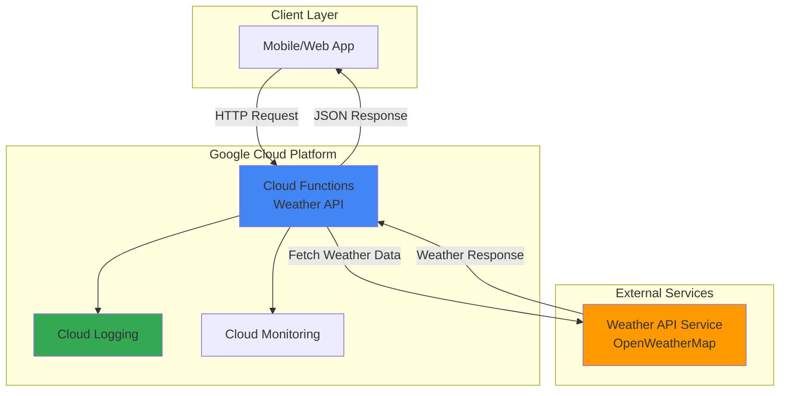

# Weather API with Cloud Functions

## Problem

Modern applications need access to real-time weather data for features like location-based recommendations, event planning, and outdoor activity apps. Building a traditional server-based weather service requires infrastructure management, scaling concerns, and ongoing operational overhead that can significantly increase development time and costs.

## Solution

Deploy a serverless weather API using Google Cloud Functions that fetches current weather data from an external weather service and returns formatted JSON responses. This serverless approach eliminates infrastructure management while providing automatic scaling, built-in monitoring, and pay-per-request pricing that optimizes costs for variable workloads.

## Architecture Diagram



## Prerequisites

1. Google Cloud account with billing enabled and appropriate permissions
2. Google Cloud CLI installed and configured (or use Cloud Shell)
3. Basic understanding of HTTP APIs and JSON data formats
4. Free OpenWeatherMap API key (or similar weather service)
5. Estimated cost: $0.01-$0.10 for testing (within free tier limits)

> **Note**: Cloud Functions provides 2 million invocations per month in the free tier, making this tutorial cost-effective for learning and development.

## Preparation

```bash
# Set environment variables for GCP resources
export PROJECT_ID="weather-api-$(date +%s)"
export REGION="us-central1"

# Generate unique suffix for resource names
RANDOM_SUFFIX=$(openssl rand -hex 3)
export FUNCTION_NAME="weather-api-${RANDOM_SUFFIX}"

# Create new project for this tutorial
gcloud projects create ${PROJECT_ID}

# Set default project and region
gcloud config set project ${PROJECT_ID}
gcloud config set functions/region ${REGION}

# Enable required APIs
gcloud services enable cloudfunctions.googleapis.com
gcloud services enable cloudbuild.googleapis.com
gcloud services enable artifactregistry.googleapis.com
gcloud services enable logging.googleapis.com

echo "✅ Project configured: ${PROJECT_ID}"
echo "✅ Function name: ${FUNCTION_NAME}"
```

## Steps

1. **Create Function Directory and Files**:

   Cloud Functions requires a specific project structure with source code and dependencies defined in separate files. Creating the proper directory structure ensures the deployment process can package and execute your serverless function correctly with the Functions Framework.

   ```bash
   # Create project directory
   mkdir weather-api-function
   cd weather-api-function
   
   # Create main function file
   cat > main.py << 'EOF'
import functions_framework
import requests
import json
import os
from flask import jsonify

@functions_framework.http
def weather_api(request):
    """HTTP Cloud Function for weather data retrieval."""
    
    # Enable CORS for web applications
    if request.method == 'OPTIONS':
        headers = {
            'Access-Control-Allow-Origin': '*',
            'Access-Control-Allow-Methods': 'GET, POST',
            'Access-Control-Allow-Headers': 'Content-Type',
            'Access-Control-Max-Age': '3600'
        }
        return ('', 204, headers)
    
    # Set CORS headers for actual request
    headers = {'Access-Control-Allow-Origin': '*'}
    
    try:
        # Get city parameter from request
        city = request.args.get('city', 'London')
        
        # Mock weather data for demonstration
        # In production, replace with actual weather API call
        mock_weather_data = {
            "city": city,
            "temperature": 22,
            "condition": "Partly Cloudy",
            "humidity": 65,
            "wind_speed": 12,
            "description": f"Current weather for {city}",
            "timestamp": "2025-07-23T10:00:00Z"
        }
        
        return (jsonify(mock_weather_data), 200, headers)
        
    except Exception as e:
        error_response = {
            "error": "Failed to fetch weather data",
            "message": str(e)
        }
        return (jsonify(error_response), 500, headers)
EOF
   
   echo "✅ Created main.py with weather API function"
   ```

2. **Create Requirements File**:

   The requirements.txt file defines Python dependencies that Cloud Functions will install during deployment. This ensures your function has access to necessary libraries like the Functions Framework and HTTP request handling capabilities.

   ```bash
   # Create requirements file
   cat > requirements.txt << 'EOF'
functions-framework==3.*
requests==2.*
Flask==2.*
EOF
   
   echo "✅ Created requirements.txt with dependencies"
   ```

3. **Deploy Cloud Function**:

   Deploying the Cloud Function creates a serverless HTTP endpoint that automatically scales based on request volume. The Functions Framework handles HTTP request routing, while Google Cloud manages the underlying infrastructure, security, and monitoring with the latest Python 3.13 runtime.

   ```bash
   # Deploy function with HTTP trigger using latest Python runtime
   gcloud functions deploy ${FUNCTION_NAME} \
       --gen2 \
       --runtime=python313 \
       --region=${REGION} \
       --source=. \
       --entry-point=weather_api \
       --trigger-http \
       --allow-unauthenticated \
       --memory=256MB \
       --timeout=60s
   
   echo "✅ Cloud Function deployed successfully"
   ```

4. **Get Function URL**:

   Cloud Functions automatically generates a unique HTTPS URL for each deployed function. This URL serves as the public endpoint for your weather API and can be integrated into web applications, mobile apps, or other services that need weather data.

   ```bash
   # Get the function URL
   export FUNCTION_URL=$(gcloud functions describe ${FUNCTION_NAME} \
       --region=${REGION} \
       --gen2 \
       --format="value(serviceConfig.uri)")
   
   echo "✅ Function URL: ${FUNCTION_URL}"
   echo "Weather API endpoint ready for testing"
   ```

5. **Test the Weather API**:

   Testing the deployed function verifies that the HTTP endpoint responds correctly to requests and returns properly formatted JSON data. This validation ensures the API is ready for integration with client applications and follows REST API best practices.

   ```bash
   # Test with default city (London)
   curl -s "${FUNCTION_URL}" | jq .
   
   # Test with specific city parameter
   curl -s "${FUNCTION_URL}?city=Paris" | jq .
   
   # Test error handling with invalid request method
   curl -s -X DELETE "${FUNCTION_URL}" | jq .
   
   echo "✅ Weather API testing completed"
   ```

## Validation & Testing

1. Verify function deployment status:

   ```bash
   # Check function status
   gcloud functions describe ${FUNCTION_NAME} \
       --region=${REGION} \
       --gen2 \
       --format="table(name,state,updateTime)"
   ```

   Expected output: Function should show status as "ACTIVE" with recent update time.

2. Test API functionality with different parameters:

   ```bash
   # Test multiple cities
   for city in "Tokyo" "Sydney" "New York"; do
       echo "Testing weather for: $city"
       curl -s "${FUNCTION_URL}?city=${city}" | \
           jq '.city, .temperature, .condition'
       echo "---"
   done
   ```

3. Verify function logs and monitoring:

   ```bash
   # View recent function logs
   gcloud functions logs read ${FUNCTION_NAME} \
       --region=${REGION} \
       --gen2 \
       --limit=10
   ```

## Cleanup

1. Delete the Cloud Function:

   ```bash
   # Delete the deployed function
   gcloud functions delete ${FUNCTION_NAME} \
       --region=${REGION} \
       --gen2 \
       --quiet
   
   echo "✅ Cloud Function deleted"
   ```

2. Remove project resources:

   ```bash
   # Delete the entire project to clean up all resources
   gcloud projects delete ${PROJECT_ID} --quiet
   
   # Reset local configuration
   unset PROJECT_ID REGION FUNCTION_NAME FUNCTION_URL RANDOM_SUFFIX
   
   echo "✅ Project and all resources cleaned up"
   echo "Note: Project deletion may take several minutes to complete"
   ```

3. Clean up local files:

   ```bash
   # Remove local project directory
   cd ..
   rm -rf weather-api-function
   
   echo "✅ Local files cleaned up"
   ```

## Discussion

Google Cloud Functions provides an ideal serverless platform for building lightweight APIs like weather services. The Functions Framework automatically handles HTTP request parsing, response formatting, and CORS configuration, allowing developers to focus on business logic rather than infrastructure concerns. This serverless approach offers several key advantages: automatic scaling from zero to thousands of concurrent requests, built-in security through Google Cloud's identity and access management, and cost optimization through pay-per-invocation pricing. The latest Python 3.13 runtime provides enhanced performance and security features that make it ideal for production workloads.

The weather API implementation demonstrates serverless best practices including proper error handling, CORS support for web applications, and structured JSON responses. In production environments, you would integrate with real weather services like OpenWeatherMap, AccuWeather, or government weather APIs using the `requests` library shown in the code. The mock data approach in this tutorial provides a foundation that can be easily extended with actual weather service integration by replacing the mock response with HTTP requests to external APIs. Consider implementing retry logic and circuit breaker patterns when integrating with external services to handle temporary failures gracefully.

Cloud Functions integrates seamlessly with other Google Cloud services, enabling sophisticated weather applications. You could enhance this API by adding Cloud Firestore for caching weather data, Cloud Monitoring for performance tracking, or Pub/Sub for real-time weather alerts. The serverless architecture also supports advanced patterns like request rate limiting through Cloud Endpoints, authentication via Cloud Identity-Aware Proxy, and multi-region deployment for global availability. Google's [Cloud Functions documentation](https://cloud.google.com/functions/docs) provides comprehensive guidance on these advanced patterns.

For production deployments, consider implementing authentication through Cloud Identity-Aware Proxy, API key validation for usage tracking, and integration with Cloud CDN for improved response times. The Google Cloud Operations suite provides comprehensive monitoring, logging, and alerting capabilities that help maintain high availability and performance for weather APIs serving thousands of requests per minute. The [Google Cloud Architecture Center](https://cloud.google.com/architecture) offers additional patterns and best practices for building production-ready serverless applications.

> **Tip**: Use Cloud Functions' built-in environment variables and Secret Manager integration to securely store weather API keys and other sensitive configuration data without hardcoding credentials in your source code.

## Challenge

Extend this weather API by implementing these enhancements:

1. **Real Weather Integration**: Replace mock data with actual weather service API calls using OpenWeatherMap or AccuWeather, including error handling for external service failures and response caching strategies with Cloud Memorystore.

2. **Enhanced Data Processing**: Add support for weather forecasts, historical data, and location-based services using IP geolocation or coordinates, with data transformation and aggregation capabilities using Cloud Functions' concurrent processing.

3. **Monitoring and Analytics**: Implement comprehensive logging with Cloud Logging, custom metrics with Cloud Monitoring, and request analytics to track API usage patterns and performance using Google Cloud's observability tools.

4. **Security and Authentication**: Add API key authentication, rate limiting using Cloud Endpoints, and request validation to prevent abuse and ensure secure access to weather data following Google Cloud security best practices.

5. **Multi-Region Deployment**: Deploy the function across multiple regions for global availability, implement health checks, and add automated failover mechanisms for high availability weather services using Google Cloud's global infrastructure.

## Infrastructure Code

### Available Infrastructure as Code:

- [Infrastructure Code Overview](code/README.md) - Detailed description of all infrastructure components
- [Infrastructure Manager](code/infrastructure-manager/) - GCP Infrastructure Manager templates
- [Bash CLI Scripts](code/scripts/) - Example bash scripts using gcloud CLI commands to deploy infrastructure
- [Terraform](code/terraform/) - Terraform configuration files