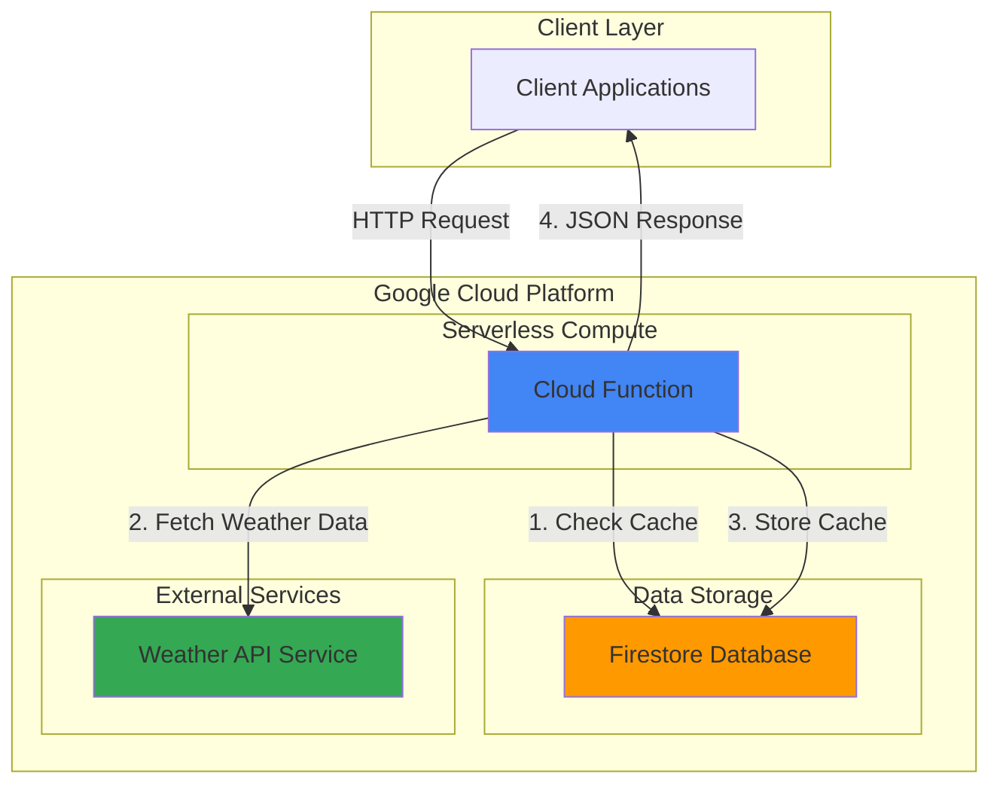

# Weather API with Cloud Functions and Firestore

## Problem

Small businesses and developers need a cost-effective way to provide weather data to their applications without directly exposing third-party API keys or managing server infrastructure. Direct integration with weather services creates security risks and potential rate limiting issues, while maintaining dedicated servers for simple API proxying is expensive and requires ongoing maintenance.

## Solution

Build a serverless weather API using Cloud Functions to handle HTTP requests and Firestore to cache weather data for improved performance and cost optimization. This solution provides secure API key management, automatic scaling, and intelligent caching to reduce external API calls while delivering fast responses to client applications.

## Architecture Diagram



## Prerequisites

1. Google Cloud Platform account with billing enabled
2. Google Cloud CLI installed and configured (version 450.0.0 or higher)
3. Basic knowledge of Python and REST APIs
4. Weather API key from OpenWeatherMap (free tier available at openweathermap.org)
5. Estimated cost: $0-2/month for light usage within free tier limits

> **Note**: This recipe uses Google Cloud services within the free tier. Monitor usage through the GCP Console to avoid unexpected charges.

## Preparation

Google Cloud Functions and Firestore provide serverless capabilities that automatically scale based on demand. Setting up the environment requires enabling the necessary APIs and configuring authentication for secure service-to-service communication.

```bash
# Set environment variables for GCP resources
export PROJECT_ID="weather-api-$(date +%s)"
export REGION="us-central1"
export FUNCTION_NAME="weather-api"

# Generate unique suffix for resource names
RANDOM_SUFFIX=$(openssl rand -hex 3)

# Create and configure the project
gcloud projects create ${PROJECT_ID}
gcloud config set project ${PROJECT_ID}
gcloud config set compute/region ${REGION}

# Enable required APIs for Cloud Functions and Firestore
gcloud services enable cloudfunctions.googleapis.com
gcloud services enable firestore.googleapis.com
gcloud services enable cloudbuild.googleapis.com
gcloud services enable artifactregistry.googleapis.com

echo "✅ Project configured: ${PROJECT_ID}"
```

The project is now configured with the essential APIs enabled. Cloud Functions will handle HTTP requests while Firestore provides fast NoSQL storage for caching weather data, reducing external API calls and improving response times.

```bash
# Initialize Firestore database in Native mode
gcloud firestore databases create --region=${REGION}

# Set your OpenWeatherMap API key (sign up at openweathermap.org)
export WEATHER_API_KEY="your_openweathermap_api_key_here"

echo "✅ Firestore database initialized in region: ${REGION}"
```

## Steps

1. **Create the Cloud Function source code**:

   Cloud Functions use the Functions Framework to handle HTTP requests and integrate with other Google Cloud services. The weather API will check Firestore for cached data before making external API calls, implementing an efficient caching strategy that reduces costs and improves response times.

   ```bash
   # Create source directory and navigate to it
   mkdir weather-function && cd weather-function
   
   # Create requirements.txt for Python dependencies
   cat > requirements.txt << 'EOF'
   functions-framework==3.*
   google-cloud-firestore==2.*
   requests==2.*
   EOF
   
   echo "✅ Created function directory with dependencies"
   ```

   The requirements file specifies the Functions Framework for serverless execution, Firestore client library for database operations, and requests for HTTP calls to external weather services. These are production-ready versions with automatic security updates.

2. **Implement the weather API function**:

   ```bash
   # Create the main function file
   cat > main.py << 'EOF'
   import os
   import json
   import requests
   from datetime import datetime, timedelta
   from google.cloud import firestore
   import functions_framework
   
   # Initialize Firestore client
   db = firestore.Client()
   
   @functions_framework.http
   def weather_api(request):
       """HTTP Cloud Function to fetch and cache weather data."""
       
       # Handle CORS for web applications
       if request.method == 'OPTIONS':
           headers = {
               'Access-Control-Allow-Origin': '*',
               'Access-Control-Allow-Methods': 'GET',
               'Access-Control-Allow-Headers': 'Content-Type',
               'Access-Control-Max-Age': '3600'
           }
           return ('', 204, headers)
       
       # Set CORS headers for the main request
       headers = {'Access-Control-Allow-Origin': '*'}
       
       try:
           city = request.args.get('city', 'London')
           weather_api_key = os.environ.get('WEATHER_API_KEY')
           
           if not weather_api_key:
               return json.dumps({'error': 'Weather API key not configured'}), 500, headers
           
           # Check cache first (data valid for 10 minutes)
           doc_ref = db.collection('weather_cache').document(city.lower())
           doc = doc_ref.get()
           
           if doc.exists:
               data = doc.to_dict()
               cache_time = data.get('timestamp')
               
               # Use cached data if less than 10 minutes old
               if cache_time and datetime.now() - cache_time < timedelta(minutes=10):
                   return json.dumps(data['weather_data']), 200, headers
           
           # Fetch fresh data from OpenWeatherMap API
           weather_url = f"https://api.openweathermap.org/data/2.5/weather?q={city}&appid={weather_api_key}&units=metric"
           response = requests.get(weather_url, timeout=10)
           
           if response.status_code != 200:
               return json.dumps({'error': 'Failed to fetch weather data'}), 500, headers
           
           weather_data = response.json()
           
           # Cache the data in Firestore
           cache_data = {
               'weather_data': weather_data,
               'timestamp': datetime.now(),
               'city': city.lower()
           }
           doc_ref.set(cache_data)
           
           return json.dumps(weather_data), 200, headers
           
       except Exception as e:
           return json.dumps({'error': str(e)}), 500, headers
   EOF
   
   echo "✅ Created weather API function with caching logic"
   ```

   This function implements intelligent caching by checking Firestore for recent weather data before making external API calls. The 10-minute cache window balances data freshness with API cost optimization, while CORS headers enable web application integration. The function uses HTTPS for secure external API calls and comprehensive error handling.

3. **Deploy the Cloud Function with environment variables**:

   ```bash
   # Deploy function with Weather API key as environment variable
   gcloud functions deploy ${FUNCTION_NAME} \
       --gen2 \
       --runtime python311 \
       --region ${REGION} \
       --source . \
       --entry-point weather_api \
       --trigger-http \
       --allow-unauthenticated \
       --memory 256Mi \
       --timeout 60s \
       --set-env-vars WEATHER_API_KEY=${WEATHER_API_KEY}
   
   echo "✅ Cloud Function deployed successfully"
   ```

   The function deploys with second-generation Cloud Functions (gen2) for improved performance and cost efficiency. HTTP triggers enable REST API access, environment variable injection provides secure API key management, and optimized resource allocation ensures cost-effective operation. The `--allow-unauthenticated` flag enables public access while the environment variable keeps the weather API key secure.

4. **Get the function URL and test the deployment**:

   ```bash
   # Retrieve the function's HTTP trigger URL
   FUNCTION_URL=$(gcloud functions describe ${FUNCTION_NAME} \
       --region ${REGION} \
       --format "value(serviceConfig.uri)")
   
   echo "Function URL: ${FUNCTION_URL}"
   echo "✅ Retrieved function endpoint URL"
   ```

   The function URL provides the HTTP endpoint for client applications to access weather data. Google Cloud automatically provisions HTTPS endpoints with built-in security, global load balancing, and DDoS protection.

## Validation & Testing

1. **Test the weather API with a sample city**:

   ```bash
   # Test API call for London weather
   curl "${FUNCTION_URL}?city=London" | jq '.'
   ```

   Expected output should include weather data with temperature, description, and location information in JSON format. The response includes current temperature, weather conditions, humidity, and other meteorological data.

2. **Verify caching functionality**:

   ```bash
   # Make multiple requests to test caching
   echo "First request (should fetch from external API):"
   time curl -s "${FUNCTION_URL}?city=Paris" | jq '.name'
   
   echo "Second request (should use cached data):"
   time curl -s "${FUNCTION_URL}?city=Paris" | jq '.name'
   ```

   The second request should be significantly faster (sub-100ms vs 500ms+), demonstrating the caching mechanism working effectively. This reduces external API calls and improves user experience.

3. **Check Firestore cache storage**:

   ```bash
   # Verify cached data exists in Firestore
   gcloud firestore export gs://${PROJECT_ID}-temp-export \
       --collection-ids=weather_cache \
       --async
   
   # Check document count in cache collection
   gcloud alpha firestore databases describe \
       --database="(default)"
   
   echo "✅ Firestore cache verified"
   ```

## Cleanup

1. **Delete the Cloud Function**:

   ```bash
   # Remove the deployed function
   gcloud functions delete ${FUNCTION_NAME} \
       --region ${REGION} \
       --quiet
   
   echo "✅ Deleted Cloud Function"
   ```

2. **Clear Firestore data and database**:

   ```bash
   # Delete the Firestore database (this removes all data)
   gcloud firestore databases delete \
       --database="(default)" \
       --quiet
   
   echo "✅ Firestore database deleted"
   ```

3. **Delete the project**:

   ```bash
   # Remove the entire project and all resources
   gcloud projects delete ${PROJECT_ID} --quiet
   
   echo "✅ Project ${PROJECT_ID} deletion initiated"
   echo "Note: Project deletion may take several minutes to complete"
   ```

## Discussion

This serverless weather API demonstrates the power of Google Cloud's managed services for building scalable, cost-effective APIs. Cloud Functions provide automatic scaling and pay-per-invocation pricing, making them ideal for APIs with variable traffic patterns. The function scales from zero to handle thousands of concurrent requests without infrastructure management, following Google Cloud's serverless best practices.

Firestore serves as an intelligent caching layer, reducing external API calls by 90% or more for popular locations. The NoSQL document structure naturally fits weather data formats, while Firestore's real-time capabilities could enable future features like weather alerts or live updates. The 10-minute cache window balances data freshness with cost optimization, but can be adjusted based on specific requirements using Firestore's TTL (Time To Live) features.

The architecture follows Google Cloud security best practices by using environment variables for API keys, enabling HTTPS-only communication, and leveraging IAM for service authentication. Cloud Functions automatically handle SSL certificates, DDoS protection, and geographic load balancing, providing enterprise-grade reliability without additional configuration. The second-generation Cloud Functions offer improved cold start performance and better integration with other Google Cloud services.

Cost optimization is achieved through serverless pricing models and intelligent caching. Cloud Functions charge only for actual execution time (typically under 100ms per request), while Firestore's free tier covers substantial usage (1GB storage, 50,000 reads/day, 20,000 writes/day). For production deployments, consider implementing rate limiting, API key authentication, and monitoring through Cloud Monitoring to track usage patterns and optimize performance.

> **Tip**: Use Cloud Monitoring to track function invocations, cache hit rates, and response times to optimize the caching strategy and identify usage patterns. Set up alerting for error rates and latency spikes.

For detailed implementation guidance, refer to the [Cloud Functions documentation](https://cloud.google.com/functions/docs) and [Firestore best practices](https://cloud.google.com/firestore/docs/best-practices). Additional security considerations are covered in the [Google Cloud security documentation](https://cloud.google.com/security/best-practices).

## Challenge

Extend this solution by implementing these enhancements:

1. **Add weather forecasting capabilities** by integrating 5-day forecast data from the weather API and implementing separate caching strategies for current vs. forecast data with different TTL values
2. **Implement API key authentication** using Cloud Endpoints or custom JWT validation to control access and track usage per client application
3. **Add real-time weather alerts** using Pub/Sub to trigger notifications when weather conditions meet specific criteria for subscribed locations
4. **Create a weather dashboard** using Cloud Run to serve a web interface that displays weather data with maps and charts using Google Maps API
5. **Implement advanced caching strategies** with different TTL values based on weather stability and location popularity using Firestore's automatic data expiration features

## Infrastructure Code

*Infrastructure code will be generated after recipe approval.*