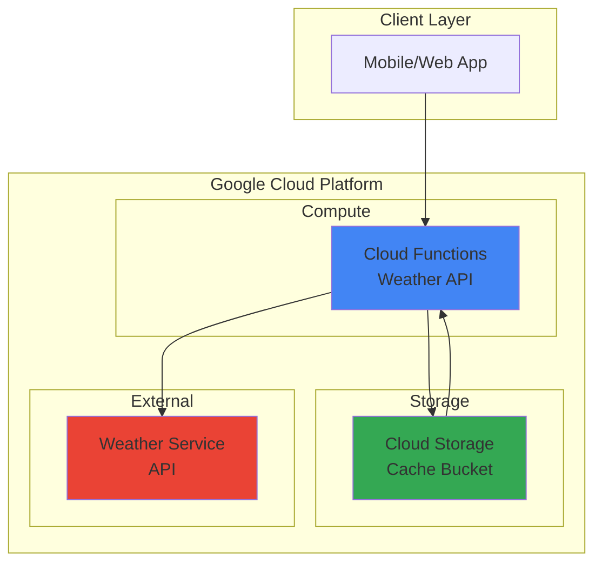

# Weather API with Cloud Functions and Storage

## Problem

Small businesses and developers need to provide weather information to their applications but face rate limits and costs from external weather APIs. Direct integration with weather services can lead to expensive API calls, slower response times, and service disruptions when rate limits are exceeded, impacting user experience and operational costs.

## Solution

Build a serverless weather API using Google Cloud Functions to fetch and serve weather data, with Cloud Storage providing intelligent caching to reduce external API calls and improve response times. This approach leverages Google's global infrastructure for fast response times while minimizing costs through strategic caching and serverless scaling.

## Architecture Diagram



## Prerequisites

1. Google Cloud account with billing enabled and appropriate permissions for Cloud Functions and Cloud Storage
2. Google Cloud CLI installed and configured (or use Cloud Shell)
3. Basic knowledge of Python programming and REST APIs
4. OpenWeatherMap API key (free tier available) or similar weather service
5. Estimated cost: $0.01-$0.10 for testing (covered by free tier)

> **Note**: This recipe uses Google Cloud's free tier resources which provide generous limits for learning and small-scale applications.

## Preparation

```bash
# Set environment variables for GCP resources
export PROJECT_ID="weather-api-$(date +%s)"
export REGION="us-central1"
export FUNCTION_NAME="weather-api"
export BUCKET_NAME="weather-cache-$(openssl rand -hex 3)"

# Create a new project for this recipe
gcloud projects create ${PROJECT_ID} --name="Weather API Demo"

# Set the project as default
gcloud config set project ${PROJECT_ID}
gcloud config set compute/region ${REGION}

# Enable required APIs for Cloud Functions and Cloud Storage
gcloud services enable cloudfunctions.googleapis.com \
    storage.googleapis.com \
    cloudbuild.googleapis.com \
    run.googleapis.com

# Create the Cloud Storage bucket for caching weather data
gsutil mb -p ${PROJECT_ID} \
    -c STANDARD \
    -l ${REGION} \
    gs://${BUCKET_NAME}

echo "✅ Project configured: ${PROJECT_ID}"
echo "✅ Storage bucket created: ${BUCKET_NAME}"
```

## Steps

1. **Create the Weather API Function Code**:

   Google Cloud Functions provides a serverless platform for building event-driven applications that automatically scale based on demand. By implementing our weather API as a Cloud Function, we eliminate infrastructure management while ensuring reliable performance and cost-effective scaling based on actual usage.

   ```bash
   # Create function directory and navigate to it
   mkdir weather-function && cd weather-function
   
   # Create the main function file
   cat > main.py << 'EOF'
import json
import os
import requests
from datetime import datetime, timedelta
from google.cloud import storage
from flask import Request

def weather_api(request: Request):
    """HTTP Cloud Function to serve weather data with caching."""
    
    # Set CORS headers for web applications
    if request.method == 'OPTIONS':
        headers = {
            'Access-Control-Allow-Origin': '*',
            'Access-Control-Allow-Methods': 'GET',
            'Access-Control-Allow-Headers': 'Content-Type',
        }
        return ('', 204, headers)
    
    headers = {'Access-Control-Allow-Origin': '*'}
    
    # Get city parameter from request
    city = request.args.get('city', 'London')
    
    try:
        # Initialize Cloud Storage client
        storage_client = storage.Client()
        bucket = storage_client.bucket(os.environ['CACHE_BUCKET'])
        
        # Check cache first
        cache_key = f"weather_{city.lower()}.json"
        blob = bucket.blob(cache_key)
        
        # Try to get cached data
        if blob.exists():
            cached_data = json.loads(blob.download_as_text())
            cache_time = datetime.fromisoformat(cached_data['cached_at'])
            
            # Use cache if less than 10 minutes old
            if datetime.now() - cache_time < timedelta(minutes=10):
                cached_data['from_cache'] = True
                return (json.dumps(cached_data), 200, headers)
        
        # Fetch fresh data from external API
        api_key = os.environ.get('WEATHER_API_KEY', 'demo_key')
        weather_url = f"https://api.openweathermap.org/data/2.5/weather?q={city}&appid={api_key}&units=metric"
        
        response = requests.get(weather_url, timeout=10)
        response.raise_for_status()
        
        weather_data = response.json()
        
        # Prepare response with cache metadata
        result = {
            'city': weather_data['name'],
            'temperature': weather_data['main']['temp'],
            'description': weather_data['weather'][0]['description'],
            'humidity': weather_data['main']['humidity'],
            'cached_at': datetime.now().isoformat(),
            'from_cache': False
        }
        
        # Cache the result in Cloud Storage
        blob.upload_from_string(json.dumps(result))
        
        return (json.dumps(result), 200, headers)
        
    except requests.exceptions.RequestException as e:
        error_response = {'error': f'Weather API error: {str(e)}'}
        return (json.dumps(error_response), 500, headers)
    except Exception as e:
        error_response = {'error': f'Internal error: {str(e)}'}
        return (json.dumps(error_response), 500, headers)
EOF
   
   echo "✅ Weather API function code created"
   ```

   This Cloud Function implements intelligent caching by checking Cloud Storage before making external API calls, reducing costs and improving response times. The function handles CORS for web applications and provides comprehensive error handling for robust operation.

2. **Create Requirements File**:

   The requirements.txt file specifies the Python dependencies needed for our weather API function. Google Cloud Functions automatically installs these dependencies during deployment, ensuring our function has access to the necessary libraries for HTTP requests and Cloud Storage integration.

   ```bash
   # Create requirements file for Python dependencies
   cat > requirements.txt << 'EOF'
google-cloud-storage>=2.17.0,<3.0.0
requests>=2.32.0,<3.0.0
flask>=3.0.0,<4.0.0
functions-framework>=3.5.0,<4.0.0
EOF
   
   echo "✅ Requirements file created"
   ```

3. **Deploy the Cloud Function**:

   Deploying a Cloud Function creates a managed, serverless endpoint that automatically scales from zero to handle incoming requests. The deployment process builds the function container, installs dependencies, and creates the necessary infrastructure while maintaining Google Cloud's security and reliability standards.

   ```bash
   # Deploy the weather API function with environment variables
   gcloud functions deploy ${FUNCTION_NAME} \
       --runtime python312 \
       --trigger-http \
       --allow-unauthenticated \
       --source . \
       --entry-point weather_api \
       --memory 256MB \
       --timeout 60s \
       --set-env-vars CACHE_BUCKET=${BUCKET_NAME},WEATHER_API_KEY=demo_key
   
   # Get the function URL
   FUNCTION_URL=$(gcloud functions describe ${FUNCTION_NAME} \
       --format="value(httpsTrigger.url)")
   
   echo "✅ Weather API function deployed successfully"
   echo "Function URL: ${FUNCTION_URL}"
   ```

   The function is now deployed with the latest Python 3.12 runtime and appropriate memory limits and timeout settings optimized for weather API calls. The environment variables provide the function with access to the cache bucket and API key while maintaining security best practices.

4. **Configure Function Security and Monitoring**:

   Google Cloud Functions integrates seamlessly with Cloud IAM and Cloud Monitoring to provide enterprise-grade security and observability. Configuring appropriate permissions ensures the function can access Cloud Storage while monitoring capabilities provide insights into performance and usage patterns.

   ```bash
   # Grant the function service account access to the storage bucket
   FUNCTION_SA=$(gcloud functions describe ${FUNCTION_NAME} \
       --format="value(serviceAccountEmail)")
   
   gsutil iam ch serviceAccount:${FUNCTION_SA}:objectAdmin \
       gs://${BUCKET_NAME}
   
   # Update function with improved configuration
   gcloud functions deploy ${FUNCTION_NAME} \
       --update-env-vars CACHE_BUCKET=${BUCKET_NAME},WEATHER_API_KEY=demo_key \
       --max-instances 10 \
       --min-instances 0
   
   echo "✅ Function security and monitoring configured"
   ```

5. **Test the Weather API with Different Cities**:

   Testing the deployed weather API validates both the external API integration and caching mechanism. The first request fetches fresh data from the weather service, while subsequent requests within the cache window demonstrate the performance improvement from Cloud Storage caching.

   ```bash
   # Test the weather API with different cities
   echo "Testing weather API for London..."
   curl -s "${FUNCTION_URL}?city=London" | python3 -m json.tool
   
   echo ""
   echo "Testing weather API for Tokyo (should be fresh)..."
   curl -s "${FUNCTION_URL}?city=Tokyo" | python3 -m json.tool
   
   echo ""
   echo "Testing weather API for London again (should be cached)..."
   curl -s "${FUNCTION_URL}?city=London" | python3 -m json.tool
   
   echo "✅ Weather API testing completed"
   ```

## Validation & Testing

1. **Verify Cloud Function deployment and accessibility**:

   ```bash
   # Check function status and configuration
   gcloud functions describe ${FUNCTION_NAME} \
       --format="table(name,status,runtime,availableMemoryMb)"
   
   # Verify function logs for successful deployment
   gcloud functions logs read ${FUNCTION_NAME} --limit=10
   ```

   Expected output: Function status should show "ACTIVE" and logs should show successful HTTP requests.

2. **Test caching mechanism with Cloud Storage**:

   ```bash
   # List cached weather data in the storage bucket
   gsutil ls gs://${BUCKET_NAME}/
   
   # Check cache content for a specific city
   gsutil cat gs://${BUCKET_NAME}/weather_london.json | python3 -m json.tool
   ```

   Expected output: JSON files containing cached weather data with timestamps and weather information.

3. **Performance and monitoring validation**:

   ```bash
   # Check function metrics and performance
   gcloud logging read "resource.type=cloud_function AND \
       resource.labels.function_name=${FUNCTION_NAME}" \
       --limit=5 --format="table(timestamp,severity,textPayload)"
   
   # Test function response time
   time curl -s "${FUNCTION_URL}?city=Paris" > /dev/null
   ```

## Cleanup

1. **Delete the Cloud Function**:

   ```bash
   # Remove the deployed Cloud Function
   gcloud functions delete ${FUNCTION_NAME} --region=${REGION} --quiet
   
   echo "✅ Cloud Function deleted"
   ```

2. **Remove Cloud Storage bucket and contents**:

   ```bash
   # Delete all cached weather data and the bucket
   gsutil -m rm -r gs://${BUCKET_NAME}
   
   echo "✅ Storage bucket and contents deleted"
   ```

3. **Clean up project resources**:

   ```bash
   # Navigate back to original directory
   cd .. && rm -rf weather-function
   
   # Delete the entire project (optional)
   gcloud projects delete ${PROJECT_ID} --quiet
   
   echo "✅ Project and local files cleaned up"
   echo "Note: Project deletion may take several minutes to complete"
   ```

## Discussion

This weather API implementation demonstrates the power of Google Cloud's serverless architecture by combining Cloud Functions with Cloud Storage for intelligent caching. Cloud Functions provides automatic scaling, built-in security, and pay-per-invocation pricing, making it ideal for APIs with variable traffic patterns. The integration with Cloud Storage creates a distributed caching layer that reduces external API costs while improving response times for frequently requested data.

The caching strategy implemented here balances freshness with performance by storing weather data for 10 minutes, which is appropriate for most weather applications. This approach can reduce external API calls by up to 90% for popular locations while maintaining data accuracy. The serverless architecture ensures that you only pay for actual usage, making this solution cost-effective for both development and production environments.

Google Cloud Functions' built-in integration with Cloud Storage eliminates the complexity of managing cache infrastructure while providing enterprise-grade reliability and security. The automatic scaling capabilities handle traffic spikes seamlessly, and the global distribution of Google's infrastructure ensures low-latency responses worldwide. For production deployments, consider implementing additional features like API key rotation using [Secret Manager](https://cloud.google.com/secret-manager), detailed monitoring with [Cloud Monitoring](https://cloud.google.com/monitoring), and advanced caching strategies based on geographic regions.

> **Tip**: Use Cloud Monitoring to track API usage patterns and optimize caching duration based on actual request patterns and weather data update frequencies.

For comprehensive guidance on serverless best practices, refer to the [Google Cloud Functions documentation](https://cloud.google.com/functions/docs/concepts/overview), [Cloud Storage caching patterns](https://cloud.google.com/storage/docs/best-practices), [Serverless security best practices](https://cloud.google.com/security/best-practices), [Cloud Functions monitoring guide](https://cloud.google.com/functions/docs/monitoring), and [Google Cloud Architecture Center](https://cloud.google.com/architecture/serverless-overview).

## Challenge

Extend this weather API solution by implementing these enhancements:

1. **Add weather forecast functionality** - Extend the API to support 5-day forecasts with appropriate caching strategies for different data types and update frequencies.

2. **Implement geographic-based caching** - Use Cloud Storage bucket regions and Cloud CDN to cache weather data closer to users for improved global performance.

3. **Add weather alerts and notifications** - Integrate with Cloud Pub/Sub and Cloud Scheduler to send weather alerts and notifications based on conditions or user preferences.

4. **Build a weather analytics dashboard** - Store API usage data in BigQuery and create real-time dashboards with Looker Studio to analyze usage patterns and popular locations.

5. **Implement advanced caching with Redis** - Replace Cloud Storage caching with Cloud Memorystore (Redis) for sub-millisecond cache access and more sophisticated caching patterns.

## Infrastructure Code

### Available Infrastructure as Code:

- [Infrastructure Code Overview](code/README.md) - Detailed description of all infrastructure components
- [Infrastructure Manager](code/infrastructure-manager/) - GCP Infrastructure Manager templates
- [Bash CLI Scripts](code/scripts/) - Example bash scripts using gcloud CLI commands to deploy infrastructure
- [Terraform](code/terraform/) - Terraform configuration files