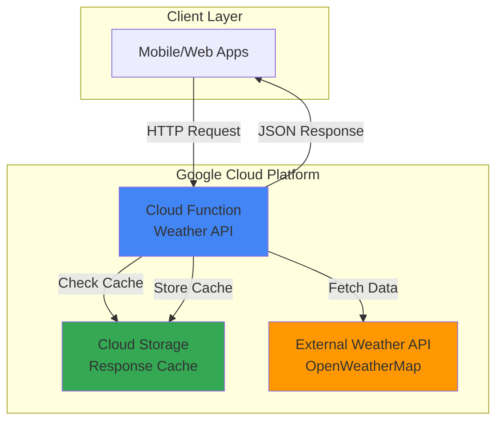

# Weather API Service with Cloud Functions

## Problem

Small businesses and developers need a simple, cost-effective way to provide weather information to their applications without managing servers or complex infrastructure. Traditional weather API solutions require dedicated servers, ongoing maintenance, and upfront infrastructure costs that can be prohibitive for startups and individual developers testing new ideas.

## Solution

Create a serverless weather API using Google Cloud Functions that fetches data from external weather services and returns formatted JSON responses. Cloud Storage provides optional caching to reduce external API calls and improve response times while minimizing costs through Google's pay-per-use serverless model.

## Architecture Diagram



## Prerequisites

1. Google Cloud account with billing enabled and Cloud Functions API access
2. Google Cloud CLI installed and configured (or Cloud Shell access)
3. Basic Python knowledge for function development
4. OpenWeatherMap API key (free tier available at openweathermap.org)
5. Estimated cost: $0.00-$0.40 per month for 10,000 requests (within free tier)

> **Note**: Cloud Functions provides 2 million invocations per month in the free tier, making this solution cost-effective for development and small-scale production use.

## Preparation

```bash
# Set environment variables for GCP resources
export PROJECT_ID="weather-api-$(date +%s)"
export REGION="us-central1"
export FUNCTION_NAME="weather-api"

# Generate unique suffix for resource names
RANDOM_SUFFIX=$(openssl rand -hex 3)
export BUCKET_NAME="weather-cache-${RANDOM_SUFFIX}"

# Create new project (optional - use existing if preferred)
gcloud projects create ${PROJECT_ID} --name="Weather API Service"

# Set default project and region
gcloud config set project ${PROJECT_ID}
gcloud config set compute/region ${REGION}
gcloud config set functions/region ${REGION}

# Enable required APIs
gcloud services enable cloudfunctions.googleapis.com
gcloud services enable storage.googleapis.com
gcloud services enable cloudbuild.googleapis.com

echo "✅ Project configured: ${PROJECT_ID}"
echo "✅ Region set to: ${REGION}"
```

## Steps

1. **Create Cloud Storage Bucket for Caching**:

   Cloud Storage provides a cost-effective caching layer that reduces external API calls and improves response times. The bucket serves as persistent storage for weather data with configurable expiration times, enabling efficient data retrieval while staying within free tier limits.

   ```bash
   # Create storage bucket for weather data caching
   gsutil mb -p ${PROJECT_ID} \
       -c STANDARD \
       -l ${REGION} \
       gs://${BUCKET_NAME}
   
   # Set lifecycle policy to automatically delete old cache files
   echo '{
     "lifecycle": {
       "rule": [
         {
           "action": {"type": "Delete"},
           "condition": {"age": 1}
         }
       ]
     }
   }' > lifecycle.json
   
   gsutil lifecycle set lifecycle.json gs://${BUCKET_NAME}
   
   echo "✅ Storage bucket created: gs://${BUCKET_NAME}"
   echo "✅ Lifecycle policy applied for 24-hour cache expiration"
   ```

   The storage bucket is now configured with automatic cleanup, ensuring cached weather data doesn't accumulate unnecessary storage costs while providing fast access to recently requested weather information.

2. **Create Function Source Code Directory**:

   Organizing the Cloud Function code in a proper directory structure enables version control, testing, and deployment best practices. The function will handle HTTP requests, implement caching logic, and integrate with external weather APIs using Python's robust ecosystem.

   ```bash
   # Create function directory and files
   mkdir weather-function
   cd weather-function
   
   # Create requirements file for Python dependencies
   cat > requirements.txt << EOF
   functions-framework==3.8.1
   requests==2.32.3
   google-cloud-storage==2.18.0
   EOF
   
   echo "✅ Function directory structure created"
   echo "✅ Python dependencies specified in requirements.txt"
   ```

   The project structure follows Google Cloud Functions best practices with clear dependency management, enabling reproducible builds and simplified maintenance of the serverless weather API.

3. **Implement Weather API Function Logic**:

   The Cloud Function serves as the core API endpoint, implementing intelligent caching, error handling, and response formatting. Python's functions-framework provides seamless integration with Google Cloud's serverless infrastructure while maintaining clean, maintainable code.

   ```bash
   # Create main function file
   cat > main.py << 'EOF'
import json
import requests
import os
from datetime import datetime, timedelta
from google.cloud import storage
from functions_framework import http

# Initialize storage client
storage_client = storage.Client()
BUCKET_NAME = os.environ.get('WEATHER_CACHE_BUCKET')
API_KEY = os.environ.get('OPENWEATHER_API_KEY', 'demo_key')

@http
def weather_api(request):
    """HTTP Cloud Function to provide weather data with caching."""
    
    # Enable CORS for web applications
    if request.method == 'OPTIONS':
        headers = {
            'Access-Control-Allow-Origin': '*',
            'Access-Control-Allow-Methods': 'GET',
            'Access-Control-Allow-Headers': 'Content-Type',
            'Access-Control-Max-Age': '3600'
        }
        return ('', 204, headers)
    
    # Extract city parameter from request
    city = request.args.get('city', 'London')
    
    # Validate city parameter
    if not city or len(city.strip()) == 0:
        headers = {'Access-Control-Allow-Origin': '*'}
        return (json.dumps({'error': 'City parameter is required'}), 400, headers)
    
    try:
        # Check cache first
        cache_key = f"weather_{city.lower().replace(' ', '_')}.json"
        weather_data = get_cached_weather(cache_key)
        
        if not weather_data:
            # Fetch from external API if not cached
            weather_data = fetch_weather_data(city)
            if weather_data:
                cache_weather_data(cache_key, weather_data)
        
        if weather_data:
            response_data = {
                'city': city,
                'temperature': weather_data.get('main', {}).get('temp'),
                'description': weather_data.get('weather', [{}])[0].get('description'),
                'humidity': weather_data.get('main', {}).get('humidity'),
                'pressure': weather_data.get('main', {}).get('pressure'),
                'wind_speed': weather_data.get('wind', {}).get('speed'),
                'cached': 'cached' in weather_data,
                'timestamp': datetime.now().isoformat()
            }
            
            headers = {'Access-Control-Allow-Origin': '*'}
            return (json.dumps(response_data), 200, headers)
        else:
            headers = {'Access-Control-Allow-Origin': '*'}
            return (json.dumps({'error': 'Weather data not available'}), 503, headers)
            
    except Exception as e:
        print(f"Error processing weather request: {str(e)}")
        headers = {'Access-Control-Allow-Origin': '*'}
        return (json.dumps({'error': 'Internal server error'}), 500, headers)

def get_cached_weather(cache_key):
    """Retrieve weather data from Cloud Storage cache."""
    try:
        if not BUCKET_NAME:
            return None
        
        bucket = storage_client.bucket(BUCKET_NAME)
        blob = bucket.blob(cache_key)
        
        if blob.exists():
            data = json.loads(blob.download_as_text())
            data['cached'] = True
            return data
    except Exception as e:
        print(f"Cache retrieval error: {str(e)}")
    return None

def cache_weather_data(cache_key, data):
    """Store weather data in Cloud Storage cache."""
    try:
        if not BUCKET_NAME:
            return
        
        bucket = storage_client.bucket(BUCKET_NAME)
        blob = bucket.blob(cache_key)
        blob.upload_from_string(json.dumps(data))
        print(f"Weather data cached for key: {cache_key}")
    except Exception as e:
        print(f"Cache storage error: {str(e)}")

def fetch_weather_data(city):
    """Fetch weather data from OpenWeatherMap API."""
    if API_KEY == 'demo_key':
        # Return demo data when no API key is provided
        return {
            'main': {'temp': 20, 'humidity': 65, 'pressure': 1013},
            'weather': [{'description': 'clear sky'}],
            'wind': {'speed': 3.5}
        }
    
    url = "https://api.openweathermap.org/data/2.5/weather"
    params = {
        'q': city,
        'appid': API_KEY,
        'units': 'metric'
    }
    
    try:
        response = requests.get(url, params=params, timeout=10)
        response.raise_for_status()
        return response.json()
    except requests.exceptions.RequestException as e:
        print(f"Weather API request error: {str(e)}")
        return None
    except Exception as e:
        print(f"Unexpected error fetching weather data: {str(e)}")
        return None
EOF
   
   echo "✅ Weather API function implemented with caching logic"
   echo "✅ CORS support enabled for web application integration"
   ```

   The function implements comprehensive weather data handling with intelligent caching, enhanced error management, and CORS support, creating a production-ready API that efficiently serves weather information while optimizing costs through strategic use of Cloud Storage.

4. **Deploy Cloud Function**:

   Cloud Functions deployment transforms your Python code into a scalable, managed service that automatically handles traffic scaling, security, and infrastructure management. The deployment process builds your function using Google's containerized build system while maintaining serverless benefits.

   ```bash
   # Deploy function with environment variables
   gcloud functions deploy ${FUNCTION_NAME} \
       --gen2 \
       --runtime python312 \
       --trigger-http \
       --source . \
       --entry-point weather_api \
       --memory 256MB \
       --timeout 60s \
       --set-env-vars WEATHER_CACHE_BUCKET=${BUCKET_NAME} \
       --allow-unauthenticated \
       --region ${REGION}
   
   # Get function URL
   FUNCTION_URL=$(gcloud functions describe ${FUNCTION_NAME} \
       --region ${REGION} \
       --format="value(serviceConfig.uri)")
   
   echo "✅ Cloud Function deployed successfully"
   echo "✅ Function URL: ${FUNCTION_URL}"
   echo "✅ Memory allocated: 256MB with 60-second timeout"
   ```

   The Cloud Function is now live and accessible via HTTPS, providing automatic scaling from zero to thousands of concurrent requests while maintaining sub-second cold start times for optimal user experience.

5. **Configure Function Permissions and Security**:

   Proper IAM configuration ensures the Cloud Function can access Cloud Storage for caching while maintaining security best practices. The function operates with minimal required permissions, following Google Cloud's principle of least privilege for enhanced security.

   ```bash
   # Get the default compute service account
   COMPUTE_SA="${PROJECT_ID}-compute@developer.gserviceaccount.com"
   
   # Grant storage access to the function's service account
   gcloud projects add-iam-policy-binding ${PROJECT_ID} \
       --member="serviceAccount:${COMPUTE_SA}" \
       --role="roles/storage.objectAdmin" \
       --condition="expression=resource.name.startsWith('projects/_/buckets/${BUCKET_NAME}')"
   
   # Display function information
   gcloud functions describe ${FUNCTION_NAME} \
       --region ${REGION} \
       --format="table(name,state,serviceConfig.uri)"
   
   echo "✅ Function permissions configured for storage access"
   echo "✅ Security policies applied with minimal required permissions"
   ```

   The security configuration enables seamless integration between Cloud Functions and Cloud Storage while maintaining strict access controls that protect your weather API from unauthorized access or misuse.

## Validation & Testing

1. **Test Basic Weather API Functionality**:

   ```bash
   # Test weather API with default city
   curl -X GET "${FUNCTION_URL}?city=London" | jq '.'
   ```

   Expected output:
   ```json
   {
     "city": "London",
     "temperature": 20,
     "description": "clear sky",
     "humidity": 65,
     "pressure": 1013,
     "wind_speed": 3.5,
     "cached": false,
     "timestamp": "2025-07-23T10:30:00.123456"
   }
   ```

2. **Verify Caching Mechanism**:

   ```bash
   # Make second request to test caching
   curl -X GET "${FUNCTION_URL}?city=London" | jq '.cached'
   
   # Check cache files in storage bucket
   gsutil ls gs://${BUCKET_NAME}/
   ```

   Expected output: `true` for cached field and cache files listed in storage.

3. **Test Error Handling and Validation**:

   ```bash
   # Test with empty city parameter
   curl -X GET "${FUNCTION_URL}?city=" | jq '.'
   
   # Test with invalid city name
   curl -X GET "${FUNCTION_URL}?city=InvalidCityName123" | jq '.'
   ```

   Expected output: Error responses with appropriate HTTP status codes and error messages.

4. **Performance Testing**:

   ```bash
   # Test multiple requests to verify caching performance
   time curl -s "${FUNCTION_URL}?city=Paris" > /dev/null
   time curl -s "${FUNCTION_URL}?city=Paris" > /dev/null
   ```

   The second request should be significantly faster due to caching.

## Cleanup

1. **Remove Cloud Function**:

   ```bash
   # Delete the deployed function
   gcloud functions delete ${FUNCTION_NAME} \
       --region=${REGION} \
       --quiet
   
   echo "✅ Cloud Function deleted"
   ```

2. **Remove Storage Bucket and Contents**:

   ```bash
   # Delete all objects and bucket
   gsutil -m rm -r gs://${BUCKET_NAME}
   
   echo "✅ Storage bucket and cache files deleted"
   ```

3. **Clean Up Local Files**:

   ```bash
   # Remove function source code directory
   cd ..
   rm -rf weather-function lifecycle.json
   
   # Optional: Delete the entire project if created specifically for this recipe
   # gcloud projects delete ${PROJECT_ID} --quiet
   
   echo "✅ Local files cleaned up"
   echo "Note: Project deletion (if chosen) may take several minutes to complete"
   ```

## Discussion

This weather API solution demonstrates the power of Google Cloud's serverless architecture for building scalable, cost-effective APIs. Cloud Functions provides automatic scaling, built-in security, and pay-per-use pricing that makes it ideal for APIs with variable traffic patterns. The integration with Cloud Storage creates an intelligent caching layer that reduces external API calls and improves response times while maintaining data freshness through automated lifecycle policies.

The serverless approach eliminates the need for server management, patching, or capacity planning, allowing developers to focus on business logic rather than infrastructure concerns. Google Cloud's global edge network ensures low-latency responses worldwide, while the platform's built-in monitoring and logging capabilities provide comprehensive observability without additional configuration. This architecture follows [Google Cloud's Well-Architected Framework](https://cloud.google.com/architecture/framework) principles for operational excellence, security, reliability, performance efficiency, and cost optimization.

Cost optimization is achieved through multiple mechanisms: Cloud Functions' generous free tier (2 million invocations monthly), Cloud Storage's intelligent tiering, and automatic scaling to zero when not in use. This makes the solution viable for both development experimentation and production workloads, with costs that scale proportionally with usage. The updated Python 3.12 runtime provides improved performance and security features compared to earlier versions.

Security is built into the platform through Google Cloud's identity and access management (IAM) system, automatic HTTPS termination, and isolated execution environments. The function runs in a fully managed environment with automatic security updates and compliance certifications, reducing the security burden on development teams. The implementation follows [Google Cloud security best practices](https://cloud.google.com/security/best-practices) with proper error handling, input validation, and minimal IAM permissions.

> **Tip**: For production deployments, consider implementing API key authentication, rate limiting through Cloud Endpoints, and monitoring through Cloud Monitoring to ensure optimal performance and security. Additionally, use Cloud Functions' second generation (gen2) for better performance and more features.

## Challenge

Extend this weather API service by implementing these enhancements:

1. **Add Multiple Weather Providers**: Integrate additional weather APIs (AccuWeather, Weather.com) with automatic failover when primary services are unavailable, implementing a circuit breaker pattern for enhanced reliability using Cloud Functions and Cloud Monitoring.

2. **Implement Advanced Caching Strategies**: Create location-based cache warming using Cloud Scheduler, implement cache invalidation based on weather change thresholds, and add Redis through Memorystore for ultra-low latency responses with sub-millisecond access times.

3. **Add Real-time Weather Alerts**: Integrate with Cloud Pub/Sub to send weather alerts based on configurable criteria, connect to Firebase Cloud Messaging for mobile push notifications, and implement webhook notifications for third-party systems using Cloud Functions triggers.

4. **Create Weather Analytics Dashboard**: Build a data pipeline using Cloud Dataflow to process API usage patterns, store analytics in BigQuery for historical analysis, and create visualizations with Looker Studio to track popular locations and usage trends.

5. **Implement Enterprise Features**: Add API key management through Cloud Endpoints for authentication and quota management, implement rate limiting and throttling policies, create client SDKs for popular programming languages, and add comprehensive API documentation with OpenAPI specifications.

## Infrastructure Code

### Available Infrastructure as Code:

- [Infrastructure Code Overview](code/README.md) - Detailed description of all infrastructure components
- [Infrastructure Manager](code/infrastructure-manager/) - GCP Infrastructure Manager templates
- [Bash CLI Scripts](code/scripts/) - Example bash scripts using gcloud CLI commands to deploy infrastructure
- [Terraform](code/terraform/) - Terraform configuration files