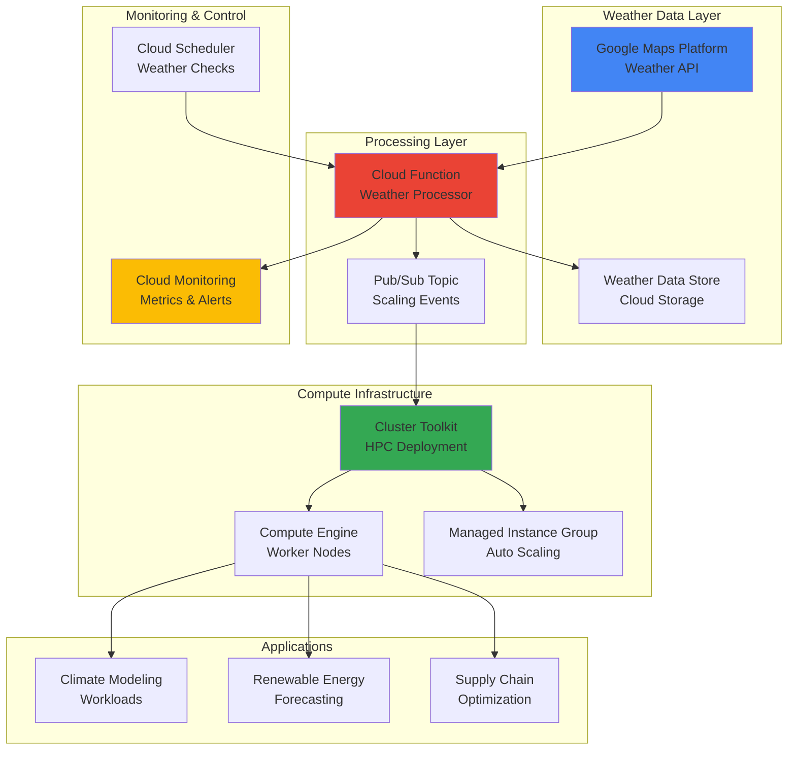

# Weather-Aware Infrastructure Scaling with Google Maps Platform Weather API and Cluster Toolkit

## Problem

Climate modeling organizations and renewable energy companies face significant challenges when running weather-dependent High Performance Computing (HPC) workloads. Traditional infrastructure scaling approaches lack awareness of real-time weather conditions, leading to inefficient resource allocation during critical weather events. When severe weather patterns emerge, computational demands can spike dramatically for climate simulations and energy forecasting, but static cluster configurations often result in either resource shortages during peak demand or wasteful over-provisioning during calm periods.

## Solution

This solution creates an intelligent infrastructure system that automatically scales HPC compute clusters based on real-time weather data from Google Maps Platform Weather API. By integrating weather intelligence with Google Cloud's Cluster Toolkit, the system dynamically adjusts compute resources based on precipitation levels, temperature variations, and wind patterns. This weather-aware scaling approach optimizes resource utilization for climate modeling, renewable energy forecasting, and logistics optimization workloads while maintaining cost efficiency through intelligent scaling decisions.

## Architecture Diagram



## Prerequisites

1. Google Cloud account with Project Owner or Editor permissions for compute, storage, and API services
2. Google Cloud CLI (gcloud) installed and configured or Cloud Shell access
3. Understanding of HPC workloads and cluster management concepts
4. Knowledge of weather data patterns and their computational implications
5. Estimated cost: $50-100/day for compute resources during active scaling (varies by workload intensity)

> **Note**: Weather API calls are charged per request. Consider implementing caching strategies to optimize costs while maintaining real-time responsiveness.

## Preparation

```bash
# Set environment variables for GCP resources
export PROJECT_ID="weather-hpc-$(date +%s)"
export REGION="us-central1"
export ZONE="us-central1-a"

# Generate unique suffix for resource names
RANDOM_SUFFIX=$(openssl rand -hex 3)
export CLUSTER_NAME="weather-cluster-${RANDOM_SUFFIX}"
export BUCKET_NAME="weather-data-${PROJECT_ID}"
export FUNCTION_NAME="weather-processor-${RANDOM_SUFFIX}"
export TOPIC_NAME="weather-scaling-${RANDOM_SUFFIX}"

# Set default project and region
gcloud config set project ${PROJECT_ID}
gcloud config set compute/region ${REGION}
gcloud config set compute/zone ${ZONE}

# Enable required APIs for weather-aware HPC infrastructure
gcloud services enable compute.googleapis.com \
    storage.googleapis.com \
    cloudfunctions.googleapis.com \
    pubsub.googleapis.com \
    monitoring.googleapis.com \
    cloudscheduler.googleapis.com \
    maps-weather.googleapis.com

# Create Cloud Storage bucket for weather data and logs
gsutil mb -p ${PROJECT_ID} \
    -c STANDARD \
    -l ${REGION} \
    gs://${BUCKET_NAME}

# Enable versioning for data protection
gsutil versioning set on gs://${BUCKET_NAME}

echo "✅ Project configured: ${PROJECT_ID}"
echo "✅ Weather data bucket created: ${BUCKET_NAME}"
```

## Steps

1. **Create Pub/Sub Topic for Scaling Events**:

   Pub/Sub provides reliable, asynchronous messaging for weather-driven scaling events. This topic will receive weather analysis results and trigger appropriate cluster scaling actions based on meteorological conditions and computational demand predictions.

   ```bash
   # Create Pub/Sub topic for weather scaling events
   gcloud pubsub topics create ${TOPIC_NAME}
   
   # Create subscription for processing scaling events
   gcloud pubsub subscriptions create weather-scaling-sub \
       --topic=${TOPIC_NAME}
   
   echo "✅ Pub/Sub topic created for weather scaling events"
   ```

   The Pub/Sub infrastructure now enables decoupled communication between weather analysis and cluster scaling operations, ensuring reliable message delivery even during high-volume weather events.

2. **Deploy Weather Processing Cloud Function**:

   This Cloud Function integrates with Google Maps Platform Weather API to analyze meteorological conditions and determine appropriate scaling actions. The function processes weather data patterns and publishes scaling recommendations to trigger infrastructure adjustments.

   ```bash
   # Create Cloud Function source directory
   mkdir -p weather-function
   cd weather-function
   
   # Create requirements.txt for Python dependencies
   cat > requirements.txt << 'EOF'
google-cloud-pubsub==2.18.4
google-cloud-storage==2.10.0
google-cloud-monitoring==2.15.1
requests==2.31.0
functions-framework==3.4.0
EOF
   
   # Create main function file
   cat > main.py << 'EOF'
import json
import logging
import os
import requests
from datetime import datetime
from google.cloud import pubsub_v1
from google.cloud import storage
from google.cloud import monitoring_v1

def weather_processor(request):
    """Process weather data and trigger scaling decisions."""
    
    # Initialize clients
    publisher = pubsub_v1.PublisherClient()
    storage_client = storage.Client()
    monitoring_client = monitoring_v1.MetricServiceClient()
    
    # Configuration
    project_id = os.environ['GCP_PROJECT']
    topic_name = os.environ['PUBSUB_TOPIC']
    weather_api_key = os.environ['WEATHER_API_KEY']
    
    # Weather locations for monitoring (major data centers)
    locations = [
        {"lat": 39.0458, "lng": -76.6413, "name": "us-east1"},  # Virginia
        {"lat": 41.2619, "lng": -95.8608, "name": "us-central1"},  # Iowa
        {"lat": 45.5152, "lng": -122.6784, "name": "us-west1"}  # Oregon
    ]
    
    scaling_decisions = []
    
    for location in locations:
        try:
            # Call Google Maps Platform Weather API
            weather_url = f"https://weather.googleapis.com/v1/weather:forecastHourly"
            headers = {'X-Goog-Api-Key': weather_api_key}
            params = {
                'location.latitude': location['lat'],
                'location.longitude': location['lng'],
                'hourCount': 6  # 6-hour forecast
            }
            
            response = requests.get(weather_url, headers=headers, params=params)
            weather_data = response.json()
            
            # Analyze weather conditions for scaling decisions
            scaling_factor = analyze_weather_conditions(weather_data)
            
            decision = {
                'region': location['name'],
                'scaling_factor': scaling_factor,
                'weather_summary': extract_weather_summary(weather_data),
                'timestamp': datetime.utcnow().isoformat()
            }
            
            scaling_decisions.append(decision)
            
            # Store weather data in Cloud Storage
            bucket = storage_client.bucket(os.environ['STORAGE_BUCKET'])
            blob_name = f"weather-data/{location['name']}/{datetime.utcnow().strftime('%Y%m%d-%H%M%S')}.json"
            blob = bucket.blob(blob_name)
            blob.upload_from_string(json.dumps(weather_data, indent=2))
            
        except Exception as e:
            logging.error(f"Error processing weather for {location['name']}: {str(e)}")
            continue
    
    # Publish scaling decisions to Pub/Sub
    topic_path = publisher.topic_path(project_id, topic_name)
    for decision in scaling_decisions:
        message_data = json.dumps(decision).encode('utf-8')
        publisher.publish(topic_path, message_data)
    
    # Send metrics to Cloud Monitoring
    send_weather_metrics(monitoring_client, project_id, scaling_decisions)
    
    return {'status': 'success', 'processed_locations': len(scaling_decisions)}

def analyze_weather_conditions(weather_data):
    """Analyze weather conditions and return scaling factor."""
    
    # Extract relevant weather metrics
    if 'hourlyForecasts' not in weather_data:
        return 1.0  # Default scaling
    
    forecasts = weather_data['hourlyForecasts'][:6]  # Next 6 hours
    
    total_precipitation = 0
    max_wind_speed = 0
    temperature_variance = 0
    
    temperatures = []
    
    for forecast in forecasts:
        # Precipitation analysis (mm/hour)
        if 'precipitationMm' in forecast:
            total_precipitation += forecast['precipitationMm']
        
        # Wind speed analysis (km/h)
        if 'windSpeedKph' in forecast:
            max_wind_speed = max(max_wind_speed, forecast['windSpeedKph'])
        
        # Temperature collection for variance calculation
        if 'temperatureCelsius' in forecast:
            temperatures.append(forecast['temperatureCelsius'])
    
    # Calculate temperature variance
    if len(temperatures) > 1:
        avg_temp = sum(temperatures) / len(temperatures)
        temperature_variance = sum((t - avg_temp) ** 2 for t in temperatures) / len(temperatures)
    
    # Scaling logic based on weather conditions
    scaling_factor = 1.0
    
    # Heavy precipitation increases computational demand for climate models
    if total_precipitation > 10:  # Heavy rain/snow
        scaling_factor *= 1.5
    elif total_precipitation > 5:  # Moderate precipitation
        scaling_factor *= 1.2
    
    # High wind speeds trigger renewable energy forecasting workloads
    if max_wind_speed > 50:  # Strong winds
        scaling_factor *= 1.4
    elif max_wind_speed > 30:  # Moderate winds
        scaling_factor *= 1.1
    
    # Temperature variance indicates weather instability
    if temperature_variance > 25:  # High variance
        scaling_factor *= 1.3
    
    # Cap scaling factor for cost control
    return min(scaling_factor, 2.0)

def extract_weather_summary(weather_data):
    """Extract weather summary for logging."""
    if 'hourlyForecasts' not in weather_data or not weather_data['hourlyForecasts']:
        return "No forecast data available"
    
    current_forecast = weather_data['hourlyForecasts'][0]
    
    summary = {
        'temperature': current_forecast.get('temperatureCelsius', 'N/A'),
        'precipitation': current_forecast.get('precipitationMm', 0),
        'wind_speed': current_forecast.get('windSpeedKph', 0),
        'humidity': current_forecast.get('relativeHumidity', 'N/A')
    }
    
    return summary

def send_weather_metrics(monitoring_client, project_id, scaling_decisions):
    """Send custom metrics to Cloud Monitoring."""
    
    project_name = f"projects/{project_id}"
    
    for decision in scaling_decisions:
        try:
            # Create metric for scaling factor
            series = monitoring_v1.TimeSeries()
            series.metric.type = 'custom.googleapis.com/weather/scaling_factor'
            series.metric.labels['region'] = decision['region']
            series.resource.type = 'global'
            
            # Add data point
            point = series.points.add()
            point.value.double_value = decision['scaling_factor']
            point.interval.end_time.seconds = int(datetime.utcnow().timestamp())
            
            # Send to monitoring
            monitoring_client.create_time_series(
                name=project_name,
                time_series=[series]
            )
            
        except Exception as e:
            logging.error(f"Error sending metrics: {str(e)}")
EOF
   
   # Deploy Cloud Function with weather processing capabilities
   gcloud functions deploy ${FUNCTION_NAME} \
       --runtime python39 \
       --trigger-http \
       --source . \
       --entry-point weather_processor \
       --memory 512MB \
       --timeout 300s \
       --set-env-vars "GCP_PROJECT=${PROJECT_ID},PUBSUB_TOPIC=${TOPIC_NAME},STORAGE_BUCKET=${BUCKET_NAME}"
   
   cd ..
   echo "✅ Weather processing Cloud Function deployed"
   ```

   The Cloud Function now provides intelligent weather analysis capabilities, processing meteorological data and generating scaling recommendations based on precipitation patterns, wind speeds, and temperature variations.

3. **Install and Configure Cluster Toolkit**:

   Google Cloud's Cluster Toolkit simplifies HPC cluster deployment with modular, Terraform-based infrastructure management. This step installs the toolkit and creates a blueprint for weather-responsive cluster configurations.

   ```bash
   # Clone Cluster Toolkit repository
   git clone https://github.com/GoogleCloudPlatform/cluster-toolkit.git
   cd cluster-toolkit
   
   # Build the gcluster binary
   make
   
   # Add gcluster to PATH for easy access
   export PATH=$PATH:$(pwd)
   
   # Create cluster blueprint for weather-aware HPC
   cat > weather-hpc-blueprint.yaml << EOF
blueprint_name: weather-aware-hpc
project_id: ${PROJECT_ID}
deployment_name: ${CLUSTER_NAME}
region: ${REGION}
zone: ${ZONE}

deployment_groups:
- group: primary
  modules:
  # Network infrastructure
  - id: network1
    source: modules/network/vpc
    settings:
      enable_iap_ssh_ingress: true
      
  # File system for shared data
  - id: homefs
    source: modules/file-system/filestore
    use: [network1]
    settings:
      local_mount: /home
      size_gb: 1024
      
  # Login node for cluster access
  - id: login
    source: modules/scheduler/schedmd-slurm-gcp-v5-login
    use: [network1, homefs]
    settings:
      machine_type: n1-standard-4
      enable_login_public_ips: true
      
  # Compute partition with auto-scaling
  - id: compute
    source: modules/compute/schedmd-slurm-gcp-v5-partition
    use: [network1, homefs]
    settings:
      partition_name: weather-compute
      machine_type: c2-standard-60
      max_node_count: 10
      enable_spot_vm: true
      
  # Slurm controller
  - id: slurm_controller
    source: modules/scheduler/schedmd-slurm-gcp-v5-controller
    use: [network1, login, compute, homefs]
    settings:
      enable_controller_public_ips: true
      
- group: cluster
  modules:
  # Complete cluster deployment
  - id: cluster
    source: modules/scheduler/schedmd-slurm-gcp-v5-hybrid
    use: [slurm_controller]
EOF
   
   # Generate deployment folder from blueprint
   ./gcluster create weather-hpc-blueprint.yaml
   
   echo "✅ Cluster Toolkit configured with weather-aware blueprint"
   ```

   The Cluster Toolkit blueprint now defines a scalable HPC infrastructure with Slurm job scheduling, shared file systems, and auto-scaling compute partitions optimized for weather-dependent workloads.

4. **Deploy HPC Cluster Infrastructure**:

   This step deploys the actual HPC cluster infrastructure using Terraform configurations generated by the Cluster Toolkit. The deployment creates a production-ready cluster with login nodes, compute nodes, and shared storage systems.

   ```bash
   # Navigate to the generated deployment folder
   cd ${CLUSTER_NAME}
   
   # Initialize Terraform for cluster deployment
   terraform init
   
   # Plan the deployment to review resources
   terraform plan
   
   # Deploy the HPC cluster infrastructure
   terraform apply -auto-approve
   
   # Store cluster information in environment variables
   export CLUSTER_LOGIN_IP=$(terraform output -raw login_ip_address)
   export CONTROLLER_IP=$(terraform output -raw controller_ip_address)
   
   # Wait for cluster initialization to complete
   echo "Waiting for cluster initialization..."
   sleep 300
   
   cd ..
   echo "✅ HPC cluster deployed successfully"
   echo "Login node IP: ${CLUSTER_LOGIN_IP}"
   echo "Controller IP: ${CONTROLLER_IP}"
   ```

   The HPC cluster is now operational with Slurm job scheduling, providing a scalable foundation for weather-dependent computational workloads with automatic resource management.

5. **Create Weather Monitoring Dashboard**:

   Cloud Monitoring provides real-time visibility into weather conditions and cluster scaling metrics. This dashboard enables operators to monitor weather-driven scaling decisions and cluster performance in real-time.

   ```bash
   # Create custom dashboard configuration
   cat > weather-dashboard.json << EOF
{
  "displayName": "Weather-Aware HPC Scaling Dashboard",
  "mosaicLayout": {
    "tiles": [
      {
        "width": 6,
        "height": 4,
        "widget": {
          "title": "Weather Scaling Factor by Region",
          "xyChart": {
            "dataSets": [
              {
                "timeSeriesQuery": {
                  "timeSeriesFilter": {
                    "filter": "metric.type=\"custom.googleapis.com/weather/scaling_factor\"",
                    "aggregation": {
                      "alignmentPeriod": "300s",
                      "perSeriesAligner": "ALIGN_MEAN",
                      "crossSeriesReducer": "REDUCE_MEAN",
                      "groupByFields": ["metric.label.region"]
                    }
                  }
                },
                "plotType": "LINE"
              }
            ],
            "timeshiftDuration": "0s",
            "yAxis": {
              "label": "Scaling Factor",
              "scale": "LINEAR"
            }
          }
        }
      },
      {
        "width": 6,
        "height": 4,
        "widget": {
          "title": "Cluster CPU Utilization",
          "xyChart": {
            "dataSets": [
              {
                "timeSeriesQuery": {
                  "timeSeriesFilter": {
                    "filter": "metric.type=\"compute.googleapis.com/instance/cpu/utilization\" AND resource.type=\"gce_instance\"",
                    "aggregation": {
                      "alignmentPeriod": "300s",
                      "perSeriesAligner": "ALIGN_MEAN",
                      "crossSeriesReducer": "REDUCE_MEAN"
                    }
                  }
                },
                "plotType": "LINE"
              }
            ]
          }
        }
      }
    ]
  }
}
EOF
   
   # Create the monitoring dashboard
   gcloud monitoring dashboards create --config-from-file=weather-dashboard.json
   
   echo "✅ Weather monitoring dashboard created"
   ```

   The monitoring dashboard now provides comprehensive visibility into weather-driven scaling metrics and cluster performance, enabling data-driven optimization of weather-aware infrastructure decisions.

6. **Set Up Automated Weather Checks**:

   Cloud Scheduler automates regular weather data collection and analysis, ensuring the system responds promptly to changing meteorological conditions. This automation eliminates manual intervention while maintaining responsive scaling behavior.

   ```bash
   # Create Cloud Scheduler job for regular weather checks
   gcloud scheduler jobs create http weather-check-job \
       --schedule="*/15 * * * *" \
       --uri="https://${REGION}-${PROJECT_ID}.cloudfunctions.net/${FUNCTION_NAME}" \
       --http-method=GET \
       --time-zone="UTC" \
       --description="Automated weather data collection and scaling analysis"
   
   # Create additional job for peak weather monitoring during storm seasons
   gcloud scheduler jobs create http weather-storm-monitor \
       --schedule="*/5 * * * *" \
       --uri="https://${REGION}-${PROJECT_ID}.cloudfunctions.net/${FUNCTION_NAME}" \
       --http-method=GET \
       --time-zone="UTC" \
       --description="Enhanced weather monitoring during severe weather events"
   
   echo "✅ Automated weather monitoring jobs configured"
   echo "Regular checks: Every 15 minutes"
   echo "Storm monitoring: Every 5 minutes"
   ```

   The automated scheduling system now ensures continuous weather monitoring with adaptive frequency based on meteorological conditions, providing responsive infrastructure scaling without manual oversight.

7. **Configure Cluster Scaling Integration**:

   This step creates the integration between weather analysis results and actual cluster scaling operations. The scaling agent processes Pub/Sub messages and adjusts cluster resources based on weather-driven computational demands.

   ```bash
   # Create scaling agent script
   cat > scaling-agent.py << 'EOF'
#!/usr/bin/env python3
import json
import subprocess
import time
from google.cloud import pubsub_v1
from concurrent.futures import ThreadPoolExecutor

class WeatherClusterScaler:
    def __init__(self, project_id, subscription_name, cluster_name):
        self.project_id = project_id
        self.subscription_name = subscription_name
        self.cluster_name = cluster_name
        self.subscriber = pubsub_v1.SubscriberClient()
        self.subscription_path = self.subscriber.subscription_path(
            project_id, subscription_name
        )
        
    def scale_cluster_partition(self, partition_name, scaling_factor):
        """Scale cluster partition based on weather conditions."""
        
        # Calculate target node count based on scaling factor
        base_nodes = 2
        target_nodes = max(1, int(base_nodes * scaling_factor))
        target_nodes = min(target_nodes, 20)  # Cap at 20 nodes for cost control
        
        try:
            # Update Slurm partition configuration
            scale_command = [
                "scontrol", "update", f"PartitionName={partition_name}",
                f"MaxNodes={target_nodes}"
            ]
            
            result = subprocess.run(scale_command, capture_output=True, text=True)
            
            if result.returncode == 0:
                print(f"✅ Scaled {partition_name} to {target_nodes} nodes (factor: {scaling_factor})")
                return True
            else:
                print(f"❌ Failed to scale {partition_name}: {result.stderr}")
                return False
                
        except Exception as e:
            print(f"❌ Error scaling cluster: {str(e)}")
            return False
            
    def process_scaling_message(self, message):
        """Process individual scaling message."""
        
        try:
            # Parse weather scaling decision
            scaling_data = json.loads(message.data.decode('utf-8'))
            
            region = scaling_data.get('region', 'unknown')
            scaling_factor = scaling_data.get('scaling_factor', 1.0)
            weather_summary = scaling_data.get('weather_summary', {})
            
            print(f"Processing scaling decision for {region}:")
            print(f"  Scaling factor: {scaling_factor}")
            print(f"  Weather: {weather_summary}")
            
            # Apply scaling based on region and conditions
            partition_name = f"weather-compute-{region}"
            success = self.scale_cluster_partition(partition_name, scaling_factor)
            
            if success:
                message.ack()
                print(f"✅ Successfully processed scaling for {region}")
            else:
                message.nack()
                print(f"❌ Failed to process scaling for {region}")
                
        except Exception as e:
            print(f"❌ Error processing message: {str(e)}")
            message.nack()
            
    def start_scaling_service(self):
        """Start the weather-aware scaling service."""
        
        print(f"🌦️  Starting weather-aware cluster scaling service")
        print(f"Project: {self.project_id}")
        print(f"Subscription: {self.subscription_name}")
        print(f"Cluster: {self.cluster_name}")
        
        # Configure message handling
        flow_control = pubsub_v1.types.FlowControl(max_messages=10)
        
        # Start message processing
        with self.subscriber:
            streaming_pull_future = self.subscriber.subscribe(
                self.subscription_path,
                callback=self.process_scaling_message,
                flow_control=flow_control
            )
            
            print(f"Listening for weather scaling messages...")
            
            try:
                streaming_pull_future.result()
            except KeyboardInterrupt:
                streaming_pull_future.cancel()
                print("🛑 Scaling service stopped")

if __name__ == "__main__":
    import os
    
    project_id = os.environ.get('GCP_PROJECT')
    subscription_name = "weather-scaling-sub"
    cluster_name = os.environ.get('CLUSTER_NAME')
    
    scaler = WeatherClusterScaler(project_id, subscription_name, cluster_name)
    scaler.start_scaling_service()
EOF
   
   # Make scaling agent executable
   chmod +x scaling-agent.py
   
   # Install Python dependencies for scaling agent
   pip3 install google-cloud-pubsub
   
   echo "✅ Cluster scaling integration configured"
   echo "To start the scaling service, run: python3 scaling-agent.py"
   ```

   The scaling integration system now provides automated cluster resource adjustments based on weather conditions, enabling dynamic optimization of computational capacity for weather-dependent workloads.

8. **Deploy Sample Weather-Dependent Workload**:

   This sample workload demonstrates how applications can leverage the weather-aware infrastructure. The climate modeling simulation adjusts its computational intensity based on current weather conditions and scaling factors.

   ```bash
   # Create sample climate modeling workload
   cat > climate-model-job.sh << 'EOF'
#!/bin/bash
#SBATCH --job-name=weather-climate-model
#SBATCH --partition=weather-compute
#SBATCH --nodes=1
#SBATCH --ntasks-per-node=8
#SBATCH --time=02:00:00
#SBATCH --output=climate-model-%j.out
#SBATCH --error=climate-model-%j.err

# Load weather scaling factor from environment
WEATHER_SCALING=${WEATHER_SCALING_FACTOR:-1.0}

echo "🌦️  Starting weather-aware climate modeling simulation"
echo "Weather scaling factor: ${WEATHER_SCALING}"
echo "Allocated nodes: ${SLURM_JOB_NUM_NODES}"
echo "Allocated CPUs: ${SLURM_NTASKS}"

# Simulate climate modeling workload with weather-based intensity
python3 << EOF
import time
import random
import os
import math

scaling_factor = float(os.environ.get('WEATHER_SCALING_FACTOR', '1.0'))
simulation_time = int(300 * scaling_factor)  # Base 5 minutes, scaled by weather

print(f"Running climate simulation for {simulation_time} seconds")
print(f"Weather intensity factor: {scaling_factor}")

# Simulate computational intensity based on weather conditions
for iteration in range(int(simulation_time / 10)):
    # Simulate atmospheric pressure calculations
    pressure_computation = sum(math.sin(i * scaling_factor) for i in range(10000))
    
    # Simulate temperature gradient modeling
    temp_gradient = sum(math.cos(i / scaling_factor) for i in range(8000))
    
    # Simulate precipitation modeling (higher during weather events)
    precip_model = sum(random.random() * scaling_factor for _ in range(5000))
    
    progress = (iteration + 1) * 10
    remaining_time = simulation_time - progress
    
    print(f"Progress: {progress}s/{simulation_time}s - Remaining: {remaining_time}s")
    print(f"  Pressure computation: {pressure_computation:.2f}")
    print(f"  Temperature gradient: {temp_gradient:.2f}")
    print(f"  Precipitation model: {precip_model:.2f}")
    
    time.sleep(10)

print("✅ Climate modeling simulation completed")
print(f"Total computation time: {simulation_time} seconds")
print(f"Weather scaling applied: {scaling_factor}x intensity")
EOF

echo "🎯 Climate modeling simulation completed successfully"
EOF
   
   # Make the job script executable
   chmod +x climate-model-job.sh
   
   # Create renewable energy forecasting workload
   cat > energy-forecast-job.sh << 'EOF'
#!/bin/bash
#SBATCH --job-name=weather-energy-forecast
#SBATCH --partition=weather-compute
#SBATCH --nodes=1
#SBATCH --ntasks-per-node=4
#SBATCH --time=01:00:00
#SBATCH --output=energy-forecast-%j.out
#SBATCH --error=energy-forecast-%j.err

echo "⚡ Starting weather-aware renewable energy forecasting"
echo "Wind scaling factor: ${WIND_SCALING_FACTOR:-1.0}"
echo "Solar scaling factor: ${SOLAR_SCALING_FACTOR:-1.0}"

# Simulate renewable energy forecasting based on weather conditions
python3 << EOF
import time
import math
import random
import os

wind_factor = float(os.environ.get('WIND_SCALING_FACTOR', '1.0'))
solar_factor = float(os.environ.get('SOLAR_SCALING_FACTOR', '1.0'))

print(f"Wind generation forecast (factor: {wind_factor})")
print(f"Solar generation forecast (factor: {solar_factor})")

# Simulate 24-hour energy forecasting with weather adjustments
for hour in range(24):
    # Wind energy calculation based on weather conditions
    base_wind = 100  # MW base capacity
    wind_output = base_wind * wind_factor * (0.5 + 0.5 * math.sin(hour / 4))
    
    # Solar energy calculation with weather adjustments
    base_solar = 150  # MW base capacity
    solar_output = base_solar * solar_factor * max(0, math.sin(math.pi * hour / 12))
    
    total_renewable = wind_output + solar_output
    
    print(f"Hour {hour:2d}: Wind {wind_output:6.1f}MW | Solar {solar_output:6.1f}MW | Total {total_renewable:6.1f}MW")
    time.sleep(2)

print("✅ Renewable energy forecasting completed")
EOF
EOF
   
   chmod +x energy-forecast-job.sh
   
   echo "✅ Sample weather-dependent workloads created"
   echo "Submit jobs with: sbatch climate-model-job.sh"
   echo "Submit jobs with: sbatch energy-forecast-job.sh"
   ```

   The sample workloads now demonstrate practical applications of weather-aware infrastructure, showing how climate modeling and renewable energy forecasting can dynamically adjust computational intensity based on real-time meteorological conditions.

## Validation & Testing

1. **Verify Weather API Integration**:

   ```bash
   # Test weather data collection manually
   curl -X GET "https://${REGION}-${PROJECT_ID}.cloudfunctions.net/${FUNCTION_NAME}"
   
   # Check weather data storage
   gsutil ls gs://${BUCKET_NAME}/weather-data/
   ```

   Expected output: JSON response with scaling decisions and weather analysis results

2. **Test Cluster Scaling Functionality**:

   ```bash
   # Check current cluster status
   gcloud compute instances list --filter="name~'${CLUSTER_NAME}'"
   
   # Verify Slurm cluster configuration
   ssh ${CLUSTER_LOGIN_IP} "sinfo -N"
   ```

   Expected output: Active cluster nodes and Slurm partition information

3. **Validate Monitoring Dashboard**:

   ```bash
   # List monitoring dashboards
   gcloud monitoring dashboards list --filter="displayName:Weather-Aware"
   
   # Check custom metrics
   gcloud monitoring metrics list --filter="metric.type=custom.googleapis.com/weather/scaling_factor"
   ```

   Expected output: Dashboard and custom weather metrics in Cloud Monitoring

4. **Test Sample Workload Execution**:

   ```bash
   # Submit test climate modeling job
   ssh ${CLUSTER_LOGIN_IP} "cd /home && sbatch climate-model-job.sh"
   
   # Check job status
   ssh ${CLUSTER_LOGIN_IP} "squeue"
   ```

   Expected output: Successful job submission and execution in Slurm queue

## Cleanup

1. **Remove HPC Cluster Infrastructure**:

   ```bash
   # Navigate to cluster deployment directory
   cd cluster-toolkit/${CLUSTER_NAME}
   
   # Destroy cluster infrastructure
   terraform destroy -auto-approve
   
   cd ../..
   echo "✅ HPC cluster infrastructure removed"
   ```

2. **Delete Cloud Functions and Scheduler Jobs**:

   ```bash
   # Remove Cloud Function
   gcloud functions delete ${FUNCTION_NAME} --region=${REGION} --quiet
   
   # Delete scheduler jobs
   gcloud scheduler jobs delete weather-check-job --quiet
   gcloud scheduler jobs delete weather-storm-monitor --quiet
   
   echo "✅ Cloud Functions and scheduler jobs removed"
   ```

3. **Clean Up Storage and Pub/Sub Resources**:

   ```bash
   # Remove Cloud Storage bucket and contents
   gsutil -m rm -r gs://${BUCKET_NAME}
   
   # Delete Pub/Sub resources
   gcloud pubsub subscriptions delete weather-scaling-sub --quiet
   gcloud pubsub topics delete ${TOPIC_NAME} --quiet
   
   echo "✅ Storage and messaging resources cleaned up"
   ```

4. **Remove Monitoring Dashboard and Project**:

   ```bash
   # Delete monitoring dashboard
   DASHBOARD_ID=$(gcloud monitoring dashboards list --filter="displayName:Weather-Aware" --format="value(name)")
   if [ ! -z "$DASHBOARD_ID" ]; then
       gcloud monitoring dashboards delete ${DASHBOARD_ID} --quiet
   fi
   
   # Clean up local files
   rm -rf cluster-toolkit weather-function
   rm -f weather-dashboard.json scaling-agent.py climate-model-job.sh energy-forecast-job.sh
   
   echo "✅ Monitoring resources and local files cleaned up"
   ```

## Discussion

This weather-aware infrastructure scaling solution demonstrates the powerful integration of real-time meteorological data with high-performance computing cluster management. By combining Google Maps Platform Weather API with Google Cloud's Cluster Toolkit, organizations can achieve intelligent resource optimization that responds dynamically to changing weather conditions. The system addresses critical challenges in climate modeling, renewable energy forecasting, and logistics optimization where computational demands directly correlate with meteorological events.

The architecture leverages Google Cloud's serverless computing model through Cloud Functions to process weather data and make scaling decisions without requiring dedicated infrastructure management. This approach ensures cost efficiency while maintaining responsiveness to weather changes. The Pub/Sub messaging system provides reliable, asynchronous communication between weather analysis and cluster scaling operations, enabling the system to handle high-volume weather events without message loss. Cloud Monitoring integration offers comprehensive visibility into both weather conditions and infrastructure performance, supporting data-driven optimization decisions.

The solution's modular design using Cluster Toolkit enables organizations to customize HPC configurations based on specific workload requirements while maintaining consistent deployment practices. The Terraform-based approach ensures reproducible infrastructure deployments across different regions and environments. Security best practices are embedded throughout the solution, including IAM-based access controls, encrypted data storage, and secure API communications. The weather scaling algorithms can be fine-tuned based on historical data analysis and specific application requirements.

Key benefits include reduced infrastructure costs through intelligent scaling, improved computational efficiency during weather events, and enhanced reliability through automated resource management. Organizations can expect significant cost savings compared to static over-provisioning approaches while maintaining the computational capacity needed for critical weather-dependent workloads. The system's ability to predict and respond to weather patterns enables proactive resource allocation rather than reactive scaling.

> **Tip**: Implement caching strategies for weather data to reduce API costs while maintaining responsiveness. Consider using Cloud Memorystore for frequently accessed weather information and implement intelligent cache invalidation based on weather pattern changes.

## Challenge

Extend this solution by implementing these enhancements:

1. **Multi-Region Weather Correlation**: Implement cross-region weather pattern analysis to predict computational demands across different geographic locations and optimize global resource allocation accordingly.

2. **Machine Learning Weather Prediction**: Integrate Vertex AI to develop custom weather prediction models based on historical computational workload patterns and improve scaling accuracy beyond standard meteorological forecasts.

3. **Cost Optimization Engine**: Build an intelligent cost optimization system that balances weather-driven computational demands with cloud resource pricing patterns, including spot instance utilization and preemptible workload scheduling.

4. **Advanced Workload Orchestration**: Develop workload classification and routing systems that automatically assign different types of weather-dependent tasks to optimally configured cluster partitions based on computational requirements and weather sensitivity.

5. **Disaster Recovery Integration**: Implement automated disaster recovery capabilities that redistribute workloads across regions during severe weather events, ensuring business continuity for critical climate modeling and forecasting operations.

## Infrastructure Code

*Infrastructure code will be generated after recipe approval.*