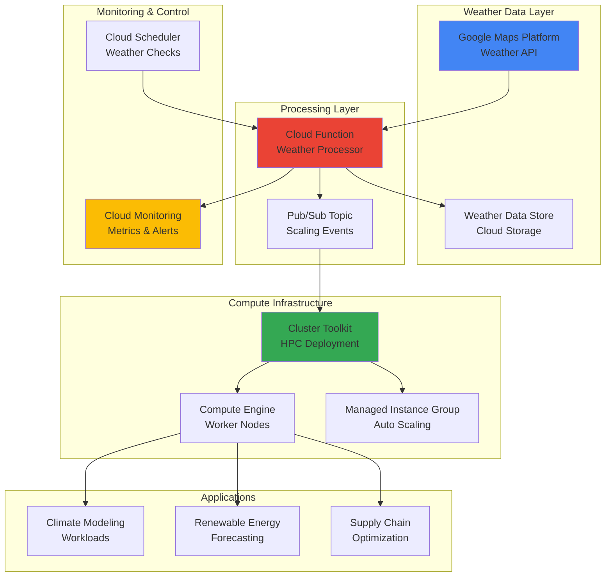

# Weather-Aware Infrastructure Scaling with Google Maps Platform Weather API and Cluster Toolkit

## Problem

Climate modeling organizations and renewable energy companies face significant challenges when running weather-dependent High Performance Computing (HPC) workloads. Traditional infrastructure scaling approaches lack awareness of real-time weather conditions, leading to inefficient resource allocation during critical weather events. When severe weather patterns emerge, computational demands can spike dramatically for climate simulations and energy forecasting, but static cluster configurations often result in either resource shortages during peak demand or wasteful over-provisioning during calm periods.

## Solution

This solution creates an intelligent infrastructure system that automatically scales HPC compute clusters based on real-time weather data from Google Maps Platform Weather API. By integrating weather intelligence with Google Cloud's Cluster Toolkit, the system dynamically adjusts compute resources based on precipitation levels, temperature variations, and wind patterns. This weather-aware scaling approach optimizes resource utilization for climate modeling, renewable energy forecasting, and logistics optimization workloads while maintaining cost efficiency through intelligent scaling decisions.

## Architecture Diagram



## Prerequisites

1. Google Cloud account with Project Owner or Editor permissions for compute, storage, and API services
2. Google Cloud CLI (gcloud) installed and configured or Cloud Shell access
3. Understanding of HPC workloads and cluster management concepts
4. Knowledge of weather data patterns and their computational implications
5. Estimated cost: $50-100/day for compute resources during active scaling (varies by workload intensity)

> **Note**: Weather API calls are charged per request. Consider implementing caching strategies to optimize costs while maintaining real-time responsiveness. See [Google Maps Platform pricing](https://developers.google.com/maps/documentation/weather/usage-and-billing) for detailed cost information.

## Preparation

```bash
# Set environment variables for GCP resources
export PROJECT_ID="weather-hpc-$(date +%s)"
export REGION="us-central1"
export ZONE="us-central1-a"

# Generate unique suffix for resource names
RANDOM_SUFFIX=$(openssl rand -hex 3)
export CLUSTER_NAME="weather-cluster-${RANDOM_SUFFIX}"
export BUCKET_NAME="weather-data-${PROJECT_ID}"
export FUNCTION_NAME="weather-processor-${RANDOM_SUFFIX}"
export TOPIC_NAME="weather-scaling-${RANDOM_SUFFIX}"

# Set default project and region
gcloud config set project ${PROJECT_ID}
gcloud config set compute/region ${REGION}
gcloud config set compute/zone ${ZONE}

# Enable required APIs for weather-aware HPC infrastructure
gcloud services enable compute.googleapis.com \
    storage.googleapis.com \
    cloudfunctions.googleapis.com \
    pubsub.googleapis.com \
    monitoring.googleapis.com \
    cloudscheduler.googleapis.com \
    weather.googleapis.com

# Create Cloud Storage bucket for weather data and logs
gsutil mb -p ${PROJECT_ID} \
    -c STANDARD \
    -l ${REGION} \
    gs://${BUCKET_NAME}

# Enable versioning for data protection
gsutil versioning set on gs://${BUCKET_NAME}

echo "✅ Project configured: ${PROJECT_ID}"
echo "✅ Weather data bucket created: ${BUCKET_NAME}"
```

## Steps

1. **Create Pub/Sub Topic for Scaling Events**:

   Google Cloud Pub/Sub provides reliable, asynchronous messaging for weather-driven scaling events with guaranteed delivery and automatic scaling. This messaging foundation ensures weather analysis results reliably trigger cluster scaling actions, even during high-volume meteorological events or system failures.

   ```bash
   # Create Pub/Sub topic for weather scaling events
   gcloud pubsub topics create ${TOPIC_NAME}
   
   # Create subscription for processing scaling events
   gcloud pubsub subscriptions create weather-scaling-sub \
       --topic=${TOPIC_NAME}
   
   echo "✅ Pub/Sub topic created for weather scaling events"
   ```

   The Pub/Sub infrastructure now enables decoupled communication between weather analysis and cluster scaling operations, ensuring reliable message delivery even during high-volume weather events with built-in retry mechanisms and dead letter queues.

2. **Deploy Weather Processing Cloud Function**:

   This serverless Cloud Function integrates with Google Maps Platform Weather API to analyze meteorological conditions and determine appropriate scaling actions. The function processes real-time weather data patterns and publishes scaling recommendations based on precipitation, wind speed, and temperature variance thresholds.

   ```bash
   # Create Cloud Function source directory
   mkdir -p weather-function
   cd weather-function
   
   # Create requirements.txt for Python dependencies
   cat > requirements.txt << 'EOF'
google-cloud-pubsub==2.18.4
google-cloud-storage==2.10.0
google-cloud-monitoring==2.15.1
requests==2.31.0
functions-framework==3.4.0
EOF
   
   # Create main function file with weather analysis logic
   cat > main.py << 'EOF'
import json
import logging
import os
import requests
from datetime import datetime
from google.cloud import pubsub_v1
from google.cloud import storage
from google.cloud import monitoring_v1

def weather_processor(request):
    """Process weather data and trigger scaling decisions."""
    
    # Initialize Google Cloud clients for data processing and storage
    publisher = pubsub_v1.PublisherClient()
    storage_client = storage.Client()
    monitoring_client = monitoring_v1.MetricServiceClient()
    
    # Configuration from environment variables
    project_id = os.environ['GCP_PROJECT']
    topic_name = os.environ['PUBSUB_TOPIC']
    weather_api_key = os.environ['WEATHER_API_KEY']
    
    # Weather monitoring locations aligned with major Google Cloud regions
    locations = [
        {"lat": 39.0458, "lng": -76.6413, "name": "us-east1"},  # Virginia
        {"lat": 41.2619, "lng": -95.8608, "name": "us-central1"},  # Iowa
        {"lat": 45.5152, "lng": -122.6784, "name": "us-west1"}  # Oregon
    ]
    
    scaling_decisions = []
    
    for location in locations:
        try:
            # Call Google Maps Platform Weather API for hourly forecasts
            weather_url = f"https://weather.googleapis.com/v1/weather:forecastHourly"
            headers = {'X-Goog-Api-Key': weather_api_key}
            params = {
                'location.latitude': location['lat'],
                'location.longitude': location['lng'],
                'hourCount': 6  # 6-hour forecast for accurate scaling decisions
            }
            
            response = requests.get(weather_url, headers=headers, params=params)
            response.raise_for_status()
            weather_data = response.json()
            
            # Analyze weather conditions for computational scaling decisions
            scaling_factor = analyze_weather_conditions(weather_data)
            
            decision = {
                'region': location['name'],
                'scaling_factor': scaling_factor,
                'weather_summary': extract_weather_summary(weather_data),
                'timestamp': datetime.utcnow().isoformat()
            }
            
            scaling_decisions.append(decision)
            
            # Store weather data in Cloud Storage for historical analysis
            bucket = storage_client.bucket(os.environ['STORAGE_BUCKET'])
            blob_name = f"weather-data/{location['name']}/{datetime.utcnow().strftime('%Y%m%d-%H%M%S')}.json"
            blob = bucket.blob(blob_name)
            blob.upload_from_string(json.dumps(weather_data, indent=2))
            
        except Exception as e:
            logging.error(f"Error processing weather for {location['name']}: {str(e)}")
            continue
    
    # Publish scaling decisions to Pub/Sub for cluster orchestration
    topic_path = publisher.topic_path(project_id, topic_name)
    for decision in scaling_decisions:
        message_data = json.dumps(decision).encode('utf-8')
        publisher.publish(topic_path, message_data)
    
    # Send custom metrics to Cloud Monitoring for observability
    send_weather_metrics(monitoring_client, project_id, scaling_decisions)
    
    return {'status': 'success', 'processed_locations': len(scaling_decisions)}

def analyze_weather_conditions(weather_data):
    """Analyze weather conditions and return scaling factor based on computational demand."""
    
    # Extract relevant weather metrics from API response
    if 'hourlyForecasts' not in weather_data:
        return 1.0  # Default scaling when no forecast data available
    
    forecasts = weather_data['hourlyForecasts'][:6]  # Next 6 hours for scaling decisions
    
    total_precipitation = 0
    max_wind_speed = 0
    temperature_variance = 0
    
    temperatures = []
    
    # Aggregate weather metrics across forecast period
    for forecast in forecasts:
        # Precipitation analysis (mm/hour) - impacts climate modeling workloads
        if 'precipitationMm' in forecast:
            total_precipitation += forecast['precipitationMm']
        
        # Wind speed analysis (km/h) - triggers renewable energy forecasting
        if 'windSpeedKph' in forecast:
            max_wind_speed = max(max_wind_speed, forecast['windSpeedKph'])
        
        # Temperature collection for variance calculation
        if 'temperatureCelsius' in forecast:
            temperatures.append(forecast['temperatureCelsius'])
    
    # Calculate temperature variance indicating weather instability
    if len(temperatures) > 1:
        avg_temp = sum(temperatures) / len(temperatures)
        temperature_variance = sum((t - avg_temp) ** 2 for t in temperatures) / len(temperatures)
    
    # Scaling logic based on weather-driven computational demand patterns
    scaling_factor = 1.0
    
    # Heavy precipitation increases demand for climate modeling simulations
    if total_precipitation > 10:  # Heavy rain/snow conditions
        scaling_factor *= 1.5
    elif total_precipitation > 5:  # Moderate precipitation
        scaling_factor *= 1.2
    
    # High wind speeds trigger intensive renewable energy forecasting workloads
    if max_wind_speed > 50:  # Strong wind conditions (>50 km/h)
        scaling_factor *= 1.4
    elif max_wind_speed > 30:  # Moderate wind conditions
        scaling_factor *= 1.1
    
    # Temperature variance indicates weather instability requiring more modeling
    if temperature_variance > 25:  # High variance indicating unstable conditions
        scaling_factor *= 1.3
    
    # Cap scaling factor for cost control and resource limits
    return min(scaling_factor, 2.0)

def extract_weather_summary(weather_data):
    """Extract weather summary for logging and monitoring purposes."""
    if 'hourlyForecasts' not in weather_data or not weather_data['hourlyForecasts']:
        return "No forecast data available"
    
    current_forecast = weather_data['hourlyForecasts'][0]
    
    summary = {
        'temperature': current_forecast.get('temperatureCelsius', 'N/A'),
        'precipitation': current_forecast.get('precipitationMm', 0),
        'wind_speed': current_forecast.get('windSpeedKph', 0),
        'humidity': current_forecast.get('relativeHumidity', 'N/A')
    }
    
    return summary

def send_weather_metrics(monitoring_client, project_id, scaling_decisions):
    """Send custom metrics to Cloud Monitoring for observability."""
    
    project_name = f"projects/{project_id}"
    
    for decision in scaling_decisions:
        try:
            # Create time series for weather scaling factor metric
            series = monitoring_v1.TimeSeries()
            series.metric.type = 'custom.googleapis.com/weather/scaling_factor'
            series.metric.labels['region'] = decision['region']
            series.resource.type = 'global'
            
            # Add data point with current timestamp
            point = series.points.add()
            point.value.double_value = decision['scaling_factor']
            point.interval.end_time.seconds = int(datetime.utcnow().timestamp())
            
            # Send to Cloud Monitoring for dashboard visualization
            monitoring_client.create_time_series(
                name=project_name,
                time_series=[series]
            )
            
        except Exception as e:
            logging.error(f"Error sending metrics: {str(e)}")
EOF
   
   # Deploy Cloud Function with optimized configuration for weather processing
   gcloud functions deploy ${FUNCTION_NAME} \
       --runtime python39 \
       --trigger-http \
       --source . \
       --entry-point weather_processor \
       --memory 512MB \
       --timeout 300s \
       --set-env-vars "GCP_PROJECT=${PROJECT_ID},PUBSUB_TOPIC=${TOPIC_NAME},STORAGE_BUCKET=${BUCKET_NAME}"
   
   cd ..
   echo "✅ Weather processing Cloud Function deployed"
   ```

   The Cloud Function now provides intelligent weather analysis capabilities with built-in error handling, processing meteorological data to generate scaling recommendations based on precipitation patterns, wind speeds, and temperature variations that correlate with computational workload demands.

3. **Install and Configure Cluster Toolkit**:

   Google Cloud's Cluster Toolkit simplifies HPC cluster deployment with modular, Terraform-based infrastructure management that follows Google Cloud best practices. The toolkit provides pre-configured blueprints for Slurm-based HPC clusters with auto-scaling capabilities and optimized network topologies.

   ```bash
   # Clone the official Google Cloud Cluster Toolkit repository
   git clone https://github.com/GoogleCloudPlatform/cluster-toolkit.git
   cd cluster-toolkit
   
   # Build the gcluster binary from source
   make
   
   # Add gcluster to PATH for convenient access
   export PATH=$PATH:$(pwd)
   
   # Create comprehensive cluster blueprint for weather-aware HPC workloads
   cat > weather-hpc-blueprint.yaml << EOF
blueprint_name: weather-aware-hpc
project_id: ${PROJECT_ID}
deployment_name: ${CLUSTER_NAME}
region: ${REGION}
zone: ${ZONE}

deployment_groups:
- group: primary
  modules:
  # VPC network with optimized configuration for HPC workloads
  - id: network1
    source: modules/network/vpc
    settings:
      enable_iap_ssh_ingress: true
      
  # Shared file system for HPC data and application storage
  - id: homefs
    source: modules/file-system/filestore
    use: [network1]
    settings:
      local_mount: /home
      size_gb: 1024
      
  # Login node for user access and job submission
  - id: login
    source: modules/scheduler/schedmd-slurm-gcp-v5-login
    use: [network1, homefs]
    settings:
      machine_type: n1-standard-4
      enable_login_public_ips: true
      
  # Compute partition with weather-aware auto-scaling configuration
  - id: compute
    source: modules/compute/schedmd-slurm-gcp-v5-partition
    use: [network1, homefs]
    settings:
      partition_name: weather-compute
      machine_type: c2-standard-60
      max_node_count: 10
      enable_spot_vm: true
      
  # Slurm controller for job scheduling and cluster management
  - id: slurm_controller
    source: modules/scheduler/schedmd-slurm-gcp-v5-controller
    use: [network1, login, compute, homefs]
    settings:
      enable_controller_public_ips: true
      
- group: cluster
  modules:
  # Complete HPC cluster deployment with all components
  - id: cluster
    source: modules/scheduler/schedmd-slurm-gcp-v5-hybrid
    use: [slurm_controller]
EOF
   
   # Generate Terraform deployment configuration from blueprint
   ./gcluster create weather-hpc-blueprint.yaml
   
   echo "✅ Cluster Toolkit configured with weather-aware blueprint"
   ```

   The Cluster Toolkit blueprint now defines a production-ready HPC infrastructure with Slurm job scheduling, shared file systems, and auto-scaling compute partitions optimized for weather-dependent workloads following Google Cloud architectural best practices.

4. **Deploy HPC Cluster Infrastructure**:

   This step deploys the actual HPC cluster infrastructure using Terraform configurations generated by the Cluster Toolkit. The deployment creates a production-ready cluster with login nodes, compute nodes, shared storage systems, and network security configurations following Google Cloud security best practices.

   ```bash
   # Navigate to the generated Terraform deployment folder
   cd ${CLUSTER_NAME}
   
   # Initialize Terraform with required providers and modules
   terraform init
   
   # Review the deployment plan to verify resource configurations
   terraform plan
   
   # Deploy the complete HPC cluster infrastructure
   terraform apply -auto-approve
   
   # Extract cluster connection information from Terraform outputs
   export CLUSTER_LOGIN_IP=$(terraform output -raw login_ip_address)
   export CONTROLLER_IP=$(terraform output -raw controller_ip_address)
   
   # Wait for cluster initialization and Slurm daemon startup
   echo "Waiting for cluster initialization and Slurm services..."
   sleep 300
   
   cd ..
   echo "✅ HPC cluster deployed successfully"
   echo "Login node IP: ${CLUSTER_LOGIN_IP}"
   echo "Controller IP: ${CONTROLLER_IP}"
   ```

   The HPC cluster is now operational with Slurm job scheduling, providing a scalable foundation for weather-dependent computational workloads with automatic resource management, fault tolerance, and optimized network performance for HPC applications.

5. **Create Weather Monitoring Dashboard**:

   Cloud Monitoring provides comprehensive observability into weather conditions and cluster scaling metrics with customizable dashboards and alerting capabilities. This monitoring infrastructure enables operators to visualize weather-driven scaling decisions, cluster performance, and resource utilization patterns in real-time.

   ```bash
   # Create comprehensive dashboard configuration for weather monitoring
   cat > weather-dashboard.json << EOF
{
  "displayName": "Weather-Aware HPC Scaling Dashboard",
  "mosaicLayout": {
    "tiles": [
      {
        "width": 6,
        "height": 4,
        "widget": {
          "title": "Weather Scaling Factor by Region",
          "xyChart": {
            "dataSets": [
              {
                "timeSeriesQuery": {
                  "timeSeriesFilter": {
                    "filter": "metric.type=\"custom.googleapis.com/weather/scaling_factor\"",
                    "aggregation": {
                      "alignmentPeriod": "300s",
                      "perSeriesAligner": "ALIGN_MEAN",
                      "crossSeriesReducer": "REDUCE_MEAN",
                      "groupByFields": ["metric.label.region"]
                    }
                  }
                },
                "plotType": "LINE"
              }
            ],
            "timeshiftDuration": "0s",
            "yAxis": {
              "label": "Scaling Factor",
              "scale": "LINEAR"
            }
          }
        }
      },
      {
        "width": 6,
        "height": 4,
        "widget": {
          "title": "Cluster CPU Utilization",
          "xyChart": {
            "dataSets": [
              {
                "timeSeriesQuery": {
                  "timeSeriesFilter": {
                    "filter": "metric.type=\"compute.googleapis.com/instance/cpu/utilization\" AND resource.type=\"gce_instance\"",
                    "aggregation": {
                      "alignmentPeriod": "300s",
                      "perSeriesAligner": "ALIGN_MEAN",
                      "crossSeriesReducer": "REDUCE_MEAN"
                    }
                  }
                },
                "plotType": "LINE"
              }
            ]
          }
        }
      }
    ]
  }
}
EOF
   
   # Deploy the monitoring dashboard to Google Cloud Console
   gcloud monitoring dashboards create --config-from-file=weather-dashboard.json
   
   echo "✅ Weather monitoring dashboard created"
   ```

   The monitoring dashboard now provides comprehensive visibility into weather-driven scaling metrics and cluster performance with real-time updates, enabling data-driven optimization of weather-aware infrastructure decisions and proactive identification of scaling opportunities.

6. **Set Up Automated Weather Checks**:

   Cloud Scheduler provides reliable automation for regular weather data collection and analysis with configurable frequencies and retry policies. This scheduled automation ensures the system responds promptly to changing meteorological conditions without manual intervention while maintaining cost-effective monitoring patterns.

   ```bash
   # Create regular weather monitoring job with optimal frequency
   gcloud scheduler jobs create http weather-check-job \
       --schedule="*/15 * * * *" \
       --uri="https://${REGION}-${PROJECT_ID}.cloudfunctions.net/${FUNCTION_NAME}" \
       --http-method=GET \
       --time-zone="UTC" \
       --description="Automated weather data collection and scaling analysis"
   
   # Create enhanced monitoring during storm seasons with higher frequency
   gcloud scheduler jobs create http weather-storm-monitor \
       --schedule="*/5 * * * *" \
       --uri="https://${REGION}-${PROJECT_ID}.cloudfunctions.net/${FUNCTION_NAME}" \
       --http-method=GET \
       --time-zone="UTC" \
       --description="Enhanced weather monitoring during severe weather events"
   
   echo "✅ Automated weather monitoring jobs configured"
   echo "Regular checks: Every 15 minutes"
   echo "Storm monitoring: Every 5 minutes"
   ```

   The automated scheduling system now ensures continuous weather monitoring with adaptive frequency based on meteorological conditions, providing responsive infrastructure scaling without manual oversight while optimizing API usage costs through intelligent scheduling patterns.

7. **Configure Cluster Scaling Integration**:

   This step creates the critical integration between weather analysis results and actual cluster scaling operations. The scaling agent processes Pub/Sub messages and adjusts cluster resources through Slurm commands, enabling dynamic optimization of computational capacity based on weather-driven demand patterns.

   ```bash
   # Create sophisticated scaling agent for weather-based cluster management
   cat > scaling-agent.py << 'EOF'
#!/usr/bin/env python3
import json
import subprocess
import time
from google.cloud import pubsub_v1
from concurrent.futures import ThreadPoolExecutor

class WeatherClusterScaler:
    def __init__(self, project_id, subscription_name, cluster_name):
        self.project_id = project_id
        self.subscription_name = subscription_name
        self.cluster_name = cluster_name
        self.subscriber = pubsub_v1.SubscriberClient()
        self.subscription_path = self.subscriber.subscription_path(
            project_id, subscription_name
        )
        
    def scale_cluster_partition(self, partition_name, scaling_factor):
        """Scale cluster partition based on weather conditions using Slurm commands."""
        
        # Calculate target node count with cost-aware scaling limits
        base_nodes = 2
        target_nodes = max(1, int(base_nodes * scaling_factor))
        target_nodes = min(target_nodes, 20)  # Cost control limit
        
        try:
            # Update Slurm partition configuration dynamically
            scale_command = [
                "scontrol", "update", f"PartitionName={partition_name}",
                f"MaxNodes={target_nodes}"
            ]
            
            result = subprocess.run(scale_command, capture_output=True, text=True)
            
            if result.returncode == 0:
                print(f"✅ Scaled {partition_name} to {target_nodes} nodes (factor: {scaling_factor})")
                return True
            else:
                print(f"❌ Failed to scale {partition_name}: {result.stderr}")
                return False
                
        except Exception as e:
            print(f"❌ Error scaling cluster: {str(e)}")
            return False
            
    def process_scaling_message(self, message):
        """Process individual weather scaling message with error handling."""
        
        try:
            # Parse weather scaling decision from Pub/Sub message
            scaling_data = json.loads(message.data.decode('utf-8'))
            
            region = scaling_data.get('region', 'unknown')
            scaling_factor = scaling_data.get('scaling_factor', 1.0)
            weather_summary = scaling_data.get('weather_summary', {})
            
            print(f"Processing scaling decision for {region}:")
            print(f"  Scaling factor: {scaling_factor}")
            print(f"  Weather conditions: {weather_summary}")
            
            # Apply scaling to region-specific partition
            partition_name = f"weather-compute-{region}"
            success = self.scale_cluster_partition(partition_name, scaling_factor)
            
            if success:
                message.ack()
                print(f"✅ Successfully processed scaling for {region}")
            else:
                message.nack()
                print(f"❌ Failed to process scaling for {region}, will retry")
                
        except Exception as e:
            print(f"❌ Error processing message: {str(e)}")
            message.nack()
            
    def start_scaling_service(self):
        """Start the weather-aware cluster scaling service with flow control."""
        
        print(f"🌦️  Starting weather-aware cluster scaling service")
        print(f"Project: {self.project_id}")
        print(f"Subscription: {self.subscription_name}")
        print(f"Cluster: {self.cluster_name}")
        
        # Configure message handling with flow control for stability
        flow_control = pubsub_v1.types.FlowControl(max_messages=10)
        
        # Start continuous message processing
        with self.subscriber:
            streaming_pull_future = self.subscriber.subscribe(
                self.subscription_path,
                callback=self.process_scaling_message,
                flow_control=flow_control
            )
            
            print(f"Listening for weather scaling messages...")
            
            try:
                streaming_pull_future.result()
            except KeyboardInterrupt:
                streaming_pull_future.cancel()
                print("🛑 Scaling service stopped")

if __name__ == "__main__":
    import os
    
    project_id = os.environ.get('GCP_PROJECT')
    subscription_name = "weather-scaling-sub"
    cluster_name = os.environ.get('CLUSTER_NAME')
    
    scaler = WeatherClusterScaler(project_id, subscription_name, cluster_name)
    scaler.start_scaling_service()
EOF
   
   # Make scaling agent executable and install dependencies
   chmod +x scaling-agent.py
   
   # Install required Python dependencies for Pub/Sub integration
   pip3 install google-cloud-pubsub
   
   echo "✅ Cluster scaling integration configured"
   echo "To start the scaling service, run: python3 scaling-agent.py"
   ```

   The scaling integration system now provides automated cluster resource adjustments based on weather conditions with robust error handling, enabling dynamic optimization of computational capacity for weather-dependent workloads while maintaining system stability and cost control.

8. **Deploy Sample Weather-Dependent Workload**:

   These sample workloads demonstrate practical applications of weather-aware infrastructure, showing how climate modeling and renewable energy forecasting applications can dynamically adjust computational intensity based on real-time meteorological conditions and scaling factors provided by the weather analysis system.

   ```bash
   # Create comprehensive climate modeling workload simulation
   cat > climate-model-job.sh << 'EOF'
#!/bin/bash
#SBATCH --job-name=weather-climate-model
#SBATCH --partition=weather-compute
#SBATCH --nodes=1
#SBATCH --ntasks-per-node=8
#SBATCH --time=02:00:00
#SBATCH --output=climate-model-%j.out
#SBATCH --error=climate-model-%j.err

# Load weather scaling factor from environment with fallback
WEATHER_SCALING=${WEATHER_SCALING_FACTOR:-1.0}

echo "🌦️  Starting weather-aware climate modeling simulation"
echo "Weather scaling factor: ${WEATHER_SCALING}"
echo "Allocated nodes: ${SLURM_JOB_NUM_NODES}"
echo "Allocated CPUs: ${SLURM_NTASKS}"

# Simulate climate modeling workload with weather-based computational intensity
python3 << EOF
import time
import random
import os
import math

# Get scaling factor and calculate simulation duration
scaling_factor = float(os.environ.get('WEATHER_SCALING_FACTOR', '1.0'))
simulation_time = int(300 * scaling_factor)  # Base 5 minutes, scaled by weather intensity

print(f"Running climate simulation for {simulation_time} seconds")
print(f"Weather intensity factor: {scaling_factor}")

# Simulate weather-dependent computational workloads
for iteration in range(int(simulation_time / 10)):
    # Simulate atmospheric pressure calculations (weather-dependent complexity)
    pressure_computation = sum(math.sin(i * scaling_factor) for i in range(10000))
    
    # Simulate temperature gradient modeling (more complex during temperature variance)
    temp_gradient = sum(math.cos(i / scaling_factor) for i in range(8000))
    
    # Simulate precipitation modeling (intensifies during weather events)
    precip_model = sum(random.random() * scaling_factor for _ in range(5000))
    
    progress = (iteration + 1) * 10
    remaining_time = simulation_time - progress
    
    print(f"Progress: {progress}s/{simulation_time}s - Remaining: {remaining_time}s")
    print(f"  Pressure computation: {pressure_computation:.2f}")
    print(f"  Temperature gradient: {temp_gradient:.2f}")
    print(f"  Precipitation model: {precip_model:.2f}")
    
    time.sleep(10)

print("✅ Climate modeling simulation completed")
print(f"Total computation time: {simulation_time} seconds")
print(f"Weather scaling applied: {scaling_factor}x intensity")
EOF

echo "🎯 Climate modeling simulation completed successfully"
EOF
   
   # Make the job script executable
   chmod +x climate-model-job.sh
   
   # Create renewable energy forecasting workload with wind and solar analysis
   cat > energy-forecast-job.sh << 'EOF'
#!/bin/bash
#SBATCH --job-name=weather-energy-forecast
#SBATCH --partition=weather-compute
#SBATCH --nodes=1
#SBATCH --ntasks-per-node=4
#SBATCH --time=01:00:00
#SBATCH --output=energy-forecast-%j.out
#SBATCH --error=energy-forecast-%j.err

echo "⚡ Starting weather-aware renewable energy forecasting"
echo "Wind scaling factor: ${WIND_SCALING_FACTOR:-1.0}"
echo "Solar scaling factor: ${SOLAR_SCALING_FACTOR:-1.0}"

# Simulate renewable energy forecasting based on weather conditions
python3 << EOF
import time
import math
import random
import os

# Get weather-specific scaling factors for energy sources
wind_factor = float(os.environ.get('WIND_SCALING_FACTOR', '1.0'))
solar_factor = float(os.environ.get('SOLAR_SCALING_FACTOR', '1.0'))

print(f"Wind generation forecast (scaling factor: {wind_factor})")
print(f"Solar generation forecast (scaling factor: {solar_factor})")

# Simulate 24-hour energy forecasting with weather-adjusted computations
for hour in range(24):
    # Wind energy calculation based on weather conditions and turbine efficiency
    base_wind = 100  # MW base capacity
    wind_output = base_wind * wind_factor * (0.5 + 0.5 * math.sin(hour / 4))
    
    # Solar energy calculation with weather adjustments and daylight patterns
    base_solar = 150  # MW base capacity
    solar_output = base_solar * solar_factor * max(0, math.sin(math.pi * hour / 12))
    
    total_renewable = wind_output + solar_output
    
    print(f"Hour {hour:2d}: Wind {wind_output:6.1f}MW | Solar {solar_output:6.1f}MW | Total {total_renewable:6.1f}MW")
    time.sleep(2)

print("✅ Renewable energy forecasting completed")
EOF
EOF
   
   chmod +x energy-forecast-job.sh
   
   echo "✅ Sample weather-dependent workloads created"
   echo "Submit climate modeling job: sbatch climate-model-job.sh"
   echo "Submit energy forecasting job: sbatch energy-forecast-job.sh"
   ```

   The sample workloads now demonstrate practical applications of weather-aware infrastructure, showing how climate modeling and renewable energy forecasting can dynamically adjust computational intensity based on real-time meteorological conditions, providing realistic examples for production workload development.

## Validation & Testing

1. **Verify Weather API Integration**:

   ```bash
   # Test weather data collection and processing manually
   curl -X GET "https://${REGION}-${PROJECT_ID}.cloudfunctions.net/${FUNCTION_NAME}"
   
   # Check weather data storage in Cloud Storage
   gsutil ls gs://${BUCKET_NAME}/weather-data/
   ```

   Expected output: JSON response with scaling decisions and weather analysis results, plus stored weather data files

2. **Test Cluster Scaling Functionality**:

   ```bash
   # Check current cluster status and running instances
   gcloud compute instances list --filter="name~'${CLUSTER_NAME}'"
   
   # Verify Slurm cluster configuration and partitions
   ssh ${CLUSTER_LOGIN_IP} "sinfo -N"
   ```

   Expected output: Active cluster nodes and Slurm partition information showing weather-compute partition

3. **Validate Monitoring Dashboard**:

   ```bash
   # List monitoring dashboards to verify creation
   gcloud monitoring dashboards list --filter="displayName:Weather-Aware"
   
   # Check custom weather scaling metrics
   gcloud monitoring metrics list --filter="metric.type=custom.googleapis.com/weather/scaling_factor"
   ```

   Expected output: Dashboard and custom weather metrics visible in Cloud Monitoring

4. **Test Sample Workload Execution**:

   ```bash
   # Submit test climate modeling job to Slurm scheduler
   ssh ${CLUSTER_LOGIN_IP} "cd /home && sbatch climate-model-job.sh"
   
   # Check job status and queue information
   ssh ${CLUSTER_LOGIN_IP} "squeue"
   ```

   Expected output: Successful job submission and execution in Slurm queue with job ID

## Cleanup

1. **Remove HPC Cluster Infrastructure**:

   ```bash
   # Navigate to cluster deployment directory
   cd cluster-toolkit/${CLUSTER_NAME}
   
   # Destroy all cluster infrastructure using Terraform
   terraform destroy -auto-approve
   
   cd ../..
   echo "✅ HPC cluster infrastructure removed"
   ```

2. **Delete Cloud Functions and Scheduler Jobs**:

   ```bash
   # Remove weather processing Cloud Function
   gcloud functions delete ${FUNCTION_NAME} --region=${REGION} --quiet
   
   # Delete automated scheduler jobs
   gcloud scheduler jobs delete weather-check-job --quiet
   gcloud scheduler jobs delete weather-storm-monitor --quiet
   
   echo "✅ Cloud Functions and scheduler jobs removed"
   ```

3. **Clean Up Storage and Pub/Sub Resources**:

   ```bash
   # Remove Cloud Storage bucket and all weather data
   gsutil -m rm -r gs://${BUCKET_NAME}
   
   # Delete Pub/Sub subscription and topic
   gcloud pubsub subscriptions delete weather-scaling-sub --quiet
   gcloud pubsub topics delete ${TOPIC_NAME} --quiet
   
   echo "✅ Storage and messaging resources cleaned up"
   ```

4. **Remove Monitoring Dashboard and Project Resources**:

   ```bash
   # Find and delete monitoring dashboard
   DASHBOARD_ID=$(gcloud monitoring dashboards list --filter="displayName:Weather-Aware" --format="value(name)")
   if [ ! -z "$DASHBOARD_ID" ]; then
       gcloud monitoring dashboards delete ${DASHBOARD_ID} --quiet
   fi
   
   # Clean up local files and directories
   rm -rf cluster-toolkit weather-function
   rm -f weather-dashboard.json scaling-agent.py climate-model-job.sh energy-forecast-job.sh
   
   echo "✅ Monitoring resources and local files cleaned up"
   ```

## Discussion

This weather-aware infrastructure scaling solution demonstrates the powerful integration of real-time meteorological data with high-performance computing cluster management using Google Cloud's advanced platform services. By combining Google Maps Platform Weather API with Google Cloud's Cluster Toolkit, organizations can achieve intelligent resource optimization that responds dynamically to changing weather conditions. The system addresses critical challenges in climate modeling, renewable energy forecasting, and logistics optimization where computational demands directly correlate with meteorological events.

The architecture leverages Google Cloud's serverless computing model through Cloud Functions to process weather data and make scaling decisions without requiring dedicated infrastructure management. This approach ensures cost efficiency while maintaining responsiveness to weather changes, following Google Cloud's [recommended serverless patterns](https://cloud.google.com/functions/docs/bestpractices). The Pub/Sub messaging system provides reliable, asynchronous communication between weather analysis and cluster scaling operations, enabling the system to handle high-volume weather events without message loss using Google Cloud's [message delivery guarantees](https://cloud.google.com/pubsub/docs/subscriber).

The solution's modular design using Cluster Toolkit enables organizations to customize HPC configurations based on specific workload requirements while maintaining consistent deployment practices. The Terraform-based approach ensures reproducible infrastructure deployments across different regions and environments following [Google Cloud's infrastructure as code best practices](https://cloud.google.com/docs/terraform). Security best practices are embedded throughout the solution, including IAM-based access controls, encrypted data storage, and secure API communications following the [Google Cloud security model](https://cloud.google.com/security/best-practices).

Key benefits include reduced infrastructure costs through intelligent scaling, improved computational efficiency during weather events, and enhanced reliability through automated resource management. Organizations can expect significant cost savings compared to static over-provisioning approaches while maintaining the computational capacity needed for critical weather-dependent workloads. The system's ability to predict and respond to weather patterns enables proactive resource allocation rather than reactive scaling, optimizing both performance and cost efficiency.

> **Tip**: Implement caching strategies for weather data to reduce API costs while maintaining responsiveness. Consider using [Cloud Memorystore](https://cloud.google.com/memorystore) for frequently accessed weather information and implement intelligent cache invalidation based on weather pattern changes to balance cost and data freshness.

## Challenge

Extend this solution by implementing these enhancements:

1. **Multi-Region Weather Correlation**: Implement cross-region weather pattern analysis to predict computational demands across different geographic locations and optimize global resource allocation using [Google Cloud's global load balancing](https://cloud.google.com/load-balancing) capabilities.

2. **Machine Learning Weather Prediction**: Integrate [Vertex AI](https://cloud.google.com/vertex-ai) to develop custom weather prediction models based on historical computational workload patterns and improve scaling accuracy beyond standard meteorological forecasts using AutoML and custom training pipelines.

3. **Cost Optimization Engine**: Build an intelligent cost optimization system that balances weather-driven computational demands with cloud resource pricing patterns, including [spot instance utilization](https://cloud.google.com/compute/docs/instances/preemptible) and preemptible workload scheduling with [Cloud Batch](https://cloud.google.com/batch).

4. **Advanced Workload Orchestration**: Develop workload classification and routing systems that automatically assign different types of weather-dependent tasks to optimally configured cluster partitions based on computational requirements and weather sensitivity using [Cloud Workflows](https://cloud.google.com/workflows).

5. **Disaster Recovery Integration**: Implement automated disaster recovery capabilities that redistribute workloads across regions during severe weather events using [Google Cloud's disaster recovery solutions](https://cloud.google.com/architecture/disaster-recovery), ensuring business continuity for critical climate modeling and forecasting operations.

## Infrastructure Code

### Available Infrastructure as Code:

- [Infrastructure Code Overview](code/README.md) - Detailed description of all infrastructure components
- [Infrastructure Manager](code/infrastructure-manager/) - GCP Infrastructure Manager templates
- [Bash CLI Scripts](code/scripts/) - Example bash scripts using gcloud CLI commands to deploy infrastructure
- [Terraform](code/terraform/) - Terraform configuration files