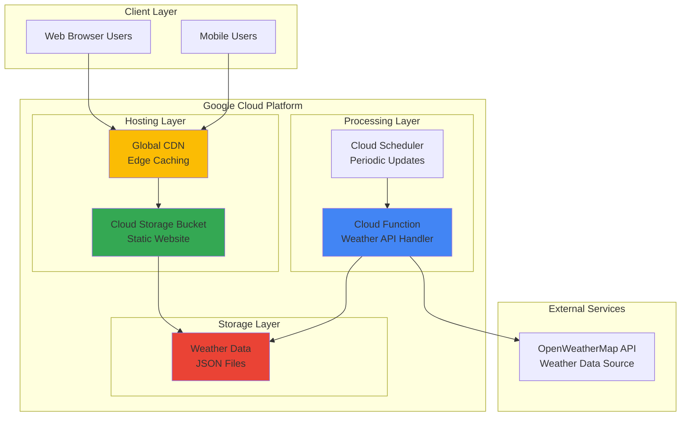

# Weather Dashboard with Cloud Functions and Storage

## Problem

Small businesses and individuals need simple weather information displays for websites or applications but lack the infrastructure to reliably fetch, process, and serve weather data. Traditional hosting solutions require server management, complex deployment pipelines, and ongoing maintenance costs that are prohibitive for simple use cases.

## Solution

Build a serverless weather dashboard using Google Cloud Functions to fetch weather data from external APIs and Cloud Storage for static website hosting. This solution provides automatic scaling, minimal maintenance, and cost-effective pay-per-use pricing while delivering weather information through a clean web interface.

## Architecture Diagram



## Prerequisites

1. Google Cloud Platform account with billing enabled
2. gcloud CLI installed and configured (or Cloud Shell)
3. Basic knowledge of JavaScript and HTML
4. OpenWeatherMap API key (free tier allows 1,000 calls/day)
5. Estimated cost: $0.00-$0.50 per month for light usage

> **Note**: This recipe uses Google Cloud's free tier extensively, keeping costs minimal for development and light production use. Cloud Functions Generation 2 provides enhanced features and better performance than Generation 1.

## Preparation

```bash
# Set environment variables for GCP resources
export PROJECT_ID="weather-dashboard-$(date +%s)"
export REGION="us-central1"
export FUNCTION_NAME="weather-fetcher"

# Generate unique suffix for resource names
RANDOM_SUFFIX=$(openssl rand -hex 3)
export BUCKET_NAME="weather-dashboard-${RANDOM_SUFFIX}"

# Create a new project for this recipe
gcloud projects create ${PROJECT_ID} \
    --name="Weather Dashboard Project"

# Select the new project
gcloud config set project ${PROJECT_ID}
gcloud config set compute/region ${REGION}

# Enable required APIs
gcloud services enable cloudfunctions.googleapis.com
gcloud services enable storage.googleapis.com
gcloud services enable cloudbuild.googleapis.com
gcloud services enable run.googleapis.com

# Wait for APIs to be fully enabled
echo "Waiting for APIs to be enabled..."
sleep 30

echo "✅ Project configured: ${PROJECT_ID}"
echo "✅ Bucket name: ${BUCKET_NAME}"
```

## Steps

1. **Create Cloud Storage Bucket for Static Website Hosting**:

   Google Cloud Storage provides globally distributed object storage with integrated CDN capabilities, making it ideal for hosting static websites. When configured for website hosting, Cloud Storage can serve HTML, CSS, and JavaScript files with high performance and automatic scaling, eliminating the need for traditional web servers.

   ```bash
   # Create storage bucket with public access
   gsutil mb -p ${PROJECT_ID} \
       -c STANDARD \
       -l ${REGION} \
       gs://${BUCKET_NAME}
   
   # Configure bucket for static website hosting
   gsutil web set -m index.html -e 404.html \
       gs://${BUCKET_NAME}
   
   # Make bucket publicly readable for static hosting
   gsutil iam ch allUsers:objectViewer \
       gs://${BUCKET_NAME}
   
   # Add CORS configuration for API calls
   echo '[{"origin":["*"],"method":["GET"],"maxAgeSeconds":3600}]' | \
       gsutil cors set /dev/stdin gs://${BUCKET_NAME}
   
   echo "✅ Storage bucket created and configured for web hosting"
   ```

   The bucket is now configured as a static website with public read access, enabling global users to access the weather dashboard through Google's edge network for optimal performance.

2. **Create the Weather Dashboard HTML Interface**:

   The frontend interface uses modern JavaScript to fetch weather data from our serverless function and display it in a responsive, user-friendly format. This approach separates presentation logic from data processing, enabling independent scaling and maintenance of each component.

   ```bash
   # Create local directory for website files
   mkdir -p website-files
   
   # Create the main HTML file
   cat > website-files/index.html << 'EOF'
   <!DOCTYPE html>
   <html lang="en">
   <head>
       <meta charset="UTF-8">
       <meta name="viewport" content="width=device-width, initial-scale=1.0">
       <title>Weather Dashboard</title>
       <style>
           body {
               font-family: 'Segoe UI', Tahoma, Geneva, Verdana, sans-serif;
               max-width: 800px;
               margin: 0 auto;
               padding: 20px;
               background: linear-gradient(135deg, #74b9ff, #0984e3);
               color: white;
               min-height: 100vh;
           }
           .weather-card {
               background: rgba(255, 255, 255, 0.1);
               padding: 30px;
               border-radius: 15px;
               backdrop-filter: blur(10px);
               margin: 20px 0;
               text-align: center;
           }
           .temperature {
               font-size: 3em;
               font-weight: bold;
               margin: 20px 0;
           }
           .description {
               font-size: 1.2em;
               margin: 10px 0;
               text-transform: capitalize;
           }
           .details {
               display: grid;
               grid-template-columns: repeat(auto-fit, minmax(150px, 1fr));
               gap: 15px;
               margin-top: 20px;
           }
           .detail-item {
               background: rgba(255, 255, 255, 0.1);
               padding: 15px;
               border-radius: 10px;
           }
           .loading {
               text-align: center;
               font-size: 1.2em;
           }
           button {
               background: #00b894;
               color: white;
               border: none;
               padding: 12px 24px;
               border-radius: 8px;
               font-size: 1em;
               cursor: pointer;
               margin: 10px;
           }
           button:hover {
               background: #00a085;
           }
       </style>
   </head>
   <body>
       <h1>🌤️ Weather Dashboard</h1>
       <div id="weather-container">
           <div class="loading">Loading weather data...</div>
       </div>
       <button onclick="loadWeather()">Refresh Weather</button>
       
       <script>
           const FUNCTION_URL = 'REPLACE_WITH_FUNCTION_URL';
           
           async function loadWeather() {
               const container = document.getElementById('weather-container');
               container.innerHTML = '<div class="loading">Loading weather data...</div>';
               
               try {
                   const response = await fetch(FUNCTION_URL);
                   const data = await response.json();
                   
                   container.innerHTML = `
                       <div class="weather-card">
                           <h2>${data.location}</h2>
                           <div class="temperature">${Math.round(data.temperature)}°C</div>
                           <div class="description">${data.description}</div>
                           <div class="details">
                               <div class="detail-item">
                                   <strong>Feels Like</strong><br>
                                   ${Math.round(data.feelsLike)}°C
                               </div>
                               <div class="detail-item">
                                   <strong>Humidity</strong><br>
                                   ${data.humidity}%
                               </div>
                               <div class="detail-item">
                                   <strong>Wind Speed</strong><br>
                                   ${data.windSpeed} m/s
                               </div>
                               <div class="detail-item">
                                   <strong>Pressure</strong><br>
                                   ${data.pressure} hPa
                               </div>
                           </div>
                           <p><small>Last updated: ${new Date().toLocaleString()}</small></p>
                       </div>
                   `;
               } catch (error) {
                   container.innerHTML = `
                       <div class="weather-card">
                           <h2>Error Loading Weather Data</h2>
                           <p>Please try again later or check your connection.</p>
                       </div>
                   `;
               }
           }
           
           // Load weather data when page loads
           loadWeather();
       </script>
   </body>
   </html>
   EOF
   
   # Create a simple 404 error page
   cat > website-files/404.html << 'EOF'
   <!DOCTYPE html>
   <html>
   <head>
       <title>Page Not Found</title>
       <style>
           body { font-family: Arial, sans-serif; text-align: center; padding: 50px; }
           h1 { color: #e74c3c; }
       </style>
   </head>
   <body>
       <h1>404 - Page Not Found</h1>
       <p>The page you're looking for doesn't exist.</p>
       <a href="/">Return to Weather Dashboard</a>
   </body>
   </html>
   EOF
   
   echo "✅ HTML files created successfully"
   ```

   The dashboard interface is now ready with responsive design, loading states, error handling, and modern CSS styling that works across desktop and mobile devices.

3. **Create Cloud Function for Weather Data Processing**:

   Cloud Functions provides serverless compute that automatically scales based on demand, making it perfect for API processing tasks. The function will fetch weather data from OpenWeatherMap, transform it into a clean format, and return JSON responses with proper CORS headers for web browser access.

   ```bash
   # Create directory for Cloud Function code
   mkdir -p weather-function
   cd weather-function
   
   # Create package.json for dependencies
   cat > package.json << 'EOF'
   {
     "name": "weather-fetcher",
     "version": "1.0.0",
     "description": "Serverless weather data fetcher",
     "main": "index.js",
     "dependencies": {
       "@google-cloud/functions-framework": "^3.4.0"
     },
     "engines": {
       "node": "20"
     }
   }
   EOF
   
   # Create the main function code
   cat > index.js << 'EOF'
   const functions = require('@google-cloud/functions-framework');
   
   // OpenWeatherMap API configuration
   const API_KEY = process.env.OPENWEATHER_API_KEY || 'demo_key';
   const CITY = 'London'; // Default city - can be made configurable
   const API_URL = `https://api.openweathermap.org/data/2.5/weather?q=${CITY}&appid=${API_KEY}&units=metric`;
   
   functions.http('weather-fetcher', async (req, res) => {
     // Set CORS headers for web browser access
     res.set('Access-Control-Allow-Origin', '*');
     res.set('Access-Control-Allow-Methods', 'GET, POST, OPTIONS');
     res.set('Access-Control-Allow-Headers', 'Content-Type');
     
     // Handle preflight requests
     if (req.method === 'OPTIONS') {
       res.status(204).send('');
       return;
     }
     
     try {
       console.log('Fetching weather data from OpenWeatherMap API...');
       
       const response = await fetch(API_URL);
       
       if (!response.ok) {
         throw new Error(`API request failed: ${response.status}`);
       }
       
       const data = await response.json();
       
       // Transform the API response into a clean format
       const weatherData = {
         location: `${data.name}, ${data.sys.country}`,
         temperature: data.main.temp,
         feelsLike: data.main.feels_like,
         description: data.weather[0].description,
         humidity: data.main.humidity,
         pressure: data.main.pressure,
         windSpeed: data.wind.speed,
         timestamp: new Date().toISOString()
       };
       
       console.log('Weather data processed successfully');
       res.json(weatherData);
       
     } catch (error) {
       console.error('Error fetching weather data:', error);
       res.status(500).json({
         error: 'Failed to fetch weather data',
         message: error.message,
         timestamp: new Date().toISOString()
       });
     }
   });
   EOF
   
   echo "✅ Cloud Function code created"
   cd ..
   ```

   The Cloud Function is now configured with proper error handling, CORS support, and clean data transformation using Node.js 20 runtime, ready to serve weather information to web clients with automatic scaling and built-in monitoring. Note that this uses the built-in `fetch` API available in Node.js 18+ instead of requiring external dependencies.

4. **Deploy Cloud Function with HTTP Trigger**:

   Deploying the Cloud Function Generation 2 creates a managed serverless endpoint built on Cloud Run that handles incoming HTTP requests, automatically scales based on traffic, and integrates with Google Cloud's global load balancing infrastructure for optimal performance and availability. Generation 2 functions offer enhanced concurrency and better performance than their predecessors.

   ```bash
   # Deploy the Cloud Function with HTTP trigger (Generation 2)
   gcloud functions deploy ${FUNCTION_NAME} \
       --gen2 \
       --runtime nodejs20 \
       --trigger-http \
       --allow-unauthenticated \
       --source ./weather-function \
       --entry-point weather-fetcher \
       --memory 256Mi \
       --timeout 60s \
       --region ${REGION} \
       --set-env-vars OPENWEATHER_API_KEY=demo_key
   
   # Wait for deployment to complete
   echo "Waiting for function deployment to complete..."
   sleep 30
   
   # Get the function URL
   FUNCTION_URL=$(gcloud functions describe ${FUNCTION_NAME} \
       --gen2 \
       --region=${REGION} \
       --format="value(serviceConfig.uri)")
   
   echo "✅ Cloud Function deployed successfully"
   echo "Function URL: ${FUNCTION_URL}"
   ```

   The Cloud Function is now live and accessible via HTTPS, providing a secure endpoint for weather data retrieval with Google Cloud's built-in security, monitoring, and global distribution.

5. **Update HTML File with Function URL**:

   Connecting the frontend to the backend requires updating the JavaScript code with the actual Cloud Function URL, enabling the web interface to dynamically fetch and display real-time weather data from the serverless API.

   ```bash
   # Update the HTML file with the actual function URL
   if [[ "$OSTYPE" == "darwin"* ]]; then
       # macOS requires different sed syntax
       sed -i "" "s|REPLACE_WITH_FUNCTION_URL|${FUNCTION_URL}|g" \
           website-files/index.html
   else
       # Linux sed syntax
       sed -i "s|REPLACE_WITH_FUNCTION_URL|${FUNCTION_URL}|g" \
           website-files/index.html
   fi
   
   echo "✅ HTML file updated with function URL"
   echo "Function URL configured: ${FUNCTION_URL}"
   ```

   The frontend is now properly configured to communicate with the deployed Cloud Function, enabling seamless data flow between the user interface and the weather API processing service.

6. **Deploy Website Files to Cloud Storage**:

   Uploading the static files to Cloud Storage makes them globally accessible through Google's Content Delivery Network (CDN), providing fast loading times for users worldwide while maintaining high availability and automatic scaling.

   ```bash
   # Upload website files to Cloud Storage
   gsutil -m cp website-files/* gs://${BUCKET_NAME}/
   
   # Set appropriate cache headers for better performance
   gsutil -m setmeta -h "Cache-Control:public,max-age=3600" \
       gs://${BUCKET_NAME}/*.html
   
   # Get the website URL
   WEBSITE_URL="https://storage.googleapis.com/${BUCKET_NAME}/index.html"
   
   echo "✅ Website files deployed successfully"
   echo "Website URL: ${WEBSITE_URL}"
   ```

   The weather dashboard is now live and accessible globally, with optimized caching headers for improved performance and reduced bandwidth costs while maintaining fresh content delivery.

## Validation & Testing

1. **Verify Cloud Function deployment and functionality**:

   ```bash
   # Test the Cloud Function directly
   curl -X GET "${FUNCTION_URL}" \
       -H "Content-Type: application/json"
   ```

   Expected output: JSON response with weather data including temperature, humidity, and location information.

2. **Test static website accessibility**:

   ```bash
   # Check if the website is accessible
   curl -I "${WEBSITE_URL}"
   
   # Verify HTML content is served correctly
   curl -s "${WEBSITE_URL}" | grep -q "Weather Dashboard"
   echo "✅ Website content verified"
   ```

3. **Validate complete integration**:

   ```bash
   # Open the website in your default browser (if available)
   echo "Open this URL in your browser to test: ${WEBSITE_URL}"
   echo "The dashboard should load weather data automatically"
   ```

## Cleanup

1. **Remove Cloud Function**:

   ```bash
   # Delete the Cloud Function (Generation 2)
   gcloud functions delete ${FUNCTION_NAME} \
       --gen2 \
       --region=${REGION} \
       --quiet
   
   echo "✅ Cloud Function deleted"
   ```

2. **Remove Cloud Storage bucket and contents**:

   ```bash
   # Delete all objects in the bucket (if any exist)
   gsutil -m rm -r gs://${BUCKET_NAME}/** || true
   
   # Delete the bucket itself
   gsutil rb gs://${BUCKET_NAME}
   
   echo "✅ Storage bucket and contents deleted"
   ```

3. **Clean up local files and project**:

   ```bash
   # Remove local files
   rm -rf weather-function website-files
   
   # Optionally delete the entire project
   gcloud projects delete ${PROJECT_ID} --quiet
   
   echo "✅ Local files cleaned up"
   echo "Note: Project deletion may take several minutes to complete"
   ```

## Discussion

This serverless weather dashboard demonstrates the power of Google Cloud's serverless architecture for building scalable, cost-effective applications. Cloud Functions provides automatic scaling from zero to thousands of concurrent requests while only charging for actual execution time, making it ideal for applications with variable traffic patterns. The integration with Cloud Storage for static hosting eliminates the need for traditional web servers, reducing operational complexity and costs significantly.

The architecture follows Google Cloud's best practices for serverless applications by separating concerns between data processing (Cloud Functions) and content delivery (Cloud Storage). This separation enables independent scaling, where the API can handle traffic spikes while static content is served from Google's global CDN with minimal latency. The solution also demonstrates proper error handling, CORS configuration, and responsive web design principles that work across desktop and mobile devices.

From a cost perspective, this solution leverages Google Cloud's generous free tier limits, where the first 2 million function invocations per month are free, and Cloud Storage provides 5GB of free storage. For typical usage patterns of a weather dashboard, monthly costs would remain well within the free tier, making it an exceptional choice for personal projects, small businesses, or educational purposes. The pay-per-use model ensures costs scale proportionally with actual usage rather than reserved capacity.

The solution can be enhanced with additional Google Cloud services such as Cloud Scheduler for periodic data updates, Cloud Monitoring for observability, or Cloud CDN for even better global performance. For production deployments, consider implementing API key management with Secret Manager, adding authentication with Cloud Identity, or integrating with Firestore for data persistence and historical weather tracking. More information about Google Cloud serverless best practices can be found in the [Cloud Functions documentation](https://cloud.google.com/functions/docs), the [Cloud Storage static website hosting guide](https://cloud.google.com/storage/docs/hosting-static-website), and the [OpenWeatherMap Current Weather API documentation](https://openweathermap.org/current).

> **Tip**: Monitor your function's performance and error rates using Cloud Monitoring to optimize response times and identify potential issues before they impact users.

## Challenge

Extend this solution by implementing these enhancements:

1. **Add multiple city support**: Modify the Cloud Function to accept city parameters via query strings and update the frontend with a city selection dropdown
2. **Implement data caching**: Use Cloud Storage to cache weather responses for 5-10 minutes to reduce API calls and improve response times
3. **Create a scheduled updater**: Use Cloud Scheduler to trigger the function every 15 minutes and store results, enabling faster page loads
4. **Add weather history tracking**: Integrate with Cloud SQL or Firestore to store historical weather data and display temperature trends over time
5. **Implement Progressive Web App features**: Add service workers for offline functionality and make the dashboard installable on mobile devices

## Infrastructure Code

### Available Infrastructure as Code:

- [Infrastructure Code Overview](code/README.md) - Detailed description of all infrastructure components
- [Infrastructure Manager](code/infrastructure-manager/) - GCP Infrastructure Manager templates
- [Bash CLI Scripts](code/scripts/) - Example bash scripts using gcloud CLI commands to deploy infrastructure
- [Terraform](code/terraform/) - Terraform configuration files