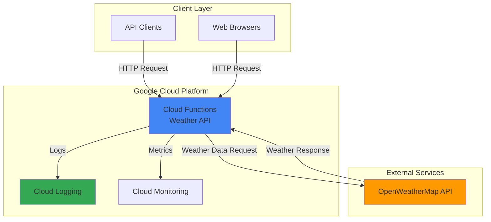

# Weather Forecast API with Cloud Functions

## Problem

Many applications need weather information but don't want to manage infrastructure or handle scaling concerns. Developers often struggle with provisioning servers, managing dependencies, and ensuring their weather APIs can handle varying traffic loads while maintaining cost efficiency for sporadic usage patterns.

## Solution

Build a serverless weather forecast API using Google Cloud Functions that fetches current weather data from an external weather service and returns formatted JSON responses. This approach eliminates infrastructure management while providing automatic scaling and pay-per-request pricing for optimal cost efficiency.

## Architecture Diagram



## Prerequisites

1. Google Cloud account with billing enabled and Cloud Functions API access
2. gcloud CLI installed and configured (or use Cloud Shell)
3. Basic understanding of Python and REST APIs
4. OpenWeatherMap API key (free tier available)
5. Estimated cost: $0-$5/month for typical usage (first 2 million invocations free monthly)

> **Note**: OpenWeatherMap provides 1,000 free API calls per day, perfect for testing and small applications.

## Preparation

```bash
# Set environment variables for GCP resources
export PROJECT_ID="weather-api-$(date +%s)"
export REGION="us-central1"
export FUNCTION_NAME="weather-forecast"

# Generate unique suffix for resource names
RANDOM_SUFFIX=$(openssl rand -hex 3)

# Create new project for this recipe
gcloud projects create ${PROJECT_ID} \
    --name="Weather API Project"

# Set default project and region
gcloud config set project ${PROJECT_ID}
gcloud config set compute/region ${REGION}
gcloud config set functions/region ${REGION}

# Enable required APIs
gcloud services enable artifactregistry.googleapis.com
gcloud services enable cloudbuild.googleapis.com
gcloud services enable run.googleapis.com
gcloud services enable logging.googleapis.com

echo "✅ Project configured: ${PROJECT_ID}"
```

## Steps

1. **Create function directory and dependencies**:

   Google Cloud Functions uses a simple file-based deployment model where your source code and dependencies are packaged automatically. Creating the proper directory structure and requirements file ensures your function has access to necessary Python libraries for HTTP requests and JSON processing.

   ```bash
   # Create function directory
   mkdir weather-function
   cd weather-function
   
   # Create requirements.txt for Python dependencies
   cat > requirements.txt << 'EOF'
   requests==2.31.0
   functions-framework==3.4.0
   EOF
   
   echo "✅ Function directory and dependencies created"
   ```

   The requirements.txt file specifies the exact versions of libraries needed, ensuring consistent deployments and avoiding version conflicts in the serverless environment.

2. **Create the weather API function code**:

   Cloud Functions with HTTP triggers automatically handle request routing, response formatting, and CORS headers. The function code focuses purely on business logic - fetching weather data and formatting responses - while Google Cloud manages all infrastructure concerns including scaling, load balancing, and security.

   ```bash
   # Create main.py with weather API logic
   cat > main.py << 'EOF'
   import json
   import os
   import requests
   from flask import Request
   import functions_framework

   @functions_framework.http
   def weather_forecast(request: Request):
       """HTTP Cloud Function for weather forecasts."""
       
       # Enable CORS for web browsers
       if request.method == 'OPTIONS':
           headers = {
               'Access-Control-Allow-Origin': '*',
               'Access-Control-Allow-Methods': 'GET',
               'Access-Control-Allow-Headers': 'Content-Type',
               'Access-Control-Max-Age': '3600'
           }
           return ('', 204, headers)
       
       # Set CORS headers for actual request
       headers = {'Access-Control-Allow-Origin': '*'}
       
       try:
           # Get city parameter from query string
           city = request.args.get('city', 'London')
           
           # OpenWeatherMap API configuration
           api_key = os.environ.get('OPENWEATHER_API_KEY', 'demo_key')
           base_url = "http://api.openweathermap.org/data/2.5/weather"
           
           # Make API request
           params = {
               'q': city,
               'appid': api_key,
               'units': 'metric'
           }
           
           response = requests.get(base_url, params=params, timeout=10)
           
           if response.status_code == 200:
               data = response.json()
               
               # Format response
               forecast = {
                   'city': data['name'],
                   'country': data['sys']['country'],
                   'temperature': data['main']['temp'],
                   'feels_like': data['main']['feels_like'],
                   'humidity': data['main']['humidity'],
                   'description': data['weather'][0]['description'],
                   'wind_speed': data['wind']['speed'],
                   'timestamp': data['dt']
               }
               
               return (json.dumps(forecast), 200, headers)
           
           elif response.status_code == 401:
               return (json.dumps({'error': 'Invalid API key'}), 401, headers)
           
           elif response.status_code == 404:
               return (json.dumps({'error': 'City not found'}), 404, headers)
           
           else:
               return (json.dumps({'error': 'Weather service unavailable'}), 503, headers)
               
       except requests.RequestException as e:
           return (json.dumps({'error': 'Network error occurred'}), 500, headers)
       
       except Exception as e:
           return (json.dumps({'error': 'Internal server error'}), 500, headers)
   EOF
   
   echo "✅ Weather API function code created"
   ```

   This function implements comprehensive error handling, CORS support for web applications, and structured JSON responses. The OpenWeatherMap integration demonstrates real-world API consumption patterns with proper timeout handling and status code management.

3. **Deploy the Cloud Function**:

   Cloud Functions deployment automatically builds your code, creates the necessary infrastructure, and provides a public HTTPS endpoint. The deployment process includes dependency installation, security configuration, and health check setup, transforming your Python code into a production-ready serverless API.

   ```bash
   # Deploy function with environment variables (Gen 2)
   gcloud run deploy ${FUNCTION_NAME} \
       --source . \
       --function weather_forecast \
       --region ${REGION} \
       --allow-unauthenticated \
       --memory 512Mi \
       --timeout 60s \
       --set-env-vars OPENWEATHER_API_KEY="demo_key"
   
   # Get function URL
   FUNCTION_URL=$(gcloud run services describe ${FUNCTION_NAME} \
       --region ${REGION} \
       --format="value(status.url)")
   
   echo "✅ Function deployed successfully"
   echo "Function URL: ${FUNCTION_URL}"
   ```

   The function is now accessible via HTTPS with automatic SSL termination, global load balancing, and built-in DDoS protection. Google Cloud's serverless infrastructure ensures zero-downtime deployments and automatic scaling based on request volume.

4. **Configure OpenWeatherMap API key (optional)**:

   Environment variables in Cloud Functions provide secure configuration management without hardcoding sensitive information in source code. This approach enables different API keys for development, staging, and production environments while maintaining security best practices.

   ```bash
   # Update function with your OpenWeatherMap API key
   # Get free API key from: https://openweathermap.org/api
   
   # Replace 'your-api-key-here' with actual API key
   read -p "Enter your OpenWeatherMap API key (or press Enter to skip): " API_KEY
   
   if [ ! -z "$API_KEY" ]; then
       gcloud run deploy ${FUNCTION_NAME} \
           --source . \
           --function weather_forecast \
           --region ${REGION} \
           --allow-unauthenticated \
           --memory 512Mi \
           --timeout 60s \
           --set-env-vars OPENWEATHER_API_KEY="${API_KEY}" \
           --quiet
       
       echo "✅ Function updated with OpenWeatherMap API key"
   else
       echo "⚠️  Using demo API key (limited functionality)"
   fi
   ```

   With a real API key, your function can handle production traffic and provide accurate weather data for any global location, supporting up to 1,000 requests per day on the free tier.

## Validation & Testing

1. Test the weather API with default city:

   ```bash
   # Test function endpoint
   curl "${FUNCTION_URL}"
   ```

   Expected output with demo key:
   ```json
   {"error": "Invalid API key"}
   ```

2. Test with specific city parameter:

   ```bash
   # Test with city parameter
   curl "${FUNCTION_URL}?city=Tokyo"
   ```

3. Test function logs and monitoring:

   ```bash
   # View function logs
   gcloud logging read "resource.type=cloud_run_revision \
       AND resource.labels.service_name=${FUNCTION_NAME}" \
       --limit=10 \
       --format="table(timestamp,severity,textPayload)"
   
   # Check function status
   gcloud run services describe ${FUNCTION_NAME} \
       --region ${REGION} \
       --format="table(metadata.name,status.conditions[0].type,spec.template.spec.containers[0].image)"
   ```

4. Performance test with multiple requests:

   ```bash
   # Test concurrent requests
   for i in {1..5}; do
       curl -s "${FUNCTION_URL}?city=Paris" &
   done
   wait
   
   echo "✅ Concurrent request test completed"
   ```

## Cleanup

1. Delete the Cloud Run service:

   ```bash
   # Delete Cloud Run service
   gcloud run services delete ${FUNCTION_NAME} \
       --region ${REGION} \
       --quiet
   
   echo "✅ Cloud Run service deleted"
   ```

2. Clean up local files:

   ```bash
   # Remove local function directory
   cd ..
   rm -rf weather-function
   
   echo "✅ Local files cleaned up"
   ```

3. Delete the project (optional):

   ```bash
   # Delete entire project if created specifically for this recipe
   gcloud projects delete ${PROJECT_ID} --quiet
   
   echo "✅ Project deleted"
   echo "Note: Project deletion may take several minutes to complete"
   ```

## Discussion

Cloud Functions provides an ideal serverless platform for building lightweight APIs that respond to HTTP requests with automatic scaling and pay-per-use pricing. This weather API demonstrates the core serverless pattern of stateless request processing, where each function invocation is independent and handles a complete request-response cycle. The Functions Framework abstracts away server management while providing familiar HTTP semantics for web developers.

The integration with external APIs like OpenWeatherMap showcases a common serverless use case: creating wrapper APIs that add authentication, caching, rate limiting, or data transformation to third-party services. This pattern allows organizations to control API access, implement custom business logic, and provide consistent interfaces across multiple data sources. Cloud Functions' built-in monitoring and logging capabilities provide operational visibility without additional infrastructure setup.

Security considerations include proper API key management through environment variables, input validation for user parameters, and comprehensive error handling to prevent information disclosure. The CORS configuration enables direct browser access while maintaining security boundaries. For production deployments, consider implementing rate limiting, caching with Cloud Memorystore, and authentication with Cloud Identity and Access Management (IAM) or API Gateway integration.

Cost optimization comes naturally with Cloud Functions' automatic scaling and pay-per-invocation model. The function only consumes resources during active request processing, making it cost-effective for sporadic or unpredictable traffic patterns. Memory allocation and timeout settings can be tuned based on performance requirements, with 512MB being sufficient for most API integration scenarios that include external HTTP calls.

> **Tip**: Monitor your function's performance using Cloud Monitoring to optimize memory allocation and identify bottlenecks in external API calls. Consider implementing exponential backoff for retries and caching responses for frequently requested locations.

**Documentation Sources:**
- [Cloud Run Functions Documentation](https://cloud.google.com/functions/docs)
- [Functions Framework for Python](https://cloud.google.com/functions/docs/functions-framework)
- [Cloud Functions HTTP Triggers](https://cloud.google.com/functions/docs/writing/http)
- [OpenWeatherMap API Documentation](https://openweathermap.org/api)
- [Google Cloud Security Best Practices](https://cloud.google.com/security/security-design-best-practices)

## Challenge

Extend this solution by implementing these enhancements:

1. **Add response caching** using Cloud Memorystore to reduce external API calls and improve response times for frequently requested cities
2. **Implement rate limiting** with Cloud Firestore to track and limit requests per IP address or API key
3. **Add weather alerts** by integrating with Cloud Pub/Sub to send notifications when certain weather conditions are detected
4. **Create a weather dashboard** using Cloud Storage for static hosting and Chart.js for visualizing historical weather trends
5. **Deploy with CI/CD** using Cloud Build and Cloud Source Repositories for automated testing and deployment pipelines

## Infrastructure Code

### Available Infrastructure as Code:

- [Infrastructure Code Overview](code/README.md) - Detailed description of all infrastructure components
- [Infrastructure Manager](code/infrastructure-manager/) - GCP Infrastructure Manager templates
- [Bash CLI Scripts](code/scripts/) - Example bash scripts using gcloud CLI commands to deploy infrastructure
- [Terraform](code/terraform/) - Terraform configuration files