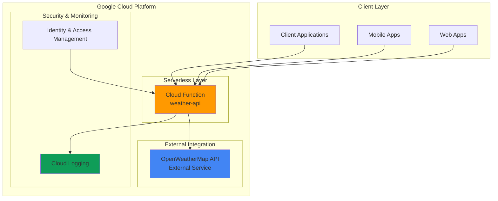

# Weather Information API with Cloud Functions

## Problem

Small businesses and developers need a quick way to integrate weather information into their applications but face challenges with complex API setups, server management overhead, and scaling concerns. Building traditional server-based APIs requires infrastructure provisioning, load balancing, and ongoing maintenance, which can be time-consuming and costly for simple data retrieval services.

## Solution

Deploy a serverless HTTP API using Google Cloud Functions that fetches current weather information for any city. This approach eliminates server management while providing automatic scaling, built-in security, and pay-per-request pricing. The serverless architecture ensures high availability and cost efficiency for weather data integration.

## Architecture Diagram



## Prerequisites

1. Google Cloud account with billing enabled and Cloud Functions API access
2. Google Cloud CLI (gcloud) installed and configured
3. Basic understanding of HTTP APIs and JSON data structures
4. OpenWeatherMap API key (free tier available at openweathermap.org)
5. Estimated cost: $0.00-$0.40 per million requests (Cloud Functions free tier includes 2 million invocations)

> **Note**: This recipe uses Google Cloud's generous free tier for Cloud Functions, making it ideal for learning and small-scale applications.

## Preparation

```bash
# Set environment variables for GCP resources
export PROJECT_ID="weather-api-$(date +%s)"
export REGION="us-central1"
export FUNCTION_NAME="weather-api"

# Generate unique suffix for resource names
RANDOM_SUFFIX=$(openssl rand -hex 3)

# Set default project and region
gcloud config set project ${PROJECT_ID}
gcloud config set functions/region ${REGION}

# Enable required APIs
gcloud services enable cloudfunctions.googleapis.com
gcloud services enable cloudbuild.googleapis.com
gcloud services enable run.googleapis.com

# Create project directory and files
mkdir -p weather-function
cd weather-function

echo "✅ Project configured: ${PROJECT_ID}"
echo "✅ Region set to: ${REGION}"
```

## Steps

1. **Create the Weather API Function Code**:

   Cloud Functions for Python provides a simple framework for handling HTTP requests and responses. The Functions Framework automatically handles request parsing, CORS headers, and error responses, allowing developers to focus on business logic rather than HTTP server implementation details.

   ```bash
   # Create the main function file
   cat > main.py << 'EOF'
import functions_framework
import requests
import json
import os
from flask import jsonify

@functions_framework.http
def get_weather(request):
    """HTTP Cloud Function to get weather information for a city.
    
    Args:
        request (flask.Request): The request object containing city parameter
        
    Returns:
        flask.Response: JSON response with weather data or error message
    """
    
    # Set CORS headers for cross-origin requests
    headers = {
        'Access-Control-Allow-Origin': '*',
        'Access-Control-Allow-Methods': 'GET, POST, OPTIONS',
        'Access-Control-Allow-Headers': 'Content-Type'
    }
    
    # Handle preflight OPTIONS request
    if request.method == 'OPTIONS':
        return ('', 204, headers)
    
    try:
        # Get city parameter from request
        city = request.args.get('city', '').strip()
        
        if not city:
            return jsonify({
                'error': 'City parameter is required',
                'example': '?city=London'
            }), 400, headers
        
        # Use demo API key for testing (replace with your own)
        api_key = os.environ.get('WEATHER_API_KEY', 'demo_key_please_replace')
        
        if api_key == 'demo_key_please_replace':
            # Return mock data for demo purposes
            return jsonify({
                'city': city,
                'temperature': 22,
                'description': 'Demo weather data',
                'humidity': 65,
                'wind_speed': 5.2,
                'note': 'This is demo data. Set WEATHER_API_KEY environment variable for real data.'
            }), 200, headers
        
        # Make request to OpenWeatherMap API
        weather_url = f"https://api.openweathermap.org/data/2.5/weather"
        params = {
            'q': city,
            'appid': api_key,
            'units': 'metric'
        }
        
        response = requests.get(weather_url, params=params, timeout=10)
        
        if response.status_code == 404:
            return jsonify({
                'error': f'City "{city}" not found',
                'suggestion': 'Please check the spelling or try a different city name'
            }), 404, headers
        
        if response.status_code != 200:
            return jsonify({
                'error': 'Weather service temporarily unavailable',
                'status_code': response.status_code
            }), 502, headers
        
        weather_data = response.json()
        
        # Extract and format relevant weather information
        formatted_response = {
            'city': weather_data['name'],
            'country': weather_data['sys']['country'],
            'temperature': round(weather_data['main']['temp'], 1),
            'feels_like': round(weather_data['main']['feels_like'], 1),
            'description': weather_data['weather'][0]['description'].title(),
            'humidity': weather_data['main']['humidity'],
            'wind_speed': weather_data.get('wind', {}).get('speed', 0),
            'timestamp': weather_data['dt']
        }
        
        return jsonify(formatted_response), 200, headers
        
    except requests.exceptions.Timeout:
        return jsonify({
            'error': 'Weather service request timed out',
            'retry': 'Please try again in a few moments'
        }), 504, headers
        
    except requests.exceptions.RequestException as e:
        return jsonify({
            'error': 'Failed to fetch weather data',
            'details': str(e)
        }), 502, headers
        
    except Exception as e:
        return jsonify({
            'error': 'Internal server error',
            'message': 'An unexpected error occurred'
        }), 500, headers
EOF
   
   echo "✅ Weather API function code created"
   ```

   This implementation demonstrates serverless best practices including proper error handling, CORS support, and graceful degradation with demo data when API keys aren't configured.

2. **Create Requirements File for Dependencies**:

   Python Cloud Functions use a requirements.txt file to specify external dependencies. The Functions Framework and requests library provide the essential functionality for HTTP handling and external API communication with minimal overhead.

   ```bash
   # Create requirements.txt with necessary dependencies
   cat > requirements.txt << 'EOF'
functions-framework==3.*
requests==2.32.3
flask==3.0.3
EOF
   
   echo "✅ Requirements file created with dependencies"
   ```

   The specified versions ensure compatibility and security while maintaining optimal cold start performance for the serverless function.

3. **Deploy the Cloud Function**:

   Google Cloud Functions deployment automatically handles container building, dependency installation, and HTTP endpoint creation. The deployment process includes built-in security features, monitoring integration, and automatic scaling configuration.

   ```bash
   # Deploy Cloud Function with HTTP trigger
   gcloud functions deploy ${FUNCTION_NAME} \
       --runtime python312 \
       --trigger-http \
       --allow-unauthenticated \
       --source . \
       --entry-point get_weather \
       --memory 256MB \
       --timeout 60s \
       --region ${REGION}
   
   # Wait for deployment to complete
   echo "⏳ Deploying function... this may take 2-3 minutes"
   
   # Get function URL
   FUNCTION_URL=$(gcloud functions describe ${FUNCTION_NAME} \
       --region ${REGION} \
       --format "value(httpsTrigger.url)")
   
   echo "✅ Function deployed successfully"
   echo "🌐 Function URL: ${FUNCTION_URL}"
   ```

   The deployment creates a secure HTTPS endpoint with automatic SSL certificate management and global CDN distribution for optimal performance worldwide.

4. **Configure Environment Variables (Optional)**:

   Environment variables in Cloud Functions provide secure configuration management without hardcoding sensitive information. This approach follows security best practices and enables easy configuration updates without code changes.

   ```bash
   # Set environment variable for weather API key (optional)
   # Replace 'your-api-key-here' with actual OpenWeatherMap API key
   gcloud functions deploy ${FUNCTION_NAME} \
       --update-env-vars WEATHER_API_KEY=demo_key_please_replace \
       --region ${REGION}
   
   echo "✅ Environment variables configured"
   echo "💡 Replace demo API key with real OpenWeatherMap API key for production use"
   ```

   This configuration step demonstrates how to securely manage API keys and other sensitive configuration data in serverless environments.

## Validation & Testing

1. **Test the Weather API with demo data**:

   ```bash
   # Test function with a sample city
   curl "${FUNCTION_URL}?city=London"
   ```

   Expected output (demo data):
   ```json
   {
     "city": "London",
     "temperature": 22,
     "description": "Demo weather data",
     "humidity": 65,
     "wind_speed": 5.2,
     "note": "This is demo data. Set WEATHER_API_KEY environment variable for real data."
   }
   ```

2. **Test error handling**:

   ```bash
   # Test without city parameter
   curl "${FUNCTION_URL}"
   
   # Test with empty city parameter
   curl "${FUNCTION_URL}?city="
   ```

3. **Verify function metrics and logs**:

   ```bash
   # View function logs
   gcloud functions logs read ${FUNCTION_NAME} \
       --region ${REGION} \
       --limit 10
   
   # Check function status
   gcloud functions describe ${FUNCTION_NAME} \
       --region ${REGION}
   ```

## Cleanup

1. **Delete the Cloud Function**:

   ```bash
   # Remove the deployed function
   gcloud functions delete ${FUNCTION_NAME} \
       --region ${REGION} \
       --quiet
   
   echo "✅ Cloud Function deleted"
   ```

2. **Clean up local files**:

   ```bash
   # Remove local project directory
   cd ..
   rm -rf weather-function
   
   # Unset environment variables
   unset PROJECT_ID REGION FUNCTION_NAME FUNCTION_URL
   
   echo "✅ Local files and environment variables cleaned up"
   ```

## Discussion

This recipe demonstrates the power of serverless architecture for building simple yet robust APIs. Google Cloud Functions provides automatic scaling, built-in security, and cost-effective pricing that makes it ideal for weather information services and similar data integration use cases.

The implementation showcases several important serverless patterns: graceful error handling ensures user-friendly responses when external services are unavailable, CORS configuration enables browser-based applications to consume the API directly, and environment variable usage allows secure configuration management without exposing sensitive API keys in source code.

The serverless approach offers significant advantages over traditional server-based APIs. Cold start latency is minimal for HTTP functions, typically under 100ms for Python functions, while automatic scaling handles traffic spikes without manual intervention. The pay-per-request pricing model means you only pay for actual usage, making it extremely cost-effective for variable workloads.

For production deployments, consider implementing rate limiting using Google Cloud Endpoints, adding request logging for analytics, and setting up monitoring alerts for function failures. The weather API can be enhanced with caching mechanisms using Cloud Memorystore to reduce external API calls and improve response times while managing costs effectively.

> **Tip**: Use Cloud Functions' built-in monitoring and logging features to track API usage patterns and optimize performance based on actual request data.

**Documentation Sources:**
- [Google Cloud Functions HTTP Triggers](https://cloud.google.com/functions/docs/writing/http)
- [Google Cloud Functions Python Runtime](https://cloud.google.com/functions/docs/concepts/python-runtime)
- [Google Cloud Functions Environment Variables](https://cloud.google.com/functions/docs/configuring/env-var)
- [Google Cloud Functions Best Practices](https://cloud.google.com/functions/docs/bestpractices/tips)
- [OpenWeatherMap API Documentation](https://openweathermap.org/api)
- [Functions Framework for Python](https://github.com/GoogleCloudPlatform/functions-framework-python)

## Challenge

Extend this weather API solution by implementing these enhancements:

1. **Add weather forecast functionality** - Modify the function to fetch 5-day weather forecasts and implement query parameters to specify forecast duration
2. **Implement response caching** - Use Cloud Memorystore for Redis to cache weather responses for 10 minutes, reducing external API calls and improving response times
3. **Add multiple weather providers** - Integrate additional weather APIs (WeatherAPI, AccuWeather) with failover logic to ensure high availability
4. **Create weather alerts system** - Combine with Cloud Pub/Sub and Cloud Scheduler to send weather alerts for extreme conditions via email or SMS
5. **Build a weather dashboard** - Deploy a simple web interface using Cloud Storage static hosting that consumes your weather API and displays formatted weather information

## Infrastructure Code

*Infrastructure code will be generated after recipe approval.*