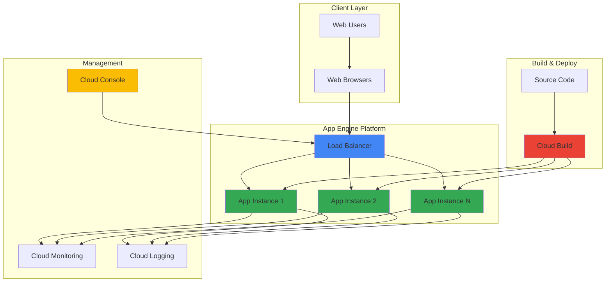

# Web Application Deployment with App Engine

## Problem

Small businesses and startups need to deploy web applications quickly without managing servers, configuring load balancers, or handling scaling complexities. Traditional hosting requires significant infrastructure expertise and ongoing maintenance, while manual scaling often leads to poor user experience during traffic spikes or unnecessary costs during low-traffic periods.

## Solution

Google App Engine provides a fully managed serverless platform that automatically handles scaling, load balancing, and infrastructure management. Deploy Python web applications with simple commands while benefiting from built-in monitoring, automatic HTTPS, and pay-per-use pricing that scales from zero to millions of users.

## Architecture Diagram



## Prerequisites

1. Google Cloud account with billing enabled and App Engine API access
2. Google Cloud CLI installed and configured (or use Cloud Shell)
3. Basic Python and Flask framework knowledge
4. Local Python 3.9+ development environment with pip
5. Estimated cost: Free tier covers most development usage; production apps start at $0.05 per instance hour

> **Note**: App Engine provides generous free quotas including 28 instance hours per day, making it ideal for development and small applications.

## Preparation

```bash
# Set environment variables for GCP resources
export PROJECT_ID="webapp-demo-$(date +%s)"
export REGION="us-central1"
export SERVICE_NAME="default"

# Generate unique suffix for resource names
RANDOM_SUFFIX=$(openssl rand -hex 3)

# Create and set the Google Cloud project
gcloud projects create ${PROJECT_ID} \
    --name="Web App Demo Project"

gcloud config set project ${PROJECT_ID}
gcloud config set compute/region ${REGION}

# Enable required APIs for App Engine
gcloud services enable appengine.googleapis.com
gcloud services enable cloudbuild.googleapis.com

# Initialize App Engine application
gcloud app create --region=${REGION}

echo "✅ Project configured: ${PROJECT_ID}"
echo "✅ App Engine initialized in region: ${REGION}"
```

## Steps

1. **Create Project Directory and Files**:

   Establishing a proper project structure is essential for App Engine deployment. The framework expects specific files including application code, configuration, and dependencies to be organized in a predictable manner that supports both local development and cloud deployment.

   ```bash
   # Create project directory structure
   mkdir -p webapp-${RANDOM_SUFFIX}/{templates,static}
   cd webapp-${RANDOM_SUFFIX}
   
   # Create main application file
   cat > main.py << 'EOF'
   from flask import Flask, render_template
   import datetime
   import os
   
   app = Flask(__name__)
   
   @app.route('/')
   def home():
       return render_template('index.html', 
                            current_time=datetime.datetime.now(),
                            version=os.environ.get('GAE_VERSION', 'local'))
   
   @app.route('/health')
   def health_check():
       return {'status': 'healthy', 'timestamp': str(datetime.datetime.now())}
   
   if __name__ == '__main__':
       app.run(host='127.0.0.1', port=8080, debug=True)
   EOF
   
   echo "✅ Python Flask application created"
   ```

   The Flask application includes both a main route for user interface and a health check endpoint for monitoring. This structure provides the foundation for a production-ready web application with proper error handling and status reporting.

2. **Create HTML Template and Static Assets**:

   App Engine serves static files efficiently through its built-in content delivery mechanisms. Creating proper templates and assets establishes the user interface while leveraging App Engine's optimized static file serving capabilities.

   ```bash
   # Create HTML template
   cat > templates/index.html << 'EOF'
   <!DOCTYPE html>
   <html lang="en">
   <head>
       <meta charset="UTF-8">
       <meta name="viewport" content="width=device-width, initial-scale=1.0">
       <title>My App Engine Web App</title>
       <link rel="stylesheet" href="{{ url_for('static', filename='style.css') }}">
   </head>
   <body>
       <div class="container">
           <h1>Welcome to App Engine!</h1>
           <p>Your web application is running successfully.</p>
           <div class="info">
               <p><strong>Current Time:</strong> {{ current_time }}</p>
               <p><strong>App Version:</strong> {{ version }}</p>
           </div>
           <button onclick="checkHealth()">Check Application Health</button>
           <div id="health-status"></div>
       </div>
       <script src="{{ url_for('static', filename='script.js') }}"></script>
   </body>
   </html>
   EOF
   
   # Create CSS stylesheet
   cat > static/style.css << 'EOF'
   body {
       font-family: 'Segoe UI', Tahoma, Geneva, Verdana, sans-serif;
       margin: 0;
       padding: 20px;
       background: linear-gradient(135deg, #667eea 0%, #764ba2 100%);
       color: white;
   }
   
   .container {
       max-width: 600px;
       margin: 0 auto;
       text-align: center;
       background: rgba(255, 255, 255, 0.1);
       padding: 40px;
       border-radius: 15px;
       box-shadow: 0 8px 32px rgba(0, 0, 0, 0.1);
   }
   
   .info {
       background: rgba(255, 255, 255, 0.2);
       padding: 20px;
       border-radius: 10px;
       margin: 20px 0;
   }
   
   button {
       background: #4285f4;
       color: white;
       border: none;
       padding: 10px 20px;
       border-radius: 5px;
       cursor: pointer;
       font-size: 16px;
   }
   
   button:hover {
       background: #3367d6;
   }
   EOF
   
   # Create JavaScript file
   cat > static/script.js << 'EOF'
   async function checkHealth() {
       try {
           const response = await fetch('/health');
           const data = await response.json();
           document.getElementById('health-status').innerHTML = 
               `<p style="color: #34a853;">✅ ${data.status} - ${data.timestamp}</p>`;
       } catch (error) {
           document.getElementById('health-status').innerHTML = 
               `<p style="color: #ea4335;">❌ Health check failed</p>`;
       }
   }
   EOF
   
   echo "✅ Web application assets created"
   ```

   The template and static assets create a professional-looking web interface with responsive design and interactive health checking functionality. This demonstrates App Engine's ability to serve both dynamic content and static assets efficiently.

3. **Configure Application Dependencies**:

   App Engine requires explicit dependency declaration through requirements.txt to ensure consistent runtime environments. This approach guarantees that your application runs with the same library versions in both development and production environments.

   ```bash
   # Create requirements file with current Flask version
   cat > requirements.txt << 'EOF'
   Flask==3.0.0
   Werkzeug==3.0.1
   EOF
   
   # Install dependencies locally for testing
   python3 -m venv venv
   source venv/bin/activate
   pip install -r requirements.txt
   
   echo "✅ Dependencies configured and installed"
   ```

   The virtual environment ensures dependency isolation while the requirements file provides App Engine with the exact library versions needed for your application. This configuration supports both local development and cloud deployment.

4. **Create App Engine Configuration**:

   The app.yaml file defines how App Engine should run your application, including runtime version, scaling parameters, and resource allocation. This configuration file is the bridge between your application code and Google's serverless infrastructure.

   ```bash
   # Create App Engine configuration file
   cat > app.yaml << 'EOF'
   runtime: python312
   
   # Automatic scaling configuration
   automatic_scaling:
     min_instances: 0
     max_instances: 10
     target_cpu_utilization: 0.6
   
   # Static file handlers
   handlers:
   - url: /static
     static_dir: static
   
   - url: /.*
     script: auto
   
   # Environment variables
   env_variables:
     FLASK_ENV: production
   EOF
   
   echo "✅ App Engine configuration created"
   ```

   The configuration enables automatic scaling from zero to ten instances based on CPU utilization, ensuring cost efficiency during low traffic and performance during high demand periods. Static file handling is optimized for fast content delivery.

5. **Test Application Locally**:

   Local testing validates your application logic and user interface before cloud deployment. This step ensures that Flask routing, template rendering, and static file serving work correctly in your development environment.

   ```bash
   # Run application locally for testing
   echo "Starting local development server..."
   python main.py &
   LOCAL_PID=$!
   
   # Wait for server to start
   sleep 3
   
   # Test the application endpoints
   echo "Testing application endpoints..."
   curl -s http://localhost:8080/ | grep -q "Welcome to App Engine" && \
       echo "✅ Home page responds correctly"
   
   curl -s http://localhost:8080/health | grep -q "healthy" && \
       echo "✅ Health check endpoint working"
   
   # Stop local server
   kill $LOCAL_PID
   wait $LOCAL_PID 2>/dev/null
   
   echo "✅ Local testing completed successfully"
   ```

   Local testing confirms that your Flask application responds correctly to HTTP requests and serves both dynamic content and health check endpoints. This validation step prevents deployment issues and ensures functionality before cloud deployment.

6. **Deploy Application to App Engine**:

   The deployment process uploads your application code, installs dependencies, and creates running instances on Google's infrastructure. App Engine automatically handles container creation, load balancing, and SSL certificate provisioning during this process.

   ```bash
   # Deploy application to App Engine
   echo "Deploying to App Engine..."
   gcloud app deploy --quiet --promote
   
   # Get application URL
   APP_URL=$(gcloud app browse --no-launch-browser)
   
   echo "✅ Application deployed successfully"
   echo "Application URL: ${APP_URL}"
   
   # Store URL for validation
   export APP_URL
   ```

   The deployment creates a new version of your application and automatically routes 100% of traffic to it. Google Cloud Build compiles your application into a container image and deploys it across multiple zones for high availability.

7. **Configure Application Monitoring**:

   App Engine integrates automatically with Google Cloud's observability stack, providing detailed metrics, logs, and performance insights. Configuring monitoring alerts ensures proactive issue detection and resolution for production applications.

   ```bash
   # View deployment details
   gcloud app versions list --service=default
   
   # Enable detailed monitoring (automatic with App Engine)
   echo "Monitoring features automatically enabled:"
   echo "- Request metrics and latency tracking"
   echo "- Error rate monitoring and alerting"
   echo "- Instance scaling and resource utilization"
   echo "- Application logs aggregation"
   
   echo "✅ Monitoring configured and active"
   ```

   App Engine provides comprehensive monitoring without additional configuration, including request latency, error rates, and instance metrics. This built-in observability supports both troubleshooting and performance optimization efforts.

## Validation & Testing

1. **Verify Application Deployment**:

   ```bash
   # Check application status and versions
   gcloud app versions list --format="table(id,service,traffic_split)"
   
   # Verify service is receiving traffic
   gcloud app services list --format="table(id,allocatedTrafficSplit)"
   ```

   Expected output: Shows your application version receiving 100% of traffic allocation.

2. **Test Application Functionality**:

   ```bash
   # Test home page response
   curl -s "${APP_URL}" | grep -q "Welcome to App Engine" && \
       echo "✅ Home page accessible and rendering correctly"
   
   # Test health endpoint
   curl -s "${APP_URL}/health" | grep -q "healthy" && \
       echo "✅ Health check endpoint responding"
   
   # Test static file serving
   curl -s "${APP_URL}/static/style.css" | grep -q "font-family" && \
       echo "✅ Static files served correctly"
   ```

3. **Validate Automatic Scaling**:

   ```bash
   # Check current instance count
   gcloud app instances list --format="table(id,service,version,status)"
   
   # View scaling configuration
   gcloud app describe --format="yaml(automaticScaling)"
   ```

4. **Monitor Application Performance**:

   ```bash
   # View recent logs
   gcloud logs read "resource.type=gae_app" --limit=10 \
       --format="table(timestamp,severity,textPayload)"
   
   # Check application metrics in Cloud Console
   echo "View detailed metrics at:"
   echo "https://console.cloud.google.com/appengine?project=${PROJECT_ID}"
   ```

## Cleanup

1. **Remove App Engine Application**:

   ```bash
   # List all versions before cleanup
   gcloud app versions list
   
   # Stop serving traffic to the application
   gcloud app versions stop $(gcloud app versions list \
       --service=default --format="value(id)")
   
   echo "✅ Application traffic stopped"
   ```

2. **Delete Application Versions**:

   ```bash
   # Delete non-serving versions (keep one serving version)
   VERSIONS=$(gcloud app versions list --service=default \
       --format="value(id)" | tail -n +2)
   
   if [ ! -z "$VERSIONS" ]; then
       echo $VERSIONS | xargs gcloud app versions delete --quiet
   fi
   
   echo "✅ Old application versions removed"
   ```

3. **Clean Up Project Resources**:

   ```bash
   # Remove local development files
   deactivate 2>/dev/null || true
   cd ..
   rm -rf webapp-${RANDOM_SUFFIX}
   
   # Delete the entire project (optional)
   echo "To delete the entire project, run:"
   echo "gcloud projects delete ${PROJECT_ID}"
   
   echo "✅ Local resources cleaned up"
   echo "Note: App Engine applications cannot be deleted, only disabled"
   ```

## Discussion

Google App Engine represents a mature serverless platform that abstracts away infrastructure complexity while providing enterprise-grade reliability and performance. The platform automatically handles load balancing, SSL certificate management, and DDoS protection, allowing developers to focus exclusively on application logic rather than operational concerns. This approach significantly reduces time-to-market for web applications while providing built-in scalability that can handle traffic from dozens to millions of concurrent users.

The automatic scaling capabilities of App Engine provide significant cost advantages compared to traditional hosting approaches. Applications scale down to zero instances during periods of no traffic, eliminating unnecessary infrastructure costs, while automatically scaling up based on CPU utilization and request queue depth during traffic spikes. This pay-per-use model ensures that businesses only pay for actual resource consumption rather than provisioned capacity, making it particularly attractive for startups and variable-traffic applications.

App Engine's integration with Google Cloud's observability stack provides comprehensive monitoring, logging, and debugging capabilities without additional configuration. The platform automatically captures request metrics, error rates, and performance data while providing structured logging that enables efficient troubleshooting and performance optimization. This built-in observability reduces operational overhead and provides actionable insights for application improvement.

The platform's support for multiple runtime environments, including Python, Java, Node.js, PHP, Ruby, and Go, enables teams to use their preferred technologies while benefiting from Google's infrastructure. Version management and traffic splitting features support advanced deployment strategies including blue-green deployments, canary releases, and A/B testing, providing professional deployment capabilities typically associated with more complex orchestration platforms.

**Documentation References:**
- [App Engine Standard Environment Documentation](https://cloud.google.com/appengine/docs/standard)
- [Python Runtime Environment Guide](https://cloud.google.com/appengine/docs/standard/python3/runtime)
- [App Engine Automatic Scaling Configuration](https://cloud.google.com/appengine/docs/standard/how-instances-are-managed)
- [App Engine Pricing and Quotas](https://cloud.google.com/appengine/pricing)
- [Google Cloud Architecture Framework](https://cloud.google.com/architecture/framework)

> **Tip**: Use App Engine's version management features to maintain multiple application versions simultaneously, enabling instant rollbacks and traffic splitting for testing new features with minimal risk.

## Challenge

Extend this solution by implementing these enhancements:

1. **Database Integration**: Connect your application to Cloud Firestore or Cloud SQL to store and retrieve user data, implementing proper connection pooling and error handling for database operations.

2. **User Authentication**: Integrate Firebase Authentication or Identity and Access Management to provide secure user registration, login, and session management capabilities.

3. **Static Asset Optimization**: Implement Cloud CDN integration and optimize static asset delivery using Cloud Storage buckets with appropriate caching headers and compression.

4. **Monitoring and Alerting**: Configure Cloud Monitoring alerts for application errors, high latency, and scaling events, with notification integration through Cloud Pub/Sub or email.

5. **Multi-Service Architecture**: Expand to a microservices architecture using additional App Engine services or Cloud Run, implementing service-to-service communication and distributed tracing.

## Infrastructure Code

*Infrastructure code will be generated after recipe approval.*