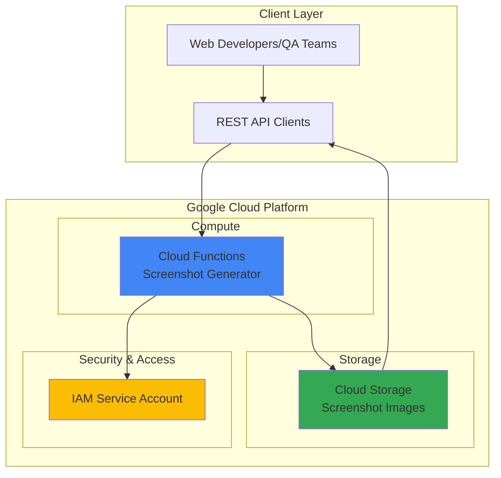

# Website Screenshot API with Cloud Functions and Storage

## Problem

Web developers, QA teams, and content creators frequently need automated screenshot capabilities for testing visual changes, generating thumbnails, or creating documentation. Building and maintaining screenshot infrastructure requires managing browser automation tools, handling dynamic content rendering, and storing images reliably. Traditional approaches involve complex server setups with significant maintenance overhead and scaling challenges.

## Solution

Create a serverless REST API using Google Cloud Functions that captures website screenshots with Puppeteer and stores them in Cloud Storage. This approach leverages Google's managed infrastructure to provide automatic scaling, built-in security, and cost-effective pay-per-use pricing while eliminating the need to manage browser automation infrastructure.

## Architecture Diagram



## Prerequisites

1. Google Cloud account with billing enabled and Cloud Functions API access
2. Google Cloud CLI (gcloud) installed and configured
3. Basic knowledge of REST APIs and JavaScript/Node.js
4. Understanding of serverless computing concepts
5. Estimated cost: $0.01-$0.10 per day for testing (Cloud Functions: $0.0000004/invocation, Cloud Storage: $0.020/GB/month)

> **Note**: This recipe uses the latest Node.js 20 runtime with optimized Puppeteer configuration for Cloud Functions 2nd generation.

## Preparation

```bash
# Set environment variables for GCP resources
export PROJECT_ID="screenshot-api-$(date +%s)"
export REGION="us-central1"
export FUNCTION_NAME="screenshot-generator"

# Generate unique suffix for resource names
RANDOM_SUFFIX=$(openssl rand -hex 3)
export BUCKET_NAME="screenshots-${RANDOM_SUFFIX}"

# Create new project for this recipe
gcloud projects create ${PROJECT_ID} \
    --name="Screenshot API Project"

# Set default project and region
gcloud config set project ${PROJECT_ID}
gcloud config set functions/region ${REGION}

# Enable required APIs
gcloud services enable cloudfunctions.googleapis.com
gcloud services enable storage.googleapis.com
gcloud services enable cloudbuild.googleapis.com
gcloud services enable run.googleapis.com

echo "✅ Project configured: ${PROJECT_ID}"
echo "✅ Region set to: ${REGION}"
```

## Steps

1. **Create Cloud Storage Bucket for Screenshot Storage**:

   Google Cloud Storage provides globally distributed object storage with strong consistency and automatic scaling. Creating a bucket with appropriate location and access controls establishes secure, durable storage for generated screenshots that can be accessed via direct URLs or programmatic APIs.

   ```bash
   # Create storage bucket using latest gcloud storage commands
   gcloud storage buckets create gs://${BUCKET_NAME} \
       --location=${REGION} \
       --storage-class=STANDARD \
       --uniform-bucket-level-access
   
   # Configure public read access for screenshot URLs
   gcloud storage buckets add-iam-policy-binding \
       gs://${BUCKET_NAME} \
       --member="allUsers" \
       --role="roles/storage.objectViewer"
   
   echo "✅ Storage bucket created: gs://${BUCKET_NAME}"
   ```

   The storage bucket is now configured with public read access, enabling direct URL access to screenshots while maintaining secure write permissions for the Cloud Function service account.

2. **Create Project Directory and Function Code**:

   Cloud Functions with Puppeteer requires specific package configuration for the Node.js 20 runtime. The 2025 implementation uses the latest Puppeteer version with updated Google Cloud client libraries to ensure compatibility with Cloud Functions' deployment size limits while providing reliable browser automation.

   ```bash
   # Create function directory
   mkdir screenshot-function
   cd screenshot-function
   
   # Create package.json with latest package versions
   cat > package.json << 'EOF'
   {
     "name": "screenshot-api",
     "version": "1.0.0",
     "main": "index.js",
     "scripts": {
       "gcp-build": "node node_modules/puppeteer/install.mjs"
     },
     "dependencies": {
       "@google-cloud/functions-framework": "^4.0.0",
       "@google-cloud/storage": "^7.16.0",
       "puppeteer": "^24.15.0"
     }
   }
   EOF
   
   echo "✅ Package configuration created with latest dependencies"
   ```

   This configuration includes the essential `gcp-build` script that ensures Puppeteer's Chromium browser is properly installed during Cloud Functions deployment, resolving common 2025 runtime compatibility issues with the latest package versions.

3. **Create Puppeteer Configuration File**:

   The Puppeteer configuration file is essential for 2025 Cloud Functions deployment, specifying the correct cache directory and browser installation path to work within the serverless environment's file system constraints.

   ```bash
   # Create Puppeteer configuration for Cloud Functions
   cat > .puppeteerrc.cjs << 'EOF'
   const {join} = require('path');
   
   /**
    * @type {import("puppeteer").Configuration}
    */
   module.exports = {
     // Changes the cache location for Puppeteer
     cacheDirectory: join(__dirname, '.cache', 'puppeteer'),
   };
   EOF
   
   echo "✅ Puppeteer configuration created for Cloud Functions runtime"
   ```

   This configuration ensures Puppeteer uses the correct cache directory within Cloud Functions' temporary file system, preventing common deployment and runtime errors with the latest Puppeteer version.

4. **Create Screenshot Function Implementation**:

   The HTTP function handles screenshot requests, validates URLs, configures browser settings for optimal performance, and uploads images to Cloud Storage. The implementation includes comprehensive error handling, timeout management, and memory optimization for reliable operation with the latest Google Cloud client libraries.

   ```bash
   # Create main function file
   cat > index.js << 'EOF'
   const functions = require('@google-cloud/functions-framework');
   const puppeteer = require('puppeteer');
   const {Storage} = require('@google-cloud/storage');
   
   // Initialize Cloud Storage client
   const storage = new Storage();
   const bucketName = process.env.BUCKET_NAME;
   
   functions.http('generateScreenshot', async (req, res) => {
     // Enable CORS
     res.set('Access-Control-Allow-Origin', '*');
     res.set('Access-Control-Allow-Methods', 'GET, POST, OPTIONS');
     res.set('Access-Control-Allow-Headers', 'Content-Type');
   
     if (req.method === 'OPTIONS') {
       return res.status(204).send('');
     }
   
     try {
       // Extract URL from request
       const targetUrl = req.query.url || req.body?.url;
       
       if (!targetUrl) {
         return res.status(400).json({
           error: 'URL parameter is required'
         });
       }
   
       // Validate URL format
       try {
         new URL(targetUrl);
       } catch (urlError) {
         return res.status(400).json({
           error: 'Invalid URL format'
         });
       }
   
       console.log(`Taking screenshot of: ${targetUrl}`);
   
       // Launch browser with optimized settings
       const browser = await puppeteer.launch({
         args: [
           '--no-sandbox',
           '--disable-setuid-sandbox',
           '--disable-dev-shm-usage',
           '--disable-accelerated-2d-canvas',
           '--disable-gpu'
         ],
         headless: 'new'
       });
   
       const page = await browser.newPage();
       
       // Set viewport for consistent screenshots
       await page.setViewport({
         width: 1200,
         height: 800,
         deviceScaleFactor: 1
       });
   
       // Navigate and take screenshot
       await page.goto(targetUrl, {
         waitUntil: 'networkidle2',
         timeout: 30000
       });
   
       const screenshot = await page.screenshot({
         type: 'png',
         fullPage: false
       });
   
       await browser.close();
   
       // Generate unique filename
       const timestamp = Date.now();
       const filename = `screenshot-${timestamp}.png`;
   
       // Upload to Cloud Storage
       const file = storage.bucket(bucketName).file(filename);
       
       await file.save(screenshot, {
         metadata: {
           contentType: 'image/png',
           metadata: {
             sourceUrl: targetUrl,
             generatedAt: new Date().toISOString()
           }
         }
       });
   
       // Return screenshot URL
       const publicUrl = `https://storage.googleapis.com/${bucketName}/${filename}`;
       
       res.json({
         success: true,
         screenshotUrl: publicUrl,
         filename: filename,
         sourceUrl: targetUrl
       });
   
     } catch (error) {
       console.error('Screenshot generation failed:', error);
       res.status(500).json({
         error: 'Screenshot generation failed',
         details: error.message
       });
     }
   });
   EOF
   
   echo "✅ Screenshot function implementation created"
   ```

   This implementation includes comprehensive error handling, URL validation, browser optimization for Cloud Functions, and direct Cloud Storage integration with metadata preservation using the latest client library versions.

5. **Deploy Cloud Function with Optimized Configuration**:

   Deploying the function with appropriate memory allocation and timeout settings ensures reliable browser automation. The 2025 Cloud Functions configuration uses 1GB memory and 540-second timeout to accommodate Puppeteer's resource requirements and complex page rendering with the latest browser automation features.

   ```bash
   # Deploy function with optimized settings for Puppeteer
   gcloud functions deploy ${FUNCTION_NAME} \
       --gen2 \
       --runtime=nodejs20 \
       --trigger-http \
       --allow-unauthenticated \
       --memory=1024MB \
       --timeout=540s \
       --set-env-vars BUCKET_NAME=${BUCKET_NAME} \
       --source=.
   
   # Get function URL
   FUNCTION_URL=$(gcloud functions describe ${FUNCTION_NAME} \
       --gen2 --region=${REGION} \
       --format="value(serviceConfig.uri)")
   
   echo "✅ Function deployed successfully"
   echo "📍 Function URL: ${FUNCTION_URL}"
   ```

   The function is now deployed with 2nd generation Cloud Functions, providing improved performance, better cold start times, and enhanced security compared to 1st generation functions.

## Validation & Testing

1. **Verify function deployment and configuration**:

   ```bash
   # Check function status and configuration
   gcloud functions describe ${FUNCTION_NAME} \
       --gen2 --region=${REGION} \
       --format="table(name,state,availableMemory,timeout)"
   
   # Verify storage bucket exists and permissions
   gcloud storage ls gs://${BUCKET_NAME}
   gcloud storage buckets describe gs://${BUCKET_NAME}
   ```

   Expected output: Function should show ACTIVE state with 1024MB memory and 540s timeout.

2. **Test screenshot generation with a simple website**:

   ```bash
   # Test with Google homepage
   curl -X POST "${FUNCTION_URL}" \
       -H "Content-Type: application/json" \
       -d '{"url": "https://www.google.com"}' \
       | jq '.'
   ```

   Expected output: JSON response with `success: true` and a `screenshotUrl` field.

3. **Test screenshot generation with query parameters**:

   ```bash
   # Test with URL parameter method
   curl "${FUNCTION_URL}?url=https://www.example.com" | jq '.'
   ```

   Expected output: JSON response containing the screenshot URL that you can access in a browser.

4. **Verify screenshot storage and accessibility**:

   ```bash
   # List generated screenshots
   gcloud storage ls gs://${BUCKET_NAME}/
   
   # Check if screenshots are publicly accessible
   curl -I "$(curl -s "${FUNCTION_URL}?url=https://www.example.com" \
       | jq -r '.screenshotUrl')"
   ```

   Expected output: HTTP 200 response indicating the screenshot is publicly accessible.

## Cleanup

1. **Delete Cloud Function**:

   ```bash
   # Remove the deployed function
   gcloud functions delete ${FUNCTION_NAME} \
       --gen2 --region=${REGION} --quiet
   
   echo "✅ Cloud Function deleted"
   ```

2. **Remove Cloud Storage bucket and contents**:

   ```bash
   # Delete all objects in bucket first
   gcloud storage rm gs://${BUCKET_NAME}/** --recursive
   
   # Delete the bucket
   gcloud storage buckets delete gs://${BUCKET_NAME}
   
   echo "✅ Storage bucket and contents deleted"
   ```

3. **Delete the entire project**:

   ```bash
   # Remove the project (recommended for test environments)
   gcloud projects delete ${PROJECT_ID} --quiet
   
   # Clean up local files
   cd .. && rm -rf screenshot-function
   
   echo "✅ Project and local files cleaned up"
   echo "Note: Project deletion may take several minutes to complete"
   ```

## Discussion

This serverless screenshot API demonstrates the power of combining Google Cloud Functions with Cloud Storage to create scalable, cost-effective automation solutions. The 2025 implementation addresses common challenges with Puppeteer in serverless environments through optimized configuration and dependency management using the latest package versions. The solution automatically scales from zero to handle thousands of concurrent requests while only charging for actual usage.

The architecture follows Google Cloud's serverless best practices by leveraging managed services that eliminate infrastructure maintenance. Cloud Functions 2nd generation provides improved performance with faster cold starts and better resource management compared to traditional server-based approaches. The integration with Cloud Storage enables direct URL access to generated screenshots, simplifying client-side implementation and reducing API complexity.

Security considerations include IAM-based access control, HTTPS-only communication, and input validation to prevent malicious URL injection. The public read access on the storage bucket enables direct screenshot sharing while maintaining write security through service account permissions. For production use, consider implementing authentication, rate limiting, and request logging through Google Cloud's security and monitoring services as outlined in the [Cloud Functions security documentation](https://cloud.google.com/functions/docs/securing).

The cost model scales efficiently with usage, charging approximately $0.0000004 per function invocation plus storage costs. This makes it significantly more cost-effective than maintaining dedicated screenshot servers for variable workloads. Performance optimizations include viewport configuration, network idle detection, and memory allocation tuning based on Google's [Cloud Functions best practices](https://cloud.google.com/functions/docs/bestpractices).

> **Tip**: Monitor function performance and cold start times using Cloud Monitoring to optimize memory allocation and timeout settings based on actual usage patterns and website complexity.

## Challenge

Extend this solution by implementing these enhancements:

1. **Add authentication and rate limiting** using Google Cloud Endpoints or Cloud Armor to control API access and prevent abuse
2. **Implement screenshot caching** by checking Cloud Storage for existing screenshots of the same URL and returning cached versions when available
3. **Add mobile responsive screenshots** by creating multiple viewport sizes and device emulation options in the same function call
4. **Create batch screenshot processing** using Cloud Tasks or Pub/Sub to handle multiple URLs in a single request with asynchronous processing
5. **Add advanced screenshot options** such as PDF generation, element-specific screenshots, and custom wait conditions for dynamic content

## Infrastructure Code

*Infrastructure code will be generated after recipe approval.*