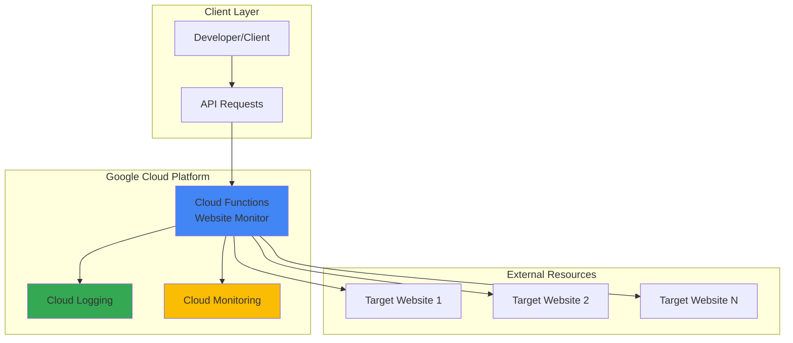

# Website Status Monitor with Cloud Functions

## Problem

Development teams need to monitor multiple websites and APIs for availability, response times, and overall health status, but lack a centralized, on-demand monitoring solution. Manual checking is time-consuming and error-prone, while traditional monitoring services can be expensive for small-scale operations. Teams require a simple, cost-effective way to programmatically check website status and response metrics for testing workflows and operational monitoring.

## Solution

Build a serverless website status monitoring API using Google Cloud Functions that accepts website URLs and returns detailed health information including response time, HTTP status codes, and availability metrics. Cloud Functions provides automatic scaling, pay-per-request pricing, and built-in HTTPS endpoints, making it ideal for lightweight monitoring tasks that require no infrastructure management.

## Architecture Diagram



## Prerequisites

1. Google Cloud Project with Cloud Functions API enabled
2. Google Cloud CLI installed and authenticated
3. Basic knowledge of Python programming and HTTP requests
4. Understanding of serverless computing concepts
5. Estimated cost: $0.05-$0.20 per month for typical usage (first 2 million invocations free)

> **Note**: Cloud Functions provides 2 million free invocations per month, making this solution cost-effective for most monitoring scenarios.

## Preparation

```bash
# Set environment variables for GCP resources
export PROJECT_ID="website-monitor-$(date +%s)"
export REGION="us-central1"
export FUNCTION_NAME="website-status-monitor"

# Generate unique suffix for resource names
RANDOM_SUFFIX=$(openssl rand -hex 3)

# Set default project and region
gcloud config set project ${PROJECT_ID}
gcloud config set functions/region ${REGION}

# Enable required APIs
gcloud services enable cloudfunctions.googleapis.com
gcloud services enable cloudbuild.googleapis.com
gcloud services enable logging.googleapis.com

echo "✅ Project configured: ${PROJECT_ID}"
echo "✅ Function name: ${FUNCTION_NAME}"
```

## Steps

1. **Create the Function Directory and Dependencies**:

   Cloud Functions requires a specific directory structure with source code and dependency files. The requirements.txt file defines the Python packages needed for HTTP requests and JSON handling, while the main.py file contains the monitoring logic.

   ```bash
   # Create function directory
   mkdir -p ${FUNCTION_NAME}
   cd ${FUNCTION_NAME}
   
   # Create requirements.txt for Python dependencies
   cat > requirements.txt << 'EOF'
   requests==2.32.4
   functions-framework==3.8.3
   EOF
   
   echo "✅ Function directory and dependencies created"
   ```

2. **Implement the Website Status Monitor Function**:

   The main function accepts HTTP requests with website URLs and performs comprehensive health checks including response time measurement, status code validation, and error handling. This implementation follows Cloud Functions best practices for HTTP triggers and structured logging.

   ```bash
   # Create the main function code
   cat > main.py << 'EOF'
import functions_framework
import requests
import json
import time
from datetime import datetime, timezone
from urllib.parse import urlparse

@functions_framework.http
def website_status_monitor(request):
    """HTTP Cloud Function to monitor website status and performance."""
    
    # Set CORS headers for web requests
    headers = {
        'Access-Control-Allow-Origin': '*',
        'Access-Control-Allow-Methods': 'GET, POST, OPTIONS',
        'Access-Control-Allow-Headers': 'Content-Type',
        'Content-Type': 'application/json'
    }
    
    # Handle preflight OPTIONS request
    if request.method == 'OPTIONS':
        return ('', 204, headers)
    
    try:
        # Parse request data
        if request.method == 'GET':
            url = request.args.get('url')
        else:
            request_json = request.get_json(silent=True)
            url = request_json.get('url') if request_json else None
        
        if not url:
            return (json.dumps({
                'error': 'URL parameter is required',
                'usage': 'GET /?url=https://example.com or POST with {"url": "https://example.com"}'
            }), 400, headers)
        
        # Validate URL format
        parsed_url = urlparse(url)
        if not parsed_url.scheme or not parsed_url.netloc:
            return (json.dumps({
                'error': 'Invalid URL format. Must include protocol (http:// or https://)'
            }), 400, headers)
        
        # Perform website health check
        start_time = time.time()
        
        try:
            response = requests.get(
                url,
                timeout=10,
                allow_redirects=True,
                headers={'User-Agent': 'GCP-Website-Monitor/1.0'}
            )
            
            end_time = time.time()
            response_time = round((end_time - start_time) * 1000, 2)  # Convert to milliseconds
            
            # Determine status
            is_healthy = 200 <= response.status_code < 400
            
            # Build response data
            result = {
                'url': url,
                'status': 'healthy' if is_healthy else 'unhealthy',
                'status_code': response.status_code,
                'response_time_ms': response_time,
                'content_length': len(response.content),
                'timestamp': datetime.now(timezone.utc).isoformat(),
                'redirected': response.url != url,
                'final_url': response.url,
                'server': response.headers.get('server', 'Unknown'),
                'content_type': response.headers.get('content-type', 'Unknown')
            }
            
            print(f"Monitored {url}: {response.status_code} ({response_time}ms)")
            return (json.dumps(result), 200, headers)
            
        except requests.exceptions.Timeout:
            return (json.dumps({
                'url': url,
                'status': 'timeout',
                'error': 'Request timeout after 10 seconds',
                'timestamp': datetime.now(timezone.utc).isoformat()
            }), 200, headers)
            
        except requests.exceptions.ConnectionError:
            return (json.dumps({
                'url': url,
                'status': 'connection_error',
                'error': 'Unable to connect to the website',
                'timestamp': datetime.now(timezone.utc).isoformat()
            }), 200, headers)
            
        except Exception as e:
            return (json.dumps({
                'url': url,
                'status': 'error',
                'error': str(e),
                'timestamp': datetime.now(timezone.utc).isoformat()
            }), 200, headers)
    
    except Exception as e:
        print(f"Function error: {str(e)}")
        return (json.dumps({
            'error': 'Internal server error',
            'message': str(e)
        }), 500, headers)
   EOF
   
   echo "✅ Website status monitor function implemented"
   ```

3. **Deploy the Cloud Function**:

   Cloud Functions deployment creates a managed serverless environment that automatically handles scaling, load balancing, and HTTPS endpoint provisioning. The function will be accessible via HTTP triggers and integrate with Google Cloud's monitoring and logging systems.

   ```bash
   # Deploy the Cloud Function with HTTP trigger
   gcloud functions deploy ${FUNCTION_NAME} \
       --region=${REGION} \
       --runtime python312 \
       --trigger-http \
       --allow-unauthenticated \
       --source . \
       --entry-point website_status_monitor \
       --memory 256MB \
       --timeout 30s
   
   # Get the function URL
   FUNCTION_URL=$(gcloud functions describe ${FUNCTION_NAME} \
       --region=${REGION} \
       --format="value(httpsTrigger.url)")
   
   echo "✅ Cloud Function deployed successfully"
   echo "Function URL: ${FUNCTION_URL}"
   ```

4. **Test the Website Monitor with Multiple URLs**:

   Testing verifies that the function correctly handles various website scenarios including healthy sites, error conditions, and different response types. This comprehensive testing ensures the monitor provides accurate and useful status information.

   ```bash
   # Test with a healthy website
   curl -X POST "${FUNCTION_URL}" \
       -H "Content-Type: application/json" \
       -d '{"url": "https://httpbin.org/status/200"}' | jq .
   
   # Test with an error status
   curl -X POST "${FUNCTION_URL}" \
       -H "Content-Type: application/json" \
       -d '{"url": "https://httpbin.org/status/500"}' | jq .
   
   # Test with GET method
   curl "${FUNCTION_URL}?url=https://www.google.com" | jq .
   
   echo "✅ Function testing completed successfully"
   ```

## Validation & Testing

1. **Verify Function Deployment and Configuration**:

   ```bash
   # Check function status and configuration
   gcloud functions describe ${FUNCTION_NAME} \
       --region=${REGION} \
       --format="table(name,status,httpsTrigger.url,runtime)"
   ```

   Expected output: Function should show status as "ACTIVE" with an HTTPS URL.

2. **Test Multiple Website Scenarios**:

   ```bash
   # Test response time measurement
   echo "Testing response time measurement:"
   curl -s "${FUNCTION_URL}?url=https://httpbin.org/delay/2" | \
       jq '.response_time_ms'
   
   # Test redirect handling
   echo "Testing redirect handling:"
   curl -s "${FUNCTION_URL}?url=https://httpbin.org/redirect/1" | \
       jq '.redirected, .final_url'
   
   # Test invalid URL handling
   echo "Testing error handling:"
   curl -s "${FUNCTION_URL}?url=invalid-url" | jq '.error'
   ```

3. **Verify Cloud Logging Integration**:

   ```bash
   # Check function logs
   gcloud functions logs read ${FUNCTION_NAME} \
       --region=${REGION} \
       --limit 10
   ```

   Expected output: Log entries showing function invocations and monitoring results.

## Cleanup

1. **Delete the Cloud Function**:

   ```bash
   # Delete the Cloud Function
   gcloud functions delete ${FUNCTION_NAME} \
       --region=${REGION} \
       --quiet
   
   echo "✅ Cloud Function deleted successfully"
   ```

2. **Clean up local files**:

   ```bash
   # Remove local function directory
   cd ..
   rm -rf ${FUNCTION_NAME}
   
   # Clear environment variables
   unset PROJECT_ID REGION FUNCTION_NAME FUNCTION_URL RANDOM_SUFFIX
   
   echo "✅ Local cleanup completed"
   ```

## Discussion

Cloud Functions provides an ideal serverless platform for website monitoring applications due to its automatic scaling, pay-per-request pricing model, and seamless integration with Google Cloud's observability stack. This implementation demonstrates several key architectural patterns including HTTP trigger handling, comprehensive error management, and structured JSON responses that make the service easy to integrate into existing workflows.

The monitoring function implements industry-standard health checking practices including timeout handling, redirect following, and response time measurement. By using the `requests` library with appropriate timeout values and error handling, the function provides reliable monitoring even when target websites are unresponsive. The structured response format includes essential metrics like status codes, response times, and content metadata that development teams need for operational visibility.

Google Cloud Functions' serverless architecture eliminates infrastructure management overhead while providing enterprise-grade reliability and security. The platform automatically handles SSL certificate management, load balancing, and scaling based on request volume, making it suitable for both development testing and production monitoring scenarios. Integration with Cloud Logging and Cloud Monitoring enables comprehensive observability without additional configuration.

The CORS headers implementation allows the function to be called from web applications, making it suitable for browser-based monitoring dashboards or client-side health checks. This flexibility, combined with support for both GET and POST requests, ensures the API can integrate with various monitoring tools and workflows.

> **Tip**: Consider implementing batch monitoring by accepting multiple URLs in a single request to reduce function invocation costs for monitoring large numbers of websites.

**References:**
- [Cloud Functions Documentation](https://cloud.google.com/functions/docs)
- [Cloud Functions Deployment Guide](https://cloud.google.com/functions/docs/deploy)
- [Cloud Functions Runtime Support](https://cloud.google.com/functions/docs/runtime-support)
- [Google Cloud Observability](https://cloud.google.com/products/operations)
- [Serverless Best Practices](https://cloud.google.com/functions/docs/bestpractices)
- [Cloud Functions Pricing](https://cloud.google.com/functions/pricing)

## Challenge

Extend this website monitoring solution by implementing these enhancements:

1. **Batch Monitoring API**: Modify the function to accept and process multiple URLs in a single request, returning an array of monitoring results to reduce invocation costs and improve efficiency.

2. **Scheduled Monitoring with Cloud Scheduler**: Integrate Cloud Scheduler to automatically trigger monitoring of predefined websites at regular intervals, storing results in Cloud Storage or Firestore for historical analysis.

3. **Alert Integration with Pub/Sub**: Implement alert notifications by publishing failure events to Cloud Pub/Sub topics, enabling integration with Cloud Monitoring alerting policies or external notification systems.

4. **Advanced Metrics Collection**: Enhance the monitoring to collect additional metrics such as DNS resolution time, SSL certificate expiration dates, and content validation using regex patterns or checksums.

5. **Monitoring Dashboard with Cloud Run**: Create a companion Cloud Run web application that provides a user interface for configuring monitoring targets, viewing historical data, and managing alert settings using the monitoring function as a backend API.

## Infrastructure Code

### Available Infrastructure as Code:

- [Infrastructure Code Overview](code/README.md) - Detailed description of all infrastructure components
- [Infrastructure Manager](code/infrastructure-manager/) - GCP Infrastructure Manager templates
- [Bash CLI Scripts](code/scripts/) - Example bash scripts using gcloud CLI commands to deploy infrastructure
- [Terraform](code/terraform/) - Terraform configuration files