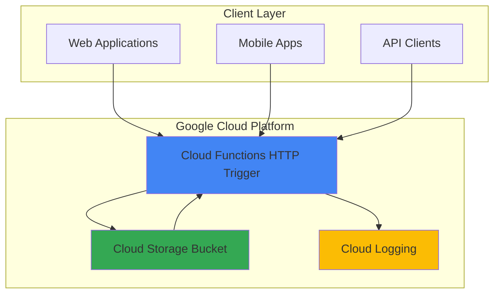

# Word Count API with Cloud Functions

## Problem

Content creators, editors, and developers frequently need to analyze text for word counts, character counts, and reading time estimates, but lack a simple, scalable API solution. Existing tools often require manual uploads or complex installations, making it difficult to integrate text analysis into automated workflows or applications that process content at scale.

## Solution

Build a serverless HTTP API using Cloud Functions that analyzes text content and returns comprehensive statistics including word count, character count, paragraph count, and estimated reading time. The solution supports both direct text input via POST requests and file processing from Cloud Storage, providing flexible integration options for various use cases.

## Architecture Diagram



## Prerequisites

1. Google Cloud account with billing enabled
2. Google Cloud CLI installed and configured (`gcloud` command)
3. Basic knowledge of HTTP APIs and serverless functions
4. Text editor for writing Python code
5. Estimated cost: $0.00 - $2.00 (covered by free tier for basic usage)

> **Note**: Cloud Functions provides 2 million invocations per month in the free tier, making this solution cost-effective for most use cases.

## Preparation

```bash
# Set environment variables for GCP resources
export PROJECT_ID="word-count-api-$(date +%s)"
export REGION="us-central1"
export FUNCTION_NAME="word-count-api"

# Generate unique suffix for resource names
RANDOM_SUFFIX=$(openssl rand -hex 3)
export BUCKET_NAME="word-count-files-${RANDOM_SUFFIX}"

# Create new project for this recipe
gcloud projects create ${PROJECT_ID} --name="Word Count API"

# Set default project and region
gcloud config set project ${PROJECT_ID}
gcloud config set functions/region ${REGION}

# Enable required APIs
gcloud services enable cloudfunctions.googleapis.com
gcloud services enable storage.googleapis.com
gcloud services enable cloudbuild.googleapis.com
gcloud services enable run.googleapis.com

echo "✅ Project configured: ${PROJECT_ID}"
echo "✅ Region set to: ${REGION}"
```

## Steps

1. **Create Cloud Storage Bucket for File Processing**:

   Cloud Storage provides unified object storage with strong consistency guarantees, enabling users to upload documents that exceed HTTP request size limits. Creating a bucket with uniform bucket-level access establishes a secure staging area for document processing workflows while following Google Cloud security best practices.

   ```bash
   # Create Cloud Storage bucket for file uploads
   gcloud storage buckets create gs://${BUCKET_NAME} \
       --location=${REGION} \
       --uniform-bucket-level-access
   
   # Set bucket permissions for function access
   gcloud storage buckets add-iam-policy-binding \
       gs://${BUCKET_NAME} \
       --member="serviceAccount:${PROJECT_ID}@appspot.gserviceaccount.com" \
       --role="roles/storage.objectViewer"
   
   echo "✅ Storage bucket created: ${BUCKET_NAME}"
   ```

   The bucket is now configured with uniform bucket-level access and appropriate IAM permissions, providing a secure foundation for file-based text processing workflows with minimal privileges following the principle of least privilege.

2. **Create the Word Count Function Code**:

   The Python function implements comprehensive text analysis algorithms using regular expressions for accurate word counting, character counting with whitespace handling, paragraph detection, and reading time estimation based on industry-standard reading speeds of 200 words per minute.

   ```bash
   # Create function directory and source files
   mkdir -p word-count-function
   cd word-count-function
   
   # Create the main function file
   cat > main.py << 'EOF'
import json
import re
from google.cloud import storage
from flask import Request
import functions_framework

def analyze_text(text):
    """Analyze text and return comprehensive statistics."""
    if not text or not text.strip():
        return {
            'word_count': 0,
            'character_count': 0,
            'character_count_no_spaces': 0,
            'paragraph_count': 0,
            'estimated_reading_time_minutes': 0
        }
    
    # Word count (split by whitespace, filter empty strings)
    words = [word for word in re.findall(r'\b\w+\b', text.lower())]
    word_count = len(words)
    
    # Character counts
    character_count = len(text)
    character_count_no_spaces = len(text.replace(' ', '').replace('\t', '').replace('\n', ''))
    
    # Paragraph count (split by double newlines or single newlines)
    paragraphs = [p.strip() for p in text.split('\n') if p.strip()]
    paragraph_count = len(paragraphs)
    
    # Estimated reading time (200 words per minute average)
    estimated_reading_time_minutes = max(1, round(word_count / 200)) if word_count > 0 else 0
    
    return {
        'word_count': word_count,
        'character_count': character_count,
        'character_count_no_spaces': character_count_no_spaces,
        'paragraph_count': paragraph_count,
        'estimated_reading_time_minutes': estimated_reading_time_minutes
    }

@functions_framework.http
def word_count_api(request: Request):
    """HTTP Cloud Function for text analysis."""
    # Set CORS headers
    headers = {
        'Access-Control-Allow-Origin': '*',
        'Access-Control-Allow-Methods': 'GET, POST, OPTIONS',
        'Access-Control-Allow-Headers': 'Content-Type, Authorization'
    }
    
    # Handle preflight OPTIONS request
    if request.method == 'OPTIONS':
        return ('', 204, headers)
    
    if request.method == 'GET':
        return ({
            'message': 'Word Count API is running',
            'usage': {
                'POST /': 'Analyze text from request body',
                'POST / with file_path': 'Analyze text from Cloud Storage file'
            }
        }, 200, headers)
    
    if request.method != 'POST':
        return ({'error': 'Method not allowed'}, 405, headers)
    
    try:
        # Parse request data
        request_json = request.get_json(silent=True)
        
        if not request_json:
            return ({'error': 'Invalid JSON in request body'}, 400, headers)
        
        # Check if analyzing text from Cloud Storage file
        if 'file_path' in request_json:
            bucket_name = request_json.get('bucket_name')
            file_path = request_json['file_path']
            
            if not bucket_name:
                return ({'error': 'bucket_name required when using file_path'}, 400, headers)
            
            # Download file from Cloud Storage
            storage_client = storage.Client()
            bucket = storage_client.bucket(bucket_name)
            blob = bucket.blob(file_path)
            
            if not blob.exists():
                return ({'error': f'File not found: {file_path}'}, 404, headers)
            
            text_content = blob.download_as_text()
        
        # Check if analyzing direct text input
        elif 'text' in request_json:
            text_content = request_json['text']
        
        else:
            return ({'error': 'Either "text" or "file_path" required in request body'}, 400, headers)
        
        # Analyze the text
        analysis_result = analyze_text(text_content)
        
        # Add metadata to response
        response_data = {
            'analysis': analysis_result,
            'input_source': 'file' if 'file_path' in request_json else 'direct_text',
            'api_version': '1.0'
        }
        
        return (response_data, 200, headers)
    
    except Exception as e:
        return ({'error': f'Internal server error: {str(e)}'}, 500, headers)
EOF
   
   echo "✅ Function code created successfully"
   ```

   The function code implements robust text analysis with comprehensive error handling, CORS support for browser-based applications, and flexible input methods supporting both direct text and Cloud Storage files, providing a production-ready API for text processing workflows.

3. **Create Requirements File**:

   The requirements file specifies current versions of the Google Cloud Storage client library and Functions Framework, enabling the function to securely access Cloud Storage buckets and handle HTTP requests with optimal performance and security features.

   ```bash
   # Create requirements.txt for function dependencies
   cat > requirements.txt << 'EOF'
google-cloud-storage==2.17.0
functions-framework==3.8.1
EOF
   
   echo "✅ Requirements file created"
   ```

4. **Deploy the Cloud Function**:

   Deploying the function to Cloud Run functions (2nd generation) provides automatic scaling from zero to thousands of instances, built-in logging with Cloud Logging integration, and HTTPS endpoints with Google's global load balancing for optimal performance, reliability, and cost efficiency.

   ```bash
   # Deploy the function with appropriate configuration
   gcloud functions deploy ${FUNCTION_NAME} \
       --gen2 \
       --runtime=python312 \
       --source=. \
       --entry-point=word_count_api \
       --trigger=http \
       --allow-unauthenticated \
       --memory=256Mi \
       --timeout=60s \
       --max-instances=10
   
   # Get the function URL
   FUNCTION_URL=$(gcloud functions describe ${FUNCTION_NAME} \
       --gen2 --format="value(serviceConfig.uri)")
   
   echo "✅ Function deployed successfully"
   echo "Function URL: ${FUNCTION_URL}"
   ```

   The Cloud Function is now deployed with automatic scaling, HTTP triggers, and optimized resource allocation for text processing workloads. The 2nd generation runtime provides improved cold start performance and better resource utilization compared to 1st generation functions.

5. **Test with Direct Text Analysis**:

   Testing the API with direct text input validates core functionality and ensures the word counting algorithms work correctly with various text formats, special characters, and content types while demonstrating the API's real-time processing capabilities.

   ```bash
   # Test the API with sample text
   curl -X POST "${FUNCTION_URL}" \
       -H "Content-Type: application/json" \
       -d '{
         "text": "Hello world! This is a sample text for word counting. It contains multiple sentences and paragraphs.\n\nThis is a second paragraph to test paragraph counting functionality."
       }' | jq '.'
   
   echo "✅ Direct text analysis test completed"
   ```

6. **Test with File Upload Processing**:

   File-based processing extends the API's capabilities to handle larger documents and enables integration with document management systems, batch processing workflows, and content management platforms that store files in Cloud Storage.

   ```bash
   # Create a sample text file for testing
   cat > sample.txt << 'EOF'
This is a comprehensive test document for the Word Count API.

It contains multiple paragraphs with various types of content, including numbers like 123 and 456, punctuation marks (!@#$%^&*), and different sentence structures.

The third paragraph demonstrates how the API handles longer content with more complex formatting and vocabulary.

Finally, this document tests the reading time estimation feature with approximately 50 words total.
EOF
   
   # Upload the test file to Cloud Storage
   gcloud storage cp sample.txt gs://${BUCKET_NAME}/sample.txt
   
   # Test file-based analysis
   curl -X POST "${FUNCTION_URL}" \
       -H "Content-Type: application/json" \
       -d "{
         \"bucket_name\": \"${BUCKET_NAME}\",
         \"file_path\": \"sample.txt\"
       }" | jq '.'
   
   echo "✅ File-based analysis test completed"
   ```

## Validation & Testing

1. **Verify Function Deployment Status**:

   ```bash
   # Check function status and configuration
   gcloud functions describe ${FUNCTION_NAME} --gen2 \
       --format="table(name,state,updateTime)"
   
   # Verify function logs
   gcloud functions logs read ${FUNCTION_NAME} \
       --gen2 --limit=10
   ```

   Expected output: Function should show "ACTIVE" state with recent deployment timestamp.

2. **Test API Health Check**:

   ```bash
   # Test GET endpoint for health check
   curl -X GET "${FUNCTION_URL}" | jq '.'
   ```

   Expected output: JSON response with API information and usage instructions.

3. **Validate Text Analysis Accuracy**:

   ```bash
   # Test with known word count
   curl -X POST "${FUNCTION_URL}" \
       -H "Content-Type: application/json" \
       -d '{"text": "one two three four five"}' | jq '.analysis.word_count'
   ```

   Expected output: `5` (correct word count for the test phrase).

## Cleanup

1. **Remove Cloud Function**:

   ```bash
   # Delete the Cloud Function
   gcloud functions delete ${FUNCTION_NAME} --gen2 --quiet
   
   echo "✅ Cloud Function deleted"
   ```

2. **Remove Cloud Storage Resources**:

   ```bash
   # Delete all objects and bucket
   gcloud storage rm -r gs://${BUCKET_NAME}
   
   echo "✅ Storage bucket and contents deleted"
   ```

3. **Delete Project Resources**:

   ```bash
   # Remove local files
   cd ..
   rm -rf word-count-function
   rm -f sample.txt
   
   # Delete the project (optional - removes all resources)
   gcloud projects delete ${PROJECT_ID} --quiet
   
   echo "✅ Project and local files cleaned up"
   echo "Note: Project deletion may take several minutes to complete"
   ```

## Discussion

This serverless word count API demonstrates the power of Google Cloud Functions for building scalable text processing services. The solution leverages Cloud Run functions (2nd generation) which provides improved performance, better resource allocation, and enhanced security compared to traditional server-based approaches. The HTTP trigger automatically provisions HTTPS endpoints with Google's global load balancing, ensuring low latency access from anywhere in the world while maintaining Google Cloud's 99.95% SLA.

The implementation includes several key architectural decisions that enhance reliability and usability. CORS headers enable web applications to consume the API directly from browsers without proxy servers, while the dual input method (direct text and Cloud Storage files) accommodates different use cases from simple text snippets to large document processing. The text analysis algorithm handles edge cases like empty input, special characters, and various text encodings while providing comprehensive statistics including reading time estimation based on average reading speeds.

The integration with Cloud Storage extends the API's capabilities beyond HTTP request size limits (32MB for Cloud Functions), enabling processing of large documents and batch operations. The IAM configuration follows Google Cloud security best practices by granting minimal required permissions to the function's service account using the principle of least privilege. Cloud Logging automatically captures function execution logs with structured logging, providing comprehensive visibility for monitoring, debugging, and performance optimization.

Performance optimization is achieved through appropriate memory allocation (256Mi) and timeout settings (60s), with automatic scaling up to 10 concurrent instances to handle traffic spikes without manual intervention. The function uses Python 3.12 runtime for optimal performance and compatibility with the latest Google Cloud client libraries, providing access to the newest security patches and performance improvements.

> **Tip**: For production deployments, consider implementing authentication using Cloud Identity and Access Management (IAM) or API keys to control access and prevent abuse, while using Cloud Monitoring to track usage patterns and performance metrics.

For more information, see the official Google Cloud documentation:
- [Cloud Run functions overview](https://cloud.google.com/run/docs/functions-with-run)
- [Cloud Storage client libraries](https://cloud.google.com/storage/docs/reference/libraries)
- [HTTP functions best practices](https://cloud.google.com/functions/docs/writing/http)
- [Cloud Functions security guide](https://cloud.google.com/functions/docs/securing)
- [Google Cloud Monitoring for Functions](https://cloud.google.com/functions/docs/monitoring)

## Challenge

Extend this solution by implementing these enhancements:

1. **Add language detection** using Google Cloud Translation API to identify text language and provide language-specific reading time estimates based on different reading speeds per language and cultural reading patterns.

2. **Implement sentiment analysis** integration with Google Cloud Natural Language API to provide emotion scoring alongside word count statistics, creating a comprehensive text analysis suite for content quality assessment.

3. **Create batch processing capabilities** using Cloud Storage event triggers to automatically process multiple documents when uploaded to specific bucket folders, with results stored in BigQuery for analytics and historical trend analysis.

4. **Add caching layer** using Cloud Memorystore (Redis) to cache analysis results for frequently processed content, reducing function execution time and costs for repeated requests while implementing cache invalidation strategies.

5. **Build a web interface** using Firebase Hosting and Cloud Functions to create a complete text analysis application with file upload, drag-and-drop functionality, and visual charts displaying analysis results with real-time updates.

## Infrastructure Code

*Infrastructure code will be generated after recipe approval.*