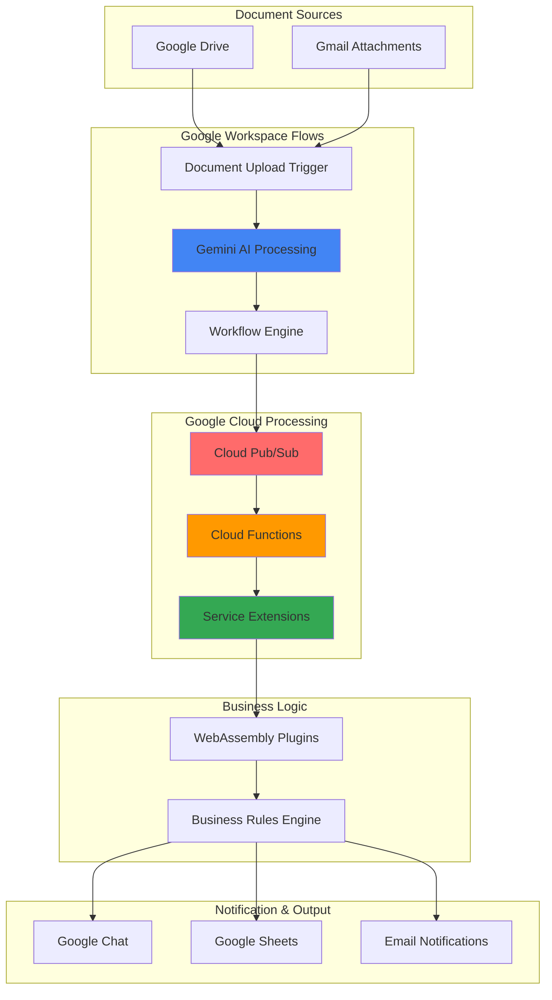

# Workflow Automation with Google Workspace Flows and Service Extensions

## Problem

Organizations struggle with manual document processing workflows that involve multiple stakeholders, complex approval chains, and inconsistent business rule application. Teams waste valuable time manually routing documents, extracting metadata, coordinating approvals across departments, and tracking workflow status. Traditional automation solutions require extensive coding knowledge, lack AI-powered decision-making capabilities, and fail to integrate seamlessly with existing Google Workspace environments, creating operational bottlenecks that impact business productivity.

## Solution

Build an intelligent document processing and approval workflow using Google Workspace Flows for no-code automation, Service Extensions for custom business logic through WebAssembly plugins, Cloud Functions for serverless processing, and Pub/Sub for reliable message orchestration. This solution automatically processes documents from Google Drive, applies AI-powered analysis, routes approvals based on custom rules, and provides real-time notifications throughout the workflow lifecycle.

## Architecture Diagram



## Prerequisites

1. Google Workspace Business or Enterprise account with Gemini for Google Workspace license
2. Google Cloud Project with billing enabled and appropriate APIs activated
3. Domain administrator access to configure Google Workspace Flows
4. gcloud CLI v2 installed and configured (or use Cloud Shell)
5. Basic understanding of workflow automation and document processing concepts
6. Estimated cost: $50-150/month depending on usage volume (includes Workspace licenses, Cloud Functions, Pub/Sub, and storage)

> **Note**: Google Workspace Flows is currently in limited preview and requires specific domain eligibility. Organizations must have Gemini for Google Workspace licenses and be part of the early access program. Contact your Google Workspace administrator for access requirements.

## Preparation

```bash
# Set environment variables for GCP resources
export PROJECT_ID="intelligent-workflows-$(date +%s | tail -c 6)"
export REGION="us-central1"
export ZONE="us-central1-a"

# Generate unique suffix for resource names
RANDOM_SUFFIX=$(openssl rand -hex 3)
export FUNCTION_NAME="doc-processor-${RANDOM_SUFFIX}"
export TOPIC_NAME="document-events-${RANDOM_SUFFIX}"
export SUBSCRIPTION_NAME="doc-processing-sub-${RANDOM_SUFFIX}"
export BUCKET_NAME="workflow-docs-${RANDOM_SUFFIX}"

# Set default project and region
gcloud config set project ${PROJECT_ID}
gcloud config set compute/region ${REGION}
gcloud config set compute/zone ${ZONE}

# Enable required APIs
gcloud services enable cloudfunctions.googleapis.com
gcloud services enable pubsub.googleapis.com
gcloud services enable storage.googleapis.com
gcloud services enable serviceextensions.googleapis.com
gcloud services enable admin.googleapis.com

echo "✅ Project configured: ${PROJECT_ID}"
```

## Steps

1. **Create Cloud Storage Bucket for Document Processing**:

   Cloud Storage provides the foundation for our document workflow by offering secure, scalable storage with event-driven triggers. Creating a bucket with appropriate lifecycle policies and access controls ensures that processed documents are stored efficiently while maintaining security and compliance requirements.

   ```bash
   # Create storage bucket for workflow documents
   gsutil mb -p ${PROJECT_ID} \
       -c STANDARD \
       -l ${REGION} \
       gs://${BUCKET_NAME}
   
   # Enable versioning for document protection
   gsutil versioning set on gs://${BUCKET_NAME}
   
   # Set up lifecycle policy for cost optimization
   cat > lifecycle-policy.json << EOF
   {
     "lifecycle": {
       "rule": [
         {
           "action": {"type": "SetStorageClass", "storageClass": "NEARLINE"},
           "condition": {"age": 30}
         },
         {
           "action": {"type": "SetStorageClass", "storageClass": "COLDLINE"},
           "condition": {"age": 90}
         }
       ]
     }
   }
   EOF
   
   gsutil lifecycle set lifecycle-policy.json gs://${BUCKET_NAME}
   
   echo "✅ Storage bucket created: gs://${BUCKET_NAME}"
   ```

   The storage bucket now provides a secure foundation for document processing with automated lifecycle management that optimizes costs while maintaining accessibility for workflow operations.

2. **Set Up Pub/Sub Topics and Subscriptions for Event Orchestration**:

   Pub/Sub enables reliable, scalable message passing between workflow components, ensuring that document processing events are delivered consistently even during high-volume periods. This messaging infrastructure supports the asynchronous nature of document workflows where processing steps may take varying amounts of time.

   ```bash
   # Create Pub/Sub topic for document events
   gcloud pubsub topics create ${TOPIC_NAME}
   
   # Create subscription for Cloud Functions processing
   gcloud pubsub subscriptions create ${SUBSCRIPTION_NAME} \
       --topic=${TOPIC_NAME} \
       --ack-deadline=600 \
       --message-retention-duration=7d
   
   # Create dead letter topic for failed processing
   gcloud pubsub topics create ${TOPIC_NAME}-deadletter
   
   gcloud pubsub subscriptions create ${SUBSCRIPTION_NAME}-deadletter \
       --topic=${TOPIC_NAME}-deadletter
   
   # Update subscription with dead letter policy
   gcloud pubsub subscriptions update ${SUBSCRIPTION_NAME} \
       --dead-letter-topic=projects/${PROJECT_ID}/topics/${TOPIC_NAME}-deadletter \
       --max-delivery-attempts=5
   
   echo "✅ Pub/Sub infrastructure created"
   ```

   The messaging infrastructure is now configured with reliability features including dead letter queues and configurable acknowledgment deadlines, ensuring robust event processing throughout the workflow lifecycle.

3. **Deploy Cloud Function for Document Analysis**:

   Cloud Functions provides serverless compute that automatically scales based on document processing demand. This function integrates with Google Workspace APIs to extract document metadata, apply AI analysis, and trigger subsequent workflow steps without managing infrastructure.

   ```bash
   # Create function source directory
   mkdir -p cloud-functions/doc-processor
   cd cloud-functions/doc-processor
   
   # Create package.json for Node.js dependencies
   cat > package.json << EOF
   {
     "name": "document-processor",
     "version": "1.0.0",
     "dependencies": {
       "@google-cloud/functions-framework": "^3.0.0",
       "@google-cloud/pubsub": "^4.0.0",
       "@google-cloud/storage": "^7.0.0",
       "googleapis": "^126.0.0"
     }
   }
   EOF
   
   # Create the main function code
   cat > index.js << EOF
   const {GoogleAuth} = require('google-auth-library');
   const {PubSub} = require('@google-cloud/pubsub');
   const {Storage} = require('@google-cloud/storage');
   const {google} = require('googleapis');
   
   const pubsub = new PubSub();
   const storage = new Storage();
   
   exports.processDocument = async (req, res) => {
     try {
       const {fileName, bucketName, metadata} = req.body;
       
       // Extract document metadata
       const bucket = storage.bucket(bucketName);
       const file = bucket.file(fileName);
       const [fileMetadata] = await file.getMetadata();
       
       // Prepare processing event
       const processingEvent = {
         documentId: fileName,
         timestamp: new Date().toISOString(),
         metadata: {
           size: fileMetadata.size,
           contentType: fileMetadata.contentType,
           created: fileMetadata.timeCreated,
           ...metadata
         },
         processingStage: 'analysis',
         workflowId: \`workflow-\${Date.now()}\`
       };
       
       // Publish to Pub/Sub for workflow processing
       const topicName = '${TOPIC_NAME}';
       const dataBuffer = Buffer.from(JSON.stringify(processingEvent));
       
       await pubsub.topic(topicName).publish(dataBuffer);
       
       res.status(200).json({
         success: true,
         workflowId: processingEvent.workflowId,
         message: 'Document processing initiated'
       });
       
     } catch (error) {
       console.error('Processing error:', error);
       res.status(500).json({error: error.message});
     }
   };
   EOF
   
   # Deploy the Cloud Function
   gcloud functions deploy ${FUNCTION_NAME} \
       --runtime=nodejs20 \
       --trigger=http \
       --entry-point=processDocument \
       --memory=512MB \
       --timeout=540s \
       --set-env-vars="TOPIC_NAME=${TOPIC_NAME}" \
       --allow-unauthenticated
   
   cd ../..
   
   echo "✅ Cloud Function deployed: ${FUNCTION_NAME}"
   ```

   The serverless function is now ready to process documents with automatic scaling and integrated error handling, providing the computational backbone for intelligent document analysis within the workflow.

4. **Create Service Extensions with WebAssembly Business Logic**:

   Service Extensions enable custom business logic execution through WebAssembly plugins, providing high-performance rule processing without the overhead of external service calls. This approach ensures consistent business rule application while maintaining low latency in document workflows.

   ```bash
   # Create directory for WebAssembly plugin development
   mkdir -p service-extensions/business-rules
   cd service-extensions/business-rules
   
   # Create Rust project for WebAssembly plugin
   cat > Cargo.toml << EOF
   [package]
   name = "document-rules"
   version = "0.1.0"
   edition = "2021"
   
   [lib]
   crate-type = ["cdylib"]
   
   [dependencies]
   serde = { version = "1.0", features = ["derive"] }
   serde_json = "1.0"
   proxy-wasm = "0.2"
   log = "0.4"
   
   [dependencies.web-sys]
   version = "0.3"
   features = [
     "console",
   ]
   EOF
   
   # Create the business rules implementation
   cat > src/lib.rs << EOF
   use proxy_wasm::traits::*;
   use proxy_wasm::types::*;
   use serde::{Deserialize, Serialize};
   use std::collections::HashMap;
   
   #[derive(Serialize, Deserialize, Debug)]
   struct DocumentMetadata {
       document_type: String,
       department: String,
       priority: String,
       estimated_value: Option<f64>,
   }
   
   #[derive(Serialize, Deserialize, Debug)]
   struct ApprovalRule {
       approvers: Vec<String>,
       max_processing_time: u32,
       requires_legal_review: bool,
   }
   
   proxy_wasm::main! {{
       proxy_wasm::set_log_level(LogLevel::Trace);
       proxy_wasm::set_http_context(|_, _| -> Box<dyn HttpContext> {
           Box::new(DocumentProcessor)
       });
   }}
   
   struct DocumentProcessor;
   
   impl Context for DocumentProcessor {}
   
   impl HttpContext for DocumentProcessor {
       fn on_http_request_headers(&mut self, _: usize, _: bool) -> Action {
           Action::Continue
       }
   
       fn on_http_request_body(&mut self, body_size: usize, end_of_stream: bool) -> Action {
           if !end_of_stream {
               return Action::Pause;
           }
   
           if let Some(body) = self.get_http_request_body(0, body_size) {
               if let Ok(metadata) = serde_json::from_slice::<DocumentMetadata>(&body) {
                   let approval_rule = self.determine_approval_workflow(&metadata);
                   
                   if let Ok(rule_json) = serde_json::to_string(&approval_rule) {
                       self.set_http_request_header("x-approval-rule", Some(&rule_json));
                   }
               }
           }
   
           Action::Continue
       }
   }
   
   impl DocumentProcessor {
       fn determine_approval_workflow(&self, metadata: &DocumentMetadata) -> ApprovalRule {
           match metadata.document_type.as_str() {
               "contract" => ApprovalRule {
                   approvers: vec!["legal@company.com".to_string(), "finance@company.com".to_string()],
                   max_processing_time: 72,
                   requires_legal_review: true,
               },
               "invoice" => {
                   if let Some(value) = metadata.estimated_value {
                       if value > 10000.0 {
                           ApprovalRule {
                               approvers: vec!["finance@company.com".to_string(), "cfo@company.com".to_string()],
                               max_processing_time: 48,
                               requires_legal_review: false,
                           }
                       } else {
                           ApprovalRule {
                               approvers: vec!["manager@company.com".to_string()],
                               max_processing_time: 24,
                               requires_legal_review: false,
                           }
                       }
                   } else {
                       ApprovalRule {
                           approvers: vec!["manager@company.com".to_string()],
                           max_processing_time: 24,
                           requires_legal_review: false,
                       }
                   }
               },
               _ => ApprovalRule {
                   approvers: vec!["admin@company.com".to_string()],
                   max_processing_time: 24,
                   requires_legal_review: false,
               },
           }
       }
   }
   EOF
   
   # Create source directory
   mkdir -p src
   
   # Build WebAssembly module (requires Rust toolchain)
   # Note: This would require Rust installation in practice
   echo "# WebAssembly plugin source created"
   echo "# To build: cargo build --target wasm32-unknown-unknown --release"
   
   cd ../..
   
   echo "✅ Service Extensions plugin structure created"
   ```

   The WebAssembly business rules engine is now structured to provide high-performance, customizable document processing logic that integrates seamlessly with Google Cloud's Service Extensions platform.

5. **Configure Google Workspace Flows Automation**:

   Google Workspace Flows provides no-code workflow automation that connects Google Workspace applications with AI-powered decision making. This configuration establishes the primary workflow that monitors document uploads and orchestrates the entire approval process using Gemini AI for intelligent routing.

   ```bash
   # Create Workspace Flows configuration template
   mkdir -p workspace-flows
   cat > workspace-flows/document-approval-flow.json << EOF
   {
     "flowName": "Intelligent Document Approval",
     "description": "Automated document processing with AI-powered routing",
     "trigger": {
       "type": "drive_file_upload",
       "watchedFolders": ["Shared drives/Document Processing"],
       "fileTypes": ["pdf", "docx", "xlsx"]
     },
     "steps": [
       {
         "id": "extract_metadata",
         "type": "gemini_analysis",
         "prompt": "Analyze this document and extract: document type, department, priority level, estimated value if applicable. Return as JSON.",
         "model": "gemini-2.5-pro"
       },
       {
         "id": "call_cloud_function",
         "type": "http_request",
         "url": "https://${REGION}-${PROJECT_ID}.cloudfunctions.net/${FUNCTION_NAME}",
         "method": "POST",
         "headers": {
           "Content-Type": "application/json"
         },
         "body": {
           "fileName": "{{trigger.file.name}}",
           "bucketName": "${BUCKET_NAME}",
           "metadata": "{{steps.extract_metadata.output}}"
         }
       },
       {
         "id": "determine_approvers",
         "type": "gemini_decision",
         "prompt": "Based on the document analysis: {{steps.extract_metadata.output}}, determine the approval workflow. Consider document type, value, and department policies.",
         "model": "gemini-2.5-pro"
       },
       {
         "id": "create_approval_task",
         "type": "gmail_send",
         "to": "{{steps.determine_approvers.approvers}}",
         "subject": "Document Approval Required: {{trigger.file.name}}",
         "body": "Please review and approve the document: {{trigger.file.url}}\n\nDocument Type: {{steps.extract_metadata.document_type}}\nPriority: {{steps.extract_metadata.priority}}\nDeadline: {{steps.determine_approvers.deadline}}"
       },
       {
         "id": "log_to_sheets",
         "type": "sheets_append",
         "spreadsheetId": "WORKFLOW_TRACKING_SHEET_ID",
         "range": "Tracking!A:F",
         "values": [
           [
             "{{steps.call_cloud_function.workflowId}}",
             "{{trigger.file.name}}",
             "{{steps.extract_metadata.document_type}}",
             "{{steps.extract_metadata.priority}}",
             "{{now}}",
             "pending_approval"
           ]
         ]
       }
     ],
     "errorHandling": {
       "onFailure": "notify_admin",
       "retryAttempts": 3,
       "adminEmail": "admin@company.com"
     }
   }
   EOF
   
   echo "✅ Workspace Flows configuration created"
   echo "📝 Manual step required: Configure this flow in Google Workspace Flows admin panel"
   ```

   The Workspace Flows configuration provides a comprehensive automation blueprint that leverages Gemini AI for intelligent document analysis and decision-making, creating a seamless bridge between document upload and approval workflow initiation.

6. **Deploy Approval Response Webhook**:

   A dedicated webhook handles approval responses and workflow state updates, ensuring that approval decisions are processed consistently and trigger appropriate follow-up actions. This component maintains workflow state and coordinates final document processing steps.

   ```bash
   # Create approval webhook function
   mkdir -p cloud-functions/approval-webhook
   cd cloud-functions/approval-webhook
   
   cat > package.json << EOF
   {
     "name": "approval-webhook",
     "version": "1.0.0",
     "dependencies": {
       "@google-cloud/functions-framework": "^3.0.0",
       "@google-cloud/pubsub": "^4.0.0",
       "@google-cloud/storage": "^7.0.0",
       "googleapis": "^126.0.0"
     }
   }
   EOF
   
   cat > index.js << EOF
   const {PubSub} = require('@google-cloud/pubsub');
   const {google} = require('googleapis');
   
   const pubsub = new PubSub();
   
   exports.handleApproval = async (req, res) => {
     try {
       const {workflowId, approverEmail, decision, comments} = req.body;
       
       // Validate approval decision
       if (!['approved', 'rejected', 'needs_revision'].includes(decision)) {
         return res.status(400).json({error: 'Invalid decision value'});
       }
       
       // Create approval event
       const approvalEvent = {
         workflowId,
         approver: approverEmail,
         decision,
         comments: comments || '',
         timestamp: new Date().toISOString(),
         processingStage: 'approval_decision'
       };
       
       // Publish approval decision to Pub/Sub
       const topicName = '${TOPIC_NAME}';
       const dataBuffer = Buffer.from(JSON.stringify(approvalEvent));
       await pubsub.topic(topicName).publish(dataBuffer);
       
       // Update Google Sheets tracking
       const auth = new google.auth.GoogleAuth({
         scopes: ['https://www.googleapis.com/auth/spreadsheets']
       });
       
       const sheets = google.sheets({version: 'v4', auth});
       
       // Log approval decision (sheet ID would be configured)
       const updateData = {
         values: [[
           workflowId,
           approverEmail,
           decision,
           comments,
           new Date().toISOString(),
           decision === 'approved' ? 'completed' : 'requires_action'
         ]]
       };
       
       res.status(200).json({
         success: true,
         workflowId,
         message: \`Approval \${decision} recorded successfully\`
       });
       
     } catch (error) {
       console.error('Approval processing error:', error);
       res.status(500).json({error: error.message});
     }
   };
   EOF
   
   # Deploy approval webhook
   gcloud functions deploy approval-webhook-${RANDOM_SUFFIX} \
       --runtime=nodejs20 \
       --trigger=http \
       --entry-point=handleApproval \
       --memory=256MB \
       --timeout=300s \
       --set-env-vars="TOPIC_NAME=${TOPIC_NAME}" \
       --allow-unauthenticated
   
   cd ../..
   
   echo "✅ Approval webhook deployed"
   ```

   The approval webhook now provides a reliable endpoint for processing approval decisions with integrated state management and audit logging capabilities.

7. **Set Up Real-Time Notifications via Google Chat**:

   Google Chat integration enables real-time workflow notifications that keep stakeholders informed about document processing status. This notification system provides immediate feedback and reduces the need for manual status checking while maintaining professional communication standards.

   ```bash
   # Create Chat notification function
   mkdir -p cloud-functions/chat-notifications
   cd cloud-functions/chat-notifications
   
   cat > package.json << EOF
   {
     "name": "chat-notifications",
     "version": "1.0.0",
     "dependencies": {
       "@google-cloud/functions-framework": "^3.0.0",
       "googleapis": "^126.0.0"
     }
   }
   EOF
   
   cat > index.js << EOF
   const {google} = require('googleapis');
   
   exports.sendChatNotification = async (req, res) => {
     try {
       const {message, spaceId, threadKey} = req.body;
       
       const auth = new google.auth.GoogleAuth({
         scopes: ['https://www.googleapis.com/auth/chat.bot']
       });
       
       const chat = google.chat({version: 'v1', auth});
       
       const chatMessage = {
         text: message,
         cards: [{
           header: {
             title: 'Document Workflow Update',
             subtitle: 'Intelligent Processing System',
             imageUrl: 'https://developers.google.com/chat/images/chat-product-icon.png'
           },
           sections: [{
             widgets: [{
               textParagraph: {
                 text: message
               }
             }]
           }]
         }]
       };
       
       const response = await chat.spaces.messages.create({
         parent: \`spaces/\${spaceId}\`,
         requestBody: chatMessage,
         threadKey: threadKey
       });
       
       res.status(200).json({
         success: true,
         messageId: response.data.name
       });
       
     } catch (error) {
       console.error('Chat notification error:', error);
       res.status(500).json({error: error.message});
     }
   };
   EOF
   
   # Deploy Chat notification function
   gcloud functions deploy chat-notifications-${RANDOM_SUFFIX} \
       --runtime=nodejs20 \
       --trigger=http \
       --entry-point=sendChatNotification \
       --memory=256MB \
       --timeout=180s \
       --allow-unauthenticated
   
   cd ../..
   
   echo "✅ Chat notifications function deployed"
   ```

   The Chat notification system now enables rich, real-time communication about workflow progress with professional formatting and integration into existing Google Workspace collaboration patterns.

8. **Configure Workflow Monitoring and Analytics**:

   Comprehensive monitoring ensures workflow reliability and provides insights for continuous improvement. This monitoring infrastructure tracks performance metrics, error rates, and processing times while generating actionable analytics for workflow optimization.

   ```bash
   # Create monitoring dashboard configuration
   mkdir -p monitoring
   cat > monitoring/workflow-dashboard.json << EOF
   {
     "displayName": "Intelligent Workflow Analytics",
     "mosaicLayout": {
       "tiles": [
         {
           "width": 6,
           "height": 4,
           "widget": {
             "title": "Document Processing Volume",
             "xyChart": {
               "dataSets": [{
                 "timeSeriesQuery": {
                   "timeSeriesFilter": {
                     "filter": "resource.type=\"cloud_function\" AND resource.labels.function_name=\"${FUNCTION_NAME}\"",
                     "aggregation": {
                       "alignmentPeriod": "300s",
                       "perSeriesAligner": "ALIGN_RATE",
                       "crossSeriesReducer": "REDUCE_SUM"
                     }
                   }
                 }
               }]
             }
           }
         },
         {
           "width": 6,
           "height": 4,
           "widget": {
             "title": "Approval Response Times",
             "xyChart": {
               "dataSets": [{
                 "timeSeriesQuery": {
                   "timeSeriesFilter": {
                     "filter": "resource.type=\"pubsub_topic\" AND resource.labels.topic_id=\"${TOPIC_NAME}\"",
                     "aggregation": {
                       "alignmentPeriod": "300s",
                       "perSeriesAligner": "ALIGN_MEAN"
                     }
                   }
                 }
               }]
             }
           }
         }
       ]
     }
   }
   EOF
   
   # Create Cloud Function for analytics collection
   mkdir -p cloud-functions/analytics
   cd cloud-functions/analytics
   
   cat > package.json << EOF
   {
     "name": "workflow-analytics",
     "version": "1.0.0",
     "dependencies": {
       "@google-cloud/functions-framework": "^3.0.0",
       "@google-cloud/monitoring": "^3.0.0",
       "@google-cloud/pubsub": "^4.0.0"
     }
   }
   EOF
   
   cat > index.js << EOF
   const {PubSub} = require('@google-cloud/pubsub');
   const monitoring = require('@google-cloud/monitoring');
   
   const client = new monitoring.MetricServiceClient();
   const pubsub = new PubSub();
   
   exports.collectAnalytics = async (pubsubMessage, context) => {
     try {
       const messageData = JSON.parse(
         Buffer.from(pubsubMessage.data, 'base64').toString()
       );
       
       // Create custom metrics for workflow analysis
       const projectId = process.env.GCP_PROJECT;
       const projectPath = client.projectPath(projectId);
       
       const timeSeriesData = {
         metric: {
           type: 'custom.googleapis.com/workflow/processing_time',
           labels: {
             document_type: messageData.metadata?.document_type || 'unknown',
             processing_stage: messageData.processingStage || 'unknown'
           }
         },
         resource: {
           type: 'global',
           labels: {
             project_id: projectId
           }
         },
         points: [{
           interval: {
             endTime: {
               seconds: Math.floor(Date.now() / 1000)
             }
           },
           value: {
             doubleValue: Date.now() - new Date(messageData.timestamp).getTime()
           }
         }]
       };
       
       await client.createTimeSeries({
         name: projectPath,
         timeSeries: [timeSeriesData]
       });
       
       console.log('Analytics data recorded for workflow:', messageData.workflowId);
       
     } catch (error) {
       console.error('Analytics collection error:', error);
     }
   };
   EOF
   
   # Deploy analytics function with Pub/Sub trigger
   gcloud functions deploy analytics-collector-${RANDOM_SUFFIX} \
       --runtime=nodejs20 \
       --trigger-topic=${TOPIC_NAME} \
       --entry-point=collectAnalytics \
       --memory=256MB \
       --timeout=180s
   
   cd ../..
   
   echo "✅ Workflow monitoring and analytics configured"
   ```

   The monitoring infrastructure now provides comprehensive visibility into workflow performance with custom metrics, enabling data-driven optimization and proactive issue detection.

## Validation & Testing

1. **Verify Cloud Functions Deployment**:

   ```bash
   # Check function deployment status
   gcloud functions list --filter="name~${FUNCTION_NAME}"
   
   # Test document processing function
   curl -X POST \
     "https://${REGION}-${PROJECT_ID}.cloudfunctions.net/${FUNCTION_NAME}" \
     -H "Content-Type: application/json" \
     -d '{
       "fileName": "test-document.pdf",
       "bucketName": "'${BUCKET_NAME}'",
       "metadata": {
         "document_type": "invoice",
         "department": "finance",
         "priority": "high"
       }
     }'
   ```

   Expected output: JSON response with `success: true` and a generated `workflowId`.

2. **Test Pub/Sub Message Flow**:

   ```bash
   # Verify Pub/Sub topics and subscriptions
   gcloud pubsub topics list --filter="name~${TOPIC_NAME}"
   gcloud pubsub subscriptions list --filter="name~${SUBSCRIPTION_NAME}"
   
   # Test message publishing
   gcloud pubsub topics publish ${TOPIC_NAME} \
     --message='{"workflowId":"test-123","processingStage":"validation"}'
   
   # Pull messages to verify delivery
   gcloud pubsub subscriptions pull ${SUBSCRIPTION_NAME} \
     --auto-ack --limit=1
   ```

   Expected output: Published message should be successfully delivered to the subscription.

3. **Validate Storage and Lifecycle Policies**:

   ```bash
   # Verify bucket configuration
   gsutil ls -L gs://${BUCKET_NAME}
   
   # Test file upload and processing trigger
   echo "Test document content" > test-document.txt
   gsutil cp test-document.txt gs://${BUCKET_NAME}/
   
   # Check lifecycle policy application
   gsutil lifecycle get gs://${BUCKET_NAME}
   ```

   Expected output: Bucket should show versioning enabled and lifecycle policies configured.

4. **Test Approval Webhook Functionality**:

   ```bash
   # Test approval decision processing
   curl -X POST \
     "https://${REGION}-${PROJECT_ID}.cloudfunctions.net/approval-webhook-${RANDOM_SUFFIX}" \
     -H "Content-Type: application/json" \
     -d '{
       "workflowId": "test-workflow-123",
       "approverEmail": "test@company.com",
       "decision": "approved",
       "comments": "Document reviewed and approved"
     }'
   ```

   Expected output: JSON response confirming approval decision was recorded successfully.

## Cleanup

1. **Remove Cloud Functions**:

   ```bash
   # Delete all deployed functions
   gcloud functions delete ${FUNCTION_NAME} --quiet
   gcloud functions delete approval-webhook-${RANDOM_SUFFIX} --quiet
   gcloud functions delete chat-notifications-${RANDOM_SUFFIX} --quiet
   gcloud functions delete analytics-collector-${RANDOM_SUFFIX} --quiet
   
   echo "✅ Cloud Functions deleted"
   ```

2. **Clean Up Pub/Sub Resources**:

   ```bash
   # Delete subscriptions first, then topics
   gcloud pubsub subscriptions delete ${SUBSCRIPTION_NAME} --quiet
   gcloud pubsub subscriptions delete ${SUBSCRIPTION_NAME}-deadletter --quiet
   
   gcloud pubsub topics delete ${TOPIC_NAME} --quiet
   gcloud pubsub topics delete ${TOPIC_NAME}-deadletter --quiet
   
   echo "✅ Pub/Sub resources cleaned up"
   ```

3. **Remove Storage Resources**:

   ```bash
   # Delete bucket contents and bucket
   gsutil -m rm -r gs://${BUCKET_NAME}/**
   gsutil rb gs://${BUCKET_NAME}
   
   # Clean up local files
   rm -rf cloud-functions/ service-extensions/ workspace-flows/ monitoring/
   rm -f lifecycle-policy.json
   
   echo "✅ Storage resources removed"
   ```

4. **Disable APIs and Clean Up Project**:

   ```bash
   # Disable APIs (optional, if not needed for other projects)
   gcloud services disable cloudfunctions.googleapis.com --quiet
   gcloud services disable pubsub.googleapis.com --quiet
   gcloud services disable serviceextensions.googleapis.com --quiet
   
   # Clear environment variables
   unset PROJECT_ID REGION ZONE FUNCTION_NAME TOPIC_NAME SUBSCRIPTION_NAME BUCKET_NAME RANDOM_SUFFIX
   
   echo "✅ Project cleanup completed"
   ```

## Discussion

This intelligent workflow automation solution demonstrates the power of combining Google Workspace Flows with Google Cloud's serverless infrastructure to create sophisticated document processing pipelines. The architecture leverages several key design patterns that enable scalable, maintainable automation workflows.

**Microservices Architecture and Event-Driven Design**: The solution employs a microservices approach where each component (document analysis, approval processing, notifications) operates independently while communicating through Pub/Sub events. This design enables horizontal scaling, fault isolation, and independent deployment of workflow components. The event-driven pattern ensures loose coupling between services while maintaining reliable message delivery through Pub/Sub's guaranteed delivery mechanisms.

**AI-Powered Decision Making**: By integrating Gemini AI within Google Workspace Flows, the system makes intelligent routing decisions based on document content analysis rather than simple rule-based logic. This approach reduces manual configuration overhead and adapts to varying document types and business contexts. The AI analysis extracts metadata like document type, priority, and estimated value, enabling sophisticated approval workflows that would be difficult to implement with traditional automation tools.

**Custom Business Logic with WebAssembly**: Service Extensions with WebAssembly plugins provide high-performance, secure business rule execution without the latency of external service calls. This approach is ideal for organizations with complex approval hierarchies or regulatory requirements demanding consistent rule application. The WebAssembly sandbox runtime ensures security isolation while supporting custom logic in multiple programming languages, enabling sophisticated business rules that adapt to document content and organizational policies.

The monitoring and analytics capabilities provide essential visibility into workflow performance, enabling continuous optimization based on actual usage patterns. Organizations can identify bottlenecks, track approval times, and optimize routing rules based on empirical data rather than assumptions.

For additional guidance on implementing enterprise workflow automation, refer to the [Google Cloud Architecture Framework](https://cloud.google.com/architecture/framework), [Google Workspace Flows documentation](https://workspace.google.com/products/flows/), [Service Extensions best practices](https://cloud.google.com/service-extensions/docs/best-practices), [Cloud Functions patterns](https://cloud.google.com/functions/docs/concepts/overview), and [Pub/Sub message flow design](https://cloud.google.com/pubsub/docs/overview).

> **Tip**: Monitor workflow performance using Cloud Monitoring dashboards to track document processing volumes, approval response times, and error rates. Set up alerts for processing delays exceeding SLA thresholds and implement canary deployments when updating WebAssembly business rules to minimize workflow disruption.

## Challenge

Extend this solution by implementing these enhancements:

1. **Multi-Language Document Processing**: Add Cloud Translation API integration to automatically process documents in multiple languages, with Gemini AI providing language-aware routing and approval workflows.

2. **Advanced Analytics Dashboard**: Create a comprehensive Looker dashboard that visualizes approval patterns, processing times, and bottleneck analysis with predictive insights for resource planning.

3. **Compliance and Audit Trail**: Implement Cloud Audit Logs integration with automated compliance reporting for regulatory requirements, including immutable approval records and automated policy violation detection.

4. **Mobile Approval Interface**: Develop a Progressive Web App (PWA) using Firebase and Cloud Run that enables mobile approval workflows with offline capabilities and push notification integration.

5. **Intelligent Document Classification**: Enhance the system with Vertex AI AutoML to create custom document classification models that learn from organizational patterns and improve routing accuracy over time.

## Infrastructure Code

### Available Infrastructure as Code:

- [Infrastructure Code Overview](code/README.md) - Detailed description of all infrastructure components
- [Infrastructure Manager](code/infrastructure-manager/) - GCP Infrastructure Manager templates
- [Bash CLI Scripts](code/scripts/) - Example bash scripts using gcloud CLI commands to deploy infrastructure
- [Terraform](code/terraform/) - Terraform configuration files