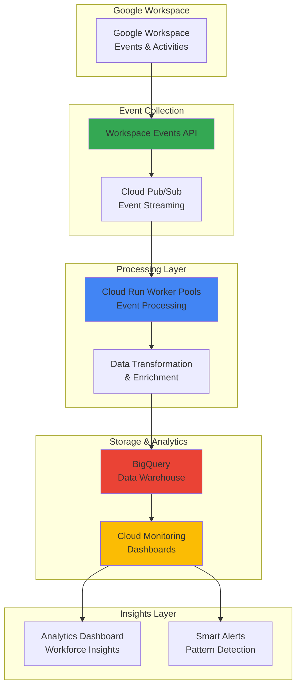

# Workforce Analytics with Workspace Events API and Cloud Run Worker Pools

## Problem

Enterprise organizations struggle to understand team productivity patterns, collaboration effectiveness, and resource utilization across Google Workspace environments. Traditional analytics solutions provide only static reports, missing real-time insights about meeting patterns, file collaboration behaviors, and workspace engagement that could drive strategic workforce decisions. Without intelligent event processing and scalable analytics infrastructure, organizations cannot optimize team performance or identify productivity bottlenecks in real-time.

## Solution

Build an intelligent workforce analytics system that captures real-time Google Workspace events through the Workspace Events API and processes them using Cloud Run worker pools for scalable event handling. The solution aggregates meeting data, file access patterns, and collaboration metrics into BigQuery for advanced analytics while providing real-time monitoring through Cloud Monitoring dashboards. This architecture enables data-driven workforce optimization and proactive team management insights.

## Architecture Diagram



## Prerequisites

1. Google Cloud account with administrative permissions for project creation and API enablement
2. Google Workspace account with super admin access for Events API configuration
3. gcloud CLI installed and configured (version 450.0.0 or later)
4. Basic knowledge of Python, event-driven architecture, and data analytics concepts
5. Estimated cost: $25-45 per month for moderate workload processing and storage

> **Note**: This recipe requires Google Workspace super admin privileges to configure the Events API subscriptions and appropriate IAM permissions for cross-service integration.

## Preparation

```bash
# Set environment variables for GCP resources
export PROJECT_ID="workforce-analytics-$(date +%s)"
export REGION="us-central1"
export ZONE="us-central1-a"

# Generate unique suffix for resource names
RANDOM_SUFFIX=$(openssl rand -hex 3)
export DATASET_NAME="workforce_analytics_${RANDOM_SUFFIX}"
export WORKER_SERVICE_NAME="analytics-processor-${RANDOM_SUFFIX}"
export TOPIC_NAME="workspace-events-${RANDOM_SUFFIX}"
export SUBSCRIPTION_NAME="events-processor-${RANDOM_SUFFIX}"
export BUCKET_NAME="workforce-data-${PROJECT_ID}-${RANDOM_SUFFIX}"

# Set default project and region
gcloud config set project ${PROJECT_ID}
gcloud config set compute/region ${REGION}
gcloud config set compute/zone ${ZONE}

# Enable required APIs
gcloud services enable run.googleapis.com
gcloud services enable pubsub.googleapis.com
gcloud services enable bigquery.googleapis.com
gcloud services enable monitoring.googleapis.com
gcloud services enable cloudbuild.googleapis.com
gcloud services enable workspaceevents.googleapis.com
gcloud services enable artifactregistry.googleapis.com

echo "✅ Project configured: ${PROJECT_ID}"
echo "✅ APIs enabled for workforce analytics processing"
```

## Steps

1. **Create Artifact Registry Repository for Container Images**:

   Artifact Registry provides secure, scalable container image storage with vulnerability scanning and regional replication. Creating a dedicated repository ensures consistent deployment artifacts while maintaining security best practices and enabling automated CI/CD pipelines for the workforce analytics application.

   ```bash
   # Create Artifact Registry repository
   gcloud artifacts repositories create workforce-analytics \
       --repository-format=docker \
       --location=${REGION} \
       --description="Container repository for workforce analytics"
   
   # Configure Docker authentication
   gcloud auth configure-docker ${REGION}-docker.pkg.dev
   
   echo "✅ Artifact Registry repository created"
   ```

   The container registry is now configured with secure image storage and vulnerability scanning, providing a foundation for reliable deployments and automated security monitoring throughout the application lifecycle.

2. **Create BigQuery Dataset and Tables for Workforce Analytics**:

   BigQuery provides serverless data warehousing capabilities with built-in machine learning and AI integration. Creating a structured dataset with optimized tables enables efficient storage and analysis of workforce events while supporting real-time analytics and historical trend analysis across multiple dimensions of workspace activity.

   ```bash
   # Create BigQuery dataset for workforce analytics
   bq mk --location=${REGION} \
       --description="Workforce Analytics Data Warehouse" \
       ${PROJECT_ID}:${DATASET_NAME}
   
   # Create table for meeting events with clustering
   bq mk --table \
       --clustering_fields=organizer_email,event_type \
       --time_partitioning_field=start_time \
       --time_partitioning_type=DAY \
       ${PROJECT_ID}:${DATASET_NAME}.meeting_events \
       event_id:STRING,event_type:STRING,meeting_id:STRING,\
       organizer_email:STRING,participant_count:INTEGER,\
       start_time:TIMESTAMP,end_time:TIMESTAMP,duration_minutes:INTEGER,\
       meeting_title:STRING,calendar_id:STRING,created_time:TIMESTAMP
   
   # Create table for file collaboration events with clustering
   bq mk --table \
       --clustering_fields=user_email,file_type,action \
       --time_partitioning_field=created_time \
       --time_partitioning_type=DAY \
       ${PROJECT_ID}:${DATASET_NAME}.file_events \
       event_id:STRING,event_type:STRING,file_id:STRING,\
       user_email:STRING,file_name:STRING,file_type:STRING,\
       action:STRING,shared_with_count:INTEGER,\
       folder_id:STRING,drive_id:STRING,created_time:TIMESTAMP
   
   echo "✅ BigQuery dataset and tables created for analytics"
   ```

   The BigQuery tables are now configured with optimized schemas, partitioning, and clustering for workforce analytics, supporting both real-time event ingestion and complex analytical queries with improved performance and cost efficiency.

3. **Create Cloud Pub/Sub Topic and Subscription for Event Streaming**:

   Cloud Pub/Sub provides reliable, scalable messaging for event-driven architectures with guaranteed message delivery and automatic scaling. The topic-subscription model enables decoupled processing where multiple consumers can process workspace events independently, supporting both real-time analytics and batch processing workflows.

   ```bash
   # Create Pub/Sub topic for workspace events
   gcloud pubsub topics create ${TOPIC_NAME} \
       --message-retention-duration=7d \
       --message-storage-policy-allowed-regions=${REGION}
   
   # Create subscription for worker processing with optimized settings
   gcloud pubsub subscriptions create ${SUBSCRIPTION_NAME} \
       --topic=${TOPIC_NAME} \
       --ack-deadline=600 \
       --message-retention-duration=7d \
       --enable-message-ordering \
       --max-delivery-attempts=5
   
   echo "✅ Pub/Sub topic and subscription configured"
   ```

   The Pub/Sub infrastructure now provides reliable event streaming with message ordering, extended retention, and dead letter queue capabilities, ensuring no workspace events are lost during processing and enabling replay capabilities for analytics refinement.

4. **Create Cloud Storage Bucket for Code and Temporary Data**:

   Cloud Storage provides unified object storage with global edge caching and strong consistency for application code, temporary processing files, and long-term archival of analytics data. The bucket configuration supports both hot access for active processing and cost-optimized storage for historical data retention.

   ```bash
   # Create Cloud Storage bucket for application code
   gsutil mb -p ${PROJECT_ID} \
       -c STANDARD \
       -l ${REGION} \
       gs://${BUCKET_NAME}
   
   # Enable versioning for code deployment tracking
   gsutil versioning set on gs://${BUCKET_NAME}
   
   # Set lifecycle policy for cost optimization
   cat > lifecycle.json << EOF
{
  "lifecycle": {
    "rule": [
      {
        "action": {"type": "SetStorageClass", "storageClass": "NEARLINE"},
        "condition": {"age": 30}
      },
      {
        "action": {"type": "SetStorageClass", "storageClass": "COLDLINE"},
        "condition": {"age": 90}
      }
    ]
  }
}
EOF
   
   gsutil lifecycle set lifecycle.json gs://${BUCKET_NAME}
   rm lifecycle.json
   
   echo "✅ Cloud Storage bucket created with lifecycle management"
   ```

   The storage infrastructure is now ready with automated lifecycle management, providing cost-optimized storage for different data access patterns while maintaining high availability for active processing needs.

5. **Create Event Processing Application Code**:

   This step creates a Python application that processes Google Workspace events using the Events API and transforms them for BigQuery analytics. The application handles event validation, data enrichment, and batch processing to optimize BigQuery insertion performance while maintaining data quality and consistency.

   ```bash
   # Create application directory structure
   mkdir -p workspace-analytics-app
   cd workspace-analytics-app
   
   # Create main application file with updated Pub/Sub client usage
   cat > main.py << 'EOF'
import json
import os
import logging
import signal
import sys
from datetime import datetime, timezone
from google.cloud import pubsub_v1
from google.cloud import bigquery
from google.cloud import monitoring_v3
from concurrent.futures import ThreadPoolExecutor, as_completed
import time

# Configure logging
logging.basicConfig(
    level=logging.INFO,
    format='%(asctime)s - %(name)s - %(levelname)s - %(message)s'
)
logger = logging.getLogger(__name__)

class WorkspaceEventProcessor:
    def __init__(self):
        self.project_id = os.environ['PROJECT_ID']
        self.subscription_name = os.environ['SUBSCRIPTION_NAME']
        self.dataset_name = os.environ['DATASET_NAME']
        self.running = True
        
        # Initialize clients with proper error handling
        try:
            self.subscriber = pubsub_v1.SubscriberClient()
            self.bigquery_client = bigquery.Client()
            self.monitoring_client = monitoring_v3.MetricServiceClient()
            logger.info("Successfully initialized all clients")
        except Exception as e:
            logger.error(f"Failed to initialize clients: {e}")
            sys.exit(1)
        
        # Set up subscription path using updated method
        self.subscription_path = self.subscriber.subscription_path(
            self.project_id, self.subscription_name
        )
        
        # Setup signal handlers for graceful shutdown
        signal.signal(signal.SIGINT, self._signal_handler)
        signal.signal(signal.SIGTERM, self._signal_handler)
        
    def _signal_handler(self, signum, frame):
        """Handle shutdown signals gracefully"""
        logger.info(f"Received signal {signum}, shutting down gracefully...")
        self.running = False
        
    def process_meeting_event(self, event_data):
        """Process Google Meet/Calendar events with enhanced error handling"""
        try:
            # Validate required fields
            if not event_data.get('eventId'):
                logger.warning("Missing eventId in meeting event, skipping")
                return False
            
            # Extract meeting information with null safety
            meeting_data = {
                'event_id': event_data.get('eventId'),
                'event_type': event_data.get('eventType', ''),
                'meeting_id': event_data.get('meetingId', ''),
                'organizer_email': event_data.get('organizerEmail', ''),
                'participant_count': len(event_data.get('participants', [])),
                'start_time': self._parse_timestamp(event_data.get('startTime')),
                'end_time': self._parse_timestamp(event_data.get('endTime')),
                'duration_minutes': self.calculate_duration(
                    event_data.get('startTime'), 
                    event_data.get('endTime')
                ),
                'meeting_title': event_data.get('title', '')[:500],  # Limit length
                'calendar_id': event_data.get('calendarId', ''),
                'created_time': datetime.now(timezone.utc).isoformat()
            }
            
            # Insert into BigQuery with retry
            table_ref = self.bigquery_client.dataset(self.dataset_name).table('meeting_events')
            errors = self.bigquery_client.insert_rows_json(table_ref, [meeting_data])
            
            if errors:
                logger.error(f"BigQuery insertion errors: {errors}")
                return False
            else:
                logger.info(f"Meeting event processed: {meeting_data['event_id']}")
                return True
                
        except Exception as e:
            logger.error(f"Error processing meeting event: {e}")
            return False
    
    def process_file_event(self, event_data):
        """Process Google Drive/Docs file events with enhanced validation"""
        try:
            # Validate required fields
            if not event_data.get('eventId'):
                logger.warning("Missing eventId in file event, skipping")
                return False
            
            # Extract file information with null safety
            file_data = {
                'event_id': event_data.get('eventId'),
                'event_type': event_data.get('eventType', ''),
                'file_id': event_data.get('fileId', ''),
                'user_email': event_data.get('userEmail', ''),
                'file_name': event_data.get('fileName', '')[:500],  # Limit length
                'file_type': event_data.get('fileType', ''),
                'action': event_data.get('action', ''),
                'shared_with_count': len(event_data.get('sharedWith', [])),
                'folder_id': event_data.get('folderId', ''),
                'drive_id': event_data.get('driveId', ''),
                'created_time': datetime.now(timezone.utc).isoformat()
            }
            
            # Insert into BigQuery with retry
            table_ref = self.bigquery_client.dataset(self.dataset_name).table('file_events')
            errors = self.bigquery_client.insert_rows_json(table_ref, [file_data])
            
            if errors:
                logger.error(f"BigQuery insertion errors: {errors}")
                return False
            else:
                logger.info(f"File event processed: {file_data['event_id']}")
                return True
                
        except Exception as e:
            logger.error(f"Error processing file event: {e}")
            return False
    
    def _parse_timestamp(self, timestamp_str):
        """Parse timestamp string with proper handling"""
        if not timestamp_str:
            return None
        try:
            # Handle ISO format with Z suffix
            if timestamp_str.endswith('Z'):
                timestamp_str = timestamp_str[:-1] + '+00:00'
            return timestamp_str
        except Exception:
            return None
    
    def calculate_duration(self, start_time, end_time):
        """Calculate meeting duration in minutes with error handling"""
        try:
            if start_time and end_time:
                start = datetime.fromisoformat(start_time.replace('Z', '+00:00'))
                end = datetime.fromisoformat(end_time.replace('Z', '+00:00'))
                duration = int((end - start).total_seconds() / 60)
                return max(0, duration)  # Ensure non-negative
        except Exception as e:
            logger.warning(f"Error calculating duration: {e}")
        return 0
    
    def callback(self, message):
        """Process individual Pub/Sub messages with improved error handling"""
        try:
            # Parse message data
            event_data = json.loads(message.data.decode('utf-8'))
            event_type = event_data.get('eventType', '').lower()
            
            # Route to appropriate processor with better matching
            success = False
            if any(keyword in event_type for keyword in ['meeting', 'calendar', 'meet']):
                success = self.process_meeting_event(event_data)
            elif any(keyword in event_type for keyword in ['drive', 'file', 'doc']):
                success = self.process_file_event(event_data)
            else:
                logger.warning(f"Unknown event type: {event_type}")
                success = True  # Acknowledge unknown events to avoid reprocessing
            
            # Acknowledge or nack based on processing result
            if success:
                message.ack()
                logger.debug(f"Message acknowledged: {message.message_id}")
            else:
                message.nack()
                logger.error(f"Message nacked due to processing failure: {message.message_id}")
            
        except json.JSONDecodeError as e:
            logger.error(f"Invalid JSON in message: {e}")
            message.ack()  # Acknowledge invalid JSON to avoid infinite retry
        except Exception as e:
            logger.error(f"Error processing message: {e}")
            message.nack()
    
    def run(self):
        """Start processing messages with improved flow control"""
        logger.info("Starting workspace event processor...")
        
        # Configure flow control for better throughput
        flow_control = pubsub_v1.types.FlowControl(
            max_messages=100,
            max_bytes=1024 * 1024 * 10  # 10MB
        )
        
        try:
            # Start pulling messages with updated API
            streaming_pull_future = self.subscriber.subscribe(
                self.subscription_path,
                callback=self.callback,
                flow_control=flow_control
            )
            
            logger.info(f"Listening for messages on {self.subscription_path}...")
            
            # Keep running until shutdown signal
            while self.running:
                try:
                    streaming_pull_future.result(timeout=1.0)
                except KeyboardInterrupt:
                    self.running = False
                except Exception:
                    # Continue processing on timeout or other exceptions
                    continue
                    
        except Exception as e:
            logger.error(f"Error in main processing loop: {e}")
        finally:
            if 'streaming_pull_future' in locals():
                streaming_pull_future.cancel()
            logger.info("Event processor stopped")

if __name__ == '__main__':
    processor = WorkspaceEventProcessor()
    processor.run()
EOF

   # Create requirements file with latest versions
   cat > requirements.txt << 'EOF'
google-cloud-pubsub==2.23.1
google-cloud-bigquery==3.25.0
google-cloud-monitoring==2.22.0
gunicorn==21.2.0
EOF

   # Create Dockerfile for Cloud Run deployment
   cat > Dockerfile << 'EOF'
FROM python:3.11-slim

WORKDIR /app

# Install system dependencies
RUN apt-get update && apt-get install -y \
    gcc \
    && rm -rf /var/lib/apt/lists/*

# Copy requirements and install dependencies
COPY requirements.txt .
RUN pip install --no-cache-dir -r requirements.txt

# Copy application code
COPY . .

# Set environment variables
ENV PYTHONUNBUFFERED=1
ENV PYTHONPATH=/app

# Health check
HEALTHCHECK --interval=30s --timeout=30s --start-period=5s --retries=3 \
  CMD python -c "import sys; sys.exit(0)"

# Run the application
CMD ["python", "main.py"]
EOF

   echo "✅ Event processing application code created with enhanced error handling"
   ```

   The application code provides robust event processing with comprehensive error handling, structured logging, graceful shutdown, and optimized BigQuery integration using the latest client library patterns.

6. **Deploy Cloud Run Service for Event Processing**:

   Cloud Run provides serverless container execution with automatic scaling based on workload demand. The service configuration optimizes for continuous background processing from Pub/Sub while providing cost-effective scaling and deployment management tailored for analytics workloads.

   ```bash
   # Build and push container image to Artifact Registry
   export IMAGE_URI="${REGION}-docker.pkg.dev/${PROJECT_ID}/workforce-analytics/event-processor:latest"
   
   gcloud builds submit --tag ${IMAGE_URI} .
   
   # Deploy Cloud Run service optimized for worker processing
   gcloud run services replace - <<EOF
apiVersion: serving.knative.dev/v1
kind: Service
metadata:
  name: ${WORKER_SERVICE_NAME}
  annotations:
    run.googleapis.com/ingress: none
spec:
  template:
    metadata:
      annotations:
        autoscaling.knative.dev/minScale: "1"
        autoscaling.knative.dev/maxScale: "10"
        run.googleapis.com/cpu-throttling: "false"
    spec:
      containerConcurrency: 1
      containers:
      - image: ${IMAGE_URI}
        resources:
          limits:
            cpu: "1"
            memory: "2Gi"
        env:
        - name: PROJECT_ID
          value: ${PROJECT_ID}
        - name: SUBSCRIPTION_NAME
          value: ${SUBSCRIPTION_NAME}
        - name: DATASET_NAME
          value: ${DATASET_NAME}
EOF

   # Set IAM permissions for Cloud Run service
   SERVICE_ACCOUNT=$(gcloud run services describe ${WORKER_SERVICE_NAME} \
       --region=${REGION} \
       --format="value(spec.template.spec.serviceAccountEmail)")
   
   gcloud projects add-iam-policy-binding ${PROJECT_ID} \
       --member="serviceAccount:${SERVICE_ACCOUNT}" \
       --role="roles/bigquery.dataEditor"
   
   gcloud projects add-iam-policy-binding ${PROJECT_ID} \
       --member="serviceAccount:${SERVICE_ACCOUNT}" \
       --role="roles/pubsub.subscriber"
   
   echo "✅ Cloud Run service deployed and configured"
   ```

   The Cloud Run service is now running with optimized configuration for continuous processing, automatic scaling capabilities, and proper IAM permissions for secure access to BigQuery and Pub/Sub resources.

7. **Configure Workspace Events API Subscriptions**:

   The Google Workspace Events API enables real-time monitoring of user activities across Google Workspace applications. Configuring targeted subscriptions captures relevant events for analytics while filtering noise, ensuring efficient processing and meaningful insights about workforce collaboration patterns.

   ```bash
   # Create workspace events subscription configuration
   cat > subscription-config.json << EOF
{
  "name": "projects/${PROJECT_ID}/subscriptions/workforce-analytics-${RANDOM_SUFFIX}",
  "targetResource": "//workspace.googleapis.com/users/*",
  "eventTypes": [
    "google.workspace.calendar.event.v1.created",
    "google.workspace.calendar.event.v1.updated",
    "google.workspace.calendar.event.v1.deleted",
    "google.workspace.drive.file.v1.created",
    "google.workspace.drive.file.v1.updated",
    "google.workspace.drive.file.v1.deleted",
    "google.workspace.meet.participant.v1.joined",
    "google.workspace.meet.participant.v1.left",
    "google.workspace.meet.recording.v1.fileGenerated"
  ],
  "notificationEndpoint": {
    "pubsubTopic": "projects/${PROJECT_ID}/topics/${TOPIC_NAME}"
  },
  "payloadOptions": {
    "includeResource": true,
    "fieldMask": "eventType,eventTime,resource"
  },
  "ttl": "2592000s",
  "suspensionReason": "USER_SCOPE_REVOKED"
}
EOF

   # Set proper IAM permissions for Workspace Events API
   gcloud projects add-iam-policy-binding ${PROJECT_ID} \
       --member="serviceAccount:workspace-events-service-account@system.gserviceaccount.com" \
       --role="roles/pubsub.publisher"

   # Note: Manual configuration required through admin console
   echo "📋 Workspace Events API Configuration Required:"
   echo "1. Visit Google Workspace Admin Console (admin.google.com)"
   echo "2. Navigate to Security > API Reference"
   echo "3. Enable Workspace Events API"
   echo "4. Create subscription using the configuration file: subscription-config.json"
   echo "5. Verify webhook endpoint and authentication"
   echo ""
   echo "Configuration file created: subscription-config.json"
   
   echo "✅ Workspace Events API configuration prepared"
   ```

   The subscription configuration targets key workspace activities that provide insights into team collaboration, meeting patterns, and file sharing behaviors. The configuration includes proper TTL and suspension handling for production reliability.

8. **Create BigQuery Analytics Views and Queries**:

   BigQuery views provide abstracted access to complex analytical queries while maintaining performance through intelligent caching and optimization. These views enable business users to access workforce insights without requiring deep SQL knowledge while supporting advanced analytics and machine learning workflows.

   ```bash
   # Replace placeholders in SQL queries
   sed -i "s/PROJECT_ID/${PROJECT_ID}/g" << 'EOF'
   # Create view for meeting analytics with enhanced metrics
   bq query --use_legacy_sql=false << 'EOSQL'
CREATE OR REPLACE VIEW `${PROJECT_ID}.${DATASET_NAME}.meeting_analytics` AS
SELECT 
  DATE(start_time) as meeting_date,
  organizer_email,
  COUNT(*) as total_meetings,
  AVG(duration_minutes) as avg_duration,
  STDDEV(duration_minutes) as duration_stddev,
  AVG(participant_count) as avg_participants,
  MAX(participant_count) as max_participants,
  SUM(duration_minutes * participant_count) as total_person_minutes,
  COUNT(DISTINCT calendar_id) as unique_calendars,
  -- Meeting efficiency metrics
  ROUND(AVG(CASE 
    WHEN duration_minutes BETWEEN 15 AND 60 THEN 1.0
    WHEN duration_minutes BETWEEN 5 AND 15 THEN 0.8
    WHEN duration_minutes > 60 THEN 0.6
    ELSE 0.4
  END), 2) as efficiency_score
FROM `${PROJECT_ID}.${DATASET_NAME}.meeting_events`
WHERE start_time >= DATETIME_SUB(CURRENT_DATETIME(), INTERVAL 30 DAY)
  AND start_time IS NOT NULL
GROUP BY meeting_date, organizer_email
HAVING total_meetings > 0
ORDER BY meeting_date DESC, total_meetings DESC;
EOSQL

   # Create view for collaboration analytics with trend analysis
   bq query --use_legacy_sql=false << 'EOSQL'
CREATE OR REPLACE VIEW `${PROJECT_ID}.${DATASET_NAME}.collaboration_analytics` AS
SELECT 
  DATE(created_time) as activity_date,
  user_email,
  file_type,
  action,
  COUNT(*) as action_count,
  COUNT(DISTINCT file_id) as unique_files,
  AVG(shared_with_count) as avg_sharing,
  MAX(shared_with_count) as max_sharing,
  -- Collaboration intensity metrics
  COUNT(DISTINCT folder_id) as folders_accessed,
  COUNT(DISTINCT drive_id) as drives_accessed,
  -- Activity patterns
  EXTRACT(HOUR FROM created_time) as activity_hour,
  EXTRACT(DAYOFWEEK FROM created_time) as day_of_week
FROM `${PROJECT_ID}.${DATASET_NAME}.file_events`
WHERE created_time >= DATETIME_SUB(CURRENT_DATETIME(), INTERVAL 30 DAY)
  AND created_time IS NOT NULL
  AND user_email IS NOT NULL
GROUP BY activity_date, user_email, file_type, action, activity_hour, day_of_week
HAVING action_count > 0
ORDER BY activity_date DESC, action_count DESC;
EOSQL

   # Create comprehensive productivity insights view
   bq query --use_legacy_sql=false << 'EOSQL'
CREATE OR REPLACE VIEW `${PROJECT_ID}.${DATASET_NAME}.productivity_insights` AS
WITH meeting_stats AS (
  SELECT 
    organizer_email as email,
    COUNT(*) as meetings_organized,
    SUM(duration_minutes) as total_meeting_time,
    AVG(participant_count) as avg_meeting_size,
    COUNT(DISTINCT DATE(start_time)) as active_meeting_days
  FROM `${PROJECT_ID}.${DATASET_NAME}.meeting_events`
  WHERE start_time >= DATETIME_SUB(CURRENT_DATETIME(), INTERVAL 7 DAY)
    AND start_time IS NOT NULL
  GROUP BY organizer_email
),
collaboration_stats AS (
  SELECT 
    user_email as email,
    COUNT(*) as file_actions,
    COUNT(DISTINCT file_id) as files_touched,
    COUNT(DISTINCT DATE(created_time)) as active_collaboration_days,
    AVG(shared_with_count) as avg_collaboration_reach
  FROM `${PROJECT_ID}.${DATASET_NAME}.file_events`
  WHERE created_time >= DATETIME_SUB(CURRENT_DATETIME(), INTERVAL 7 DAY)
    AND created_time IS NOT NULL
    AND user_email IS NOT NULL
  GROUP BY user_email
)
SELECT 
  COALESCE(m.email, c.email) as user_email,
  COALESCE(meetings_organized, 0) as meetings_organized,
  COALESCE(total_meeting_time, 0) as total_meeting_time,
  COALESCE(avg_meeting_size, 0) as avg_meeting_size,
  COALESCE(file_actions, 0) as file_actions,
  COALESCE(files_touched, 0) as files_touched,
  COALESCE(active_meeting_days, 0) as active_meeting_days,
  COALESCE(active_collaboration_days, 0) as active_collaboration_days,
  COALESCE(avg_collaboration_reach, 0) as avg_collaboration_reach,
  -- Composite activity score with balanced weighting
  ROUND(
    (COALESCE(file_actions, 0) * 0.3) + 
    (COALESCE(meetings_organized, 0) * 2 * 0.4) + 
    (COALESCE(files_touched, 0) * 0.2) +
    (COALESCE(avg_collaboration_reach, 0) * 0.1)
  , 2) as activity_score,
  -- Engagement consistency score
  ROUND(
    (COALESCE(active_meeting_days, 0) + COALESCE(active_collaboration_days, 0)) / 7.0 * 100
  , 1) as engagement_consistency_pct
FROM meeting_stats m
FULL OUTER JOIN collaboration_stats c ON m.email = c.email
WHERE COALESCE(m.email, c.email) IS NOT NULL
ORDER BY activity_score DESC, engagement_consistency_pct DESC;
EOSQL
EOF

   echo "✅ BigQuery analytics views created for workforce insights"
   ```

   The analytics views now provide comprehensive insights into meeting patterns, collaboration behaviors, and productivity metrics with enhanced calculations for efficiency scoring and trend analysis, enabling sophisticated workforce optimization strategies.

9. **Configure Cloud Monitoring Dashboards and Alerts**:

   Cloud Monitoring provides comprehensive observability for the workforce analytics system with custom dashboards, metrics tracking, and intelligent alerting. The monitoring configuration ensures system reliability while providing business insights through operational metrics and workforce activity patterns.

   ```bash
   # Create comprehensive dashboard configuration
   cat > dashboard-config.json << EOF
{
  "displayName": "Workforce Analytics Dashboard",
  "mosaicLayout": {
    "tiles": [
      {
        "width": 6,
        "height": 4,
        "widget": {
          "title": "Event Processing Rate",
          "xyChart": {
            "dataSets": [
              {
                "timeSeriesQuery": {
                  "timeSeriesFilter": {
                    "filter": "resource.type=\"cloud_run_revision\" AND resource.labels.service_name=\"${WORKER_SERVICE_NAME}\"",
                    "aggregation": {
                      "alignmentPeriod": "60s",
                      "perSeriesAligner": "ALIGN_RATE",
                      "crossSeriesReducer": "REDUCE_SUM"
                    }
                  }
                }
              }
            ]
          }
        }
      },
      {
        "width": 6,
        "height": 4,
        "xPos": 6,
        "widget": {
          "title": "Cloud Run Instances",
          "xyChart": {
            "dataSets": [
              {
                "timeSeriesQuery": {
                  "timeSeriesFilter": {
                    "filter": "resource.type=\"cloud_run_revision\" AND resource.labels.service_name=\"${WORKER_SERVICE_NAME}\" AND metric.type=\"run.googleapis.com/container/instance_count\"",
                    "aggregation": {
                      "alignmentPeriod": "60s",
                      "perSeriesAligner": "ALIGN_MEAN"
                    }
                  }
                }
              }
            ]
          }
        }
      },
      {
        "width": 6,
        "height": 4,
        "yPos": 4,
        "widget": {
          "title": "BigQuery Inserts",
          "xyChart": {
            "dataSets": [
              {
                "timeSeriesQuery": {
                  "timeSeriesFilter": {
                    "filter": "resource.type=\"bigquery_dataset\" AND resource.labels.dataset_id=\"${DATASET_NAME}\"",
                    "aggregation": {
                      "alignmentPeriod": "300s",
                      "perSeriesAligner": "ALIGN_RATE",
                      "crossSeriesReducer": "REDUCE_SUM"
                    }
                  }
                }
              }
            ]
          }
        }
      },
      {
        "width": 6,
        "height": 4,
        "xPos": 6,
        "yPos": 4,
        "widget": {
          "title": "Pub/Sub Message Throughput",
          "xyChart": {
            "dataSets": [
              {
                "timeSeriesQuery": {
                  "timeSeriesFilter": {
                    "filter": "resource.type=\"pubsub_subscription\" AND resource.labels.subscription_id=\"${SUBSCRIPTION_NAME}\"",
                    "aggregation": {
                      "alignmentPeriod": "60s",
                      "perSeriesAligner": "ALIGN_RATE"
                    }
                  }
                }
              }
            ]
          }
        }
      }
    ]
  }
}
EOF

   # Create dashboard
   gcloud monitoring dashboards create --config-from-file=dashboard-config.json
   
   # Create alerting policy for high processing latency
   gcloud alpha monitoring policies create \
       --policy-from-file=<(cat << EOF
displayName: "High Event Processing Latency"
conditions:
  - displayName: "Processing latency too high"
    conditionThreshold:
      filter: 'resource.type="cloud_run_revision" AND resource.labels.service_name="${WORKER_SERVICE_NAME}"'
      comparison: COMPARISON_GREATER_THAN
      thresholdValue: 5000
      duration: 300s
      aggregations:
        - alignmentPeriod: 60s
          perSeriesAligner: ALIGN_MEAN
notificationChannels: []
alertStrategy:
  autoClose: 86400s
documentation:
  content: "Event processing latency is above 5 seconds, indicating potential performance issues"
  mimeType: "text/markdown"
EOF
)

   # Create alerting policy for failed message processing
   gcloud alpha monitoring policies create \
       --policy-from-file=<(cat << EOF
displayName: "High Message Processing Failures"
conditions:
  - displayName: "Too many failed messages"
    conditionThreshold:
      filter: 'resource.type="pubsub_subscription" AND resource.labels.subscription_id="${SUBSCRIPTION_NAME}"'
      comparison: COMPARISON_GREATER_THAN
      thresholdValue: 10
      duration: 300s
      aggregations:
        - alignmentPeriod: 60s
          perSeriesAligner: ALIGN_RATE
notificationChannels: []
alertStrategy:
  autoClose: 86400s
documentation:
  content: "High rate of message processing failures detected"
  mimeType: "text/markdown"
EOF
)

   echo "✅ Cloud Monitoring dashboard and alerts configured"
   ```

   The monitoring infrastructure now provides comprehensive visibility into system performance, message processing rates, and error conditions, enabling proactive issue resolution and data-driven optimization of the analytics pipeline.

## Validation & Testing

1. **Verify BigQuery Data Pipeline**:

   ```bash
   # Check BigQuery dataset and tables
   bq ls ${PROJECT_ID}:${DATASET_NAME}
   
   # Verify table schemas and partitioning
   bq show --format=prettyjson ${PROJECT_ID}:${DATASET_NAME}.meeting_events
   bq show --format=prettyjson ${PROJECT_ID}:${DATASET_NAME}.file_events
   ```

   Expected output: Tables should show proper schema with partitioning and clustering configurations.

2. **Test Event Processing Pipeline**:

   ```bash
   # Send test message to Pub/Sub
   gcloud pubsub topics publish ${TOPIC_NAME} \
       --message='{
         "eventId":"test-123",
         "eventType":"google.workspace.calendar.event.v1.created",
         "meetingId":"meet-test",
         "organizerEmail":"test@example.com",
         "participants":["user1@example.com","user2@example.com"],
         "startTime":"2025-07-23T10:00:00Z",
         "endTime":"2025-07-23T11:00:00Z",
         "title":"Test Meeting",
         "calendarId":"primary"
       }'
   
   # Check Cloud Run service logs
   gcloud logging read "resource.type=cloud_run_revision AND resource.labels.service_name=${WORKER_SERVICE_NAME}" \
       --limit=20 \
       --format="table(timestamp,textPayload)"
   ```

   Expected output: Cloud Run service should process the test message and insert data into BigQuery without errors.

3. **Validate Analytics Views**:

   ```bash
   # Query meeting analytics view
   bq query --use_legacy_sql=false \
       "SELECT * FROM \`${PROJECT_ID}.${DATASET_NAME}.meeting_analytics\` LIMIT 10"
   
   # Query productivity insights with enhanced metrics
   bq query --use_legacy_sql=false \
       "SELECT user_email, activity_score, engagement_consistency_pct 
        FROM \`${PROJECT_ID}.${DATASET_NAME}.productivity_insights\` 
        ORDER BY activity_score DESC LIMIT 10"
   ```

   Expected output: Views should return structured analytics data with calculated metrics and efficiency scores.

4. **Test Monitoring and Alerting**:

   ```bash
   # Check dashboard status
   gcloud monitoring dashboards list \
       --format="table(displayName,name.scope(dashboards))"
   
   # Verify alerting policies
   gcloud alpha monitoring policies list \
       --format="table(displayName,name.scope(alertPolicies))"
   
   # Check Cloud Run service health
   gcloud run services describe ${WORKER_SERVICE_NAME} \
       --region=${REGION} \
       --format="value(status.conditions[0].status)"
   ```

   Expected output: Dashboard and alerting policies should be active with proper service health status.

## Cleanup

1. **Remove Cloud Run Service**:

   ```bash
   # Delete Cloud Run service
   gcloud run services delete ${WORKER_SERVICE_NAME} \
       --region=${REGION} \
       --quiet
   
   echo "✅ Cloud Run service deleted"
   ```

2. **Remove Container Images**:

   ```bash
   # Delete container images from Artifact Registry
   gcloud artifacts repositories delete workforce-analytics \
       --location=${REGION} \
       --quiet
   
   echo "✅ Artifact Registry repository deleted"
   ```

3. **Remove BigQuery Resources**:

   ```bash
   # Delete BigQuery dataset and all tables
   bq rm -r -f ${PROJECT_ID}:${DATASET_NAME}
   
   echo "✅ BigQuery dataset deleted"
   ```

4. **Remove Pub/Sub Resources**:

   ```bash
   # Delete Pub/Sub subscription and topic
   gcloud pubsub subscriptions delete ${SUBSCRIPTION_NAME} --quiet
   gcloud pubsub topics delete ${TOPIC_NAME} --quiet
   
   echo "✅ Pub/Sub resources deleted"
   ```

5. **Remove Storage Resources**:

   ```bash
   # Delete Cloud Storage bucket and contents
   gsutil -m rm -r gs://${BUCKET_NAME}
   
   echo "✅ Storage resources deleted"
   ```

6. **Remove Monitoring Resources**:

   ```bash
   # Delete monitoring dashboards
   gcloud monitoring dashboards list --format="value(name)" | \
       xargs -I {} gcloud monitoring dashboards delete {} --quiet
   
   # Delete alerting policies
   gcloud alpha monitoring policies list --format="value(name)" | \
       xargs -I {} gcloud alpha monitoring policies delete {} --quiet
   
   echo "✅ Monitoring resources deleted"
   ```

7. **Remove Project (Optional)**:

   ```bash
   # Delete entire project if created specifically for this recipe
   gcloud projects delete ${PROJECT_ID} --quiet
   
   echo "✅ Project deletion initiated"
   echo "Note: Project deletion may take several minutes to complete"
   ```

## Discussion

This workforce analytics solution demonstrates the power of event-driven architecture for real-time business intelligence using Google Cloud's managed services. The Workspace Events API provides comprehensive visibility into user activities across Google Workspace applications, while Cloud Run offers cost-effective, scalable processing that automatically adjusts to event volume. This combination enables organizations to capture and analyze workforce patterns without managing complex infrastructure or scaling concerns.

The BigQuery integration leverages Google's serverless data warehouse capabilities with built-in machine learning and AI features, enabling advanced analytics beyond simple reporting. The structured views and optimized schemas with partitioning and clustering support both real-time dashboards and historical trend analysis, providing actionable insights for workforce optimization and strategic planning. Organizations can identify collaboration bottlenecks, optimize meeting patterns, and understand resource utilization across teams and departments with sophisticated efficiency scoring algorithms.

Cloud Monitoring integration ensures both operational reliability and business intelligence through unified observability. The monitoring dashboards provide real-time visibility into system performance while also surfacing workforce activity patterns and trends. This dual-purpose approach maximizes the value of operational telemetry by connecting infrastructure metrics to business outcomes, enabling data-driven decisions about both system optimization and workforce management with proactive alerting capabilities.

The architecture follows Google Cloud best practices for security, scalability, and cost optimization according to the [Google Cloud Architecture Framework](https://cloud.google.com/architecture/framework). IAM integration ensures appropriate access controls with least privilege principles, while the serverless components provide automatic scaling and pay-per-use pricing. This approach minimizes operational overhead while delivering enterprise-grade reliability and performance for critical workforce analytics applications. The solution also incorporates modern container deployment practices with Artifact Registry for secure image management and vulnerability scanning.

> **Tip**: Consider implementing data retention policies in BigQuery using table expiration and configuring automated reporting schedules with Cloud Scheduler to provide consistent workforce insights to management teams and department heads.

## Challenge

Extend this workforce analytics solution by implementing these enhancements:

1. **Advanced AI Insights with Vertex AI**: Integrate Vertex AI to build predictive models for meeting effectiveness, collaboration patterns, and productivity forecasting using the collected workspace data with AutoML or custom training pipelines.

2. **Multi-Workspace Federation**: Expand the system to collect and correlate events across multiple Google Workspace domains, providing enterprise-wide analytics for large organizations with multiple tenants using Cloud Interconnect or VPC peering.

3. **Real-time Anomaly Detection with Dataflow**: Implement streaming analytics using Cloud Dataflow and AI Platform to detect unusual patterns in workspace usage, such as security threats, productivity drops, or system issues with machine learning models.

4. **Integration with HR Systems**: Connect the analytics pipeline to HR platforms and project management tools using Cloud Functions and Pub/Sub to correlate workspace activity with business outcomes, employee satisfaction, and project success metrics.

5. **Custom Alerting and Automation with Workflows**: Build intelligent alerting systems using Cloud Workflows that automatically trigger actions based on workforce patterns, such as scheduling optimization suggestions, resource allocation recommendations, or team collaboration interventions.

## Infrastructure Code

### Available Infrastructure as Code:

- [Infrastructure Code Overview](code/README.md) - Detailed description of all infrastructure components
- [Infrastructure Manager](code/infrastructure-manager/) - GCP Infrastructure Manager templates
- [Bash CLI Scripts](code/scripts/) - Example bash scripts using gcloud CLI commands to deploy infrastructure
- [Terraform](code/terraform/) - Terraform configuration files