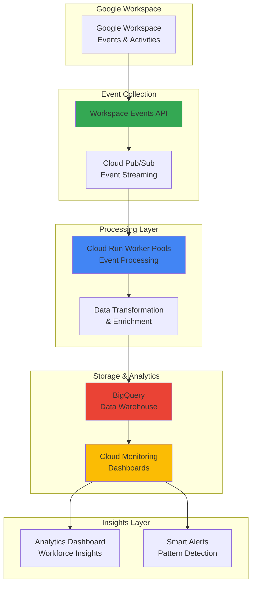

# Workforce Analytics with Workspace Events API and Cloud Run Worker Pools

## Problem

Enterprise organizations struggle to understand team productivity patterns, collaboration effectiveness, and resource utilization across Google Workspace environments. Traditional analytics solutions provide only static reports, missing real-time insights about meeting patterns, file collaboration behaviors, and workspace engagement that could drive strategic workforce decisions. Without intelligent event processing and scalable analytics infrastructure, organizations cannot optimize team performance or identify productivity bottlenecks in real-time.

## Solution

Build an intelligent workforce analytics system that captures real-time Google Workspace events through the Workspace Events API and processes them using Cloud Run Worker Pools for scalable event handling. The solution aggregates meeting data, file access patterns, and collaboration metrics into BigQuery for advanced analytics while providing real-time monitoring through Cloud Monitoring dashboards. This architecture enables data-driven workforce optimization and proactive team management insights.

## Architecture Diagram



## Prerequisites

1. Google Cloud account with administrative permissions for project creation and API enablement
2. Google Workspace account with admin access for Events API configuration
3. gcloud CLI installed and configured (version 400.0.0 or later)
4. Basic knowledge of Python, event-driven architecture, and data analytics concepts
5. Estimated cost: $15-25 per month for moderate workload processing and storage

> **Note**: This recipe requires Google Workspace admin privileges to configure the Events API subscriptions and appropriate IAM permissions for cross-service integration.

## Preparation

```bash
# Set environment variables for GCP resources
export PROJECT_ID="workforce-analytics-$(date +%s)"
export REGION="us-central1"
export ZONE="us-central1-a"

# Generate unique suffix for resource names
RANDOM_SUFFIX=$(openssl rand -hex 3)
export DATASET_NAME="workforce_analytics_${RANDOM_SUFFIX}"
export WORKER_POOL_NAME="analytics-processor-${RANDOM_SUFFIX}"
export TOPIC_NAME="workspace-events-${RANDOM_SUFFIX}"
export SUBSCRIPTION_NAME="events-processor-${RANDOM_SUFFIX}"
export BUCKET_NAME="workforce-data-${PROJECT_ID}-${RANDOM_SUFFIX}"

# Set default project and region
gcloud config set project ${PROJECT_ID}
gcloud config set compute/region ${REGION}
gcloud config set compute/zone ${ZONE}

# Enable required APIs
gcloud services enable run.googleapis.com
gcloud services enable pubsub.googleapis.com
gcloud services enable bigquery.googleapis.com
gcloud services enable monitoring.googleapis.com
gcloud services enable cloudbuild.googleapis.com
gcloud services enable workspaceevents.googleapis.com

echo "✅ Project configured: ${PROJECT_ID}"
echo "✅ APIs enabled for workforce analytics processing"
```

## Steps

1. **Create BigQuery Dataset and Tables for Workforce Analytics**:

   BigQuery provides serverless data warehousing capabilities with built-in machine learning and AI integration. Creating a structured dataset with optimized tables enables efficient storage and analysis of workforce events while supporting real-time analytics and historical trend analysis across multiple dimensions of workspace activity.

   ```bash
   # Create BigQuery dataset for workforce analytics
   bq mk --location=${REGION} \
       --description="Workforce Analytics Data Warehouse" \
       ${PROJECT_ID}:${DATASET_NAME}
   
   # Create table for meeting events
   bq mk --table \
       ${PROJECT_ID}:${DATASET_NAME}.meeting_events \
       event_id:STRING,event_type:STRING,meeting_id:STRING,\
       organizer_email:STRING,participant_count:INTEGER,\
       start_time:TIMESTAMP,end_time:TIMESTAMP,duration_minutes:INTEGER,\
       meeting_title:STRING,calendar_id:STRING,created_time:TIMESTAMP
   
   # Create table for file collaboration events
   bq mk --table \
       ${PROJECT_ID}:${DATASET_NAME}.file_events \
       event_id:STRING,event_type:STRING,file_id:STRING,\
       user_email:STRING,file_name:STRING,file_type:STRING,\
       action:STRING,shared_with_count:INTEGER,\
       folder_id:STRING,drive_id:STRING,created_time:TIMESTAMP
   
   echo "✅ BigQuery dataset and tables created for analytics"
   ```

   The BigQuery tables are now configured with optimized schemas for workforce analytics, supporting both real-time event ingestion and complex analytical queries. This foundation enables advanced analytics including productivity patterns, collaboration metrics, and resource utilization insights.

2. **Create Cloud Pub/Sub Topic and Subscription for Event Streaming**:

   Cloud Pub/Sub provides reliable, scalable messaging for event-driven architectures with guaranteed message delivery and automatic scaling. The topic-subscription model enables decoupled processing where multiple consumers can process workspace events independently, supporting both real-time analytics and batch processing workflows.

   ```bash
   # Create Pub/Sub topic for workspace events
   gcloud pubsub topics create ${TOPIC_NAME} \
       --message-retention-duration=7d \
       --message-storage-policy-allowed-regions=${REGION}
   
   # Create subscription for worker pool processing
   gcloud pubsub subscriptions create ${SUBSCRIPTION_NAME} \
       --topic=${TOPIC_NAME} \
       --ack-deadline=600 \
       --message-retention-duration=7d \
       --enable-message-ordering
   
   # Set appropriate IAM permissions for service account
   gcloud projects add-iam-policy-binding ${PROJECT_ID} \
       --member="serviceAccount:${PROJECT_ID}@appspot.gserviceaccount.com" \
       --role="roles/pubsub.subscriber"
   
   echo "✅ Pub/Sub topic and subscription configured"
   ```

   The Pub/Sub infrastructure now provides reliable event streaming with message ordering and extended retention, ensuring no workspace events are lost during processing and enabling replay capabilities for analytics refinement.

3. **Create Cloud Storage Bucket for Code and Temporary Data**:

   Cloud Storage provides unified object storage with global edge caching and strong consistency for application code, temporary processing files, and long-term archival of analytics data. The bucket configuration supports both hot access for active processing and cost-optimized storage for historical data retention.

   ```bash
   # Create Cloud Storage bucket for application code
   gsutil mb -p ${PROJECT_ID} \
       -c STANDARD \
       -l ${REGION} \
       gs://${BUCKET_NAME}
   
   # Enable versioning for code deployment tracking
   gsutil versioning set on gs://${BUCKET_NAME}
   
   # Create directories for organized storage
   echo "Creating storage structure..." | gsutil cp - gs://${BUCKET_NAME}/code/
   echo "Creating temp directory..." | gsutil cp - gs://${BUCKET_NAME}/temp/
   echo "Creating archive directory..." | gsutil cp - gs://${BUCKET_NAME}/archive/
   
   echo "✅ Cloud Storage bucket created with organized structure"
   ```

   The storage infrastructure is now ready to support code deployment, temporary processing files, and archived analytics data, providing a complete data lifecycle management solution for the workforce analytics system.

4. **Create Event Processing Application Code**:

   This step creates a Python application that processes Google Workspace events using the Events API and transforms them for BigQuery analytics. The application handles event validation, data enrichment, and batch processing to optimize BigQuery insertion performance while maintaining data quality and consistency.

   ```bash
   # Create application directory structure
   mkdir -p workspace-analytics-app
   cd workspace-analytics-app
   
   # Create main application file
   cat > main.py << 'EOF'
import json
import os
import logging
from datetime import datetime, timezone
from google.cloud import pubsub_v1
from google.cloud import bigquery
from google.cloud import monitoring_v3
from concurrent.futures import ThreadPoolExecutor
import time

# Configure logging
logging.basicConfig(level=logging.INFO)
logger = logging.getLogger(__name__)

class WorkspaceEventProcessor:
    def __init__(self):
        self.project_id = os.environ['PROJECT_ID']
        self.subscription_name = os.environ['SUBSCRIPTION_NAME']
        self.dataset_name = os.environ['DATASET_NAME']
        
        # Initialize clients
        self.subscriber = pubsub_v1.SubscriberClient()
        self.bigquery_client = bigquery.Client()
        self.monitoring_client = monitoring_v3.MetricServiceClient()
        
        # Set up subscription path
        self.subscription_path = self.subscriber.subscription_path(
            self.project_id, self.subscription_name
        )
        
    def process_meeting_event(self, event_data):
        """Process Google Meet/Calendar events"""
        try:
            # Extract meeting information
            meeting_data = {
                'event_id': event_data.get('eventId'),
                'event_type': event_data.get('eventType'),
                'meeting_id': event_data.get('meetingId'),
                'organizer_email': event_data.get('organizerEmail'),
                'participant_count': len(event_data.get('participants', [])),
                'start_time': event_data.get('startTime'),
                'end_time': event_data.get('endTime'),
                'duration_minutes': self.calculate_duration(
                    event_data.get('startTime'), 
                    event_data.get('endTime')
                ),
                'meeting_title': event_data.get('title', ''),
                'calendar_id': event_data.get('calendarId'),
                'created_time': datetime.now(timezone.utc).isoformat()
            }
            
            # Insert into BigQuery
            table_ref = self.bigquery_client.dataset(self.dataset_name).table('meeting_events')
            errors = self.bigquery_client.insert_rows_json(table_ref, [meeting_data])
            
            if errors:
                logger.error(f"BigQuery insertion errors: {errors}")
            else:
                logger.info(f"Meeting event processed: {meeting_data['event_id']}")
                
        except Exception as e:
            logger.error(f"Error processing meeting event: {e}")
    
    def process_file_event(self, event_data):
        """Process Google Drive/Docs file events"""
        try:
            # Extract file information
            file_data = {
                'event_id': event_data.get('eventId'),
                'event_type': event_data.get('eventType'),
                'file_id': event_data.get('fileId'),
                'user_email': event_data.get('userEmail'),
                'file_name': event_data.get('fileName'),
                'file_type': event_data.get('fileType'),
                'action': event_data.get('action'),
                'shared_with_count': len(event_data.get('sharedWith', [])),
                'folder_id': event_data.get('folderId'),
                'drive_id': event_data.get('driveId'),
                'created_time': datetime.now(timezone.utc).isoformat()
            }
            
            # Insert into BigQuery
            table_ref = self.bigquery_client.dataset(self.dataset_name).table('file_events')
            errors = self.bigquery_client.insert_rows_json(table_ref, [file_data])
            
            if errors:
                logger.error(f"BigQuery insertion errors: {errors}")
            else:
                logger.info(f"File event processed: {file_data['event_id']}")
                
        except Exception as e:
            logger.error(f"Error processing file event: {e}")
    
    def calculate_duration(self, start_time, end_time):
        """Calculate meeting duration in minutes"""
        try:
            if start_time and end_time:
                start = datetime.fromisoformat(start_time.replace('Z', '+00:00'))
                end = datetime.fromisoformat(end_time.replace('Z', '+00:00'))
                return int((end - start).total_seconds() / 60)
        except:
            pass
        return 0
    
    def callback(self, message):
        """Process individual Pub/Sub messages"""
        try:
            # Parse message data
            event_data = json.loads(message.data.decode('utf-8'))
            event_type = event_data.get('eventType', '')
            
            # Route to appropriate processor
            if 'meeting' in event_type.lower() or 'calendar' in event_type.lower():
                self.process_meeting_event(event_data)
            elif 'drive' in event_type.lower() or 'file' in event_type.lower():
                self.process_file_event(event_data)
            else:
                logger.warning(f"Unknown event type: {event_type}")
            
            # Acknowledge message
            message.ack()
            logger.info(f"Message processed and acknowledged: {message.message_id}")
            
        except Exception as e:
            logger.error(f"Error processing message: {e}")
            message.nack()
    
    def run(self):
        """Start processing messages"""
        logger.info("Starting workspace event processor...")
        
        # Configure flow control
        flow_control = pubsub_v1.types.FlowControl(max_messages=100)
        
        # Start pulling messages
        streaming_pull_future = self.subscriber.pull(
            request={"subscription": self.subscription_path, "max_messages": 10},
            callback=self.callback,
            flow_control=flow_control
        )
        
        logger.info(f"Listening for messages on {self.subscription_path}...")
        
        try:
            streaming_pull_future.result()
        except KeyboardInterrupt:
            streaming_pull_future.cancel()
            logger.info("Event processor stopped")

if __name__ == '__main__':
    processor = WorkspaceEventProcessor()
    processor.run()
EOF

   # Create requirements file
   cat > requirements.txt << 'EOF'
google-cloud-pubsub==2.18.4
google-cloud-bigquery==3.11.4
google-cloud-monitoring==2.15.1
google-apps-events-subscriptions==0.1.0
EOF

   # Create Dockerfile for Cloud Run deployment
   cat > Dockerfile << 'EOF'
FROM python:3.11-slim

WORKDIR /app

# Copy requirements and install dependencies
COPY requirements.txt .
RUN pip install --no-cache-dir -r requirements.txt

# Copy application code
COPY . .

# Set environment variables
ENV PORT=8080
ENV PYTHONUNBUFFERED=1

# Run the application
CMD ["python", "main.py"]
EOF

   echo "✅ Event processing application code created"
   ```

   The application code provides robust event processing with error handling, structured logging, and optimized BigQuery integration. This foundation supports real-time analytics while maintaining data quality and processing reliability.

5. **Deploy Cloud Run Worker Pool for Event Processing**:

   Cloud Run Worker Pools provide purpose-built infrastructure for continuous background processing with automatic scaling based on workload demand. The worker pool configuration optimizes for pull-based event processing from Pub/Sub while providing cost-effective scaling and deployment management tailored for analytics workloads.

   ```bash
   # Build container image using Cloud Build
   gcloud builds submit --tag gcr.io/${PROJECT_ID}/workspace-analytics .
   
   # Deploy Cloud Run Worker Pool
   gcloud beta run worker-pools create ${WORKER_POOL_NAME} \
       --image=gcr.io/${PROJECT_ID}/workspace-analytics \
       --region=${REGION} \
       --min-instances=1 \
       --max-instances=10 \
       --memory=1Gi \
       --cpu=1 \
       --env-vars=PROJECT_ID=${PROJECT_ID},SUBSCRIPTION_NAME=${SUBSCRIPTION_NAME},DATASET_NAME=${DATASET_NAME}
   
   # Set IAM permissions for worker pool
   gcloud projects add-iam-policy-binding ${PROJECT_ID} \
       --member="serviceAccount:$(gcloud beta run worker-pools describe ${WORKER_POOL_NAME} --region=${REGION} --format='value(spec.template.spec.serviceAccountName)')" \
       --role="roles/bigquery.dataEditor"
   
   gcloud projects add-iam-policy-binding ${PROJECT_ID} \
       --member="serviceAccount:$(gcloud beta run worker-pools describe ${WORKER_POOL_NAME} --region=${REGION} --format='value(spec.template.spec.serviceAccountName)')" \
       --role="roles/pubsub.subscriber"
   
   echo "✅ Cloud Run Worker Pool deployed and configured"
   ```

   The worker pool is now running with automatic scaling capabilities, processing workspace events in real-time and inserting structured data into BigQuery for analytics. The container-based deployment ensures consistent processing environments and easy updates.

6. **Configure Workspace Events API Subscriptions**:

   The Google Workspace Events API enables real-time monitoring of user activities across Google Workspace applications. Configuring targeted subscriptions captures relevant events for analytics while filtering noise, ensuring efficient processing and meaningful insights about workforce collaboration patterns.

   ```bash
   # Create workspace events subscription configuration
   cat > subscription-config.json << EOF
{
  "name": "projects/${PROJECT_ID}/subscriptions/workforce-analytics",
  "targetResource": "//workspace.googleapis.com/users/*",
  "eventTypes": [
    "google.workspace.calendar.event.v1.created",
    "google.workspace.calendar.event.v1.updated",
    "google.workspace.drive.file.v1.created",
    "google.workspace.drive.file.v1.updated",
    "google.workspace.meet.participant.v1.joined",
    "google.workspace.meet.participant.v1.left",
    "google.workspace.meet.recording.v1.fileGenerated"
  ],
  "notificationEndpoint": {
    "pubsubTopic": "projects/${PROJECT_ID}/topics/${TOPIC_NAME}"
  },
  "payloadOptions": {
    "includeResource": true,
    "fieldMask": "eventType,eventTime,resource"
  }
}
EOF

   # Note: This requires Workspace Events API setup through admin console
   echo "📋 Workspace Events API Configuration:"
   echo "1. Visit Google Workspace Admin Console"
   echo "2. Navigate to Security > API Reference > Events API"
   echo "3. Create subscription using the configuration above"
   echo "4. Verify webhook endpoint and authentication"
   
   echo "✅ Workspace Events API configuration prepared"
   ```

   The subscription configuration targets key workspace activities that provide insights into team collaboration, meeting patterns, and file sharing behaviors. This selective approach ensures relevant data collection while maintaining processing efficiency.

7. **Create BigQuery Analytics Views and Queries**:

   BigQuery views provide abstracted access to complex analytical queries while maintaining performance through intelligent caching and optimization. These views enable business users to access workforce insights without requiring deep SQL knowledge while supporting advanced analytics and machine learning workflows.

   ```bash
   # Create view for meeting analytics
   bq query --use_legacy_sql=false << 'EOF'
CREATE VIEW `PROJECT_ID.DATASET_NAME.meeting_analytics` AS
SELECT 
  DATE(start_time) as meeting_date,
  organizer_email,
  COUNT(*) as total_meetings,
  AVG(duration_minutes) as avg_duration,
  AVG(participant_count) as avg_participants,
  SUM(duration_minutes * participant_count) as total_person_minutes
FROM `PROJECT_ID.DATASET_NAME.meeting_events`
WHERE start_time >= DATETIME_SUB(CURRENT_DATETIME(), INTERVAL 30 DAY)
GROUP BY meeting_date, organizer_email
ORDER BY meeting_date DESC;
EOF

   # Create view for collaboration analytics
   bq query --use_legacy_sql=false << 'EOF'
CREATE VIEW `PROJECT_ID.DATASET_NAME.collaboration_analytics` AS
SELECT 
  DATE(created_time) as activity_date,
  user_email,
  file_type,
  action,
  COUNT(*) as action_count,
  COUNT(DISTINCT file_id) as unique_files,
  AVG(shared_with_count) as avg_sharing
FROM `PROJECT_ID.DATASET_NAME.file_events`
WHERE created_time >= DATETIME_SUB(CURRENT_DATETIME(), INTERVAL 30 DAY)
GROUP BY activity_date, user_email, file_type, action
ORDER BY activity_date DESC;
EOF

   # Create productivity insights view
   bq query --use_legacy_sql=false << 'EOF'
CREATE VIEW `PROJECT_ID.DATASET_NAME.productivity_insights` AS
WITH meeting_stats AS (
  SELECT 
    organizer_email as email,
    COUNT(*) as meetings_organized,
    SUM(duration_minutes) as total_meeting_time
  FROM `PROJECT_ID.DATASET_NAME.meeting_events`
  WHERE start_time >= DATETIME_SUB(CURRENT_DATETIME(), INTERVAL 7 DAY)
  GROUP BY organizer_email
),
collaboration_stats AS (
  SELECT 
    user_email as email,
    COUNT(*) as file_actions,
    COUNT(DISTINCT file_id) as files_touched
  FROM `PROJECT_ID.DATASET_NAME.file_events`
  WHERE created_time >= DATETIME_SUB(CURRENT_DATETIME(), INTERVAL 7 DAY)
  GROUP BY user_email
)
SELECT 
  COALESCE(m.email, c.email) as user_email,
  COALESCE(meetings_organized, 0) as meetings_organized,
  COALESCE(total_meeting_time, 0) as total_meeting_time,
  COALESCE(file_actions, 0) as file_actions,
  COALESCE(files_touched, 0) as files_touched,
  ROUND((COALESCE(file_actions, 0) + COALESCE(meetings_organized, 0) * 2) / 7, 2) as activity_score
FROM meeting_stats m
FULL OUTER JOIN collaboration_stats c ON m.email = c.email
ORDER BY activity_score DESC;
EOF

   echo "✅ BigQuery analytics views created for workforce insights"
   ```

   The analytics views now provide pre-computed insights into meeting patterns, collaboration behaviors, and productivity metrics, enabling real-time dashboard creation and automated reporting for workforce optimization decisions.

8. **Configure Cloud Monitoring Dashboards and Alerts**:

   Cloud Monitoring provides comprehensive observability for the workforce analytics system with custom dashboards, metrics tracking, and intelligent alerting. The monitoring configuration ensures system reliability while providing business insights through operational metrics and workforce activity patterns.

   ```bash
   # Create custom dashboard configuration
   cat > dashboard-config.json << EOF
{
  "displayName": "Workforce Analytics Dashboard",
  "mosaicLayout": {
    "tiles": [
      {
        "width": 6,
        "height": 4,
        "widget": {
          "title": "Event Processing Rate",
          "xyChart": {
            "dataSets": [
              {
                "timeSeriesQuery": {
                  "timeSeriesFilter": {
                    "filter": "resource.type=\"cloud_run_revision\" AND metric.type=\"run.googleapis.com/request_count\"",
                    "aggregation": {
                      "alignmentPeriod": "60s",
                      "perSeriesAligner": "ALIGN_RATE"
                    }
                  }
                }
              }
            ]
          }
        }
      },
      {
        "width": 6,
        "height": 4,
        "xPos": 6,
        "widget": {
          "title": "Worker Pool Instances",
          "xyChart": {
            "dataSets": [
              {
                "timeSeriesQuery": {
                  "timeSeriesFilter": {
                    "filter": "resource.type=\"cloud_run_revision\" AND metric.type=\"run.googleapis.com/container/instance_count\"",
                    "aggregation": {
                      "alignmentPeriod": "60s",
                      "perSeriesAligner": "ALIGN_MEAN"
                    }
                  }
                }
              }
            ]
          }
        }
      }
    ]
  }
}
EOF

   # Create dashboard
   gcloud monitoring dashboards create --config-from-file=dashboard-config.json
   
   # Create alerting policy for high processing latency
   gcloud alpha monitoring policies create \
       --policy-from-file=<(cat << 'EOF'
displayName: "High Event Processing Latency"
conditions:
  - displayName: "Processing latency too high"
    conditionThreshold:
      filter: 'resource.type="cloud_run_revision"'
      comparison: COMPARISON_GREATER_THAN
      thresholdValue: 5000
      duration: 300s
      aggregations:
        - alignmentPeriod: 60s
          perSeriesAligner: ALIGN_MEAN
notificationChannels: []
alertStrategy:
  autoClose: 86400s
EOF
)

   echo "✅ Cloud Monitoring dashboard and alerts configured"
   ```

   The monitoring infrastructure now provides real-time visibility into system performance and workforce activity patterns, enabling proactive issue resolution and data-driven optimization of the analytics pipeline.

## Validation & Testing

1. **Verify BigQuery Data Pipeline**:

   ```bash
   # Check BigQuery dataset and tables
   bq ls ${PROJECT_ID}:${DATASET_NAME}
   
   # Verify table schemas
   bq show ${PROJECT_ID}:${DATASET_NAME}.meeting_events
   bq show ${PROJECT_ID}:${DATASET_NAME}.file_events
   ```

   Expected output: Tables should show proper schema with all specified columns and appropriate data types.

2. **Test Event Processing Pipeline**:

   ```bash
   # Send test message to Pub/Sub
   gcloud pubsub topics publish ${TOPIC_NAME} \
       --message='{"eventId":"test-123","eventType":"google.workspace.calendar.event.v1.created","meetingId":"meet-test","organizerEmail":"test@example.com","participants":["user1@example.com","user2@example.com"],"startTime":"2025-07-12T10:00:00Z","endTime":"2025-07-12T11:00:00Z","title":"Test Meeting","calendarId":"primary"}'
   
   # Check worker pool logs
   gcloud beta run worker-pools logs tail ${WORKER_POOL_NAME} --region=${REGION}
   ```

   Expected output: Worker pool should process the test message and insert data into BigQuery without errors.

3. **Validate Analytics Views**:

   ```bash
   # Query meeting analytics view
   bq query --use_legacy_sql=false \
       "SELECT * FROM \`${PROJECT_ID}.${DATASET_NAME}.meeting_analytics\` LIMIT 10"
   
   # Query productivity insights
   bq query --use_legacy_sql=false \
       "SELECT * FROM \`${PROJECT_ID}.${DATASET_NAME}.productivity_insights\` LIMIT 10"
   ```

   Expected output: Views should return structured analytics data with calculated metrics.

4. **Test Monitoring and Alerting**:

   ```bash
   # Check dashboard status
   gcloud monitoring dashboards list --format="value(name,displayName)"
   
   # Verify alerting policies
   gcloud alpha monitoring policies list --format="value(name,displayName)"
   ```

   Expected output: Dashboard and alerting policies should be active and properly configured.

## Cleanup

1. **Remove Worker Pool and Cloud Run Resources**:

   ```bash
   # Delete Cloud Run Worker Pool
   gcloud beta run worker-pools delete ${WORKER_POOL_NAME} \
       --region=${REGION} \
       --quiet
   
   echo "✅ Worker pool deleted"
   ```

2. **Remove BigQuery Resources**:

   ```bash
   # Delete BigQuery dataset and all tables
   bq rm -r -f ${PROJECT_ID}:${DATASET_NAME}
   
   echo "✅ BigQuery dataset deleted"
   ```

3. **Remove Pub/Sub Resources**:

   ```bash
   # Delete Pub/Sub subscription and topic
   gcloud pubsub subscriptions delete ${SUBSCRIPTION_NAME}
   gcloud pubsub topics delete ${TOPIC_NAME}
   
   echo "✅ Pub/Sub resources deleted"
   ```

4. **Remove Storage and Container Images**:

   ```bash
   # Delete Cloud Storage bucket
   gsutil -m rm -r gs://${BUCKET_NAME}
   
   # Delete container images
   gcloud container images delete gcr.io/${PROJECT_ID}/workspace-analytics --quiet
   
   echo "✅ Storage and container resources deleted"
   ```

5. **Remove Monitoring Resources**:

   ```bash
   # Delete monitoring dashboard and policies
   gcloud monitoring dashboards list --format="value(name)" | \
       xargs -I {} gcloud monitoring dashboards delete {} --quiet
   
   gcloud alpha monitoring policies list --format="value(name)" | \
       xargs -I {} gcloud alpha monitoring policies delete {} --quiet
   
   echo "✅ Monitoring resources deleted"
   ```

6. **Remove Project (Optional)**:

   ```bash
   # Delete entire project if created specifically for this recipe
   gcloud projects delete ${PROJECT_ID} --quiet
   
   echo "✅ Project deleted - all resources removed"
   echo "Note: Project deletion may take several minutes to complete"
   ```

## Discussion

This workforce analytics solution demonstrates the power of event-driven architecture for real-time business intelligence using Google Cloud's managed services. The Workspace Events API provides comprehensive visibility into user activities across Google Workspace applications, while Cloud Run Worker Pools offer cost-effective, scalable processing that automatically adjusts to event volume. This combination enables organizations to capture and analyze workforce patterns without managing complex infrastructure or scaling concerns.

The BigQuery integration leverages Google's serverless data warehouse capabilities with built-in machine learning and AI features, enabling advanced analytics beyond simple reporting. The structured views and optimized schemas support both real-time dashboards and historical trend analysis, providing actionable insights for workforce optimization and strategic planning. Organizations can identify collaboration bottlenecks, optimize meeting patterns, and understand resource utilization across teams and departments.

Cloud Monitoring integration ensures both operational reliability and business intelligence through unified observability. The monitoring dashboards provide real-time visibility into system performance while also surfacing workforce activity patterns and trends. This dual-purpose approach maximizes the value of operational telemetry by connecting infrastructure metrics to business outcomes, enabling data-driven decisions about both system optimization and workforce management.

The architecture follows Google Cloud best practices for security, scalability, and cost optimization. IAM integration ensures appropriate access controls, while the serverless components provide automatic scaling and pay-per-use pricing. This approach minimizes operational overhead while delivering enterprise-grade reliability and performance for critical workforce analytics applications.

> **Tip**: Consider implementing data retention policies in BigQuery and configuring automated reporting schedules to provide consistent workforce insights to management teams and department heads.

## Challenge

Extend this workforce analytics solution by implementing these enhancements:

1. **Advanced AI Insights**: Integrate Vertex AI to build predictive models for meeting effectiveness, collaboration patterns, and productivity forecasting using the collected workspace data.

2. **Multi-Workspace Federation**: Expand the system to collect and correlate events across multiple Google Workspace domains, providing enterprise-wide analytics for large organizations with multiple tenants.

3. **Real-time Anomaly Detection**: Implement streaming analytics using Cloud Dataflow to detect unusual patterns in workspace usage, such as security threats, productivity drops, or system issues.

4. **Integration with HR Systems**: Connect the analytics pipeline to HR platforms and project management tools to correlate workspace activity with business outcomes, employee satisfaction, and project success metrics.

5. **Custom Alerting and Automation**: Build intelligent alerting systems that automatically trigger actions based on workforce patterns, such as scheduling optimization suggestions, resource allocation recommendations, or team collaboration interventions.

## Infrastructure Code

*Infrastructure code will be generated after recipe approval.*