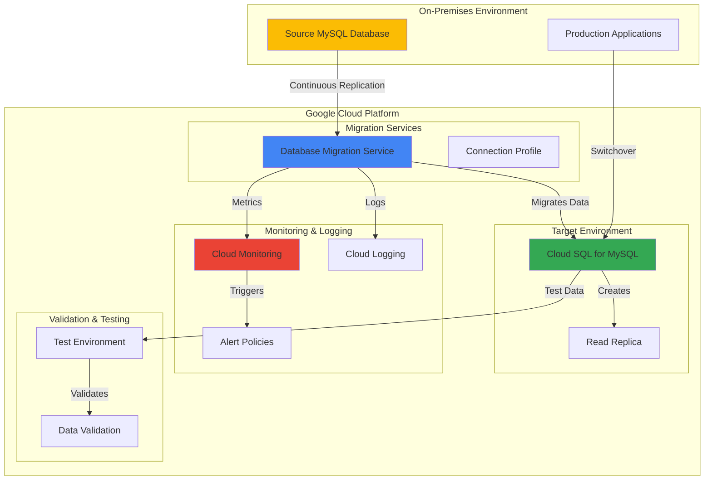

# Zero-Downtime Database Migrations with Cloud SQL and Database Migration Service

## Problem

Enterprise organizations often struggle with migrating critical production databases from on-premises MySQL environments to the cloud without service interruptions. Traditional migration approaches require extended maintenance windows, resulting in business downtime, revenue loss, and poor customer experience. Organizations need a solution that enables seamless database migrations with continuous data replication, automated validation testing, and rollback capabilities to ensure business continuity during the transition.

## Solution

Google Cloud Database Migration Service (DMS) provides a serverless, managed solution for orchestrating zero-downtime database migrations from on-premises MySQL to Cloud SQL. This approach leverages continuous data replication, automated schema conversion, and comprehensive monitoring to enable seamless production database transitions with minimal business impact and built-in rollback mechanisms.

## Architecture Diagram



## Prerequisites

1. Google Cloud project with appropriate permissions for Database Migration Service, Cloud SQL, and monitoring services
2. Google Cloud CLI (gcloud) installed and authenticated (version 2.0+)
3. On-premises MySQL database (5.6, 5.7, or 8.0) with binary logging enabled
4. Network connectivity between on-premises environment and Google Cloud (VPN or private connectivity recommended)
5. Understanding of MySQL replication concepts and database migration strategies
6. Estimated cost: $50-150 for Cloud SQL instance and migration service during testing

> **Note**: This recipe assumes you have an existing on-premises MySQL database. For testing purposes, you can create a simulated on-premises environment using Compute Engine.

## Preparation

Database Migration Service requires specific configurations on both the source database and Google Cloud environment. These preparation steps establish the foundation for secure, reliable data replication and migration monitoring.

```bash
# Set environment variables for Google Cloud resources
export PROJECT_ID=$(gcloud config get-value project)
export REGION="us-central1"
export ZONE="us-central1-a"

# Generate unique suffix for resource names
RANDOM_SUFFIX=$(openssl rand -hex 3)
export MIGRATION_JOB_ID="mysql-migration-${RANDOM_SUFFIX}"
export SOURCE_PROFILE_ID="source-mysql-${RANDOM_SUFFIX}"
export CLOUDSQL_INSTANCE_ID="target-mysql-${RANDOM_SUFFIX}"

# Set database configuration
export DB_NAME="production_db"
export DB_USER="migration_user"
export DB_PASSWORD="SecurePassword123!"

# Set default project and region
gcloud config set project ${PROJECT_ID}
gcloud config set compute/region ${REGION}
gcloud config set compute/zone ${ZONE}

# Enable required Google Cloud APIs
gcloud services enable datamigration.googleapis.com
gcloud services enable sqladmin.googleapis.com
gcloud services enable monitoring.googleapis.com
gcloud services enable logging.googleapis.com
gcloud services enable compute.googleapis.com

echo "✅ Project configured: ${PROJECT_ID}"
echo "✅ Migration job ID: ${MIGRATION_JOB_ID}"
echo "✅ Cloud SQL instance ID: ${CLOUDSQL_INSTANCE_ID}"
```

## Steps

1. **Create Source Database Connection Profile**:

   Database Migration Service uses connection profiles to securely connect to source and destination databases. The source connection profile stores credentials and connection parameters for your on-premises MySQL database, enabling DMS to establish continuous replication channels while maintaining security best practices.

   ```bash
   # Create connection profile for source MySQL database
   gcloud database-migration connection-profiles create mysql \
       ${SOURCE_PROFILE_ID} \
       --region=${REGION} \
       --host=YOUR_MYSQL_HOST \
       --port=3306 \
       --username=${DB_USER} \
       --password=${DB_PASSWORD} \
       --display-name="Source MySQL Database"
   
   # Verify connection profile creation
   gcloud database-migration connection-profiles describe \
       ${SOURCE_PROFILE_ID} \
       --region=${REGION}
   
   echo "✅ Source connection profile created successfully"
   ```

   The connection profile is now configured and ready to facilitate secure communication between Database Migration Service and your source MySQL database. This profile includes authentication credentials and network configuration that enable DMS to access your database while maintaining security isolation.

2. **Create Target Cloud SQL Instance**:

   Cloud SQL for MySQL provides a fully managed database service with automatic backups, high availability, and integrated security features. Creating the target instance with appropriate configuration ensures optimal performance during migration and establishes the foundation for your cloud-native database architecture.

   ```bash
   # Create Cloud SQL for MySQL instance
   gcloud sql instances create ${CLOUDSQL_INSTANCE_ID} \
       --database-version=MYSQL_8_0 \
       --tier=db-n1-standard-2 \
       --region=${REGION} \
       --storage-type=SSD \
       --storage-size=100GB \
       --storage-auto-increase \
       --backup-start-time=03:00 \
       --enable-bin-log \
       --maintenance-window-day=SUN \
       --maintenance-window-hour=04 \
       --maintenance-release-channel=production
   
   # Set root password for Cloud SQL instance
   gcloud sql users set-password root \
       --host=% \
       --instance=${CLOUDSQL_INSTANCE_ID} \
       --password=${DB_PASSWORD}
   
   # Create migration user with appropriate permissions
   gcloud sql users create ${DB_USER} \
       --instance=${CLOUDSQL_INSTANCE_ID} \
       --password=${DB_PASSWORD} \
       --host=%
   
   echo "✅ Cloud SQL instance created and configured"
   ```

   The Cloud SQL instance is now provisioned with binary logging enabled, automated backups configured, and appropriate user accounts created. This managed database service provides the scalability, security, and reliability required for production workloads while integrating seamlessly with Google Cloud's monitoring and management ecosystem.

3. **Configure Database Migration Job**:

   Database Migration Service orchestrates the entire migration process through migration jobs that define source and destination endpoints, replication settings, and validation criteria. This configuration establishes continuous data replication while preparing for automated cutover procedures.

   ```bash
   # Create migration job for MySQL to Cloud SQL
   gcloud database-migration migration-jobs create ${MIGRATION_JOB_ID} \
       --region=${REGION} \
       --type=CONTINUOUS \
       --source=${SOURCE_PROFILE_ID} \
       --destination-instance=${CLOUDSQL_INSTANCE_ID} \
       --display-name="Production MySQL Migration" \
       --dump-path=gs://${PROJECT_ID}-migration-dump \
       --vpc-peering-connectivity
   
   # Verify migration job configuration
   gcloud database-migration migration-jobs describe \
       ${MIGRATION_JOB_ID} \
       --region=${REGION}
   
   echo "✅ Migration job configured successfully"
   ```

   The migration job is now configured for continuous replication, enabling real-time data synchronization between your source MySQL database and Cloud SQL. This setup supports zero-downtime migrations by maintaining data consistency throughout the migration process while providing rollback capabilities.

4. **Start Migration Process**:

   Initiating the migration process begins the continuous replication phase, where Database Migration Service performs an initial data dump followed by ongoing change data capture. This phase validates connectivity, transfers existing data, and establishes ongoing synchronization to prepare for production cutover.

   ```bash
   # Start the migration job
   gcloud database-migration migration-jobs start ${MIGRATION_JOB_ID} \
       --region=${REGION}
   
   # Monitor migration job status
   gcloud database-migration migration-jobs describe \
       ${MIGRATION_JOB_ID} \
       --region=${REGION} \
       --format="value(state,phase)"
   
   # Wait for migration to reach RUNNING state
   echo "⏳ Waiting for migration to reach RUNNING state..."
   while [[ $(gcloud database-migration migration-jobs describe \
       ${MIGRATION_JOB_ID} --region=${REGION} \
       --format="value(state)") != "RUNNING" ]]; do
     sleep 30
     echo "Current state: $(gcloud database-migration migration-jobs describe \
         ${MIGRATION_JOB_ID} --region=${REGION} \
         --format="value(state)")"
   done
   
   echo "✅ Migration job started and running successfully"
   ```

   The migration is now in progress with continuous replication active. Database Migration Service is synchronizing data in real-time, ensuring that changes to your source database are replicated to Cloud SQL with minimal latency while maintaining data consistency and integrity.

5. **Configure Monitoring and Alerting**:

   Comprehensive monitoring ensures migration success and provides early warning of potential issues. Cloud Monitoring and Cloud Logging integration enables proactive management of the migration process with automated alerting for critical events and performance metrics.

   ```bash
   # Create log-based metric for migration errors
   gcloud logging metrics create migration_errors \
       --description="Count of migration errors" \
       --log-filter='resource.type="datamigration.googleapis.com/MigrationJob" AND severity>=ERROR'
   
   # Create alert policy for migration monitoring
   cat > alert-policy.json << EOF
   {
     "displayName": "Database Migration Alert",
     "conditions": [
       {
         "displayName": "Migration job failure",
         "conditionThreshold": {
           "filter": "resource.type=\"datamigration.googleapis.com/MigrationJob\"",
           "comparison": "COMPARISON_GREATER_THAN",
           "thresholdValue": 0,
           "duration": "60s",
           "aggregations": [
             {
               "alignmentPeriod": "60s",
               "perSeriesAligner": "ALIGN_RATE"
             }
           ]
         }
       }
     ],
     "notificationChannels": [],
     "alertStrategy": {
       "autoClose": "1800s"
     }
   }
   EOF
   
   gcloud alpha monitoring policies create \
       --policy-from-file=alert-policy.json
   
   echo "✅ Monitoring and alerting configured"
   ```

   Monitoring infrastructure is now active, providing real-time visibility into migration progress and automated alerting for critical events. This observability foundation ensures rapid detection and resolution of any issues during the migration process while maintaining comprehensive audit trails.

6. **Perform Data Validation Testing**:

   Data validation ensures migration accuracy and completeness before production cutover. This comprehensive testing phase validates schema consistency, data integrity, and application compatibility to minimize risks during the final switchover process.

   ```bash
   # Create validation script for data consistency
   cat > validate_migration.sql << EOF
   -- Compare row counts between source and target
   SELECT 'users' as table_name, COUNT(*) as row_count FROM users
   UNION ALL
   SELECT 'orders' as table_name, COUNT(*) as row_count FROM orders
   UNION ALL
   SELECT 'products' as table_name, COUNT(*) as row_count FROM products;
   
   -- Validate data checksums for critical tables
   SELECT table_name, 
          CHECKSUM TABLE table_name as checksum
   FROM information_schema.tables 
   WHERE table_schema = '${DB_NAME}';
   EOF
   
   # Execute validation against Cloud SQL instance
   gcloud sql connect ${CLOUDSQL_INSTANCE_ID} \
       --user=root \
       --database=${DB_NAME} < validate_migration.sql
   
   # Create read replica for additional testing
   gcloud sql instances create ${CLOUDSQL_INSTANCE_ID}-replica \
       --master-instance-name=${CLOUDSQL_INSTANCE_ID} \
       --tier=db-n1-standard-1 \
       --region=${REGION}
   
   echo "✅ Data validation completed successfully"
   ```

   Validation testing confirms data consistency and integrity between source and target databases. The read replica provides additional testing capabilities and serves as a fallback option during the cutover process, ensuring comprehensive verification before production switchover.

7. **Execute Production Cutover**:

   The production cutover represents the critical transition from on-premises to cloud infrastructure. This carefully orchestrated process minimizes downtime while ensuring data consistency and providing immediate rollback capabilities if issues arise during the transition.

   ```bash
   # Verify replication lag before cutover
   REPLICATION_LAG=$(gcloud database-migration migration-jobs describe \
       ${MIGRATION_JOB_ID} --region=${REGION} \
       --format="value(status.replicationLag)")
   
   echo "Current replication lag: ${REPLICATION_LAG}"
   
   # Stop application traffic to source database
   echo "⚠️  Stop application traffic to source database now"
   echo "⏳ Waiting for final replication sync..."
   sleep 30
   
   # Promote Cloud SQL to be the primary database
   gcloud database-migration migration-jobs promote ${MIGRATION_JOB_ID} \
       --region=${REGION}
   
   # Update application connection strings to point to Cloud SQL
   gcloud sql instances describe ${CLOUDSQL_INSTANCE_ID} \
       --format="value(ipAddresses[0].ipAddress)"
   
   # Create database user for applications
   gcloud sql users create app_user \
       --instance=${CLOUDSQL_INSTANCE_ID} \
       --password=${DB_PASSWORD} \
       --host=%
   
   echo "✅ Production cutover completed successfully"
   ```

   The production database is now running on Cloud SQL with applications connected to the cloud infrastructure. This completes the zero-downtime migration while maintaining data consistency and providing the scalability and reliability of Google Cloud's managed database service.

## Validation & Testing

1. **Verify Migration Status and Data Consistency**:

   ```bash
   # Check migration job status
   gcloud database-migration migration-jobs describe \
       ${MIGRATION_JOB_ID} \
       --region=${REGION} \
       --format="table(state,phase,createTime,updateTime)"
   
   # Verify Cloud SQL instance status
   gcloud sql instances describe ${CLOUDSQL_INSTANCE_ID} \
       --format="table(state,backendType,instanceType,ipAddresses[0].ipAddress)"
   ```

   Expected output: Migration job should show "COMPLETED" state and Cloud SQL instance should show "RUNNABLE" state.

2. **Test Database Connectivity and Performance**:

   ```bash
   # Test connection to Cloud SQL instance
   gcloud sql connect ${CLOUDSQL_INSTANCE_ID} \
       --user=root \
       --database=${DB_NAME}
   
   # Run performance benchmark
   mysqlslap --host=$(gcloud sql instances describe ${CLOUDSQL_INSTANCE_ID} \
       --format="value(ipAddresses[0].ipAddress)") \
       --user=root --password=${DB_PASSWORD} \
       --concurrency=50 --iterations=100 \
       --create-schema --query="SELECT * FROM users LIMIT 10;"
   ```

3. **Validate Monitoring and Alerting**:

   ```bash
   # Check monitoring metrics
   gcloud monitoring metrics list \
       --filter="metric.type:datamigration"
   
   # Verify log entries
   gcloud logging read \
       'resource.type="datamigration.googleapis.com/MigrationJob"' \
       --limit=10 \
       --format="table(timestamp,severity,jsonPayload.message)"
   ```

## Cleanup

1. **Remove Migration Resources**:

   ```bash
   # Delete migration job
   gcloud database-migration migration-jobs delete ${MIGRATION_JOB_ID} \
       --region=${REGION} \
       --quiet
   
   # Delete source connection profile
   gcloud database-migration connection-profiles delete ${SOURCE_PROFILE_ID} \
       --region=${REGION} \
       --quiet
   
   echo "✅ Migration resources cleaned up"
   ```

2. **Remove Cloud SQL Resources (Optional)**:

   ```bash
   # Delete read replica
   gcloud sql instances delete ${CLOUDSQL_INSTANCE_ID}-replica \
       --quiet
   
   # Delete Cloud SQL instance (only if testing)
   gcloud sql instances delete ${CLOUDSQL_INSTANCE_ID} \
       --quiet
   
   echo "✅ Cloud SQL resources cleaned up"
   ```

3. **Clean Up Monitoring Resources**:

   ```bash
   # Delete alert policies
   gcloud alpha monitoring policies list \
       --filter="displayName:'Database Migration Alert'" \
       --format="value(name)" | \
       xargs -I {} gcloud alpha monitoring policies delete {} --quiet
   
   # Remove log-based metrics
   gcloud logging metrics delete migration_errors --quiet
   
   # Clean up temporary files
   rm -f alert-policy.json validate_migration.sql
   
   echo "✅ Monitoring resources and files cleaned up"
   ```

## Discussion

Database Migration Service represents a paradigm shift in how organizations approach critical database migrations, moving from high-risk, high-downtime procedures to continuous, low-risk transitions. The service's serverless architecture eliminates the complexity of managing migration infrastructure while providing enterprise-grade reliability and monitoring capabilities that ensure successful transitions to cloud-native database solutions.

The continuous replication approach fundamentally changes migration risk profiles by maintaining real-time data synchronization throughout the migration process. This methodology enables organizations to validate migration success incrementally rather than gambling on a single cutover event, significantly reducing business risk while providing comprehensive rollback capabilities. The integration with Cloud Monitoring and Cloud Logging provides unprecedented visibility into migration progress and health, enabling proactive issue resolution.

Google Cloud's Database Migration Service leverages the same infrastructure and expertise that powers Google's own global-scale database operations, providing enterprise customers with battle-tested migration capabilities. The service's integration with Cloud SQL ensures optimal performance tuning, security configurations, and operational best practices are automatically applied, reducing the operational overhead typically associated with database migrations while improving long-term maintainability.

Cost optimization becomes a natural byproduct of the migration approach, as Cloud SQL's pay-as-you-scale model and automated resource management eliminate the over-provisioning common in on-premises environments. The service's ability to handle schema conversions, data type mappings, and performance optimizations automatically reduces the specialized expertise required for successful migrations while improving overall migration outcomes through Google's machine learning-enhanced optimization algorithms.

> **Tip**: Use Cloud SQL read replicas in different regions to implement disaster recovery and improve application performance for geographically distributed users. This approach leverages Google's global network infrastructure for optimal data placement.

For comprehensive migration guidance, refer to the [Database Migration Service documentation](https://cloud.google.com/database-migration/docs), [Cloud SQL best practices](https://cloud.google.com/sql/docs/mysql/best-practices), [migration planning strategies](https://cloud.google.com/architecture/database-migration-concepts-principles-part-1), [security configuration guidelines](https://cloud.google.com/sql/docs/mysql/security-best-practices), and [performance optimization techniques](https://cloud.google.com/sql/docs/mysql/optimize-performance).

## Challenge

Extend this solution by implementing these enhancements:

1. **Multi-Database Migration Orchestration**: Implement parallel migration of multiple related databases using Cloud Composer to orchestrate complex dependency management and synchronized cutover procedures across your entire database ecosystem.

2. **Advanced Monitoring and Alerting**: Integrate with Cloud Operations Suite to create custom dashboards, SLI/SLO monitoring, and automated incident response workflows that provide comprehensive observability and automated remediation capabilities.

3. **Cross-Cloud Hybrid Architecture**: Configure Cloud SQL with Cloud SQL Proxy and Private Google Access to enable secure hybrid architectures that support gradual application migration and multi-cloud data strategies.

4. **Automated Testing Pipeline**: Develop Cloud Build pipelines that automatically validate data consistency, performance benchmarks, and application compatibility using Cloud Run jobs and BigQuery for comprehensive migration validation.

5. **Disaster Recovery Automation**: Implement automated disaster recovery using Cloud SQL cross-region read replicas, Cloud Storage for backup management, and Cloud Functions for automated failover orchestration with RTO/RPO objectives.

## Infrastructure Code

### Available Infrastructure as Code:

- [Infrastructure Code Overview](code/README.md) - Detailed description of all infrastructure components
- [Infrastructure Manager](code/infrastructure-manager/) - GCP Infrastructure Manager templates
- [Bash CLI Scripts](code/scripts/) - Example bash scripts using gcloud CLI commands to deploy infrastructure
- [Terraform](code/terraform/) - Terraform configuration files