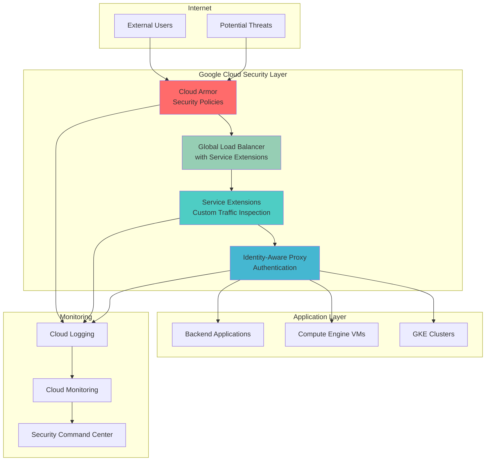

# Zero-Trust Network Security with Service Extensions and Cloud Armor

## Problem

Modern organizations face sophisticated cyber threats that easily bypass traditional perimeter-based security models. With increasing adoption of cloud services, remote work, and mobile devices, the network perimeter has essentially dissolved, making it impossible to distinguish between trusted and untrusted traffic based solely on network location. This creates significant security vulnerabilities where attackers who breach the perimeter gain broad access to internal resources, potentially leading to data breaches, compliance violations, and business disruption.

## Solution

This recipe implements a comprehensive zero-trust network security architecture using Google Cloud's Service Extensions feature combined with Cloud Armor and Identity-Aware Proxy. The solution creates custom security policies that inspect traffic at the load balancer level, enforce user authentication through IAP, and provide DDoS protection through Cloud Armor. This multi-layered approach ensures that every request is verified, authenticated, and authorized before accessing protected resources.

## Architecture Diagram



## Prerequisites

1. Google Cloud project with billing enabled and appropriate IAM permissions (Security Admin, Network Admin, Service Account Admin, IAP Admin)
2. Google Cloud CLI (gcloud) installed and configured or Google Cloud Shell access
3. Basic understanding of Google Cloud networking, load balancing, and security concepts
4. Knowledge of zero-trust security principles and web application security
5. Estimated cost: $75-$150/month for testing environment (varies based on traffic volume and resource usage)

> **Note**: This recipe uses Google Cloud's Service Extensions feature which is now generally available for plugins and in preview for callouts. Verify feature availability in your target region before proceeding.

## Preparation

```bash
# Set environment variables
export PROJECT_ID=$(gcloud config get-value project)
export REGION="us-central1"
export ZONE="us-central1-a"

# Generate unique identifiers for resources
RANDOM_SUFFIX=$(openssl rand -hex 3)
export APP_NAME="zero-trust-app-${RANDOM_SUFFIX}"
export NETWORK_NAME="zero-trust-vpc"
export SUBNET_NAME="zero-trust-subnet"
export SECURITY_POLICY_NAME="zero-trust-armor-policy"
export SERVICE_EXTENSION_NAME="zero-trust-extension"

# Set default project and region
gcloud config set project ${PROJECT_ID}
gcloud config set compute/region ${REGION}
gcloud config set compute/zone ${ZONE}

# Enable required APIs
gcloud services enable compute.googleapis.com
gcloud services enable iap.googleapis.com
gcloud services enable logging.googleapis.com
gcloud services enable monitoring.googleapis.com
gcloud services enable run.googleapis.com
gcloud services enable cloudbuild.googleapis.com
gcloud services enable containerregistry.googleapis.com

echo "✅ Environment configured for project: ${PROJECT_ID}"
echo "✅ Resource prefix: ${APP_NAME}"
echo "✅ APIs enabled for zero-trust security services"
```

## Steps

1. **Create Custom VPC Network with Security-First Design**:

   Zero-trust architecture requires granular network control and segmentation. Google Cloud VPC provides the foundation for implementing network-level security controls through custom subnets, firewall rules, and private connectivity. This approach eliminates the traditional network perimeter and enables fine-grained access control at every network layer.

   ```bash
   # Create custom VPC network
   gcloud compute networks create ${NETWORK_NAME} \
       --subnet-mode custom \
       --bgp-routing-mode global \
       --description "Zero-trust network for secure applications"
   
   # Create subnet with private Google access
   gcloud compute networks subnets create ${SUBNET_NAME} \
       --network ${NETWORK_NAME} \
       --range 10.0.0.0/24 \
       --region ${REGION} \
       --enable-private-ip-google-access \
       --description "Subnet for zero-trust application backends"
   
   # Create firewall rule to allow health checks
   gcloud compute firewall-rules create ${NETWORK_NAME}-allow-health-checks \
       --network ${NETWORK_NAME} \
       --action allow \
       --direction ingress \
       --source-ranges 130.211.0.0/22,35.191.0.0/16 \
       --target-tags http-server \
       --rules tcp:80,tcp:443
   
   echo "✅ VPC network created with secure subnet configuration"
   ```

   The custom VPC establishes network isolation and enables private Google access, ensuring backend resources can communicate with Google services without exposure to the public internet. This foundational step is crucial for implementing defense-in-depth security principles.

2. **Deploy Sample Application Backend for Security Testing**:

   A realistic backend application is essential for demonstrating zero-trust security controls. This Compute Engine instance will serve as the protected resource that requires authentication and authorization. The application simulates a typical web service that handles sensitive business data and user interactions.

   ```bash
   # Create service account for backend instances
   gcloud iam service-accounts create ${APP_NAME}-backend \
       --display-name "Zero Trust Backend Service Account" \
       --description "Service account for backend instances"
   
   # Create backend compute instance with updated startup script
   gcloud compute instances create ${APP_NAME}-backend \
       --zone ${ZONE} \
       --machine-type e2-medium \
       --subnet ${SUBNET_NAME} \
       --no-address \
       --service-account ${APP_NAME}-backend@${PROJECT_ID}.iam.gserviceaccount.com \
       --scopes cloud-platform \
       --image-family ubuntu-2004-lts \
       --image-project ubuntu-os-cloud \
       --tags http-server \
       --metadata startup-script='#!/bin/bash
   apt-get update
   apt-get install -y nginx
   
   # Create a more comprehensive test application
   cat > /var/www/html/index.html << EOF
   <!DOCTYPE html>
   <html>
   <head>
       <title>Zero Trust Protected Application</title>
       <style>
           body { font-family: Arial, sans-serif; margin: 40px; }
           .header { background: #4285f4; color: white; padding: 20px; border-radius: 8px; }
           .content { padding: 20px; border: 1px solid #ddd; margin-top: 20px; border-radius: 8px; }
           .status { color: #0f9d58; font-weight: bold; }
       </style>
   </head>
   <body>
       <div class="header">
           <h1>🔒 Secure Application</h1>
           <p>This application is protected by zero-trust security architecture</p>
       </div>
       <div class="content">
           <h2>Security Status: <span class="status">PROTECTED</span></h2>
           <p><strong>Request processed at:</strong> $(date)</p>
           <p><strong>Server hostname:</strong> $(hostname)</p>
           <p><strong>Security Layer:</strong> Cloud Armor + Service Extensions + IAP</p>
           <p><strong>Trust Model:</strong> Never trust, always verify</p>
       </div>
   </body>
   </html>
   EOF
   
   systemctl enable nginx
   systemctl start nginx
   
   # Create a simple API endpoint for testing
   mkdir -p /var/www/html/api
   cat > /var/www/html/api/status.json << EOF
   {
       "status": "secure",
       "timestamp": "$(date -Iseconds)",
       "server": "$(hostname)",
       "security": {
           "armor": "enabled",
           "iap": "enabled",
           "extensions": "enabled"
       }
   }
   EOF'
   
   echo "✅ Backend application deployed with secure configuration"
   ```

   The backend instance runs without a public IP address, demonstrating the zero-trust principle of private-by-default networking. All access must flow through the load balancer and security controls we'll configure in subsequent steps.

3. **Configure Cloud Armor Security Policy with Advanced Protection**:

   Cloud Armor provides the first line of defense against DDoS attacks, OWASP Top 10 vulnerabilities, and malicious traffic. The security policy implements rate limiting, geographic restrictions, and signature-based detection to filter malicious requests before they reach your applications.

   ```bash
   # Create Cloud Armor security policy
   gcloud compute security-policies create ${SECURITY_POLICY_NAME} \
       --description "Zero-trust security policy with DDoS and WAF protection" \
       --type CLOUD_ARMOR
   
   # Add rate limiting rule with updated syntax
   gcloud compute security-policies rules create 1000 \
       --security-policy ${SECURITY_POLICY_NAME} \
       --expression "true" \
       --action "rate-based-ban" \
       --rate-limit-threshold-count 100 \
       --rate-limit-threshold-interval-sec 60 \
       --ban-duration-sec 300 \
       --conform-action allow \
       --exceed-action deny-429 \
       --enforce-on-key IP \
       --description "Rate limiting - 100 requests per minute per IP"
   
   # Add geo-blocking rule for high-risk regions
   gcloud compute security-policies rules create 2000 \
       --security-policy ${SECURITY_POLICY_NAME} \
       --expression "origin.region_code == 'CN' || origin.region_code == 'RU'" \
       --action deny-403 \
       --description "Block traffic from high-risk geographic regions"
   
   # Add OWASP Core Rule Set protection for XSS
   gcloud compute security-policies rules create 3000 \
       --security-policy ${SECURITY_POLICY_NAME} \
       --expression "evaluatePreconfiguredExpr('xss-stable')" \
       --action deny-403 \
       --description "Block XSS attacks using OWASP rules"
   
   # Add SQL injection protection
   gcloud compute security-policies rules create 3100 \
       --security-policy ${SECURITY_POLICY_NAME} \
       --expression "evaluatePreconfiguredExpr('sqli-stable')" \
       --action deny-403 \
       --description "Block SQL injection attacks"
   
   # Add suspicious path blocking
   gcloud compute security-policies rules create 4000 \
       --security-policy ${SECURITY_POLICY_NAME} \
       --expression "request.path.matches('/admin|/config|/.env|/wp-admin')" \
       --action deny-403 \
       --description "Block access to sensitive paths"
   
   echo "✅ Cloud Armor security policy configured with multi-layer protection"
   ```

   The security policy implements a defense-in-depth approach with rate limiting to prevent abuse, geographic filtering to block known threat vectors, and signature-based detection for common web application attacks. This creates a robust first line of defense for your zero-trust architecture.

4. **Create Service Extension for Custom Traffic Inspection**:

   Service Extensions enable custom security logic at the load balancer level, allowing you to implement organization-specific security policies, advanced threat detection, and custom authentication flows. This step creates a Cloud Run service that processes traffic and makes security decisions in real-time.

   ```bash
   # Create directory for service extension code
   mkdir -p /tmp/service-extension
   cd /tmp/service-extension
   
   # Create enhanced service extension application
   cat > main.py << 'EOF'
   import json
   import logging
   import time
   import hashlib
   from flask import Flask, request, jsonify
   from datetime import datetime, timezone
   
   app = Flask(__name__)
   logging.basicConfig(level=logging.INFO)
   logger = logging.getLogger(__name__)
   
   # Simple in-memory rate limiting cache
   request_cache = {}
   
   def clean_cache():
       """Clean old entries from cache"""
       current_time = time.time()
       keys_to_remove = []
       for key, data in request_cache.items():
           if current_time - data['timestamp'] > 300:  # 5 minutes
               keys_to_remove.append(key)
       for key in keys_to_remove:
           del request_cache[key]
   
   @app.route('/process', methods=['POST'])
   def process_request():
       try:
           # Parse the request from the load balancer
           data = request.get_json()
           if not data:
               logger.error("No JSON data received")
               return jsonify({'action': 'ALLOW'}), 500
           
           headers = data.get('headers', {})
           path = data.get('path', '')
           method = data.get('method', '')
           client_ip = data.get('client_ip', '')
           
           # Clean old cache entries
           clean_cache()
           
           # Custom security logic with enhanced scoring
           security_score = 100
           risk_factors = []
           
           # Check for suspicious patterns in path
           suspicious_paths = ['/admin', '/config', '/.env', '/wp-admin', 
                             '/phpmyadmin', '/xmlrpc.php', '/wp-login.php']
           if any(suspicious in path.lower() for suspicious in suspicious_paths):
               security_score -= 40
               risk_factors.append(f'Suspicious path access: {path}')
           
           # Check user agent patterns
           user_agent = headers.get('user-agent', '').lower()
           suspicious_agents = ['bot', 'crawler', 'scraper', 'scanner', 'nikto', 'sqlmap']
           if any(agent in user_agent for agent in suspicious_agents):
               security_score -= 30
               risk_factors.append('Suspicious user agent detected')
           
           # Check for missing or suspicious headers
           if not headers.get('accept'):
               security_score -= 15
               risk_factors.append('Missing Accept header')
           
           if not headers.get('accept-language'):
               security_score -= 10
               risk_factors.append('Missing Accept-Language header')
           
           # Check request method
           if method in ['PUT', 'DELETE', 'PATCH']:
               security_score -= 15
               risk_factors.append(f'Potentially destructive HTTP method: {method}')
           
           # Simple rate limiting check
           if client_ip:
               client_key = hashlib.md5(client_ip.encode()).hexdigest()
               current_time = time.time()
               
               if client_key in request_cache:
                   time_diff = current_time - request_cache[client_key]['timestamp']
                   if time_diff < 1 and request_cache[client_key]['count'] > 10:
                       security_score -= 50
                       risk_factors.append('Rate limit exceeded')
                       request_cache[client_key]['count'] += 1
                   elif time_diff >= 1:
                       request_cache[client_key] = {'timestamp': current_time, 'count': 1}
                   else:
                       request_cache[client_key]['count'] += 1
               else:
                   request_cache[client_key] = {'timestamp': current_time, 'count': 1}
           
           # Make security decision
           if security_score < 40:
               logger.warning(f"Blocking request from {client_ip}: {risk_factors}")
               return jsonify({
                   'action': 'DENY',
                   'status_code': 403,
                   'body': json.dumps({
                       'error': 'Access denied by security policy',
                       'timestamp': datetime.now(timezone.utc).isoformat(),
                       'request_id': hashlib.md5(f"{client_ip}{time.time()}".encode()).hexdigest()[:8]
                   })
               })
           
           # Add comprehensive security headers to response
           response_headers = {
               'X-Security-Score': str(security_score),
               'X-Security-Timestamp': datetime.now(timezone.utc).isoformat(),
               'X-Frame-Options': 'DENY',
               'X-Content-Type-Options': 'nosniff',
               'X-XSS-Protection': '1; mode=block',
               'Strict-Transport-Security': 'max-age=31536000; includeSubDomains',
               'Content-Security-Policy': "default-src 'self'",
               'Referrer-Policy': 'strict-origin-when-cross-origin'
           }
           
           logger.info(f"Allowing request from {client_ip} with score: {security_score}")
           return jsonify({
               'action': 'ALLOW',
               'headers': response_headers
           })
           
       except Exception as e:
           logger.error(f"Error processing request: {e}")
           # Fail open for availability
           return jsonify({'action': 'ALLOW'}), 200
   
   @app.route('/health', methods=['GET'])
   def health_check():
       """Health check endpoint"""
       return jsonify({
           'status': 'healthy',
           'timestamp': datetime.now(timezone.utc).isoformat(),
           'cache_size': len(request_cache)
       })
   
   if __name__ == '__main__':
       app.run(host='0.0.0.0', port=8080)
   EOF
   
   # Create updated requirements file
   cat > requirements.txt << 'EOF'
   Flask==3.0.0
   gunicorn==21.2.0
   Werkzeug==3.0.1
   EOF
   
   # Create optimized Dockerfile
   cat > Dockerfile << 'EOF'
   FROM python:3.11-slim
   
   # Set environment variables
   ENV PYTHONDONTWRITEBYTECODE=1
   ENV PYTHONUNBUFFERED=1
   
   # Install system dependencies
   RUN apt-get update && apt-get install -y --no-install-recommends \
       && rm -rf /var/lib/apt/lists/*
   
   WORKDIR /app
   
   # Install Python dependencies
   COPY requirements.txt .
   RUN pip install --no-cache-dir -r requirements.txt
   
   # Copy application code
   COPY main.py .
   
   # Create non-root user for security
   RUN adduser --disabled-password --gecos '' appuser
   USER appuser
   
   EXPOSE 8080
   
   CMD ["gunicorn", "--bind", "0.0.0.0:8080", "--workers", "2", \
        "--timeout", "30", "--keep-alive", "2", "main:app"]
   EOF
   
   # Deploy to Cloud Run with enhanced configuration
   gcloud run deploy ${SERVICE_EXTENSION_NAME} \
       --source . \
       --region ${REGION} \
       --allow-unauthenticated \
       --memory 1Gi \
       --cpu 2 \
       --min-instances 1 \
       --max-instances 20 \
       --concurrency 80 \
       --timeout 30 \
       --set-env-vars "SERVICE_NAME=${SERVICE_EXTENSION_NAME}" \
       --description "Service extension for zero-trust traffic inspection"
   
   # Get service URL
   EXTENSION_URL=$(gcloud run services describe ${SERVICE_EXTENSION_NAME} \
       --region ${REGION} --format "value(status.url)")
   
   echo "✅ Service extension deployed at: ${EXTENSION_URL}"
   echo "✅ Enhanced security logic implemented with rate limiting and threat detection"
   cd -
   ```

   The service extension implements advanced custom security logic that analyzes each request and assigns a security score based on various risk factors. This demonstrates how organizations can implement proprietary security algorithms and business-specific threat detection within the zero-trust framework.

5. **Configure Identity-Aware Proxy for User Authentication**:

   Identity-Aware Proxy provides centralized authentication and authorization, ensuring that only authenticated and authorized users can access protected resources. IAP integrates with Google Identity and external identity providers to enforce zero-trust principles at the application level.

   ```bash
   # Create health check for backend service
   gcloud compute health-checks create http ${APP_NAME}-health-check \
       --port 80 \
       --request-path / \
       --check-interval 30s \
       --timeout 10s \
       --healthy-threshold 2 \
       --unhealthy-threshold 3 \
       --description "Health check for zero-trust backends"
   
   # Create IAP-secured web service backend
   gcloud compute backend-services create ${APP_NAME}-backend-service \
       --protocol HTTP \
       --health-checks ${APP_NAME}-health-check \
       --global \
       --iap \
       --description "Backend service with IAP protection"
   
   # Create instance group for backend
   gcloud compute instance-groups unmanaged create ${APP_NAME}-ig \
       --zone ${ZONE} \
       --description "Instance group for zero-trust backend"
   
   # Add instance to group
   gcloud compute instance-groups unmanaged add-instances ${APP_NAME}-ig \
       --instances ${APP_NAME}-backend \
       --zone ${ZONE}
   
   # Set named port for instance group
   gcloud compute instance-groups unmanaged set-named-ports ${APP_NAME}-ig \
       --named-ports http:80 \
       --zone ${ZONE}
   
   # Add backend to service
   gcloud compute backend-services add-backend ${APP_NAME}-backend-service \
       --instance-group ${APP_NAME}-ig \
       --instance-group-zone ${ZONE} \
       --global
   
   echo "✅ Backend service configured with IAP protection"
   echo "✅ Instance group created and added to backend service"
   ```

   IAP provides a centralized security checkpoint that authenticates users before they can access any backend resources. This eliminates the need for application-level authentication and ensures consistent security policies across all services.

6. **Create Global Load Balancer with Integrated Security Pipeline**:

   The global load balancer integrates all security components and routes traffic through the zero-trust security pipeline. Cloud Armor policies are attached to backend services to implement comprehensive security filtering alongside IAP protection.

   ```bash
   # Create URL map
   gcloud compute url-maps create ${APP_NAME}-url-map \
       --default-service ${APP_NAME}-backend-service \
       --description "URL map for zero-trust application"
   
   # Create managed SSL certificate for testing
   gcloud compute ssl-certificates create ${APP_NAME}-ssl-cert \
       --domains ${APP_NAME}.example.com \
       --global \
       --description "SSL certificate for zero-trust application"
   
   # Create HTTPS proxy
   gcloud compute target-https-proxies create ${APP_NAME}-https-proxy \
       --url-map ${APP_NAME}-url-map \
       --ssl-certificates ${APP_NAME}-ssl-cert \
       --description "HTTPS proxy with SSL termination"
   
   # Create global forwarding rule
   gcloud compute forwarding-rules create ${APP_NAME}-forwarding-rule \
       --global \
       --target-https-proxy ${APP_NAME}-https-proxy \
       --ports 443 \
       --description "Global forwarding rule for HTTPS traffic"
   
   # Get load balancer IP
   LB_IP=$(gcloud compute forwarding-rules describe ${APP_NAME}-forwarding-rule \
       --global --format "value(IPAddress)")
   
   echo "✅ Global load balancer created with IP: ${LB_IP}"
   
   # Attach Cloud Armor policy to backend service
   gcloud compute backend-services update ${APP_NAME}-backend-service \
       --security-policy ${SECURITY_POLICY_NAME} \
       --global
   
   # Create HTTP to HTTPS redirect
   gcloud compute url-maps create ${APP_NAME}-http-redirect \
       --default-url-redirect-response-code 301 \
       --default-url-redirect-https-redirect
   
   gcloud compute target-http-proxies create ${APP_NAME}-http-proxy \
       --url-map ${APP_NAME}-http-redirect
   
   gcloud compute forwarding-rules create ${APP_NAME}-http-forwarding-rule \
       --global \
       --target-http-proxy ${APP_NAME}-http-proxy \
       --ports 80
   
   echo "✅ Cloud Armor policy attached to backend service"
   echo "✅ HTTP to HTTPS redirect configured for security"
   ```

   The load balancer creates a single entry point for all traffic and enforces the complete zero-trust security pipeline. Each request flows through Cloud Armor for threat detection, then to IAP for authentication before reaching backend services.

7. **Configure Comprehensive Security Monitoring and Logging**:

   Effective zero-trust implementation requires comprehensive visibility into all security events, user activities, and potential threats. Cloud Logging and Security Command Center provide centralized monitoring and alerting for the entire security infrastructure.

   ```bash
   # Create Cloud Storage bucket for security logs
   gsutil mb -p ${PROJECT_ID} \
       -c STANDARD \
       -l ${REGION} \
       gs://${PROJECT_ID}-security-logs
   
   # Enable object versioning for audit trail
   gsutil versioning set on gs://${PROJECT_ID}-security-logs
   
   # Create log sink for security events with improved filter
   gcloud logging sinks create zero-trust-security-sink \
       storage.googleapis.com/${PROJECT_ID}-security-logs \
       --log-filter='
       (protoPayload.serviceName="iap.googleapis.com" OR 
        protoPayload.serviceName="compute.googleapis.com" OR
        resource.type="gce_instance" OR
        resource.type="http_load_balancer" OR
        resource.type="cloud_run_revision") AND
       (severity>=WARNING OR
        protoPayload.methodName:"deny" OR
        protoPayload.methodName:"block" OR
        jsonPayload.security_score<50)' \
       --description "Security events from zero-trust infrastructure"
   
   # Create custom log-based metric for security events
   gcloud logging metrics create zero_trust_security_events \
       --description="Count of security events in zero-trust infrastructure" \
       --log-filter='
       (protoPayload.serviceName="iap.googleapis.com" OR 
        resource.type="http_load_balancer") AND
       (severity>=WARNING OR
        protoPayload.methodName:"deny")' \
       --value-extractor="" \
       --label-extractor=""
   
   # Create alerting policy for security events
   cat > /tmp/alert-policy.json << EOF
   {
     "displayName": "Zero Trust Security Alerts",
     "documentation": {
       "content": "Alert for suspicious security events in zero-trust infrastructure",
       "mimeType": "text/markdown"
     },
     "conditions": [
       {
         "displayName": "High rate of Cloud Armor blocks",
         "conditionThreshold": {
           "filter": "resource.type=\"http_load_balancer\" AND metric.type=\"logging.googleapis.com/user/zero_trust_security_events\"",
           "comparison": "COMPARISON_GREATER_THAN",
           "thresholdValue": "10",
           "duration": "300s",
           "aggregations": [
             {
               "alignmentPeriod": "60s",
               "perSeriesAligner": "ALIGN_RATE"
             }
           ]
         }
       }
     ],
     "alertStrategy": {
       "autoClose": "1800s"
     },
     "enabled": true
   }
   EOF
   
   echo "✅ Security monitoring and logging configured"
   echo "✅ Log sink created for centralized security event collection"
   echo "✅ Custom metrics and alerting policies configured"
   ```

   Comprehensive logging provides the visibility needed to detect threats, investigate incidents, and continuously improve security posture. The monitoring configuration enables real-time alerting for security events and suspicious activities.

## Validation & Testing

1. **Verify Cloud Armor Security Policy Protection**:

   ```bash
   # Test rate limiting protection
   echo "Testing rate limiting protection..."
   for i in {1..15}; do
     response=$(curl -s -o /dev/null -w "%{http_code}" \
       "https://${LB_IP}" \
       -H "Host: ${APP_NAME}.example.com" \
       --insecure)
     echo "Request $i: HTTP $response"
     sleep 0.5
   done
   
   # Check security policy rules status
   gcloud compute security-policies describe ${SECURITY_POLICY_NAME} \
       --format="table(name,rules[].priority,rules[].action,rules[].description)"
   ```

   Expected output: Initial requests should return 200, followed by 429 (rate limited) responses after threshold is exceeded.

2. **Test Service Extension Custom Security Logic**:

   ```bash
   # Test request that should be allowed
   echo "Testing allowed request..."
   curl -X GET "https://${LB_IP}/api/status.json" \
       -H "Host: ${APP_NAME}.example.com" \
       -H "User-Agent: Mozilla/5.0 (Windows NT 10.0; Win64; x64) AppleWebKit/537.36" \
       -H "Accept: application/json" \
       -H "Accept-Language: en-US,en;q=0.9" \
       --insecure -v
   
   # Test request that should trigger security extension
   echo "Testing blocked request..."
   curl -X DELETE "https://${LB_IP}/admin/delete" \
       -H "Host: ${APP_NAME}.example.com" \
       -H "User-Agent: automated-bot-scanner" \
       --insecure -v
   
   # Test suspicious path access
   echo "Testing suspicious path..."
   curl -X GET "https://${LB_IP}/.env" \
       -H "Host: ${APP_NAME}.example.com" \
       --insecure -v
   ```

   Expected output: First request should succeed with security headers, others should be blocked by Cloud Armor or service extension.

3. **Verify IAP Authentication Enforcement**:

   ```bash
   # Attempt to access without authentication
   echo "Testing IAP authentication requirement..."
   curl -L "https://${LB_IP}" \
       -H "Host: ${APP_NAME}.example.com" \
       --insecure -v
   
   # Check IAP configuration
   gcloud iap web get-iam-policy \
       --resource-type=backend-service \
       --service=${APP_NAME}-backend-service
   
   # Test API endpoint access through IAP
   curl -L "https://${LB_IP}/api/status.json" \
       -H "Host: ${APP_NAME}.example.com" \
       --insecure -v
   ```

   Expected output: Requests should be redirected to Google authentication or return 401/403 status codes.

4. **Validate Security Logging and Monitoring**:

   ```bash
   # Check recent security logs
   gcloud logging read \
       'resource.type="http_load_balancer" OR 
        protoPayload.serviceName="iap.googleapis.com"' \
       --limit=20 --format=json
   
   # Verify custom security metrics
   gcloud logging metrics list --filter="name:zero_trust"
   
   # Check Cloud Armor policy metrics
   gcloud monitoring metrics list \
       --filter="metric.type:loadbalancing.googleapis.com/https/backend_request_count"
   ```

   Expected output: Security events should be logged with detailed metadata for analysis and alerting.

5. **Test End-to-End Security Pipeline**:

   ```bash
   # Comprehensive security test
   echo "Running comprehensive security validation..."
   
   # Test 1: Normal user flow
   echo "Test 1: Simulating normal user request..."
   curl -s "https://${LB_IP}" \
       -H "Host: ${APP_NAME}.example.com" \
       -H "User-Agent: Mozilla/5.0 (compatible; legitimate-browser)" \
       -H "Accept: text/html,application/xhtml+xml" \
       --insecure -I
   
   # Test 2: Multiple security violations
   echo "Test 2: Multiple security violations..."
   curl -s "https://${LB_IP}/admin/config.php" \
       -H "Host: ${APP_NAME}.example.com" \
       -H "User-Agent: sqlmap/1.0 (automated-scanner)" \
       --insecure -I
   
   echo "✅ Security pipeline validation complete"
   ```

## Cleanup

1. **Remove Global Load Balancer Components**:

   ```bash
   # Delete forwarding rules
   gcloud compute forwarding-rules delete ${APP_NAME}-forwarding-rule \
       --global \
       --quiet
   
   gcloud compute forwarding-rules delete ${APP_NAME}-http-forwarding-rule \
       --global \
       --quiet
   
   # Delete proxies
   gcloud compute target-https-proxies delete ${APP_NAME}-https-proxy \
       --quiet
   
   gcloud compute target-http-proxies delete ${APP_NAME}-http-proxy \
       --quiet
   
   # Delete URL maps
   gcloud compute url-maps delete ${APP_NAME}-url-map \
       --quiet
   
   gcloud compute url-maps delete ${APP_NAME}-http-redirect \
       --quiet
   
   echo "✅ Load balancer components removed"
   ```

2. **Delete Security Policies and Service Extensions**:

   ```bash
   # Detach security policy from backend service first
   gcloud compute backend-services update ${APP_NAME}-backend-service \
       --no-security-policy \
       --global
   
   # Delete Cloud Armor security policy
   gcloud compute security-policies delete ${SECURITY_POLICY_NAME} \
       --quiet
   
   # Delete Service Extension Cloud Run service
   gcloud run services delete ${SERVICE_EXTENSION_NAME} \
       --region ${REGION} \
       --quiet
   
   echo "✅ Security policies and extensions cleaned up"
   ```

3. **Remove Backend Services and Instances**:

   ```bash
   # Delete backend service
   gcloud compute backend-services delete ${APP_NAME}-backend-service \
       --global \
       --quiet
   
   # Delete instance group
   gcloud compute instance-groups unmanaged delete ${APP_NAME}-ig \
       --zone ${ZONE} \
       --quiet
   
   # Delete compute instance
   gcloud compute instances delete ${APP_NAME}-backend \
       --zone ${ZONE} \
       --quiet
   
   echo "✅ Backend services and instances removed"
   ```

4. **Clean Up Network and Security Resources**:

   ```bash
   # Delete SSL certificate
   gcloud compute ssl-certificates delete ${APP_NAME}-ssl-cert \
       --global \
       --quiet
   
   # Delete health check
   gcloud compute health-checks delete ${APP_NAME}-health-check \
       --quiet
   
   # Delete logging sink
   gcloud logging sinks delete zero-trust-security-sink \
       --quiet
   
   # Delete custom metric
   gcloud logging metrics delete zero_trust_security_events \
       --quiet
   
   # Delete firewall rules
   gcloud compute firewall-rules delete ${NETWORK_NAME}-allow-health-checks \
       --quiet
   
   # Delete subnet and network
   gcloud compute networks subnets delete ${SUBNET_NAME} \
       --region ${REGION} \
       --quiet
   
   gcloud compute networks delete ${NETWORK_NAME} \
       --quiet
   
   # Delete service account
   gcloud iam service-accounts delete \
       ${APP_NAME}-backend@${PROJECT_ID}.iam.gserviceaccount.com \
       --quiet
   
   # Clean up storage bucket
   gsutil -m rm -r gs://${PROJECT_ID}-security-logs
   
   echo "✅ Network and security resources cleaned up"
   echo "✅ Zero-trust infrastructure completely removed"
   ```

## Discussion

This recipe demonstrates a comprehensive zero-trust network security implementation using Google Cloud's advanced security services. The architecture shifts from traditional perimeter-based security to a model where every request is verified, authenticated, and authorized before accessing protected resources. This implementation represents the evolution of cloud security from simple firewall rules to intelligent, adaptive security policies that analyze traffic patterns and user behavior in real-time.

The Google Cloud Service Extensions feature, now generally available for plugins and in preview for callouts, provides unprecedented flexibility for implementing custom security logic directly in the load balancing data path. This capability allows organizations to implement proprietary threat detection algorithms, business-specific security policies, and advanced traffic analysis without deploying additional infrastructure. Service Extensions operate at near-native performance levels while providing the flexibility to integrate with external security systems, threat intelligence feeds, and machine learning models for advanced threat detection.

Cloud Armor's enterprise-grade DDoS protection and web application firewall capabilities implement the OWASP Core Rule Set with adaptive protection against evolving threats. The rate limiting mechanisms demonstrate how organizations can implement sophisticated defense-in-depth strategies that automatically adapt to threat patterns and attack signatures. The integration with Google's global threat intelligence network ensures protection against the latest attack vectors, malicious IP addresses, and emerging threat patterns identified across Google's massive global infrastructure.

Identity-Aware Proxy represents a fundamental paradigm shift in application security, moving authentication from individual applications to a centralized, cloud-native security service. This approach eliminates the complexity and security risks associated with managing authentication across multiple services while providing consistent security policies, comprehensive audit trails, and seamless integration with modern identity providers. IAP's zero-trust model ensures that user identity, device context, and request characteristics are continuously evaluated throughout the session lifecycle.

The comprehensive logging and monitoring configuration provides the observability essential for effective zero-trust implementation and continuous security improvement. By centralizing security events from all components, organizations can detect sophisticated attack patterns, investigate security incidents, and continuously refine their security posture based on real-world threat data. The integration with Security Command Center enables correlation of security events across the entire Google Cloud environment, providing a unified view of security posture and threat landscape.

This zero-trust architecture scales automatically with Google Cloud's global infrastructure, providing consistent security policies across multiple regions and availability zones while maintaining low latency and high availability. The serverless components (Cloud Run, Cloud Armor, IAP) eliminate the operational overhead of managing security infrastructure while providing enterprise-grade availability, automatic scaling, and built-in redundancy.

> **Tip**: Implement gradual security policy rollouts by starting with preview mode for new rules, monitoring false positives, and gradually tightening security controls. Use Cloud Security Command Center to correlate security events across your entire Google Cloud environment and consider implementing automated incident response workflows using Cloud Functions and Pub/Sub.

For additional guidance on zero-trust implementation, reference the [Google Cloud Zero Trust Architecture Guide](https://cloud.google.com/architecture/framework/security/implement-zero-trust), [Cloud Armor Security Policies Documentation](https://cloud.google.com/armor/docs/security-policy-overview), [Service Extensions Overview](https://cloud.google.com/service-extensions/docs/overview), [Identity-Aware Proxy Concepts](https://cloud.google.com/iap/docs/concepts-overview), and [Security Command Center Best Practices](https://cloud.google.com/security-command-center/docs/how-to-use-security-command-center).

> **Warning**: Ensure proper OAuth consent screen configuration for production IAP deployments. Test all security policies thoroughly in a staging environment before applying to production workloads. Service Extensions should be thoroughly tested with realistic traffic patterns to ensure they don't introduce performance bottlenecks or availability issues.

## Challenge

Extend this zero-trust security implementation with these advanced enhancements:

1. **Implement Machine Learning-Based Threat Detection**: Integrate Google Cloud's Vertex AI to analyze traffic patterns and user behavior, creating adaptive security policies that automatically adjust based on detected anomalies and emerging threat patterns in real-time.

2. **Deploy Multi-Region Active-Active Security**: Expand the architecture across multiple regions with consistent security policies, implementing cross-region traffic analysis, threat intelligence sharing, and automatic failover for global security resilience and performance optimization.

3. **Add Advanced Device Trust and Endpoint Verification**: Enhance the Service Extension to validate device certificates, implement device compliance checking, and create comprehensive endpoint security strategies that verify device health, security posture, and corporate policy compliance.

4. **Integrate External Security Ecosystem**: Connect third-party security tools (SIEM, SOAR, threat intelligence feeds, vulnerability scanners) through the Service Extension interface, creating a unified security ecosystem that leverages best-of-breed security technologies and threat intelligence sources.

5. **Implement Behavioral Analytics and Risk-Based Authentication**: Enhance the custom security logic to include advanced user behavior analysis, anomaly detection, and contextual risk assessment that adapts security controls based on user patterns, geographic anomalies, and behavioral deviations from established baselines.

## Infrastructure Code

*Infrastructure code will be generated after recipe approval.*