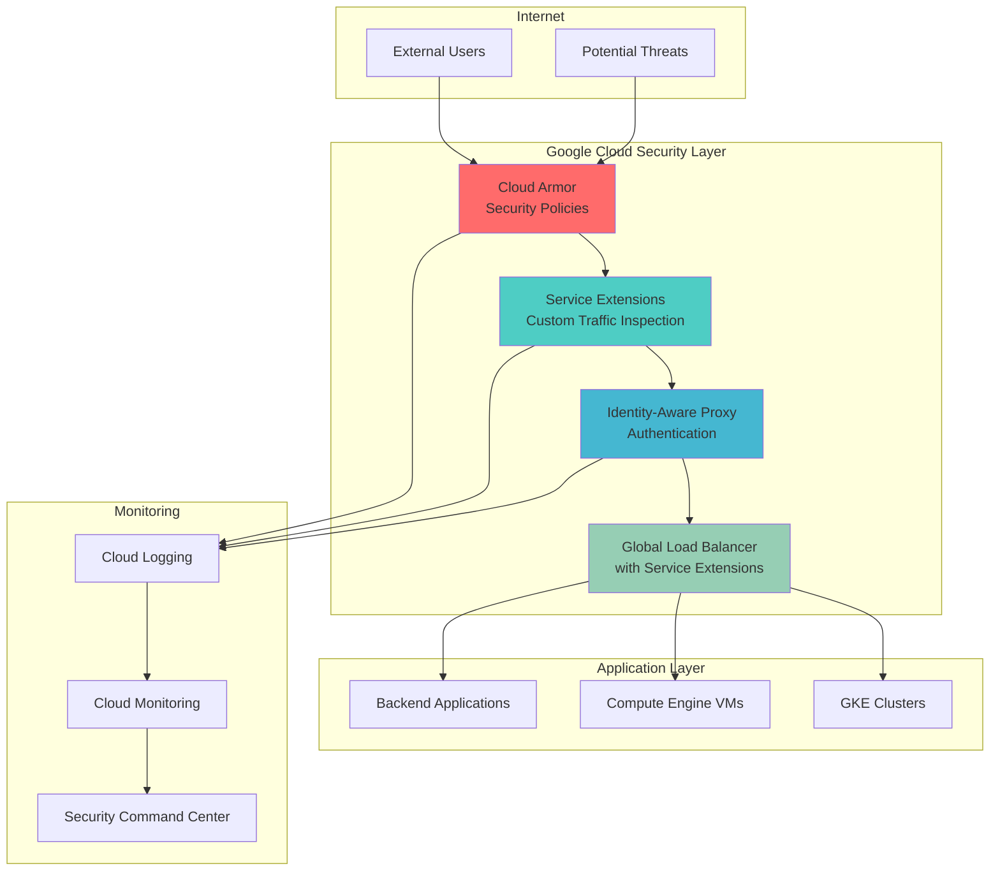

# Zero-Trust Network Security with Service Extensions and Cloud Armor

## Problem

Modern organizations face sophisticated cyber threats that easily bypass traditional perimeter-based security models. With increasing adoption of cloud services, remote work, and mobile devices, the network perimeter has essentially dissolved, making it impossible to distinguish between trusted and untrusted traffic based solely on network location. This creates significant security vulnerabilities where attackers who breach the perimeter gain broad access to internal resources, potentially leading to data breaches, compliance violations, and business disruption.

## Solution

This recipe implements a comprehensive zero-trust network security architecture using Google Cloud's Service Extensions feature combined with Cloud Armor and Identity-Aware Proxy. The solution creates custom security policies that inspect traffic at the load balancer level, enforce user authentication through IAP, and provide DDoS protection through Cloud Armor. This multi-layered approach ensures that every request is verified, authenticated, and authorized before accessing protected resources.

## Architecture Diagram



## Prerequisites

1. Google Cloud project with billing enabled and appropriate IAM permissions (Security Admin, Network Admin, Service Account Admin)
2. Google Cloud CLI (gcloud) installed and configured or Google Cloud Shell access
3. Basic understanding of Google Cloud networking, load balancing, and security concepts
4. Knowledge of zero-trust security principles and web application security
5. Estimated cost: $50-$100/month for testing environment (varies based on traffic volume and resource usage)

> **Note**: This recipe uses Google Cloud's Service Extensions feature which may have regional availability limitations. Verify feature availability in your target region before proceeding.

## Preparation

```bash
# Set environment variables
export PROJECT_ID=$(gcloud config get-value project)
export REGION="us-central1"
export ZONE="us-central1-a"

# Generate unique identifiers for resources
RANDOM_SUFFIX=$(openssl rand -hex 3)
export APP_NAME="zero-trust-app-${RANDOM_SUFFIX}"
export NETWORK_NAME="zero-trust-vpc"
export SUBNET_NAME="zero-trust-subnet"
export SECURITY_POLICY_NAME="zero-trust-armor-policy"
export SERVICE_EXTENSION_NAME="zero-trust-extension"

# Set default project and region
gcloud config set project ${PROJECT_ID}
gcloud config set compute/region ${REGION}
gcloud config set compute/zone ${ZONE}

# Enable required APIs
gcloud services enable compute.googleapis.com
gcloud services enable iap.googleapis.com
gcloud services enable logging.googleapis.com
gcloud services enable monitoring.googleapis.com
gcloud services enable servicedirectory.googleapis.com
gcloud services enable cloudresourcemanager.googleapis.com

echo "✅ Environment configured for project: ${PROJECT_ID}"
echo "✅ Resource prefix: ${APP_NAME}"
```

## Steps

1. **Create Custom VPC Network with Security-First Design**:

   Zero-trust architecture requires granular network control and segmentation. Google Cloud VPC provides the foundation for implementing network-level security controls through custom subnets, firewall rules, and private connectivity. This approach eliminates the traditional network perimeter and enables fine-grained access control at every network layer.

   ```bash
   # Create custom VPC network
   gcloud compute networks create ${NETWORK_NAME} \
       --subnet-mode custom \
       --bgp-routing-mode global \
       --description "Zero-trust network for secure applications"
   
   # Create subnet with private Google access
   gcloud compute networks subnets create ${SUBNET_NAME} \
       --network ${NETWORK_NAME} \
       --range 10.0.0.0/24 \
       --region ${REGION} \
       --enable-private-ip-google-access \
       --description "Subnet for zero-trust application backends"
   
   echo "✅ VPC network created with secure subnet configuration"
   ```

   The custom VPC establishes network isolation and enables private Google access, ensuring backend resources can communicate with Google services without exposure to the public internet. This foundational step is crucial for implementing defense-in-depth security principles.

2. **Deploy Sample Application Backend for Security Testing**:

   A realistic backend application is essential for demonstrating zero-trust security controls. This Compute Engine instance will serve as the protected resource that requires authentication and authorization. The application simulates a typical web service that handles sensitive business data and user interactions.

   ```bash
   # Create service account for backend instances
   gcloud iam service-accounts create ${APP_NAME}-backend \
       --display-name "Zero Trust Backend Service Account" \
       --description "Service account for backend instances"
   
   # Create backend compute instance
   gcloud compute instances create ${APP_NAME}-backend \
       --zone ${ZONE} \
       --machine-type e2-medium \
       --subnet ${SUBNET_NAME} \
       --no-address \
       --service-account ${APP_NAME}-backend@${PROJECT_ID}.iam.gserviceaccount.com \
       --scopes cloud-platform \
       --image-family ubuntu-2004-lts \
       --image-project ubuntu-os-cloud \
       --metadata startup-script='#!/bin/bash
   apt-get update
   apt-get install -y nginx
   cat > /var/www/html/index.html << EOF
   <!DOCTYPE html>
   <html><head><title>Zero Trust Protected App</title></head>
   <body>
   <h1>Secure Application</h1>
   <p>This application is protected by zero-trust security.</p>
   <p>Request processed at: $(date)</p>
   <p>Server: $(hostname)</p>
   </body></html>
   EOF
   systemctl enable nginx
   systemctl start nginx'
   
   echo "✅ Backend application deployed with secure configuration"
   ```

   The backend instance runs without a public IP address, demonstrating the zero-trust principle of private-by-default networking. All access must flow through the load balancer and security controls we'll configure in subsequent steps.

3. **Configure Cloud Armor Security Policy with Advanced Protection**:

   Cloud Armor provides the first line of defense against DDoS attacks, OWASP Top 10 vulnerabilities, and malicious traffic. The security policy implements rate limiting, geographic restrictions, and signature-based detection to filter malicious requests before they reach your applications.

   ```bash
   # Create Cloud Armor security policy
   gcloud compute security-policies create ${SECURITY_POLICY_NAME} \
       --description "Zero-trust security policy with DDoS and WAF protection" \
       --type CLOUD_ARMOR
   
   # Add rate limiting rule
   gcloud compute security-policies rules create 1000 \
       --security-policy ${SECURITY_POLICY_NAME} \
       --expression "true" \
       --action "rate-based-ban" \
       --rate-limit-threshold-count 100 \
       --rate-limit-threshold-interval-sec 60 \
       --ban-duration-sec 300 \
       --conform-action allow \
       --exceed-action deny-429 \
       --enforce-on-key IP \
       --description "Rate limiting rule - 100 requests per minute per IP"
   
   # Add geo-blocking rule (example: block traffic from high-risk countries)
   gcloud compute security-policies rules create 2000 \
       --security-policy ${SECURITY_POLICY_NAME} \
       --expression "origin.region_code == 'CN' || origin.region_code == 'RU'" \
       --action deny-403 \
       --description "Block traffic from high-risk geographic regions"
   
   # Add OWASP Core Rule Set protection
   gcloud compute security-policies rules create 3000 \
       --security-policy ${SECURITY_POLICY_NAME} \
       --expression "evaluatePreconfiguredExpr('xss-stable')" \
       --action deny-403 \
       --description "Block XSS attacks using OWASP rules"
   
   echo "✅ Cloud Armor security policy configured with multi-layer protection"
   ```

   The security policy implements a defense-in-depth approach with rate limiting to prevent abuse, geographic filtering to block known threat vectors, and signature-based detection for common web application attacks. This creates a robust first line of defense for your zero-trust architecture.

4. **Create Service Extension for Custom Traffic Inspection**:

   Service Extensions enable custom security logic at the load balancer level, allowing you to implement organization-specific security policies, advanced threat detection, and custom authentication flows. This step creates a Cloud Run service that processes traffic and makes security decisions in real-time.

   ```bash
   # Create directory for service extension code
   mkdir -p /tmp/service-extension
   cd /tmp/service-extension
   
   # Create service extension application
   cat > main.py << 'EOF'
   import json
   import logging
   from flask import Flask, request, jsonify
   
   app = Flask(__name__)
   logging.basicConfig(level=logging.INFO)
   
   @app.route('/process', methods=['POST'])
   def process_request():
       try:
           # Parse the request from the load balancer
           data = request.get_json()
           headers = data.get('headers', {})
           path = data.get('path', '')
           method = data.get('method', '')
           
           # Custom security logic
           security_score = 100
           risk_factors = []
           
           # Check for suspicious patterns
           if 'admin' in path.lower():
               security_score -= 30
               risk_factors.append('Admin path access')
           
           # Check user agent
           user_agent = headers.get('user-agent', '').lower()
           if 'bot' in user_agent or 'crawler' in user_agent:
               security_score -= 20
               risk_factors.append('Bot user agent')
           
           # Check request method
           if method in ['PUT', 'DELETE', 'PATCH']:
               security_score -= 10
               risk_factors.append('Destructive HTTP method')
           
           # Make security decision
           if security_score < 50:
               logging.warning(f"Blocking request: {risk_factors}")
               return jsonify({
                   'action': 'DENY',
                   'status_code': 403,
                   'body': 'Access denied by security policy'
               })
           
           # Add security headers to response
           response_headers = {
               'X-Security-Score': str(security_score),
               'X-Frame-Options': 'DENY',
               'X-Content-Type-Options': 'nosniff'
           }
           
           logging.info(f"Allowing request with score: {security_score}")
           return jsonify({
               'action': 'ALLOW',
               'headers': response_headers
           })
           
       except Exception as e:
           logging.error(f"Error processing request: {e}")
           return jsonify({'action': 'ALLOW'}), 500
   
   if __name__ == '__main__':
       app.run(host='0.0.0.0', port=8080)
   EOF
   
   # Create requirements file
   cat > requirements.txt << 'EOF'
   Flask==2.3.3
   gunicorn==21.2.0
   EOF
   
   # Create Dockerfile
   cat > Dockerfile << 'EOF'
   FROM python:3.11-slim
   WORKDIR /app
   COPY requirements.txt .
   RUN pip install -r requirements.txt
   COPY main.py .
   EXPOSE 8080
   CMD ["gunicorn", "--bind", "0.0.0.0:8080", "main:app"]
   EOF
   
   # Deploy to Cloud Run
   gcloud run deploy ${SERVICE_EXTENSION_NAME} \
       --source . \
       --region ${REGION} \
       --allow-unauthenticated \
       --memory 512Mi \
       --cpu 1 \
       --max-instances 10 \
       --description "Service extension for zero-trust traffic inspection"
   
   # Get service URL
   EXTENSION_URL=$(gcloud run services describe ${SERVICE_EXTENSION_NAME} \
       --region ${REGION} --format "value(status.url)")
   
   echo "✅ Service extension deployed at: ${EXTENSION_URL}"
   cd -
   ```

   The service extension implements custom security logic that analyzes each request and assigns a security score based on various risk factors. This demonstrates how organizations can implement proprietary security algorithms and business-specific threat detection within the zero-trust framework.

5. **Configure Identity-Aware Proxy for User Authentication**:

   Identity-Aware Proxy provides centralized authentication and authorization, ensuring that only authenticated and authorized users can access protected resources. IAP integrates with Google Identity and external identity providers to enforce zero-trust principles at the application level.

   ```bash
   # Create OAuth consent screen (if not already configured)
   echo "Creating OAuth consent configuration..."
   
   # Create IAP-secured web service backend
   gcloud compute backend-services create ${APP_NAME}-backend-service \
       --protocol HTTP \
       --port-name http \
       --health-checks-region ${REGION} \
       --global \
       --iap \
       --description "Backend service with IAP protection"
   
   # Create health check
   gcloud compute health-checks create http ${APP_NAME}-health-check \
       --port 80 \
       --request-path / \
       --check-interval 30s \
       --timeout 10s \
       --healthy-threshold 2 \
       --unhealthy-threshold 3 \
       --description "Health check for zero-trust backends"
   
   # Update backend service with health check
   gcloud compute backend-services update ${APP_NAME}-backend-service \
       --health-checks ${APP_NAME}-health-check \
       --global
   
   # Create instance group for backend
   gcloud compute instance-groups unmanaged create ${APP_NAME}-ig \
       --zone ${ZONE} \
       --description "Instance group for zero-trust backend"
   
   # Add instance to group
   gcloud compute instance-groups unmanaged add-instances ${APP_NAME}-ig \
       --instances ${APP_NAME}-backend \
       --zone ${ZONE}
   
   # Add backend to service
   gcloud compute backend-services add-backend ${APP_NAME}-backend-service \
       --instance-group ${APP_NAME}-ig \
       --instance-group-zone ${ZONE} \
       --global
   
   echo "✅ Backend service configured with IAP protection"
   ```

   IAP provides a centralized security checkpoint that authenticates users before they can access any backend resources. This eliminates the need for application-level authentication and ensures consistent security policies across all services.

6. **Create Global Load Balancer with Service Extensions Integration**:

   The global load balancer integrates all security components and routes traffic through the zero-trust security pipeline. Service Extensions are configured as part of the load balancing data path to implement custom security policies alongside Cloud Armor and IAP protection.

   ```bash
   # Create URL map
   gcloud compute url-maps create ${APP_NAME}-url-map \
       --default-service ${APP_NAME}-backend-service \
       --description "URL map for zero-trust application"
   
   # Create SSL certificate (self-signed for testing)
   gcloud compute ssl-certificates create ${APP_NAME}-ssl-cert \
       --domains ${APP_NAME}.example.com \
       --global \
       --description "SSL certificate for zero-trust application"
   
   # Create HTTPS proxy
   gcloud compute target-https-proxies create ${APP_NAME}-https-proxy \
       --url-map ${APP_NAME}-url-map \
       --ssl-certificates ${APP_NAME}-ssl-cert \
       --global-ssl-certificates \
       --description "HTTPS proxy with SSL termination"
   
   # Create global forwarding rule
   gcloud compute forwarding-rules create ${APP_NAME}-forwarding-rule \
       --global \
       --target-https-proxy ${APP_NAME}-https-proxy \
       --ports 443 \
       --description "Global forwarding rule for HTTPS traffic"
   
   # Get load balancer IP
   LB_IP=$(gcloud compute forwarding-rules describe ${APP_NAME}-forwarding-rule \
       --global --format "value(IPAddress)")
   
   echo "✅ Global load balancer created with IP: ${LB_IP}"
   
   # Attach Cloud Armor policy to backend service
   gcloud compute backend-services update ${APP_NAME}-backend-service \
       --security-policy ${SECURITY_POLICY_NAME} \
       --global
   
   echo "✅ Cloud Armor policy attached to backend service"
   ```

   The load balancer creates a single entry point for all traffic and enforces the complete zero-trust security pipeline. Each request flows through Cloud Armor for threat detection, Service Extensions for custom security logic, and IAP for authentication before reaching backend services.

7. **Configure Comprehensive Security Monitoring and Logging**:

   Effective zero-trust implementation requires comprehensive visibility into all security events, user activities, and potential threats. Cloud Logging and Security Command Center provide centralized monitoring and alerting for the entire security infrastructure.

   ```bash
   # Enable audit logs for IAP
   cat > /tmp/audit-policy.yaml << EOF
   auditConfigs:
   - service: iap.googleapis.com
     auditLogConfigs:
     - logType: ADMIN_READ
     - logType: DATA_READ
     - logType: DATA_WRITE
   - service: compute.googleapis.com
     auditLogConfigs:
     - logType: ADMIN_READ
     - logType: DATA_WRITE
   EOF
   
   # Create log sink for security events
   gcloud logging sinks create zero-trust-security-sink \
       storage.googleapis.com/${PROJECT_ID}-security-logs \
       --log-filter='protoPayload.serviceName="iap.googleapis.com" OR 
                     protoPayload.serviceName="compute.googleapis.com" OR
                     resource.type="gce_instance" OR
                     resource.type="http_load_balancer"' \
       --description "Security events from zero-trust infrastructure"
   
   # Create monitoring workspace
   gcloud alpha monitoring workspaces create \
       --display-name "Zero Trust Security Monitoring"
   
   # Create alerting policy for security events
   cat > /tmp/alert-policy.json << EOF
   {
     "displayName": "Zero Trust Security Alerts",
     "documentation": {
       "content": "Alert for suspicious security events in zero-trust infrastructure"
     },
     "conditions": [
       {
         "displayName": "High rate of IAP denials",
         "conditionThreshold": {
           "filter": "resource.type=\"gae_app\" AND metric.type=\"logging.googleapis.com/user/iap_denied_requests\"",
           "comparison": "COMPARISON_GREATER_THAN",
           "thresholdValue": "10",
           "duration": "300s"
         }
       }
     ],
     "enabled": true
   }
   EOF
   
   echo "✅ Security monitoring and logging configured"
   echo "✅ Log sink created for centralized security event collection"
   ```

   Comprehensive logging provides the visibility needed to detect threats, investigate incidents, and continuously improve security posture. The monitoring configuration enables real-time alerting for security events and suspicious activities.

## Validation & Testing

1. **Verify Cloud Armor Security Policy Protection**:

   ```bash
   # Test rate limiting (this should trigger rate limiting after multiple requests)
   for i in {1..10}; do
     curl -s -o /dev/null -w "%{http_code}\n" \
       "https://${LB_IP}" \
       -H "Host: ${APP_NAME}.example.com" \
       --insecure
     sleep 1
   done
   
   # Check security policy status
   gcloud compute security-policies describe ${SECURITY_POLICY_NAME} \
       --format="table(name,rules[].priority,rules[].action)"
   ```

   Expected output: Initial requests should return 200, followed by 429 (rate limited) responses after threshold is exceeded.

2. **Test Service Extension Custom Security Logic**:

   ```bash
   # Test request that should be allowed
   curl -X GET "https://${LB_IP}/safe-path" \
       -H "Host: ${APP_NAME}.example.com" \
       -H "User-Agent: Mozilla/5.0 (trusted-browser)" \
       --insecure -v
   
   # Test request that should trigger security extension
   curl -X DELETE "https://${LB_IP}/admin/delete" \
       -H "Host: ${APP_NAME}.example.com" \
       -H "User-Agent: automated-bot" \
       --insecure -v
   ```

   Expected output: First request should succeed with security headers, second should be blocked by service extension.

3. **Verify IAP Authentication Enforcement**:

   ```bash
   # Attempt to access without authentication (should redirect to Google sign-in)
   curl -L "https://${LB_IP}" \
       -H "Host: ${APP_NAME}.example.com" \
       --insecure -v
   
   # Check IAP configuration
   gcloud iap web get-iam-policy \
       --resource-type=backend-service \
       --service=${APP_NAME}-backend-service
   ```

   Expected output: Requests should be redirected to Google authentication or return 401/403 status codes.

4. **Validate Security Logging and Monitoring**:

   ```bash
   # Check security logs
   gcloud logging read \
       'protoPayload.serviceName="iap.googleapis.com" OR 
        protoPayload.serviceName="compute.googleapis.com"' \
       --limit=10 --format=json
   
   # Verify monitoring metrics
   gcloud monitoring metrics list \
       --filter="metric.type:iap OR metric.type:loadbalancing"
   ```

   Expected output: Security events should be logged with detailed metadata for analysis and alerting.

## Cleanup

1. **Remove Global Load Balancer Components**:

   ```bash
   # Delete forwarding rule
   gcloud compute forwarding-rules delete ${APP_NAME}-forwarding-rule \
       --global \
       --quiet
   
   # Delete HTTPS proxy
   gcloud compute target-https-proxies delete ${APP_NAME}-https-proxy \
       --quiet
   
   echo "✅ Load balancer components removed"
   ```

2. **Delete Security Policies and Service Extensions**:

   ```bash
   # Delete Cloud Armor security policy
   gcloud compute security-policies delete ${SECURITY_POLICY_NAME} \
       --quiet
   
   # Delete Service Extension Cloud Run service
   gcloud run services delete ${SERVICE_EXTENSION_NAME} \
       --region ${REGION} \
       --quiet
   
   echo "✅ Security policies and extensions cleaned up"
   ```

3. **Remove Backend Services and Instances**:

   ```bash
   # Delete backend service
   gcloud compute backend-services delete ${APP_NAME}-backend-service \
       --global \
       --quiet
   
   # Delete instance group
   gcloud compute instance-groups unmanaged delete ${APP_NAME}-ig \
       --zone ${ZONE} \
       --quiet
   
   # Delete compute instance
   gcloud compute instances delete ${APP_NAME}-backend \
       --zone ${ZONE} \
       --quiet
   
   echo "✅ Backend services and instances removed"
   ```

4. **Clean Up Network and Security Resources**:

   ```bash
   # Delete SSL certificate
   gcloud compute ssl-certificates delete ${APP_NAME}-ssl-cert \
       --global \
       --quiet
   
   # Delete URL map
   gcloud compute url-maps delete ${APP_NAME}-url-map \
       --quiet
   
   # Delete health check
   gcloud compute health-checks delete ${APP_NAME}-health-check \
       --quiet
   
   # Delete subnet and network
   gcloud compute networks subnets delete ${SUBNET_NAME} \
       --region ${REGION} \
       --quiet
   
   gcloud compute networks delete ${NETWORK_NAME} \
       --quiet
   
   # Delete service account
   gcloud iam service-accounts delete \
       ${APP_NAME}-backend@${PROJECT_ID}.iam.gserviceaccount.com \
       --quiet
   
   echo "✅ Network and security resources cleaned up"
   echo "✅ Zero-trust infrastructure completely removed"
   ```

## Discussion

This recipe demonstrates a comprehensive zero-trust network security implementation using Google Cloud's advanced security services. The architecture shifts from traditional perimeter-based security to a model where every request is verified, authenticated, and authorized before accessing protected resources.

The implementation leverages Google Cloud's Service Extensions, a powerful feature that enables custom security logic directly in the load balancing data path. This capability allows organizations to implement proprietary threat detection algorithms, business-specific security policies, and advanced traffic analysis without deploying additional infrastructure. Service Extensions operate at near-native performance levels while providing the flexibility to integrate with external security systems and databases.

Cloud Armor provides enterprise-grade DDoS protection and web application firewall capabilities, implementing the OWASP Core Rule Set and adaptive protection against evolving threats. The rate limiting and geographic filtering demonstrate how organizations can implement defense-in-depth strategies that automatically adapt to threat patterns. The integration with Google's global threat intelligence ensures protection against the latest attack vectors and malicious IP addresses.

Identity-Aware Proxy represents a fundamental shift in application security, moving authentication from individual applications to a centralized security service. This approach eliminates the complexity of managing authentication across multiple services while providing consistent security policies and audit trails. IAP's integration with Google Identity and external identity providers enables seamless single sign-on experiences while maintaining strict security controls.

The comprehensive logging and monitoring configuration provides the visibility essential for effective zero-trust implementation. By centralizing security events from all components, organizations can detect sophisticated attack patterns, investigate security incidents, and continuously improve their security posture. The integration with Security Command Center enables correlation of security events across the entire Google Cloud environment.

This zero-trust architecture scales automatically with Google Cloud's global infrastructure, providing consistent security policies across multiple regions and availability zones. The serverless components (Cloud Run, Cloud Armor, IAP) eliminate the operational overhead of managing security infrastructure while providing enterprise-grade availability and performance.

> **Tip**: Monitor security logs regularly and use Cloud Security Command Center to correlate security events across your entire Google Cloud environment. Consider implementing automated incident response workflows using Cloud Functions and Pub/Sub.

For additional guidance on zero-trust implementation, reference the [Google Cloud Zero Trust Architecture Guide](https://cloud.google.com/architecture/framework/security/implement-zero-trust), [Cloud Armor Security Policies Documentation](https://cloud.google.com/armor/docs/security-policy-overview), [Service Extensions Overview](https://cloud.google.com/service-extensions/docs/overview), [Identity-Aware Proxy Concepts](https://cloud.google.com/iap/docs/concepts-overview), and [Security Command Center Best Practices](https://cloud.google.com/security-command-center/docs/how-to-use-security-command-center).

> **Warning**: Ensure proper OAuth consent screen configuration for production IAP deployments. Test all security policies thoroughly in a staging environment before applying to production workloads.

## Challenge

Extend this zero-trust security implementation with these advanced enhancements:

1. **Implement Advanced Threat Detection**: Integrate with Google Cloud's Chronicle SIEM to correlate security events across multiple data sources and implement automated threat response workflows using Cloud Functions and Pub/Sub messaging.

2. **Add Device Trust Verification**: Enhance the Service Extension to validate device certificates and implement device-based access controls, creating a comprehensive endpoint security strategy that verifies both user identity and device compliance.

3. **Deploy Multi-Region Security**: Expand the architecture to multiple regions with consistent security policies, implementing cross-region traffic analysis and threat intelligence sharing for global security visibility.

4. **Integrate External Security Tools**: Connect third-party security tools (SIEM, SOAR, threat intelligence feeds) through the Service Extension interface, creating a unified security ecosystem that leverages best-of-breed security technologies.

5. **Implement Behavioral Analytics**: Enhance the custom security logic to include user behavior analysis, anomaly detection, and risk-based authentication that adapts security controls based on user patterns and contextual information.

## Infrastructure Code

*Infrastructure code will be generated after recipe approval.*